# Architecture & Design

<cite>
**Referenced Files in This Document**
- [README.md](file://README.md)
</cite>

## Table of Contents
1. [Introduction](#introduction)
2. [Project Structure](#project-structure)
3. [Core Components](#core-components)
4. [Architecture Overview](#architecture-overview)
5. [Detailed Component Analysis](#detailed-component-analysis)
6. [Dependency Analysis](#dependency-analysis)
7. [Performance Considerations](#performance-considerations)
8. [Troubleshooting Guide](#troubleshooting-guide)
9. [Conclusion](#conclusion)
10. [Appendices](#appendices)

## Introduction

The Enterprise Network Automation Platform is a production-grade, vendor-agnostic network automation system designed for enterprise-scale operations. It provides comprehensive automation capabilities for managing thousands of network devices across multi-vendor, multi-region environments, simulating how Fortune 100 organizations automate their entire network infrastructure lifecycle.

This platform implements Infrastructure as Code (IaC), GitOps principles, CI/CD pipelines, compliance enforcement, observability, and security best practices. Every configuration, policy, template, test, pipeline, dashboard, and bot is stored in Git, ensuring full traceability and version control while maintaining strict security through centralized secrets management.

## Project Structure

The platform follows a modular, feature-based architecture with clear separation of concerns:

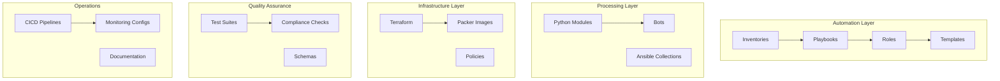

**Diagram sources**
- [README.md:103-180](file://README.md#L103-L180)

**Section sources**
- [README.md:103-180](file://README.md#L103-L180)

## Core Components

### Control Plane Architecture

The control plane consists of multiple automation engines working in concert:

| Component | Technology | Purpose |
|-----------|------------|---------|
| **Ansible Engine** | Ansible 2.15+ | Device configuration management, playbooks execution |
| **Python Modules** | Python 3.11+ | Custom automation logic, API integrations, data processing |
| **Automation Bots** | REST APIs + ChatOps | Self-service network operations, automated workflows |
| **Terraform** | Terraform 1.5+ | Cloud networking infrastructure provisioning |

### Data Plane Components

The data plane encompasses all managed network infrastructure:

| Device Type | Vendors Supported | Protocols |
|-------------|------------------|-----------|
| **Core Routers** | Cisco IOS/IOS-XE/NX-OS, Juniper MX | SSH, NETCONF, RESTCONF |
| **Distribution Switches** | Arista EOS, Cisco NX-OS | SSH, eAPI, NETCONF |
| **Access Switches** | Cisco IOS-XE, Arista EOS | SSH, eAPI |
| **Firewalls** | Palo Alto PAN-OS, Fortinet FortiOS, Check Point Gaia | SSH, API |
| **Load Balancers** | F5 BIG-IP | SSH, iControl REST |
| **VPN Gateways** | Multiple vendors | SSH, API |
| **Cloud Networking** | AWS VPC, Azure VNets, GCP VPC | Cloud APIs |

### Observability Layer

The monitoring stack provides comprehensive visibility:

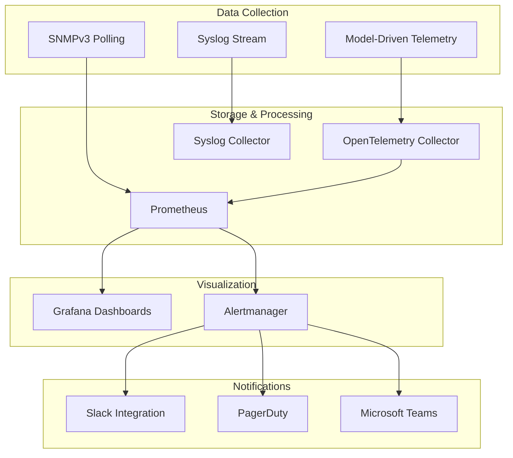

**Diagram sources**
- [README.md:587-604](file://README.md#L587-L604)

### Security Layer

Multi-provider secrets management ensures secure credential handling:

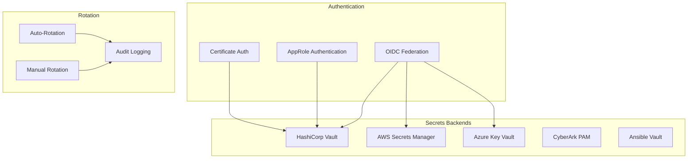

**Diagram sources**
- [README.md:343-357](file://README.md#L343-L357)

**Section sources**
- [README.md:52-99](file://README.md#L52-L99)
- [README.md:184-226](file://README.md#L184-L226)
- [README.md:339-368](file://README.md#L339-L368)

## Architecture Overview

The platform implements a layered architecture with clear separation between control plane, data plane, and supporting services:

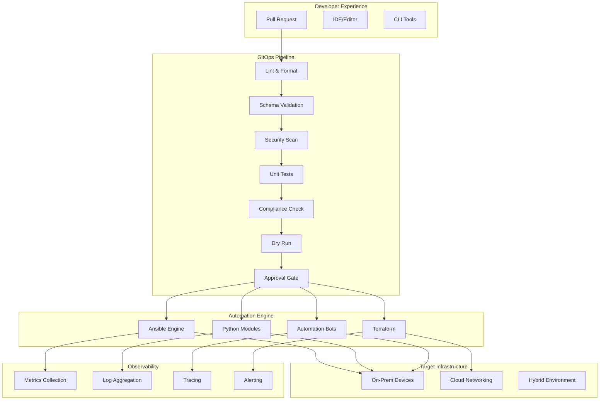

**Diagram sources**
- [README.md:36-50](file://README.md#L36-L50)
- [README.md:483-501](file://README.md#L483-L501)

## Detailed Component Analysis

### Inventory Management System

The inventory system provides structured device discovery and organization:

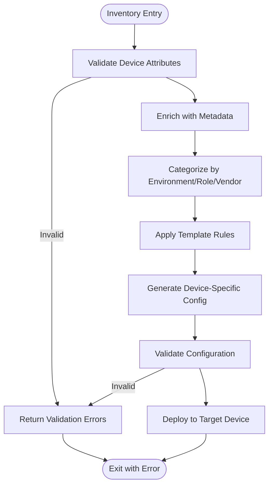

**Diagram sources**
- [README.md:284-335](file://README.md#L284-L335)

### Configuration Generation Pipeline

The configuration generation process transforms structured data into device-specific configurations:

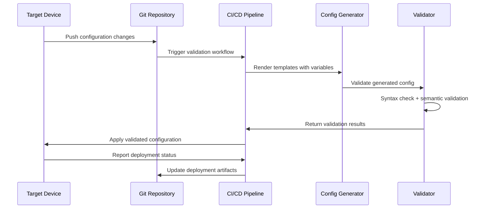

**Diagram sources**
- [README.md:438-456](file://README.md#L438-L456)

### Compliance Enforcement Engine

The compliance system enforces security policies at every stage:

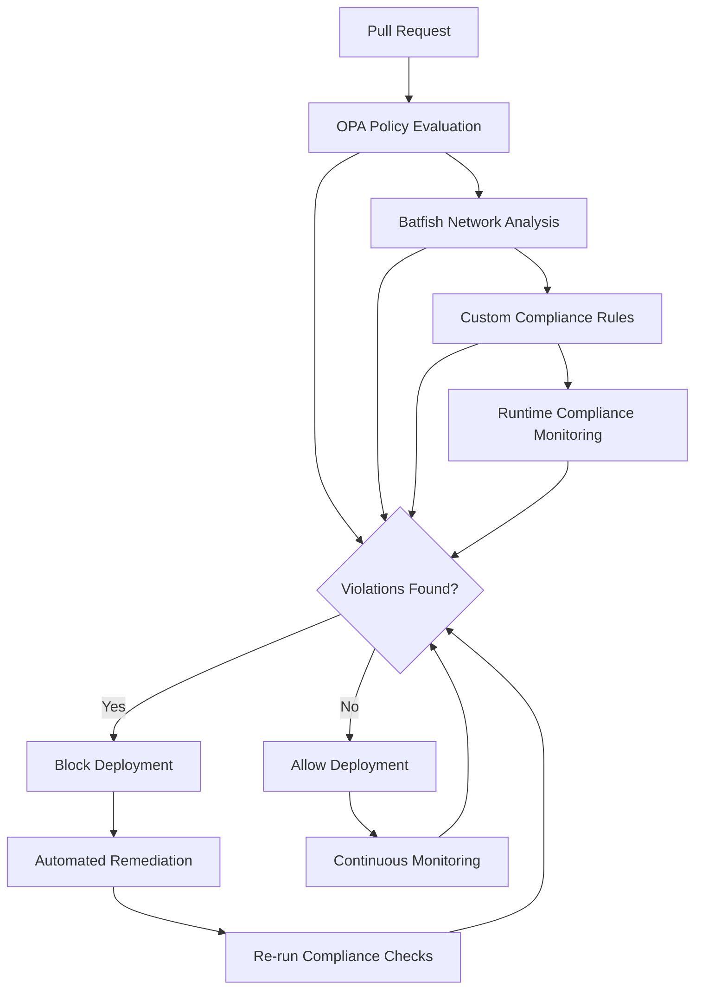

**Diagram sources**
- [README.md:548-579](file://README.md#L548-L579)

### GitOps Workflow Implementation

The GitOps workflow ensures consistent, auditable deployments:

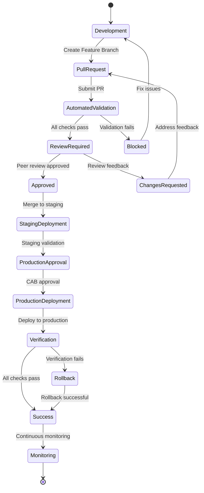

**Diagram sources**
- [README.md:619-638](file://README.md#L619-L638)

### Bot Architecture

Automation bots provide self-service capabilities through REST APIs:

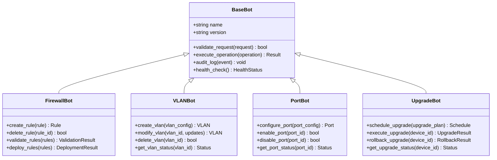

**Diagram sources**
- [README.md:460-476](file://README.md#L460-L476)

**Section sources**
- [README.md:284-335](file://README.md#L284-L335)
- [README.md:438-456](file://README.md#L438-L456)
- [README.md:548-579](file://README.md#L548-L579)
- [README.md:619-638](file://README.md#L619-L638)
- [README.md:460-476](file://README.md#L460-L476)

## Dependency Analysis

### Technology Stack Dependencies

The platform relies on a carefully selected technology stack with specific version requirements:

| Category | Technology | Version | Purpose |
|----------|------------|---------|---------|
| **Core Runtime** | Python | 3.11+ | Primary automation language |
| **Configuration Management** | Ansible | 2.15+ | Device configuration automation |
| **Infrastructure as Code** | Terraform | 1.5+ | Cloud networking provisioning |
| **Template Engine** | Jinja2 | Latest | Configuration template rendering |
| **Network Libraries** | NAPALM, Netmiko, Nornir | Latest | Multi-vendor network abstraction |
| **Testing Framework** | pytest, Molecule | Latest | Comprehensive test suite |
| **Monitoring** | Prometheus, Grafana | Latest | Metrics collection and visualization |
| **Secrets Management** | HashiCorp Vault | Latest | Centralized secrets management |

### External Service Dependencies

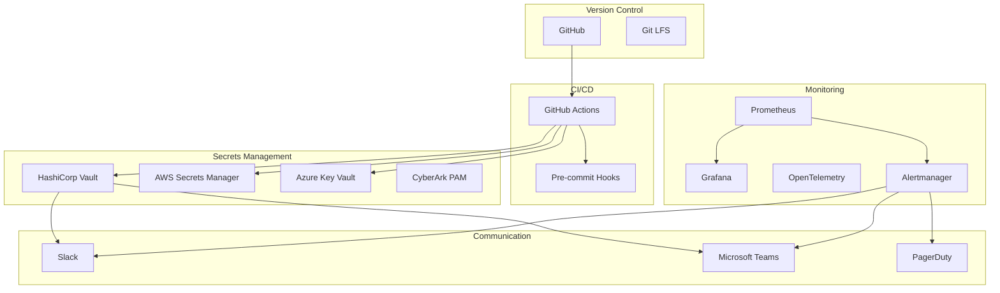

**Diagram sources**
- [README.md:184-199](file://README.md#L184-L199)

**Section sources**
- [README.md:184-226](file://README.md#L184-L226)

## Performance Considerations

### Scalability Architecture

The platform is designed for enterprise-scale operations with several scalability considerations:

- **Horizontal Scaling**: Automation workers can be scaled horizontally using Kubernetes or container orchestration
- **Parallel Execution**: Ansible supports parallel playbook execution across device groups
- **Connection Pooling**: Efficient connection management for high-volume device interactions
- **Caching Strategy**: Intelligent caching of device states and configuration templates
- **Asynchronous Processing**: Non-blocking operations for long-running tasks like firmware upgrades

### Resource Requirements

For enterprise deployments supporting thousands of devices:

| Component | Minimum Resources | Recommended Resources |
|-----------|------------------|----------------------|
| **Automation Controller** | 4 CPU, 8GB RAM | 8+ CPU, 16GB+ RAM |
| **Database** | 2 CPU, 4GB RAM | 4+ CPU, 8GB+ RAM |
| **Monitoring Stack** | 2 CPU, 4GB RAM | 4+ CPU, 8GB+ RAM |
| **Secrets Management** | 2 CPU, 4GB RAM | 4+ CPU, 8GB+ RAM |

### Optimization Strategies

- **Template Caching**: Pre-compile Jinja2 templates for faster rendering
- **Connection Multiplexing**: Use persistent connections where supported
- **Batch Operations**: Group similar operations to reduce API calls
- **Intelligent Retries**: Exponential backoff with circuit breaker patterns
- **Resource Limits**: Implement rate limiting to prevent overwhelming target devices

## Troubleshooting Guide

### Common Issues and Resolutions

| Issue Category | Symptoms | Resolution Steps |
|---------------|----------|------------------|
| **Connection Issues** | Ansible timeout, SSH failures | Verify network reachability, check firewall rules, validate credentials |
| **Template Rendering** | Jinja2 syntax errors, missing variables | Use debug mode, validate template syntax, check variable definitions |
| **Compliance Failures** | Policy violations, blocked deployments | Review compliance policies, analyze violation reports, remediate issues |
| **Secrets Access** | Authentication failures, permission denied | Verify OIDC tokens, check Vault policies, validate service accounts |
| **Pipeline Failures** | CI/CD job failures, validation errors | Check GitHub Actions logs, review error messages, fix failing tests |
| **Performance Issues** | Slow deployments, resource exhaustion | Analyze performance metrics, optimize templates, scale resources |

### Diagnostic Tools

The platform provides comprehensive diagnostic capabilities:

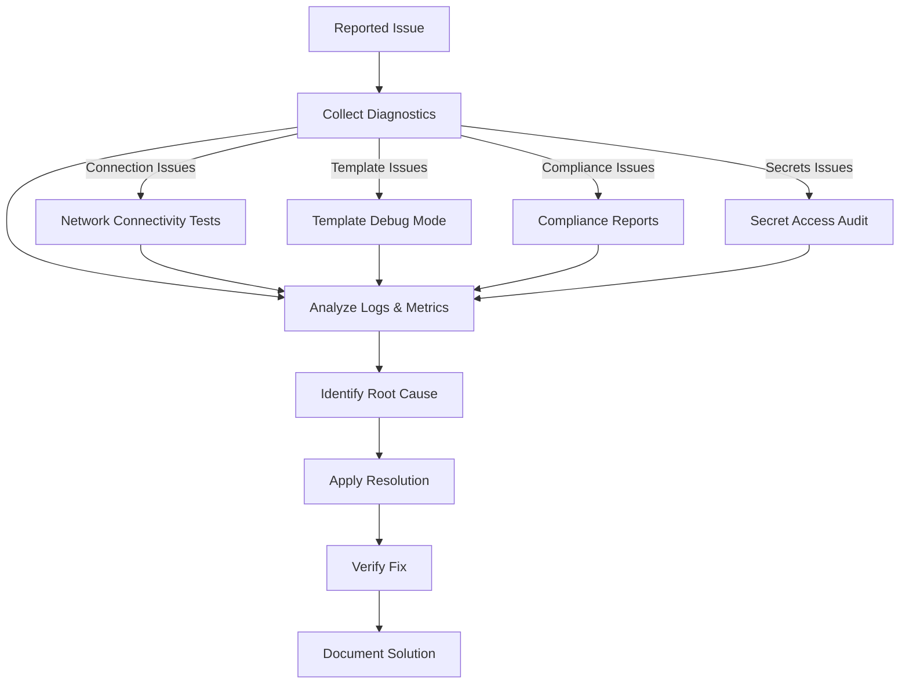

**Diagram sources**
- [README.md:674-685](file://README.md#L674-L685)

**Section sources**
- [README.md:674-685](file://README.md#L674-L685)

## Conclusion

The Enterprise Network Automation Platform represents a comprehensive solution for modern network automation challenges. Its architecture demonstrates best practices in Infrastructure as Code, GitOps, security, and observability while providing the flexibility needed for enterprise-scale operations.

Key strengths include:

- **Vendor Agnostic Design**: Support for multiple vendors and platforms through standardized interfaces
- **Enterprise-Grade Security**: Multi-provider secrets management with comprehensive audit trails
- **Comprehensive Testing**: Multi-layered testing strategy ensuring reliability and compliance
- **Scalable Architecture**: Designed for thousands of devices across multiple regions
- **Operational Excellence**: Full observability, alerting, and troubleshooting capabilities

The platform's modular design allows for incremental adoption and customization while maintaining consistency and governance across the organization.

## Appendices

### A. Version Compatibility Matrix

| Component | Minimum Version | Recommended Version | Notes |
|-----------|----------------|-------------------|-------|
| Python | 3.11 | 3.11.x LTS | Required for type hints and async features |
| Ansible | 2.15 | 2.15.x | Latest stable with enhanced Python 3.11 support |
| Terraform | 1.5 | 1.5.x | Latest stable with improved cloud provider support |
| Jinja2 | Latest | Latest | Template engine for configuration generation |
| Prometheus | Latest | Latest | Metrics collection and storage |
| Grafana | Latest | Latest | Dashboard visualization and alerting |
| Vault | Latest | Latest | Secrets management and access control |

### B. Deployment Topology Options

| Deployment Model | Use Case | Complexity | Cost |
|-----------------|----------|------------|------|
| **Single Region** | Small to medium enterprises | Low | Low |
| **Multi-Region Active/Passive** | Medium to large enterprises | Medium | Medium |
| **Multi-Region Active/Active** | Large global enterprises | High | High |
| **Cloud-Native** | Cloud-first organizations | Medium | Variable |
| **Hybrid Cloud** | Mixed environment enterprises | High | High |

### C. Compliance Standards Alignment

The platform supports compliance with major regulatory frameworks:

- **SOC 2**: Type II compliance through audit trails and access controls
- **ISO 27001**: Information security management system alignment
- **NIST CSF**: Cybersecurity framework implementation
- **PCI DSS**: Payment card industry data security standard
- **HIPAA**: Healthcare information protection requirements