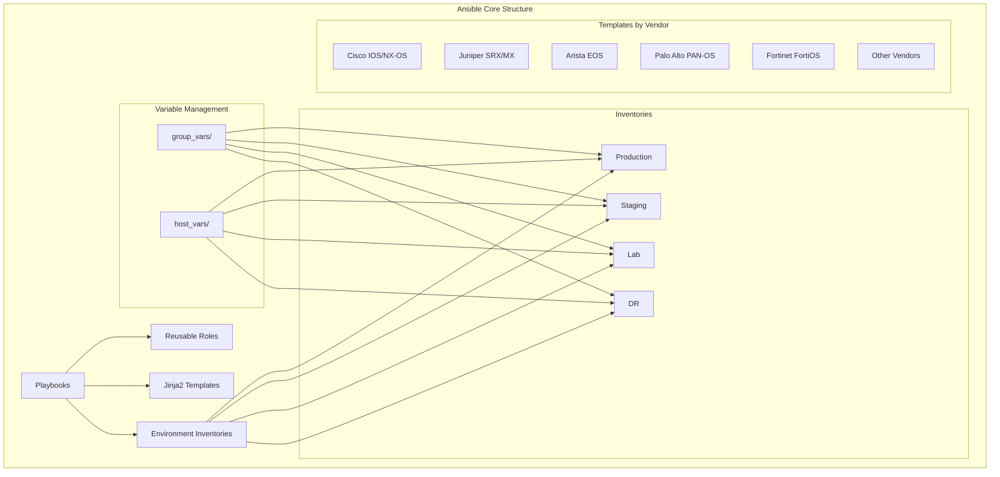
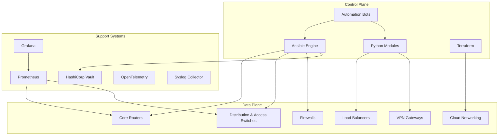
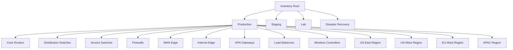
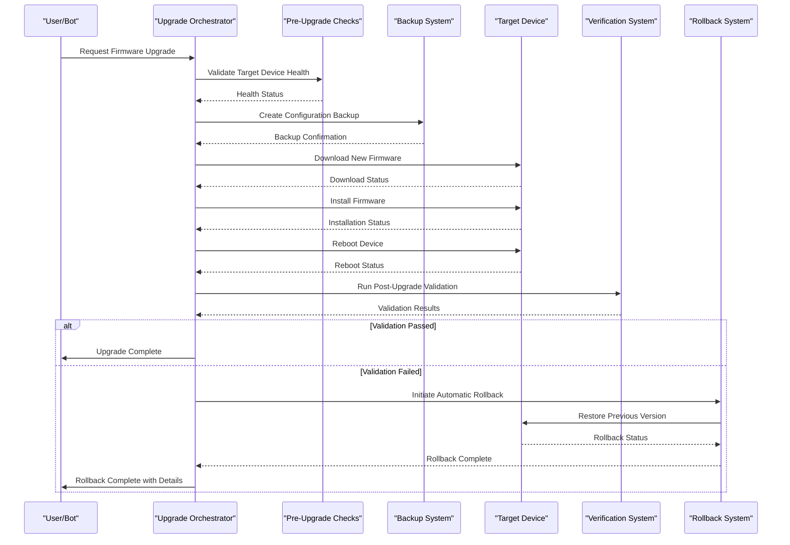
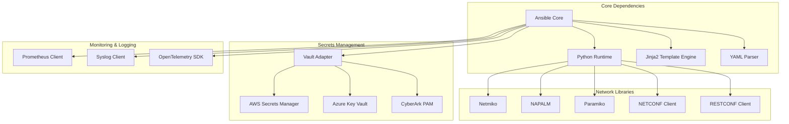

# Ansible Orchestration Layer

<cite>
**Referenced Files in This Document**
- [ansible.cfg](file://ansible.cfg)
- [README.md](file://README.md)
- [requirements.yml](file://requirements.yml)
- [.gitignore](file://.gitignore)
- [inventories/production/hosts.yml](file://inventories/production/hosts.yml)
- [inventories/staging/hosts.yml](file://inventories/staging/hosts.yml)
- [inventories/lab/hosts.yml](file://inventories/lab/hosts.yml)
- [inventories/dr/hosts.yml](file://inventories/dr/hosts.yml)
- [group_vars/all.yml](file://group_vars/all.yml)
- [host_vars/core-rtr-01-us-east.yml](file://host_vars/core-rtr-01-us-east.yml)
</cite>

## Update Summary
**Changes Made**
- Added comprehensive Ansible configuration infrastructure documentation covering ansible.cfg with production-ready defaults
- Updated connection management strategies to include SSH optimization, fact caching, and parallel execution settings
- Enhanced vault integration documentation with enterprise-grade security configurations
- Added detailed performance tuning and scalability considerations for large-scale deployments

## Table of Contents
1. [Introduction](#introduction)
2. [Project Structure](#project-structure)
3. [Core Components](#core-components)
4. [Architecture Overview](#architecture-overview)
5. [Ansible Configuration Infrastructure](#ansible-configuration-infrastructure)
6. [Detailed Component Analysis](#detailed-component-analysis)
7. [Dependency Analysis](#dependency-analysis)
8. [Performance Considerations](#performance-considerations)
9. [Troubleshooting Guide](#troubleshooting-guide)
10. [Conclusion](#conclusion)

## Introduction

This document provides comprehensive documentation for the Ansible orchestration layer within the Enterprise Network Automation Platform. The platform is designed as a production-grade, vendor-agnostic network automation solution that manages thousands of network devices across multi-vendor, multi-region environments. It demonstrates Infrastructure as Code, GitOps, CI/CD, compliance enforcement, observability, and security practices suitable for Fortune 100 organizations including banks, telecoms, and cloud-native enterprises.

The system follows core principles including Network as Code, Infrastructure as Code, GitOps, DevSecOps, Compliance as Code, Monitoring as Code, Testing as Code, and Documentation as Code. Every configuration, policy, template, test, pipeline, dashboard, and bot is stored in Git with secrets never committed.

## Project Structure

The Ansible orchestration layer follows a modular, role-based architecture organized by environment, device type, and functionality. The repository structure supports multiple environments (production, staging, lab, DR) with hierarchical variable management through group_vars and host_vars.

**Diagram sources**
- [README.md:103-180](file://README.md#L103-L180)

**Section sources**
- [README.md:103-180](file://README.md#L103-L180)

## Core Components

### Role-Based Modular Architecture

The platform implements a comprehensive role-based architecture with reusable roles for device lifecycle management, configuration templates, and operational tasks. Key components include:

#### Device Lifecycle Management
- **Initial Provisioning**: Bootstrap new devices with hostname, AAA, NTP, DNS, SSH, SNMP, Syslog, and banners
- **Configuration Management**: Apply baseline configurations and service-specific settings
- **Maintenance Operations**: Firmware upgrades, backups, and health checks
- **Compliance Enforcement**: Automated security and policy compliance checks

#### Reusable Roles Structure
- **Network Services**: VLAN, trunk, LACP, QoS, ACL, NAT, VPN configurations
- **Routing Protocols**: OSPF, BGP, IS-IS, static routes, loopback interfaces
- **High Availability**: VRRP, HSRP configurations
- **Security Hardening**: SSH hardening, certificate deployment, banner management

#### Template System
Jinja2-based configuration templates organized by vendor platform:
- Cisco platforms (IOS, NX-OS, IOS-XE)
- Juniper platforms (SRX, MX)
- Arista EOS
- Palo Alto PAN-OS
- Fortinet FortiOS
- Check Point Gaia
- F5 BIG-IP
- pfSense/OPNsense

**Section sources**
- [README.md:115-128](file://README.md#L115-L128)
- [README.md:373-435](file://README.md#L373-L435)

## Architecture Overview

The Ansible orchestration layer integrates with multiple systems to provide comprehensive network automation capabilities.

**Diagram sources**
- [README.md:54-99](file://README.md#L54-L99)

## Ansible Configuration Infrastructure

**Updated** Added comprehensive Ansible configuration infrastructure with production-ready defaults, SSH connection optimization, fact caching, vault integration, and parallel execution settings for enterprise-grade network automation.

### Ansible Configuration File (ansible.cfg)

The central Ansible configuration file provides enterprise-grade defaults optimized for large-scale network automation:

#### Performance Optimization
- **Parallel Execution**: Configured with `forks = 50` for high-throughput operations across thousands of devices
- **Connection Multiplexing**: SSH control master enabled with `ControlMaster=auto -o ControlPersist=60s` for persistent connections
- **Fact Caching**: JSON file-based caching with 24-hour timeout (`fact_caching_timeout = 86400`) to reduce API calls
- **Smart Fact Gathering**: Optimized fact collection strategy for network devices

#### Security Configuration
- **Vault Integration**: Centralized secret management via `.vault_pass` file
- **SSH Hardening**: Strict host key checking disabled for automated environments with proper key management
- **Privilege Escalation**: Enable mode authentication configured for Cisco devices
- **Audit Logging**: Comprehensive callback plugins for task profiling and timing

#### Connection Management
- **SSH Optimization**: Pipelining enabled with custom control path directory for connection reuse
- **Persistent Connections**: Configurable timeouts and retry logic for resilient network operations
- **Multi-Protocol Support**: YAML inventory plugin enabled alongside traditional formats

#### Output and Debugging
- **Structured Output**: YAML callback format for machine-readable logs
- **Task Profiling**: Built-in timer and JUnit callback plugins for performance analysis
- **Diff Mode**: Always enabled with context depth of 3 for change visibility

**Section sources**
- [ansible.cfg:1-61](file://ansible.cfg#L1-61)

### Collection Dependencies

Enterprise-grade Ansible collections are managed through requirements.yml:

| Collection | Version | Purpose |
|------------|---------|---------|
| ansible.netcommon | >=5.3.0 | Common network utilities and connection plugins |
| ansible.utils | >=2.11.0 | Network utility modules and filters |
| cisco.ios | >=5.3.0 | Cisco IOS/IOS-XE specific modules |
| cisco.nxos | >=5.3.0 | Cisco NX-OS specific modules |
| junipernetworks.junos | >=5.3.0 | Juniper Junos OS modules |
| arista.eos | >=6.2.0 | Arista EOS modules |
| paloaltonetworks.panos | >=2.18.0 | Palo Alto PAN-OS modules |
| fortinet.fortios | >=2.3.0 | Fortinet FortiOS modules |
| f5networks.f5_modules | >=1.25.0 | F5 BIG-IP modules |

**Section sources**
- [requirements.yml:1-31](file://requirements.yml#L1-31)

### Secret Management Integration

The platform implements a multi-backend secrets architecture with Ansible Vault integration:

#### Vault Configuration
- **Primary Backend**: HashiCorp Vault with OIDC federation for CI/CD pipelines
- **Fallback Options**: AWS Secrets Manager, Azure Key Vault, CyberArk PAM
- **Local Development**: Environment variables for lab environments
- **Ansible Vault**: Encrypted variable files for sensitive configuration data

#### Secret Rotation Policy
| Secret Type | Rotation Interval | Method |
|-------------|------------------|--------|
| Device passwords | 90 days | Vault auto-rotation + Ansible push |
| API tokens | 30 days | Secrets Manager + Lambda/Function |
| SSH keys | 90 days | Vault SSH CA with short-lived certs |
| TLS certificates | 1 year (auto-renew at 60 days) | ACME / Vault PKI |
| CI/CD tokens | Ephemeral | OIDC federation (no static secrets) |

**Section sources**
- [ansible.cfg:15-17](file://ansible.cfg#L15-17)
- [README.md:396-425](file://README.md#L396-L425)

## Detailed Component Analysis

### Inventory Structure Organization

The inventory system organizes devices by environment, role, region, and vendor with hierarchical variable management.

#### Environment-Based Organization

**Diagram sources**
- [README.md:288-309](file://README.md#L288-309)

#### Hierarchical Variable Management
Variables are managed through a hierarchical structure:
- **group_vars**: Shared variables by device group (e.g., all routers, all firewalls)
- **host_vars**: Per-device specific variables
- **environment-specific overrides**: Variables specific to each environment

Each inventory entry defines device attributes including:
- Network connectivity (ansible_host)
- Vendor and platform identification
- Role assignment (core_router, firewall, etc.)
- Geographic location (region, site)

**Section sources**
- [README.md:284-336](file://README.md#L284-L336)

### Playbook Patterns

The platform implements comprehensive playbook patterns for various operational scenarios:

#### Device Provisioning Playbooks
- **initial_provisioning.yml**: Complete device bootstrap with security baselines
- **hostname.yml**: Dynamic hostname assignment from inventory data
- **aaa.yml**: Authentication, Authorization, and Accounting configuration
- **ntp.yml**: Time synchronization setup
- **dns.yml**: DNS resolver configuration
- **snmp.yml**: SNMPv3 monitoring setup
- **syslog.yml**: Centralized logging configuration
- **ssh_hardening.yml**: Secure SSH configuration
- **certificates.yml**: TLS certificate deployment
- **banners.yml**: Login and MOTD banner management

#### Configuration Update Playbooks
- **vlan.yml**: VLAN creation and modification
- **trunk.yml**: Trunk interface configuration
- **lacp.yml**: Link Aggregation Control Protocol setup
- **qos.yml**: Quality of Service policy application
- **acl.yml**: Access Control List management
- **nat.yml**: Network Address Translation rules
- **vpn.yml**: Site-to-site and remote-access VPN configuration
- **firewall_rules.yml**: Firewall rule set deployment

#### Routing Protocol Playbooks
- **ospf.yml**: OSPF routing protocol configuration
- **bgp.yml**: BGP peering and policy management
- **isis.yml**: IS-IS routing protocol setup
- **static_routes.yml**: Static route management
- **loopbacks.yml**: Loopback interface configuration

#### High Availability Playbooks
- **vrrp.yml**: Virtual Router Redundancy Protocol
- **hsrp.yml**: Hot Standby Router Protocol

#### Operational Task Playbooks
- **backup.yml**: Configuration backup operations
- **restore.yml**: Configuration restoration
- **firmware_upgrade.yml**: Firmware upgrade with validation
- **firmware_rollback.yml**: Firmware rollback on failure
- **config_rollback.yml**: Configuration rollback to last known good
- **golden_config.yml**: Golden configuration baseline application
- **drift_detection.yml**: Configuration drift detection
- **compliance_scan.yml**: Security and policy compliance scanning
- **health_check.yml**: Comprehensive device health assessment
- **inventory_collection.yml**: Device inventory collection
- **neighbor_discovery.yml**: CDP/LLDP neighbor discovery
- **license_validation.yml**: License compliance validation
- **monitoring_agents.yml**: Monitoring agent deployment

**Section sources**
- [README.md:371-435](file://README.md#L371-L435)

### Connection Management Strategies

The platform implements robust connection management strategies with enterprise-grade optimizations:

#### Multi-Protocol Support
- **SSH**: Primary connection method with Netmiko/Paramiko abstraction and connection multiplexing
- **NETCONF**: For devices supporting NETCONF with capability negotiation
- **RESTCONF**: RESTful API access with YANG model support
- **SNMPv3**: Read-only operations for monitoring and polling
- **gRPC**: Model-driven telemetry streaming
- **API Integration**: Vendor-specific APIs for advanced operations

#### Connection Pooling and Retry Logic
- **Automatic Retry**: Configurable retry mechanisms for transient failures with exponential backoff
- **Connection Multiplexing**: Persistent SSH connections with control master for reduced overhead
- **Timeout Handling**: Granular timeout configuration for different operation types
- **Graceful Degradation**: Fallback mechanisms when primary protocols fail

#### Authentication and Authorization
- **Multi-Backend Secret Management**: Vault, AWS Secrets Manager, Azure Key Vault integration
- **Short-lived Credentials**: Token rotation and ephemeral credential generation
- **Role-based Access Control**: Integration with enterprise identity providers
- **Audit Logging**: Complete audit trail for all connection attempts and operations

**Section sources**
- [README.md:438-456](file://README.md#L438-L456)
- [ansible.cfg:42-54](file://ansible.cfg#L42-L54)

### Parallel Execution Patterns

The platform leverages Ansible's parallel execution capabilities with enterprise-grade optimizations:

#### Strategy Implementation
- **Configurable Forks**: Set to 50 for optimal throughput based on infrastructure capacity
- **Serial Execution**: Controlled rollout for critical changes with automatic rollback
- **Custom Strategies**: Advanced dependency resolution for complex workflows
- **Rate Limiting**: Throttling for sensitive operations to prevent resource exhaustion

#### Batch Processing
- **Device Grouping**: Optimized task execution by vendor/platform combinations
- **Dependency Resolution**: Intelligent ordering for interdependent changes
- **Circuit Breaker Patterns**: Failure isolation to prevent cascading issues
- **Progress Tracking**: Real-time execution monitoring and reporting

#### Resource Management
- **Dynamic Scaling**: Adaptive worker process allocation based on available resources
- **Memory Optimization**: Efficient processing for large inventories with lazy loading
- **CPU Utilization**: Intelligent parallelism adjustment based on system load
- **Network Bandwidth**: Throttled bulk operations to avoid saturation

**Section sources**
- [README.md:184-200](file://README.md#L184-L200)
- [ansible.cfg:7-13](file://ansible.cfg#L7-L13)

### Error Handling and Rollback Mechanisms

#### Comprehensive Error Handling
- **Pre-flight Checks**: Validation before any changes are applied using schema validation
- **Atomic Operations**: All-or-nothing change application with transaction-like behavior
- **State Verification**: Post-change validation against expected state and compliance policies
- **Graceful Degradation**: Partial success handling with detailed reporting and cleanup

#### Rollback Strategies
- **Automatic Rollback**: Triggered on verification failures with immediate remediation
- **Manual Rollback**: One-click rollback via ChatOps bots and API endpoints
- **Versioned Backups**: Configuration versioning with instant restore capabilities
- **Rollforward Procedures**: Recovery procedures for partial failures and edge cases

#### Failure Isolation
- **Circuit Breakers**: Prevent cascading failures across device groups and regions
- **Quarantine**: Automatic isolation of failing devices from active operations
- **Progressive Rollout**: Gradual deployment with health monitoring gates
- **Compensating Actions**: Cleanup operations for partial successes and cleanup

**Section sources**
- [README.md:642-671](file://README.md#L642-L671)

### Complex Workflows: Firmware Upgrades

The firmware upgrade workflow demonstrates sophisticated orchestration with pre/post checks and automated rollback:

**Diagram sources**
- [README.md:646-658](file://README.md#L646-L658)

## Dependency Analysis

The Ansible orchestration layer has well-defined dependencies and relationships between components:

**Diagram sources**
- [README.md:184-200](file://README.md#L184-L200)

**Section sources**
- [README.md:184-200](file://README.md#L184-L200)

## Performance Considerations

### Optimization Strategies
- **Parallel Execution**: Configurable forks (50) based on infrastructure capacity and device count
- **Connection Multiplexing**: Persistent SSH connections with control master for reduced overhead
- **Template Caching**: Cached template rendering for repeated operations across similar devices
- **Lazy Loading**: Deferred loading of large variable sets to minimize memory footprint
- **Incremental Updates**: Only apply necessary changes with diff-aware operations

### Scalability Patterns
- **Horizontal Scaling**: Multiple Ansible controllers for large deployments across regions
- **Role Decomposition**: Fine-grained roles for better caching and reuse across environments
- **Inventory Sharding**: Split large inventories by region or function for targeted operations
- **Asynchronous Operations**: Background processing for long-running tasks with status tracking

### Resource Management
- **Memory Optimization**: Streaming processing for large configurations with efficient data structures
- **CPU Utilization**: Adaptive parallelism based on available resources and system load
- **Network Bandwidth**: Throttled bulk operations to avoid saturation during mass updates
- **Storage Efficiency**: Compressed backups and incremental storage for configuration history

### Enterprise-Specific Optimizations
- **Fact Caching**: 24-hour JSON cache reduces API calls and speeds up subsequent runs
- **SSH Pipeline**: Enabled for reduced connection overhead in high-frequency operations
- **Callback Plugins**: Profile tasks and timer for performance monitoring and optimization
- **Retry Logic**: Configurable retry mechanisms for transient network failures

## Troubleshooting Guide

### Common Issues and Resolutions

| Issue | Resolution |
|-------|------------|
| Ansible connection timeout | Verify SSH reachability: `ansible all -m ping -i inventories/lab/hosts.yml` |
| Template rendering error | Check Jinja2 syntax: `python -m python.config_gen --debug --device <name>` |
| Compliance check failure | Review `compliance/` policies and device running config diff |
| CI pipeline failure | Check GitHub Actions logs; most failures include actionable error messages |
| Vault authentication failure | Verify OIDC token or AppRole credentials; check Vault policies |
| Molecule test failure | Ensure Docker/Podman is running; check `molecule/default/molecule.yml` |
| Batfish analysis error | Validate Batfish snapshot in `tests/batfish/snapshots/` |
| Performance degradation | Check fact cache status and adjust forks parameter in ansible.cfg |
| SSH connection pooling issues | Verify control path directory permissions and disk space |

### Debugging Techniques
- **Verbose Logging**: Enable debug output with `-vvv` flag for detailed troubleshooting
- **Diff Mode**: Use `--diff` to see exact configuration changes being applied
- **Check Mode**: Validate changes without applying with `--check` for safe testing
- **Step-by-Step Execution**: Use `--step` for interactive debugging of complex playbooks
- **Task Timing**: Analyze execution time per task for optimization opportunities
- **Fact Inspection**: Use `ansible all -m debug -a "var=facts"` to inspect collected facts

### Monitoring and Observability
- **Prometheus Metrics**: Export Ansible execution metrics for performance monitoring
- **Grafana Dashboards**: Visualize automation performance and reliability trends
- **Alertmanager Integration**: Automated alerts for failed operations and performance issues
- **Audit Logging**: Complete audit trail for compliance and forensic analysis
- **Task Profiling**: Built-in timer and profile callbacks for detailed performance analysis

**Section sources**
- [README.md:674-685](file://README.md#L674-L685)
- [ansible.cfg:19-24](file://ansible.cfg#L19-L24)

## Conclusion

The Ansible orchestration layer in the Enterprise Network Automation Platform represents a production-grade solution for managing large-scale, multi-vendor network environments. The role-based modular architecture provides excellent reusability and maintainability, while the comprehensive playbook catalog covers the complete device lifecycle from provisioning to decommissioning.

Key strengths include:
- **Vendor-Agnostic Design**: Support for multiple vendors through standardized interfaces
- **GitOps Integration**: Full version control and automated deployment workflows
- **Compliance Enforcement**: Built-in security and policy compliance checking
- **Observability**: Comprehensive monitoring and alerting capabilities
- **Scalability**: Proven patterns for managing thousands of devices with optimized performance
- **Resilience**: Robust error handling and automated rollback mechanisms
- **Enterprise Configuration**: Production-ready defaults with SSH optimization, fact caching, and vault integration

The platform successfully demonstrates how modern DevOps practices can be applied to network automation, providing a blueprint for enterprise-scale network management that balances innovation with stability and security. The comprehensive Ansible configuration infrastructure ensures reliable, secure, and performant operations across diverse network environments.