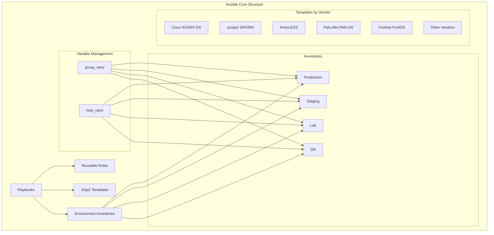
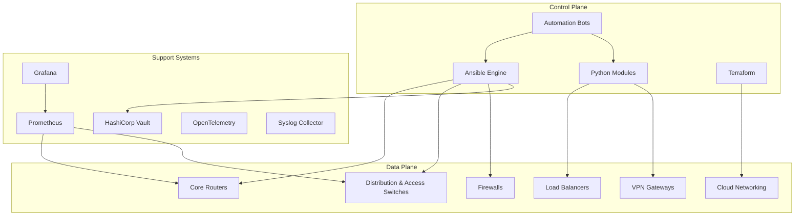
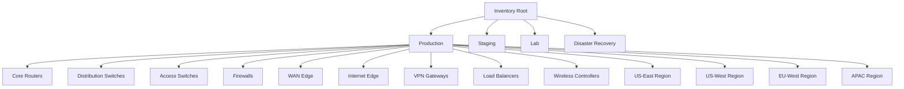
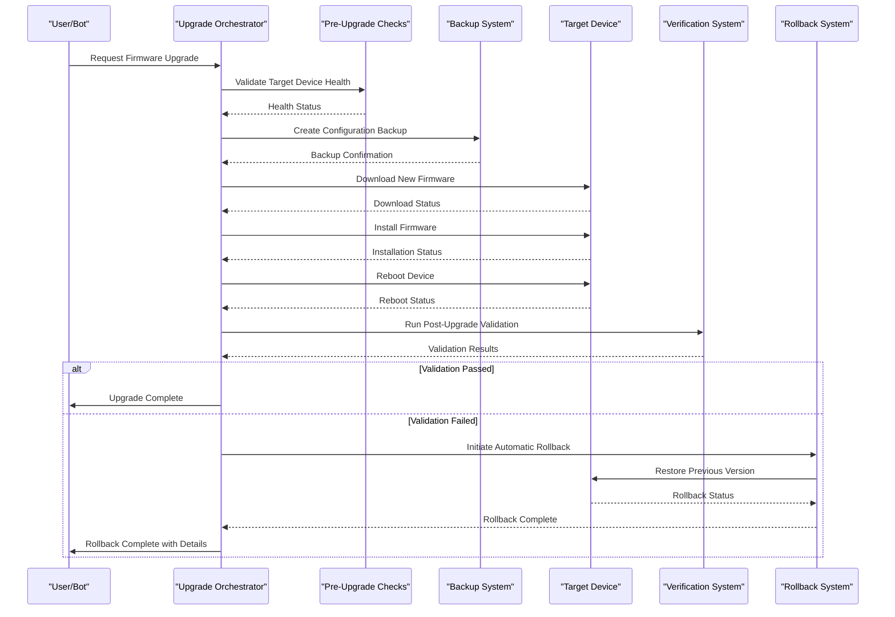
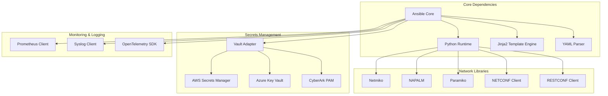

# Ansible Orchestration Layer

<cite>
**Referenced Files in This Document**
- [README.md](file://README.md)
</cite>

## Table of Contents
1. [Introduction](#introduction)
2. [Project Structure](#project-structure)
3. [Core Components](#core-components)
4. [Architecture Overview](#architecture-overview)
5. [Detailed Component Analysis](#detailed-component-analysis)
6. [Dependency Analysis](#dependency-analysis)
7. [Performance Considerations](#performance-considerations)
8. [Troubleshooting Guide](#troubleshooting-guide)
9. [Conclusion](#conclusion)

## Introduction

This document provides comprehensive documentation for the Ansible orchestration layer within the Enterprise Network Automation Platform. The platform is designed as a production-grade, vendor-agnostic network automation solution that manages thousands of network devices across multi-vendor, multi-region environments. It demonstrates Infrastructure as Code, GitOps, CI/CD, compliance enforcement, observability, and security practices suitable for Fortune 100 organizations including banks, telecoms, and cloud-native enterprises.

The system follows core principles including Network as Code, Infrastructure as Code, GitOps, DevSecOps, Compliance as Code, Monitoring as Code, Testing as Code, and Documentation as Code. Every configuration, policy, template, test, pipeline, dashboard, and bot is stored in Git with secrets never committed.

## Project Structure

The Ansible orchestration layer follows a modular, role-based architecture organized by environment, device type, and functionality. The repository structure supports multiple environments (production, staging, lab, DR) with hierarchical variable management through group_vars and host_vars.

**Diagram sources**
- [README.md:103-180](file://README.md#L103-L180)

**Section sources**
- [README.md:103-180](file://README.md#L103-L180)

## Core Components

### Role-Based Modular Architecture

The platform implements a comprehensive role-based architecture with reusable roles for device lifecycle management, configuration templates, and operational tasks. Key components include:

#### Device Lifecycle Management
- **Initial Provisioning**: Bootstrap new devices with hostname, AAA, NTP, DNS, SSH, SNMP, Syslog, and banners
- **Configuration Management**: Apply baseline configurations and service-specific settings
- **Maintenance Operations**: Firmware upgrades, backups, and health checks
- **Compliance Enforcement**: Automated security and policy compliance checks

#### Reusable Roles Structure
- **Network Services**: VLAN, trunk, LACP, QoS, ACL, NAT, VPN configurations
- **Routing Protocols**: OSPF, BGP, IS-IS, static routes, loopback interfaces
- **High Availability**: VRRP, HSRP configurations
- **Security Hardening**: SSH hardening, certificate deployment, banner management

#### Template System
Jinja2-based configuration templates organized by vendor platform:
- Cisco platforms (IOS, NX-OS, IOS-XE)
- Juniper platforms (SRX, MX)
- Arista EOS
- Palo Alto PAN-OS
- Fortinet FortiOS
- Check Point Gaia
- F5 BIG-IP
- pfSense/OPNsense

**Section sources**
- [README.md:115-128](file://README.md#L115-L128)
- [README.md:373-435](file://README.md#L373-L435)

## Architecture Overview

The Ansible orchestration layer integrates with multiple systems to provide comprehensive network automation capabilities.

**Diagram sources**
- [README.md:54-99](file://README.md#L54-L99)

## Detailed Component Analysis

### Inventory Structure Organization

The inventory system organizes devices by environment, role, region, and vendor with hierarchical variable management.

#### Environment-Based Organization

**Diagram sources**
- [README.md:288-309](file://README.md#L288-L309)

#### Hierarchical Variable Management
Variables are managed through a hierarchical structure:
- **group_vars**: Shared variables by device group (e.g., all routers, all firewalls)
- **host_vars**: Per-device specific variables
- **environment-specific overrides**: Variables specific to each environment

Each inventory entry defines device attributes including:
- Network connectivity (ansible_host)
- Vendor and platform identification
- Role assignment (core_router, firewall, etc.)
- Geographic location (region, site)

**Section sources**
- [README.md:284-336](file://README.md#L284-L336)

### Playbook Patterns

The platform implements comprehensive playbook patterns for various operational scenarios:

#### Device Provisioning Playbooks
- **initial_provisioning.yml**: Complete device bootstrap with security baselines
- **hostname.yml**: Dynamic hostname assignment from inventory data
- **aaa.yml**: Authentication, Authorization, and Accounting configuration
- **ntp.yml**: Time synchronization setup
- **dns.yml**: DNS resolver configuration
- **snmp.yml**: SNMPv3 monitoring setup
- **syslog.yml**: Centralized logging configuration
- **ssh_hardening.yml**: Secure SSH configuration
- **certificates.yml**: TLS certificate deployment
- **banners.yml**: Login and MOTD banner management

#### Configuration Update Playbooks
- **vlan.yml**: VLAN creation and modification
- **trunk.yml**: Trunk interface configuration
- **lacp.yml**: Link Aggregation Control Protocol setup
- **qos.yml**: Quality of Service policy application
- **acl.yml**: Access Control List management
- **nat.yml**: Network Address Translation rules
- **vpn.yml**: Site-to-site and remote-access VPN configuration
- **firewall_rules.yml**: Firewall rule set deployment

#### Routing Protocol Playbooks
- **ospf.yml**: OSPF routing protocol configuration
- **bgp.yml**: BGP peering and policy management
- **isis.yml**: IS-IS routing protocol setup
- **static_routes.yml**: Static route management
- **loopbacks.yml**: Loopback interface configuration

#### High Availability Playbooks
- **vrrp.yml**: Virtual Router Redundancy Protocol
- **hsrp.yml**: Hot Standby Router Protocol

#### Operational Task Playbooks
- **backup.yml**: Configuration backup operations
- **restore.yml**: Configuration restoration
- **firmware_upgrade.yml**: Firmware upgrade with validation
- **firmware_rollback.yml**: Firmware rollback on failure
- **config_rollback.yml**: Configuration rollback to last known good
- **golden_config.yml**: Golden configuration baseline application
- **drift_detection.yml**: Configuration drift detection
- **compliance_scan.yml**: Security and policy compliance scanning
- **health_check.yml**: Comprehensive device health assessment
- **inventory_collection.yml**: Device inventory collection
- **neighbor_discovery.yml**: CDP/LLDP neighbor discovery
- **license_validation.yml**: License compliance validation
- **monitoring_agents.yml**: Monitoring agent deployment

**Section sources**
- [README.md:371-435](file://README.md#L371-L435)

### Connection Management Strategies

The platform implements robust connection management strategies:

#### Multi-Protocol Support
- **SSH**: Primary connection method with Netmiko/Paramiko abstraction
- **NETCONF**: For devices supporting NETCONF with capability negotiation
- **RESTCONF**: RESTful API access with YANG model support
- **SNMPv3**: Read-only operations for monitoring and polling
- **gRPC**: Model-driven telemetry streaming
- **API Integration**: Vendor-specific APIs for advanced operations

#### Connection Pooling and Retry Logic
- Automatic retry mechanisms for transient failures
- Connection pooling for high-throughput operations
- Timeout handling and graceful degradation
- Multiplexed connections where supported

#### Authentication and Authorization
- Multi-backend secret management (Vault, AWS Secrets Manager, Azure Key Vault)
- Short-lived credentials and token rotation
- Role-based access control integration
- Audit logging for all connection attempts

**Section sources**
- [README.md:438-456](file://README.md#L438-L456)

### Parallel Execution Patterns

The platform leverages Ansible's parallel execution capabilities for optimal performance:

#### Strategy Implementation
- **forks**: Configurable parallelism based on device count and resource availability
- **serial**: Controlled rollout for critical changes with automatic rollback
- **strategy**: Custom strategies for complex dependency resolution
- **throttling**: Rate limiting for sensitive operations

#### Batch Processing
- Device grouping by vendor/platform for optimized task execution
- Dependency-aware ordering for interdependent changes
- Circuit breaker patterns for failure isolation
- Progress tracking and reporting

#### Resource Management
- Dynamic scaling of worker processes
- Memory optimization for large inventories
- CPU utilization monitoring and adjustment
- Network bandwidth throttling for bulk operations

**Section sources**
- [README.md:184-200](file://README.md#L184-L200)

### Error Handling and Rollback Mechanisms

#### Comprehensive Error Handling
- **Pre-flight Checks**: Validation before any changes are applied
- **Atomic Operations**: All-or-nothing change application
- **State Verification**: Post-change validation against expected state
- **Graceful Degradation**: Partial success handling with detailed reporting

#### Rollback Strategies
- **Automatic Rollback**: Triggered on verification failures
- **Manual Rollback**: One-click rollback via ChatOps bots
- **Versioned Backups**: Configuration versioning with instant restore
- **Rollforward Procedures**: Recovery procedures for partial failures

#### Failure Isolation
- **Circuit Breakers**: Prevent cascading failures across device groups
- **Quarantine**: Automatic isolation of failing devices
- **Progressive Rollout**: Gradual deployment with health monitoring
- **Compensating Actions**: Cleanup operations for partial successes

**Section sources**
- [README.md:642-671](file://README.md#L642-L671)

### Complex Workflows: Firmware Upgrades

The firmware upgrade workflow demonstrates sophisticated orchestration with pre/post checks and automated rollback:

**Diagram sources**
- [README.md:646-658](file://README.md#L646-L658)

## Dependency Analysis

The Ansible orchestration layer has well-defined dependencies and relationships between components:

**Diagram sources**
- [README.md:184-200](file://README.md#L184-L200)

**Section sources**
- [README.md:184-200](file://README.md#L184-L200)

## Performance Considerations

### Optimization Strategies
- **Parallel Execution**: Configurable forks based on infrastructure capacity
- **Connection Multiplexing**: Persistent connections where supported
- **Template Caching**: Cached template rendering for repeated operations
- **Lazy Loading**: Deferred loading of large variable sets
- **Incremental Updates**: Only apply necessary changes

### Scalability Patterns
- **Horizontal Scaling**: Multiple Ansible controllers for large deployments
- **Role Decomposition**: Fine-grained roles for better caching and reuse
- **Inventory Sharding**: Split large inventories by region or function
- **Asynchronous Operations**: Background processing for long-running tasks

### Resource Management
- **Memory Optimization**: Streaming processing for large configurations
- **CPU Utilization**: Adaptive parallelism based on available resources
- **Network Bandwidth**: Throttled bulk operations to avoid saturation
- **Storage Efficiency**: Compressed backups and incremental storage

## Troubleshooting Guide

### Common Issues and Resolutions

| Issue | Resolution |
|-------|------------|
| Ansible connection timeout | Verify SSH reachability: `ansible all -m ping -i inventories/lab/hosts.yml` |
| Template rendering error | Check Jinja2 syntax: `python -m python.config_gen --debug --device <name>` |
| Compliance check failure | Review `compliance/` policies and device running config diff |
| CI pipeline failure | Check GitHub Actions logs; most failures include actionable error messages |
| Vault authentication failure | Verify OIDC token or AppRole credentials; check Vault policies |
| Molecule test failure | Ensure Docker/Podman is running; check `molecule/default/molecule.yml` |
| Batfish analysis error | Validate Batfish snapshot in `tests/batfish/snapshots/` |

### Debugging Techniques
- **Verbose Logging**: Enable debug output with `-vvv` flag
- **Diff Mode**: Use `--diff` to see exact configuration changes
- **Check Mode**: Validate changes without applying with `--check`
- **Step-by-Step Execution**: Use `--step` for interactive debugging
- **Task Timing**: Analyze execution time per task for optimization

### Monitoring and Observability
- **Prometheus Metrics**: Export Ansible execution metrics
- **Grafana Dashboards**: Visualize automation performance and reliability
- **Alertmanager Integration**: Automated alerts for failed operations
- **Audit Logging**: Complete audit trail for compliance and forensics

**Section sources**
- [README.md:674-685](file://README.md#L674-L685)

## Conclusion

The Ansible orchestration layer in the Enterprise Network Automation Platform represents a production-grade solution for managing large-scale, multi-vendor network environments. The role-based modular architecture provides excellent reusability and maintainability, while the comprehensive playbook catalog covers the complete device lifecycle from provisioning to decommissioning.

Key strengths include:
- **Vendor-Agnostic Design**: Support for multiple vendors through standardized interfaces
- **GitOps Integration**: Full version control and automated deployment workflows
- **Compliance Enforcement**: Built-in security and policy compliance checking
- **Observability**: Comprehensive monitoring and alerting capabilities
- **Scalability**: Proven patterns for managing thousands of devices
- **Resilience**: Robust error handling and automated rollback mechanisms

The platform successfully demonstrates how modern DevOps practices can be applied to network automation, providing a blueprint for enterprise-scale network management that balances innovation with stability and security.