# Ansible Roles Architecture

<cite>
**Referenced Files in This Document**
- [README.md](file://README.md)
</cite>

## Table of Contents
1. [Introduction](#introduction)
2. [Project Structure](#project-structure)
3. [Core Components](#core-components)
4. [Architecture Overview](#architecture-overview)
5. [Detailed Component Analysis](#detailed-component-analysis)
6. [Dependency Analysis](#dependency-analysis)
7. [Performance Considerations](#performance-considerations)
8. [Troubleshooting Guide](#troubleshooting-guide)
9. [Conclusion](#conclusion)
10. [Appendices](#appendices)

## Introduction

This document provides comprehensive documentation for the Ansible roles architecture within the Enterprise Network Automation Platform. The platform implements a production-grade, vendor-agnostic network automation solution designed to manage thousands of network devices across multi-vendor, multi-region environments. The architecture follows Infrastructure as Code principles with GitOps workflows, ensuring all configurations, policies, templates, tests, pipelines, dashboards, and bots are stored in Git with secrets never committed.

The system supports multiple enterprise vendors including Cisco (IOS/IOS-XE/NX-OS), Juniper (SRX/MX), Arista (EOS), Palo Alto, Fortinet, Check Point, F5, pfSense, and OPNsense, providing unified automation capabilities across diverse networking equipment.

## Project Structure

The repository follows a well-organized directory structure that separates concerns and promotes reusability:

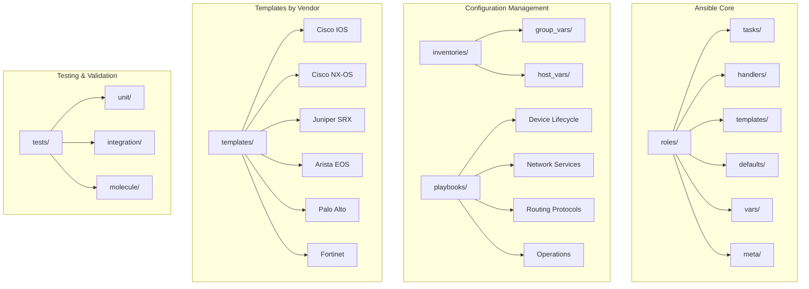

**Diagram sources**
- [README.md:103-180](file://README.md#L103-L180)

The architecture emphasizes modularity through:
- **Reusable roles** for common network operations
- **Vendor-specific templates** for configuration generation
- **Environment-based inventories** for different deployment targets
- **Structured variable hierarchy** for configuration inheritance
- **Comprehensive testing** using Molecule for role validation

**Section sources**
- [README.md:103-180](file://README.md#L103-L180)

## Core Components

### Role-Based Architecture

The platform implements a comprehensive role-based design pattern where each role encapsulates specific functionality:

#### Device Lifecycle Management Roles
- **Initial Provisioning**: Bootstrap new devices with hostname, AAA, NTP, DNS, SSH, SNMP, Syslog, and banners
- **Hostname Configuration**: Set device hostnames from inventory data
- **AAA Configuration**: Configure authentication, authorization, and accounting
- **NTP Configuration**: Set up time synchronization servers
- **DNS Configuration**: Configure domain name resolution
- **SNMP Configuration**: Implement monitoring via SNMPv3
- **Syslog Configuration**: Set up centralized logging
- **SSH Hardening**: Secure SSH access configuration
- **Certificate Management**: Deploy TLS certificates
- **Banner Configuration**: Set login and MOTD banners

#### Network Service Roles
- **VLAN Management**: Create and modify VLANs
- **Trunk Configuration**: Configure trunk interfaces
- **LACP/Port Channels**: Implement link aggregation
- **QoS Policies**: Apply quality of service configurations
- **ACL Management**: Manage access control lists
- **NAT Configuration**: Configure network address translation
- **VPN Setup**: Implement site-to-site and remote-access VPN
- **Firewall Rules**: Deploy firewall rule sets

#### Routing Protocol Roles
- **OSPF Configuration**: Configure Open Shortest Path First routing
- **BGP Peering**: Configure Border Gateway Protocol peering and policies
- **IS-IS Configuration**: Implement Intermediate System to Intermediate System routing
- **Static Routes**: Manage static route configurations
- **Loopback Interfaces**: Configure loopback interfaces

#### High Availability Roles
- **VRRP Configuration**: Implement Virtual Router Redundancy Protocol
- **HSRP Configuration**: Configure Hot Standby Router Protocol

**Section sources**
- [README.md:371-435](file://README.md#L371-L435)

### Variable Inheritance Hierarchy

The platform implements a sophisticated variable inheritance system:

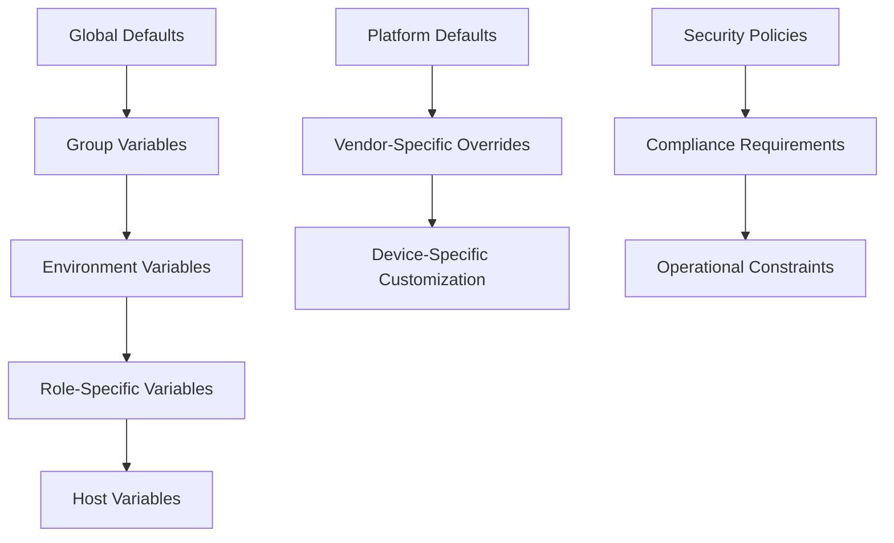

Variable precedence follows Ansible's standard hierarchy:
1. **Global defaults** in role `defaults/main.yml`
2. **Group variables** in `group_vars/` organized by device type
3. **Environment variables** per deployment target
4. **Role-specific variables** for customization
5. **Host variables** for individual device overrides
6. **Platform defaults** for vendor-specific behavior
7. **Vendor-specific overrides** for platform differences
8. **Device-specific customization** for unique requirements

**Section sources**
- [README.md:111-114](file://README.md#L111-L114)
- [README.md:284-335](file://README.md#L284-L335)

## Architecture Overview

The Ansible roles architecture follows a layered approach with clear separation of concerns:

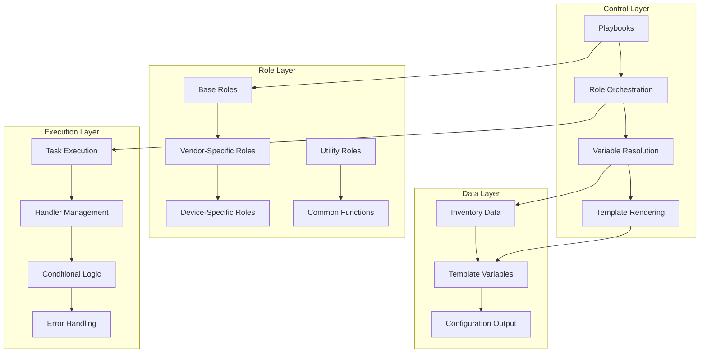

### Multi-Vendor Support Architecture

The platform supports multiple vendors through a consistent abstraction layer:

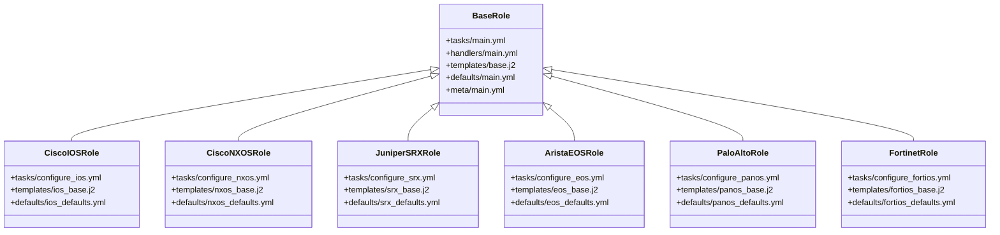

**Diagram sources**
- [README.md:203-226](file://README.md#L203-L226)

### Conditional Execution Patterns

Roles implement conditional execution based on device attributes:

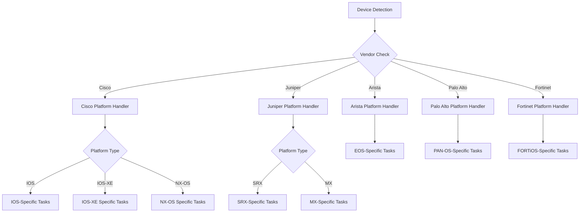

**Diagram sources**
- [README.md:203-226](file://README.md#L203-L226)

## Detailed Component Analysis

### Role Structure Organization

Each Ansible role follows the standard directory structure with specialized organization for network automation:

#### Standard Role Directory Structure
- **tasks/**: Contains task definitions organized by functional area
- **handlers/**: Defines handlers for service restarts and notifications
- **templates/**: Jinja2 templates for configuration generation
- **defaults/**: Default variable values with low precedence
- **vars/**: Role-specific variables with higher precedence than defaults
- **meta/**: Role metadata and dependencies
- **files/**: Static files needed by tasks (scripts, certificates, etc.)
- **molecule/**: Test scenarios for role validation

#### Vendor-Specific Template Organization
Templates are organized by vendor and platform:
- **cisco_ios/**: Cisco IOS-specific templates
- **cisco_nxos/**: Cisco NX-OS specific templates  
- **cisco_iosxe/**: Cisco IOS-XE specific templates
- **juniper_srx/**: Juniper SRX specific templates
- **juniper_mx/**: Juniper MX specific templates
- **arista_eos/**: Arista EOS specific templates
- **paloalto/**: Palo Alto PAN-OS specific templates
- **fortinet/**: Fortinet FORTiOS specific templates

### Role Composition Patterns

The platform implements several composition patterns for reusable functionality:

#### Base Role Pattern
Base roles provide common functionality inherited by vendor-specific roles:

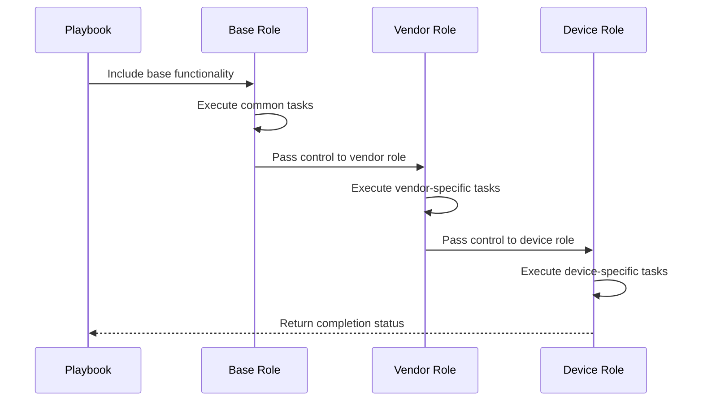

#### Conditional Task Execution
Tasks execute based on device attributes and inventory data:

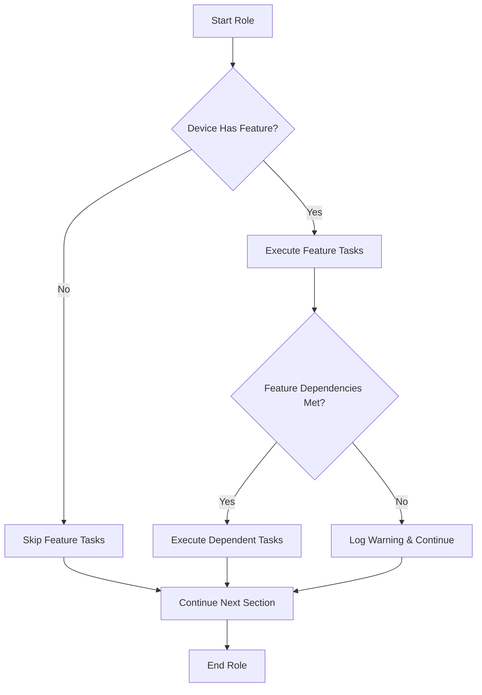

#### Variable Override Mechanism
Variables follow a hierarchical override pattern:

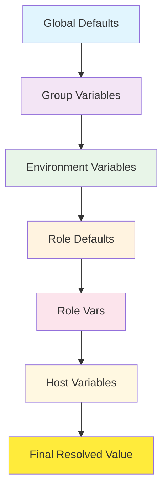

### Device Type Specialization

The platform supports different device types with specialized handling:

#### Router Roles
- **Core Routers**: High-performance routing with advanced protocols
- **Distribution Routers**: Aggregation layer with policy enforcement
- **Access Routers**: Edge connectivity with security policies

#### Switch Roles  
- **Core Switches**: High-throughput switching fabric
- **Distribution Switches**: Aggregation with routing capabilities
- **Access Switches**: End-user connectivity with port security

#### Firewall Roles
- **Perimeter Firewalls**: Network boundary protection
- **Internal Firewalls**: Segment isolation and micro-segmentation
- **Cloud Firewalls**: Virtual network security

#### Load Balancer Roles
- **Application Load Balancers**: Layer 7 traffic distribution
- **Network Load Balancers**: Layer 4 traffic distribution
- **Global Load Balancers**: Multi-datacenter traffic management

**Section sources**
- [README.md:284-335](file://README.md#L284-L335)

## Dependency Analysis

### Role Dependencies

The platform implements a dependency management system for roles:

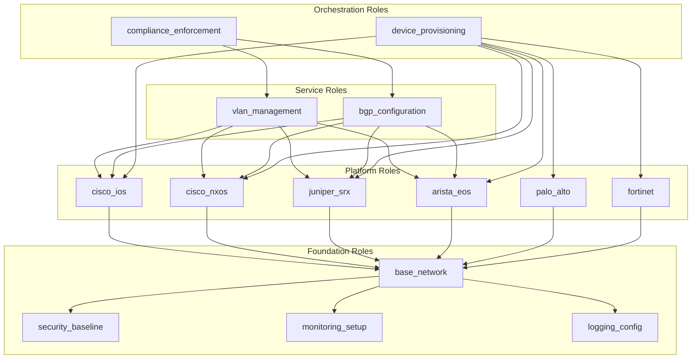

### External Dependencies

The platform integrates with various external systems:

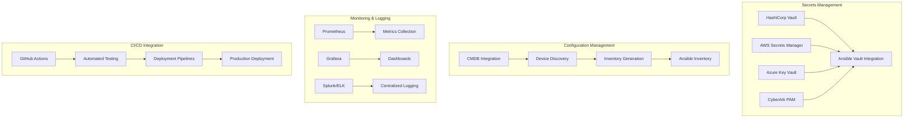

**Diagram sources**
- [README.md:339-368](file://README.md#L339-L368)

### Module Dependencies

Python modules provide additional functionality:

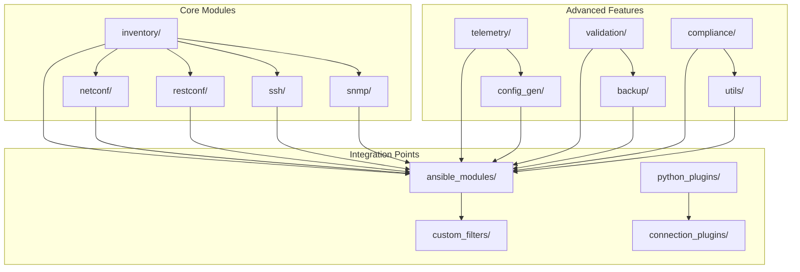

**Section sources**
- [README.md:438-456](file://README.md#L438-L456)

## Performance Considerations

### Optimization Strategies

The platform implements several performance optimization techniques:

#### Parallel Execution
- **Concurrent Host Processing**: Multiple devices configured simultaneously
- **Connection Pooling**: Reuse SSH connections where possible
- **Task Parallelization**: Independent tasks execute concurrently
- **Batch Operations**: Group related operations for efficiency

#### Memory Management
- **Lazy Loading**: Variables loaded on-demand
- **Streaming Templates**: Large configurations processed in chunks
- **Resource Cleanup**: Proper connection and resource cleanup
- **Memory Limits**: Configurable memory usage limits

#### Network Efficiency
- **Keep-Alive Connections**: Persistent connections for multiple operations
- **Compression**: Compressed data transfer where supported
- **Timeout Tuning**: Optimized timeout values for different operations
- **Retry Logic**: Intelligent retry with exponential backoff

### Scalability Patterns

The architecture supports horizontal scaling:

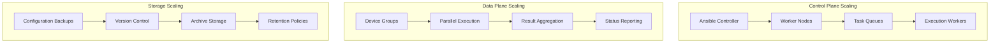

## Troubleshooting Guide

### Common Issues and Solutions

#### Connection Problems
- **SSH Timeout**: Verify network reachability and firewall rules
- **Authentication Failures**: Check credentials in secrets management
- **Permission Denied**: Validate user privileges and sudo configuration
- **Connection Refused**: Ensure SSH service is running and accessible

#### Template Rendering Errors
- **Jinja2 Syntax**: Validate template syntax and variable references
- **Missing Variables**: Check variable inheritance and scope
- **Template Not Found**: Verify template paths and permissions
- **Rendering Performance**: Optimize complex template logic

#### Role Execution Issues
- **Dependency Resolution**: Check role dependencies and versions
- **Variable Conflicts**: Resolve variable precedence conflicts
- **Task Failures**: Review task logs and error messages
- **Handler Issues**: Verify handler definitions and triggers

#### Compliance and Validation
- **Policy Violations**: Review compliance policies and device configuration
- **Schema Validation**: Validate YAML structure and data types
- **Security Scanning**: Address security findings and vulnerabilities
- **Golden Config Drift**: Identify and remediate configuration drift

**Section sources**
- [README.md:674-685](file://README.md#L674-L685)

## Conclusion

The Ansible roles architecture in the Enterprise Network Automation Platform provides a comprehensive, scalable, and maintainable solution for multi-vendor network automation. The role-based design enables code reuse, consistent configuration management, and easy extension for new platforms and features.

Key architectural strengths include:
- **Modular Design**: Clear separation of concerns with reusable components
- **Multi-Vendor Support**: Unified automation across diverse networking equipment
- **GitOps Integration**: Full lifecycle management through version control
- **Comprehensive Testing**: Automated validation at every stage
- **Security-First Approach**: Integrated compliance and secrets management
- **Scalable Architecture**: Horizontal scaling for large deployments

The platform demonstrates enterprise-grade practices for network automation, providing a solid foundation for organizations seeking to modernize their network operations through Infrastructure as Code principles.

## Appendices

### Best Practices for Custom Role Development

#### Role Structure Guidelines
- Follow standard Ansible role directory structure
- Use descriptive naming conventions
- Implement proper error handling and logging
- Include comprehensive documentation
- Write unit tests using Molecule

#### Variable Management
- Define sensible defaults in role defaults
- Use meaningful variable names
- Document variable purposes and expected values
- Implement variable validation where appropriate

#### Template Development
- Use Jinja2 best practices
- Implement proper error handling in templates
- Keep templates focused and modular
- Test templates with sample data

#### Testing Strategy
- Write unit tests for all critical logic
- Use Molecule for integration testing
- Implement golden config testing
- Test across multiple vendor platforms

**Section sources**
- [README.md:701-730](file://README.md#L701-L730)