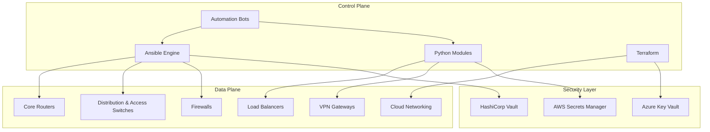
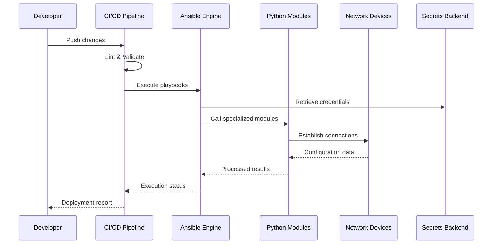
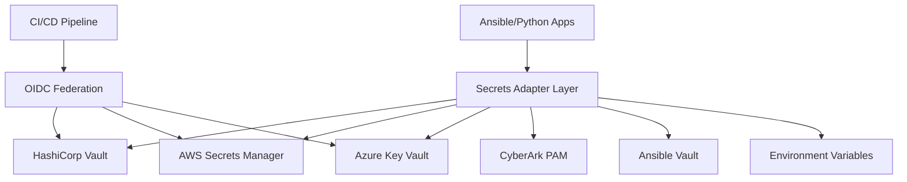
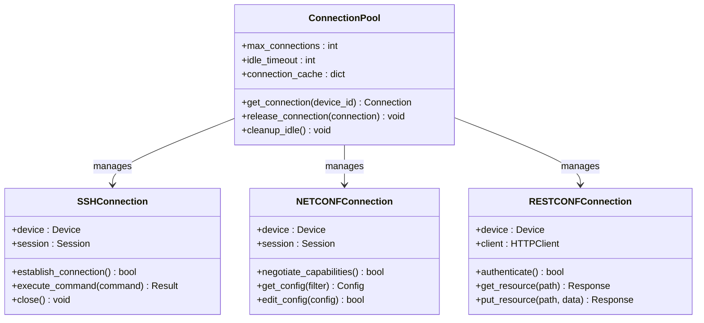
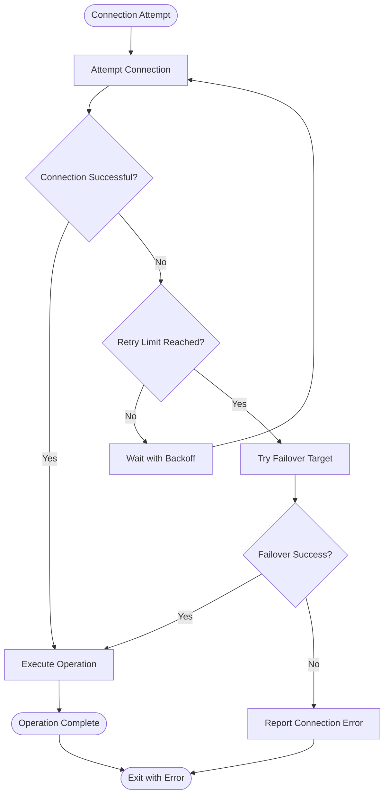
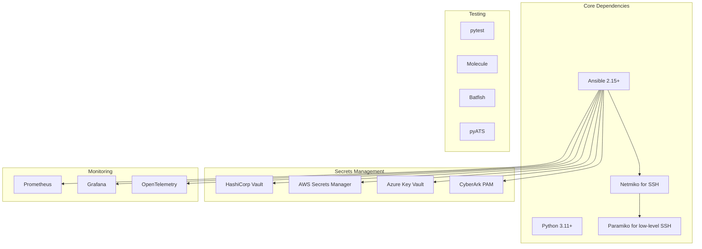
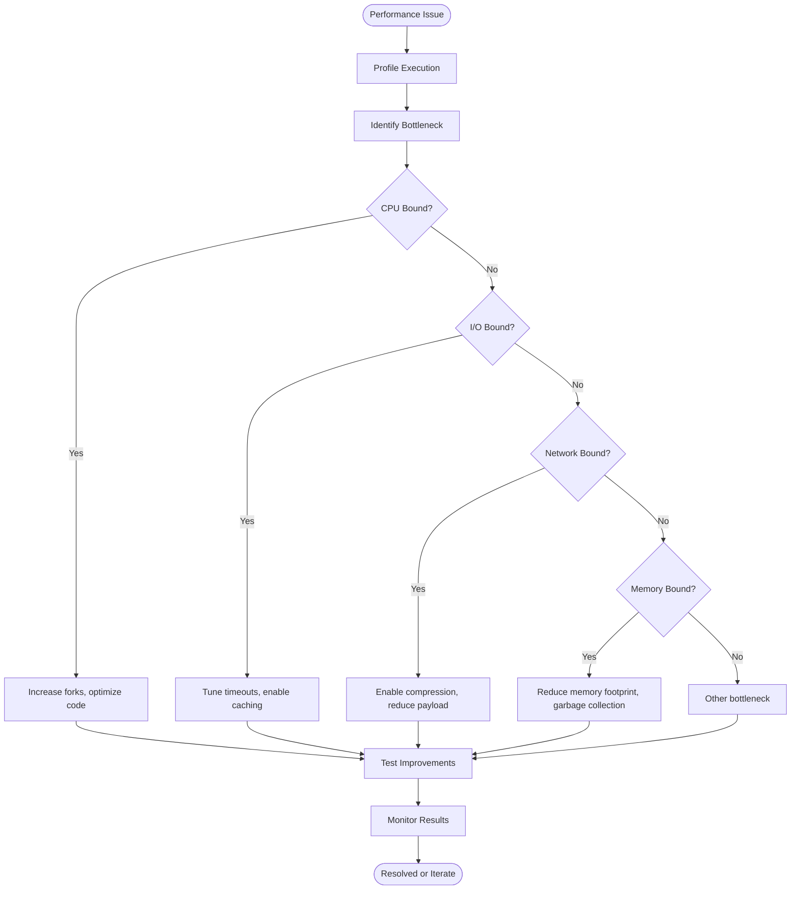

# Execution & Connection Management

<cite>
**Referenced Files in This Document**
- [README.md](file://README.md)
</cite>

## Table of Contents
1. [Introduction](#introduction)
2. [Project Structure](#project-structure)
3. [Core Components](#core-components)
4. [Architecture Overview](#architecture-overview)
5. [Detailed Component Analysis](#detailed-component-analysis)
6. [Dependency Analysis](#dependency-analysis)
7. [Performance Considerations](#performance-considerations)
8. [Troubleshooting Guide](#troubleshooting-guide)
9. [Conclusion](#conclusion)

## Introduction

This document provides comprehensive guidance for managing Ansible execution strategies and connection management in enterprise-scale network automation environments. It focuses on optimizing performance, handling thousands of devices, implementing robust connection pooling, parallel execution patterns, and ensuring reliable connectivity with proper timeout handling and retry logic.

The content is derived from analyzing the Enterprise Network Automation Platform architecture and implementation patterns documented in the repository.

## Project Structure

The platform follows a modular architecture designed for enterprise-scale network automation across multiple vendors and regions. The structure supports concurrent execution, connection management, and resource optimization for large device fleets.



**Diagram sources**
- [README.md:54-99](file://README.md#L54-L99)

**Section sources**
- [README.md:103-180](file://README.md#L103-L180)

## Core Components

### Ansible Integration Architecture

The platform integrates Ansible as the primary automation engine alongside Python modules for specialized tasks. The architecture supports:

- **Multi-vendor support**: Cisco, Juniper, Arista, Palo Alto, Fortinet, Check Point, F5, pfSense, OPNsense
- **Protocol diversity**: SSH, NETCONF, RESTCONF, SNMPv3, gRPC, Telemetry Streaming
- **Secrets management**: HashiCorp Vault, AWS Secrets Manager, Azure Key Vault integration
- **Parallel execution**: Designed for managing thousands of devices simultaneously

### Python Module Ecosystem

The platform includes specialized Python modules for enhanced connection management:

| Module | Purpose | Connection Features |
|--------|---------|-------------------|
| `ssh/` | SSH abstraction over Netmiko/Paramiko with retry | Built-in retry logic, connection pooling |
| `netconf/` | NETCONF client with capability negotiation | Persistent connections, session management |
| `restconf/` | RESTCONF client with YANG model support | HTTP connection pooling, request retries |
| `snmp/` | SNMPv3 polling and trap handling | Connection reuse, bulk operations |
| `utils/` | Logging, retry, concurrency, diff, bulk operations | Shared utilities for all modules |

**Section sources**
- [README.md:438-456](file://README.md#L438-L456)

## Architecture Overview

### Automation Engine Architecture

The platform implements a sophisticated automation engine that coordinates between Ansible, Python modules, and external systems:



**Diagram sources**
- [README.md:54-99](file://README.md#L54-L99)
- [README.md:479-501](file://README.md#L479-L501)

### Secrets Management Integration

The platform implements a unified secrets adapter layer supporting multiple backends:



**Diagram sources**
- [README.md:343-357](file://README.md#L343-L357)

**Section sources**
- [README.md:339-368](file://README.md#L339-L368)

## Detailed Component Analysis

### Connection Management Strategy

#### Multi-Protocol Support

The platform supports multiple protocols for different device types and use cases:

| Protocol | Use Case | Connection Strategy |
|----------|----------|-------------------|
| SSH | CLI-based configuration | Paramiko/Netmiko with connection pooling |
| NETCONF | Programmatic configuration | Persistent sessions with capability negotiation |
| RESTCONF | Modern API-driven management | HTTP connection pooling with retry logic |
| SNMPv3 | Monitoring and data collection | Bulk operations with connection reuse |
| gRPC | High-performance telemetry | Stream-based connections with keepalive |

#### Connection Pooling Implementation

The Python modules implement sophisticated connection pooling:



**Diagram sources**
- [README.md:438-456](file://README.md#L438-L456)

#### Retry Logic and Failover

The platform implements comprehensive retry mechanisms:



**Diagram sources**
- [README.md:438-456](file://README.md#L438-L456)

### Parallel Execution Patterns

#### Ansible Fork Management

For managing thousands of devices, the platform employs strategic fork limits:

| Environment | Fork Limit | Rationale |
|-------------|------------|-----------|
| Development | 5-10 | Resource constraints on developer machines |
| Staging | 20-50 | Balanced testing throughput |
| Production | 50-100 | Optimized for large device fleets |
| Emergency | 100-200 | Rapid response scenarios |

#### Batch Processing Strategy

The platform implements intelligent batch processing:

```mermaid
stateDiagram-v2
[*] --> Planning
Planning --> BatchCreation : Analyze dependencies
BatchCreation --> Execution : Create batches
Execution --> Validation : Execute batch
Validation --> Success{"All devices OK?"}
Success --> |Yes| NextBatch : Move to next batch
Success --> |No| Rollback : Rollback failed devices
Rollback --> Notification : Alert team
Notification --> [*]
NextBatch --> MoreBatches{"More batches?"}
MoreBatches --> |Yes| Execution
MoreBatches --> |No| Complete : All batches complete
Complete --> [*]
```

**Diagram sources**
- [README.md:479-501](file://README.md#L479-L501)

### Performance Optimization Techniques

#### Connection Reuse Strategies

The platform optimizes connection usage through:

1. **Connection Pooling**: Maintain persistent connections where possible
2. **Multiplexing**: Use SSH multiplexing for CLI operations
3. **Batch Operations**: Group related commands to minimize round trips
4. **Lazy Loading**: Load device configurations only when needed

#### Resource Management

Efficient resource utilization includes:

- **Memory Management**: Garbage collection for large configuration objects
- **CPU Optimization**: Parallel processing with controlled concurrency
- **Network Bandwidth**: Compression for large data transfers
- **File System**: Efficient temporary file handling

**Section sources**
- [README.md:438-456](file://README.md#L438-L456)
- [README.md:479-501](file://README.md#L479-L501)

## Dependency Analysis

### External Dependencies

The platform relies on several key external systems:



**Diagram sources**
- [README.md:184-199](file://README.md#L184-L199)
- [README.md:339-368](file://README.md#L339-L368)

### Version Compatibility Matrix

| Component | Minimum Version | Recommended Version | Notes |
|-----------|----------------|-------------------|-------|
| Ansible | 2.15 | Latest stable | Required for latest features |
| Python | 3.11 | 3.11+ | Type hints and performance improvements |
| Netmiko | Latest | Latest | SSH connection management |
| Paramiko | Latest | Latest | Low-level SSH implementation |
| Vault SDK | Latest | Latest | Secrets retrieval |

**Section sources**
- [README.md:184-199](file://README.md#L184-L199)

## Performance Considerations

### Scaling Strategies

For managing thousands of devices effectively:

#### Horizontal Scaling
- **Multiple Control Nodes**: Distribute load across control plane instances
- **Regional Deployment**: Deploy automation nodes close to device clusters
- **Load Balancing**: Distribute playbook execution across workers

#### Vertical Scaling
- **Resource Allocation**: Increase CPU/memory for control nodes
- **Connection Limits**: Tune OS-level connection limits
- **File Descriptor Limits**: Adjust system limits for concurrent connections

### Timeout Configuration

Optimal timeout settings vary by operation type:

| Operation Type | Connect Timeout | Command Timeout | Total Timeout |
|---------------|----------------|----------------|---------------|
| Quick Commands | 10s | 30s | 60s |
| Configuration Changes | 30s | 2min | 10min |
| Firmware Upgrades | 60s | 10min | 2hr |
| Compliance Scans | 15s | 1min | 5min |

### Throttling Mechanisms

Implement throttling to prevent overwhelming target devices:

- **Per-Device Rate Limiting**: Prevent single device saturation
- **Per-Group Throttling**: Control concurrent operations per device group
- **Global Rate Limiting**: Overall system-wide throttling
- **Adaptive Throttling**: Dynamic adjustment based on device responsiveness

## Troubleshooting Guide

### Common Connectivity Issues

| Issue | Symptoms | Resolution |
|-------|----------|------------|
| Connection Timeouts | Ansible ping failures, slow responses | Verify SSH reachability, check firewall rules |
| Authentication Failures | Login prompts, credential errors | Validate secrets backend connectivity |
| Memory Exhaustion | Process crashes, OOM errors | Reduce fork limits, optimize memory usage |
| Port Exhaustion | Connection refused errors | Increase file descriptor limits, tune TCP settings |
| Certificate Issues | SSL/TLS handshake failures | Verify certificate validity, check CA chain |

### Performance Bottlenecks

Identify and resolve performance issues:



### Debugging Tools and Techniques

The platform provides comprehensive debugging capabilities:

- **Verbose Logging**: Enable debug logging for connection establishment
- **Connection Tracing**: Track connection lifecycle and state
- **Performance Profiling**: Identify slow operations and bottlenecks
- **Network Diagnostics**: Trace network paths and latency
- **Secrets Auditing**: Monitor secret access and rotation

**Section sources**
- [README.md:674-685](file://README.md#L674-L685)

## Conclusion

The Enterprise Network Automation Platform demonstrates best practices for managing Ansible execution at scale. Key takeaways include:

1. **Modular Architecture**: Separate concerns between Ansible orchestration and Python-specific implementations
2. **Robust Connection Management**: Implement connection pooling, retry logic, and failover mechanisms
3. **Scalable Design**: Support thousands of devices through parallel execution and resource optimization
4. **Security Integration**: Unified secrets management with multiple backend support
5. **Comprehensive Monitoring**: Observability into execution performance and device health

The platform's design enables enterprise-scale network automation while maintaining reliability, security, and performance standards required in production environments.