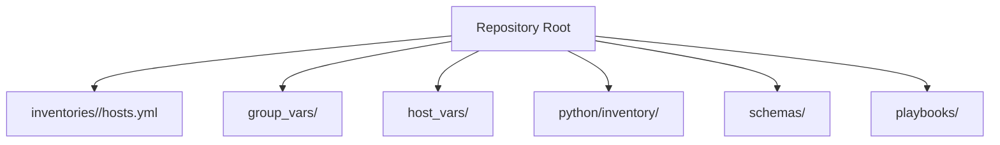
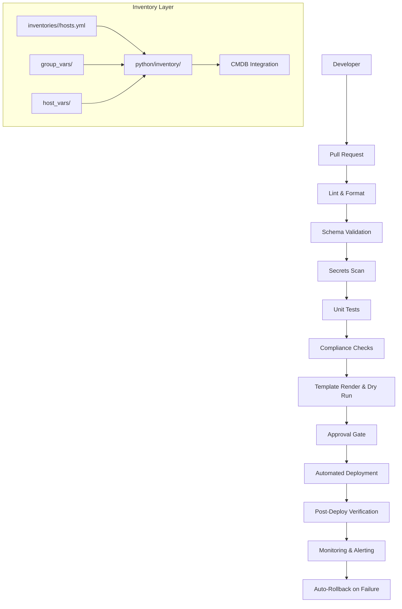
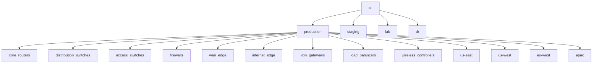
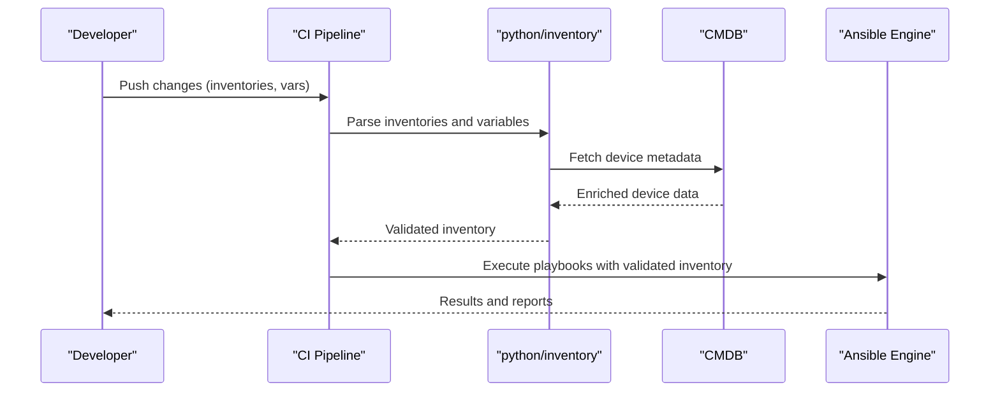
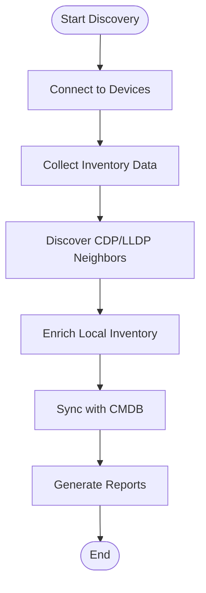
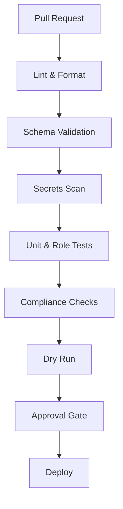
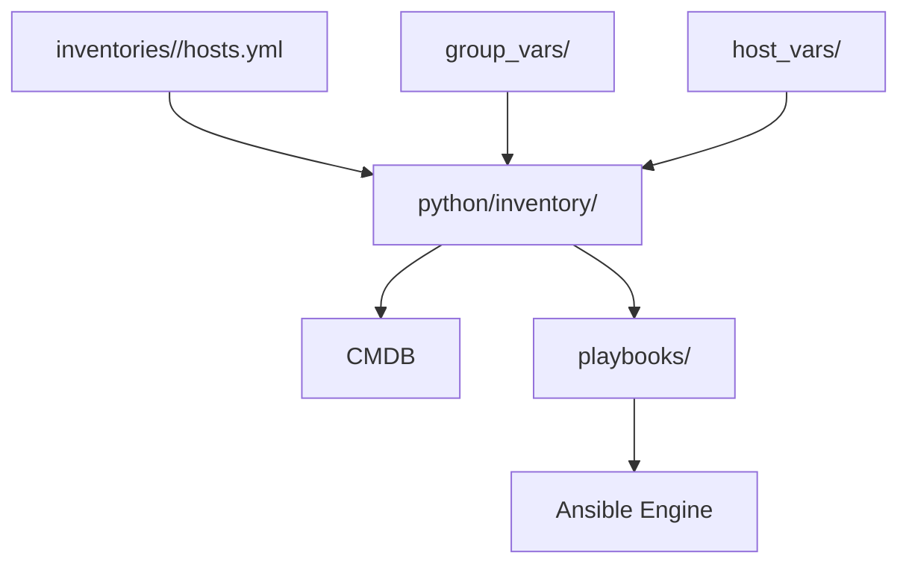

# Inventory Management System

<cite>
**Referenced Files in This Document**
- [README.md](file://README.md)
</cite>

## Table of Contents
1. [Introduction](#introduction)
2. [Project Structure](#project-structure)
3. [Core Components](#core-components)
4. [Architecture Overview](#architecture-overview)
5. [Detailed Component Analysis](#detailed-component-analysis)
6. [Dependency Analysis](#dependency-analysis)
7. [Performance Considerations](#performance-considerations)
8. [Troubleshooting Guide](#troubleshooting-guide)
9. [Conclusion](#conclusion)
10. [Appendices](#appendices)

## Introduction
This document explains the inventory management system for a large-scale, multi-vendor network automation platform. It focuses on how devices are organized by environment, device group, region, and vendor; how YAML inventories define hosts and memberships; how variables are managed via group_vars and host_vars with inheritance; and how dynamic inventory generation, CMDB integration, discovery workflows, validation, and schema enforcement fit into the overall GitOps lifecycle.

The repository is designed to manage thousands of devices across multiple environments (production, staging, lab, DR), device groups (core routers, distribution switches, firewalls, etc.), regions (US-East, US-West, EU-West, APAC), and vendors (Cisco, Juniper, Arista, Palo Alto, Fortinet, Check Point, F5, pfSense, OPNsense). The inventory is central to configuration generation, compliance checks, backups, upgrades, and monitoring.

## Project Structure
At a high level, the inventory-related directories and files are:
- inventories/<environment>/hosts.yml: Per-environment inventory definitions
- group_vars/: Shared variables by device group
- host_vars/: Per-device variables
- python/inventory/: Python modules for parsing, enrichment, and CMDB integration
- schemas/: JSON/YAML schemas used for validation
- playbooks/operations: Playbooks that consume inventories (e.g., compliance_scan, backup, drift detection)

**Diagram sources**
- [README.md:103-180](file://README.md#L103-L180)

**Section sources**
- [README.md:103-180](file://README.md#L103-L180)

## Core Components
- Hierarchical inventory structure:
  - Environments: production, staging, lab, dr
  - Device groups: core_routers, distribution_switches, access_switches, firewalls, wan_edge, internet_edge, vpn_gateways, load_balancers, wireless_controllers
  - Regions: us-east, us-west, eu-west, apac
  - Vendors: cisco, juniper, arista, paloalto, fortinet, checkpoint, f5, pfsense, opnsense
- YAML inventory format:
  - Top-level all node with children groups
  - Each group contains hosts with attributes such as ansible_host, vendor, platform, role, region, site
- Variable management:
  - group_vars: shared variables per device group
  - host_vars: per-device overrides
  - Inheritance: Ansible merges group_vars then host_vars at runtime
- Python inventory module:
  - Parsing, enrichment, and CMDB integration
- Validation and schema enforcement:
  - CI pipeline validates YAML against schemas
  - Linting and tests ensure correctness

**Section sources**
- [README.md:284-338](file://README.md#L284-L338)
- [README.md:103-180](file://README.md#L103-L180)
- [README.md:438-456](file://README.md#L438-L456)
- [README.md:517-544](file://README.md#L517-L544)

## Architecture Overview
The inventory architecture integrates static YAML inventories with Python-based enrichment and external CMDB sources. Variables are layered through group_vars and host_vars. The CI/CD pipeline enforces schema validation and linting before deployment.

**Diagram sources**
- [README.md:34-50](file://README.md#L34-L50)
- [README.md:284-338](file://README.md#L284-L338)
- [README.md:438-456](file://README.md#L438-L456)

## Detailed Component Analysis

### Hierarchical Inventory Structure
Devices are organized by environment, role, region, and vendor. The root inventory defines an all node with child groups representing device roles and regions. Each host entry includes connection and classification attributes.

**Diagram sources**
- [README.md:284-338](file://README.md#L284-L338)

**Section sources**
- [README.md:284-338](file://README.md#L284-L338)

### YAML Inventory Format
Each inventory file follows a consistent structure:
- Top-level all node
- children groups for roles and regions
- hosts under each group with attributes like ansible_host, vendor, platform, role, region, site

Example reference path:
- [README.md:313-335](file://README.md#L313-L335)

Best practices:
- Keep host attributes minimal and rely on group_vars/host_vars for defaults
- Use consistent naming conventions for groups and hosts
- Avoid duplicating common attributes across hosts; prefer inheritance

**Section sources**
- [README.md:313-335](file://README.md#L313-L335)

### Variable Management Strategy (group_vars and host_vars)
- group_vars: Define shared variables per device group (e.g., NTP servers, SNMP settings, template paths)
- host_vars: Override group-level variables for specific devices (e.g., unique IPs, serial numbers, site-specific parameters)
- Inheritance pattern: Ansible merges variables from most general to most specific (global → group → host)

Operational guidance:
- Place vendor/platform defaults in group_vars
- Put site or region-specific values in host_vars
- Validate variable presence using schema checks in CI

Reference:
- [README.md:103-180](file://README.md#L103-L180)

**Section sources**
- [README.md:103-180](file://README.md#L103-L180)

### Dynamic Inventory Generation and CMDB Integration
- python/inventory provides parsing, enrichment, and CMDB integration capabilities
- Typical workflow:
  - Read static inventories and group/host variables
  - Enrich device records with additional metadata (serials, firmware versions, licenses)
  - Integrate with CMDB to reconcile desired state vs actual state
  - Output enriched inventory for downstream playbooks and templates

**Diagram sources**
- [README.md:438-456](file://README.md#L438-L456)
- [README.md:479-514](file://README.md#L479-L514)

**Section sources**
- [README.md:438-456](file://README.md#L438-L456)
- [README.md:479-514](file://README.md#L479-L514)

### Device Discovery Workflows
Discovery processes collect device inventory details (serials, versions, modules) and neighbor information (CDP/LLDP). These workflows feed back into the CMDB and enrich the local inventory.

**Diagram sources**
- [README.md:418-435](file://README.md#L418-L435)

**Section sources**
- [README.md:418-435](file://README.md#L418-L435)

### Inventory Validation and Schema Enforcement
- CI pipeline runs schema validation against inventories, group_vars, and host_vars
- Tools include jsonschema and cerberus
- Linting ensures formatting and style consistency

**Diagram sources**
- [README.md:479-514](file://README.md#L479-L514)
- [README.md:517-544](file://README.md#L517-L544)

**Section sources**
- [README.md:479-514](file://README.md#L479-L514)
- [README.md:517-544](file://README.md#L517-L544)

### Best Practices for Large-Scale Deployments
- Organize inventories by environment and role; use regions and vendors as attributes rather than deep hierarchies
- Centralize common settings in group_vars; override minimally in host_vars
- Enforce schema validation and linting in every PR
- Use secrets managers for sensitive data; never commit credentials
- Automate discovery and CMDB sync to keep inventory accurate
- Maintain golden configurations and run drift detection regularly
- Implement rollback strategies for both firmware and configuration changes

[No sources needed since this section provides general guidance]

## Dependency Analysis
The inventory layer depends on:
- Static YAML inventories and variable files
- Python inventory modules for enrichment and CMDB integration
- CI/CD pipelines for validation and testing
- Playbooks that consume the final inventory

**Diagram sources**
- [README.md:103-180](file://README.md#L103-L180)
- [README.md:438-456](file://README.md#L438-L456)

**Section sources**
- [README.md:103-180](file://README.md#L103-L180)
- [README.md:438-456](file://README.md#L438-L456)

## Performance Considerations
- Minimize duplication in inventories; leverage group_vars and host_vars to reduce file size
- Use targeted execution (-l <device>) to limit scope during troubleshooting
- Cache connections where supported and avoid unnecessary polling
- Batch operations for large fleets; consider concurrency controls in Python modules
- Offload heavy enrichment tasks to scheduled jobs rather than on-demand

[No sources needed since this section provides general guidance]

## Troubleshooting Guide
Common issues and resolutions:
- Ansible connection timeout: Verify SSH reachability using ping against the inventory
- Template rendering errors: Debug Jinja2 rendering with verbose flags
- Compliance check failures: Review policies and diffs against running configs
- CI pipeline failures: Inspect logs for actionable error messages
- Vault authentication failures: Verify OIDC tokens or AppRole credentials and policies
- Molecule test failures: Ensure Docker/Podman is running and check molecule configuration
- Batfish analysis errors: Validate snapshots and configuration inputs

**Section sources**
- [README.md:674-685](file://README.md#L674-L685)

## Conclusion
The inventory management system combines structured YAML inventories, layered variables, Python-based enrichment, and robust CI/CD validation to support enterprise-scale network automation. By adhering to best practices—clear hierarchy, strong schema enforcement, secrets management, and continuous discovery—the platform maintains accuracy, security, and operational reliability across diverse environments and vendors.

[No sources needed since this section summarizes without analyzing specific files]

## Appendices

### Example Reference Paths
- Inventory example: [README.md:313-335](file://README.md#L313-L335)
- Python inventory module overview: [README.md:438-456](file://README.md#L438-L456)
- CI/CD pipeline steps: [README.md:479-514](file://README.md#L479-L514)
- Testing strategy including schema validation: [README.md:517-544](file://README.md#L517-L544)

**Section sources**
- [README.md:313-335](file://README.md#L313-L335)
- [README.md:438-456](file://README.md#L438-L456)
- [README.md:479-514](file://README.md#L479-L514)
- [README.md:517-544](file://README.md#L517-L544)