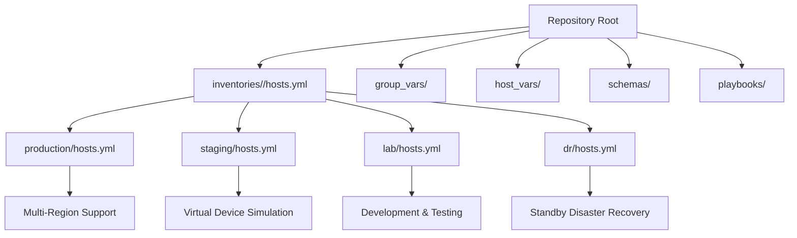
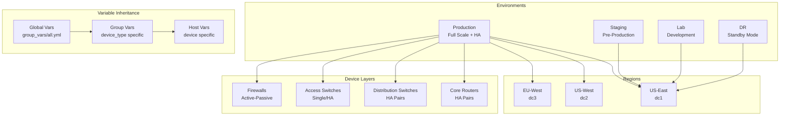
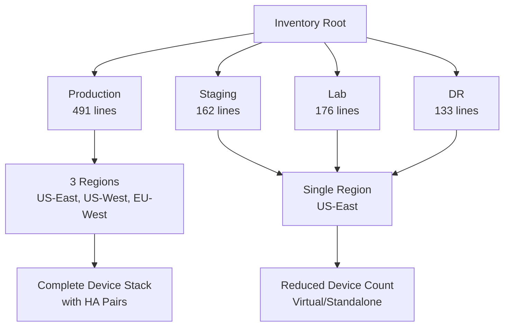
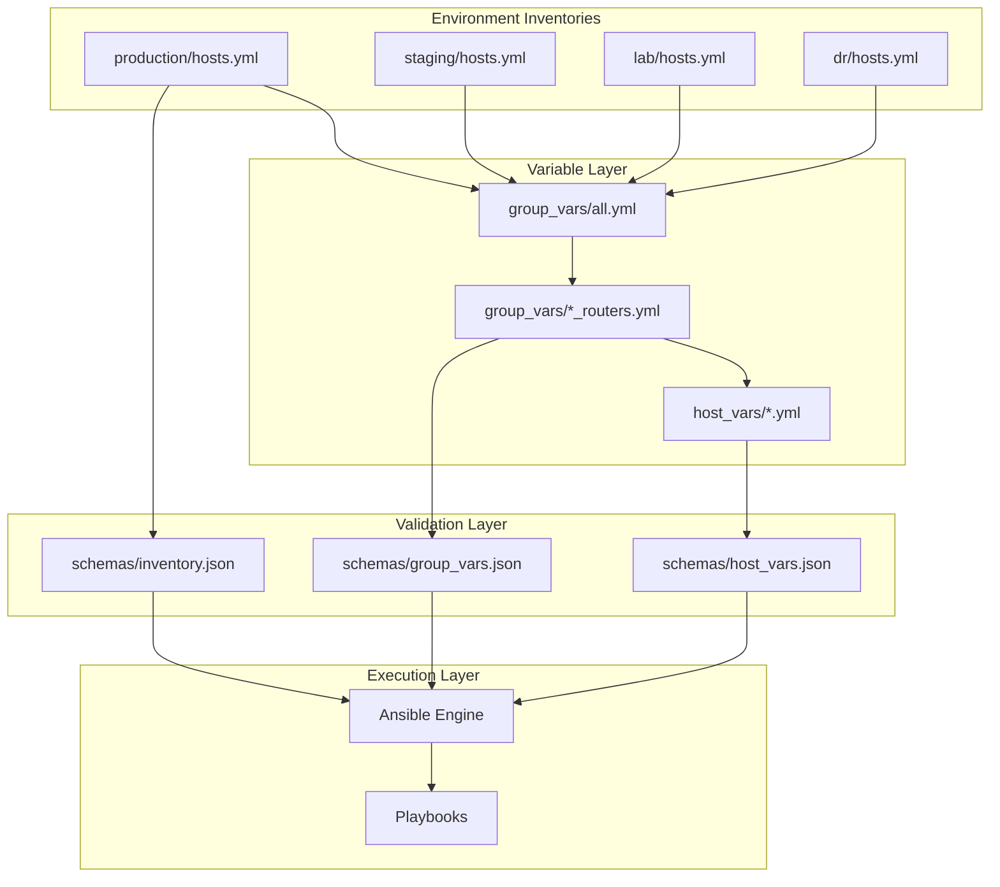

# Inventory Management System

<cite>
**Referenced Files in This Document**
- [README.md](file://README.md)
- [hosts.yml](file://inventories/production/hosts.yml)
- [hosts.yml](file://inventories/staging/hosts.yml)
- [hosts.yml](file://inventories/lab/hosts.yml)
- [hosts.yml](file://inventories/dr/hosts.yml)
- [all.yml](file://group_vars/all.yml)
- [core_routers.yml](file://group_vars/core_routers.yml)
- [distribution_switches.yml](file://group_vars/distribution_switches.yml)
- [access_switches.yml](file://group_vars/access_switches.yml)
- [firewalls.yml](file://group_vars/firewalls.yml)
- [core-rtr-01-us-east.yml](file://host_vars/core-rtr-01-us-east.yml)
- [inventory.json](file://schemas/inventory.json)
- [group_vars.json](file://schemas/group_vars.json)
- [host_vars.json](file://schemas/host_vars.json)
</cite>

## Update Summary
**Changes Made**
- Updated multi-environment inventory structure to reflect implemented lab, staging, production, and disaster recovery environments
- Enhanced multi-region architecture documentation with US East, US West, and EU West data centers
- Added high-availability configuration details across all environments
- Updated inventory hierarchy diagrams to show complete regional groupings
- Expanded variable management strategy with environment-specific configurations
- Enhanced schema validation examples for multi-environment deployments

## Table of Contents
1. [Introduction](#introduction)
2. [Project Structure](#project-structure)
3. [Core Components](#core-components)
4. [Architecture Overview](#architecture-overview)
5. [Detailed Component Analysis](#detailed-component-analysis)
6. [Dependency Analysis](#dependency-analysis)
7. [Performance Considerations](#performance-considerations)
8. [Troubleshooting Guide](#troubleshooting-guide)
9. [Conclusion](#conclusion)
10. [Appendices](#appendices)

## Introduction
This document explains the inventory management system for a large-scale, multi-vendor network automation platform. The system now implements a robust multi-environment architecture spanning lab, staging, production, and disaster recovery environments with comprehensive multi-region support across US East, US West, and EU West data centers featuring high-availability configurations.

The repository manages thousands of devices organized by environment (production, staging, lab, DR), device groups (core routers, distribution switches, firewalls, etc.), regions (US-East, US-West, EU-West), and vendors (Cisco, Juniper, Arista, Palo Alto, Fortinet, Check Point, F5, pfSense, OPNsense). Each environment maintains its own inventory with appropriate scale and redundancy levels, while sharing common variables through group_vars and host_vars inheritance patterns.

## Project Structure
At a high level, the inventory-related directories and files are:
- inventories/<environment>/hosts.yml: Per-environment inventory definitions with region-specific device configurations
- group_vars/: Shared variables by device group with environment-aware defaults
- host_vars/: Per-device variables with site-specific overrides
- schemas/: JSON schemas used for validation across all environments
- playbooks/operations: Playbooks that consume environment-specific inventories



**Diagram sources**
- [hosts.yml:1-491](file://inventories/production/hosts.yml#L1-L491)
- [hosts.yml:1-162](file://inventories/staging/hosts.yml#L1-L162)
- [hosts.yml:1-176](file://inventories/lab/hosts.yml#L1-L176)
- [hosts.yml:1-133](file://inventories/dr/hosts.yml#L1-L133)

**Section sources**
- [hosts.yml:1-491](file://inventories/production/hosts.yml#L1-L491)
- [hosts.yml:1-162](file://inventories/staging/hosts.yml#L1-L162)
- [hosts.yml:1-176](file://inventories/lab/hosts.yml#L1-L176)
- [hosts.yml:1-133](file://inventories/dr/hosts.yml#L1-L133)

## Core Components
- **Multi-Environment Architecture**:
  - Production: Full-scale deployment with HA pairs across multiple regions
  - Staging: Pre-production validation environment with virtual devices
  - Lab: Development and testing environment with reduced topology
  - DR: Standby disaster recovery environment mirroring production at reduced scale
- **Multi-Region Support**:
  - US-East: Primary data center with complete device stack
  - US-West: Secondary data center with full redundancy
  - EU-West: European data center with core infrastructure
- **Device Groups**: core_routers, distribution_switches, access_switches, firewalls, wan_edge, internet_edge, vpn_gateways, load_balancers, wireless_controllers
- **High-Availability Configurations**: Active-passive and active-active HA pairs across all critical device types
- **YAML Inventory Format**: Consistent structure across environments with environment-specific attributes
- **Variable Management**: Environment-aware group_vars and host_vars with proper inheritance
- **Schema Validation**: Comprehensive validation rules for all inventory types and variable structures

**Section sources**
- [hosts.yml:1-491](file://inventories/production/hosts.yml#L1-L491)
- [hosts.yml:1-162](file://inventories/staging/hosts.yml#L1-L162)
- [hosts.yml:1-176](file://inventories/lab/hosts.yml#L1-L176)
- [hosts.yml:1-133](file://inventories/dr/hosts.yml#L1-L133)
- [all.yml:1-180](file://group_vars/all.yml#L1-L180)

## Architecture Overview
The inventory architecture supports multi-environment, multi-region deployments with consistent variable inheritance and validation. Each environment maintains its own inventory file with appropriate scale and redundancy, while sharing common configurations through group_vars and host_vars.



**Diagram sources**
- [hosts.yml:1-491](file://inventories/production/hosts.yml#L1-L491)
- [hosts.yml:1-162](file://inventories/staging/hosts.yml#L1-L162)
- [hosts.yml:1-176](file://inventories/lab/hosts.yml#L1-L176)
- [hosts.yml:1-133](file://inventories/dr/hosts.yml#L1-L133)
- [all.yml:1-180](file://group_vars/all.yml#L1-L180)

## Detailed Component Analysis

### Multi-Environment Inventory Structure
The inventory system now supports four distinct environments, each optimized for its specific use case:

**Production Environment**: Full-scale deployment with high-availability configurations across three regions (US-East, US-West, EU-West). Each region contains complete device stacks with redundant pairs for critical components.

**Staging Environment**: Pre-production validation environment using virtual devices (CSR1000v, PA-VM, BIG-IP-VE) to simulate production behavior without physical hardware constraints.

**Lab Environment**: Development and testing environment with minimal topology for rapid iteration and experimentation. Uses standalone devices where possible to reduce complexity.

**Disaster Recovery Environment**: Standby DR environment that mirrors production topology at reduced scale, activated only during disaster events. Maintains synchronization with production configurations.



**Diagram sources**
- [hosts.yml:1-491](file://inventories/production/hosts.yml#L1-L491)
- [hosts.yml:1-162](file://inventories/staging/hosts.yml#L1-L162)
- [hosts.yml:1-176](file://inventories/lab/hosts.yml#L1-L176)
- [hosts.yml:1-133](file://inventories/dr/hosts.yml#L1-L133)

**Section sources**
- [hosts.yml:1-491](file://inventories/production/hosts.yml#L1-L491)
- [hosts.yml:1-162](file://inventories/staging/hosts.yml#L1-L162)
- [hosts.yml:1-176](file://inventories/lab/hosts.yml#L1-L176)
- [hosts.yml:1-133](file://inventories/dr/hosts.yml#L1-L133)

### Multi-Region Architecture with High Availability
Each production region maintains independent device stacks with high-availability configurations:

**US-East (dc1)**: Primary data center with complete device coverage including core routers (ASR-1001-X), distribution switches (DCS-7050X3, Nexus-9336C-FX2), access switches (C9300-48P), firewalls (PA-5220, PA-3220), WAN edge (ISR-4451), internet edge (ASR-1001-X), VPN gateways (PA-3220), load balancers (BIG-IP-i5800), and wireless controllers (C9800-40).

**US-West (dc2)**: Secondary data center mirroring US-East capabilities with equivalent device models and HA configurations.

**EU-West (dc3)**: European data center with Juniper MX240 core routers and Arista DCS-7050X3 distribution switches, maintaining regional compliance requirements.

All critical device types implement active-passive or active-active HA pairs with automatic failover capabilities.

**Section sources**
- [hosts.yml:24-448](file://inventories/production/hosts.yml#L24-L448)

### YAML Inventory Format and Regional Groupings
Each inventory file follows a consistent hierarchical structure with environment-specific optimizations:

**Common Structure**:
- Top-level `all` node with environment-specific variables
- Child groups for device roles (core_routers, distribution_switches, etc.)
- Regional grouping nodes (us_east, us_west, eu_west) for production
- Host entries with connection parameters and classification attributes

**Environment-Specific Optimizations**:
- Production: Complete regional groupings with all device types
- Staging/Lab: Simplified topology with virtual devices
- DR: Standalone devices with standby mode configuration

**Regional Grouping Example**:
```yaml
us_east:
  children:
    core_routers:
    distribution_switches:
    access_switches:
    firewalls:
    wan_edge:
    internet_edge:
    vpn_gateways:
    load_balancers:
    wireless_controllers:
  vars:
    region: us-east
```

**Section sources**
- [hosts.yml:450-491](file://inventories/production/hosts.yml#L450-L491)
- [hosts.yml:1-162](file://inventories/staging/hosts.yml#L1-L162)
- [hosts.yml:1-176](file://inventories/lab/hosts.yml#L1-L176)
- [hosts.yml:1-133](file://inventories/dr/hosts.yml#L1-L133)

### Variable Management Strategy Across Environments
The variable management system provides environment-aware configuration through layered inheritance:

**Global Variables (group_vars/all.yml)**: Common settings applied to all devices including NTP servers, DNS configuration, AAA setup, SNMPv3 configuration, syslog settings, SSH hardening, banner configuration, backup policies, compliance baselines, and monitoring endpoints.

**Group-Specific Variables**: Device-type specific configurations:
- Core routers: Routing protocols (OSPF, BGP, IS-IS), loopback interfaces, QoS policies, NetFlow/IPFIX, BFD configuration
- Distribution switches: VLAN definitions, spanning tree, port channels, HSRP/VRRP, routing, VRFs, multicast
- Access switches: VLAN configuration, spanning tree, port security, 802.1X/NAC, DHCP snooping, ARP inspection
- Firewalls: HA configuration, zones, security profiles, base rules, NAT, SSL/TLS, GlobalProtect

**Host-Specific Variables**: Device-specific overrides including unique IPs, interface configurations, ACLs, static routes, and BGP neighbor definitions.

**Environment-Specific Overrides**: Each environment defines its own vault provider, backup schedules, retention policies, and monitoring severity levels.

**Section sources**
- [all.yml:1-180](file://group_vars/all.yml#L1-L180)
- [core_routers.yml:1-87](file://group_vars/core_routers.yml#L1-L87)
- [distribution_switches.yml:1-103](file://group_vars/distribution_switches.yml#L1-L103)
- [access_switches.yml:1-115](file://group_vars/access_switches.yml#L1-L115)
- [firewalls.yml:1-155](file://group_vars/firewalls.yml#L1-L155)
- [core-rtr-01-us-east.yml:1-103](file://host_vars/core-rtr-01-us-east.yml#L1-L103)

### Schema Validation and Compliance Enforcement
Comprehensive schema validation ensures inventory integrity across all environments:

**Inventory Schema**: Validates host definitions with required fields (ansible_host, vendor, platform, role, region), supported vendor/platform enums, valid region values, and HA role constraints.

**Group Variables Schema**: Enforces minimum redundancy requirements (NTP servers, DNS servers, AAA servers), SNMPv3-only configuration, approved cipher suites, and compliance baseline versions.

**Host Variables Schema**: Validates interface configurations, VLAN definitions, routing protocols, ACL entries, NAT rules, and other device-specific parameters.

**Validation Workflow**: CI/CD pipeline runs schema validation against all inventory files, group_vars, and host_vars before deployment, ensuring consistency across environments.

**Section sources**
- [inventory.json:1-155](file://schemas/inventory.json#L1-L155)
- [group_vars.json:1-216](file://schemas/group_vars.json#L1-L216)
- [host_vars.json:1-331](file://schemas/host_vars.json#L1-L331)

### High-Availability Configuration Patterns
The inventory system implements standardized HA patterns across all environments:

**Core Routers**: ASR-1001-X and MX240 platforms configured as primary/secondary pairs with iBGP peering and shared ASN within each region.

**Distribution Switches**: DCS-7050X3 and Nexus-9336C-FX2 platforms with HSRP/VRRP for first-hop redundancy and LACP port-channels for uplink aggregation.

**Firewalls**: Active-passive configurations with heartbeat monitoring and interface tracking for automatic failover.

**Load Balancers**: Active-standby pairs with health checks and session persistence.

**Wireless Controllers**: Primary-secondary pairs with AP failover and centralized management.

**Section sources**
- [hosts.yml:33-86](file://inventories/production/hosts.yml#L33-L86)
- [hosts.yml:96-143](file://inventories/production/hosts.yml#L96-L143)
- [hosts.yml:211-266](file://inventories/production/hosts.yml#L211-L266)
- [hosts.yml:383-414](file://inventories/production/hosts.yml#L383-L414)
- [hosts.yml:424-447](file://inventories/production/hosts.yml#L424-L447)

## Dependency Analysis
The inventory layer depends on:
- Static YAML inventories per environment with region-specific device definitions
- Layered variable files (global, group, host) with environment-aware defaults
- JSON schemas for validation and compliance enforcement
- Ansible engine for configuration generation and deployment
- Secrets management integration for sensitive configuration data



**Diagram sources**
- [hosts.yml:1-491](file://inventories/production/hosts.yml#L1-L491)
- [all.yml:1-180](file://group_vars/all.yml#L1-L180)
- [inventory.json:1-155](file://schemas/inventory.json#L1-L155)

**Section sources**
- [hosts.yml:1-491](file://inventories/production/hosts.yml#L1-L491)
- [all.yml:1-180](file://group_vars/all.yml#L1-L180)
- [inventory.json:1-155](file://schemas/inventory.json#L1-L155)

## Performance Considerations
- **Environment Scaling**: Production environment handles 40+ devices across 3 regions; staging and lab environments use virtual devices for faster execution
- **Variable Inheritance Optimization**: Leverage group_vars for common settings to minimize duplication across hundreds of host_vars files
- **Targeted Execution**: Use `-l <region>` or `-l <device_group>` flags to limit scope during troubleshooting and maintenance operations
- **Connection Caching**: Enable Ansible connection caching for large fleet operations to reduce authentication overhead
- **Parallel Processing**: Utilize Ansible's built-in parallelism for cross-region deployments with appropriate concurrency controls
- **Schema Validation Efficiency**: Run schema validation incrementally during development rather than validating entire inventory trees

## Troubleshooting Guide
Common issues and resolutions for multi-environment deployments:
- **Environment Isolation Issues**: Verify correct inventory file selection (-i inventories/<env>/hosts.yml) when running playbooks
- **Region-Specific Failures**: Check regional connectivity and ensure proper device reachability from automation controller
- **HA Pair Synchronization**: Validate primary/secondary device communication and failover mechanisms
- **Variable Override Conflicts**: Review variable precedence (global → group → host) when debugging unexpected configurations
- **Schema Validation Errors**: Use detailed error messages from CI/CD pipeline to identify specific field violations
- **Secrets Management**: Verify vault provider configuration and credential accessibility for each environment
- **Cross-Region Connectivity**: Test inter-region links and validate routing between US-East, US-West, and EU-West data centers

## Conclusion
The inventory management system successfully implements a robust multi-environment, multi-region architecture supporting enterprise-scale network automation. With comprehensive high-availability configurations across US East, US West, and EU West data centers, the system provides reliable infrastructure management for production workloads while maintaining efficient development and testing workflows in staging and lab environments. The disaster recovery capability ensures business continuity with automated failover procedures. Through structured YAML inventories, layered variable management, Python-based enrichment, and robust CI/CD validation, the platform maintains accuracy, security, and operational reliability across diverse environments and vendors.

## Appendices

### Environment-Specific Configuration Examples

**Production Environment Characteristics**:
- Full device complement across all regions
- High-availability pairs for all critical components
- Enterprise-grade hardware models (ASR-1001-X, DCS-7050X3, PA-5220)
- Comprehensive monitoring and logging
- 90-day backup retention

**Staging Environment Characteristics**:
- Virtual device simulation (CSR1000v, PA-VM, BIG-IP-VE)
- Single region deployment (US-East)
- 30-day backup retention
- Notification-level syslog

**Lab Environment Characteristics**:
- Minimal topology for development
- Standalone devices where possible
- Debug-level syslog for troubleshooting
- No backup retention

**DR Environment Characteristics**:
- Standby mode operation
- Mirrored production topology at reduced scale
- 60-day backup retention
- Warning-level syslog

**Section sources**
- [hosts.yml:1-491](file://inventories/production/hosts.yml#L1-L491)
- [hosts.yml:1-162](file://inventories/staging/hosts.yml#L1-L162)
- [hosts.yml:1-176](file://inventories/lab/hosts.yml#L1-L176)
- [hosts.yml:1-133](file://inventories/dr/hosts.yml#L1-L133)

### Regional Network Topology Reference

**US-East Data Center (dc1)**:
- Core: ASR-1001-X routers with iBGP peering
- Distribution: DCS-7050X3 and Nexus-9336C-FX2 switches
- Access: C9300-48P switches with PoE capabilities
- Security: PA-5220 and PA-3220 firewalls
- Edge: ISR-4451 WAN routers and ASR-1001-X internet edge
- Services: BIG-IP-i5800 load balancers and C9800-40 wireless controllers

**US-West Data Center (dc2)**:
- Equivalent device complement to US-East
- Independent BGP autonomous system (ASN 65002)
- Cross-region peering with US-East core routers

**EU-West Data Center (dc3)**:
- Juniper MX240 core routers (ASN 65003)
- Arista DCS-7050X3 distribution switches
- Check Point 6200 firewalls
- SRX4600 WAN edge routers

**Section sources**
- [hosts.yml:33-86](file://inventories/production/hosts.yml#L33-L86)
- [hosts.yml:96-143](file://inventories/production/hosts.yml#L96-L143)
- [hosts.yml:211-266](file://inventories/production/hosts.yml#L211-L266)
- [hosts.yml:276-307](file://inventories/production/hosts.yml#L276-L307)
- [hosts.yml:317-340](file://inventories/production/hosts.yml#L317-L340)
- [hosts.yml:350-374](file://inventories/production/hosts.yml#L350-L374)
- [hosts.yml:383-414](file://inventories/production/hosts.yml#L383-L414)
- [hosts.yml:424-447](file://inventories/production/hosts.yml#L424-L447)