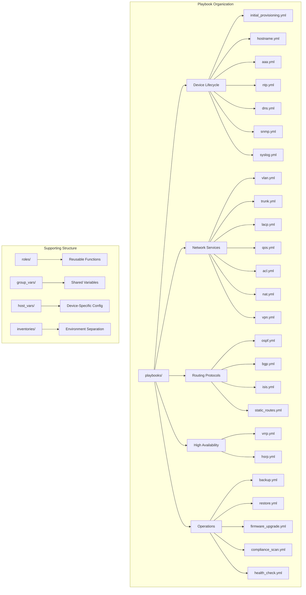
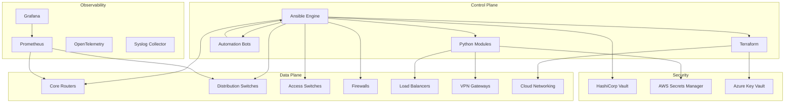
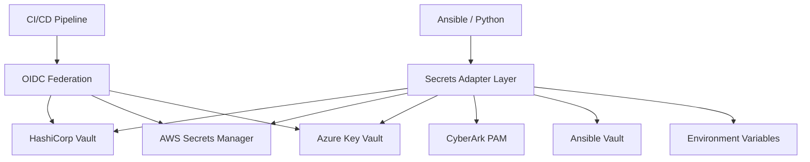
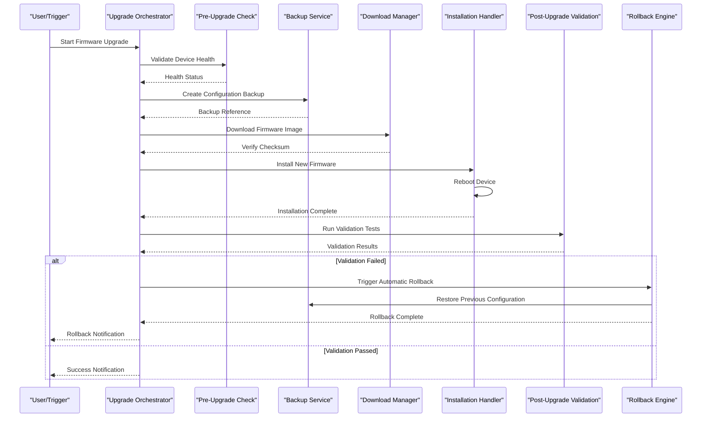
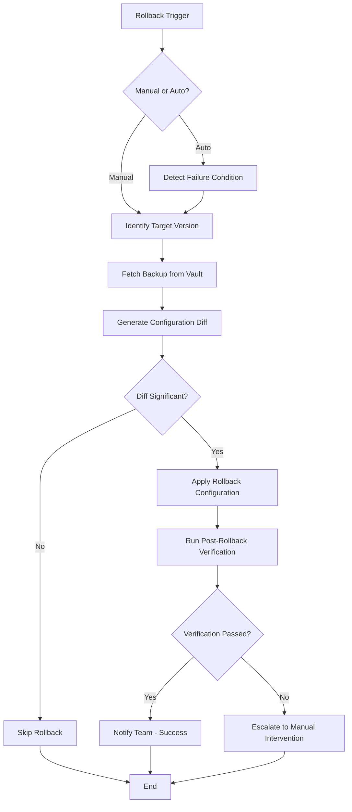
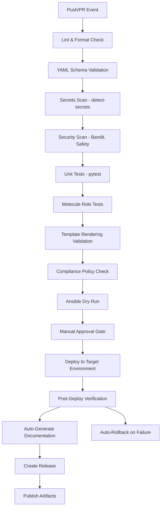
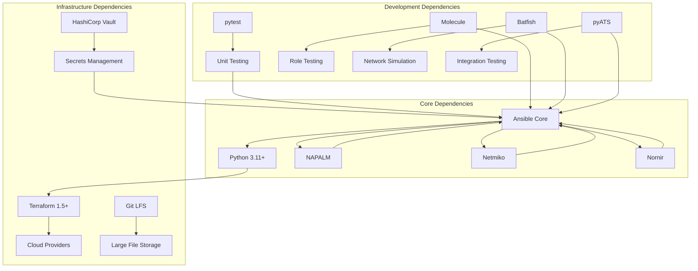

# Playbook Design Patterns

<cite>
**Referenced Files in This Document**
- [README.md](file://README.md)
</cite>

## Table of Contents
1. [Introduction](#introduction)
2. [Project Structure](#project-structure)
3. [Core Components](#core-components)
4. [Architecture Overview](#architecture-overview)
5. [Detailed Component Analysis](#detailed-component-analysis)
6. [Dependency Analysis](#dependency-analysis)
7. [Performance Considerations](#performance-considerations)
8. [Troubleshooting Guide](#troubleshooting-guide)
9. [Conclusion](#conclusion)
10. [Appendices](#appendices)

## Introduction

This document provides comprehensive guidance for designing and implementing Ansible playbooks within an enterprise-scale network automation platform. It covers device lifecycle operations, network services, routing protocols, high availability configurations, operational tasks, and advanced automation patterns including error handling, rollback mechanisms, parallel execution, conditional logic, and workflow orchestration.

The platform follows Infrastructure as Code principles with GitOps workflows, ensuring all changes are version-controlled, tested, and deployed through automated pipelines with built-in compliance enforcement and observability.

## Project Structure

The platform implements a modular architecture organized by functionality and environment separation:



**Diagram sources**
- [README.md:103-180](file://README.md#L103-L180)
- [README.md:371-435](file://README.md#L371-L435)

**Section sources**
- [README.md:103-180](file://README.md#L103-L180)

## Core Components

### Device Lifecycle Management

The platform provides comprehensive device lifecycle management through specialized playbooks:

#### Initial Provisioning
- **Purpose**: Bootstrap new devices with baseline configuration
- **Components**: Hostname, AAA, NTP, DNS, SSH hardening, SNMP, Syslog, banners
- **Execution**: Single comprehensive playbook or individual component playbooks

#### Configuration Management
- **Hostname Management**: Centralized hostname assignment from inventory
- **AAA Configuration**: TACACS+/RADIUS integration with role-based access
- **Time Synchronization**: NTP server configuration and validation
- **DNS Resolution**: DNS resolver setup and testing
- **Monitoring Integration**: SNMPv3 and Syslog destination configuration

### Network Services Automation

#### Layer 2 Services
- **VLAN Management**: Create, modify, and delete VLANs with consistent naming
- **Trunk Configuration**: Port channel and trunk interface automation
- **Link Aggregation**: LACP port-channel configuration and monitoring

#### Security Services
- **Access Control Lists**: Dynamic ACL creation and management
- **NAT Policies**: Source and destination NAT rule automation
- **VPN Configuration**: Site-to-site and remote-access VPN setup

#### Quality of Service
- **QoS Policies**: Traffic classification and prioritization
- **Traffic Shaping**: Bandwidth management and congestion control

### Routing Protocol Implementation

#### Dynamic Routing
- **OSPF Configuration**: Area design, neighbor relationships, route filtering
- **BGP Peering**: Autonomous system configuration, policy application
- **IS-IS Setup**: Level-based topology and metric configuration

#### Static Routing
- **Route Management**: Static route creation and maintenance
- **Floating Routes**: Backup path configuration with administrative distance

### High Availability Configuration

#### Virtual Router Redundancy
- **VRRP Implementation**: Master/backup router failover
- **HSRP Configuration**: Cisco-specific redundancy protocol setup

### Operational Excellence

#### Maintenance Operations
- **Configuration Backup**: Automated backup with versioning and encryption
- **Configuration Restore**: Point-in-time recovery capabilities
- **Firmware Upgrades**: Multi-step upgrade process with validation
- **Compliance Scanning**: Continuous policy enforcement and reporting

#### Health Monitoring
- **Health Checks**: Comprehensive device health assessment
- **Inventory Collection**: Device metadata and capability discovery
- **Neighbor Discovery**: Topology mapping through CDP/LLDP

**Section sources**
- [README.md:371-435](file://README.md#L371-L435)

## Architecture Overview

The automation platform follows a layered architecture with clear separation of concerns:



**Diagram sources**
- [README.md:54-99](file://README.md#L54-L99)

### Secret Management Architecture

The platform implements a unified secrets abstraction layer supporting multiple backends:



**Diagram sources**
- [README.md:343-357](file://README.md#L343-L357)

**Section sources**
- [README.md:54-99](file://README.md#L54-L99)
- [README.md:343-357](file://README.md#L343-L357)

## Detailed Component Analysis

### Firmware Upgrade Workflow

The firmware upgrade process implements a comprehensive multi-step workflow with pre/post validation and automatic rollback:



**Diagram sources**
- [README.md:646-658](file://README.md#L646-L658)

### Configuration Rollback Process

The configuration rollback mechanism ensures rapid recovery from failed deployments:



**Diagram sources**
- [README.md:662-670](file://README.md#L662-L670)

### CI/CD Pipeline Integration

The platform integrates with GitHub Actions for comprehensive validation and deployment:



**Diagram sources**
- [README.md:483-501](file://README.md#L483-L501)

**Section sources**
- [README.md:646-670](file://README.md#L646-L670)
- [README.md:483-501](file://README.md#L483-L501)

## Dependency Analysis

The platform maintains clear dependency boundaries and follows best practices for modularity:



**Diagram sources**
- [README.md:184-199](file://README.md#L184-L199)

### Technology Stack Relationships

| Layer | Primary Technologies | Purpose |
|-------|---------------------|---------|
| **Automation Engine** | Ansible, Python 3.11+, NAPALM, Netmiko, Nornir | Device configuration and management |
| **Infrastructure as Code** | Terraform, Packer, Ansible | Cloud infrastructure provisioning |
| **Protocols** | NETCONF, RESTCONF, SSH, SNMPv3, gRPC, Telemetry Streaming | Device communication interfaces |
| **Templates** | Jinja2, YAML structured data | Configuration generation |
| **CI/CD** | GitHub Actions, pre-commit hooks | Automated validation and deployment |
| **Testing** | pytest, Molecule, ansible-lint, yamllint, Batfish, pyATS | Comprehensive test coverage |
| **Compliance** | Custom Python checks, OPA, Batfish ACL analysis | Policy enforcement |
| **Monitoring** | Prometheus, Grafana, OpenTelemetry, Alertmanager, Syslog | Observability and alerting |
| **Secrets** | HashiCorp Vault, AWS Secrets Manager, Azure Key Vault, CyberArk, Ansible Vault | Secure credential management |

**Section sources**
- [README.md:184-199](file://README.md#L184-L199)

## Performance Considerations

### Parallel Execution Strategies

The platform optimizes performance through several key strategies:

- **Concurrent Device Processing**: Multiple devices configured simultaneously within safe limits
- **Connection Pooling**: Efficient reuse of SSH/NETCONF connections
- **Lazy Loading**: Deferred loading of large configuration templates
- **Incremental Updates**: Only changed configurations applied to devices
- **Batch Operations**: Grouped API calls where supported by vendor platforms

### Resource Optimization

- **Memory Management**: Streaming processing for large configuration files
- **CPU Utilization**: Balanced workload distribution across available cores
- **Network Efficiency**: Connection multiplexing and request batching
- **Storage Optimization**: Compressed backups with deduplication

### Scalability Patterns

- **Horizontal Scaling**: Additional workers for large device fleets
- **Vertical Scaling**: Increased resources for complex operations
- **Queue-Based Processing**: Asynchronous job processing for long-running tasks
- **Caching Strategy**: Intelligent caching of device capabilities and responses

## Troubleshooting Guide

### Common Issues and Resolutions

| Issue Category | Symptoms | Resolution Steps |
|---------------|----------|------------------|
| **Connection Issues** | Timeout errors, authentication failures | Verify SSH reachability, check credentials, validate firewall rules |
| **Template Errors** | Jinja2 rendering failures, syntax errors | Use debug mode, validate template syntax, check variable definitions |
| **Compliance Failures** | Policy violations detected | Review compliance policies, examine device running config diff |
| **Pipeline Failures** | CI/CD job failures | Check GitHub Actions logs, review error messages, validate dependencies |
| **Secrets Access** | Authentication failures to vault | Verify OIDC tokens, check AppRole credentials, validate Vault policies |
| **Test Failures** | Unit or integration test failures | Ensure Docker/Podman running, check molecule configuration |
| **Analysis Errors** | Batfish analysis failures | Validate snapshots, check network topology consistency |

### Debugging Techniques

- **Verbose Logging**: Enable detailed logging for troubleshooting complex issues
- **Dry Run Mode**: Test configuration changes without applying them
- **Incremental Testing**: Isolate problems by testing components individually
- **Snapshot Analysis**: Compare before/after states for configuration changes
- **Performance Profiling**: Identify bottlenecks in automation workflows

**Section sources**
- [README.md:674-685](file://README.md#L674-L685)

## Conclusion

This enterprise network automation platform demonstrates production-grade Ansible playbook design patterns and implementation strategies. The modular architecture, comprehensive testing framework, and robust CI/CD pipeline ensure reliable automation at scale while maintaining security and compliance standards.

Key success factors include:

- **Modular Design**: Reusable roles and playbooks promote consistency and maintainability
- **Comprehensive Testing**: Multi-layered testing strategy ensures reliability
- **Security First**: Integrated secrets management and compliance enforcement
- **Operational Excellence**: Built-in monitoring, alerting, and rollback capabilities
- **Developer Experience**: Clear documentation, standardized workflows, and automation tools

The platform serves as a reference implementation for organizations seeking to implement enterprise-scale network automation with proven design patterns and best practices.

## Appendices

### Quick Reference Commands

```bash
# Basic Operations
ansible-playbook playbooks/compliance_scan.yml -i inventories/lab/hosts.yml --check --diff
python -m python.config_gen --device core-rtr-01 --output ./output/
pytest tests/unit/ -v
python -m python.compliance --inventory inventories/lab/hosts.yml

# Testing Commands
pytest tests/ -v --tb=short
pytest tests/unit/ -v
pytest tests/compliance/ -v
cd roles/cisco_ios_baseline && molecule test
```

### Supported Vendor Matrix

| Vendor | Platform | Protocol | Status |
|--------|----------|----------|---------|
| Cisco | IOS, IOS-XE, NX-OS | SSH, NETCONF, RESTCONF | Supported |
| Juniper | SRX, MX | SSH, NETCONF | Supported |
| Arista | EOS | SSH, eAPI, NETCONF | Supported |
| Palo Alto | PAN-OS | SSH, API | Supported |
| Fortinet | FortiOS | SSH, API | Supported |
| Check Point | Gaia | SSH, API | Supported |
| F5 | BIG-IP | SSH, iControl REST | Supported |
| pfSense | FreeBSD-based | SSH, API | Supported |
| OPNsense | FreeBSD-based | SSH, API | Supported |