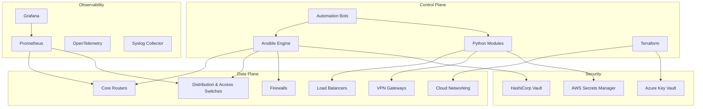
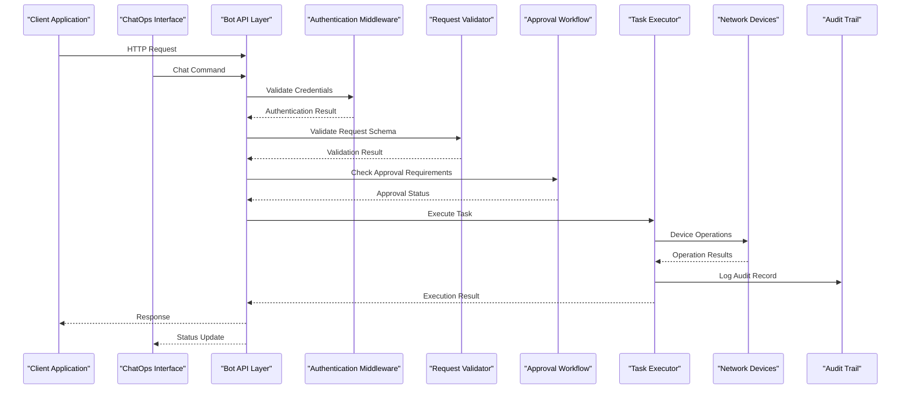
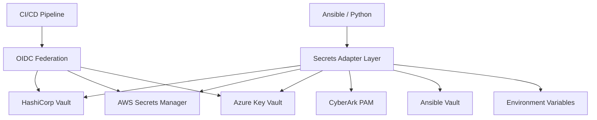
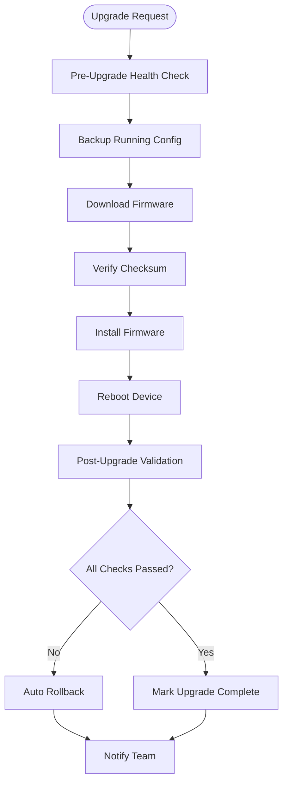

# Automation Bots Framework

<cite>
**Referenced Files in This Document**
- [README.md](file://README.md)
</cite>

## Table of Contents
1. [Introduction](#introduction)
2. [Project Structure](#project-structure)
3. [Core Components](#core-components)
4. [Architecture Overview](#architecture-overview)
5. [Detailed Component Analysis](#detailed-component-analysis)
6. [Dependency Analysis](#dependency-analysis)
7. [Performance Considerations](#performance-considerations)
8. [Troubleshooting Guide](#troubleshooting-guide)
9. [Conclusion](#conclusion)
10. [Appendices](#appendices)

## Introduction

The Enterprise Network Automation Platform is a production-grade, vendor-agnostic network automation framework designed to manage thousands of network devices across multi-vendor, multi-region environments. The platform implements Infrastructure as Code, GitOps, CI/CD, compliance enforcement, observability, and security patterns suitable for Fortune 100 organizations including banks, telecoms, and cloud-native enterprises.

The automation bots framework serves as the primary interface for self-service network operations, providing REST APIs and ChatOps integrations that enable developers and operators to request, validate, and deploy network changes through standardized workflows with built-in approval gates and audit trails.

## Project Structure

The platform follows a modular architecture with clear separation of concerns:



**Diagram sources**
- [README.md:54-99](file://README.md#L54-L99)

The repository structure organizes functionality into logical domains:

- **bots/**: Individual bot implementations for specific network operations
- **python/**: Reusable Python modules for device communication and automation
- **playbooks/**: Ansible playbooks for device configuration and management
- **templates/**: Jinja2 templates for configuration generation per vendor
- **compliance/**: Policy definitions and compliance checks
- **pipelines/**: CI/CD workflow definitions
- **monitoring/**: Observability configurations for Prometheus, Grafana, and OpenTelemetry

**Section sources**
- [README.md:103-180](file://README.md#L103-L180)

## Core Components

The automation bots framework consists of specialized bots that expose REST APIs and optional ChatOps integrations for self-service network operations. Each bot handles specific network management tasks while sharing common authentication, validation, and workflow capabilities.

### Bot Architecture Pattern

The bots follow a consistent architectural pattern:

1. **REST API Layer**: Standardized HTTP endpoints for programmatic access
2. **Authentication Middleware**: Shared authentication and authorization layer
3. **Request Validation**: Schema validation and business logic validation
4. **Approval Workflow Integration**: Change management and approval gates
5. **Audit Trail Generation**: Comprehensive logging and audit records
6. **ChatOps Integration**: Slack, Microsoft Teams, and GitHub Actions webhooks
7. **Device Communication**: Abstraction layer over multiple protocols (SSH, NETCONF, RESTCONF)

### Supported Protocols and Technologies

| Layer | Technologies |
|---|---|
| **Automation Engine** | Ansible, Python 3.11+, NAPALM, Netmiko, Nornir |
| **Protocols** | NETCONF, RESTCONF, SSH, SNMPv3, gRPC, Telemetry Streaming |
| **Templates** | Jinja2, YAML structured data |
| **CI/CD** | GitHub Actions, pre-commit hooks |
| **Testing** | pytest, Molecule, ansible-lint, yamllint, Batfish, pyATS |
| **Compliance** | Custom Python checks, OPA, Batfish ACL analysis |
| **Monitoring** | Prometheus, Grafana, OpenTelemetry, Alertmanager, Syslog |
| **Secrets** | HashiCorp Vault, AWS Secrets Manager, Azure Key Vault, CyberArk, Ansible Vault |
| **ChatOps** | Slack, Microsoft Teams, GitHub Actions |

**Section sources**
- [README.md:184-199](file://README.md#L184-L199)
- [README.md:438-456](file://README.md#L438-L456)

## Architecture Overview

The automation bots framework implements a layered architecture with clear separation between presentation, business logic, and infrastructure layers:



**Diagram sources**
- [README.md:460-476](file://README.md#L460-L476)

### Secret Management Architecture

The platform implements a unified secrets management approach with support for multiple backends:



**Diagram sources**
- [README.md:343-357](file://README.md#L343-L357)

## Detailed Component Analysis

### Firewall Bot

The firewall bot provides automated firewall rule management with comprehensive validation and approval workflows.

#### API Endpoints
- **POST** `/api/v1/firewall/rules` - Create new firewall rules
- **GET** `/api/v1/firewall/rules/{id}` - Retrieve specific rule details
- **PUT** `/api/v1/firewall/rules/{id}` - Update existing rules
- **DELETE** `/api/v1/firewall/rules/{id}` - Remove firewall rules
- **GET** `/api/v1/firewall/rules/pending` - List pending approval requests

#### ChatOps Integration
- Slack commands: `/firewall add`, `/firewall remove`, `/firewall status`
- Microsoft Teams adaptive cards for rule visualization
- GitHub Actions integration for rule change tracking

#### Request/Response Schema
```json
{
  "request": {
    "source_network": "string",
    "destination_network": "string", 
    "protocol": "tcp|udp|icmp",
    "port": "integer",
    "action": "allow|deny",
    "priority": "integer",
    "description": "string",
    "approval_required": "boolean"
  },
  "response": {
    "rule_id": "string",
    "status": "pending|approved|deployed|failed",
    "approval_workflow_id": "string",
    "audit_trail_id": "string"
  }
}
```

#### Error Handling Patterns
- **Validation Errors**: 400 Bad Request with detailed schema validation messages
- **Authorization Errors**: 403 Forbidden with permission details
- **Approval Pending**: 202 Accepted with workflow tracking information
- **Deployment Failures**: 500 Internal Server Error with rollback information

**Section sources**
- [README.md:466](file://README.md#L466)

### VLAN Bot

The VLAN bot automates VLAN provisioning with approval workflows and compliance checking.

#### API Endpoints
- **POST** `/api/v1/vlan` - Create new VLAN
- **GET** `/api/v1/vlan/{id}` - Retrieve VLAN details
- **PUT** `/api/v1/vlan/{id}` - Modify VLAN configuration
- **DELETE** `/api/v1/vlan/{id}` - Remove VLAN assignment
- **GET** `/api/v1/vlan/available` - List available VLAN IDs

#### ChatOps Integration
- Slack notifications for VLAN creation requests
- Interactive approval workflows via Slack buttons
- Real-time status updates during deployment

#### Approval Workflow Integration
- Multi-level approval for production VLANs
- Automated compliance checks against naming conventions
- Integration with change advisory board (CAB) processes

**Section sources**
- [README.md:467](file://README.md#L467)

### Port Bot

The port bot manages switch port configurations with safety controls and validation.

#### API Endpoints
- **POST** `/api/v1/port/configure` - Configure switch ports
- **GET** `/api/v1/port/status/{device}/{port}` - Check port status
- **PUT** `/api/v1/port/admin-state` - Enable/disable ports
- **GET** `/api/v1/port/bulk-status` - Bulk port status queries

#### Safety Controls
- Pre-deployment impact analysis
- Rollback capability for failed deployments
- Rate limiting to prevent port flapping
- Dependency checking for LACP and trunk configurations

**Section sources**
- [README.md:468](file://README.md#L468)

### Backup Bot

The backup bot orchestrates device configuration backups with versioning and encryption.

#### API Endpoints
- **POST** `/api/v1/backup/trigger` - Trigger immediate backup
- **GET** `/api/v1/backup/schedule` - Manage backup schedules
- **GET** `/api/v1/backup/history/{device}` - View backup history
- **POST** `/api/v1/backup/restore` - Restore from backup

#### Scheduling Integration
- GitHub Actions scheduled workflows for regular backups
- Event-driven backups triggered by configuration changes
- Compliance-mandated backup frequency enforcement

**Section sources**
- [README.md:469](file://README.md#L469)

### Health Bot

The health bot provides comprehensive device health monitoring and diagnostics.

#### API Endpoints
- **POST** `/api/v1/health/check` - Run health checks
- **GET** `/api/v1/health/status/{device}` - Get device health status
- **GET** `/api/v1/health/fleet-summary` - Fleet-wide health summary
- **POST** `/api/v1/health/diagnostics` - Run diagnostic tests

#### Monitoring Integration
- Prometheus metrics export for all health indicators
- Grafana dashboard integration for real-time monitoring
- AlertManager integration for critical health events

**Section sources**
- [README.md:470](file://README.md#L470)

### Compliance Bot

The compliance bot enforces security policies and generates compliance reports.

#### API Endpoints
- **POST** `/api/v1/compliance/run` - Execute compliance scan
- **GET** `/api/v1/compliance/report/{scan_id}` - Retrieve compliance report
- **GET** `/api/v1/compliance/policies` - List active policies
- **POST** `/api/v1/compliance/remediate` - Auto-remediate violations

#### Compliance Policies
- SSH-only access enforcement
- Approved cipher suite validation
- Password policy compliance
- Firmware version validation
- Configuration baseline adherence

**Section sources**
- [README.md:471](file://README.md#L471)

### Upgrade Bot

The upgrade bot orchestrates firmware upgrades with comprehensive rollback capabilities.

#### API Endpoints
- **POST** `/api/v1/upgrade/execute` - Start firmware upgrade
- **GET** `/api/v1/upgrade/status/{job_id}` - Monitor upgrade progress
- **POST** `/api/v1/upgrade/rollback` - Manual rollback trigger
- **GET** `/api/v1/upgrade/history` - View upgrade history

#### Upgrade Workflow


**Diagram sources**
- [README.md:646-658](file://README.md#L646-L658)

**Section sources**
- [README.md:472](file://README.md#L472)

### Rollback Bot

The rollback bot provides one-click rollback to last known good configurations.

#### API Endpoints
- **POST** `/api/v1/rollback/execute` - Execute rollback
- **GET** `/api/v1/rollback/status/{job_id}` - Monitor rollback progress
- **GET** `/api/v1/rollback/available-versions` - List rollback targets
- **POST** `/api/v1/rollback/verify` - Verify rollback integrity

#### Rollback Strategies
- Configuration-based rollback to last known good state
- Firmware rollback to previous stable version
- Partial rollback for specific configuration sections
- Automated verification post-rollback

**Section sources**
- [README.md:473](file://README.md#L473)

### ChatOps Bot

The chatops bot serves as a unified command router for all bot operations through chat interfaces.

#### API Endpoints
- **POST** `/api/v1/chatops/command` - Route chat commands
- **GET** `/api/v1/chatops/status` - Get bot status
- **POST** `/api/v1/chatops/webhook` - Handle incoming webhooks

#### ChatOps Commands
- Unified command syntax across all bots
- Context-aware responses with rich formatting
- Interactive approval workflows
- Real-time status updates and notifications

**Section sources**
- [README.md:474](file://README.md#L474)

### Approval Bot

The approval bot manages approval workflows for change requests across all bots.

#### API Endpoints
- **POST** `/api/v1/approvals/request` - Submit approval request
- **GET** `/api/v1/approvals/{id}` - Get approval status
- **POST** `/api/v1/approvals/{id}/approve` - Approve request
- **POST** `/api/v1/approvals/{id}/reject` - Reject request
- **GET** `/api/v1/approvals/pending` - List pending approvals

#### Workflow Features
- Multi-level approval hierarchies
- Time-based expiration and escalation
- Integration with change advisory boards
- Audit trail for all approval decisions

**Section sources**
- [README.md:475](file://README.md#L475)

## Dependency Analysis

The automation bots framework has well-defined dependencies and integration points:

```mermaid
graph TB
subgraph "Bot Layer"
FirewallBot[Firewall Bot]
VlanBot[VLAN Bot]
PortBot[Port Bot]
BackupBot[Backup Bot]
HealthBot[Health Bot]
ComplianceBot[Compliance Bot]
UpgradeBot[Upgrade Bot]
RollbackBot[Rollback Bot]
ChatOpsBot[ChatOps Bot]
ApprovalBot[Approval Bot]
end
subgraph "Shared Services"
Auth[Authentication Service]
Validation[Request Validation]
ApprovalWorkflow[Approval Workflow Engine]
AuditTrail[Audit Trail Service]
Notification[Notification Service]
end
subgraph "Infrastructure"
AnsibleEngine[Ansible Engine]
PythonModules[Python Modules]
DeviceProtocols[Device Protocol Handlers]
SecretsManager[Secrets Manager]
end
subgraph "External Systems"
Slack[Slack Integration]
Teams[Microsoft Teams]
GitHubActions[GitHub Actions]
Prometheus[Prometheus]
Grafana[Grafana]
end
FirewallBot --> Auth
VlanBot --> Auth
PortBot --> Auth
BackupBot --> Auth
HealthBot --> Auth
ComplianceBot --> Auth
UpgradeBot --> Auth
RollbackBot --> Auth
ChatOpsBot --> Auth
ApprovalBot --> Auth
FirewallBot --> Validation
VlanBot --> Validation
PortBot --> Validation
BackupBot --> Validation
HealthBot --> Validation
ComplianceBot --> Validation
UpgradeBot --> Validation
RollbackBot --> Validation
ChatOpsBot --> Validation
ApprovalBot --> Validation
FirewallBot --> ApprovalWorkflow
VlanBot --> ApprovalWorkflow
PortBot --> ApprovalWorkflow
UpgradeBot --> ApprovalWorkflow
RollbackBot --> ApprovalWorkflow
AllBots --> AuditTrail
AllBots --> Notification
AllBots --> AnsibleEngine
AllBots --> PythonModules
AllBots --> DeviceProtocols
AllBots --> SecretsManager
ChatOpsBot --> Slack
ChatOpsBot --> Teams
ChatOpsBot --> GitHubActions
HealthBot --> Prometheus
HealthBot --> Grafana
ComplianceBot --> Prometheus
```



**Diagram sources**
- [README.md:460-476](file://README.md#L460-L476)
- [README.md:53-99](file://README.md#L53-L99)

### Component Coupling and Cohesion

The framework demonstrates high cohesion within individual bots while maintaining loose coupling through shared services:

- **High Cohesion**: Each bot focuses on specific domain responsibilities
- **Loose Coupling**: Shared services provide common functionality through well-defined interfaces
- **Dependency Injection**: Bots depend on abstractions rather than concrete implementations
- **Event-Driven Architecture**: Asynchronous communication between components reduces direct dependencies

**Section sources**
- [README.md:438-456](file://README.md#L438-L456)

## Performance Considerations

The automation bots framework incorporates several performance optimization strategies:

### Rate Limiting Strategies
- **Per-User Limits**: Prevent individual users from overwhelming system resources
- **Per-Endpoint Limits**: Protect specific endpoints from abuse
- **Global Limits**: Ensure overall system stability under load
- **Adaptive Throttling**: Dynamic rate adjustment based on system load

### Caching Strategies
- **Configuration Cache**: Cached device configurations to reduce API calls
- **Status Cache**: Recent device status information cached for quick access
- **Template Cache**: Compiled Jinja2 templates cached for faster rendering
- **Result Cache**: Common query results cached with appropriate TTL

### Concurrency Patterns
- **Async Processing**: Long-running operations processed asynchronously
- **Connection Pooling**: Efficient connection reuse for device communications
- **Batch Operations**: Support for bulk operations to reduce overhead
- **Pipeline Processing**: Staged processing for complex workflows

### Monitoring and Observability
- **Metrics Collection**: Comprehensive metrics for all bot operations
- **Distributed Tracing**: End-to-end request tracing across components
- **Performance Dashboards**: Real-time performance monitoring dashboards
- **Alerting**: Automated alerts for performance degradation

**Section sources**
- [README.md:583-616](file://README.md#L583-L616)

## Troubleshooting Guide

Common issues and their resolutions in the automation bots framework:

### Authentication Issues
- **Token Expiration**: Implement automatic token refresh mechanisms
- **Permission Denied**: Verify user roles and resource permissions
- **Service Unavailable**: Check authentication service health and connectivity

### Request Validation Failures
- **Schema Validation Errors**: Review request payload against endpoint schemas
- **Business Logic Validation**: Check domain-specific constraints and rules
- **Missing Required Fields**: Ensure all mandatory parameters are provided

### Approval Workflow Problems
- **Stuck Workflows**: Investigate approval bottlenecks and escalations
- **Missing Approvers**: Verify approver assignments and availability
- **Timeout Issues**: Adjust workflow timeout configurations

### Device Communication Failures
- **Connection Timeouts**: Verify network reachability and device responsiveness
- **Protocol Errors**: Check protocol compatibility and version requirements
- **Credential Issues**: Validate device credentials and access permissions

### Performance Degradation
- **Slow Responses**: Analyze query performance and optimize database access
- **Memory Leaks**: Monitor memory usage and identify resource leaks
- **CPU Spikes**: Profile application code and optimize hot paths

**Section sources**
- [README.md:674-685](file://README.md#L674-L685)

## Conclusion

The Enterprise Network Automation Platform's automation bots framework provides a comprehensive solution for self-service network operations at enterprise scale. The framework successfully balances flexibility with governance through:

- **Modular Architecture**: Independent bots with shared services enable scalability and maintainability
- **Security First**: Multi-layered authentication, authorization, and audit capabilities
- **Operational Excellence**: Comprehensive monitoring, alerting, and troubleshooting tools
- **Developer Experience**: Well-documented APIs and ChatOps integrations accelerate adoption
- **Compliance Built-in**: Automated compliance checking and reporting ensure regulatory adherence

The framework's design principles of Infrastructure as Code, GitOps, and DevSecOps ensure that network automation scales effectively while maintaining security, compliance, and operational reliability required in enterprise environments.

## Appendices

### Creating Custom Bots

To create a custom bot following the established patterns:

1. **Define Bot Structure**: Create bot directory with standard files (main.py, config.py, handlers.py)
2. **Implement API Endpoints**: Define REST API routes and request/response schemas
3. **Add Authentication**: Integrate with shared authentication middleware
4. **Implement Validation**: Add request validation and business logic checks
5. **Configure Approval Workflow**: Set up approval requirements for sensitive operations
6. **Add ChatOps Integration**: Implement webhook handlers for chat platforms
7. **Write Tests**: Create unit and integration tests for bot functionality
8. **Document API**: Generate API documentation using OpenAPI/Swagger

### Integrating with External Systems

#### Slack Integration
- Use Slack Bolt SDK for interactive applications
- Implement slash commands and button interactions
- Send rich formatted messages with attachments
- Handle OAuth authentication for user context

#### Microsoft Teams Integration
- Use Microsoft Graph API for Teams integration
- Implement adaptive cards for rich UI experiences
- Handle webhook subscriptions for event processing
- Support single sign-on with Azure AD

#### GitHub Actions Integration
- Create reusable workflows for bot operations
- Implement status reporting to pull requests
- Handle branch protection and merge requirements
- Generate artifacts and documentation automatically

**Section sources**
- [README.md:197](file://README.md#L197)
- [README.md:460-476](file://README.md#L460-L476)