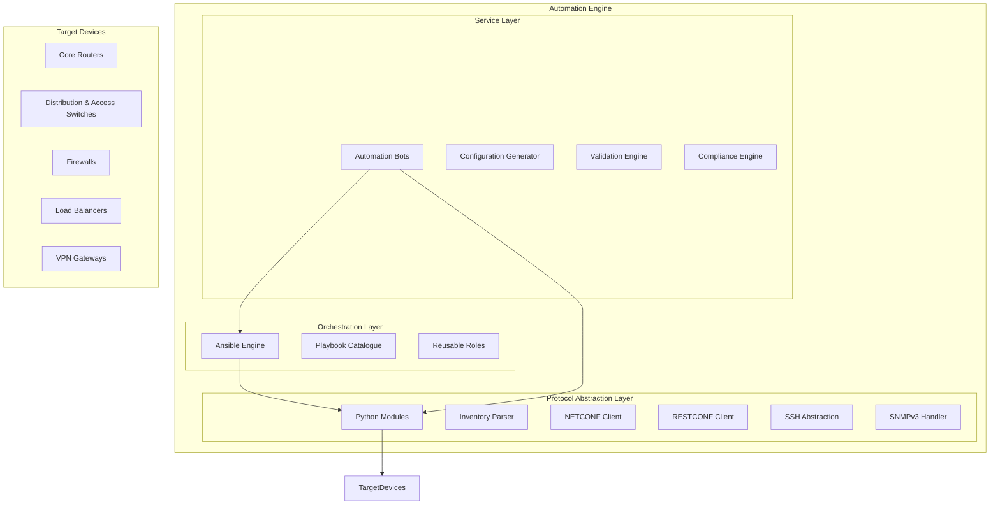
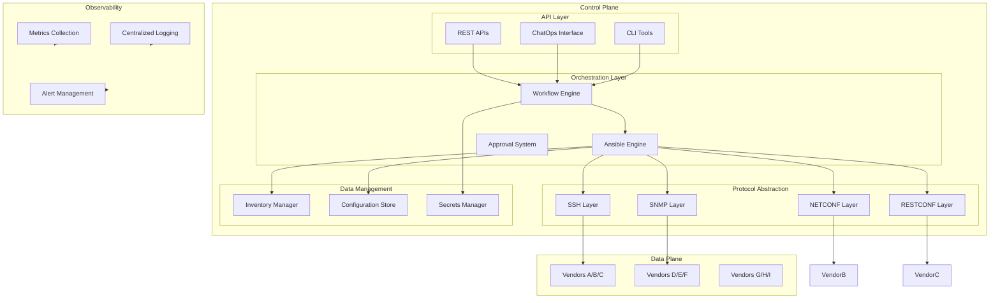
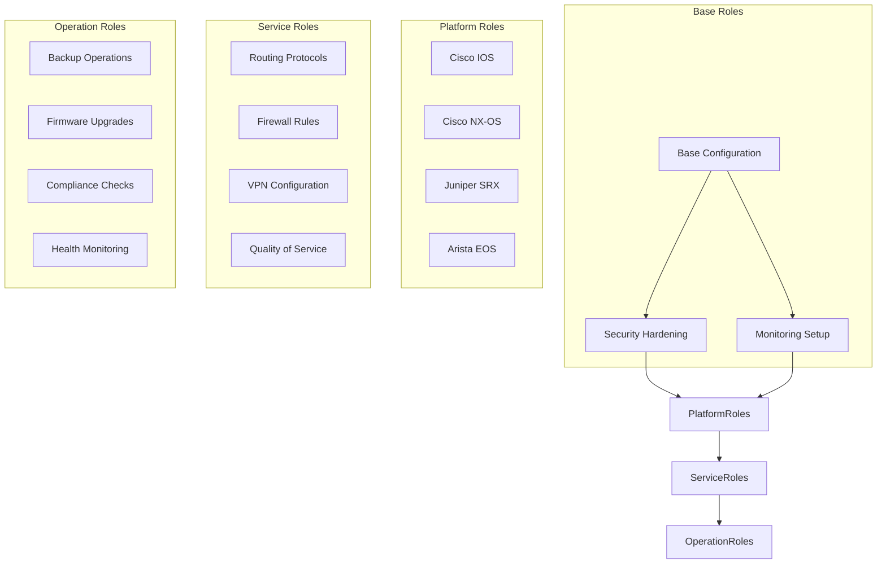
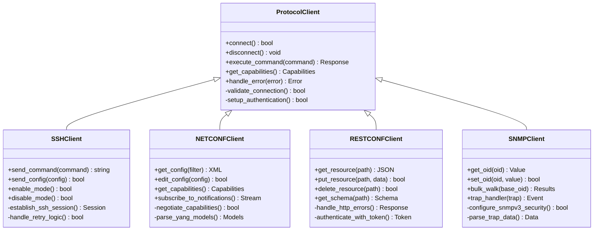
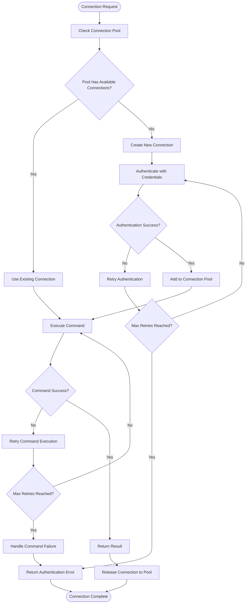
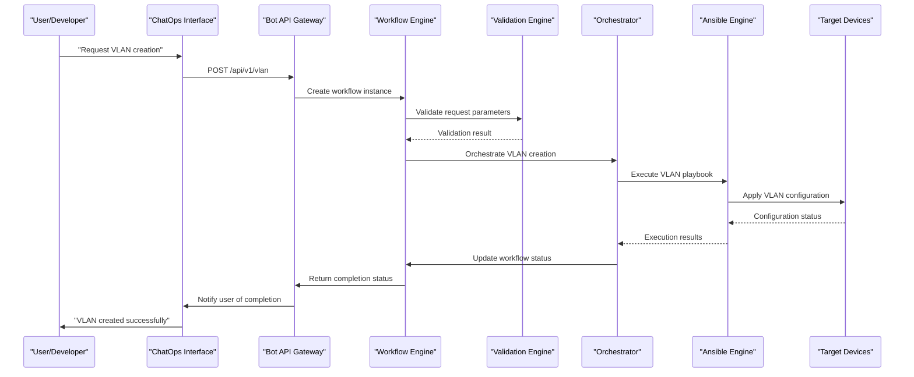
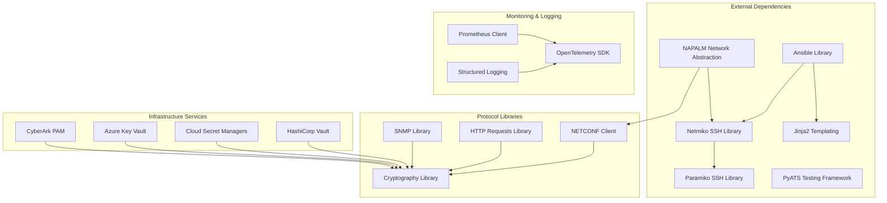
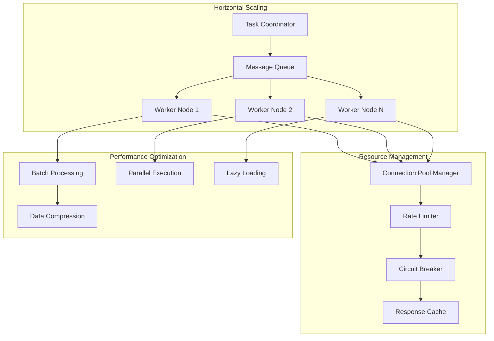

# Automation Engine Architecture

<cite>
**Referenced Files in This Document**
- [README.md](file://README.md)
</cite>

## Table of Contents
1. [Introduction](#introduction)
2. [Project Structure](#project-structure)
3. [Core Components](#core-components)
4. [Architecture Overview](#architecture-overview)
5. [Detailed Component Analysis](#detailed-component-analysis)
6. [Dependency Analysis](#dependency-analysis)
7. [Performance Considerations](#performance-considerations)
8. [Troubleshooting Guide](#troubleshooting-guide)
9. [Conclusion](#conclusion)

## Introduction

The Enterprise Network Automation Platform is a production-grade, vendor-agnostic network automation system designed to manage thousands of network devices across multi-vendor, multi-region environments. The platform implements Infrastructure as Code, GitOps, CI/CD, compliance enforcement, observability, and security patterns that simulate how Fortune 100 organizations automate the full lifecycle of routers, switches, firewalls, load balancers, VPN gateways, and cloud networking components.

The automation engine subsystem serves as the core orchestration layer, combining Ansible-based orchestration with specialized Python modules for protocol-specific operations and bot-driven self-service capabilities. This architecture enables enterprise-scale network automation while maintaining strict security, compliance, and operational reliability standards.

## Project Structure

The automation engine follows a modular, role-based design pattern with clear separation between orchestration logic, protocol implementations, and user-facing interfaces.

**Diagram sources**
- [README.md:52-99](file://README.md#L52-L99)
- [README.md:103-180](file://README.md#L103-L180)

**Section sources**
- [README.md:103-180](file://README.md#L103-L180)

## Core Components

### Ansible-Based Orchestration Layer

The Ansible engine serves as the primary orchestration mechanism, providing role-based modular design for device configuration management. The system supports multiple vendors including Cisco (IOS, IOS-XE, NX-OS), Juniper (SRX, MX), Arista (EOS), Palo Alto, Fortinet, Check Point, F5, pfSense, and OPNsense.

Key orchestration capabilities include:
- **Role-based modular design**: Reusable roles for common operations like AAA, NTP, DNS, SNMP, and syslog configuration
- **Template-driven configuration**: Jinja2 templates with structured data for consistent configuration generation
- **Multi-environment support**: Separate inventories for production, staging, lab, and disaster recovery environments
- **Vendor abstraction**: Unified interface across different vendor platforms and protocols

### Python Module Architecture

The Python automation layer provides specialized functionality for complex operations that require more sophisticated logic than Ansible can handle efficiently.

#### Protocol-Specific Clients

| Module | Purpose | Key Features |
|--------|---------|--------------|
| `inventory/` | Inventory parsing, device enrichment, CMDB integration | Multi-source inventory aggregation, dynamic device discovery |
| `netconf/` | NETCONF client with capability negotiation | YANG model support, session management, error handling |
| `restconf/` | RESTCONF client with YANG model support | HTTP/HTTPS transport, authentication, response parsing |
| `ssh/` | SSH abstraction over Netmiko/Paramiko with retry | Connection pooling, retry logic, timeout handling |
| `snmp/` | SNMPv3 polling and trap handling | Secure SNMP operations, bulk collection, alert processing |

#### Specialized Task Modules

| Module | Purpose | Implementation Details |
|--------|---------|----------------------|
| `telemetry/` | Model-driven telemetry receiver and parser | Real-time data streaming, metric extraction, anomaly detection |
| `config_gen/` | Jinja2-based configuration generation from structured data | Template rendering, validation, diff generation |
| `validation/` | Pre-deployment config validation (syntax + semantics) | Syntax checking, semantic analysis, policy enforcement |
| `backup/` | Backup management with versioning and encryption | Automated backups, retention policies, secure storage |
| `compliance/` | Compliance engine with pluggable rule sets | Policy evaluation, violation reporting, remediation suggestions |
| `utils/` | Logging, retry, concurrency, diff, bulk operations | Shared utilities, performance optimization, error handling |

**Section sources**
- [README.md:438-456](file://README.md#L438-L456)

### Bot Architecture for Self-Service Operations

The bot system provides REST APIs and optional ChatOps integrations for self-service network operations, enabling developers and operators to request and deploy network changes through standardized interfaces.

#### Bot Categories and Responsibilities

| Bot Type | API Endpoints | ChatOps Integration | Primary Function |
|----------|---------------|-------------------|------------------|
| **Firewall Bot** | `/api/v1/firewall/rules` | Slack/Teams | Request, validate, and deploy firewall rules |
| **VLAN Bot** | `/api/v1/vlan` | Slack | Provision VLANs with approval workflow |
| **Port Bot** | `/api/v1/port` | Slack | Enable/disable/configure switch ports |
| **Backup Bot** | `/api/v1/backup` | GitHub | Trigger and schedule device backups |
| **Health Bot** | `/api/v1/health` | Slack/Teams | On-demand health checks across all devices |
| **Compliance Bot** | `/api/v1/compliance` | GitHub | Run compliance scans and report violations |
| **Upgrade Bot** | `/api/v1/upgrade` | Slack | Orchestrate firmware upgrades with rollback |
| **Rollback Bot** | `/api/v1/rollback` | Slack/Teams | One-click rollback to last known good config |
| **ChatOps Bot** | `/api/v1/chatops` | Slack/Teams | Unified command router for all bot operations |
| **Approval Bot** | `/api/v1/approvals` | Slack/Teams | Manage approval workflows for change requests |

**Section sources**
- [README.md:460-476](file://README.md#L460-L476)

## Architecture Overview

The automation engine implements a layered architecture that separates concerns between orchestration, protocol abstraction, and service delivery while maintaining scalability and reliability.

**Diagram sources**
- [README.md:52-99](file://README.md#L52-L99)
- [README.md:339-357](file://README.md#L339-L357)

## Detailed Component Analysis

### Ansible Role-Based Modular Design

The Ansible implementation follows a strict role-based architecture where each role encapsulates specific functionality and can be reused across different playbooks and environments.

#### Role Hierarchy and Dependencies

**Diagram sources**
- [README.md:115-128](file://README.md#L115-L128)
- [README.md:371-435](file://README.md#L371-L435)

#### Playbook Organization Pattern

The playbook structure follows a hierarchical organization with clear separation of concerns:

| Category | Purpose | Examples |
|----------|---------|----------|
| **Device Lifecycle** | Initial provisioning and basic configuration | `initial_provisioning.yml`, `hostname.yml`, `aaa.yml` |
| **Network Services** | Network service deployment | `vlan.yml`, `trunk.yml`, `lacp.yml`, `qos.yml` |
| **Routing Protocols** | Dynamic routing configuration | `ospf.yml`, `bgp.yml`, `isis.yml`, `static_routes.yml` |
| **High Availability** | Redundancy and failover setup | `vrrp.yml`, `hsrp.yml` |
| **Operations** | Maintenance and monitoring tasks | `backup.yml`, `firmware_upgrade.yml`, `compliance_scan.yml` |

**Section sources**
- [README.md:371-435](file://README.md#L371-L435)

### Python Module Architecture

The Python automation layer provides sophisticated protocol handling and business logic that extends beyond Ansible's capabilities.

#### Protocol Abstraction Layer

**Diagram sources**
- [README.md:438-456](file://README.md#L438-L456)

#### Connection Pooling and Retry Logic

The SSH abstraction layer implements sophisticated connection management with built-in retry mechanisms:

**Diagram sources**
- [README.md:447](file://README.md#L447)

### Bot Architecture and Workflow Orchestration

The bot system provides a unified interface for self-service network operations with comprehensive workflow orchestration.

#### Bot Communication Flow

**Diagram sources**
- [README.md:460-476](file://README.md#L460-L476)

#### Workflow Orchestration Patterns

The system implements several key orchestration patterns:

| Pattern | Description | Use Case |
|---------|-------------|----------|
| **Sequential Workflow** | Tasks execute in defined order with dependency management | Firmware upgrades with pre/post checks |
| **Parallel Workflow** | Multiple tasks execute concurrently with coordination | Bulk configuration updates across device groups |
| **Conditional Workflow** | Branch execution based on runtime conditions | Rollback decisions based on health check results |
| **Retry Workflow** | Automatic retry with exponential backoff | Transient network failures during configuration |
| **Compensating Workflow** | Rollback actions when primary operations fail | Partial deployment failures requiring cleanup |

**Section sources**
- [README.md:460-476](file://README.md#L460-L476)

## Dependency Analysis

The automation engine maintains clear separation of dependencies while supporting flexible integration patterns.

**Diagram sources**
- [README.md:184-199](file://README.md#L184-L199)
- [README.md:339-357](file://README.md#L339-L357)

### Protocol Support Matrix

The system supports multiple network protocols with vendor-specific optimizations:

| Protocol | Vendors | Features | Performance Characteristics |
|----------|---------|----------|----------------------------|
| **SSH** | All vendors | Command execution, file transfer, session management | Connection pooling, keep-alive, compression |
| **NETCONF** | Cisco, Juniper, Arista | Configuration management, state queries, notifications | Capability negotiation, batch operations, streaming |
| **RESTCONF** | Modern vendors | RESTful API access, YANG model support | HTTP/2, connection reuse, caching |
| **SNMP** | All vendors | Polling, traps, bulk operations | Concurrent polling, OID batching, trap filtering |

**Section sources**
- [README.md:203-226](file://README.md#L203-L226)

## Performance Considerations

The automation engine is designed for enterprise-scale operations managing thousands of devices concurrently with horizontal scaling capabilities.

### Connection Management Strategies

| Strategy | Implementation | Benefits |
|----------|----------------|----------|
| **Connection Pooling** | Persistent SSH/NETCONF connections with automatic recycling | Reduced connection overhead, faster response times |
| **Connection Multiplexing** | Multiple commands over single connections | Lower latency, reduced resource consumption |
| **Adaptive Timeouts** | Dynamic timeout adjustment based on device characteristics | Improved reliability, better resource utilization |
| **Graceful Degradation** | Fallback mechanisms when primary protocols fail | Enhanced availability, fault tolerance |

### Concurrency and Scaling Patterns

**Diagram sources**
- [README.md:696](file://README.md#L696)

### Performance Optimization Techniques

| Technique | Implementation | Impact |
|-----------|----------------|--------|
| **Intelligent Caching** | Device capability caching, template result caching | Reduced API calls, faster template rendering |
| **Batch Operations** | Grouped configuration changes, bulk data collection | Lower protocol overhead, improved throughput |
| **Asynchronous Processing** | Non-blocking I/O, background task processing | Better resource utilization, improved responsiveness |
| **Memory Management** | Object pooling, garbage collection tuning | Reduced memory footprint, stable performance |

### Horizontal Scaling Architecture

The system supports Kubernetes-based scaling for automation workers:

| Component | Scaling Strategy | Capacity Planning |
|-----------|------------------|-------------------|
| **API Workers** | Horizontal pod autoscaling based on request volume | 1 worker per 100 concurrent requests |
| **Task Executors** | Queue-based distribution with worker auto-scaling | 1 executor per 50 devices |
| **Protocol Handlers** | Protocol-specific scaling with connection limits | Tuned per protocol characteristics |
| **Database Layer** | Read replicas for query-heavy operations | Sharding by environment/region |

**Section sources**
- [README.md:696](file://README.md#L696)

## Troubleshooting Guide

The automation engine includes comprehensive troubleshooting capabilities and diagnostic tools for rapid issue resolution.

### Common Issues and Resolutions

| Issue Category | Symptoms | Diagnostic Steps | Resolution |
|----------------|----------|------------------|------------|
| **Connection Failures** | Timeout errors, authentication failures | Check device reachability, verify credentials, inspect logs | Validate network connectivity, refresh secrets, update device configurations |
| **Template Rendering Errors** | Jinja2 syntax errors, missing variables | Review template syntax, check variable definitions | Fix template syntax, ensure required variables are present |
| **Compliance Violations** | Policy check failures, non-compliant configurations | Review compliance reports, identify violations | Update configurations to meet policy requirements |
| **Performance Degradation** | Slow execution times, high resource usage | Monitor metrics, analyze bottlenecks | Optimize connection pooling, adjust concurrency settings |
| **Secret Management Issues** | Authentication failures, vault access errors | Verify vault connectivity, check permissions | Refresh tokens, update vault policies, validate credentials |

### Diagnostic Tools and Commands

| Tool | Purpose | Usage Example |
|------|---------|---------------|
| **Environment Validator** | Verify system prerequisites and dependencies | `python scripts/validate_environment.py` |
| **Connectivity Tester** | Test device connectivity and protocol support | `ansible all -m ping -i inventories/lab/hosts.yml` |
| **Template Debugger** | Debug Jinja2 template rendering issues | `python -m python.config_gen --debug --device <name>` |
| **Compliance Reporter** | Generate detailed compliance violation reports | `python -m python.compliance --inventory inventories/lab/hosts.yml` |
| **Performance Profiler** | Analyze automation performance and bottlenecks | Built-in profiling with Prometheus metrics |

### Log Analysis and Monitoring

The system provides structured logging and comprehensive monitoring:

| Log Level | Purpose | Retention | Access Method |
|-----------|---------|-----------|---------------|
| **DEBUG** | Detailed execution traces | 7 days | Local files, centralized logging |
| **INFO** | Normal operational events | 30 days | Centralized logging, log aggregation |
| **WARNING** | Potential issues and anomalies | 90 days | Alerting, dashboard monitoring |
| **ERROR** | Operational failures and exceptions | 1 year | Alerting, incident response |
| **CRITICAL** | System failures and security events | Permanent | Immediate alerting, audit trail |

**Section sources**
- [README.md:674-685](file://README.md#L674-L685)

## Conclusion

The Enterprise Network Automation Platform demonstrates a mature, enterprise-grade approach to network automation that balances flexibility, scalability, and reliability. The architecture successfully addresses the challenges of managing thousands of heterogeneous network devices while maintaining strict security, compliance, and operational standards.

Key architectural strengths include:

- **Modular Design**: Clear separation of concerns between orchestration, protocol abstraction, and service delivery
- **Protocol Agnostic**: Unified interface supporting multiple vendors and communication protocols
- **Enterprise Scale**: Horizontal scaling capabilities and optimized resource utilization for large deployments
- **Security First**: Comprehensive secrets management, compliance enforcement, and audit capabilities
- **Operational Excellence**: Robust monitoring, logging, and troubleshooting capabilities

The platform's design principles—Network as Code, Infrastructure as Code, GitOps, DevSecOps, and Compliance as Code—provide a solid foundation for modern network automation practices that can evolve with organizational needs and technological advancements.