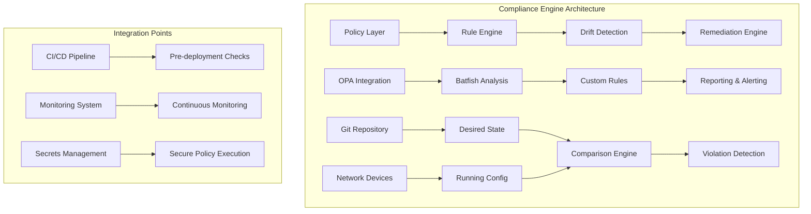
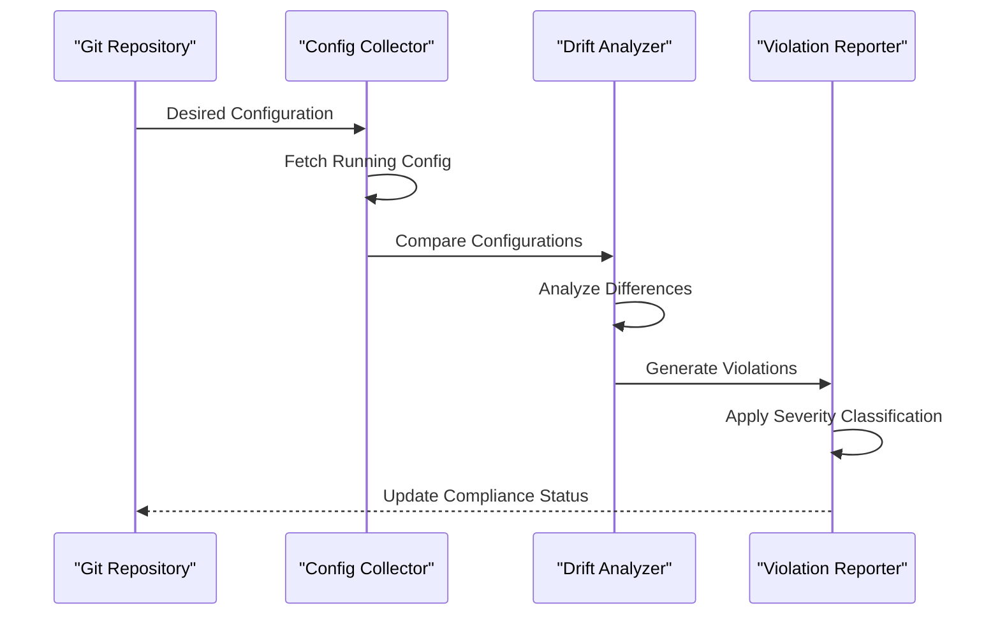
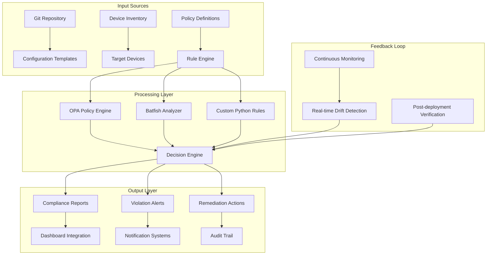
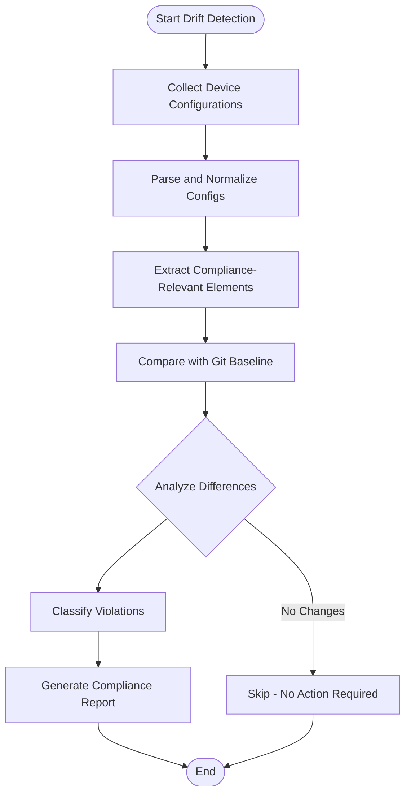
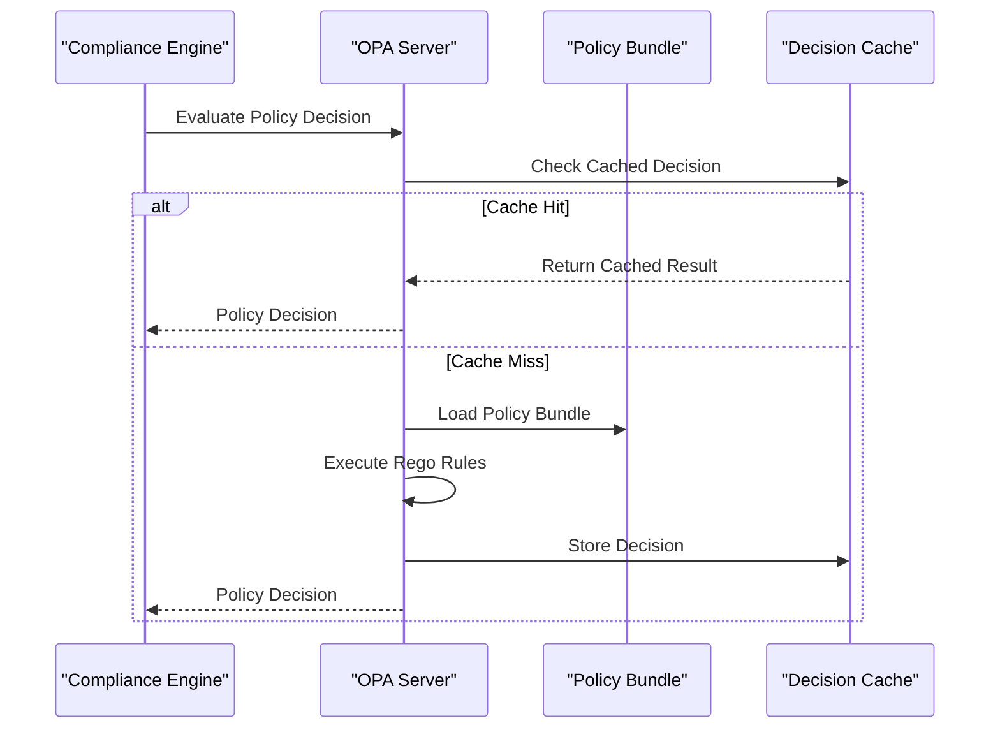
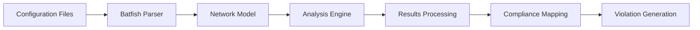
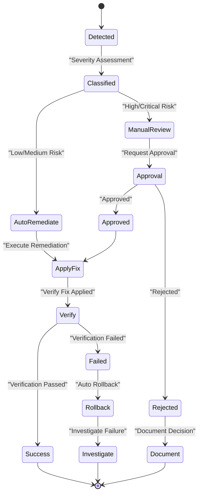
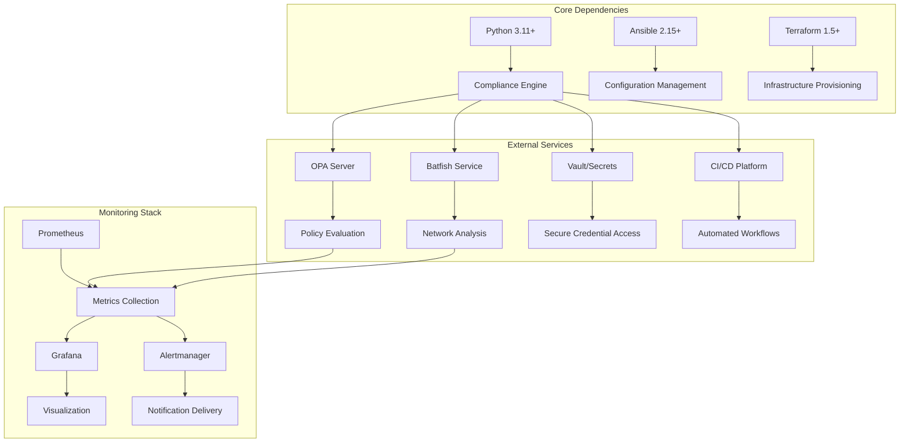

# Compliance Engine

<cite>
**Referenced Files in This Document**
- [README.md](file://README.md)
</cite>

## Table of Contents
1. [Introduction](#introduction)
2. [Project Structure](#project-structure)
3. [Core Components](#core-components)
4. [Architecture Overview](#architecture-overview)
5. [Detailed Component Analysis](#detailed-component-analysis)
6. [Dependency Analysis](#dependency-analysis)
7. [Performance Considerations](#performance-considerations)
8. [Troubleshooting Guide](#troubleshooting-guide)
9. [Conclusion](#conclusion)
10. [Appendices](#appendices)

## Introduction

The Compliance Engine is a sophisticated, multi-layered security and policy enforcement system designed for enterprise-scale network automation. Built as part of an Enterprise Network Automation Platform, it provides comprehensive compliance monitoring, policy enforcement, and automated remediation capabilities across multi-vendor, multi-region network environments.

The engine implements a "Compliance as Code" philosophy where all policies, rules, and enforcement mechanisms are version-controlled, testable, and deployable through GitOps workflows. It integrates multiple advanced technologies including Open Policy Agent (OPA), Batfish for network simulation, and custom Python-based compliance checks to provide defense-in-depth security posture management.

This documentation covers the pluggable rule architecture, drift detection mechanisms, OPA integration, Batfish analysis capabilities, and practical examples for implementing custom compliance rules and automated remediation workflows.

## Project Structure

The compliance engine follows a modular architecture organized around distinct functional areas:



**Diagram sources**
- [README.md:548-582](file://README.md#L548-L582)

The compliance system operates at multiple layers:

### Policy Definition Layer
- **OPA Policies**: Declarative policy definitions using Rego language
- **Custom Python Rules**: Programmatic compliance checks with complex logic
- **Batfish Analysis**: Network behavior validation and reachability analysis

### Enforcement Layer
- **Pre-deployment Validation**: Policy checks during CI/CD pipeline
- **Runtime Monitoring**: Continuous compliance verification against running configurations
- **Automated Remediation**: Self-healing capabilities for common violations

### Data Collection Layer
- **Configuration Drift Detection**: Comparison between Git-defined desired state and device running configuration
- **Telemetry Integration**: Real-time compliance metrics collection
- **Audit Trail**: Comprehensive logging of all compliance activities

**Section sources**
- [README.md:548-582](file://README.md#L548-L582)

## Core Components

The compliance engine consists of several interconnected components that work together to provide comprehensive policy enforcement:

### Pluggable Rule Architecture

The rule engine supports multiple types of compliance checks with standardized interfaces:

#### Severity Levels
- **Critical**: Immediate action required, blocks deployment
- **High**: Significant risk, requires approval before proceeding
- **Medium**: Important but non-blocking, generates warnings
- **Low**: Informational, tracks best practice adherence

#### Rule Categories
- **Security Policies**: SSH-only access, approved ciphers, authentication requirements
- **Operational Standards**: NTP configuration, logging, backup procedures
- **Network Best Practices**: ACL standards, routing protocols, firewall rules
- **Vendor-Specific Compliance**: Platform-specific security baselines

### Drift Detection Mechanisms

The system continuously monitors configuration drift between desired state (Git) and running configuration:



**Diagram sources**
- [README.md:428-434](file://README.md#L428-L434)

### OPA Integration

Open Policy Agent provides declarative policy enforcement:

- **Rego Policy Language**: Human-readable policy definitions
- **Decision Engine**: Fast policy evaluation with caching
- **Policy Bundles**: Versioned policy packages with dependency management
- **Integration Points**: GitHub Actions, API endpoints, CLI tools

### Batfish Integration

Advanced network analysis capabilities through Batfish:

- **ACL Analysis**: Detect shadow rules, conflicts, and unused entries
- **Reachability Testing**: Validate network connectivity and security policies
- **Routing Analysis**: Verify routing table correctness and loop prevention
- **Firewall Rule Optimization**: Identify redundant or conflicting rules

**Section sources**
- [README.md:552-582](file://README.md#L552-L582)

## Architecture Overview

The compliance engine implements a layered architecture that ensures comprehensive coverage across the entire network automation lifecycle:



**Diagram sources**
- [README.md:548-582](file://README.md#L548-L582)

### Key Architectural Principles

1. **Separation of Concerns**: Each component has a single responsibility
2. **Pluggable Design**: New rule types can be added without modifying core logic
3. **Fail-safe Defaults**: Non-compliant changes are blocked by default
4. **Auditability**: Complete traceability from policy to violation to remediation
5. **Scalability**: Distributed processing for large network environments

## Detailed Component Analysis

### Pluggable Rule Architecture

The rule engine implements a plugin-based architecture that allows for extensible compliance checking:

#### Rule Interface Specification

All compliance rules must implement a standardized interface:

| Component | Responsibility | Interface |
|-----------|---------------|-----------|
| **Rule Loader** | Discovers and loads rule plugins | File-based discovery, metadata parsing |
| **Rule Executor** | Executes individual rules against targets | Asynchronous execution, timeout handling |
| **Result Aggregator** | Combines results from multiple rules | Standardized result format, severity mapping |
| **Policy Manager** | Manages rule versions and dependencies | Semantic versioning, conflict resolution |

#### Rule Metadata Schema

Each rule includes comprehensive metadata:

```yaml
rule_metadata:
  id: "SSH-ONLY-POLICY"
  name: "SSH Only Access Control"
  description: "Ensures only SSH is enabled, Telnet is disabled"
  severity: "critical"
  category: "security"
  vendor_support: ["cisco", "juniper", "arista"]
  remediation: "Disable telnet service and enable SSH"
  references: ["CIS-Benchmark-1.2.1", "NIST-AC-12"]
  tags: ["ssh", "telnet", "access-control"]
```

#### Custom Rule Development Process

Developers can create custom compliance rules following these steps:

1. **Define Rule Logic**: Implement check function with input/output specifications
2. **Add Metadata**: Include comprehensive rule documentation and classification
3. **Write Tests**: Create unit tests covering normal and edge cases
4. **Register Plugin**: Add rule to the discovery mechanism
5. **Configure Policy**: Define when and how the rule should execute

**Section sources**
- [README.md:552-582](file://README.md#L552-L582)

### Drift Detection Implementation

The drift detection system compares desired state configurations against running device configurations:

#### Configuration Collection Strategy



**Diagram sources**
- [README.md:428-434](file://README.md#L428-L434)

#### Normalization and Comparison Engine

The system handles vendor-specific configuration formats through normalization:

- **Vendor Abstraction Layer**: Converts different config formats to common representation
- **Semantic Comparison**: Understands configuration semantics, not just text differences
- **Change Impact Analysis**: Determines if changes affect compliance posture
- **Rollback Detection**: Identifies unauthorized configuration changes

#### Real-time Monitoring Integration

For continuous compliance monitoring:

- **Event-driven Updates**: React to configuration changes in real-time
- **Threshold-based Alerting**: Configure sensitivity levels for different violation types
- **Trend Analysis**: Track compliance improvements over time
- **Automated Escalation**: Route critical violations to appropriate teams

### OPA Policy Integration

Open Policy Agent integration provides powerful declarative policy enforcement:

#### Policy Bundle Structure

```
policies/
├── bundles/
│   ├── security/
│   │   ├── data.json
│   │   └── security.rego
│   ├── operations/
│   │   ├── data.json
│   │   └── operations.rego
│   └── network/
│       ├── data.json
│       └── network.rego
└── manifest.yaml
```

#### Policy Evaluation Flow



**Diagram sources**
- [README.md:570-579](file://README.md#L570-L579)

#### Advanced Policy Features

- **Data Integration**: Combine policy decisions with external data sources
- **Policy Composition**: Build complex policies from reusable components
- **Version Control**: Track policy changes with full audit trail
- **Testing Framework**: Unit test policies with mock data

### Batfish Network Analysis

Batfish integration enables deep network configuration analysis:

#### Analysis Types

| Analysis Type | Purpose | Output |
|--------------|---------|--------|
| **ACL Reachability** | Validate firewall rule effectiveness | Reachability matrix, shadow rules |
| **Routing Analysis** | Verify routing table correctness | Routing loops, black holes |
| **Configuration Consistency** | Ensure consistent policy application | Policy conflicts, gaps |
| **Security Posture** | Assess overall network security | Vulnerability assessment |

#### Integration Workflow



**Diagram sources**
- [README.md:525-529](file://README.md#L525-L529)

### Automated Remediation Engine

The remediation system provides both automated and manual intervention capabilities:

#### Remediation Strategies

1. **Automatic Remediation**: Self-healing for low-risk violations
2. **Approval Workflow**: Manual review for high-risk changes
3. **Staged Deployment**: Gradual rollout with rollback capability
4. **Emergency Override**: Controlled bypass for critical situations

#### Workflow Orchestration



**Section sources**
- [README.md:428-434](file://README.md#L428-L434)
- [README.md:570-579](file://README.md#L570-L579)

## Dependency Analysis

The compliance engine has well-defined dependencies and integration points:



**Diagram sources**
- [README.md:184-200](file://README.md#L184-L200)

### External Integrations

#### OPA Integration Points
- **HTTP API**: RESTful interface for policy evaluation
- **Bundle Management**: Automated policy distribution and updates
- **Decision Logging**: Audit trail of all policy decisions
- **Health Monitoring**: Service availability and performance metrics

#### Batfish Service Integration
- **Snapshot Management**: Configuration snapshot creation and versioning
- **Analysis Jobs**: Asynchronous job submission and result retrieval
- **Data Persistence**: Long-term storage of analysis results
- **Resource Management**: Scaling and load balancing for analysis workloads

#### Secrets Management Integration
- **Dynamic Credentials**: Runtime credential injection for secure operations
- **Key Rotation**: Automatic secret rotation without service disruption
- **Access Control**: Fine-grained permissions for different compliance operations
- **Audit Logging**: Complete audit trail of secret access patterns

**Section sources**
- [README.md:184-200](file://README.md#L184-L200)

## Performance Considerations

The compliance engine is designed for enterprise-scale performance:

### Scalability Patterns

1. **Horizontal Scaling**: Stateless design allows easy horizontal scaling
2. **Asynchronous Processing**: Non-blocking operations for long-running tasks
3. **Caching Strategies**: Intelligent caching of policy decisions and analysis results
4. **Batch Processing**: Efficient processing of large configuration sets

### Resource Optimization

- **Memory Management**: Streaming processing for large configuration files
- **CPU Utilization**: Parallel processing with configurable worker pools
- **I/O Optimization**: Buffered operations and connection pooling
- **Network Efficiency**: Compression and batching for remote operations

### Monitoring and Observability

- **Performance Metrics**: CPU, memory, and throughput monitoring
- **Bottleneck Identification**: Profiling tools for performance optimization
- **Capacity Planning**: Trend analysis for resource planning
- **Alerting**: Proactive alerts for performance degradation

## Troubleshooting Guide

Common issues and their resolutions:

### Policy Evaluation Issues

| Issue | Symptoms | Resolution |
|-------|----------|------------|
| **OPA Connection Failure** | Timeout errors, connection refused | Verify OPA service health, check network connectivity |
| **Policy Bundle Loading Errors** | Missing files, syntax errors | Validate bundle structure, check file permissions |
| **Slow Policy Evaluation** | High latency, timeouts | Review policy complexity, optimize Rego rules |

### Drift Detection Problems

| Issue | Symptoms | Resolution |
|-------|----------|------------|
| **Configuration Collection Failures** | Authentication errors, timeouts | Verify device credentials, check network reachability |
| **Parsing Errors** | Invalid configuration format | Update parser for new vendor formats |
| **False Positives** | Incorrect violation detection | Tune comparison thresholds, update normalization rules |

### Remediation Failures

| Issue | Symptoms | Resolution |
|-------|----------|------------|
| **Permission Denied** | Insufficient privileges on target devices | Review user roles, update credential scope |
| **Rollback Failures** | Incomplete remediation, partial application | Implement transaction-like operations, improve error handling |
| **Timeout During Application** | Slow device responses, connection drops | Adjust timeouts, implement retry logic |

### Debugging Tools

- **Verbose Logging**: Enable debug-level logging for detailed troubleshooting
- **Policy Simulation**: Test policy changes against sample configurations
- **Performance Profiling**: Identify bottlenecks in rule execution
- **Network Diagnostics**: Connectivity and protocol validation tools

**Section sources**
- [README.md:674-685](file://README.md#L674-L685)

## Conclusion

The Compliance Engine represents a comprehensive approach to network security and policy enforcement in enterprise environments. By combining multiple technologies—OPA for declarative policy, Batfish for deep network analysis, and custom Python rules for domain-specific checks—it provides defense-in-depth security posture management.

Key strengths include:

- **Extensibility**: Pluggable architecture allows easy addition of new compliance checks
- **Automation**: End-to-end workflow from policy definition to remediation
- **Visibility**: Comprehensive reporting and monitoring capabilities
- **Scalability**: Designed for large, multi-vendor network environments
- **Integration**: Seamless operation within existing DevSecOps pipelines

The engine's emphasis on "Compliance as Code" ensures that security policies are treated with the same rigor as application code—version controlled, tested, and deployed through established development workflows. This approach not only improves security posture but also enhances operational efficiency and reduces human error in compliance management.

Future enhancements include AI-driven anomaly detection, zero-touch provisioning integration, and advanced self-healing capabilities to further automate compliance enforcement and remediation processes.

## Appendices

### Example Compliance Rules

#### SSH Security Policy
- **Objective**: Ensure only SSH is enabled, Telnet is disabled
- **Severity**: Critical
- **Remediation**: Automatically disable Telnet service
- **References**: CIS Benchmark, NIST guidelines

#### NTP Configuration Standard
- **Objective**: All devices must have NTP configured
- **Severity**: High
- **Remediation**: Apply standard NTP configuration template
- **Validation**: Verify time synchronization status

#### Firewall Rule Analysis
- **Objective**: Detect shadow rules, any-any rules, and conflicts
- **Severity**: Critical
- **Tool**: Batfish ACL analysis
- **Remediation**: Generate optimized rule set

### Configuration Examples

#### OPA Policy Bundle Structure
```
policies/security/
├── data.json          # Policy data and parameters
├── ssh_policy.rego    # SSH security policies
├── ntp_policy.rego    # NTP configuration policies
└── firewall_policy.rego # Firewall rule policies
```

#### Custom Python Rule Template
```python
class BaseComplianceRule:
    def __init__(self, rule_id, severity, description):
        self.rule_id = rule_id
        self.severity = severity
        self.description = description
    
    def execute(self, device_config):
        """Override in subclass"""
        raise NotImplementedError
    
    def get_remediation(self):
        """Return remediation instructions"""
        return None
```

### Integration Commands

#### Running Compliance Scans
```bash
# Full compliance scan
python -m python.compliance --inventory inventories/lab/hosts.yml

# Targeted scan for specific policies
python -m python.compliance --policy ssh-only --device core-rtr-01

# Generate compliance report
python -m python.compliance --report-format json --output ./reports/
```

#### OPA Policy Testing
```bash
# Test policy locally
opa eval --data policies/security/data.json --input config.json "data.security.ssh_allowed"

# Bundle validation
opa build -t tar policies/

# Policy debugging
opa run --server --log-level=debug
```