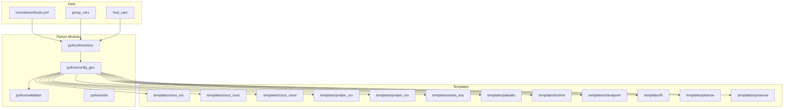
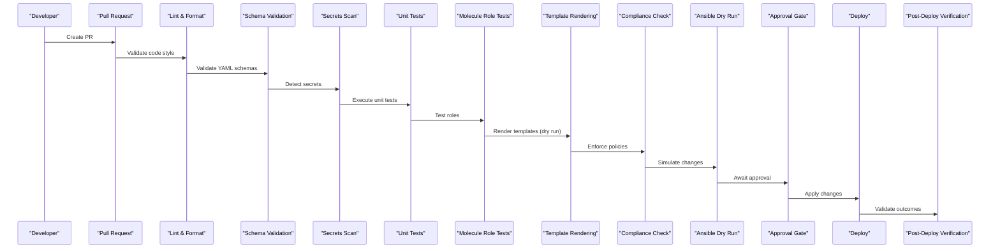
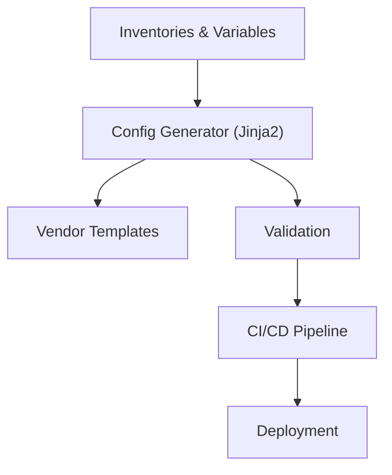

# Configuration Generation Engine

<cite>
**Referenced Files in This Document**
- [README.md](file://README.md)
</cite>

## Table of Contents
1. [Introduction](#introduction)
2. [Project Structure](#project-structure)
3. [Core Components](#core-components)
4. [Architecture Overview](#architecture-overview)
5. [Detailed Component Analysis](#detailed-component-analysis)
6. [Dependency Analysis](#dependency-analysis)
7. [Performance Considerations](#performance-considerations)
8. [Troubleshooting Guide](#troubleshooting-guide)
9. [Conclusion](#conclusion)
10. [Appendices](#appendices)

## Introduction
This document explains the Jinja2-based configuration generation engine within the Enterprise Network Automation Platform. It describes how structured data inputs are transformed into vendor-specific device configurations, how templates are organized by vendor/platform, how variables are resolved across hierarchies, and how conditional logic is applied. It also covers the validation framework that enforces syntax and semantic requirements before deployment, along with guidance for creating custom templates, defining reusable filters, and implementing complex multi-vendor scenarios.

The platform follows a “Network as Code” approach: all device configurations are generated from Jinja2 templates combined with structured data (YAML), integrated into a GitOps workflow with CI/CD gates, compliance checks, and automated verification.

## Project Structure
The repository organizes automation assets around Ansible and Python modules, with Jinja2 templates grouped per vendor/platform under a dedicated directory. The configuration generation pipeline integrates with inventory management, variable resolution, template rendering, and pre-deployment validation.

**Diagram sources**
- [README.md:105-180](file://README.md#L105-L180)
- [README.md:438-456](file://README.md#L438-L456)

**Section sources**
- [README.md:105-180](file://README.md#L105-L180)
- [README.md:438-456](file://README.md#L438-L456)

## Core Components
- Templates Directory: Vendor/platform-specific Jinja2 templates reside under templates/<vendor_platform>. These templates define the target device configuration syntax and structure.
- Python config_gen Module: Implements the Jinja2-based configuration generation engine, loading structured data and rendering templates to produce final configurations.
- Validation Module: Provides pre-deployment validation to ensure generated configurations meet syntax and semantic requirements before any changes are applied.
- Inventory and Variables: Structured device definitions and variables are provided via inventories and group_vars/host_vars, enabling hierarchical variable resolution.

Key responsibilities:
- Template selection based on device vendor/platform metadata.
- Variable resolution across environment, group, and host scopes.
- Rendering pipelines with optional filters and macros.
- Validation hooks to enforce policy and correctness prior to deployment.

**Section sources**
- [README.md:105-180](file://README.md#L105-L180)
- [README.md:438-456](file://README.md#L438-L456)

## Architecture Overview
The configuration generation pipeline integrates with the broader GitOps workflow. Changes are validated early (linting, schema checks, secrets scanning), then templates are rendered and verified through dry runs and compliance checks before deployment.

**Diagram sources**
- [README.md:479-515](file://README.md#L479-L515)

## Detailed Component Analysis

### Template Organization by Vendor/Platform
Templates are grouped per vendor/platform to isolate syntax differences and platform-specific features. Examples include Cisco IOS, IOS-XE, NX-OS; Juniper SRX/MX; Arista EOS; Palo Alto PAN-OS; Fortinet FortiOS; Check Point Gaia; F5 BIG-IP; pfSense; OPNsense.

Best practices:
- Keep each vendor/platform’s templates in its own folder.
- Use consistent naming conventions for template files (e.g., vlan.j2, acl.j2).
- Centralize shared logic using Jinja2 includes/macros where appropriate.

**Section sources**
- [README.md:105-180](file://README.md#L105-L180)

### Variable Resolution Hierarchy
Variables are defined at multiple levels to support reuse and override semantics:
- Environment-level inventories (production, staging, lab, dr).
- Group-level variables (group_vars) for common settings across device groups.
- Host-level variables (host_vars) for device-specific overrides.

Resolution order typically follows:
1. Defaults (template or module defaults)
2. Group variables
3. Host variables
4. Environment-specific overrides

Device metadata such as vendor and platform drive template selection and conditional logic.

**Section sources**
- [README.md:105-180](file://README.md#L105-L180)
- [README.md:284-335](file://README.md#L284-L335)

### Conditional Logic Patterns
Conditional logic in templates should reflect device capabilities and operational context:
- Feature toggles based on platform capabilities (e.g., OSPF vs IS-IS).
- Policy enforcement (e.g., SSH-only, SNMPv3 only).
- Regional/site-specific settings (e.g., NTP servers, syslog destinations).
- Security baselines (e.g., approved cipher suites).

Use Jinja2 conditionals and loops to generate concise, maintainable configurations while ensuring compliance with organizational standards.

[No sources needed since this section provides general guidance]

### Validation Framework
Pre-deployment validation ensures generated configurations satisfy both syntax and semantic requirements:
- Syntax checks: Ensure Jinja2 templates render without errors and produce valid device configuration fragments.
- Semantic checks: Enforce compliance policies (e.g., no Telnet, mandatory NTP/AAA/SNMPv3, approved ciphers).
- Simulation: Use dry runs and analysis tools (e.g., Batfish) to validate network behavior implications.

Integration points:
- CI/CD pipeline stages execute validation early to block risky changes.
- Post-deploy verification confirms runtime state matches expected configuration.

**Section sources**
- [README.md:479-515](file://README.md#L479-L515)
- [README.md:548-579](file://README.md#L548-L579)

### Creating Custom Templates
Guidance for authoring new vendor/platform templates:
- Place templates under templates/<vendor_platform>.
- Model configuration sections as modular components (interfaces, routing, security).
- Leverage Jinja2 includes/macros for repeated constructs.
- Align with inventory variables to keep templates data-driven.

Example references:
- See the templates directory layout for organization patterns.
- Refer to quick start commands for invoking the configuration generator.

**Section sources**
- [README.md:105-180](file://README.md#L105-L180)
- [README.md:264-280](file://README.md#L264-L280)

### Defining Reusable Filters
Reusable filters can be implemented in Python and registered with the Jinja2 environment used by the config_gen module. Typical use cases:
- Formatting IP addresses and prefixes consistently.
- Normalizing interface names across platforms.
- Applying policy transformations (e.g., mapping internal VLAN IDs to external tags).

Implementation considerations:
- Keep filters pure and deterministic.
- Provide comprehensive unit tests for filter behavior.
- Document input/output contracts for maintainability.

[No sources needed since this section provides general guidance]

### Implementing Complex Multi-Vendor Scenarios
To handle complex scenarios spanning multiple vendors:
- Define shared abstractions in structured data (e.g., “service” objects representing ACLs, routes, or policies).
- Map these abstractions to vendor-specific templates using conditional logic.
- Use group_vars to centralize cross-vendor policies and site-wide settings.
- Employ CI/CD validation to catch inconsistencies early.

Example references:
- Review supported vendors and protocols to understand integration points.
- Use playbooks and bots to orchestrate multi-vendor deployments.

**Section sources**
- [README.md:203-226](file://README.md#L203-L226)
- [README.md:371-435](file://README.md#L371-L435)

## Dependency Analysis
The configuration generation engine depends on:
- Inventory and variables for device metadata and configuration parameters.
- Jinja2 templates for vendor-specific output.
- Validation modules for pre-deployment checks.
- CI/CD workflows for automated execution and gating.

**Diagram sources**
- [README.md:105-180](file://README.md#L105-L180)
- [README.md:438-456](file://README.md#L438-L456)
- [README.md:479-515](file://README.md#L479-L515)

**Section sources**
- [README.md:105-180](file://README.md#L105-L180)
- [README.md:438-456](file://README.md#L438-L456)
- [README.md:479-515](file://README.md#L479-L515)

## Performance Considerations
- Template rendering efficiency: Minimize heavy computations inside templates; prefer pre-processing in Python.
- Caching: Cache parsed templates and resolved variables when applicable.
- Concurrency: Parallelize rendering across devices or services where safe.
- Validation batching: Group validations to reduce overhead during CI/CD.

[No sources needed since this section provides general guidance]

## Troubleshooting Guide
Common issues and resolutions:
- Template rendering errors: Use debug flags to inspect Jinja2 rendering failures.
- Compliance check failures: Review policy definitions and device running config diffs.
- CI pipeline failures: Inspect GitHub Actions logs for actionable error messages.
- Vault authentication failures: Verify OIDC tokens or AppRole credentials and Vault policies.
- Molecule test failures: Ensure container runtime is available and configuration is correct.
- Batfish analysis errors: Validate snapshots and model definitions.

Operational tips:
- Use dry-run modes to simulate changes safely.
- Maintain golden configurations and regression tests to detect unintended changes.

**Section sources**
- [README.md:674-685](file://README.md#L674-L685)

## Conclusion
The Jinja2-based configuration generation engine transforms structured data into vendor-specific configurations through a robust, GitOps-integrated pipeline. By organizing templates per vendor/platform, enforcing a clear variable hierarchy, applying conditional logic aligned with policy, and validating outputs rigorously, the platform achieves reliable, scalable, and compliant network automation across multi-vendor environments.

[No sources needed since this section summarizes without analyzing specific files]

## Appendices

### Quick Start References
- Bootstrap and environment validation steps.
- Running the configuration generator for a specific device.
- Executing unit tests and compliance checks locally.

**Section sources**
- [README.md:239-280](file://README.md#L239-L280)

### Supported Vendors and Protocols
- On-premises and cloud networking support matrix.
- Protocol integrations (SSH, NETCONF, RESTCONF, API).

**Section sources**
- [README.md:203-226](file://README.md#L203-L226)