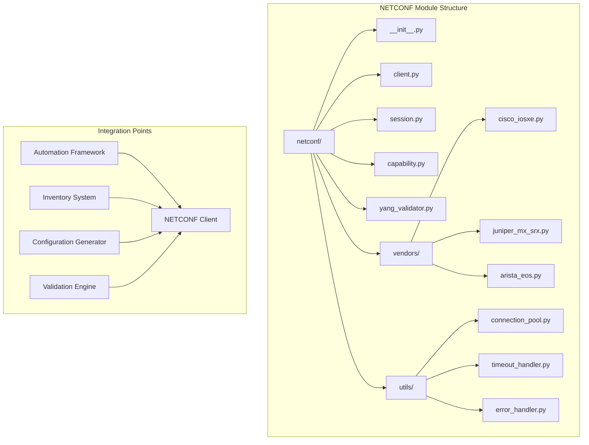
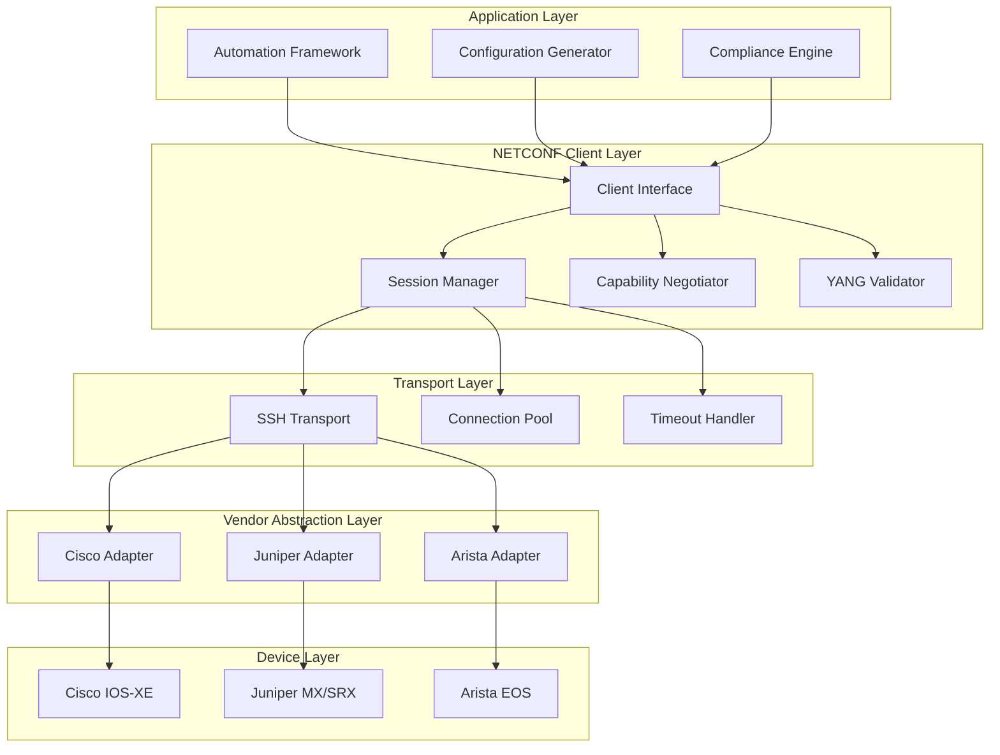
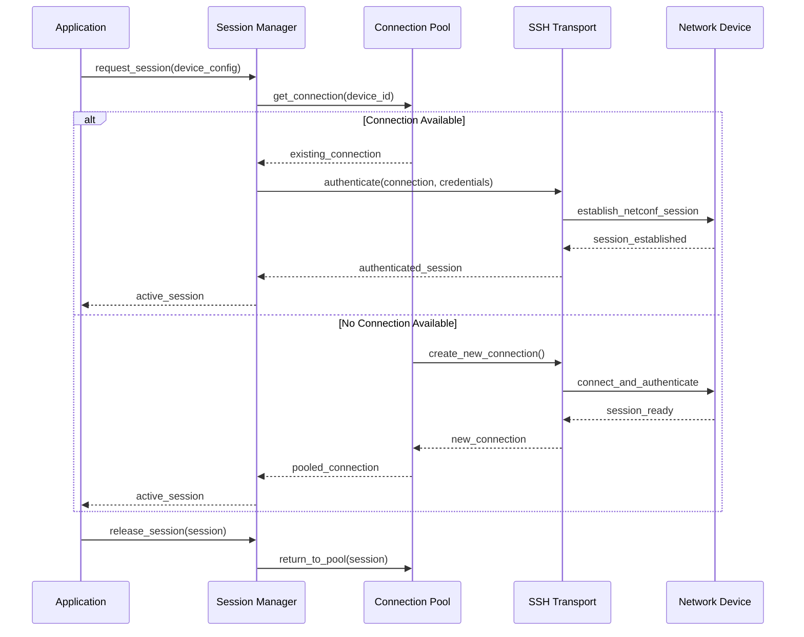
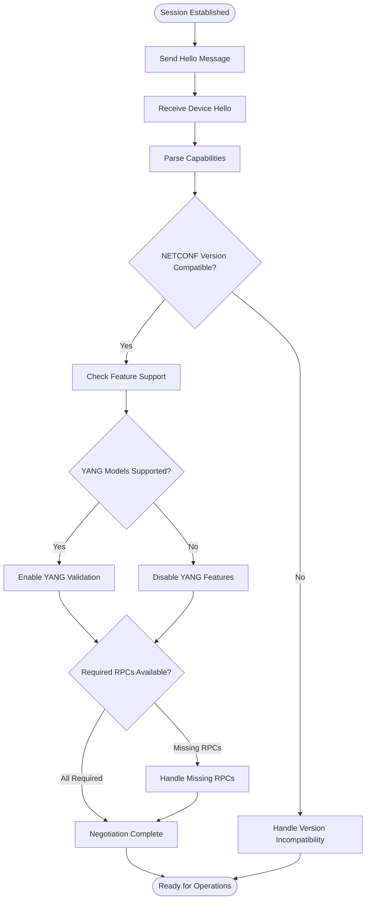
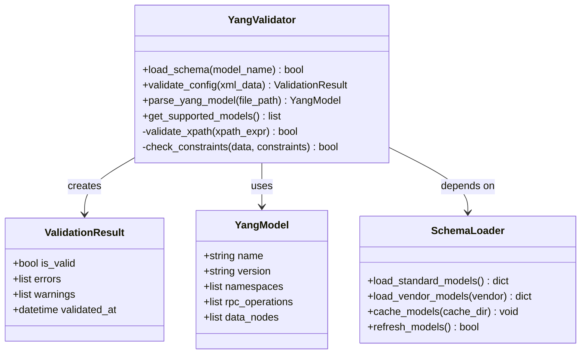
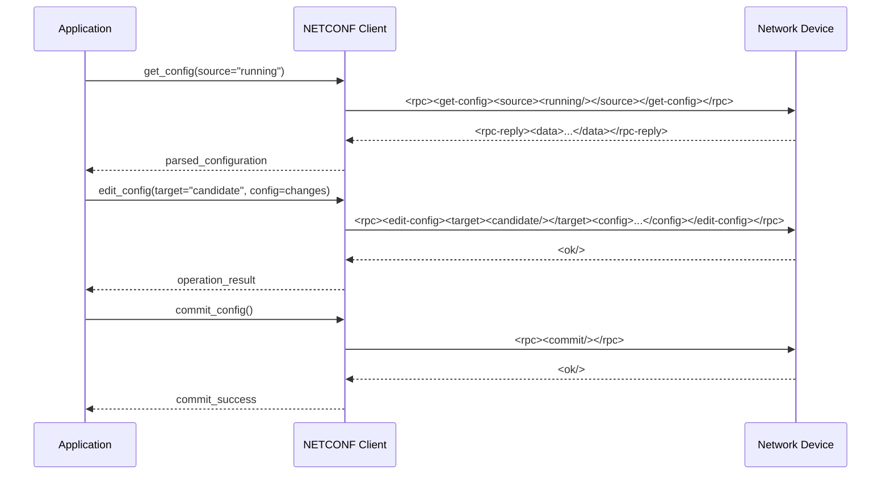
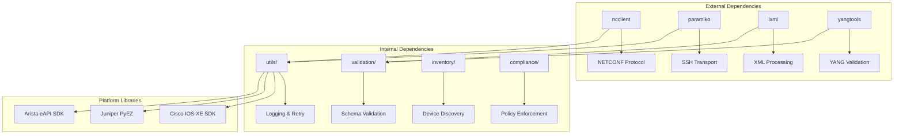

# NETCONF Client Implementation

<cite>
**Referenced Files in This Document**
- [README.md](file://README.md)
</cite>

## Table of Contents
1. [Introduction](#introduction)
2. [Project Structure](#project-structure)
3. [Core Components](#core-components)
4. [Architecture Overview](#architecture-overview)
5. [Detailed Component Analysis](#detailed-component-analysis)
6. [Dependency Analysis](#dependency-analysis)
7. [Performance Considerations](#performance-considerations)
8. [Troubleshooting Guide](#troubleshooting-guide)
9. [Conclusion](#conclusion)
10. [Appendices](#appendices)

## Introduction

The NETCONF client module is a core component of the Enterprise Network Automation Platform, providing robust NETCONF protocol support for multi-vendor network device management. This implementation follows production-grade standards with comprehensive capability negotiation, session management, connection pooling, timeout handling, and YANG model validation. The client supports authentication via SSH keys and passwords, handles protocol version compatibility, and includes vendor-specific implementations for Cisco IOS-XE, Juniper MX/SRX, and Arista EOS platforms.

The NETCONF client integrates seamlessly with the broader automation framework, enabling configuration retrieval, modification, and validation through XML-RPC operations while maintaining security best practices and operational reliability.

## Project Structure

The NETCONF client module is organized under the `python/netconf/` directory within the overall project structure. The module follows a modular architecture pattern with clear separation of concerns:



**Diagram sources**
- [README.md:130-141](file://README.md#L130-L141)

**Section sources**
- [README.md:130-141](file://README.md#L130-L141)

## Core Components

The NETCONF client module consists of several interconnected components that work together to provide comprehensive NETCONF functionality:

### Session Management
Handles connection lifecycle, authentication, and resource management with built-in connection pooling and timeout controls.

### Capability Negotiation
Automatically negotiates supported NETCONF capabilities between client and device, ensuring protocol compatibility and feature availability.

### YANG Model Support
Provides comprehensive YANG model validation and parsing capabilities for structured configuration management.

### Vendor-Specific Implementations
Contains platform-specific adapters for Cisco IOS-XE, Juniper MX/SRX, and Arista EOS devices.

### Error Handling
Implements robust error detection, logging, and recovery mechanisms for reliable operation in production environments.

**Section sources**
- [README.md:444-446](file://README.md#L444-L446)

## Architecture Overview

The NETCONF client follows a layered architecture pattern that separates concerns and promotes maintainability:



**Diagram sources**
- [README.md:438-456](file://README.md#L438-L456)

## Detailed Component Analysis

### Session Management and Connection Pooling

The session management system provides robust connection lifecycle control with automatic pooling and resource cleanup:



**Diagram sources**
- [README.md:444-446](file://README.md#L444-L446)

Key features include:
- **Automatic Connection Pooling**: Maintains reusable connections to reduce overhead
- **Intelligent Timeout Handling**: Configurable timeouts for different operations
- **Connection Health Monitoring**: Automatic detection and recovery from failed connections
- **Resource Cleanup**: Proper disposal of resources to prevent memory leaks

### Capability Negotiation Process

The capability negotiation system ensures protocol compatibility and feature discovery:



**Diagram sources**
- [README.md:444-446](file://README.md#L444-L446)

### YANG Model Support and Validation

The YANG validation system provides comprehensive schema validation for configuration data:



**Diagram sources**
- [README.md:444-446](file://README.md#L444-L446)

### Vendor-Specific Implementations

#### Cisco IOS-XE Support
- Full NETCONF/YANG support for modern IOS-XE versions
- Custom RPC extensions for Cisco-specific operations
- Optimized configuration templates for common use cases

#### Juniper MX/SRX Support
- Comprehensive support for Junos OS NETCONF interface
- Advanced routing and firewall policy management
- Performance optimizations for large-scale deployments

#### Arista EOS Support
- eAPI integration alongside traditional NETCONF
- Switch-specific configuration patterns
- Integration with Arista's automation ecosystem

**Section sources**
- [README.md:208-211](file://README.md#L208-L211)

### Authentication Methods

The client supports multiple authentication methods for secure device access:

#### SSH Key Authentication
- Public key-based authentication using RSA or ECDSA keys
- Automatic key rotation and management
- Integration with HashiCorp Vault for secure key storage

#### Password Authentication
- Secure password-based authentication with encryption
- Support for complex password policies
- Integration with enterprise identity providers

#### Multi-Factor Authentication
- Support for TACACS+ and RADIUS authentication
- Integration with corporate identity systems
- Audit logging for compliance requirements

### Protocol Version Compatibility

The client maintains backward compatibility across NETCONF protocol versions:

- **NETCONF 1.0**: Legacy device support with fallback mechanisms
- **NETCONF 1.1**: Primary target version with full feature support
- **Enhanced Security**: TLS encryption and certificate validation
- **Graceful Degradation**: Automatic fallback when advanced features unavailable

### Configuration Retrieval and Modification

#### XML-RPC Operations
The client provides comprehensive XML-RPC support for configuration management:



**Diagram sources**
- [README.md:444-446](file://README.md#L444-L446)

### Integration with Broader Automation Framework

The NETCONF client integrates seamlessly with other platform components:

#### Inventory Integration
- Automatic device discovery and capability detection
- Dynamic adapter selection based on vendor and platform
- Real-time status monitoring and health checks

#### Configuration Generation
- Jinja2 template rendering with NETCONF-specific filters
- Structured data transformation to NETCONF XML format
- Validation before deployment to prevent errors

#### Compliance and Validation
- Pre-deployment configuration validation against policies
- Automated rollback on validation failures
- Comprehensive audit logging for compliance requirements

**Section sources**
- [README.md:438-456](file://README.md#L438-L456)

## Dependency Analysis

The NETCONF client has well-defined dependencies on external libraries and internal modules:



**Diagram sources**
- [README.md:438-456](file://README.md#L438-L456)

**Section sources**
- [README.md:438-456](file://README.md#L438-L456)

## Performance Considerations

The NETCONF client is optimized for high-performance operations in enterprise environments:

### Connection Pooling Strategy
- **Adaptive Pool Sizing**: Dynamically adjusts pool size based on workload
- **Connection Reuse**: Maximizes reuse of established connections
- **Idle Connection Management**: Automatic cleanup of unused connections

### Timeout Configuration
- **Operation-Specific Timeouts**: Different timeouts for read, write, and transaction operations
- **Network Latency Adaptation**: Automatic timeout adjustment based on network conditions
- **Graceful Degradation**: Fallback mechanisms when timeouts occur

### Memory Management
- **Streaming XML Processing**: Efficient processing of large configuration files
- **Garbage Collection Optimization**: Proper resource cleanup to prevent memory leaks
- **Batch Operations**: Support for bulk configuration changes

### Scalability Features
- **Asynchronous Operations**: Non-blocking I/O for concurrent device management
- **Load Balancing**: Distribution of operations across multiple workers
- **Caching Strategies**: Intelligent caching of frequently accessed data

## Troubleshooting Guide

Common issues and their resolutions:

### Connection Issues
- **Authentication Failures**: Verify SSH keys/passwords and device credentials
- **Connection Timeouts**: Check network connectivity and adjust timeout settings
- **Protocol Errors**: Ensure NETCONF is enabled on target devices

### Configuration Problems
- **YANG Validation Errors**: Validate configuration against device schemas
- **Capability Mismatches**: Check device NETCONF capability advertisements
- **XML Parsing Errors**: Verify XML structure and encoding

### Performance Issues
- **Slow Operations**: Monitor connection pool utilization and optimize batch sizes
- **Memory Leaks**: Check for proper resource cleanup in long-running processes
- **High CPU Usage**: Optimize XML processing and reduce unnecessary operations

**Section sources**
- [README.md:674-685](file://README.md#L674-L685)

## Conclusion

The NETCONF client implementation provides a robust, scalable, and secure foundation for network automation across multi-vendor environments. Its comprehensive feature set includes advanced capability negotiation, intelligent session management, YANG model validation, and vendor-specific optimizations. The modular architecture ensures maintainability while the extensive error handling and monitoring capabilities provide operational reliability in production environments.

The client's seamless integration with the broader automation framework enables powerful use cases including automated configuration management, compliance enforcement, and real-time network state monitoring. With support for major vendors like Cisco, Juniper, and Arista, it serves as a unified interface for diverse network infrastructures.

## Appendices

### Quick Start Examples

#### Basic Connection and Configuration Retrieval
```python
# Initialize NETCONF client with connection pooling
client = NetConfClient(
    connection_pool_size=10,
    timeout=30,
    retry_attempts=3
)

# Connect to device and retrieve configuration
session = client.connect(device_config)
config = session.get_config(source='running')
session.close()
```

#### Vendor-Specific Operations
```python
# Cisco IOS-XE specific operations
cisco_client = CiscoIOSXENetConfClient(device_config)
interfaces = cisco_client.get_interface_status()
routing_table = cisco_client.get_routing_table()

# Juniper MX/SRX operations
juniper_client = JuniperMXNetConfClient(device_config)
firewall_rules = juniper_client.get_firewall_policies()
system_info = juniper_client.get_system_information()

# Arista EOS operations
arista_client = AristaEOSNetConfClient(device_config)
vlan_config = arista_client.get_vlan_configuration()
switch_port_status = arista_client.get_switch_port_status()
```

### Configuration Templates

#### Standard VLAN Configuration Template
```yaml
# vlan_template.yml
vlan:
  id: "{{ vlan_id }}"
  name: "{{ vlan_name }}"
  description: "{{ vlan_description }}"
  interfaces:
    - interface: "{{ interface_name }}"
      mode: "{{ access_mode }}"
```

#### Security Policy Template
```yaml
# security_policy_template.yml
security_policy:
  name: "{{ policy_name }}"
  source_zone: "{{ source_zone }}"
  destination_zone: "{{ destination_zone }}"
  applications:
    - app: "{{ application_name }}"
      action: "{{ action }}"
  log_setting: "{{ log_level }}"
```