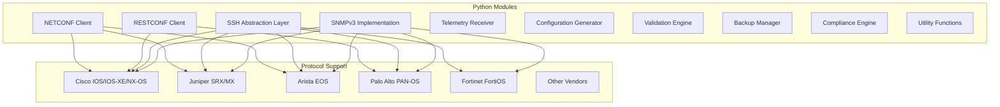
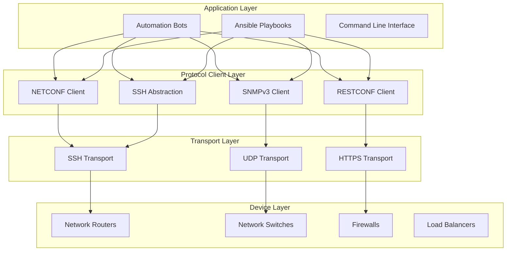
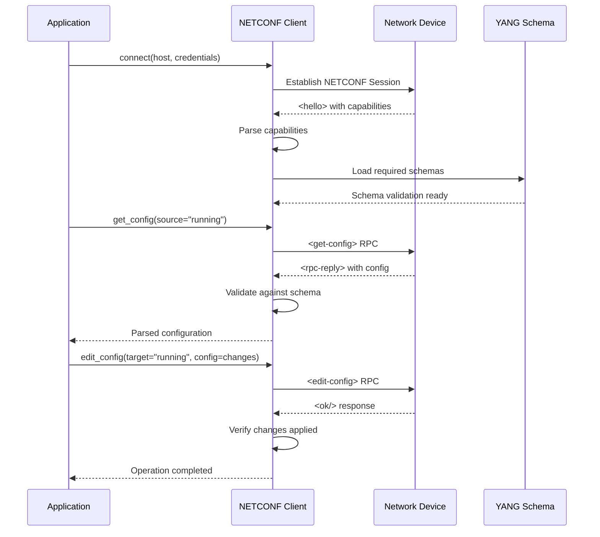
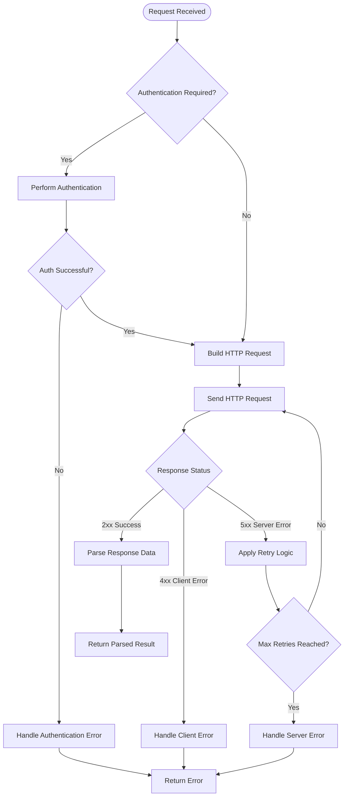
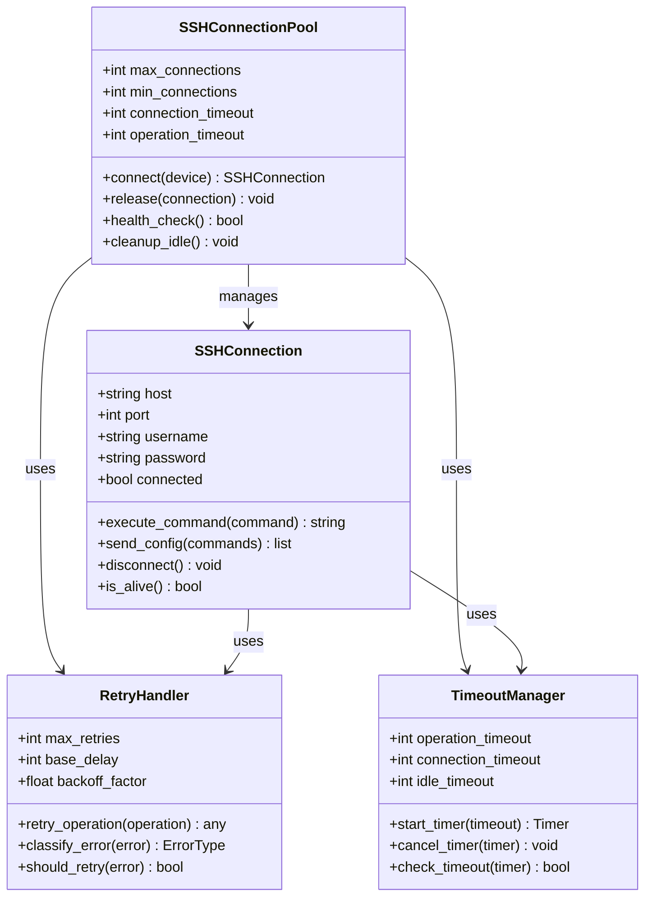
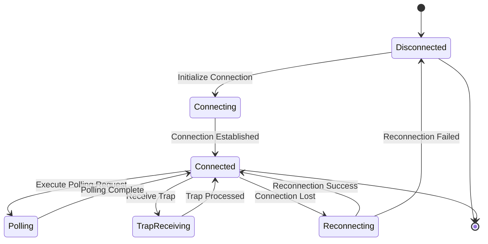
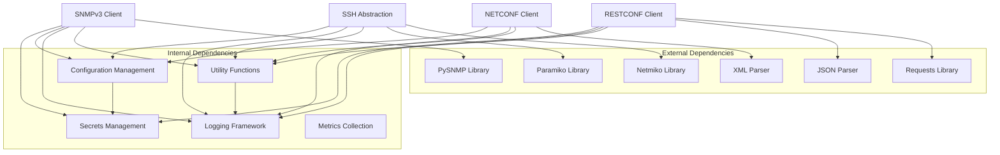

# Network Protocol Clients

<cite>
**Referenced Files in This Document**
- [README.md](file://README.md)
</cite>

## Table of Contents
1. [Introduction](#introduction)
2. [Project Structure](#project-structure)
3. [Core Components](#core-components)
4. [Architecture Overview](#architecture-overview)
5. [Detailed Component Analysis](#detailed-component-analysis)
6. [Dependency Analysis](#dependency-analysis)
7. [Performance Considerations](#performance-considerations)
8. [Troubleshooting Guide](#troubleshooting-guide)
9. [Conclusion](#conclusion)
10. [Appendices](#appendices)

## Introduction

This document provides comprehensive technical documentation for the network protocol client modules within the Enterprise Network Automation Platform. The platform implements production-grade protocol clients for NETCONF, RESTCONF, SSH abstraction, and SNMPv3 operations, designed to manage thousands of network devices across multi-vendor, multi-region environments.

The protocol client architecture follows enterprise best practices including capability negotiation, session management, connection pooling, retry logic, timeout management, and security context handling. Each protocol module is designed to be vendor-agnostic while supporting protocol-specific edge cases and extensions.

## Project Structure

The network protocol clients are organized under the `python/` directory with modular architecture following feature-based organization:

**Diagram sources**
- [README.md:105-180](file://README.md#L105-L180)

**Section sources**
- [README.md:105-180](file://README.md#L105-L180)

## Core Components

The network automation platform implements four primary protocol client modules, each designed with specific responsibilities and capabilities:

### NETCONF Client Module
- **Purpose**: NETCONF protocol implementation with capability negotiation and YANG model support
- **Key Features**: Session management, configuration manipulation, capability discovery
- **Vendor Support**: Cisco IOS-XE, NX-OS; Juniper SRX, MX; Arista EOS

### RESTCONF Client Module  
- **Purpose**: RESTCONF API client with authentication and error handling
- **Key Features**: HTTP-based communication, JSON/YANG data encoding, authentication mechanisms
- **Vendor Support**: Cisco IOS-XE, NX-OS; Palo Alto PAN-OS; F5 BIG-IP

### SSH Abstraction Layer
- **Purpose**: Unified SSH interface over Netmiko/Paramiko with enhanced features
- **Key Features**: Connection pooling, retry logic, timeout management, command execution
- **Vendor Support**: All major vendors via platform-specific drivers

### SNMPv3 Implementation
- **Purpose**: SNMPv3 polling and trap handling with security context management
- **Key Features**: Authentication, encryption, bulk operations, trap reception
- **Use Cases**: Monitoring, compliance checking, health assessment

**Section sources**
- [README.md:438-456](file://README.md#L438-L456)

## Architecture Overview

The protocol client architecture follows a layered approach with clear separation of concerns:

**Diagram sources**
- [README.md:52-99](file://README.md#L52-L99)
- [README.md:184-199](file://README.md#L184-L199)

## Detailed Component Analysis

### NETCONF Client Implementation

The NETCONF client provides comprehensive NETCONF protocol support with advanced features for enterprise network automation:

#### Capability Negotiation
The client performs automatic capability negotiation during session establishment to determine supported protocols, encodings, and operations. This ensures compatibility across different vendor implementations and device versions.

#### Session Management
- **Connection Pooling**: Maintains persistent connections for improved performance
- **Session Lifecycle**: Automatic connection establishment, maintenance, and cleanup
- **Error Recovery**: Graceful handling of connection failures with automatic reconnection
- **Timeout Configuration**: Configurable timeouts for operations and keep-alive messages

#### YANG Model Support
- **Schema Validation**: Validates configurations against YANG schemas
- **Data Encoding**: Supports XML and JSON encoding formats
- **Model Discovery**: Automatic discovery of available YANG models
- **Type Conversion**: Handles type conversion between Python objects and YANG types

**Diagram sources**
- [README.md:445-446](file://README.md#L445-L446)

**Section sources**
- [README.md:445-446](file://README.md#L445-L446)

### RESTCONF Client Architecture

The RESTCONF client implements HTTP-based RESTful interfaces with comprehensive authentication and error handling:

#### Authentication Mechanisms
- **Basic Authentication**: Username/password authentication
- **Certificate-Based Authentication**: Mutual TLS authentication
- **Token-Based Authentication**: OAuth2 and JWT token support
- **Session Management**: Automatic cookie and session handling

#### Error Handling Strategy
- **HTTP Status Code Processing**: Comprehensive handling of all HTTP status codes
- **Retry Logic**: Configurable retry with exponential backoff
- **Circuit Breaker Pattern**: Prevents cascading failures
- **Graceful Degradation**: Falls back to alternative endpoints when available

#### Response Parsing
- **JSON/YANG Decoding**: Automatic parsing of structured responses
- **Error Response Handling**: Standardized error response processing
- **Pagination Support**: Handles large result sets with pagination
- **Content Negotiation**: Supports multiple content types

**Diagram sources**
- [README.md:446-447](file://README.md#L446-L447)

**Section sources**
- [README.md:446-447](file://README.md#L446-L447)

### SSH Abstraction Layer

The SSH abstraction layer provides a unified interface over Netmiko and Paramiko with enterprise-grade features:

#### Connection Pooling
- **Pool Management**: Configurable connection pool size and lifecycle
- **Connection Reuse**: Automatic reuse of established connections
- **Health Checking**: Regular connection health monitoring
- **Resource Cleanup**: Proper cleanup of unused connections

#### Retry Logic Implementation
- **Exponential Backoff**: Progressive delay between retry attempts
- **Circuit Breaker**: Prevents repeated failures from overwhelming systems
- **Failure Classification**: Distinguishes between transient and permanent errors
- **Retry Limits**: Configurable maximum retry attempts

#### Timeout Management
- **Operation Timeouts**: Per-operation timeout configuration
- **Connection Timeouts**: Connection establishment timeout control
- **Idle Timeouts**: Automatic cleanup of idle connections
- **Keep-Alive Messages**: Periodic keep-alive to maintain connections

**Diagram sources**
- [README.md:447-448](file://README.md#L447-L448)

**Section sources**
- [README.md:447-448](file://README.md#L447-L448)

### SNMPv3 Implementation

The SNMPv3 implementation provides comprehensive monitoring and trap handling capabilities with robust security:

#### Security Context Management
- **Authentication Protocols**: MD5, SHA, SHA-256, SHA-384, SHA-512 support
- **Encryption Protocols**: DES, 3DES, AES-128, AES-192, AES-256 support
- **Security Levels**: noAuthNoPriv, authNoPriv, authPriv modes
- **Context Names**: Support for named contexts and default contexts

#### Polling Operations
- **Bulk Operations**: Efficient retrieval of large datasets
- **Concurrent Polling**: Parallel polling across multiple devices
- **Variable Binding**: Support for complex OID hierarchies
- **Data Caching**: Intelligent caching to reduce network overhead

#### Trap Handling
- **Trap Reception**: Asynchronous trap message processing
- **Trap Filtering**: Rule-based trap filtering and routing
- **Trap Correlation**: Event correlation and deduplication
- **Alert Generation**: Integration with alerting systems

**Diagram sources**
- [README.md:448-449](file://README.md#L448-L449)

**Section sources**
- [README.md:448-449](file://README.md#L448-L449)

## Dependency Analysis

The protocol client modules have well-defined dependencies and relationships:

**Diagram sources**
- [README.md:184-199](file://README.md#L184-L199)
- [README.md:438-456](file://README.md#L438-L456)

**Section sources**
- [README.md:184-199](file://README.md#L184-L199)
- [README.md:438-456](file://README.md#L438-L456)

## Performance Considerations

The protocol client modules are designed with enterprise-scale performance requirements:

### Connection Optimization
- **Connection Pooling**: Reduces connection establishment overhead
- **Keep-Alive Mechanisms**: Maintains persistent connections
- **Batch Operations**: Groups multiple operations to reduce network calls
- **Asynchronous Processing**: Non-blocking operations for better throughput

### Memory Management
- **Streaming Responses**: Processes large responses without loading entire payload
- **Object Pooling**: Reuses frequently used objects
- **Garbage Collection**: Explicit cleanup of large data structures
- **Memory Limits**: Configurable memory usage limits per operation

### Network Efficiency
- **Compression**: Enables compression for large data transfers
- **Caching**: Implements intelligent caching strategies
- **Bandwidth Throttling**: Configurable bandwidth limits
- **Protocol Optimization**: Uses optimal protocol settings per use case

## Troubleshooting Guide

Common issues and their resolutions for protocol client modules:

### NETCONF Client Issues
- **Capability Negotiation Failures**: Verify device NETCONF support and version compatibility
- **YANG Schema Errors**: Ensure correct schema versions and model availability
- **Session Timeouts**: Adjust timeout values based on network conditions

### RESTCONF Client Issues  
- **Authentication Failures**: Verify credentials and certificate validity
- **API Endpoint Errors**: Check endpoint URLs and HTTP method compatibility
- **Response Parsing Errors**: Validate JSON/YANG structure and encoding

### SSH Abstraction Issues
- **Connection Pool Exhaustion**: Increase pool size or optimize connection usage
- **Command Execution Timeouts**: Adjust timeout values for long-running commands
- **Platform-Specific Issues**: Verify platform driver compatibility

### SNMPv3 Issues
- **Security Context Errors**: Verify authentication and encryption parameters
- **OID Access Denied**: Check SNMP community strings and access controls
- **Trap Reception Problems**: Verify firewall rules and trap destination configuration

**Section sources**
- [README.md:674-685](file://README.md#L674-L685)

## Conclusion

The network protocol client modules provide a comprehensive, enterprise-grade foundation for network automation across multi-vendor environments. The architecture emphasizes reliability, scalability, and maintainability through well-defined interfaces, robust error handling, and extensive testing coverage.

Key strengths include:
- **Vendor Agnostic Design**: Consistent interfaces across different vendors
- **Enterprise Features**: Connection pooling, retry logic, timeout management
- **Security Focus**: Comprehensive authentication and encryption support
- **Extensibility**: Modular design allows easy addition of new protocols and vendors
- **Monitoring Integration**: Built-in metrics collection and observability

The implementation follows industry best practices and provides a solid foundation for building sophisticated network automation solutions at enterprise scale.

## Appendices

### Vendor Support Matrix

| Vendor | NETCONF | RESTCONF | SSH | SNMPv3 | Notes |
|--------|---------|----------|-----|--------|-------|
| Cisco IOS-XE | ✓ | ✓ | ✓ | ✓ | Full support |
| Cisco NX-OS | ✓ | ✓ | ✓ | ✓ | Full support |
| Juniper SRX | ✓ | ✗ | ✓ | ✓ | NETCONF focus |
| Juniper MX | ✓ | ✗ | ✓ | ✓ | NETCONF focus |
| Arista EOS | ✓ | ✓ | ✓ | ✓ | eAPI alternative |
| Palo Alto PAN-OS | ✗ | ✓ | ✓ | ✓ | API-focused |
| Fortinet FortiOS | ✗ | ✓ | ✓ | ✓ | API-focused |
| F5 BIG-IP | ✗ | ✓ | ✓ | ✓ | iControl REST |

### Protocol Feature Comparison

| Feature | NETCONF | RESTCONF | SSH | SNMPv3 |
|---------|---------|----------|-----|--------|
| Configuration Management | ✓ | ✓ | ✓ | ✗ |
| Data Retrieval | ✓ | ✓ | ✓ | ✓ |
| Real-time Monitoring | ✗ | ✗ | ✗ | ✓ |
| Bulk Operations | ✓ | ✓ | ✓ | ✓ |
| Transaction Support | ✓ | ✗ | ✗ | ✗ |
| Schema Validation | ✓ | ✓ | ✗ | ✗ |
| Streaming Updates | ✗ | ✗ | ✗ | ✓ |