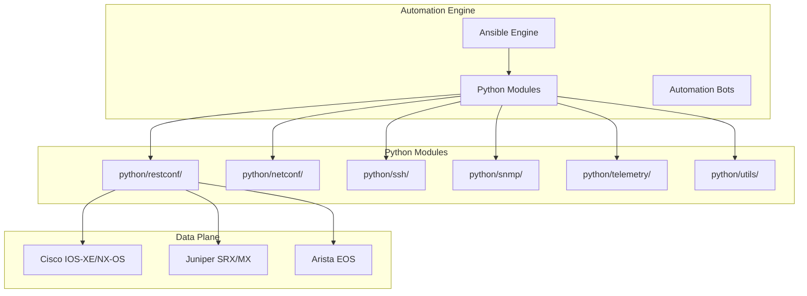
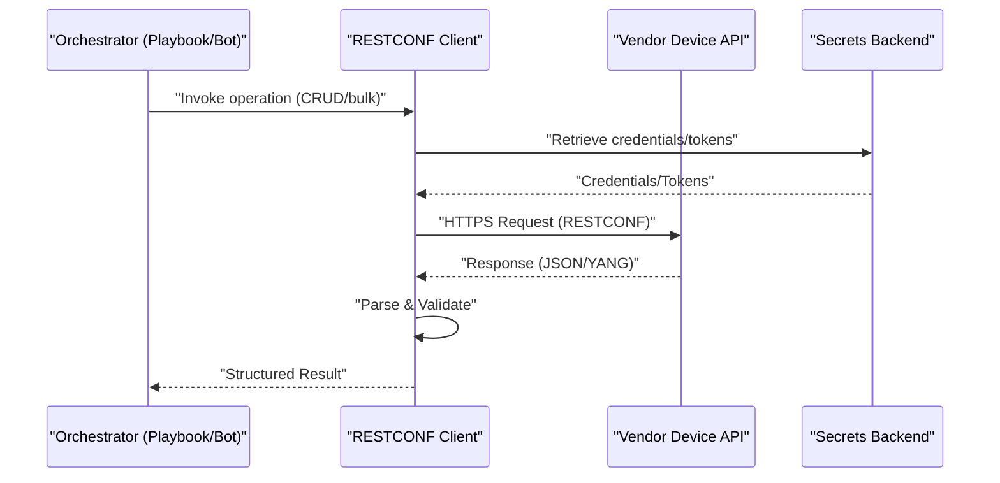
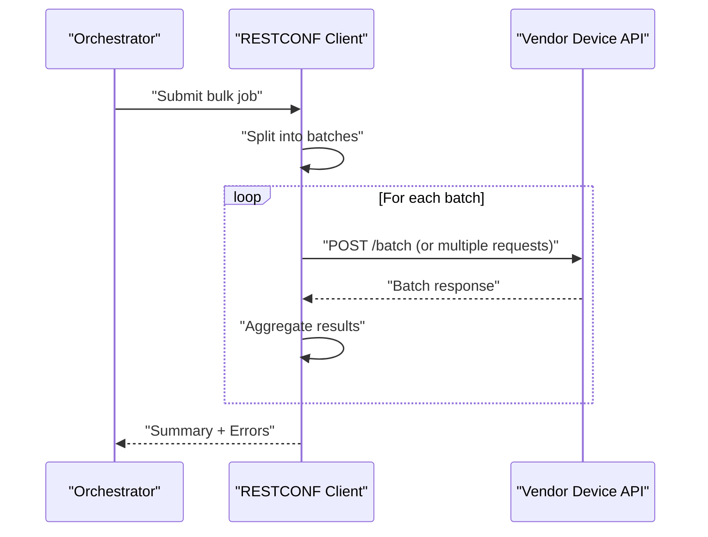
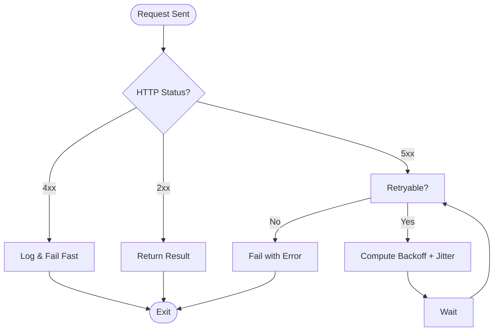
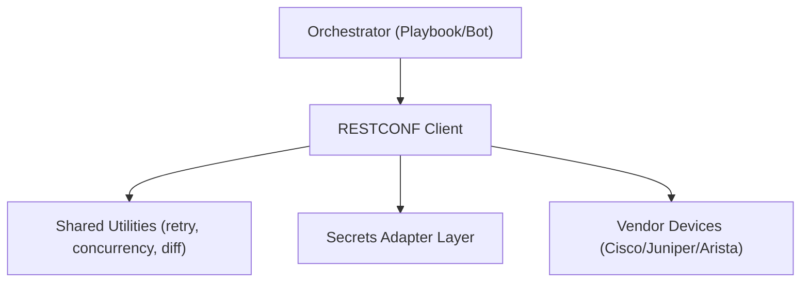

# RESTCONF Client Architecture

<cite>
**Referenced Files in This Document**
- [README.md](file://README.md)
</cite>

## Table of Contents
1. [Introduction](#introduction)
2. [Project Structure](#project-structure)
3. [Core Components](#core-components)
4. [Architecture Overview](#architecture-overview)
5. [Detailed Component Analysis](#detailed-component-analysis)
6. [Dependency Analysis](#dependency-analysis)
7. [Performance Considerations](#performance-considerations)
8. [Troubleshooting Guide](#troubleshooting-guide)
9. [Conclusion](#conclusion)

## Introduction
This document describes the RESTCONF client architecture for a production-grade, vendor-agnostic network automation platform. It focuses on HTTP/HTTPS communication patterns, authentication mechanisms (including OAuth2 and certificate-based auth), request/response parsing with JSON/YANG data formats, error handling with retry logic, integration with vendor APIs (Cisco IOS-XE, Juniper Junos, Arista eAPI), rate limiting considerations, connection management, CRUD operations on network resources, bulk operation optimization, and troubleshooting common connectivity issues. The content is derived from the repository’s documented architecture and module layout.

## Project Structure
The project organizes automation modules under python/, including a dedicated restconf/ module for RESTCONF client functionality. The README outlines the overall repository layout and technology stack, indicating support for NETCONF, RESTCONF, SSH, SNMPv3, gRPC, and telemetry streaming.

**Diagram sources**
- [README.md:103-180](file://README.md#L103-L180)
- [README.md:184-200](file://README.md#L184-L200)
- [README.md:203-218](file://README.md#L203-L218)
- [README.md:438-456](file://README.md#L438-L456)

**Section sources**
- [README.md:103-180](file://README.md#L103-L180)
- [README.md:184-200](file://README.md#L184-L200)
- [README.md:203-218](file://README.md#L203-L218)
- [README.md:438-456](file://README.md#L438-L456)

## Core Components
- RESTCONF Client Module: Provides YANG-aware RESTCONF interactions over HTTP/HTTPS, integrating with device APIs and supporting structured data formats.
- Utilities: Shared logging, retry, concurrency, diff, and bulk operations used by the RESTCONF client to ensure reliability and performance.
- Vendor Integrations: Cisco IOS-XE, Juniper Junos, and Arista eAPI are supported via protocol-specific endpoints and capabilities.

Key responsibilities include:
- Establishing secure connections (TLS) and managing sessions
- Authenticating devices using credentials or tokens
- Constructing RESTCONF requests per RFC 8040
- Parsing responses into typed structures (JSON/YANG)
- Handling errors and applying retries/backoff
- Enforcing rate limits and throttling
- Executing CRUD and bulk operations efficiently

**Section sources**
- [README.md:438-456](file://README.md#L438-L456)
- [README.md:184-200](file://README.md#L184-L200)
- [README.md:203-218](file://README.md#L203-L218)

## Architecture Overview
The RESTCONF client operates as part of the Python automation layer, invoked by higher-level orchestration (e.g., playbooks or bots). It communicates with vendor devices over HTTPS, authenticates securely, and performs resource operations using standardized RESTCONF semantics.

**Diagram sources**
- [README.md:438-456](file://README.md#L438-L456)
- [README.md:339-368](file://README.md#L339-L368)

## Detailed Component Analysis

### HTTP/HTTPS Communication Patterns
- Transport: HTTPS with TLS; supports modern cipher suites and certificate validation.
- Connection Management: Persistent connections where possible, with configurable timeouts and keep-alive settings.
- Content Negotiation: Accept/Content-Type headers for application/yang-data+json or application/json payloads.
- Path Construction: Base URL per device plus resource paths following RFC 8040 conventions.

Operational notes:
- Use connection pooling to reduce handshake overhead.
- Configure retryable methods (GET, PUT, PATCH, DELETE) with idempotency guarantees.
- Respect server-side constraints such as max payload size and allowed media types.

**Section sources**
- [README.md:184-200](file://README.md#L184-L200)
- [README.md:438-456](file://README.md#L438-L456)

### Authentication Mechanisms
- Basic Auth: Username/password for initial access or lab environments.
- Token-Based Auth (OAuth2): Acquire short-lived tokens from an authorization server; attach Authorization header with bearer scheme.
- Certificate-Based Auth: Mutual TLS (mTLS) using client certificates and CA trust stores for strong device authentication.
- Secrets Integration: Retrieve secrets from HashiCorp Vault, AWS Secrets Manager, Azure Key Vault, or environment variables through a unified adapter layer.

Best practices:
- Prefer token-based or certificate-based auth for production.
- Rotate credentials automatically and enforce least privilege.
- Cache tokens securely and refresh before expiry.

**Section sources**
- [README.md:339-368](file://README.md#L339-L368)
- [README.md:438-456](file://README.md#L438-L456)

### Request/Response Parsing with JSON/YANG Data Formats
- Input/Output: JSON payloads conforming to YANG data models; optional use of yang-data extensions for richer typing.
- Validation: Schema validation against YANG models to ensure correctness before sending and after receiving.
- Serialization: Convert between internal typed objects and wire format (JSON/YANG) consistently.
- Error Mapping: Map server errors to structured exceptions with actionable messages.

Implementation guidance:
- Centralize model definitions and parsers.
- Provide helpers for path selection and filtering.
- Log sanitized payloads for debugging without exposing secrets.

**Section sources**
- [README.md:438-456](file://README.md#L438-L456)

### Error Handling and Retry Logic
- Retries: Exponential backoff with jitter for transient failures (network timeouts, 5xx server errors).
- Idempotency: Ensure safe retries for GET/PUT/PATCH/DELETE; avoid duplicate writes.
- Circuit Breaker: Temporarily halt calls to failing endpoints to prevent cascading failures.
- Fallbacks: Graceful degradation when partial operations fail; aggregate results and report failures.

Configuration parameters:
- Max retries, base delay, max delay, jitter factor.
- Retryable status codes and exception classes.
- Timeout values for connect/read/write.

**Section sources**
- [README.md:438-456](file://README.md#L438-L456)

### Vendor API Integration
- Cisco IOS-XE: RESTCONF endpoints for interfaces, routing, ACLs, VLANs; capability negotiation to determine available features.
- Juniper Junos: RESTCONF endpoints aligned with Junos YANG models; handle vendor-specific behaviors and pagination.
- Arista eAPI: Bridge eAPI to RESTCONF semantics where applicable; normalize responses across vendors.

Integration tips:
- Normalize responses to a common schema.
- Detect vendor capabilities and adapt request construction accordingly.
- Maintain vendor-specific adapters for edge cases.

**Section sources**
- [README.md:203-218](file://README.md#L203-L218)
- [README.md:438-456](file://README.md#L438-L456)

### Rate Limiting and Throttling
- Server Limits: Honor vendor rate limits and backpressure signals (e.g., Retry-After headers).
- Client Controls: Global and per-device rate limiters with token bucket or leaky bucket algorithms.
- Burst Handling: Allow controlled bursts while maintaining average throughput within limits.
- Observability: Track latency, error rates, and throttling events for monitoring.

**Section sources**
- [README.md:438-456](file://README.md#L438-L456)

### Connection Management
- Pooling: Reuse TCP connections to minimize overhead.
- Timeouts: Configurable connect/read/write timeouts per endpoint.
- Health Checks: Periodic pings or capability checks to detect dead peers.
- Cleanup: Properly close sessions and release resources on shutdown.

**Section sources**
- [README.md:438-456](file://README.md#L438-L456)

### CRUD Operations on Network Resources
Typical operations include:
- Create: POST to collection endpoints to add new resources (e.g., VLANs, routes).
- Read: GET single or list resources with filters and pagination.
- Update: PUT/PATCH to modify existing resources atomically.
- Delete: DELETE to remove resources safely.

Bulk operations:
- Batch requests: Group multiple operations into a single transactional call if supported.
- Parallelism: Execute independent operations concurrently with bounded concurrency.
- Transactionality: Use server-side transactions where available; otherwise implement compensating actions.

**Section sources**
- [README.md:438-456](file://README.md#L438-L456)

### Sequence Diagram: Bulk Operation Flow

**Diagram sources**
- [README.md:438-456](file://README.md#L438-L456)

### Flowchart: Retry and Backoff Algorithm

**Diagram sources**
- [README.md:438-456](file://README.md#L438-L456)

## Dependency Analysis
The RESTCONF client depends on shared utilities for logging, retry, concurrency, and diffing. It integrates with secrets backends for credential retrieval and interacts with vendor devices via HTTPS. Higher-level components (playbooks, bots) invoke the client to perform operations.

**Diagram sources**
- [README.md:438-456](file://README.md#L438-L456)
- [README.md:339-368](file://README.md#L339-L368)

**Section sources**
- [README.md:438-456](file://README.md#L438-L456)
- [README.md:339-368](file://README.md#L339-L368)

## Performance Considerations
- Concurrency: Use bounded parallelism to avoid overwhelming devices or clients.
- Caching: Cache stable metadata (capabilities, schemas) to reduce repeated queries.
- Payload Optimization: Minimize payload sizes by selecting specific fields and using efficient serialization.
- Monitoring: Instrument latency, throughput, and error rates; alert on anomalies.
- Backpressure: Implement adaptive throttling based on observed device behavior.

[No sources needed since this section provides general guidance]

## Troubleshooting Guide
Common connectivity and operational issues:
- TLS Handshake Failures: Verify certificates, CA chains, and cipher suites.
- Authentication Errors: Check token validity, scopes, and secret rotation policies.
- Rate Limiting: Monitor throttle responses; adjust concurrency and backoff settings.
- Timeouts: Tune connect/read/write timeouts; check network reachability and device load.
- Schema Mismatch: Validate YANG models and ensure correct media types.

Diagnostic steps:
- Enable detailed logs (sanitized) for requests/responses.
- Perform capability discovery to confirm supported endpoints.
- Run health checks and isolated read operations to isolate issues.

**Section sources**
- [README.md:674-685](file://README.md#L674-L685)
- [README.md:438-456](file://README.md#L438-L456)

## Conclusion
The RESTCONF client is a core component enabling secure, reliable, and scalable automation across multi-vendor networks. By adhering to standardized protocols, robust authentication, resilient error handling, and thoughtful performance tuning, it supports both simple CRUD tasks and complex bulk operations. Integrated with secrets management and observability, it fits seamlessly into the broader automation platform orchestrated by playbooks and bots.

[No sources needed since this section summarizes without analyzing specific files]