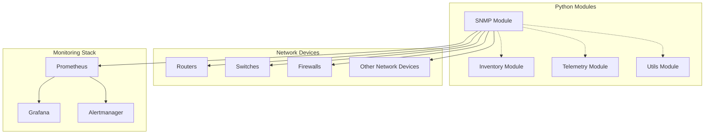
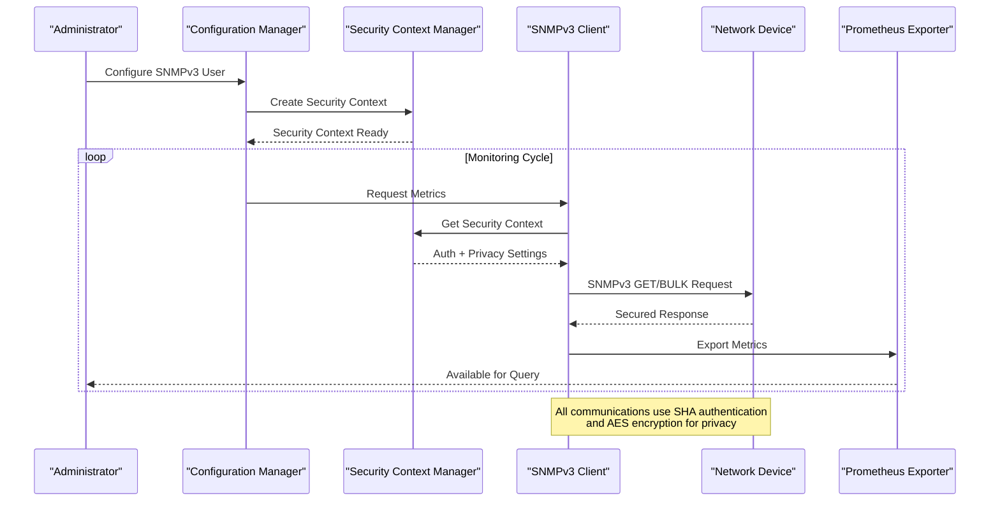
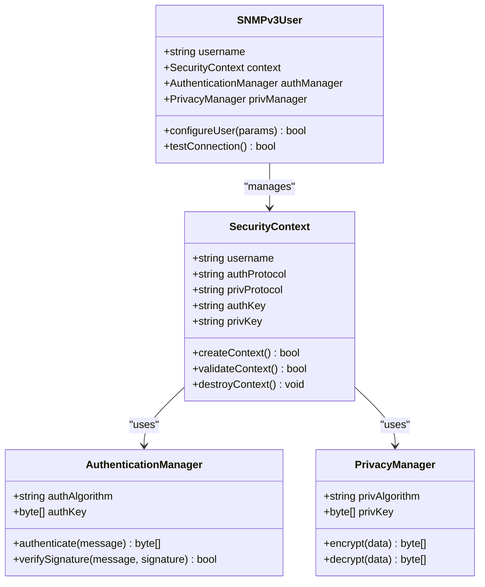
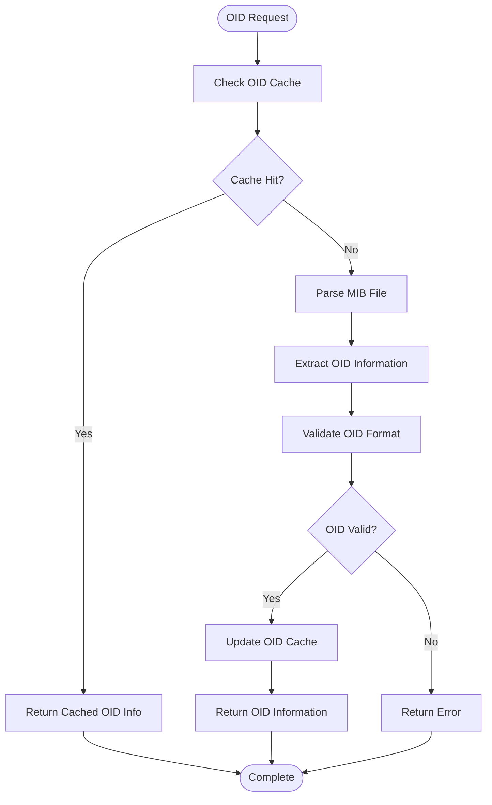
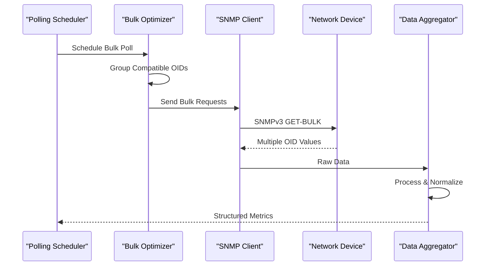
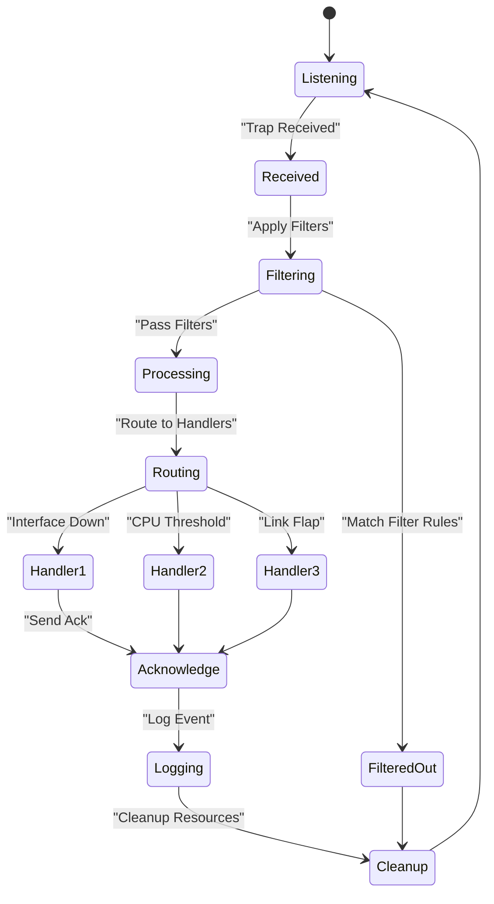
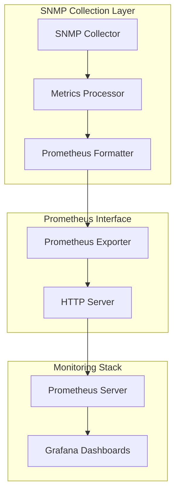
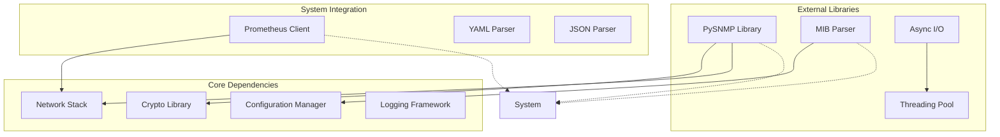

# SNMPv3 Implementation

<cite>
**Referenced Files in This Document**
- [README.md](file://README.md)
</cite>

## Table of Contents
1. [Introduction](#introduction)
2. [Project Structure](#project-structure)
3. [Core Components](#core-components)
4. [Architecture Overview](#architecture-overview)
5. [Detailed Component Analysis](#detailed-component-analysis)
6. [Dependency Analysis](#dependency-analysis)
7. [Performance Considerations](#performance-considerations)
8. [Troubleshooting Guide](#troubleshooting-guide)
9. [Conclusion](#conclusion)
10. [Appendices](#appendices)

## Introduction

This document provides comprehensive documentation for the SNMPv3 client implementation within the Enterprise Network Automation Platform. The platform is designed as a production-grade, vendor-agnostic solution for managing thousands of network devices across multi-vendor, multi-region environments, with SNMPv3 serving as a critical protocol for monitoring and polling operations.

The SNMPv3 implementation focuses on security-first design, providing authentication and privacy protocols (SHA/AES), efficient bulk polling for high-performance monitoring, and robust trap/event handling with filtering and routing capabilities. The system integrates seamlessly with Prometheus exporters for metrics collection and supports custom OID definitions and MIB parsing.

## Project Structure

The SNMPv3 implementation is part of the broader Python automation modules under the `python/snmp/` directory structure. The overall project follows a modular architecture where SNMP functionality is integrated with other networking protocols and automation tools.

**Diagram sources**
- [README.md:130-141](file://README.md#L130-L141)
- [README.md:587-604](file://README.md#L587-L604)

The project structure demonstrates how SNMPv3 fits into the larger automation ecosystem, working alongside inventory management, telemetry collection, and utility functions to provide comprehensive network monitoring capabilities.

**Section sources**
- [README.md:103-180](file://README.md#L103-L180)
- [README.md:438-456](file://README.md#L438-L456)

## Core Components

The SNMPv3 implementation encompasses several key components that work together to provide secure, efficient network monitoring:

### Security Context Management
The system implements comprehensive security context management supporting both authentication and privacy protocols. This includes SHA-based authentication and AES encryption for data privacy, ensuring secure communication with network devices.

### OID Definition and MIB Parsing
Custom OID definitions and MIB parsing capabilities allow the system to work with vendor-specific extensions and proprietary management interfaces while maintaining compatibility with standard MIBs.

### Bulk Polling Optimization
High-performance monitoring is achieved through bulk polling optimization, enabling efficient collection of large amounts of data from multiple devices simultaneously.

### Trap and Event Handling
The system provides robust trap and event handling with advanced filtering and routing capabilities, allowing for intelligent processing of SNMP traps from network devices.

### Prometheus Integration
Seamless integration with Prometheus exporters enables metrics collection and visualization through the standard monitoring stack.

**Section sources**
- [README.md:447-456](file://README.md#L447-L456)
- [README.md:189-198](file://README.md#L189-L198)

## Architecture Overview

The SNMPv3 architecture follows a layered approach with clear separation of concerns between security, protocol handling, and data processing components.

**Diagram sources**
- [README.md:587-604](file://README.md#L587-L604)
- [README.md:447-456](file://README.md#L447-L456)

The architecture ensures that all SNMPv3 communications are secured through proper authentication and encryption while maintaining high performance through optimized polling mechanisms.

## Detailed Component Analysis

### Security Context Management

The security context management component handles the creation, validation, and lifecycle management of SNMPv3 security contexts. It supports various authentication and privacy protocols including SHA for authentication and AES for encryption.

**Diagram sources**
- [README.md:447-456](file://README.md#L447-L456)
- [README.md:189-198](file://README.md#L189-L198)

### OID Definition and MIB Parsing

The OID definition system provides flexible support for both standard and vendor-specific OIDs, with automatic MIB parsing and caching for optimal performance.

**Diagram sources**
- [README.md:447-456](file://README.md#L447-L456)

### Bulk Polling Optimization

The bulk polling system implements high-performance data collection strategies optimized for large-scale network monitoring scenarios.

**Diagram sources**
- [README.md:447-456](file://README.md#L447-L456)

### Trap and Event Handling

The trap handling system provides intelligent filtering, routing, and processing of SNMP traps from network devices.

**Diagram sources**
- [README.md:447-456](file://README.md#L447-L456)

### Prometheus Integration

The Prometheus exporter integration enables seamless metrics collection and visualization through the standard monitoring stack.

**Diagram sources**
- [README.md:587-604](file://README.md#L587-L604)

**Section sources**
- [README.md:447-456](file://README.md#L447-L456)
- [README.md:587-604](file://README.md#L587-L604)

## Dependency Analysis

The SNMPv3 implementation has well-defined dependencies on core system components and external libraries, following best practices for modularity and maintainability.

**Diagram sources**
- [README.md:438-456](file://README.md#L438-L456)

The dependency structure ensures loose coupling between components while providing clear interfaces for integration with other system modules.

**Section sources**
- [README.md:438-456](file://README.md#L438-L456)

## Performance Considerations

The SNMPv3 implementation incorporates several performance optimizations designed for enterprise-scale deployments:

### Connection Pooling
Efficient connection pooling reduces overhead by reusing established connections to network devices, minimizing authentication overhead and connection establishment costs.

### Asynchronous Operations
Non-blocking I/O operations enable concurrent polling of multiple devices without blocking the main application thread, improving overall throughput.

### Caching Strategies
Intelligent caching of MIB definitions, device capabilities, and frequently accessed OID values reduces parsing overhead and network requests.

### Batch Processing
Bulk operations and batch processing minimize round-trip latency when collecting metrics from multiple OIDs or devices.

### Memory Management
Optimized memory usage through object pooling and garbage collection tuning prevents memory leaks during long-running monitoring operations.

## Troubleshooting Guide

Common issues and their resolutions for SNMPv3 implementation:

### Authentication Failures
- Verify SHA authentication keys match between client and device
- Check user permissions and access control lists
- Ensure correct security level configuration (authPriv)

### Privacy Protocol Issues
- Confirm AES encryption keys are properly configured
- Verify privacy protocol compatibility between endpoints
- Check for firewall rules blocking encrypted traffic

### Performance Problems
- Monitor connection pool utilization and adjust pool size
- Review polling intervals and optimize based on device capabilities
- Analyze MIB parsing performance and consider pre-compilation

### Trap Handling Issues
- Validate trap receiver configuration and port availability
- Check filter rules for overly restrictive conditions
- Review log files for trap processing errors

**Section sources**
- [README.md:674-685](file://README.md#L674-L685)

## Conclusion

The SNMPv3 implementation in the Enterprise Network Automation Platform provides a robust, secure, and high-performance solution for network monitoring and polling operations. The architecture emphasizes security through comprehensive authentication and privacy protocols, while maintaining excellent performance through bulk polling optimization and asynchronous operations.

The modular design allows for easy extension with custom OIDs and MIB support, while the Prometheus integration ensures seamless compatibility with modern monitoring stacks. The comprehensive trap handling capabilities provide real-time event processing with intelligent filtering and routing.

This implementation serves as a foundation for enterprise-scale network monitoring, supporting thousands of devices across diverse vendor ecosystems while maintaining strict security compliance and operational reliability.

## Appendices

### Configuration Examples

#### SNMPv3 User Configuration
The system supports comprehensive SNMPv3 user configuration with separate authentication and privacy settings for enhanced security.

#### Custom OID Implementation
Developers can extend the system with custom OIDs by implementing the appropriate interface and registering them with the OID manager.

#### Trap Handler Development
Custom trap handlers can be developed to process specific trap types and integrate with existing alerting and notification systems.

### Best Practices

- Always use SNMPv3 with both authentication and privacy enabled
- Implement proper error handling and retry logic for network operations
- Use connection pooling and asynchronous operations for high-throughput scenarios
- Regularly rotate authentication and privacy keys as part of security policy
- Monitor system resources and tune performance parameters based on deployment scale