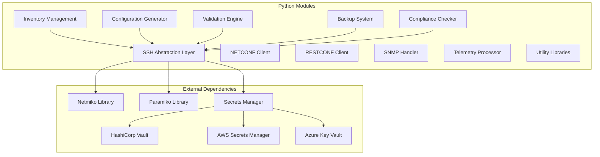
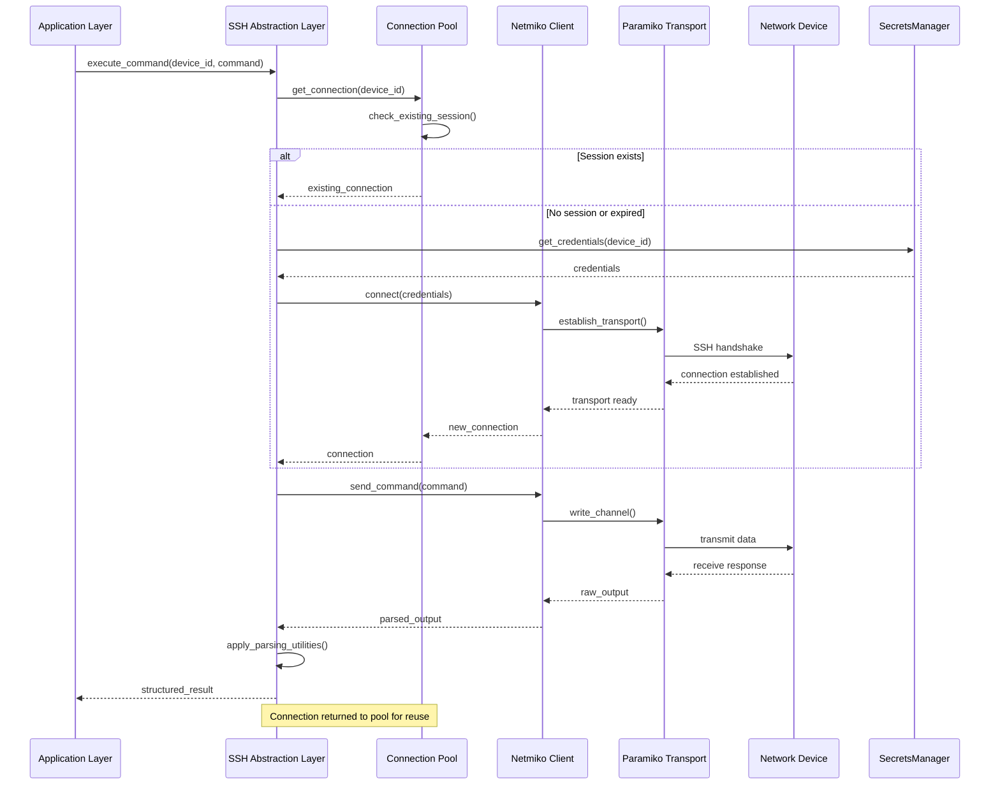
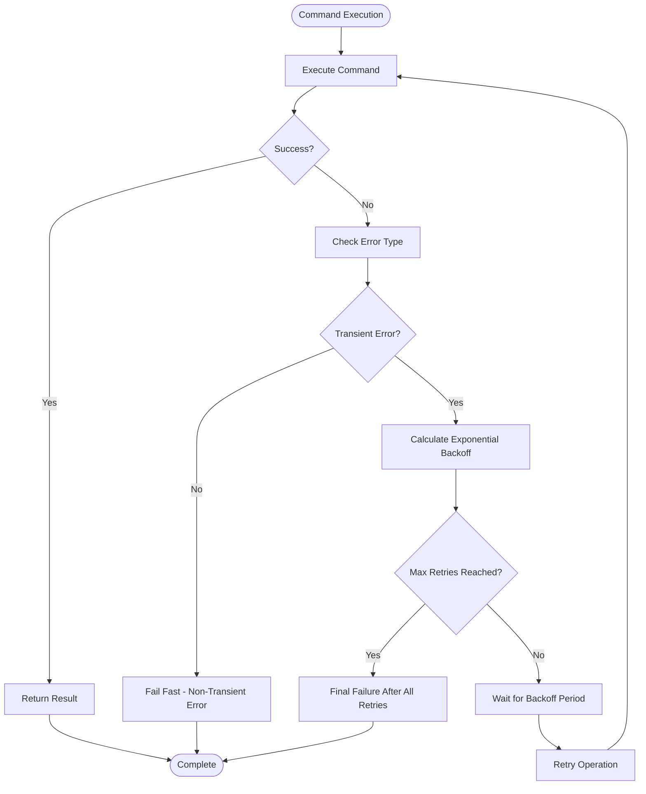
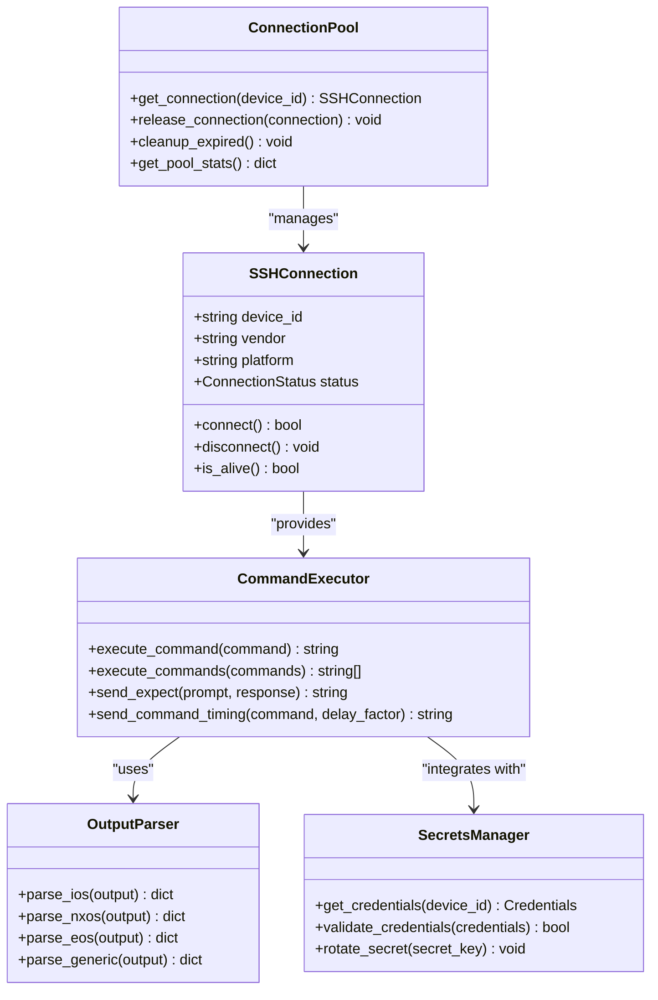
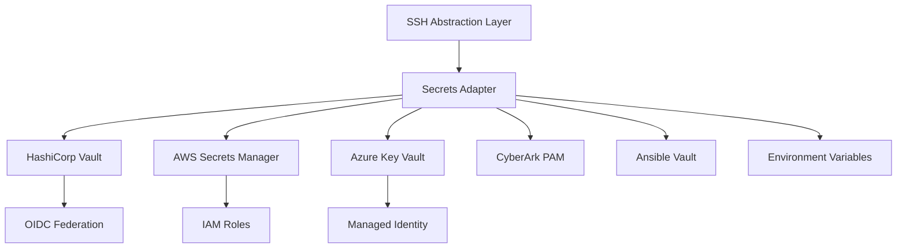
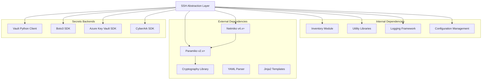

# SSH Abstraction Layer

<cite>
**Referenced Files in This Document**
- [README.md](file://README.md)
</cite>

## Table of Contents
1. [Introduction](#introduction)
2. [Project Structure](#project-structure)
3. [Core Components](#core-components)
4. [Architecture Overview](#architecture-overview)
5. [Detailed Component Analysis](#detailed-component-analysis)
6. [Dependency Analysis](#dependency-analysis)
7. [Performance Considerations](#performance-considerations)
8. [Troubleshooting Guide](#troubleshooting-guide)
9. [Conclusion](#conclusion)

## Introduction

The SSH abstraction layer is a production-grade component built over Netmiko and Paramiko to provide enterprise-scale network device connectivity management. This layer serves as the foundation for automated network operations across multi-vendor environments, supporting thousands of devices including routers, switches, firewalls, load balancers, VPN gateways, and cloud networking components.

The abstraction layer implements critical features such as connection pooling, automatic retry logic with exponential backoff, timeout management, session persistence, command execution interfaces, output parsing utilities, and platform-specific optimizations. It integrates seamlessly with secrets managers for secure credential handling and supports interactive prompts and large output stream processing.

## Project Structure

The SSH abstraction layer is part of the broader Python modules ecosystem under `python/ssh/`. According to the project architecture, it sits alongside other core modules including inventory management, NETCONF clients, RESTCONF clients, SNMP handlers, telemetry processors, configuration generators, validation engines, backup systems, compliance checkers, and utility libraries.

**Diagram sources**
- [README.md:438-456](file://README.md#L438-L456)

**Section sources**
- [README.md:438-456](file://README.md#L438-L456)

## Core Components

The SSH abstraction layer provides several core components designed for enterprise-scale network automation:

### Connection Management
- **Connection Pooling**: Efficient reuse of SSH connections to reduce authentication overhead
- **Session Persistence**: Maintains active sessions for high-frequency operations
- **Automatic Retry Logic**: Implements exponential backoff for transient failures
- **Timeout Management**: Configurable timeouts for different operation types

### Command Execution Interface
- **Unified API**: Consistent interface across all supported vendor platforms
- **Interactive Prompt Handling**: Automatic response to device prompts and confirmations
- **Large Output Processing**: Streaming support for commands with extensive output
- **Output Parsing Utilities**: Structured data extraction from device responses

### Security Integration
- **Secrets Manager Integration**: Secure credential retrieval from multiple backends
- **Platform-Specific Optimizations**: Vendor-tuned connection parameters and behaviors
- **Audit Logging**: Comprehensive logging of all SSH operations

**Section sources**
- [README.md:447](file://README.md#L447)

## Architecture Overview

The SSH abstraction layer follows a layered architecture pattern that abstracts the complexity of underlying Netmiko and Paramiko implementations while providing a clean, consistent API for higher-level automation components.

**Diagram sources**
- [README.md:447](file://README.md#L447)
- [README.md:339-368](file://README.md#L339-L368)

## Detailed Component Analysis

### Connection Pooling Implementation

The connection pooling system manages SSH connections efficiently to minimize authentication overhead and maximize throughput. The pool maintains a configurable number of persistent connections per device group, automatically recycling connections based on usage patterns and timeout policies.

Key features include:
- **Dynamic Pool Sizing**: Automatically adjusts pool size based on concurrent request volume
- **Connection Health Monitoring**: Regular health checks to detect and replace stale connections
- **Load Balancing**: Distributes requests across available connections
- **Graceful Degradation**: Falls back to direct connections when pool is exhausted

### Automatic Retry Logic with Exponential Backoff

The retry mechanism implements sophisticated error handling with exponential backoff to handle transient network failures, device busy states, and authentication issues:

**Diagram sources**
- [README.md:447](file://README.md#L447)

### Timeout Management

The timeout system provides granular control over different phases of SSH operations:
- **Connection Timeout**: Maximum time to establish SSH connection
- **Command Timeout**: Maximum time for individual command execution
- **Read Timeout**: Maximum time to wait for command output
- **Idle Timeout**: Maximum time before connection is recycled

### Session Persistence

Session persistence maintains active SSH connections across multiple operations to improve performance:
- **Connection Caching**: Reuses established connections within configured time windows
- **State Preservation**: Maintains device state between operations
- **Memory Management**: Proper cleanup of resources when sessions expire
- **Concurrency Control**: Thread-safe access to shared connections

### Command Execution Interface

The unified command execution interface provides consistent behavior across all supported vendor platforms:

**Diagram sources**
- [README.md:447](file://README.md#L447)

### Platform-Specific Optimizations

The abstraction layer includes vendor-specific optimizations for different network operating systems:

| Vendor | Platform | Optimizations |
|--------|----------|---------------|
| Cisco | IOS, IOS-XE, NX-OS | Terminal width optimization, prompt recognition, command buffering |
| Juniper | SRX, MX | Configuration mode handling, commit confirmation, batch operations |
| Arista | EOS | eAPI fallback, optimized show commands, JSON output parsing |
| Palo Alto | PAN-OS | API integration, XML parsing, security policy operations |
| Fortinet | FortiOS | CLI optimization, config backup/restore, license management |

### Interactive Prompt Handling

The system automatically handles interactive prompts during command execution:
- **Prompt Detection**: Recognizes various prompt patterns across vendors
- **Automatic Responses**: Provides context-aware responses to common prompts
- **Timeout Handling**: Graceful handling of unresponsive prompts
- **Custom Prompts**: Support for user-defined prompt-response pairs

### Large Output Stream Processing

For commands that produce extensive output, the system implements streaming processing:
- **Chunked Reading**: Processes output in manageable chunks
- **Memory Efficiency**: Prevents memory exhaustion with large outputs
- **Progress Tracking**: Provides feedback during long-running operations
- **Partial Results**: Returns intermediate results when possible

### Secrets Manager Integration

Secure credential handling through integrated secrets management:

**Diagram sources**
- [README.md:339-368](file://README.md#L339-L368)

## Dependency Analysis

The SSH abstraction layer has well-defined dependencies on external libraries and internal modules:

**Diagram sources**
- [README.md:438-456](file://README.md#L438-L456)
- [README.md:339-368](file://README.md#L339-L368)

**Section sources**
- [README.md:438-456](file://README.md#L438-L456)
- [README.md:339-368](file://README.md#L339-L368)

## Performance Considerations

The SSH abstraction layer is designed for high-performance, enterprise-scale operations:

### Connection Optimization
- **Connection Pooling**: Reduces authentication overhead by reusing connections
- **Keep-Alive Mechanisms**: Maintains connection health without excessive polling
- **Batch Operations**: Groups related commands to minimize round trips
- **Asynchronous Processing**: Supports non-blocking operations for improved throughput

### Memory Management
- **Streaming Processing**: Handles large outputs without loading entire responses into memory
- **Connection Recycling**: Prevents memory leaks through proper resource cleanup
- **Buffer Management**: Configurable buffer sizes for different operation types

### Scalability Features
- **Horizontal Scaling**: Stateless design allows easy horizontal scaling
- **Load Distribution**: Even distribution of requests across available connections
- **Resource Limits**: Configurable limits to prevent resource exhaustion

## Troubleshooting Guide

Common issues and their resolutions:

### Connection Issues
- **Authentication Failures**: Verify credentials in secrets manager and device configuration
- **Connection Timeouts**: Check network connectivity and firewall rules
- **Session Exhaustion**: Monitor connection pool utilization and adjust sizing

### Performance Problems
- **Slow Command Execution**: Review timeout settings and command optimization
- **High Memory Usage**: Enable streaming for large outputs and monitor connection pool
- **Connection Leaks**: Ensure proper connection cleanup in error paths

### Secret Management Issues
- **Credential Retrieval Failures**: Verify secrets backend connectivity and permissions
- **Secret Rotation Problems**: Check rotation schedules and dependency updates
- **Access Denied Errors**: Review secrets manager policies and service account permissions

**Section sources**
- [README.md:674-685](file://README.md#L674-L685)

## Conclusion

The SSH abstraction layer provides a robust, scalable foundation for enterprise network automation. By implementing connection pooling, automatic retry logic, comprehensive timeout management, and secure secrets integration, it enables reliable communication with thousands of network devices across diverse vendor ecosystems. The modular architecture ensures maintainability and extensibility while the performance optimizations guarantee efficient operation at scale.

The layer's comprehensive feature set, including interactive prompt handling, large output processing, and platform-specific optimizations, makes it suitable for complex network automation scenarios while maintaining simplicity for common use cases.