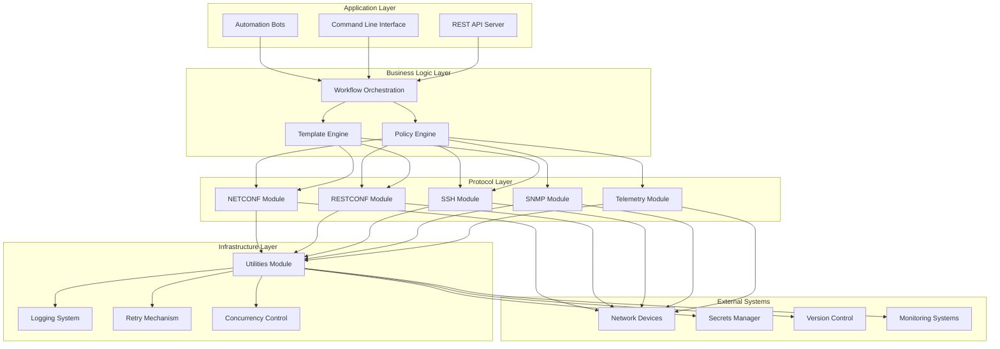
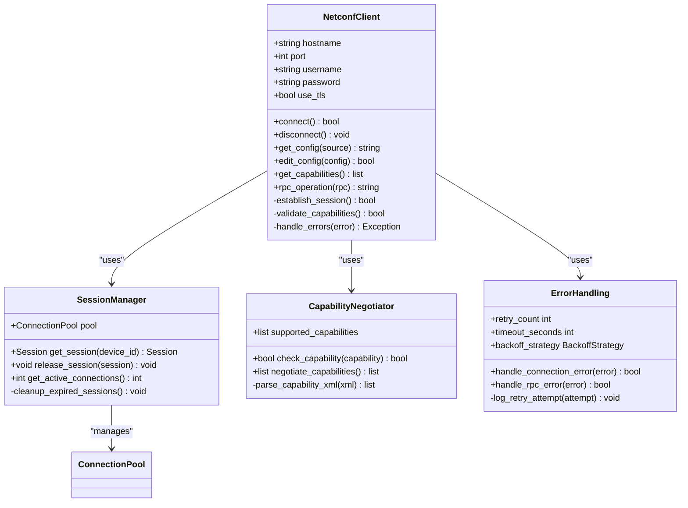
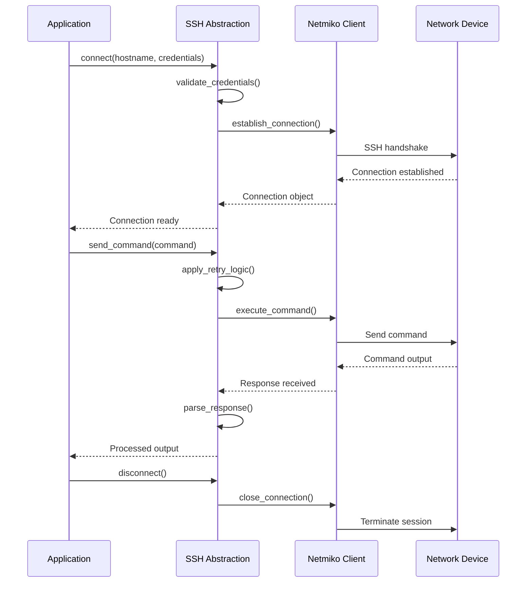
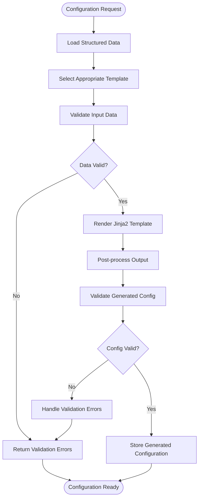
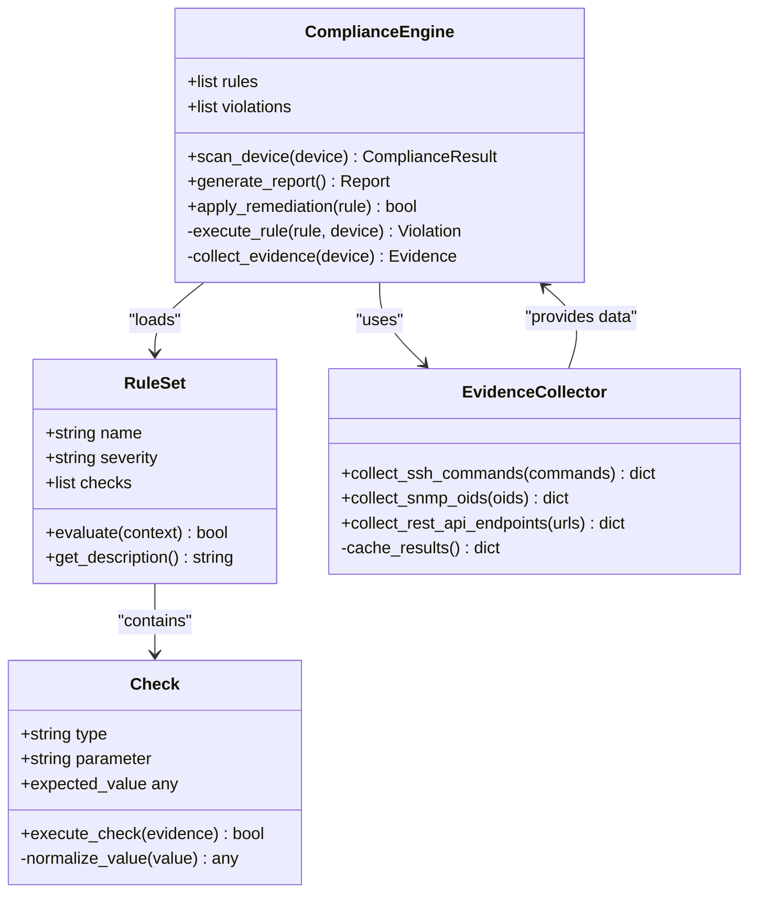

# Python Module Architecture

<cite>
**Referenced Files in This Document**
- [README.md](file://README.md)
</cite>

## Table of Contents
1. [Introduction](#introduction)
2. [Project Structure](#project-structure)
3. [Core Components](#core-components)
4. [Architecture Overview](#architecture-overview)
5. [Detailed Component Analysis](#detailed-component-analysis)
6. [Dependency Analysis](#dependency-analysis)
7. [Performance Considerations](#performance-considerations)
8. [Troubleshooting Guide](#troubleshooting-guide)
9. [Conclusion](#conclusion)
10. [Appendices](#appendices)

## Introduction

This document provides comprehensive documentation for the Python module subsystem of the Enterprise Network Automation Platform. The platform is designed as a production-grade, vendor-agnostic solution for managing thousands of network devices across multi-vendor, multi-region environments. The Python modules form the core automation engine, providing specialized functionality for NETCONF/RESTCONF clients, SSH abstraction, SNMP polling, telemetry processing, configuration generation, validation frameworks, backup management, and compliance enforcement.

The modular architecture follows enterprise best practices with PEP 8 compliance, type hints, comprehensive docstrings, and extensive testing coverage. Each module is designed to be independently testable, reusable, and maintainable while supporting concurrent operations across large device fleets.

## Project Structure

The Python module subsystem is organized under the `python/` directory with a feature-based architecture that separates concerns by protocol and functionality:

```mermaid
graph TB
subgraph "Python Modules"
Inventory[Inventory Management]
Netconf[NETCONF Client]
Restconf[RESTCONF Client]
SSH[SSH Abstraction]
SNMP[SNMP Polling]
Telemetry[Telemetry Processing]
ConfigGen[Configuration Generation]
Validation[Validation Framework]
Backup[Backup Management]
Compliance[Compliance Engine]
Utils[Shared Utilities]
end
subgraph "External Dependencies"
Netmiko[Netmiko/Paramiko]
Jinja2[Jinja2 Templates]
PySNMP[PySNMP]
NCClient[NCClient]
RESTAPI[REST APIs]
end
Inventory --> Utils
Netconf --> Utils
Restconf --> Utils
SSH --> Utils
SNMP --> Utils
Telemetry --> Utils
ConfigGen --> Utils
Validation --> Utils
Backup --> Utils
Compliance --> Utils
SSH --> Netmiko
Netconf --> NCClient
SNMP --> PySNMP
ConfigGen --> Jinja2
Restconf --> RESTAPI
```

**Diagram sources**
- [README.md:130-141](file://README.md#L130-L141)

The architecture follows these key principles:
- **Separation of Concerns**: Each module handles specific protocols or functionalities
- **Shared Utilities**: Common functionality like logging, retry logic, and concurrency control
- **Type Safety**: Comprehensive type hints throughout the codebase
- **Testability**: Each module has corresponding unit tests
- **Extensibility**: Pluggable architecture for new protocols and vendors

**Section sources**
- [README.md:130-141](file://README.md#L130-L141)

## Core Components

The Python module subsystem consists of ten specialized modules, each serving distinct purposes in the network automation workflow:

### Inventory Management (`inventory/`)
Handles inventory parsing, device enrichment, and CMDB integration. Provides structured device information including vendor-specific attributes, connection parameters, and metadata.

### NETCONF Client (`netconf/`)
Implements NETCONF protocol client with capability negotiation, session management, and YANG model support. Handles RPC operations and configuration management through standardized interfaces.

### RESTCONF Client (`restconf/`)
Provides RESTCONF client functionality with HTTP/HTTPS transport, authentication handling, and JSON/XML payload processing. Supports modern RESTful API interactions with network devices.

### SSH Abstraction (`ssh/`)
Wraps Netmiko and Paramiko libraries to provide unified SSH interface with built-in retry logic, connection pooling, and error handling. Abstracts vendor-specific SSH command differences.

### SNMP Polling (`snmp/`)
Implements SNMPv3 polling capabilities with secure authentication and encryption. Supports bulk operations, trap handling, and performance monitoring data collection.

### Telemetry Processing (`telemetry/`)
Handles model-driven telemetry streams with gRPC and streaming protocols. Includes message parsing, data transformation, and real-time analytics capabilities.

### Configuration Generation (`config_gen/`)
Jinja2-based configuration generation engine that transforms structured data into vendor-specific configurations. Supports template inheritance, conditional rendering, and validation hooks.

### Validation Framework (`validation/`)
Pre-deployment configuration validation system with syntax checking, semantic analysis, and policy enforcement. Integrates with external tools like Batfish for deep packet inspection.

### Backup Management (`backup/`)
Comprehensive backup system with versioning, encryption, and automated retention policies. Supports incremental backups and disaster recovery workflows.

### Compliance Engine (`compliance/`)
Pluggable compliance framework with rule sets for security policies, configuration standards, and regulatory requirements. Generates audit reports and remediation suggestions.

### Shared Utilities (`utils/`)
Common functionality including logging infrastructure, retry mechanisms, concurrency control, bulk operations, and helper functions used across all modules.

**Section sources**
- [README.md:438-456](file://README.md#L438-L456)

## Architecture Overview

The Python module architecture follows a layered design pattern with clear separation between protocol implementations, business logic, and shared utilities:

**Diagram sources**
- [README.md:52-99](file://README.md#L52-L99)
- [README.md:438-456](file://README.md#L438-L456)

The architecture emphasizes:
- **Modularity**: Clear boundaries between components
- **Scalability**: Support for concurrent operations across thousands of devices
- **Resilience**: Built-in retry logic and error handling
- **Observability**: Comprehensive logging and monitoring integration
- **Security**: Secure secret management and encrypted communications

## Detailed Component Analysis

### NETCONF Client Module

The NETCONF client module provides a robust implementation of the NETCONF protocol with advanced features:

**Diagram sources**
- [README.md:445-446](file://README.md#L445-L446)

Key features include:
- Automatic capability negotiation with remote devices
- Connection pooling for efficient resource utilization
- Comprehensive error handling with exponential backoff
- TLS support for secure communications
- YANG model validation and parsing

### SSH Abstraction Module

The SSH abstraction layer provides a unified interface over Netmiko and Paramiko:

**Diagram sources**
- [README.md:447-448](file://README.md#L447-L448)

The module implements:
- Unified interface for multiple SSH libraries
- Automatic retry with configurable backoff strategies
- Command output parsing and normalization
- Connection state management and cleanup
- Vendor-specific command adaptation

### Configuration Generation Module

The configuration generation system uses Jinja2 templates with structured data:

**Diagram sources**
- [README.md:450-451](file://README.md#L450-L451)

Features include:
- Template inheritance and composition
- Conditional rendering based on device capabilities
- Syntax validation before deployment
- Multi-vendor template support
- Template versioning and rollback

### Compliance Engine

The compliance engine provides pluggable rule-based compliance checking:

**Diagram sources**
- [README.md:453-454](file://README.md#L453-L454)

The engine supports:
- Multiple evidence collection methods (SSH, SNMP, REST API)
- Pluggable rule definitions with severity levels
- Automated remediation suggestions
- Audit trail and reporting capabilities
- Integration with external compliance frameworks

**Section sources**
- [README.md:445-456](file://README.md#L445-L456)

## Dependency Analysis

The Python module subsystem has well-defined dependencies and relationships:

```mermaid
graph TB
subgraph "Core Dependencies"
Netmiko[Netmiko]
Paramiko[Paramiko]
Jinja2[Jinja2]
PySNMP[PySNMP]
NCClient[NCClient]
Requests[Requests]
AsyncIO[AsyncIO]
Threading[Threading]
end
subgraph "Utility Libraries"
Logging[Logging]
TypeHints[Type Hints]
PyTest[PyTest]
Black[Black Formatter]
Flake8[Flake8 Linter]
end
subgraph "External Services"
Vault[HashiCorp Vault]
AWS[AWS Secrets Manager]
Azure[Azure Key Vault]
Prometheus[Prometheus]
Grafana[Grafana]
end
SSH_Module[SSH Module] --> Netmiko
SSH_Module --> Paramiko
ConfigGen_Module[Config Gen Module] --> Jinja2
SNMP_Module[SNMP Module] --> PySNMP
Netconf_Module[NETCONF Module] --> NCClient
Restconf_Module[RESTCONF Module] --> Requests
All_Modules[All Modules] --> Logging
All_Modules --> TypeHints
Tests[Test Suite] --> PyTest
Code_Quality[Code Quality] --> Black
Code_Quality --> Flake8
Utils_Module[Utils Module] --> AsyncIO
Utils_Module --> Threading
Utils_Module --> Vault
Utils_Module --> AWS
Utils_Module --> Azure
Utils_Module --> Prometheus
Utils_Module --> Grafana
```

**Diagram sources**
- [README.md:184-199](file://README.md#L184-L199)
- [README.md:438-456](file://README.md#L438-L456)

Key dependency characteristics:
- **Minimal Coupling**: Modules depend only on essential external libraries
- **Version Pinning**: Specific versions ensure reproducibility
- **Security Focus**: Cryptographic libraries for secure communications
- **Performance Optimization**: Asynchronous operations for high-throughput scenarios
- **Testing Infrastructure**: Comprehensive testing tools and frameworks

**Section sources**
- [README.md:184-199](file://README.md#L184-L199)
- [README.md:438-456](file://README.md#L438-L456)

## Performance Considerations

Managing thousands of devices concurrently requires careful attention to performance and resource optimization:

### Concurrency Strategies

The platform employs multiple concurrency patterns to handle large-scale operations:

- **Asynchronous Operations**: Non-blocking I/O for network operations using asyncio
- **Connection Pooling**: Reusable connections to reduce overhead
- **Batch Processing**: Grouping operations to minimize round trips
- **Memory Management**: Efficient data structures and garbage collection
- **Resource Limits**: Controlled parallelism to prevent system overload

### Memory Optimization Techniques

- **Lazy Loading**: Load data only when needed
- **Streaming Processing**: Process large datasets without loading entirely into memory
- **Object Pooling**: Reuse expensive objects like database connections
- **Garbage Collection Tuning**: Optimize GC settings for workload patterns
- **Memory Profiling**: Continuous monitoring of memory usage patterns

### Scalability Patterns

- **Horizontal Scaling**: Distribute workloads across multiple workers
- **Load Balancing**: Even distribution of device connections
- **Caching Strategies**: Intelligent caching of frequently accessed data
- **Rate Limiting**: Prevent overwhelming target devices
- **Graceful Degradation**: Maintain functionality under load pressure

### Monitoring and Metrics

- **Performance Metrics**: Track operation latency and throughput
- **Resource Utilization**: Monitor CPU, memory, and network usage
- **Error Rates**: Track failure rates and timeout occurrences
- **Queue Depths**: Monitor pending operations and backlog
- **Health Checks**: Continuous system health monitoring

## Troubleshooting Guide

Common issues and their resolutions in the Python module subsystem:

### Connection Issues
- **Timeout Errors**: Adjust connection timeouts and retry policies
- **Authentication Failures**: Verify credentials and certificate configurations
- **Network Connectivity**: Check firewall rules and routing configurations
- **SSL/TLS Problems**: Validate certificates and cipher suites

### Performance Problems
- **High Memory Usage**: Implement memory profiling and optimize data structures
- **Slow Operations**: Profile bottlenecks and optimize critical paths
- **Connection Exhaustion**: Review connection pool settings and cleanup procedures
- **CPU Saturation**: Analyze thread/process utilization and optimize algorithms

### Configuration Issues
- **Template Rendering Errors**: Validate Jinja2 syntax and input data
- **Schema Validation Failures**: Check data models and validation rules
- **Compliance Check Failures**: Review policy definitions and device configurations
- **Backup Corruption**: Verify backup integrity and restoration procedures

### Debugging Techniques
- **Structured Logging**: Enable detailed logging with correlation IDs
- **Performance Profiling**: Use profiling tools to identify bottlenecks
- **Network Tracing**: Capture and analyze network traffic patterns
- **Memory Dumping**: Analyze memory snapshots for leak detection

**Section sources**
- [README.md:674-685](file://README.md#L674-L685)

## Conclusion

The Python module subsystem of the Enterprise Network Automation Platform represents a comprehensive, production-ready solution for large-scale network automation. The modular architecture provides clear separation of concerns, extensibility points for new protocols, and robust error handling for enterprise environments.

Key strengths include:
- **Enterprise-Grade Design**: Production-ready with comprehensive testing and monitoring
- **Protocol Flexibility**: Support for multiple protocols with unified interfaces
- **Scalability**: Designed for thousands of concurrent device connections
- **Security**: Built-in security features including encryption and secret management
- **Maintainability**: Clean code organization with comprehensive documentation

The platform successfully addresses the challenges of modern network automation while maintaining high standards for code quality, security, and operational reliability. The modular approach ensures that individual components can be developed, tested, and deployed independently while working together seamlessly.

## Appendices

### Development Guidelines

#### Type Hints and PEP 8 Compliance
- All modules follow PEP 8 standards with comprehensive type hints
- Consistent naming conventions and code organization
- Automated linting and formatting in CI/CD pipeline

#### Docstring Standards
- Google-style docstrings for all public interfaces
- Parameter descriptions and return value specifications
- Example usage in complex function documentation

#### Testing Approach
- Unit tests for all business logic
- Integration tests for external dependencies
- Performance tests for scalability validation
- Security tests for vulnerability scanning

### Extension Examples

#### Creating New Protocol-Specific Clients
1. Follow existing module patterns and interfaces
2. Implement required abstract methods
3. Add comprehensive error handling
4. Include unit and integration tests
5. Update documentation and examples

#### Extending Existing Modules
1. Identify extension points in current architecture
2. Maintain backward compatibility
3. Add configuration options for new features
4. Provide migration guides for breaking changes
5. Update test coverage for new functionality