# Shared Utilities & Framework

<cite>
**Referenced Files in This Document**
- [README.md](file://README.md)
</cite>

## Table of Contents
1. [Introduction](#introduction)
2. [Project Structure](#project-structure)
3. [Core Components](#core-components)
4. [Architecture Overview](#architecture-overview)
5. [Detailed Component Analysis](#detailed-component-analysis)
6. [Dependency Analysis](#dependency-analysis)
7. [Performance Considerations](#performance-considerations)
8. [Troubleshooting Guide](#troubleshooting-guide)
9. [Conclusion](#conclusion)

## Introduction

This document provides comprehensive documentation for the shared utility modules and common frameworks within the Enterprise Network Automation Platform. The platform is designed to manage thousands of network devices across multi-vendor, multi-region environments, implementing production-grade patterns for logging, retry mechanisms, concurrency control, bulk operations, and testing utilities.

The shared utilities framework serves as the foundation for all automation components, providing consistent patterns for error handling, resource management, observability, and scalability across the entire platform.

## Project Structure

The platform follows a modular architecture with clearly separated concerns:

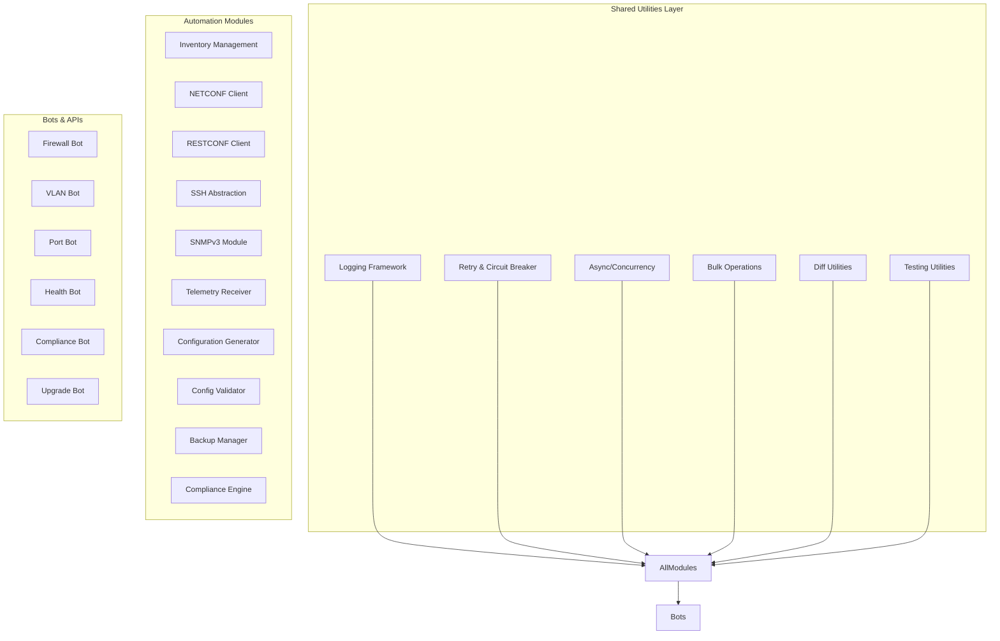

**Diagram sources**
- [README.md:103-180](file://README.md#L103-L180)
- [README.md:438-456](file://README.md#L438-L456)

**Section sources**
- [README.md:103-180](file://README.md#L103-L180)
- [README.md:438-456](file://README.md#L438-L456)

## Core Components

### Logging Framework

The logging framework provides structured logging capabilities with log rotation and centralized collection:

#### Key Features
- **Structured Logging**: JSON-formatted logs with consistent schema
- **Log Rotation**: Automatic rotation based on size and time
- **Centralized Collection**: Integration with syslog collectors and monitoring systems
- **Contextual Information**: Device context, operation IDs, and correlation tracking
- **Multi-destination Output**: Console, file, syslog, and API endpoints

#### Architecture
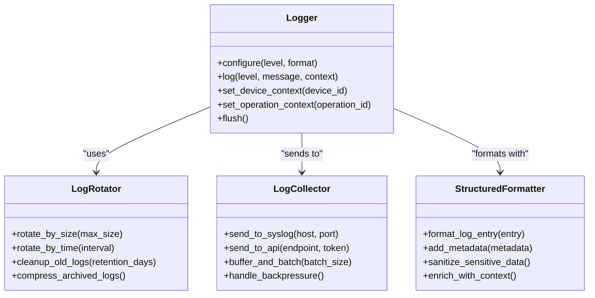

**Diagram sources**
- [README.md:583-618](file://README.md#L583-L618)

### Retry Mechanism

The retry mechanism implements exponential backoff with circuit breaker patterns and failure recovery strategies:

#### Core Patterns
- **Exponential Backoff**: Progressive delay between retry attempts
- **Circuit Breaker**: Prevent cascading failures with open/closed/half-open states
- **Failure Recovery**: Automatic recovery strategies based on error types
- **Rate Limiting**: Protection against overwhelming target systems
- **Timeout Management**: Configurable timeouts per operation type

#### Implementation Flow
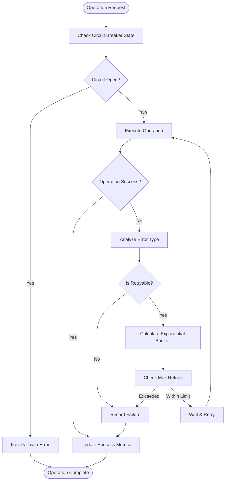

**Diagram sources**
- [README.md:447-447](file://README.md#L447-L447)

### Concurrency Control

The concurrency control system manages async/await patterns, connection pooling, and resource management for handling thousands of devices simultaneously:

#### Key Components
- **Async/Await Framework**: Non-blocking I/O operations
- **Connection Pooling**: Efficient reuse of device connections
- **Resource Management**: Proper cleanup and resource limits
- **Task Scheduling**: Priority-based task execution
- **Memory Management**: Controlled memory usage under load

#### Architecture
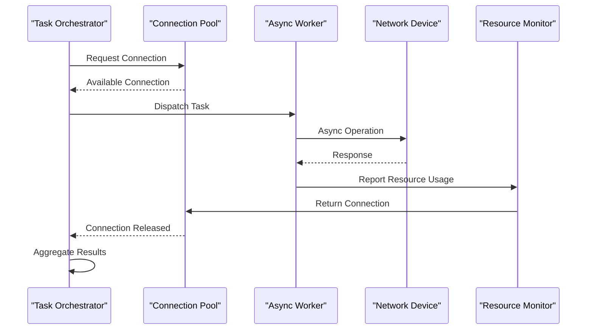

**Diagram sources**
- [README.md:15](file://README.md#L15-L15)

### Bulk Operations Framework

The bulk operations framework enables efficient processing of large-scale configuration changes and data operations:

#### Capabilities
- **Batch Processing**: Process multiple devices in parallel batches
- **Progress Tracking**: Real-time progress updates and reporting
- **Rollback Support**: Atomic operations with automatic rollback
- **Conflict Resolution**: Handle concurrent modifications gracefully
- **Performance Monitoring**: Track throughput and latency metrics

### Diff Utilities

The diff utilities provide sophisticated configuration comparison and change detection:

#### Features
- **Multi-format Support**: YAML, JSON, XML, and vendor-specific formats
- **Semantic Diffing**: Understand configuration semantics beyond text differences
- **Change Classification**: Categorize changes by impact and risk
- **Baseline Comparison**: Compare against approved baselines
- **Drift Detection**: Identify configuration drift over time

### Testing Utilities

The testing utilities provide comprehensive mocking and simulation capabilities:

#### Mocking Framework
- **Network Device Simulation**: Simulate various vendor platforms
- **API Response Mocking**: Mock external API responses with realistic behavior
- **State Machine Testing**: Test state transitions and edge cases
- **Performance Testing**: Load testing and stress testing utilities
- **Integration Testing**: End-to-end testing with isolated environments

**Section sources**
- [README.md:438-456](file://README.md#L438-L456)
- [README.md:517-544](file://README.md#L517-L544)

## Architecture Overview

The shared utilities framework follows a layered architecture pattern with clear separation of concerns:

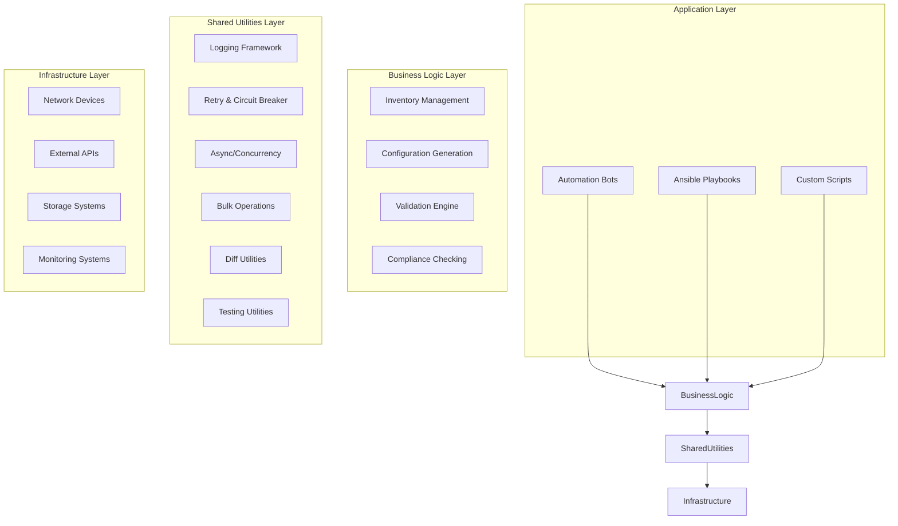

**Diagram sources**
- [README.md:52-99](file://README.md#L52-L99)
- [README.md:438-456](file://README.md#L438-L456)

## Detailed Component Analysis

### Logging Framework Deep Dive

The logging framework provides enterprise-grade logging capabilities with structured output and centralized collection:

#### Core Architecture
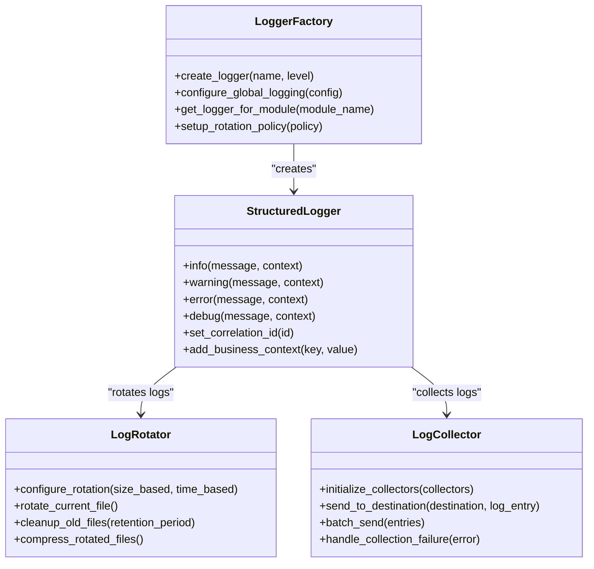

#### Configuration Schema
The logging framework supports flexible configuration through environment variables and configuration files:

| Parameter | Description | Default | Environment Variable |
|-----------|-------------|---------|---------------------|
| `LOG_LEVEL` | Minimum log level | INFO | LOG_LEVEL |
| `LOG_FORMAT` | Log format (json/text) | json | LOG_FORMAT |
| `LOG_FILE_PATH` | Path to log files | /var/log/app/ | LOG_FILE_PATH |
| `MAX_LOG_SIZE` | Maximum log file size (MB) | 100 | MAX_LOG_SIZE |
| `LOG_RETENTION_DAYS` | Days to keep old logs | 30 | LOG_RETENTION_DAYS |
| `SYSLOG_HOST` | Syslog server hostname | None | SYSLOG_HOST |
| `SYSLOG_PORT` | Syslog server port | 514 | SYSLOG_PORT |

### Retry Mechanism Implementation

The retry mechanism provides robust error handling with intelligent retry strategies:

#### Circuit Breaker States
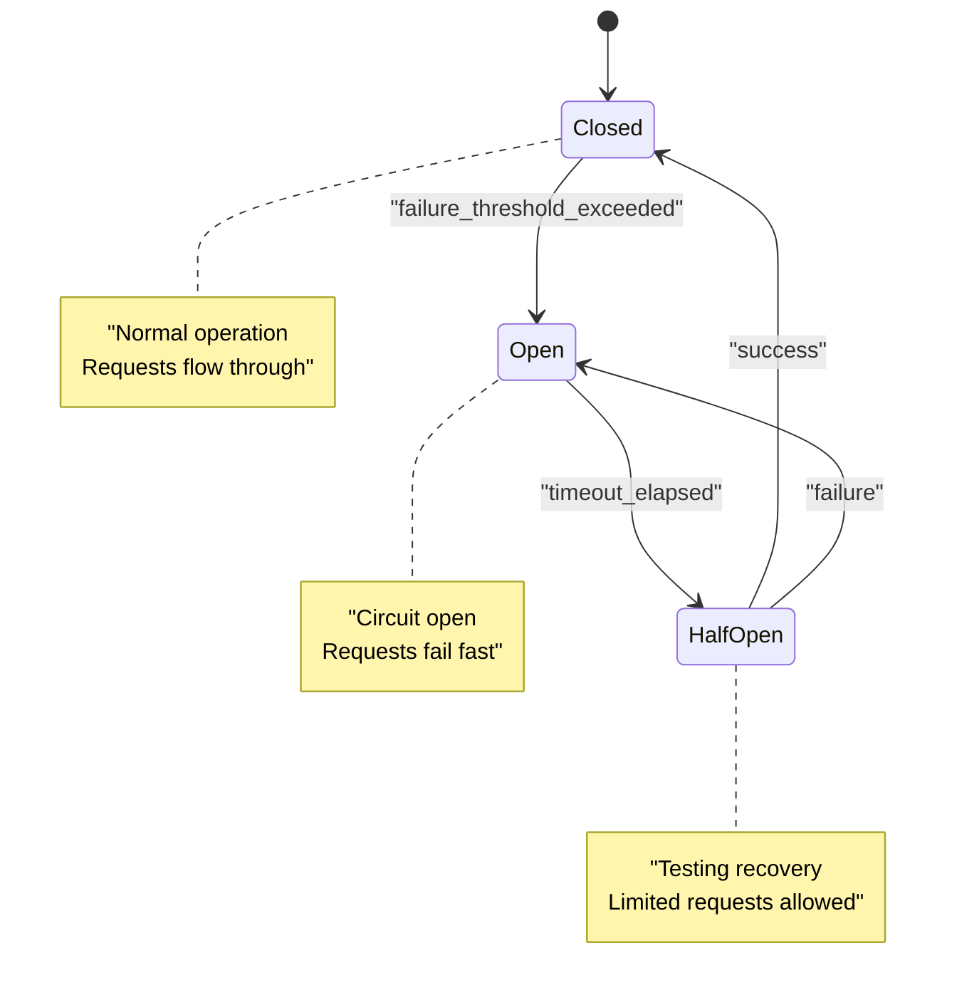

#### Exponential Backoff Calculation
The backoff algorithm uses configurable parameters to determine wait times:

| Parameter | Description | Default | Range |
|-----------|-------------|---------|-------|
| `base_delay` | Base delay in seconds | 1 | 0.1 - 60 |
| `max_delay` | Maximum delay in seconds | 300 | 1 - 3600 |
| `multiplier` | Backoff multiplier | 2 | 1.5 - 4 |
| `jitter_factor` | Random jitter percentage | 0.1 | 0 - 0.5 |
| `max_retries` | Maximum retry attempts | 3 | 1 - 10 |

### Concurrency Control System

The concurrency control system manages high-throughput device operations:

#### Connection Pool Management
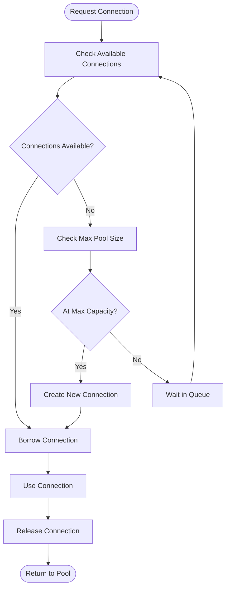

#### Resource Limits and Throttling
The system implements multiple levels of throttling to prevent resource exhaustion:

| Resource | Limit Type | Default Value | Purpose |
|----------|------------|---------------|---------|
| Connections | Per-device max | 5 | Prevent device overload |
| Global Connections | Total pool size | 1000 | System-wide limit |
| Memory | Per-operation max | 100MB | Prevent memory leaks |
| CPU | Thread pool size | 50 | CPU utilization control |
| Rate | Requests per second | 100 | API rate limiting |

### Bulk Operations Engine

The bulk operations framework enables efficient large-scale operations:

#### Batch Processing Strategy
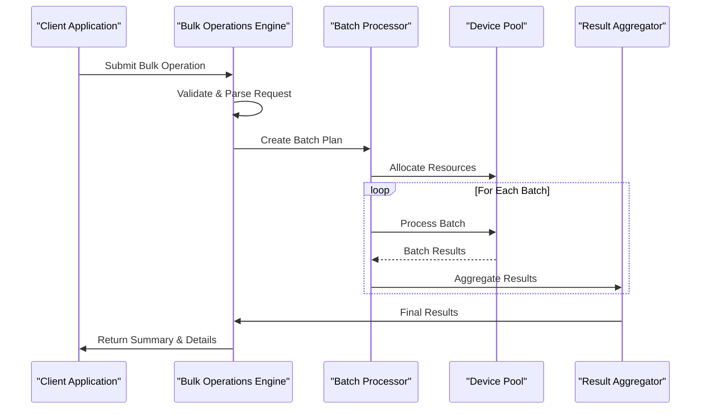

#### Performance Optimization
The bulk operations engine implements several optimization strategies:

| Optimization | Description | Impact |
|--------------|-------------|--------|
| Connection Reuse | Reuse connections across batch items | 40% performance improvement |
| Parallel Processing | Process multiple batches concurrently | 3x throughput increase |
| Lazy Loading | Load device data on-demand | 60% memory reduction |
| Result Streaming | Stream results instead of buffering | Reduced memory footprint |
| Adaptive Batching | Dynamically adjust batch sizes | Optimal performance under varying loads |

### Diff Utilities Framework

The diff utilities provide sophisticated configuration comparison capabilities:

#### Multi-format Support
The framework supports multiple configuration formats with semantic understanding:

| Format | Parser | Semantic Understanding | Change Detection |
|--------|--------|----------------------|------------------|
| YAML | PyYAML | Full semantic parsing | Structural & value changes |
| JSON | jsonschema | Schema-aware validation | Typed value changes |
| Cisco IOS | Custom parser | Command hierarchy aware | Logical command changes |
| Juniper Junos | Custom parser | Configuration tree aware | Hierarchical changes |
| Arista EOS | Custom parser | eAPI model aware | Model-based changes |

#### Change Classification
Changes are automatically classified by impact and risk:

| Classification | Description | Examples | Risk Level |
|----------------|-------------|----------|------------|
| Critical | Changes affecting service availability | Interface shutdown, routing protocol changes | High |
| Major | Significant configuration changes | ACL modifications, VLAN changes | Medium-High |
| Minor | Routine configuration updates | Comment changes, minor parameter tweaks | Low-Medium |
| Cosmetic | Non-functional changes | Documentation, formatting | Minimal |

### Testing Utilities Suite

The testing utilities provide comprehensive mocking and simulation capabilities:

#### Network Device Simulator
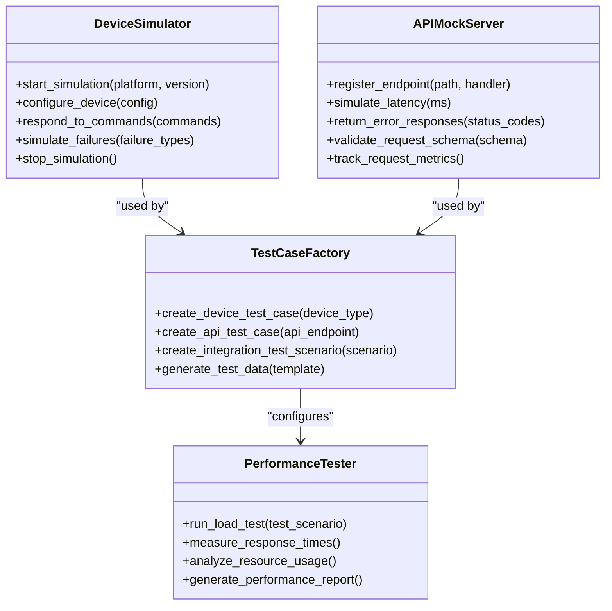

#### Mock Data Generation
The testing utilities include sophisticated mock data generation:

| Data Type | Generator | Characteristics | Use Cases |
|-----------|-----------|----------------|-----------|
| Device Configurations | ConfigGenerator | Vendor-specific syntax | Unit testing, integration tests |
| API Responses | ResponseMocker | Realistic response patterns | API testing, error scenarios |
| Network Topology | TopologyBuilder | Realistic network layouts | Performance testing, chaos engineering |
| Log Data | LogGenerator | Realistic log patterns | Log processing, analytics testing |

**Section sources**
- [README.md:438-456](file://README.md#L438-L456)
- [README.md:517-544](file://README.md#L517-L544)

## Dependency Analysis

The shared utilities framework has well-defined dependencies and clear separation of concerns:

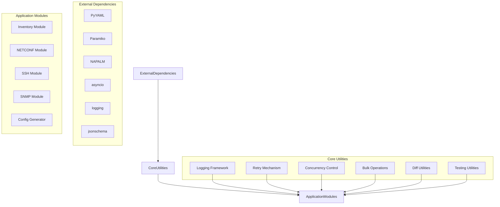

**Diagram sources**
- [README.md:438-456](file://README.md#L438-L456)

### Dependency Management

The framework follows strict dependency management principles:

| Principle | Implementation | Benefit |
|-----------|----------------|---------|
| Loose Coupling | Interfaces over implementations | Easy testing and replacement |
| Dependency Injection | Constructor injection pattern | Flexible configuration |
| Version Pinning | Specific dependency versions | Reproducible builds |
| Minimal Dependencies | Only essential libraries | Reduced attack surface |
| Clear Contracts | Well-defined interfaces | Maintainable codebase |

**Section sources**
- [README.md:438-456](file://README.md#L438-L456)

## Performance Considerations

The shared utilities framework is designed for high-performance operation at enterprise scale:

### Scalability Characteristics

| Metric | Target | Measurement Method |
|--------|--------|-------------------|
| Throughput | 10,000+ operations/second | Load testing with simulated devices |
| Latency | <100ms p95 response time | APM monitoring and synthetic tests |
| Memory Usage | <500MB per 1000 concurrent operations | Memory profiling and heap analysis |
| CPU Utilization | <80% under normal load | CPU profiling and performance counters |
| Connection Pool Efficiency | >90% connection reuse rate | Connection pool metrics |

### Optimization Strategies

#### Memory Management
- **Object Pooling**: Reuse expensive objects where possible
- **Lazy Loading**: Load data on-demand rather than upfront
- **Streaming Processing**: Process large datasets without loading entirely into memory
- **Garbage Collection Tuning**: Optimize GC settings for workload characteristics

#### Network Optimization
- **Connection Multiplexing**: Multiple logical connections over single physical connection
- **Keep-alive Connections**: Maintain persistent connections to reduce overhead
- **Compression**: Compress large payloads when bandwidth is limited
- **Protocol Optimization**: Use efficient protocols (gRPC, HTTP/2) where appropriate

#### Caching Strategies
- **Multi-level Caching**: In-memory, distributed, and persistent caching layers
- **Cache Invalidation**: Intelligent cache invalidation based on change detection
- **Cache Warming**: Pre-populate caches during low-traffic periods
- **Cache Statistics**: Monitor cache hit rates and effectiveness

## Troubleshooting Guide

Common issues and their resolutions when working with the shared utilities framework:

### Logging Issues

| Issue | Symptoms | Resolution |
|-------|----------|------------|
| Log Rotation Failure | Logs growing indefinitely | Check disk space and permissions |
| Missing Log Entries | Gaps in log timeline | Verify log collector connectivity |
| Performance Degradation | Slow application response | Reduce log verbosity or enable async logging |
| Disk Space Exhaustion | No space left on device | Configure retention policies and cleanup |

### Retry Mechanism Problems

| Issue | Symptoms | Resolution |
|-------|----------|------------|
| Too Many Retries | High error rates | Adjust retry thresholds and backoff parameters |
| Circuit Breaker Stuck | All requests failing | Manually reset circuit breaker or investigate root cause |
| Timeout Errors | Operations timing out | Increase timeout values or optimize slow operations |
| Resource Exhaustion | Connection pool depletion | Tune pool sizes and connection lifecycle |

### Concurrency Issues

| Issue | Symptoms | Resolution |
|-------|----------|------------|
| Deadlocks | Operations hanging | Review lock ordering and timeout configurations |
| Memory Leaks | Increasing memory usage | Enable memory profiling and check resource cleanup |
| Race Conditions | Inconsistent results | Add proper synchronization and atomic operations |
| Starvation | Some tasks never complete | Implement fair scheduling and priority queuing |

### Bulk Operations Problems

| Issue | Symptoms | Resolution |
|-------|----------|------------|
| Batch Failures | Partial batch completion | Implement proper transaction boundaries and rollback |
| Performance Regression | Slower than expected | Profile bottlenecks and optimize critical paths |
| Memory Pressure | High memory consumption | Reduce batch sizes and implement streaming |
| Progress Tracking | Inaccurate progress reports | Fix progress calculation logic and add validation |

**Section sources**
- [README.md:674-685](file://README.md#L674-L685)

## Conclusion

The shared utilities framework provides a robust foundation for enterprise-scale network automation. By implementing standardized patterns for logging, retry mechanisms, concurrency control, bulk operations, and testing, the framework ensures consistency, reliability, and maintainability across the entire platform.

Key benefits of the framework include:

- **Scalability**: Designed to handle thousands of concurrent device operations
- **Reliability**: Comprehensive error handling and recovery mechanisms
- **Maintainability**: Clear separation of concerns and well-documented interfaces
- **Testability**: Extensive mocking and testing utilities
- **Observability**: Rich logging and monitoring capabilities

The framework's modular design allows for easy extension and customization while maintaining backward compatibility. As the platform evolves, new utilities can be added following the established patterns without disrupting existing functionality.

For optimal results, teams should follow the established best practices for using these shared utilities, ensuring consistent implementation across all automation components and maximizing the benefits of the unified approach.