# Workflow Orchestration & CI/CD

<cite>
**Referenced Files in This Document**
- [README.md](file://README.md)
</cite>

## Table of Contents
1. [Introduction](#introduction)
2. [Project Structure](#project-structure)
3. [Core Components](#core-components)
4. [Architecture Overview](#architecture-overview)
5. [Detailed Component Analysis](#detailed-component-analysis)
6. [Dependency Analysis](#dependency-analysis)
7. [Performance Considerations](#performance-considerations)
8. [Troubleshooting Guide](#troubleshooting-guide)
9. [Conclusion](#conclusion)
10. [Appendices](#appendices)

## Introduction
This document explains the workflow orchestration and CI/CD system for a production-grade, vendor-agnostic network automation platform. It focuses on the GitOps pipeline architecture implemented with GitHub Actions workflows that automate validation, testing, approval gates, deployment, post-deploy verification, rollback, artifact management, and monitoring integration. The content is derived from the repository’s documentation and diagrams to provide an accessible yet comprehensive guide for both technical and non-technical readers.

## Project Structure
The repository organizes automation assets across inventories, playbooks, roles, templates, Python modules, bots, tests, compliance policies, monitoring configurations, Terraform IaC, schemas, examples, scripts, docs, images, and GitHub Actions workflows. The CI/CD pipelines are defined under .github/workflows and orchestrated through multiple GitHub Actions workflows triggered by PRs, merges, schedules, or manual dispatches.

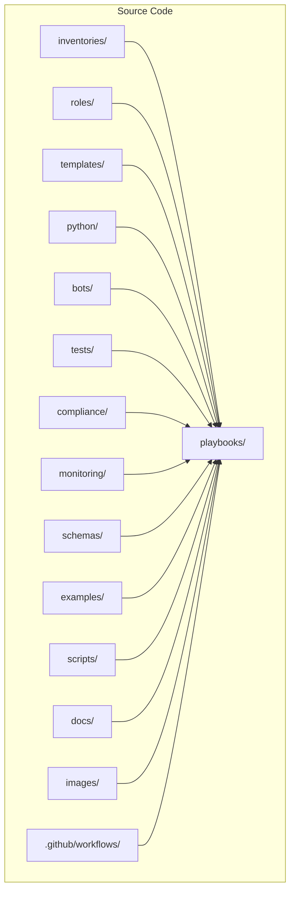

**Diagram sources**
- [README.md:103-180](file://README.md#L103-L180)

**Section sources**
- [README.md:103-180](file://README.md#L103-L180)

## Core Components
The core components of the workflow orchestration system include:
- GitHub Actions workflows for CI and CD stages
- Linting and formatting checks
- Schema validation for structured data
- Secrets scanning and security scans
- Unit and role-based tests (pytest, Molecule)
- Template rendering validation
- Compliance policy checks (OPA, Batfish, custom rules)
- Ansible dry runs
- Manual approval gates for production changes
- Automated deployment to target environments
- Post-deploy verification and health checks
- Auto-rollback on failure
- Artifact publishing and release creation
- Documentation generation
- Monitoring and alerting integration

These components form a multi-stage pipeline that ensures code quality, security, compliance, and reliability before any change reaches production.

**Section sources**
- [README.md:479-514](file://README.md#L479-L514)
- [README.md:517-544](file://README.md#L517-L544)
- [README.md:548-579](file://README.md#L548-L579)
- [README.md:583-616](file://README.md#L583-L616)

## Architecture Overview
The GitOps pipeline orchestrates changes from developer branches through automated validation, human approvals, deployment, verification, and observability. The following diagram maps the end-to-end flow as described in the repository.

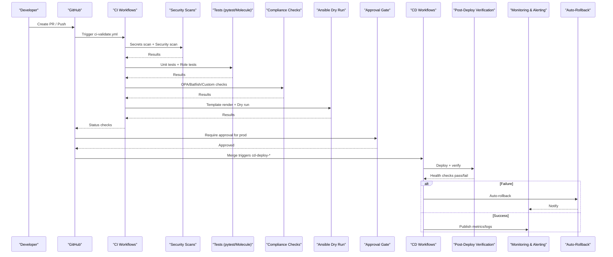

**Diagram sources**
- [README.md:479-514](file://README.md#L479-L514)
- [README.md:619-638](file://README.md#L619-L638)

## Detailed Component Analysis

### Multi-Stage Pipeline Stages
The pipeline executes the following stages in order:
- Lint & format check
- YAML schema validation
- Secrets scanning (detect-secrets)
- Security scanning (Bandit, Safety)
- Unit tests (pytest)
- Molecule role tests
- Template rendering validation
- Compliance policy checks (OPA, Batfish, custom Python)
- Ansible dry run
- Manual approval gate (production)
- Deployment to target environment
- Post-deploy verification
- Documentation generation
- Release creation and artifact publishing
- Auto-rollback on verification failure

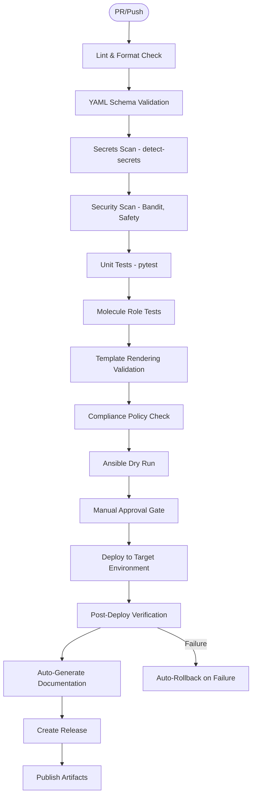

**Diagram sources**
- [README.md:479-514](file://README.md#L479-L514)

**Section sources**
- [README.md:479-514](file://README.md#L479-L514)

### Key Workflows and Triggers
The repository defines several key workflows:
- ci-validate.yml: Runs lint, test, scan, validate on PRs
- cd-deploy-staging.yml: Deploys to staging with dry run on merge to staging
- cd-deploy-production.yml: Deploys to production on merge to main with approval
- compliance-scan.yml: Scheduled daily full compliance audit
- firmware-upgrade.yml: Manual dispatch for orchestrated firmware upgrades
- backup-schedule.yml: Scheduled daily configuration backups at 02:00 UTC
- docs-generate.yml: Regenerates documentation on merge to main

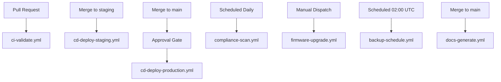

**Diagram sources**
- [README.md:503-514](file://README.md#L503-L514)

**Section sources**
- [README.md:503-514](file://README.md#L503-L514)

### Testing Strategy Integration
Testing is integrated into the pipeline across multiple layers:
- Unit tests using pytest for Python modules and Jinja2 filters
- Linting via ansible-lint, yamllint, flake8, black
- Schema validation using jsonschema and cerberus for inventory and variables
- Role tests using Molecule for individual Ansible roles
- Network simulation using Batfish for ACL/routing/firewall analysis
- Integration tests using pyATS and NAPALM for device connectivity and config parsing
- Golden config tests comparing against approved baselines
- Regression tests ensuring no unintended changes
- Performance tests for API and bot endpoints during release candidates

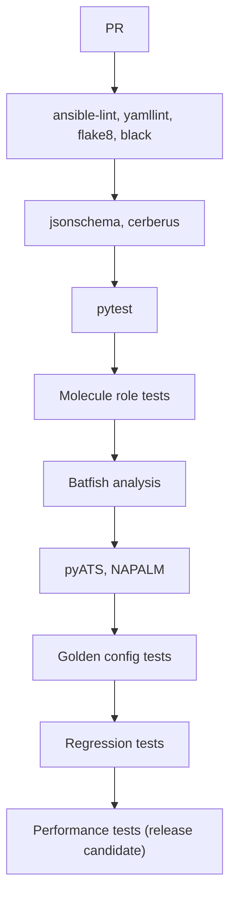

**Diagram sources**
- [README.md:517-544](file://README.md#L517-L544)

**Section sources**
- [README.md:517-544](file://README.md#L517-L544)

### Compliance Enforcement Flow
Compliance is enforced at every stage using OPA policies, Batfish configuration analysis, and custom Python checks. The flow evaluates pull requests and blocks merges when violations are detected.

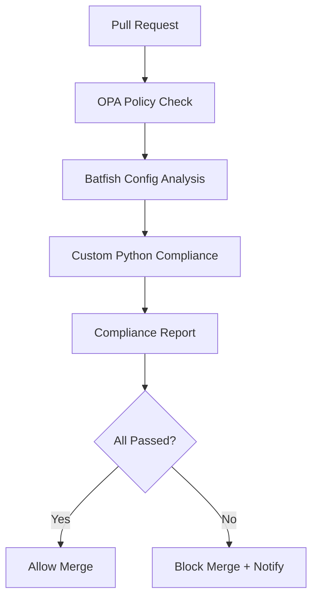

**Diagram sources**
- [README.md:548-579](file://README.md#L548-L579)

**Section sources**
- [README.md:548-579](file://README.md#L548-L579)

### Upgrade and Rollback Workflows
Firmware upgrades follow a controlled process including pre-checks, backups, download, verification, installation, reboot, and post-validation. Configuration rollbacks identify target versions, fetch backups, diff current vs target, apply rollback, verify, and notify the team.

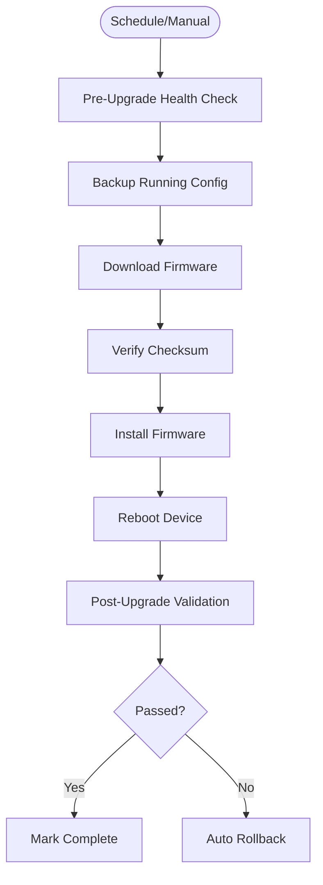

**Diagram sources**
- [README.md:642-658](file://README.md#L642-L658)

**Section sources**
- [README.md:642-658](file://README.md#L642-L658)

### Monitoring and Observability Integration
Monitoring integrates SNMPv3 polling, model-driven telemetry, and syslog streams into Prometheus and OpenTelemetry collectors. Alerts are routed to Slack, PagerDuty, and Microsoft Teams. Dashboards cover network health, automation metrics, compliance overview, upgrade tracking, API performance, and inventory drift.

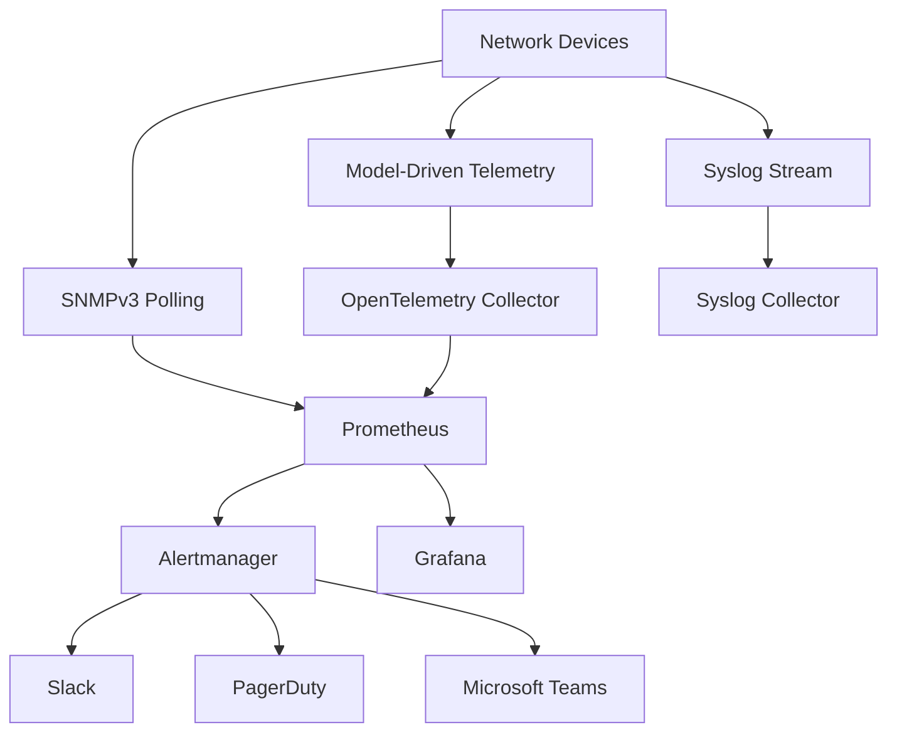

**Diagram sources**
- [README.md:583-616](file://README.md#L583-L616)

**Section sources**
- [README.md:583-616](file://README.md#L583-L616)

### Secrets Management and OIDC Federation
Secrets are never committed to Git. The platform supports HashiCorp Vault, AWS Secrets Manager, Azure Key Vault, CyberArk PAM, Ansible Vault, and environment variables. CI/CD tokens use ephemeral credentials via OIDC federation without static secrets.

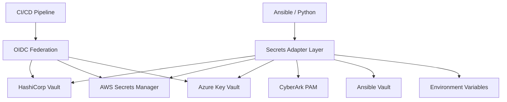

**Diagram sources**
- [README.md:339-368](file://README.md#L339-L368)

**Section sources**
- [README.md:339-368](file://README.md#L339-L368)

### GitOps Workflow Example
A typical GitOps change follows these steps:
- Developer creates a feature branch and modifies configuration, templates, or playbooks
- Pull request is opened targeting staging or main
- Automated validation runs lint, tests, schema validation, secrets scan, compliance check, and dry run
- Peer reviewer approves; for production, CAB may be required
- On merge, GitHub Actions triggers deployment
- Post-deploy verification runs health checks and config validation
- Automatic rollback occurs if verification fails

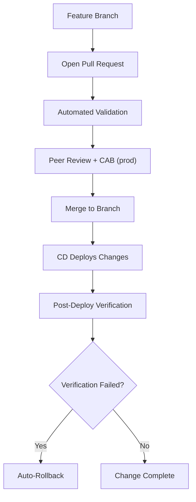

**Diagram sources**
- [README.md:619-638](file://README.md#L619-L638)

**Section sources**
- [README.md:619-638](file://README.md#L619-L638)

## Dependency Analysis
The workflow orchestration depends on multiple tools and services:
- GitHub Actions for CI/CD execution
- Linters and formatters for code quality
- Schema validators for structured data integrity
- Secrets scanners and security tools for vulnerability detection
- Test frameworks for unit, role, integration, and regression testing
- Compliance engines for policy enforcement
- Ansible for configuration management and dry runs
- Monitoring systems for observability and alerting
- Secrets backends for secure credential management

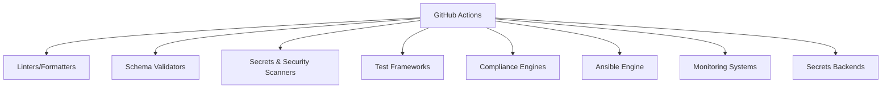

[No sources needed since this diagram shows conceptual relationships among components]

## Performance Considerations
- Parallelize independent stages (linting, schema validation, secrets scanning) to reduce pipeline duration
- Cache dependencies for Python, Ansible collections, and Docker images used by Molecule
- Use matrix strategies to run tests across multiple platforms and devices concurrently
- Limit scope of Batfish analysis to affected configurations to avoid long-running jobs
- Optimize template rendering by validating only changed templates where possible
- Configure retry logic for transient failures in external integrations (Vault, cloud APIs)
- Use incremental deployments and canary releases to minimize blast radius

[No sources needed since this section provides general guidance]

## Troubleshooting Guide
Common issues and resolutions:
- Ansible connection timeout: Verify SSH reachability using ping against the inventory
- Template rendering error: Debug Jinja2 syntax using the config generator with debug flags
- Compliance check failure: Review compliance policies and device running config diffs
- CI pipeline failure: Inspect GitHub Actions logs for actionable error messages
- Vault authentication failure: Verify OIDC token or AppRole credentials and check Vault policies
- Molecule test failure: Ensure Docker/Podman is running and review molecule configuration
- Batfish analysis error: Validate snapshots in the designated directory

**Section sources**
- [README.md:674-685](file://README.md#L674-L685)

## Conclusion
The workflow orchestration system implements a robust, multi-stage GitOps pipeline that enforces quality, security, and compliance while enabling safe deployments with human-in-the-loop approvals and automated rollback mechanisms. Integrated monitoring and observability ensure continuous visibility into system health and operational metrics. By adhering to the documented practices and troubleshooting steps, teams can maintain high reliability and accelerate change delivery safely.

[No sources needed since this section summarizes without analyzing specific files]

## Appendices

### Custom Workflow Creation Examples
To create custom workflows aligned with the existing architecture:
- Define a new GitHub Actions workflow file under .github/workflows
- Choose appropriate triggers (push, pull_request, schedule, workflow_dispatch)
- Add job stages mirroring the pipeline: lint, validate, scan, test, compliance, dry run, deploy, verify
- Integrate secrets via OIDC federation and environment variables
- Publish artifacts and generate documentation as needed
- Configure approval gates for production changes
- Implement post-deploy verification and auto-rollback on failure

[No sources needed since this section provides general guidance]