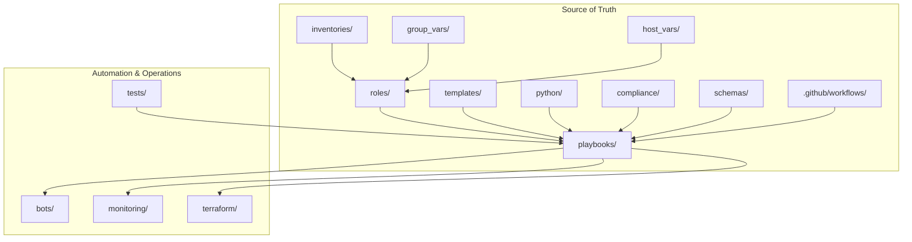
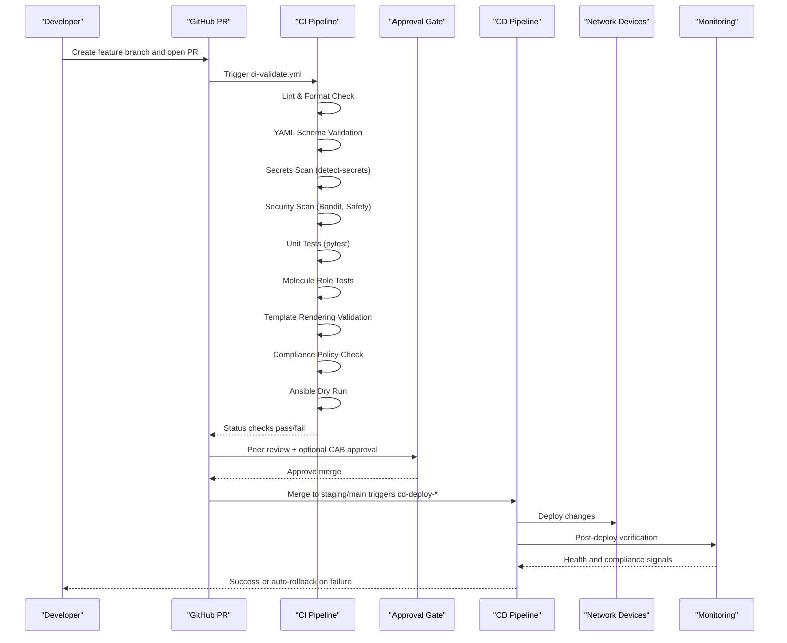
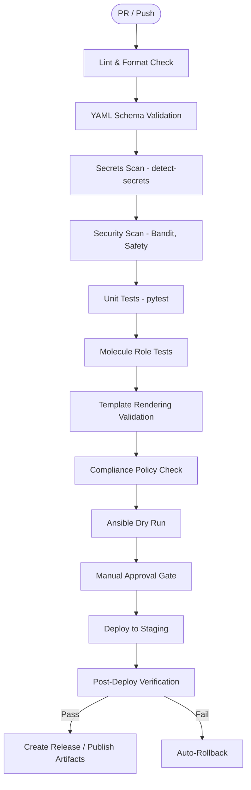
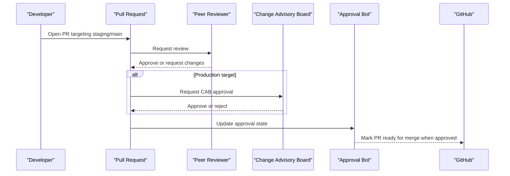
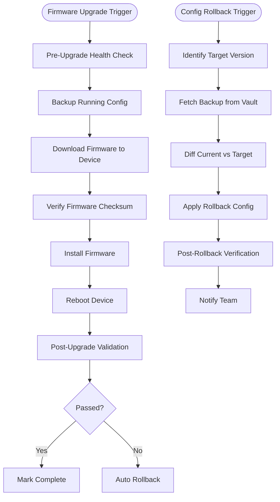
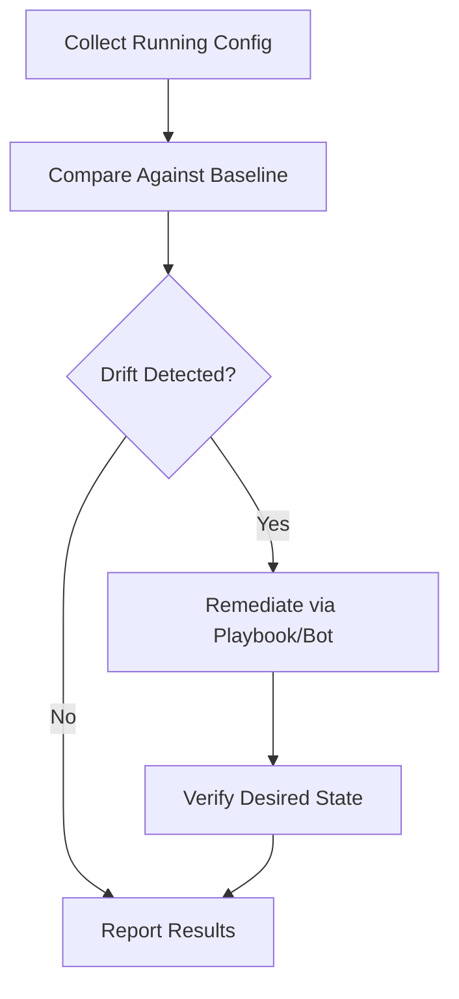
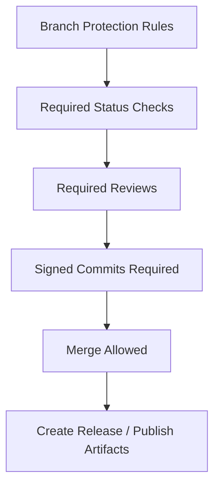
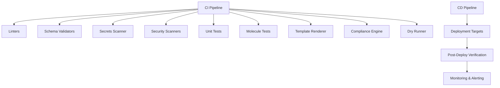

# GitOps Workflow Architecture

<cite>
**Referenced Files in This Document**
- [README.md](file://README.md)
</cite>

## Table of Contents
1. [Introduction](#introduction)
2. [Project Structure](#project-structure)
3. [Core Components](#core-components)
4. [Architecture Overview](#architecture-overview)
5. [Detailed Component Analysis](#detailed-component-analysis)
6. [Dependency Analysis](#dependency-analysis)
7. [Performance Considerations](#performance-considerations)
8. [Troubleshooting Guide](#troubleshooting-guide)
9. [Conclusion](#conclusion)

## Introduction
This document describes the end-to-end GitOps workflow and CI/CD pipeline design for an enterprise network automation platform. It covers change management from pull request creation through automated validation, approval gates, deployment, and post-deploy verification. It also documents GitHub Actions orchestration (linting, schema validation, security scanning, unit tests, Molecule role tests, template rendering validation, compliance checks, and dry runs), the approval architecture with peer review and CAB integration, rollback mechanisms, drift detection, reconciliation processes, branch protection strategies, signed commits, and release management procedures.

## Project Structure
The repository is organized to support a full GitOps lifecycle:
- Configuration and templates under inventories, group_vars, host_vars, roles, playbooks, and vendor-specific templates
- Automation modules under python/ for config generation, validation, backup, compliance, and utilities
- Bots exposing APIs and ChatOps integrations for self-service operations
- Tests covering unit, integration, Molecule, Batfish, pyATS, and golden configuration comparisons
- Compliance policies, schemas, monitoring, Terraform IaC, and GitHub Actions workflows

**Diagram sources**
- [README.md:103-180](file://README.md#L103-L180)

**Section sources**
- [README.md:103-180](file://README.md#L103-L180)

## Core Components
- Pull Request-driven GitOps flow that triggers comprehensive validation and approvals before deployment
- Automated CI stages including linting, YAML schema validation, secrets scanning, security scanning, unit tests, Molecule role tests, template rendering validation, compliance checks, and Ansible dry runs
- Manual approval gate integrating peer review and optional Change Advisory Board (CAB) for production changes
- Post-deploy verification with automated rollback on failure
- Drift detection and reconciliation via dedicated playbooks and bots
- Secrets management integrated with Vault, cloud secret managers, and OIDC federation for ephemeral credentials
- Monitoring and alerting to observe health, compliance, and automation metrics

**Section sources**
- [README.md:34-50](file://README.md#L34-L50)
- [README.md:479-514](file://README.md#L479-L514)
- [README.md:619-638](file://README.md#L619-L638)
- [README.md:339-368](file://README.md#L339-L368)
- [README.md:583-616](file://README.md#L583-L616)

## Architecture Overview
End-to-end GitOps flow from developer change to verified deployment and observability:

**Diagram sources**
- [README.md:479-514](file://README.md#L479-L514)
- [README.md:619-638](file://README.md#L619-L638)

## Detailed Component Analysis

### CI/CD Orchestration
- Workflows are defined under .github/workflows and include:
  - ci-validate.yml: Runs linting, schema validation, secrets scan, security scan, unit tests, Molecule role tests, template rendering validation, compliance checks, and Ansible dry run
  - cd-deploy-staging.yml: Deploys to staging with dry run semantics
  - cd-deploy-production.yml: Deploys to production after required approvals
  - compliance-scan.yml: Scheduled daily compliance audit
  - firmware-upgrade.yml: Manual dispatch for orchestrated upgrades
  - backup-schedule.yml: Daily scheduled backups
  - docs-generate.yml: Documentation regeneration on main merges

**Diagram sources**
- [README.md:479-514](file://README.md#L479-L514)

**Section sources**
- [README.md:479-514](file://README.md#L479-L514)

### Approval Workflow Architecture
- Peer review is mandatory; production deployments require additional CAB approval
- The approval bot exposes endpoints to manage approval workflows and integrates with Slack/Teams for notifications and approvals
- Branch protection enforces status checks and required reviews prior to merging

**Diagram sources**
- [README.md:460-476](file://README.md#L460-L476)
- [README.md:619-638](file://README.md#L619-L638)

**Section sources**
- [README.md:460-476](file://README.md#L460-L476)
- [README.md:619-638](file://README.md#L619-L638)

### Rollback Mechanisms
- Firmware upgrade includes pre-checks, backups, checksum verification, installation, reboot, and post-validation with automatic rollback on failure
- Configuration rollback identifies target version, fetches backup from secrets backend, diffs current vs target, applies rollback, verifies, and notifies stakeholders

**Diagram sources**
- [README.md:642-670](file://README.md#L642-L670)

**Section sources**
- [README.md:642-670](file://README.md#L642-L670)

### Drift Detection and Reconciliation
- Drift detection compares running configurations against baselines and reports deviations
- Golden configuration tests ensure no unintended changes and maintain compliance over time
- Reconciliation can be driven by playbooks and bots to restore desired state based on the source of truth

**Diagram sources**
- [README.md:418-435](file://README.md#L418-L435)
- [README.md:517-544](file://README.md#L517-L544)

**Section sources**
- [README.md:418-435](file://README.md#L418-L435)
- [README.md:517-544](file://README.md#L517-L544)

### Branch Protection, Signed Commits, and Release Management
- Branch protection ensures required status checks and reviews before merging
- Signed commits are enforced to guarantee authorship integrity
- Release management is triggered by successful post-deploy verification and documentation generation, producing artifacts for traceability

**Diagram sources**
- [README.md:619-638](file://README.md#L619-L638)
- [README.md:479-514](file://README.md#L479-L514)

**Section sources**
- [README.md:619-638](file://README.md#L619-L638)
- [README.md:479-514](file://README.md#L479-L514)

## Dependency Analysis
The CI/CD pipeline orchestrates multiple tools and services:
- Linting and formatting tools validate code quality
- Schema validators enforce structure of inventories and variables
- Secrets scanners prevent credential leakage
- Security scanners analyze Python code and dependencies
- Unit and role tests verify logic and idempotence
- Template rendering validates Jinja2 outputs
- Compliance checks enforce policy adherence
- Dry runs simulate changes without applying them
- Deployment targets environments with post-deploy verification
- Monitoring systems collect telemetry and drive alerts

**Diagram sources**
- [README.md:479-514](file://README.md#L479-L514)
- [README.md:583-616](file://README.md#L583-L616)

**Section sources**
- [README.md:479-514](file://README.md#L479-L514)
- [README.md:583-616](file://README.md#L583-L616)

## Performance Considerations
- Parallelize independent CI jobs where possible to reduce pipeline duration
- Cache dependencies for Python, Ansible collections, and Docker images used by Molecule
- Limit scope of tests and scans to changed files using path filters
- Use incremental compliance checks and targeted device sets for large fleets
- Optimize template rendering by minimizing variable lookups and leveraging caching
- Schedule heavy tasks (full compliance audits, backups) during off-peak hours

[No sources needed since this section provides general guidance]

## Troubleshooting Guide
Common issues and resolutions:
- Ansible connection timeout: Verify SSH reachability and inventory connectivity
- Template rendering error: Inspect Jinja2 syntax and debug output
- Compliance check failure: Review policy definitions and device running config diffs
- CI pipeline failure: Examine GitHub Actions logs for actionable errors
- Vault authentication failure: Validate OIDC tokens or AppRole credentials and policies
- Molecule test failure: Ensure container runtime availability and inspect molecule configuration
- Batfish analysis error: Validate snapshots and model consistency

**Section sources**
- [README.md:674-685](file://README.md#L674-L685)

## Conclusion
The GitOps workflow integrates robust validation, secure handling of secrets, strict compliance enforcement, and controlled approvals to ensure safe and repeatable deployments. Automated rollback and drift detection provide resilience, while monitoring and observability deliver continuous assurance. Branch protection, signed commits, and structured release management complete the governance model required for enterprise-scale network automation.

[No sources needed since this section summarizes without analyzing specific files]