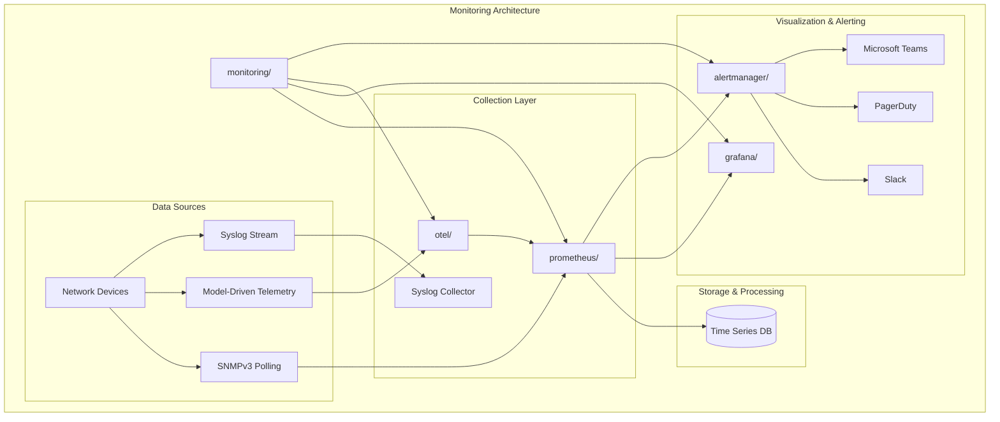
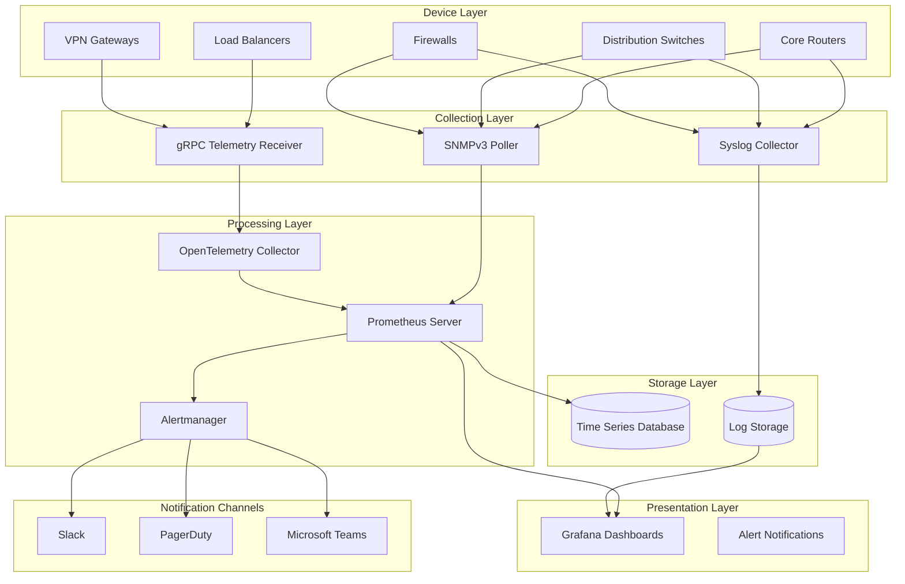
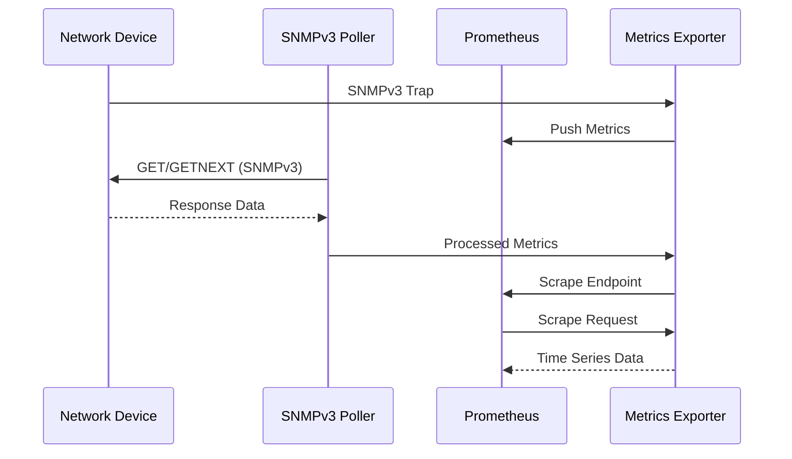
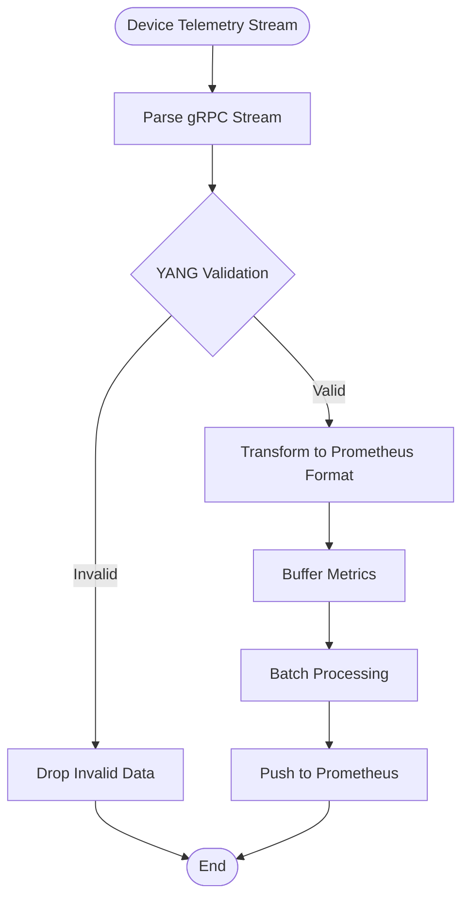
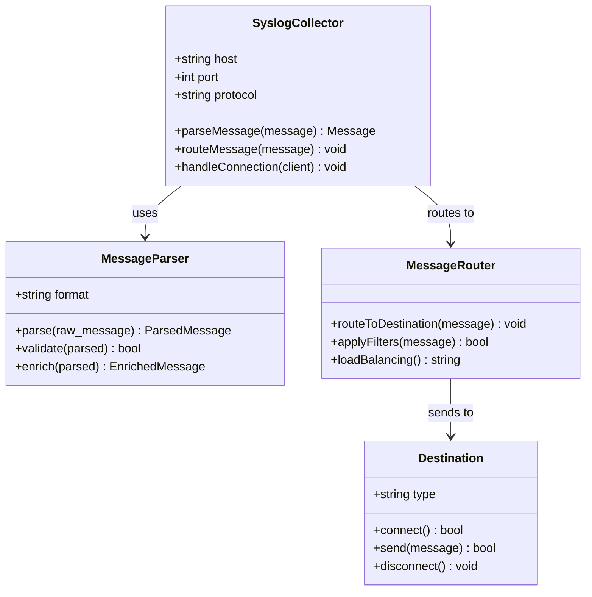
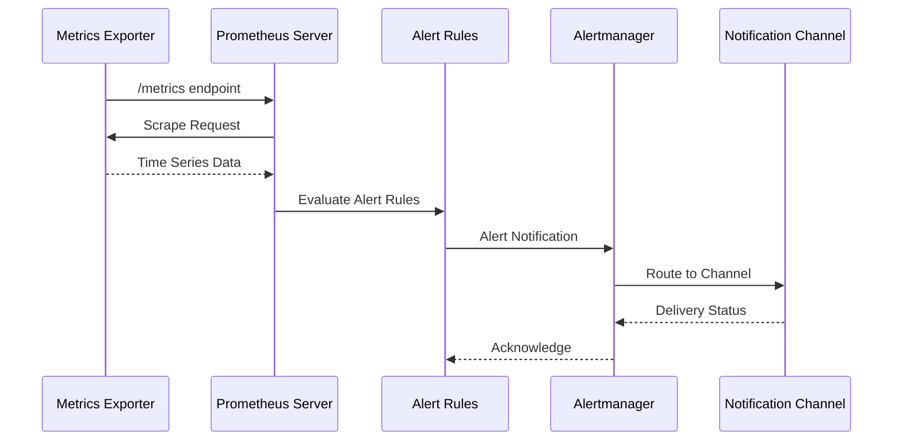
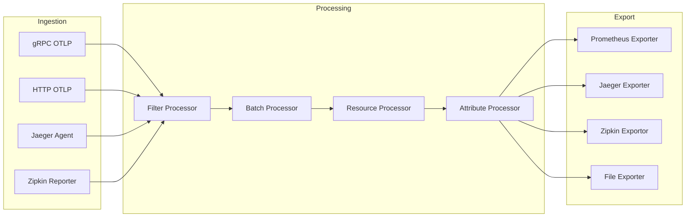
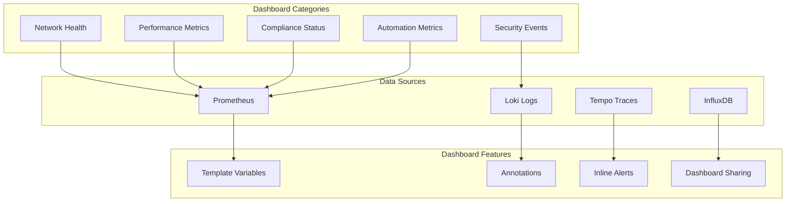
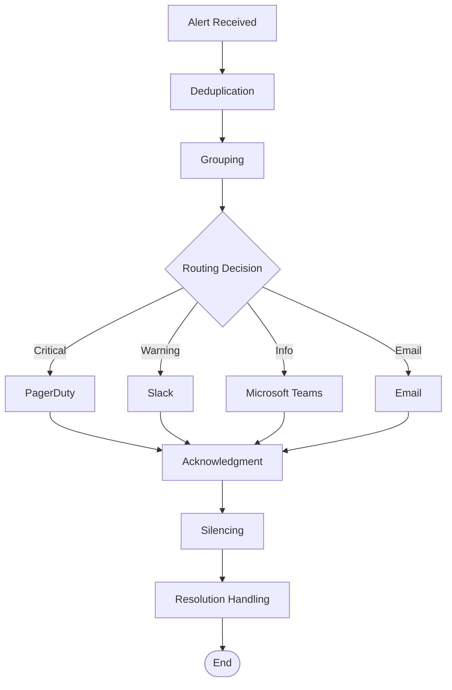
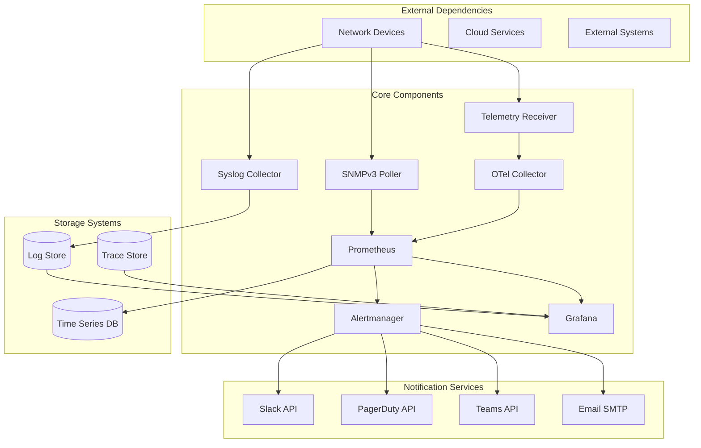

# Observability Layer

<cite>
**Referenced Files in This Document**
- [README.md](file://README.md)
</cite>

## Table of Contents
1. [Introduction](#introduction)
2. [Project Structure](#project-structure)
3. [Core Components](#core-components)
4. [Architecture Overview](#architecture-overview)
5. [Detailed Component Analysis](#detailed-component-analysis)
6. [Dependency Analysis](#dependency-analysis)
7. [Performance Considerations](#performance-considerations)
8. [Troubleshooting Guide](#troubleshooting-guide)
9. [Conclusion](#conclusion)

## Introduction

This document provides comprehensive architectural documentation for the observability and monitoring layer of the Enterprise Network Automation Platform. The platform implements a production-grade, multi-source telemetry collection architecture designed to monitor thousands of network devices across multi-vendor, multi-region environments. The observability layer supports SNMPv3 polling, model-driven telemetry via gRPC, syslog streaming, Prometheus metrics collection, OpenTelemetry integration, Grafana visualization, and multi-channel alerting through Alertmanager.

The monitoring system is built as "Monitoring as Code" where all configurations, dashboards, and alerting rules are stored in Git, ensuring version control, reproducibility, and automated deployment of monitoring infrastructure alongside network automation workflows.

## Project Structure

The observability layer is organized under the `monitoring/` directory structure with dedicated components for each monitoring technology:

**Diagram sources**
- [README.md:587-604](file://README.md#L587-L604)

**Section sources**
- [README.md:103-180](file://README.md#L103-L180)

## Core Components

The observability layer consists of several core components that work together to provide comprehensive network monitoring:

### Multi-Source Telemetry Collection

The platform supports three primary telemetry collection methods:

1. **SNMPv3 Polling**: Secure SNMP polling for traditional network device metrics
2. **Model-Driven Telemetry**: High-frequency streaming telemetry via gRPC using YANG models
3. **Syslog Streaming**: Real-time log aggregation from network devices

### Metrics Pipeline

The Prometheus-based metrics pipeline handles time-series data collection, storage, and querying:

- **Prometheus Server**: Primary metrics storage and query engine
- **Exporters**: Custom exporters for network-specific metrics
- **Service Discovery**: Automated discovery of network devices and endpoints

### Visualization Layer

Grafana provides unified dashboards for monitoring network health, automation performance, and compliance status.

### Alerting System

Alertmanager manages alert routing, deduplication, and notification delivery across multiple channels including Slack, PagerDuty, and Microsoft Teams.

**Section sources**
- [README.md:583-616](file://README.md#L583-L616)

## Architecture Overview

The observability architecture follows a layered approach with clear separation of concerns between data collection, processing, storage, and presentation layers.

**Diagram sources**
- [README.md:587-604](file://README.md#L587-L604)

## Detailed Component Analysis

### SNMPv3 Polling Architecture

The SNMPv3 polling component provides secure, authenticated metric collection from legacy and traditional network devices.

**Diagram sources**
- [README.md:587-604](file://README.md#L587-L604)

Key features include:
- Authentication and encryption support via SNMPv3
- Configurable polling intervals per device group
- Metric filtering and transformation
- Error handling and retry logic
- Device capability discovery

### Model-Driven Telemetry via gRPC

High-frequency telemetry collection using gRPC streams with YANG model definitions:

**Diagram sources**
- [README.md:587-604](file://README.md#L587-L604)

Implementation characteristics:
- Support for Cisco IOS-XE, Juniper MX, and Arista EOS telemetry models
- Dynamic subscription management
- Backpressure handling for high-volume streams
- Schema validation against YANG models
- Automatic reconnection and error recovery

### Syslog Streaming Architecture

Real-time log aggregation and processing from network devices:

**Diagram sources**
- [README.md:587-604](file://README.md#L587-L604)

Features include:
- Multi-format syslog parsing (RFC 3164, RFC 5424)
- Intelligent message routing based on content
- Rate limiting and backpressure
- Structured logging with metadata enrichment
- Integration with centralized log storage

### Prometheus Metrics Pipeline

The Prometheus-based metrics pipeline provides scalable time-series data collection and storage:

**Diagram sources**
- [README.md:587-604](file://README.md#L587-L604)

Pipeline characteristics:
- Horizontal scaling with federation
- Efficient time-series compression
- Advanced query language (PromQL)
- Built-in service discovery
- Comprehensive alerting capabilities

### OpenTelemetry Collector Integration

The OpenTelemetry collector serves as a universal telemetry ingestion point:

**Diagram sources**
- [README.md:587-604](file://README.md#L587-L604)

Integration benefits:
- Vendor-neutral telemetry standard
- Flexible processing pipeline
- Multiple export formats
- Built-in observability
- Community ecosystem support

### Grafana Dashboard Architecture

Unified visualization layer providing comprehensive network monitoring dashboards:

**Diagram sources**
- [README.md:606-616](file://README.md#L606-L616)

Dashboard categories include:
- **Network Health**: Device availability, interface status, resource utilization
- **Automation Metrics**: Job success rates, execution times, drift detection
- **Compliance Overview**: Policy violations, security posture, audit trails
- **Upgrade Tracker**: Firmware versions, upgrade progress, rollback status
- **API Performance**: Bot endpoint latency, error rates, throughput metrics

### Alertmanager Configuration

Multi-channel alerting system with intelligent routing and notification management:

**Diagram sources**
- [README.md:587-604](file://README.md#L587-L604)

Alerting strategies include:
- Severity-based routing (Critical, Warning, Info)
- Multi-channel notifications (Slack, PagerDuty, Teams)
- Alert deduplication and grouping
- Silencing and maintenance windows
- Escalation policies and on-call rotation

**Section sources**
- [README.md:583-616](file://README.md#L583-L616)

## Dependency Analysis

The observability layer has well-defined dependencies between components with clear interfaces and contracts:

**Diagram sources**
- [README.md:587-604](file://README.md#L587-L604)

Key dependency relationships:
- **Low Coupling**: Each collector operates independently with standardized output formats
- **Horizontal Scalability**: Components can be scaled independently based on load
- **Graceful Degradation**: Failure in one component doesn't cascade to others
- **Configuration Driven**: All behavior controlled through configuration files
- **Health Monitoring**: Built-in health checks and readiness probes

**Section sources**
- [README.md:583-616](file://README.md#L583-L616)

## Performance Considerations

The observability layer is designed for high-volume telemetry processing and scalable metric storage:

### High-Volume Telemetry Processing

- **Batch Processing**: Metrics are batched before pushing to Prometheus to reduce overhead
- **Backpressure Handling**: Collectors implement flow control to prevent overwhelming downstream systems
- **Connection Pooling**: Reuse connections to network devices and collectors
- **Memory Management**: Efficient memory usage through object pooling and garbage collection tuning
- **CPU Optimization**: Parallel processing with configurable worker pools

### Scalable Metric Storage

- **Prometheus Federation**: Distribute metrics collection across multiple Prometheus instances
- **Retention Policies**: Configurable retention periods based on data importance
- **Compression**: Efficient time-series compression for long-term storage
- **Sharding**: Horizontal scaling through data sharding across multiple nodes
- **Caching**: Query result caching for frequently accessed metrics

### Network Device Scaling

- **Polling Intervals**: Adaptive polling intervals based on device criticality
- **Connection Limits**: Per-device connection limits to prevent resource exhaustion
- **Timeout Configuration**: Tunable timeouts for different device types and operations
- **Retry Logic**: Exponential backoff with jitter for failed requests
- **Circuit Breakers**: Prevent cascading failures when devices become unresponsive

### Monitoring Infrastructure Scaling

- **Container Orchestration**: Kubernetes-based deployment with auto-scaling
- **Load Distribution**: Load balancing across multiple collector instances
- **Resource Monitoring**: Self-monitoring of monitoring infrastructure
- **Capacity Planning**: Automated capacity planning based on growth trends
- **Disaster Recovery**: Multi-region deployment with failover capabilities

## Troubleshooting Guide

Common issues and resolution strategies for the observability layer:

### Connection Issues

| Issue | Symptoms | Resolution |
|-------|----------|------------|
| SNMPv3 Authentication Failure | Timeout errors, authentication failures | Verify SNMPv3 credentials, check user permissions, validate encryption settings |
| gRPC Connection Refused | Connection refused errors, timeout | Check firewall rules, verify gRPC port availability, validate TLS certificates |
| Syslog Port Conflict | Port already in use, binding errors | Change port configuration, resolve conflicts with other services |

### Performance Issues

| Issue | Symptoms | Resolution |
|-------|----------|------------|
| High CPU Usage | CPU saturation, slow response times | Optimize polling intervals, increase worker threads, tune GC settings |
| Memory Leaks | Gradual memory increase, OOM kills | Profile memory usage, fix resource leaks, implement proper cleanup |
| Disk Space Exhaustion | Disk full errors, write failures | Configure retention policies, implement log rotation, expand storage |

### Alerting Issues

| Issue | Symptoms | Resolution |
|-------|----------|------------|
| Alert Storms | Excessive notifications, notification fatigue | Implement alert grouping, deduplication, and silencing |
| Missed Alerts | No notifications for critical events | Verify alert routing rules, check notification channel connectivity |
| False Positives | Non-critical events triggering alerts | Tune alert thresholds, add correlation rules, improve alert conditions |

### Data Quality Issues

| Issue | Symptoms | Resolution |
|-------|----------|------------|
| Missing Metrics | Gaps in time series data | Check exporter health, verify scraping configuration, monitor network connectivity |
| Incorrect Values | Outlier values, negative numbers | Add data validation, implement anomaly detection, configure value ranges |
| Duplicate Data | Duplicate time series, inflated counts | Implement deduplication, check for multiple scrapers, verify unique labels |

## Conclusion

The observability layer of the Enterprise Network Automation Platform provides a comprehensive, scalable, and resilient monitoring solution for large-scale network environments. The multi-source telemetry collection architecture supports diverse device types and protocols while maintaining high performance and reliability.

Key strengths of the implementation include:

- **Multi-Protocol Support**: Seamless integration with SNMPv3, gRPC telemetry, and syslog
- **Scalable Architecture**: Horizontal scaling capabilities for high-volume telemetry processing
- **Unified Visualization**: Centralized dashboards providing comprehensive network visibility
- **Intelligent Alerting**: Multi-channel notification system with sophisticated routing and deduplication
- **GitOps Integration**: All monitoring configurations managed as code with version control
- **Production Ready**: Designed for enterprise-scale deployments with high availability requirements

The architecture successfully addresses the challenges of modern network monitoring by providing flexible data collection, efficient processing pipelines, and actionable insights through comprehensive visualization and alerting capabilities. The modular design ensures maintainability and extensibility for future monitoring requirements.