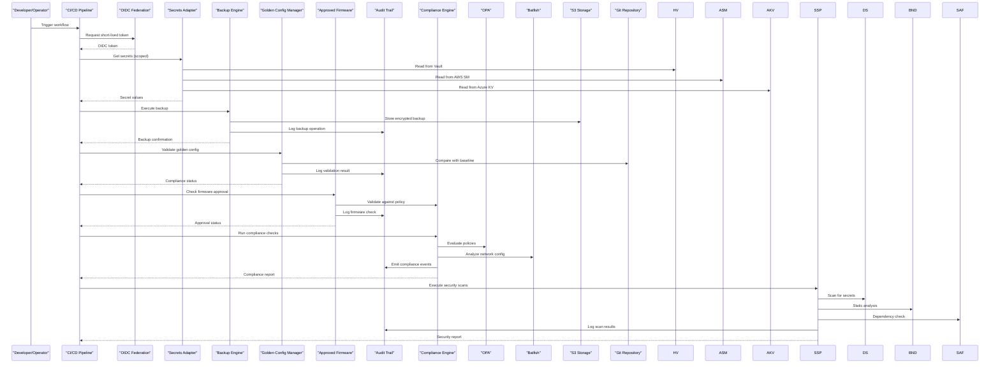
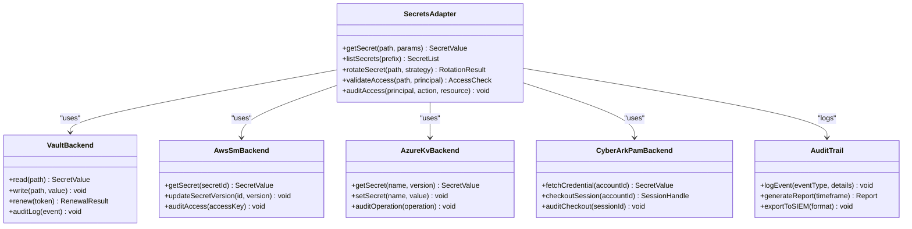
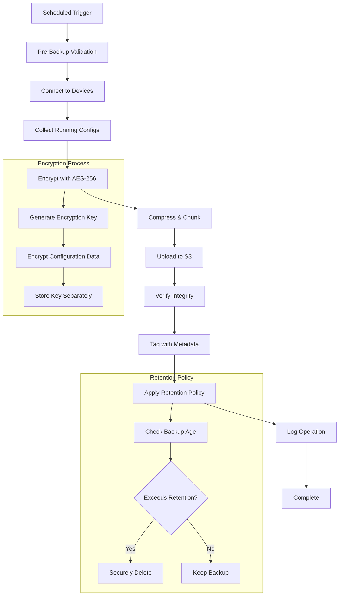
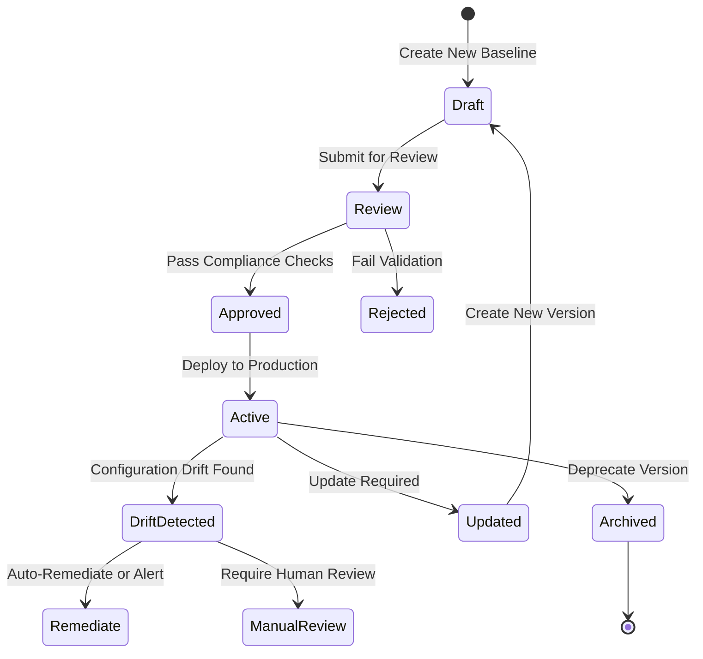
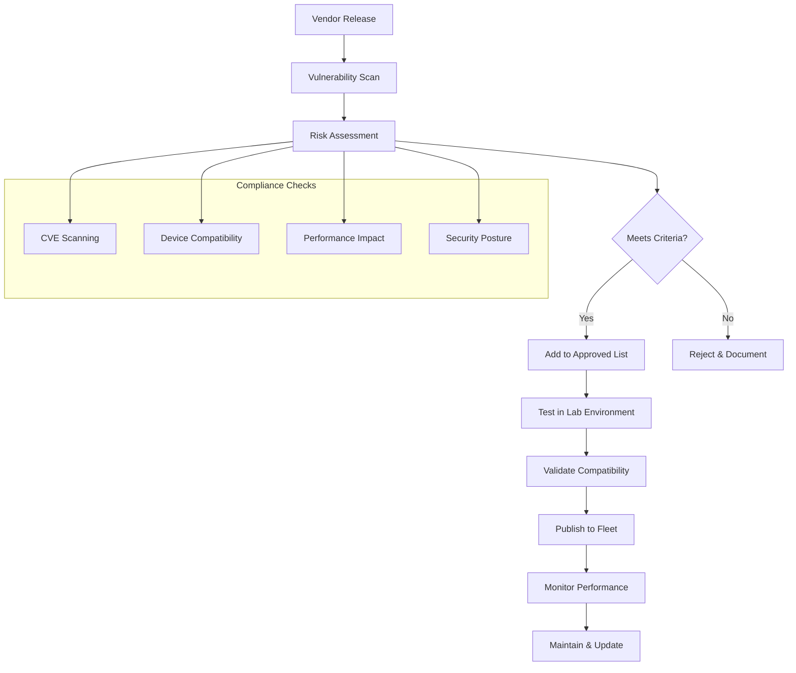
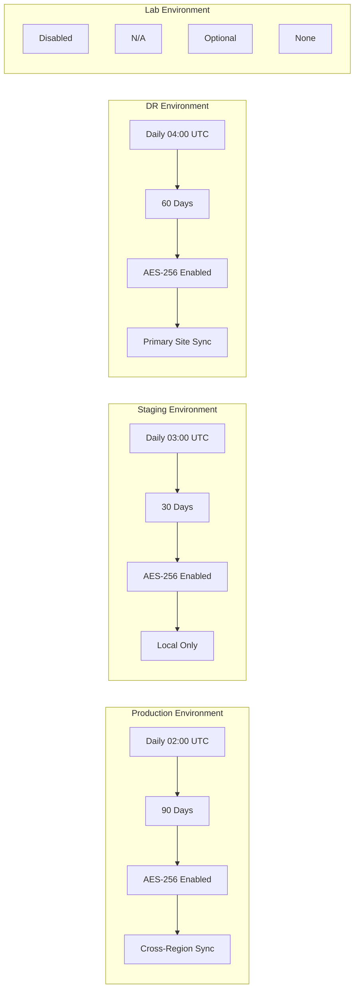
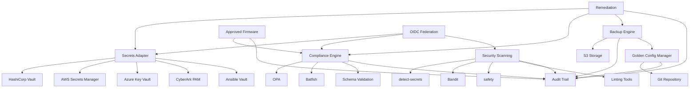

# Security & Compliance Architecture

<cite>
**Referenced Files in This Document**
- [README.md](file://README.md)
- [group_vars.json](file://schemas/group_vars.json)
- [all.yml](file://group_vars/all.yml)
- [production_hosts.yml](file://inventories/production/hosts.yml)
- [staging_hosts.yml](file://inventories/staging/hosts.yml)
- [dr_hosts.yml](file://inventories/dr/hosts.yml)
</cite>

## Update Summary
**Changes Made**
- Enhanced backup architecture with encrypted S3 storage and retention policies
- Added golden configuration versioning system for baseline management
- Implemented approved firmware lists for compliance enforcement
- Expanded multi-backend secrets management support (HashiCorp Vault, AWS Secrets Manager, Azure Key Vault)
- Strengthened audit trail capabilities across all security operations

## Table of Contents
1. [Introduction](#introduction)
2. [Project Structure](#project-structure)
3. [Core Components](#core-components)
4. [Architecture Overview](#architecture-overview)
5. [Detailed Component Analysis](#detailed-component-analysis)
6. [Dependency Analysis](#dependency-analysis)
7. [Performance Considerations](#performance-considerations)
8. [Troubleshooting Guide](#troubleshooting-guide)
9. [Conclusion](#conclusion)
10. [Appendices](#appendices)

## Introduction
This document describes the enhanced security and compliance architecture for a production-grade network automation platform. The architecture now includes comprehensive backup encryption, golden configuration management, approved firmware validation, and multi-provider secrets management through a unified adapter layer. It focuses on:
- A multi-backend secrets management system supporting HashiCorp Vault, AWS Secrets Manager, Azure Key Vault, and CyberArk PAM through a unified adapter layer.
- Enhanced backup infrastructure with encrypted S3 storage, configurable retention policies, and automated scheduling.
- Golden configuration versioning system for baseline management and drift detection.
- Approved firmware lists for compliance enforcement and vulnerability management.
- Comprehensive audit trails covering all security-relevant operations.
- Pluggable compliance engine integrating Open Policy Agent (OPA) and Batfish-based network analysis.
- Certificate lifecycle management and automated remediation workflows.
- Integration with security scanning tools including detect-secrets, Bandit, and safety checks.
- Secret rotation policies, OIDC federation for CI/CD, and zero-trust networking principles.

The goal is to provide a clear, layered view of how these components interact to enforce least privilege, continuous compliance, and secure operations across heterogeneous environments.

## Project Structure
The repository implements a comprehensive security and compliance framework with enhanced backup, configuration management, and secrets handling capabilities.

```mermaid
graph TB
subgraph "Security & Compliance Core"
SA["Secrets Adapter Layer"]
BE["Backup Engine"]
GC["Golden Config Manager"]
AF["Approved Firmware List"]
AT["Audit Trail System"]
CE["Compliance Engine"]
CLM["Certificate Lifecycle Manager"]
ARW["Automated Remediation"]
SSP["Security Scanning Pipeline"]
end
subgraph "Secret Backends"
HV["HashiCorp Vault"]
ASM["AWS Secrets Manager"]
AKV["Azure Key Vault"]
CAPAM["CyberArk PAM"]
AV["Ansible Vault"]
EV["Environment Variables"]
end
subgraph "Storage & Backup"
S3["S3 Encrypted Storage"]
Git["Git Repository"]
DB["State Database"]
CMDB["CMDB/NetBox"]
end
subgraph "Policy & Analysis"
OPA["Open Policy Agent (OPA)"]
BF["Batfish Network Analysis"]
SC["Schema Validation"]
end
subgraph "CI/CD & Identity"
OIDC["OIDC Federation"]
SCM["SCM/Git Provider"]
Pipeline["CI/CD Pipeline"]
end
subgraph "Scanners"
DS["detect-secrets"]
BND["Bandit"]
SAF["safety"]
LINT["ansible-lint/yamllint"]
end
SA --> HV
SA --> ASM
SA --> AKV
SA --> CAPAM
SA --> AV
SA --> EV
BE --> S3
GC --> Git
AF --> CE
AT --> CE
AT --> SA
AT --> BE
CE --> OPA
CE --> BF
CE --> SC
SSP --> DS
SSP --> BND
SSP --> SAF
SSP --> LINT
ARW --> SA
ARW --> CE
ARW --> BE
OIDC --> SA
OIDC --> CE
OIDC --> SSP
SCM --> SSP
Pipeline --> OIDC
```



**Diagram sources**
- [README.md:396-427](file://README.md#L396-L427)
- [all.yml:154-172](file://group_vars/all.yml#L154-L172)

## Core Components

### Multi-Backend Secrets Management
Enhanced secrets management system providing unified access to multiple providers with advanced security features:
- **Unified Adapter Layer**: Single interface abstracting backend-specific authentication, pathing, and access control semantics
- **Multi-Provider Support**: HashiCorp Vault, AWS Secrets Manager, Azure Key Vault, CyberArk PAM, Ansible Vault, Environment Variables
- **Dynamic Credential Retrieval**: Real-time secret fetching with caching and rotation hooks
- **OIDC Federation**: Short-lived, scoped credentials for CI/CD pipelines without long-lived tokens
- **Rotation Policies**: Automated rotation based on secret type and security requirements

### Enhanced Backup Infrastructure
Comprehensive backup system with enterprise-grade security and retention management:
- **Encrypted S3 Storage**: AES-256 encryption for all backup data at rest
- **Configurable Retention Policies**: Per-environment retention periods (30-90 days)
- **Automated Scheduling**: Cron-based backup execution with environment-specific timing
- **Version Control Integration**: Git-backed backup tracking and recovery
- **Disaster Recovery Support**: Cross-region backup replication and failover capabilities

### Golden Configuration Versioning
Baseline management system ensuring configuration consistency and compliance:
- **Version Control**: Semantic versioning for configuration baselines (e.g., "2.1.0")
- **Drift Detection**: Automated comparison between running configs and approved baselines
- **Change Tracking**: Audit trail for all configuration modifications
- **Rollback Capabilities**: One-click restoration to previous versions
- **Compliance Enforcement**: Mandatory adherence to approved configuration standards

### Approved Firmware Management
Centralized firmware compliance and vulnerability management:
- **Vendor-Specific Lists**: Curated list of approved firmware versions per vendor/platform
- **Vulnerability Scanning**: Integration with CVE databases for security assessment
- **Upgrade Orchestration**: Automated upgrade workflows with pre/post validation
- **Rollback Automation**: Instant rollback to last known good firmware version
- **Compliance Reporting**: Audit reports for firmware compliance status

### Comprehensive Audit Trail
Immutable logging system capturing all security-relevant operations:
- **Event Correlation**: Cross-system event correlation via standardized schemas
- **Tamper-Evident Storage**: Cryptographic hashing for audit log integrity
- **Real-Time Monitoring**: Live dashboards for security event visualization
- **Retention Policies**: Configurable audit log retention periods
- **Export Capabilities**: Standardized formats for SIEM integration

**Section sources**
- [README.md:396-427](file://README.md#L396-L427)
- [all.yml:154-172](file://group_vars/all.yml#L154-L172)
- [group_vars.json:196-212](file://schemas/group_vars.json#L196-L212)

## Architecture Overview
The enhanced architecture follows a layered design with improved security controls and operational resilience:



**Diagram sources**
- [README.md:396-427](file://README.md#L396-L427)
- [all.yml:154-172](file://group_vars/all.yml#L154-L172)

## Detailed Component Analysis

### Enhanced Secrets Adapter
The adapter provides unified access to multiple secret backends with advanced security features:



**Updated** Enhanced with comprehensive audit logging and cross-backend security monitoring

**Diagram sources**
- [README.md:396-427](file://README.md#L396-L427)

**Section sources**
- [README.md:396-427](file://README.md#L396-L427)

### Backup Engine Architecture
Enterprise-grade backup system with encryption and retention management:



**Updated** Added comprehensive encryption, retention policies, and integrity verification

**Diagram sources**
- [all.yml:154-160](file://group_vars/all.yml#L154-L160)
- [group_vars.json:203-212](file://schemas/group_vars.json#L203-L212)

**Section sources**
- [all.yml:154-160](file://group_vars/all.yml#L154-L160)
- [group_vars.json:203-212](file://schemas/group_vars.json#L203-L212)

### Golden Configuration Management
Version-controlled baseline management system:



**Updated** Enhanced with drift detection, automated remediation, and comprehensive version control

**Diagram sources**
- [all.yml:162-172](file://group_vars/all.yml#L162-L172)
- [group_vars.json:196-198](file://schemas/group_vars.json#L196-L198)

**Section sources**
- [all.yml:162-172](file://group_vars/all.yml#L162-L172)
- [group_vars.json:196-198](file://schemas/group_vars.json#L196-L198)

### Approved Firmware Management
Centralized firmware compliance and vulnerability management:



**Updated** Integrated vulnerability scanning, compatibility testing, and performance monitoring

**Diagram sources**
- [all.yml:164-172](file://group_vars/all.yml#L164-L172)
- [group_vars.json:199-202](file://schemas/group_vars.json#L199-L202)

**Section sources**
- [all.yml:164-172](file://group_vars/all.yml#L164-L172)
- [group_vars.json:199-202](file://schemas/group_vars.json#L199-L202)

### Comprehensive Audit Trail
Immutable logging system with cross-system correlation:

```mermaid
sequenceDiagram
participant Actor as "Actor/System"
participant Service as "Service Layer"
participant Validator as "Validation Engine"
participant Auditor as "Audit Logger"
participant Storage as "Immutable Storage"
participant SIEM as "SIEM Integration"
Actor->>Service : Perform Action
Service->>Validator : Validate Permissions
Validator-->>Service : Authorization Result
Service->>Auditor : Emit Event
Auditor->>Storage : Append Immutable Record
Auditor->>SIEM : Forward Critical Events
Service-->>Actor : Action Result
Note over Storage,Auditor : All events include :
- Timestamp (UTC)
- Actor identity
- Action performed
- Resource accessed
- Outcome
- Correlation ID
```

**Updated** Enhanced with SIEM integration, correlation IDs, and comprehensive event schemas

**Diagram sources**
- [README.md:396-427](file://README.md#L396-L427)

**Section sources**
- [README.md:396-427](file://README.md#L396-L427)

### Multi-Environment Backup Configuration
Environment-specific backup policies and retention settings:



**Updated** Added environment-specific configurations with different retention and replication policies

**Diagram sources**
- [production_hosts.yml:13-16](file://inventories/production/hosts.yml#L13-L16)
- [staging_hosts.yml:10-13](file://inventories/staging/hosts.yml#L10-L13)
- [dr_hosts.yml:13-16](file://inventories/dr/hosts.yml#L13-L16)

**Section sources**
- [production_hosts.yml:13-16](file://inventories/production/hosts.yml#L13-L16)
- [staging_hosts.yml:10-13](file://inventories/staging/hosts.yml#L10-L13)
- [dr_hosts.yml:13-16](file://inventories/dr/hosts.yml#L13-L16)

## Dependency Analysis
Enhanced dependencies among core security and compliance components:



**Diagram sources**
- [README.md:396-427](file://README.md#L396-L427)
- [all.yml:154-172](file://group_vars/all.yml#L154-L172)

**Section sources**
- [README.md:396-427](file://README.md#L396-L427)
- [all.yml:154-172](file://group_vars/all.yml#L154-L172)

## Performance Considerations
Enhanced performance optimizations for the security and compliance framework:
- **Secrets Caching**: Intelligent caching with appropriate TTLs to reduce backend load while maintaining freshness
- **Backup Optimization**: Parallel backup processing, compression, and incremental updates
- **Audit Trail Efficiency**: Batched event ingestion, efficient indexing, and selective logging
- **Compliance Scanning**: Asynchronous evaluation, parallel policy checks, and result caching
- **Firmware Management**: Concurrent vulnerability scanning, dependency resolution optimization
- **Storage Optimization**: Deduplication, compression, and tiered storage strategies

## Troubleshooting Guide
Enhanced troubleshooting for security and compliance issues:
- **Secrets Backend Authentication**: Verify OIDC tokens, IAM roles, Vault policies; ensure correct paths and permissions
- **Backup Failures**: Check S3 connectivity, encryption keys, retention policies, and storage quotas
- **Golden Config Drift**: Review diff outputs, validate baseline versions, check permission levels
- **Firmware Compliance Issues**: Verify approved lists, check vendor repositories, validate compatibility matrices
- **Audit Trail Gaps**: Ensure correlation IDs propagate across subsystems, verify event emission for all critical paths
- **Compliance Violations**: Review OPA policies, Batfish snapshots, custom compliance rules, and device state
- **Performance Issues**: Monitor cache hit rates, backup throughput, audit log volume, and scanner queue depths

## Conclusion
The enhanced security and compliance architecture delivers a comprehensive, production-ready framework for network automation. With encrypted backups, golden configuration management, approved firmware lists, multi-provider secrets management, and comprehensive audit trails, it ensures secure, compliant, and resilient operations. The unified adapter layer, pluggable compliance engine, and automated remediation workflows enable scalable security enforcement across heterogeneous environments while maintaining operational agility and reducing risk exposure.

## Appendices

### Enhanced Backup Configuration Examples
- **Production**: Daily backups at 02:00 UTC, 90-day retention, AES-256 encryption, cross-region replication
- **Staging**: Daily backups at 03:00 UTC, 30-day retention, full encryption, local-only storage
- **DR**: Daily backups at 04:00 UTC, 60-day retention, encryption enabled, primary site synchronization
- **Lab**: Optional backups with flexible retention and encryption settings

### Golden Configuration Versioning Strategy
- **Semantic Versioning**: Major.minor.patch format for baseline releases
- **Change Documentation**: Detailed changelogs for each version update
- **Rollback Procedures**: Automated rollback to previous stable versions
- **Drift Resolution**: Automated remediation or manual intervention workflows

### Approved Firmware Management Process
- **Vendor Coordination**: Regular communication with vendors for release schedules
- **Testing Framework**: Comprehensive lab testing for compatibility and performance
- **Vulnerability Assessment**: Automated CVE scanning and risk evaluation
- **Deployment Rollout**: Phased deployment with monitoring and rollback capabilities

### Audit Trail Schema Standards
- **Event Types**: Authentication, authorization, configuration changes, backup operations, compliance checks
- **Required Fields**: Timestamp, actor identity, action, resource, outcome, correlation ID
- **Retention Policies**: Configurable retention periods based on regulatory requirements
- **Export Formats**: JSON, CSV, and SIEM-compatible formats for analysis