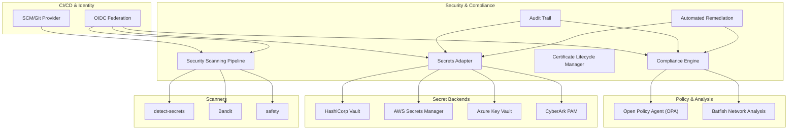
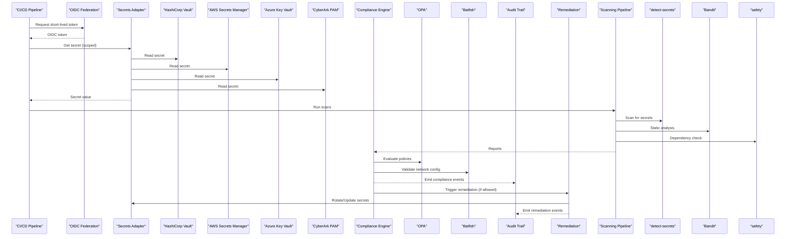
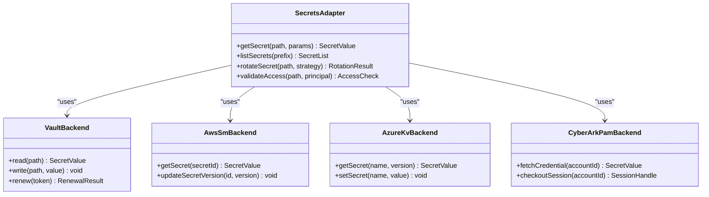
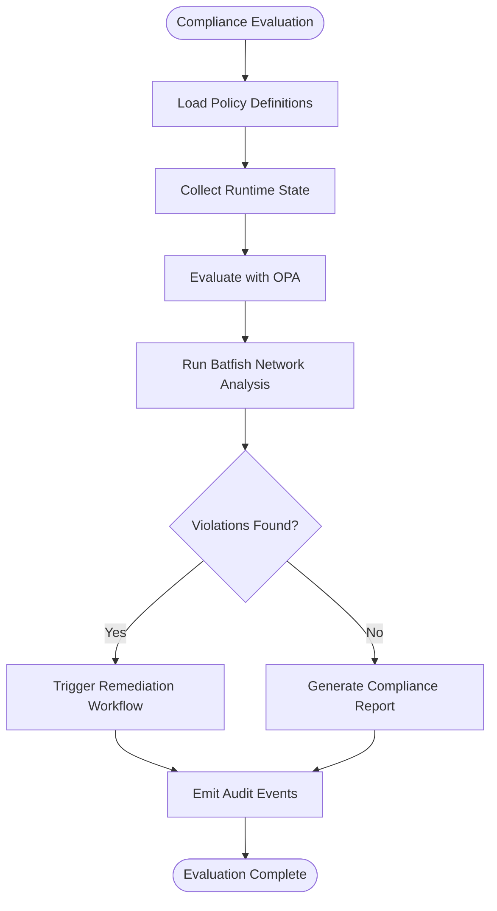
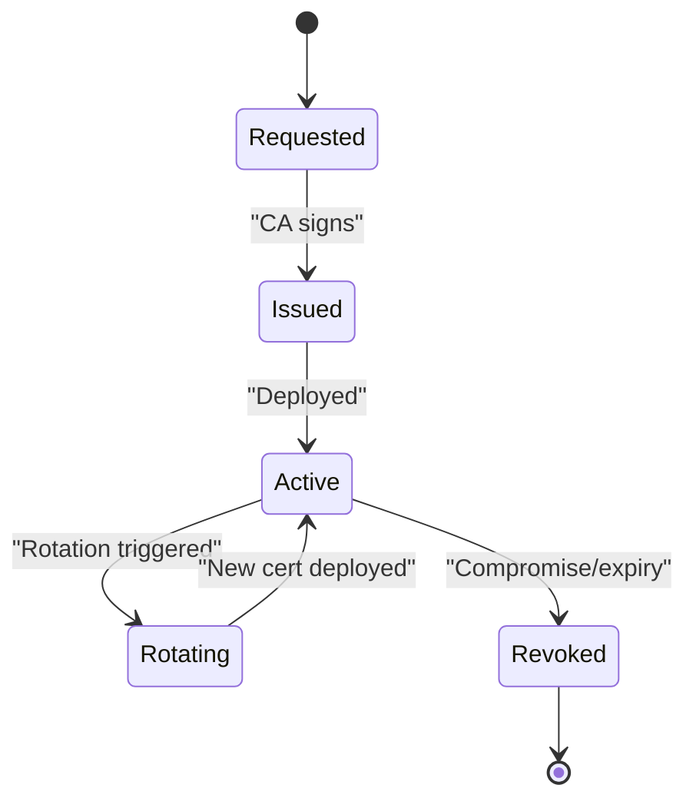
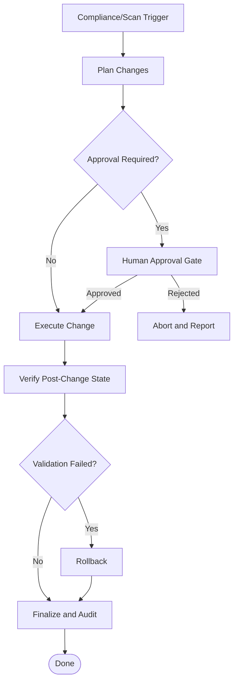
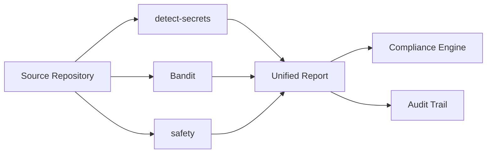
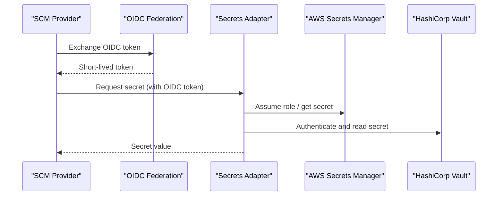
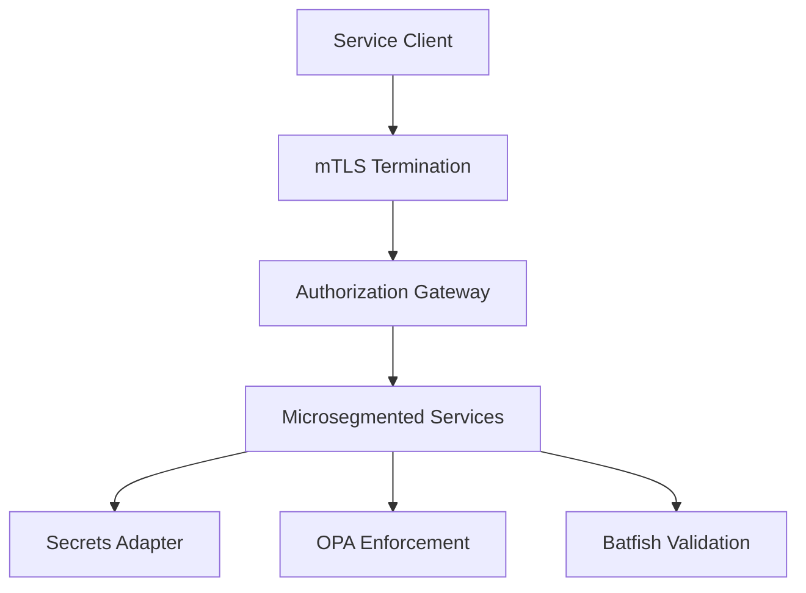
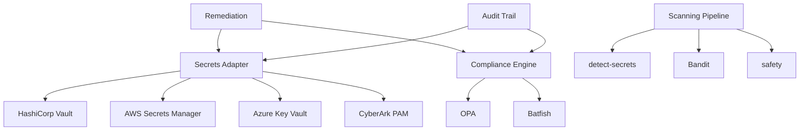

# Security & Compliance Architecture

<cite>
**Referenced Files in This Document**
- [README.md](file://README.md)
</cite>

## Table of Contents
1. [Introduction](#introduction)
2. [Project Structure](#project-structure)
3. [Core Components](#core-components)
4. [Architecture Overview](#architecture-overview)
5. [Detailed Component Analysis](#detailed-component-analysis)
6. [Dependency Analysis](#dependency-analysis)
7. [Performance Considerations](#performance-considerations)
8. [Troubleshooting Guide](#troubleshooting-guide)
9. [Conclusion](#conclusion)
10. [Appendices](#appendices)

## Introduction
This document describes the security and compliance architecture for a network automation platform. It focuses on:
- A multi-backend secrets management system with a unified adapter layer supporting HashiCorp Vault, AWS Secrets Manager, Azure Key Vault, and CyberArk PAM.
- A pluggable compliance engine integrating Open Policy Agent (OPA) and Batfish-based network analysis.
- An audit trail architecture, certificate lifecycle management, and automated remediation workflows.
- Integration with security scanning tools including detect-secrets, Bandit, and safety checks.
- Secret rotation policies, OIDC federation for CI/CD, and zero-trust networking principles.

The goal is to provide a clear, layered view of how these components interact to enforce least privilege, continuous compliance, and secure operations across heterogeneous environments.

## Project Structure
At this time, the repository contains a high-level overview in the README file. The detailed implementation files referenced by this architecture are not present in the current workspace snapshot. Therefore, this section provides a conceptual structure aligned with the stated objectives.



[No sources needed since this diagram shows conceptual workflow, not actual code structure]

## Core Components
- Multi-backend Secrets Adapter
  - Provides a unified interface to multiple secret backends (Vault, AWS Secrets Manager, Azure Key Vault, CyberArk PAM).
  - Abstracts backend-specific authentication, pathing, and access control semantics behind a common API.
  - Supports dynamic credential retrieval, caching, and rotation hooks.

- Pluggable Compliance Engine
  - Evaluates policy definitions against desired state and runtime data.
  - Integrates OPA for policy-as-code enforcement and Batfish for network configuration validation.
  - Exposes results to the audit trail and triggers remediation when configured.

- Audit Trail
  - Records immutable events for secret access, policy evaluations, remediation actions, and scanning outcomes.
  - Supports correlation across systems via standardized event schemas.

- Certificate Lifecycle Manager
  - Manages issuance, renewal, rotation, and revocation of certificates.
  - Coordinates with secret backends and identity providers for secure distribution.

- Automated Remediation
  - Executes safe, reversible changes based on compliance findings or scanning results.
  - Enforces change windows, approvals, and rollback strategies.

- Security Scanning Pipeline
  - Integrates detect-secrets for secret detection, Bandit for Python static analysis, and safety for dependency vulnerability checks.
  - Produces machine-readable reports consumed by the compliance engine and audit trail.

- OIDC Federation for CI/CD
  - Enables short-lived, scoped credentials for pipelines without long-lived tokens.
  - Bridges SCM identities to cloud and vault providers using OIDC.

- Zero-Trust Networking Principles
  - Applies least privilege, explicit verification, and microsegmentation across service-to-service communication.
  - Uses mutual TLS, short-lived tokens, and strict egress controls.

**Section sources**
- [README.md](file://README.md)

## Architecture Overview
The architecture follows a layered design:
- Presentation/Integration Layer: CI/CD pipelines, operators, and automation scripts invoke the adapters and APIs.
- Service Layer: Secrets Adapter, Compliance Engine, Audit Trail, Certificate Lifecycle Manager, and Remediation Orchestrator.
- Policy and Analysis Layer: OPA and Batfish evaluate policies and network configurations.
- Data and Backend Layer: Secret backends, certificate stores, and external scanners.



**Diagram sources**
- [README.md](file://README.md)

## Detailed Component Analysis

### Secrets Adapter
The adapter abstracts multiple secret backends behind a single interface. It normalizes authentication flows, error handling, and response formats.



Key responsibilities:
- Unified read/write interfaces
- Backend selection by routing rules or environment context
- Caching with TTL and invalidation
- Rotation orchestration hooks

**Diagram sources**
- [README.md](file://README.md)

**Section sources**
- [README.md](file://README.md)

### Compliance Engine
The compliance engine evaluates policies and network state, producing actionable insights and audit events.



Capabilities:
- Pluggable policy modules
- OPA integration for declarative policy evaluation
- Batfish integration for network configuration validation
- Event emission to audit trail and dashboards

**Diagram sources**
- [README.md](file://README.md)

**Section sources**
- [README.md](file://README.md)

### Audit Trail
The audit trail records immutable events for all security-relevant actions, enabling traceability and forensics.

```mermaid
sequenceDiagram
participant Actor as "Actor/System"
participant SA as "Secrets Adapter"
participant CE as "Compliance Engine"
participant AT as "Audit Trail"
participant Store as "Immutable Log Store"
Actor->>SA : Access secret
SA-->>Actor : Secret value
SA->>AT : Emit access event
AT->>Store : Append event
CE->>AT : Emit policy evaluation event
AT->>Store : Append event
CE->>AT : Emit remediation event
AT->>Store : Append event
```

Design considerations:
- Standardized event schema
- Tamper-evident storage
- Correlation IDs across subsystems

**Diagram sources**
- [README.md](file://README.md)

**Section sources**
- [README.md](file://README.md)

### Certificate Lifecycle Manager
Manages the full lifecycle of certificates, from issuance to revocation, integrating with secret backends and identity providers.



Responsibilities:
- Coordinate with CA services and secret backends
- Enforce rotation schedules and grace periods
- Notify dependent services and update caches

**Diagram sources**
- [README.md](file://README.md)

**Section sources**
- [README.md](file://README.md)

### Automated Remediation
Executes safe, reversible changes based on compliance findings or scan results.



Safeguards:
- Change windows and rate limiting
- Dry-run and canary phases
- Automatic rollback on validation failure

**Diagram sources**
- [README.md](file://README.md)

**Section sources**
- [README.md](file://README.md)

### Security Scanning Pipeline
Integrates multiple scanners to enforce code and dependency hygiene.



Outputs:
- Machine-readable findings
- Severity classification
- Links to remediation guidance

**Diagram sources**
- [README.md](file://README.md)

**Section sources**
- [README.md](file://README.md)

### OIDC Federation for CI/CD
Enables short-lived, scoped credentials for CI/CD without long-lived tokens.



Benefits:
- Reduced blast radius
- Fine-grained scoping per pipeline/job
- Elimination of long-lived credentials

**Diagram sources**
- [README.md](file://README.md)

**Section sources**
- [README.md](file://README.md)

### Zero-Trust Networking Principles
Applies least privilege, explicit verification, and microsegmentation across service interactions.



Principles:
- Always authenticate and authorize
- Encrypt in transit and at rest
- Least privilege per request
- Continuous verification and monitoring

**Diagram sources**
- [README.md](file://README.md)

**Section sources**
- [README.md](file://README.md)

## Dependency Analysis
Conceptual dependencies among core components:



**Diagram sources**
- [README.md](file://README.md)

**Section sources**
- [README.md](file://README.md)

## Performance Considerations
- Secrets caching with appropriate TTLs to reduce backend load while maintaining freshness.
- Batched policy evaluations and asynchronous scanning to minimize pipeline latency.
- Connection pooling and retry/backoff strategies for external backends.
- Efficient event ingestion and indexing for audit trails.
- Selective scanning scopes to avoid unnecessary work.

[No sources needed since this section provides general guidance]

## Troubleshooting Guide
Common issues and resolutions:
- Authentication failures to secret backends: verify OIDC tokens, IAM roles, and Vault policies; ensure correct paths and permissions.
- Policy evaluation errors: validate OPA policy syntax and input schemas; confirm network snapshots for Batfish are valid.
- Remediation rollbacks: inspect post-change validation logs and revert to last known good state if necessary.
- Scanning false positives: tune scanner thresholds and maintain allowlists where justified.
- Audit gaps: ensure correlation IDs propagate across subsystems and that event emission is enabled for all critical paths.

[No sources needed since this section provides general guidance]

## Conclusion
This architecture delivers a cohesive security and compliance framework for network automation. By unifying secret backends, enforcing policies through OPA and Batfish, recording comprehensive audit trails, managing certificates end-to-end, and integrating robust scanning, it enables secure, compliant, and resilient operations. OIDC federation and zero-trust networking further reduce risk and improve operational agility.

[No sources needed since this section summarizes without analyzing specific files]

## Appendices
- Secret Rotation Policies
  - Frequency: periodic or event-driven (e.g., after compromise).
  - Strategy: blue/green deployment with dual-active keys during transition.
  - Validation: post-rotation verification and automatic rollback on failure.

- Compliance Policy Examples
  - Network segmentation requirements validated by Batfish.
  - Encryption-at-rest and in-transit mandates enforced via OPA.
  - Secret access patterns constrained by least-privilege rules.

- Scanning Configuration Tips
  - Limit scope to changed files in PRs.
  - Use fail-fast modes for critical findings.
  - Integrate reports into compliance dashboards.

[No sources needed since this section provides general guidance]