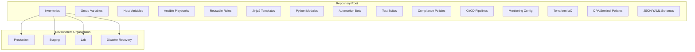
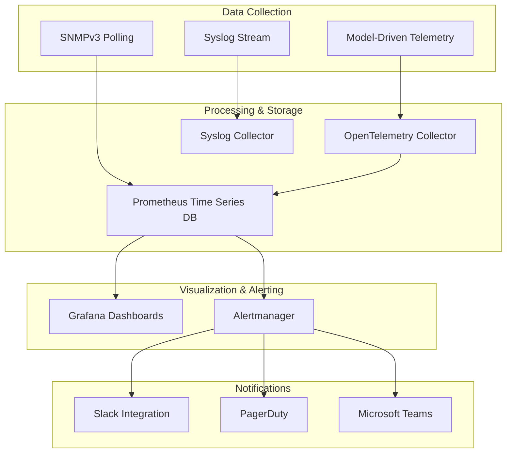
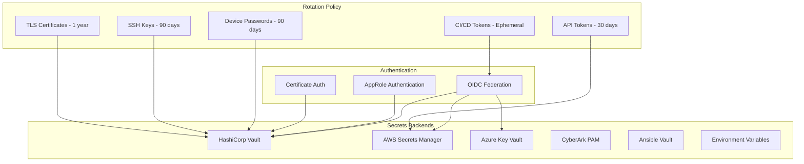
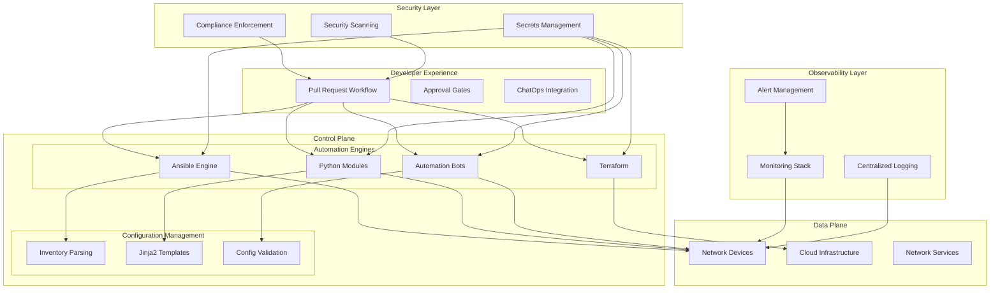
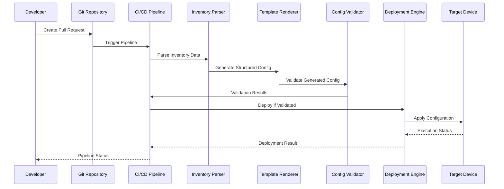
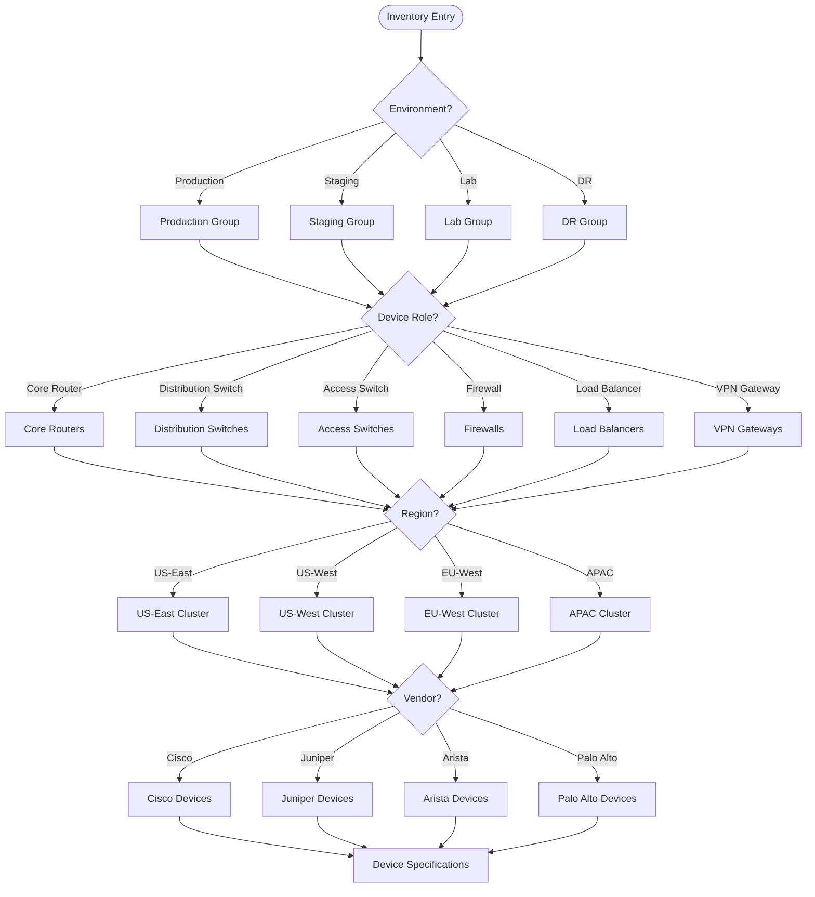
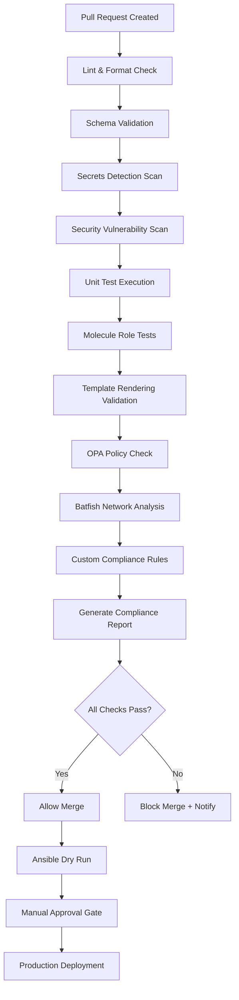
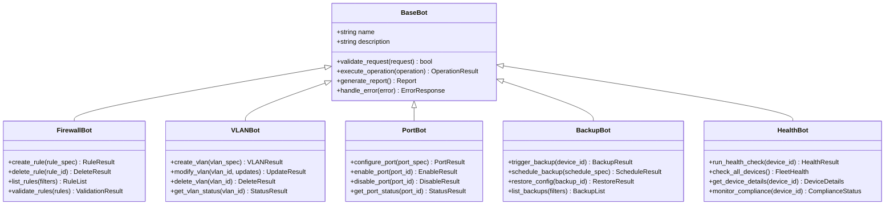
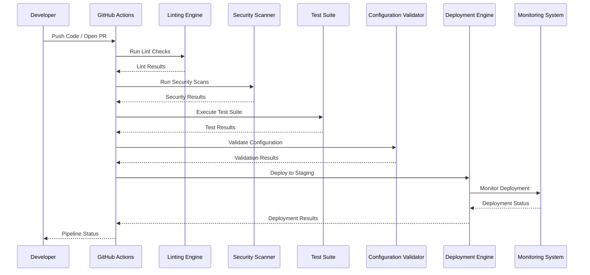
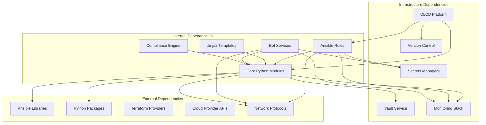

# System Architecture

<cite>
**Referenced Files in This Document**
- [README.md](file://README.md)
</cite>

## Table of Contents
1. [Introduction](#introduction)
2. [Project Structure](#project-structure)
3. [Core Components](#core-components)
4. [Architecture Overview](#architecture-overview)
5. [Detailed Component Analysis](#detailed-component-analysis)
6. [Dependency Analysis](#dependency-analysis)
7. [Performance Considerations](#performance-considerations)
8. [Troubleshooting Guide](#troubleshooting-guide)
9. [Conclusion](#conclusion)

## Introduction

The Enterprise Network Automation Platform is a production-grade, vendor-agnostic network automation solution designed for enterprise-scale environments. It demonstrates Infrastructure as Code, GitOps, CI/CD, compliance enforcement, observability, and security practices suitable for Fortune 100 organizations including banks, telecoms, and cloud-native enterprises.

The platform manages thousands of network devices across multi-vendor, multi-region environments through a fully modular, Git-driven approach where every configuration, policy, template, test, pipeline, dashboard, and bot is stored in version control while secrets are never committed.

## Project Structure

The platform follows a comprehensive directory structure organized by functional domains:

**Diagram sources**
- [README.md:105-180](file://README.md#L105-L180)

The architecture supports multiple environments (production, staging, lab, disaster recovery) with device organization by environment, role, region, and vendor. Each inventory entry defines device metadata including connectivity information, vendor specifications, and operational context.

**Section sources**
- [README.md:103-180](file://README.md#L103-L180)

## Core Components

### Control Plane Components

The control plane consists of four primary automation engines:

| Component | Technology | Purpose |
|-----------|------------|---------|
| **Ansible Engine** | Ansible 2.15+ | Device configuration management, orchestration, and state enforcement |
| **Python Modules** | Python 3.11+, NAPALM, Netmiko, Nornir | Custom automation logic, API integrations, and protocol handlers |
| **Automation Bots** | REST APIs + ChatOps | Self-service operations, approval workflows, and automated responses |
| **Terraform** | Terraform 1.5+ | Cloud networking infrastructure provisioning and management |

### Data Plane Components

The data plane encompasses all managed network infrastructure:

| Component Type | Examples | Management Protocol |
|----------------|----------|-------------------|
| **Core Routers** | Cisco IOS-XE, Juniper MX | SSH, NETCONF, RESTCONF |
| **Distribution Switches** | Arista EOS, Cisco NX-OS | SSH, eAPI, NETCONF |
| **Access Switches** | Multi-vendor support | SSH, SNMPv3 |
| **Firewalls** | Palo Alto PAN-OS, Fortinet FortiOS | SSH, API |
| **Load Balancers** | F5 BIG-IP | SSH, iControl REST |
| **VPN Gateways** | Site-to-site and remote-access | Vendor-specific APIs |
| **Cloud Networking** | AWS VPC, Azure VNets, GCP VPC | Cloud Provider APIs |

### Observability Layer

The observability stack provides comprehensive monitoring and alerting:

**Diagram sources**
- [README.md:587-604](file://README.md#L587-L604)

### Security Layer

The security architecture implements zero-trust principles with multiple secrets backends:

**Diagram sources**
- [README.md:343-357](file://README.md#L343-L357)

**Section sources**
- [README.md:184-200](file://README.md#L184-L200)
- [README.md:339-368](file://README.md#L339-L368)

## Architecture Overview

The platform implements a layered architecture with clear separation between control plane, data plane, observability, and security concerns:

**Diagram sources**
- [README.md:54-99](file://README.md#L54-L99)

The architecture follows GitOps principles where all changes flow through pull requests with automated validation, testing, and deployment processes.

**Section sources**
- [README.md:34-100](file://README.md#L34-L100)

## Detailed Component Analysis

### Configuration Generation Pipeline

The configuration generation process transforms structured data into device-specific configurations through a multi-stage pipeline:

**Diagram sources**
- [README.md:36-50](file://README.md#L36-L50)

### Inventory Management System

The inventory system organizes devices hierarchically by environment, role, region, and vendor:

**Diagram sources**
- [README.md:288-309](file://README.md#L288-L309)

### Compliance Enforcement Engine

The compliance system enforces security policies at every stage of the development lifecycle:

**Diagram sources**
- [README.md:570-579](file://README.md#L570-L579)

### Automation Bot Architecture

The bot system provides self-service capabilities through REST APIs and chat integrations:

**Diagram sources**
- [README.md:464-475](file://README.md#L464-L475)

### CI/CD Pipeline Architecture

The continuous integration and deployment pipeline ensures quality and compliance:

**Diagram sources**
- [README.md:483-501](file://README.md#L483-L501)

**Section sources**
- [README.md:438-456](file://README.md#L438-L456)
- [README.md:460-476](file://README.md#L460-L476)
- [README.md:479-514](file://README.md#L479-L514)

## Dependency Analysis

The platform maintains clear dependency boundaries and follows best practices for loose coupling:

**Diagram sources**
- [README.md:184-200](file://README.md#L184-L200)

Key dependency characteristics:
- **Loose Coupling**: Components communicate through well-defined interfaces
- **Protocol Abstraction**: Network protocols abstracted behind common interfaces
- **Secrets Abstraction**: Multiple secrets backends supported through adapter pattern
- **Vendor Abstraction**: Multi-vendor support through platform-specific implementations
- **Stateless Design**: Automation components designed to be stateless for scalability

**Section sources**
- [README.md:184-200](file://README.md#L184-L200)

## Performance Considerations

### Scalability Architecture

The platform is designed for enterprise-scale deployments supporting thousands of devices:

| Scale Metric | Target | Implementation Strategy |
|--------------|--------|------------------------|
| **Device Count** | 10,000+ devices | Parallel execution, connection pooling, rate limiting |
| **Concurrent Operations** | 100+ simultaneous | Kubernetes-based worker scaling, job queuing |
| **Configuration Changes** | 1,000+ per hour | Incremental updates, diff-based deployments |
| **Backup Operations** | 5,000+ daily | Scheduled batching, compression, encryption |
| **Compliance Scans** | Full fleet weekly | Distributed scanning, parallel processing |

### Performance Optimization Strategies

1. **Connection Management**: Persistent connections with intelligent retry logic
2. **Parallel Processing**: Concurrent device operations with controlled concurrency limits
3. **Caching**: Intelligent caching of device capabilities and topology information
4. **Incremental Updates**: Diff-based configuration application to minimize changes
5. **Resource Pooling**: Connection and resource pooling for high-throughput scenarios
6. **Asynchronous Processing**: Non-blocking operations for long-running tasks

### Monitoring and Observability Metrics

The platform tracks key performance indicators:

| Category | Metrics | Thresholds |
|----------|---------|------------|
| **Deployment Performance** | Execution time, success rate, rollback rate | < 5 min avg, > 99% success |
| **Device Connectivity** | Response time, error rates, timeout frequency | < 2s response, < 1% errors |
| **Resource Utilization** | CPU, memory, disk, network usage | < 80% utilization |
| **Queue Performance** | Job queue depth, processing latency | < 100 jobs, < 30s latency |
| **Compliance Drift** | Drift detection time, violation count | < 1 hour detection |

## Troubleshooting Guide

### Common Issues and Resolutions

| Issue Category | Symptoms | Diagnostic Steps | Resolution |
|----------------|----------|------------------|------------|
| **Connection Failures** | Timeout errors, authentication failures | Verify SSH reachability, check credentials, validate certificates | Review network ACLs, update credentials, verify certificate chains |
| **Template Rendering Errors** | Jinja2 syntax errors, missing variables | Check template syntax, validate variable definitions | Fix template syntax, ensure required variables present |
| **Compliance Violations** | Policy check failures, security warnings | Review compliance reports, analyze policy violations | Update configurations to meet policy requirements |
| **Pipeline Failures** | CI/CD workflow failures, test failures | Check GitHub Actions logs, review test output | Fix code issues, update dependencies, resolve conflicts |
| **Secrets Access Issues** | Authentication failures, permission denied | Verify OIDC tokens, check Vault policies, validate AppRole | Update authentication configuration, adjust Vault policies |
| **Performance Degradation** | Slow operations, timeouts, resource exhaustion | Monitor system metrics, analyze query patterns | Optimize queries, scale resources, implement caching |

### Debugging Tools and Techniques

1. **Verbose Logging**: Enable debug logging for detailed operation traces
2. **Dry Run Mode**: Test configurations without applying changes
3. **Diff Analysis**: Compare current vs. desired state for troubleshooting
4. **Compliance Reports**: Analyze detailed compliance violation reports
5. **Performance Profiling**: Identify bottlenecks in automation workflows
6. **Network Diagnostics**: Use ping, telnet, and protocol-specific tools for connectivity testing

### Operational Best Practices

1. **Change Management**: Always use pull request workflow for changes
2. **Testing Strategy**: Comprehensive testing at unit, integration, and compliance levels
3. **Rollback Procedures**: Automated rollback on failure with manual override capability
4. **Monitoring Integration**: Real-time monitoring with alerting for critical issues
5. **Documentation Maintenance**: Keep runbooks and documentation updated with changes
6. **Security Hygiene**: Regular secret rotation and security scanning

**Section sources**
- [README.md:674-685](file://README.md#L674-L685)

## Conclusion

The Enterprise Network Automation Platform represents a comprehensive, production-ready solution for managing large-scale network infrastructure. Its architecture emphasizes security, compliance, observability, and scalability while maintaining flexibility for multi-vendor environments.

Key architectural strengths include:

- **Zero-Trust Security**: Comprehensive secrets management with multiple backends
- **Compliance-First Design**: Automated compliance enforcement throughout the development lifecycle
- **Enterprise Scalability**: Designed for thousands of devices with horizontal scaling capabilities
- **Multi-Vendor Support**: Vendor-agnostic architecture supporting major networking vendors
- **GitOps Principles**: Complete version control and audit trail for all changes
- **Comprehensive Observability**: Full-stack monitoring with actionable insights and alerting

The platform successfully bridges the gap between traditional network engineering practices and modern DevOps methodologies, providing a robust foundation for enterprise network automation at scale.