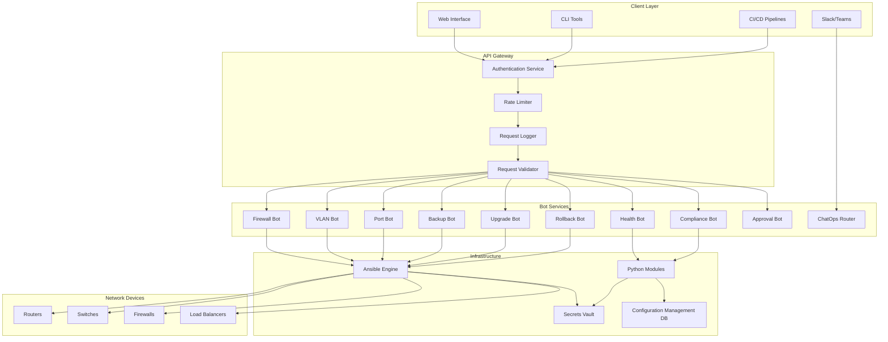
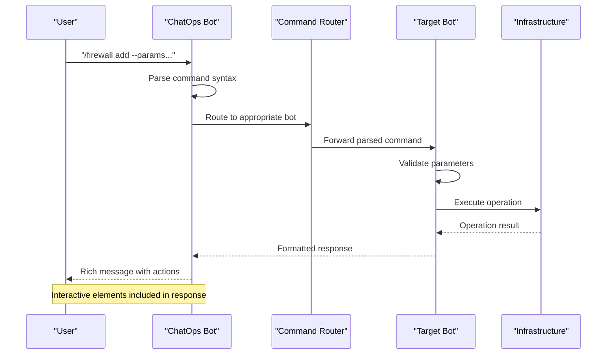
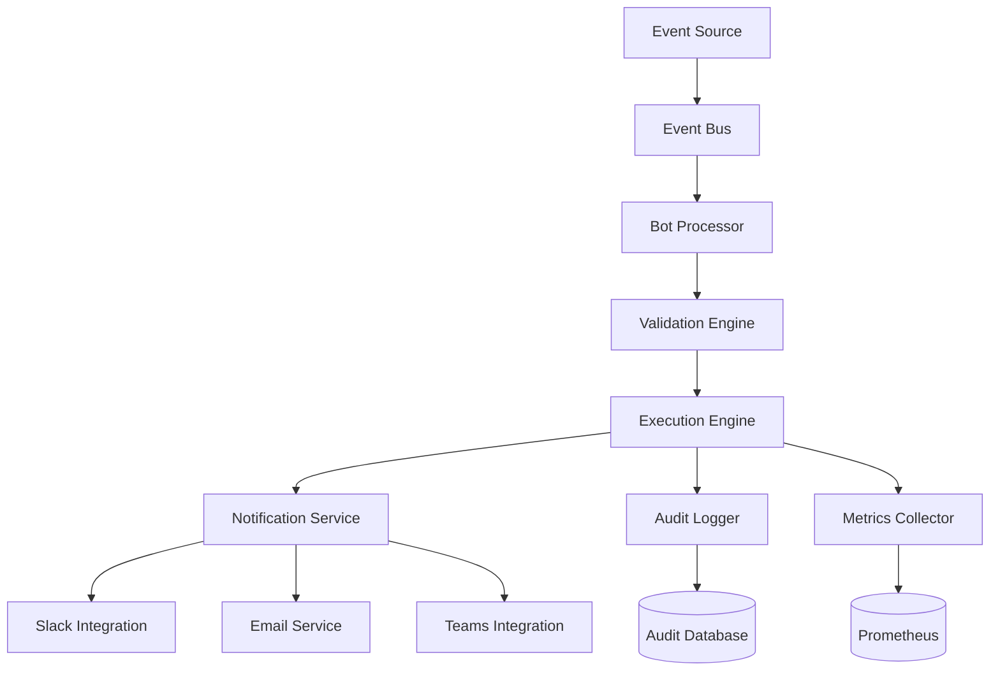

# Automation Bots & Self-Service

<cite>
**Referenced Files in This Document**
- [README.md](file://README.md)
</cite>

## Table of Contents
1. [Introduction](#introduction)
2. [Bot Architecture Overview](#bot-architecture-overview)
3. [Core Bot Components](#core-bot-components)
4. [API Endpoints Reference](#api-endpoints-reference)
5. [ChatOps Integration](#chatops-integration)
6. [Authentication & Security](#authentication--security)
7. [Approval Workflow Design](#approval-workflow-design)
8. [Integration Patterns](#integration-patterns)
9. [Monitoring & Observability](#monitoring--observability)
10. [Custom Bot Development](#custom-bot-development)
11. [Best Practices](#best-practices)
12. [Troubleshooting Guide](#troubleshooting-guide)
13. [Conclusion](#conclusion)

## Introduction

The Enterprise Network Automation Platform provides a comprehensive suite of automation bots designed to enable self-service network operations through REST APIs and ChatOps integrations. These bots serve as the primary interface for network engineers, developers, and automated systems to perform routine network tasks without requiring direct access to network devices or complex CLI commands.

The bot ecosystem follows a modular architecture where each bot specializes in specific network domains while sharing common infrastructure for authentication, logging, monitoring, and error handling. This design enables rapid development of new bots while maintaining consistency across the platform.

## Bot Architecture Overview

The bot architecture is built around a unified API gateway pattern with specialized bot services. Each bot exposes REST endpoints and optional ChatOps interfaces, providing multiple interaction methods for different user preferences and automation scenarios.



**Diagram sources**
- [README.md:460-478](file://README.md#L460-L478)
- [README.md:52-99](file://README.md#L52-L99)

## Core Bot Components

### Firewall Bot
The Firewall Bot manages firewall rule lifecycle including creation, validation, deployment, and removal. It supports multi-vendor firewall platforms and enforces security policies during rule creation.

**Key Features:**
- Rule validation against security policies
- Conflict detection and resolution
- Multi-vendor support (Palo Alto, Fortinet, Check Point)
- Automated rollback on deployment failure
- Audit trail for all changes

### VLAN Bot
The VLAN Bot handles VLAN provisioning and management with approval workflows. It ensures proper VLAN naming conventions and prevents conflicts with existing network segments.

**Key Features:**
- Automated VLAN ID assignment
- Naming convention enforcement
- Approval workflow integration
- Impact analysis before deployment
- Documentation generation

### Port Bot
The Port Bot manages switch port configurations including enabling/disabling ports, configuring VLANs, and applying security policies.

**Key Features:**
- Bulk port configuration
- Port security policy application
- Link aggregation support
- Auto-discovery of connected devices
- Configuration drift detection

### Backup Bot
The Backup Bot orchestrates configuration backups across all managed devices with version control integration and automated retention policies.

**Key Features:**
- Scheduled and on-demand backups
- Encrypted backup storage
- Version control integration
- Automated cleanup policies
- Backup verification and integrity checks

### Health Bot
The Health Bot performs comprehensive device health assessments including CPU, memory, interface status, and service availability checks.

**Key Features:**
- Multi-metric health assessment
- Trend analysis and anomaly detection
- Alerting integration
- Performance baseline establishment
- Capacity planning insights

### Compliance Bot
The Compliance Bot continuously monitors device configurations against defined security policies and compliance standards.

**Key Features:**
- Policy-based compliance checking
- Automated remediation suggestions
- Compliance reporting and dashboards
- Regulatory framework support
- Continuous monitoring

### Upgrade Bot
The Upgrade Bot orchestrates firmware upgrades with comprehensive pre/post checks and automated rollback capabilities.

**Key Features:**
- Phased upgrade deployment
- Pre-upgrade health validation
- Post-upgrade verification
- Automated rollback on failure
- Upgrade scheduling and coordination

### Rollback Bot
The Rollback Bot provides one-click recovery to last known good configurations with impact assessment and verification.

**Key Features:**
- Instant configuration recovery
- Change impact analysis
- Verification after rollback
- Audit trail maintenance
- Emergency response automation

### ChatOps Bot
The ChatOps Bot serves as a unified command router, translating natural language commands into structured API calls for other bots.

**Key Features:**
- Natural language processing
- Command routing and delegation
- Context-aware responses
- Multi-channel support
- User permission validation

### Approval Bot
The Approval Bot manages change request workflows with configurable approval chains and escalation policies.

**Key Features:**
- Configurable approval workflows
- Role-based permissions
- Escalation policies
- Audit trail maintenance
- Integration with external approval systems

**Section sources**
- [README.md:460-478](file://README.md#L460-L478)

## API Endpoints Reference

### Authentication Methods

All bot endpoints require authentication using one of the following methods:

| Method | Description | Use Case |
|--------|-------------|----------|
| JWT Token | JSON Web Tokens for long-lived sessions | API clients, CI/CD pipelines |
| OAuth 2.0 | Standard OAuth flow for web applications | Web interfaces, third-party integrations |
| API Keys | Static keys for machine-to-machine communication | Automated scripts, monitoring tools |
| OIDC | OpenID Connect for enterprise SSO | Corporate environments with existing identity providers |

### Request/Response Schema Standards

All endpoints follow consistent schema patterns:

**Standard Request Format:**
```json
{
  "request_id": "uuid-string",
  "timestamp": "ISO-8601-timestamp",
  "user": "authenticated-user-id",
  "parameters": {
    "key": "value"
  },
  "metadata": {
    "source": "slack|teams|api|cli",
    "correlation_id": "trace-id"
  }
}
```

**Standard Response Format:**
```json
{
  "status": "success|failure|pending",
  "message": "human-readable-message",
  "data": {},
  "errors": [],
  "metadata": {
    "request_id": "uuid-string",
    "processing_time_ms": 123,
    "version": "v1.0.0"
  }
}
```

### Error Handling Patterns

The platform implements standardized error codes and messages:

| Status Code | Error Type | Description | Recovery Action |
|-------------|------------|-------------|-----------------|
| 400 | Validation Error | Invalid request parameters | Review and correct request format |
| 401 | Authentication Error | Invalid or expired credentials | Refresh authentication token |
| 403 | Authorization Error | Insufficient permissions | Request appropriate permissions |
| 404 | Resource Not Found | Requested resource doesn't exist | Verify resource identifiers |
| 429 | Rate Limit Exceeded | Too many requests | Implement exponential backoff |
| 500 | Internal Server Error | Unexpected server error | Retry with backoff, contact support |
| 503 | Service Unavailable | Temporary service outage | Retry after delay |

**Section sources**
- [README.md:460-478](file://README.md#L460-L478)

## ChatOps Integration

### Slack Integration

The platform provides comprehensive Slack integration with slash commands and interactive messages.

**Command Syntax:**
```
/firewall add --src=10.0.1.0/24 --dst=10.0.2.0/24 --action=allow --description="Allow subnet traffic"
/vlan create --name=engineering --id=100 --description="Engineering department VLAN"
/port configure --device=switch-01 --port=GigabitEthernet1/0/1 --vlan=100 --mode=access
/health check --device=router-01 --metrics=cpu,memory,interfaces
/compliance scan --scope=production --policy=critical-only
/upgrade schedule --device=fw-edge-01 --firmware=panos-10.1.2 --window=weekend
/rollback apply --device=switch-02 --version=v2024.01.15
```

**Interactive Messages:**
- Approval requests with approve/deny buttons
- Status updates with progress indicators
- Error notifications with troubleshooting links
- Confirmation dialogs for destructive operations

### Microsoft Teams Integration

Microsoft Teams integration provides similar functionality with native Teams features.

**Command Syntax:**
```
@BotName /firewall add --src=10.0.1.0/24 --dst=10.0.2.0/24 --action=allow
@BotName /vlan create --name=marketing --id=200 --description="Marketing VLAN"
@BotName /health check --scope=all-devices --output=detailed
```

**Teams-Specific Features:**
- Adaptive cards for rich formatting
- Task modules for complex workflows
- File attachments for reports and logs
- Meeting integration for scheduled maintenance

### Command Routing Architecture



**Diagram sources**
- [README.md:460-478](file://README.md#L460-L478)

**Section sources**
- [README.md:460-478](file://README.md#L460-L478)

## Authentication & Security

### Multi-Factor Authentication Support

The platform supports MFA for enhanced security:

| Factor Type | Implementation | Use Case |
|-------------|----------------|----------|
| SMS/Email OTP | Time-based one-time passwords | Mobile users, emergency access |
| Hardware Tokens | FIDO2/WebAuthn tokens | High-security environments |
| Biometric | Device biometrics | Mobile applications |
| Certificate-based | Client certificates | Machine-to-machine auth |

### Authorization Model

Role-based access control (RBAC) with granular permissions:

| Role | Permissions | Examples |
|------|-------------|----------|
| Viewer | Read-only access | Monitoring dashboards, reports |
| Operator | Execute predefined operations | Health checks, backups |
| Engineer | Full operational access | Configuration changes, upgrades |
| Admin | System administration | User management, policy configuration |
| Auditor | Audit and compliance | Report generation, audit trails |

### Security Best Practices

- **Principle of Least Privilege**: Users receive minimum required permissions
- **Session Management**: Short-lived tokens with automatic refresh
- **Audit Logging**: Comprehensive audit trail for all operations
- **Input Validation**: Strict parameter validation and sanitization
- **Encryption**: TLS 1.3 for data in transit, AES-256 for data at rest
- **Rate Limiting**: Per-user and per-IP rate limiting to prevent abuse

**Section sources**
- [README.md:339-368](file://README.md#L339-L368)

## Approval Workflow Design

### Workflow Configuration

Approval workflows are configured through YAML definitions supporting complex approval chains:

```yaml
workflow:
  name: "firewall_rule_change"
  description: "Automated firewall rule change approval process"
  
  triggers:
    - event: "api_request"
      endpoint: "/api/v1/firewall/rules"
      method: "POST"
      
  conditions:
    - type: "risk_assessment"
      threshold: "high"
      action: "require_approval"
      
  approval_chain:
    - approver: "network_engineer"
      timeout: "2h"
      escalation: "team_lead"
      
    - approver: "security_team"
      timeout: "4h"
      escalation: "ciso"
      
    - approver: "change_board"
      timeout: "24h"
      escalation: "vp_operations"
      
  notifications:
    slack_channel: "#network-changes"
    email_recipients: ["netops@example.com"]
    teams_channel: "Network Changes"
    
  auto_approve:
    conditions:
      - risk_level: "low"
        requester_role: "senior_engineer"
        time_window: "business_hours"
```

### Approval States

| State | Description | Actions Available |
|-------|-------------|-------------------|
| Pending | Awaiting initial approval | Approve, Deny, Request Info |
| Approved | All approvals received | Deploy, Cancel |
| Denied | Rejected by approver | Resubmit with changes |
| In Progress | Deployment in progress | Monitor, Abort |
| Completed | Successfully deployed | View details, Download logs |
| Failed | Deployment failed | Retry, Rollback, Investigate |

### Escalation Policies

Escalation ensures timely approval processing:

- **Time-based escalation**: Automatic escalation if not responded within timeout
- **Role-based escalation**: Escalate to higher authority levels
- **Context-aware escalation**: Consider business hours, holidays, and workload
- **Notification escalation**: Multiple notification channels and frequency

**Section sources**
- [README.md:460-478](file://README.md#L460-L478)

## Integration Patterns

### External System Integration

The platform supports various integration patterns for external systems:

#### Webhook Integration
Real-time event notifications to external systems:

```json
{
  "event_type": "firewall_rule_deployed",
  "timestamp": "2024-01-15T10:30:00Z",
  "data": {
    "rule_id": "fw-rule-12345",
    "device": "fw-edge-01",
    "deployed_by": "john.doe",
    "approval_chain": ["engineer", "security", "change_board"],
    "deployment_time_ms": 45000
  },
  "metadata": {
    "environment": "production",
    "region": "us-east",
    "compliance_status": "passed"
  }
}
```

#### Database Integration
Bidirectional synchronization with external databases:

- **CMDB Integration**: Real-time configuration synchronization
- **Ticketing Systems**: Jira, ServiceNow integration for change tracking
- **Monitoring Systems**: Prometheus metrics export, Grafana dashboard provisioning
- **Identity Providers**: LDAP, Active Directory, Okta integration

#### API Gateway Integration
RESTful API exposure for third-party integrations:

- **GraphQL API**: Flexible querying for complex data requirements
- **gRPC API**: High-performance machine-to-machine communication
- **WebSocket API**: Real-time streaming for live updates
- **Batch API**: Bulk operations for large-scale changes

### Event-Driven Architecture



**Diagram sources**
- [README.md:583-604](file://README.md#L583-L604)

**Section sources**
- [README.md:583-604](file://README.md#L583-L604)

## Monitoring & Observability

### Key Performance Indicators

The platform tracks comprehensive metrics for bot operations:

| Metric Category | Specific Metrics | Threshold | Alert Level |
|----------------|------------------|-----------|-------------|
| API Performance | Request latency, throughput, error rates | < 100ms p95 | Warning at > 200ms |
| Bot Operations | Success/failure rates, execution time | > 99% success | Critical at < 95% |
| Device Connectivity | Connection success, response time | > 99.9% uptime | Warning at < 99% |
| Queue Processing | Queue depth, processing time | < 100 items | Critical at > 1000 |
| Resource Usage | CPU, memory, disk utilization | < 80% usage | Warning at > 90% |

### Dashboard Categories

| Dashboard | Purpose | Key Visualizations |
|-----------|---------|-------------------|
| **Network Health** | Device status and performance | Device topology, status indicators, trend charts |
| **Automation Metrics** | Bot operation effectiveness | Success rates, execution times, error breakdowns |
| **Compliance Overview** | Security posture monitoring | Violation trends, policy adherence scores |
| **Upgrade Tracker** | Firmware management visibility | Upgrade progress, version distribution, rollback rates |
| **API Performance** | Endpoint performance monitoring | Latency percentiles, throughput graphs, error rates |
| **Inventory Drift** | Configuration compliance | Drift detection, change frequency, affected devices |

### Alerting Strategy

Multi-tier alerting system with intelligent escalation:

- **Informational**: Low-priority notifications for informational events
- **Warning**: Medium-priority alerts requiring attention within SLA
- **Critical**: High-priority alerts requiring immediate response
- **Emergency**: Severe incidents triggering automated response and paging

**Section sources**
- [README.md:583-616](file://README.md#L583-L616)

## Custom Bot Development

### Bot Framework Architecture

The bot framework provides a standardized foundation for developing custom bots:

```python
class BaseBot:
    def __init__(self, config):
        self.config = config
        self.logger = get_logger(self.__class__.__name__)
        self.auth = AuthenticationManager()
        self.validator = RequestValidator()
        self.executor = TaskExecutor()
        
    def validate_request(self, request):
        """Validate incoming request parameters"""
        pass
        
    def execute_operation(self, params):
        """Execute the core bot operation"""
        pass
        
    def format_response(self, result):
        """Format response for different channels"""
        pass
        
    def handle_error(self, error):
        """Handle and log errors consistently"""
        pass
```

### Development Guidelines

#### Bot Structure
Each bot should follow this directory structure:

```
bots/
├── custom_bot/
│   ├── __init__.py
│   ├── bot.py          # Main bot implementation
│   ├── schemas.py      # Request/response schemas
│   ├── validators.py   # Input validation logic
│   ├── handlers.py     # Operation handlers
│   ├── templates.py    # ChatOps message templates
│   └── tests/
│       ├── test_bot.py
│       ├── test_schemas.py
│       └── fixtures/
```

#### API Endpoint Definition
Define REST endpoints using standard decorators:

```python
@bot.route('/api/v1/custom/operation', methods=['POST'])
@authenticate
@validate_request(CustomOperationSchema)
@rate_limit(max_requests=10, period='1m')
def custom_operation(request):
    """Custom bot operation endpoint"""
    try:
        result = execute_custom_logic(request.params)
        return format_success_response(result)
    except ValidationError as e:
        return format_validation_error(e)
    except Exception as e:
        return format_internal_error(e)
```

#### ChatOps Command Registration
Register chat commands with metadata:

```python
@bot.command('custom', help='Perform custom network operation')
@command_permissions(['operator', 'engineer'])
@command_examples([
    '/custom operation --param1=value1 --param2=value2',
    '/custom operation --batch-file=config.json'
])
def handle_custom_command(message, params):
    """Handle custom bot command from chat"""
    return process_chat_command(message, params)
```

### Testing Requirements

All custom bots must include comprehensive testing:

- **Unit Tests**: Individual function and method testing
- **Integration Tests**: API endpoint and external system integration
- **ChatOps Tests**: Command parsing and response formatting
- **Security Tests**: Authentication and authorization validation
- **Performance Tests**: Load testing and stress testing

**Section sources**
- [README.md:460-478](file://README.md#L460-L478)

## Best Practices

### Bot Design Principles

1. **Single Responsibility**: Each bot focuses on specific domain functionality
2. **Stateless Operations**: Prefer stateless designs for scalability
3. **Idempotent Requests**: Ensure repeated requests produce same results
4. **Graceful Degradation**: Handle partial failures gracefully
5. **Comprehensive Logging**: Log sufficient context for debugging
6. **Consistent Error Handling**: Standardized error responses and codes

### Security Considerations

- **Input Validation**: Always validate and sanitize user inputs
- **Parameter Binding**: Use parameter binding instead of string concatenation
- **SQL Injection Prevention**: Use parameterized queries
- **XSS Protection**: Sanitize outputs for web interfaces
- **CSRF Protection**: Implement CSRF tokens for state-changing operations
- **Rate Limiting**: Protect against abuse and ensure fair usage

### Performance Optimization

- **Connection Pooling**: Reuse database and API connections
- **Caching Strategies**: Implement appropriate caching layers
- **Asynchronous Processing**: Use async operations for I/O bound tasks
- **Batch Operations**: Process multiple requests efficiently
- **Resource Cleanup**: Properly manage and release resources

### Monitoring and Observability

- **Structured Logging**: Use JSON logs with consistent fields
- **Metrics Collection**: Track key performance indicators
- **Distributed Tracing**: Implement correlation IDs across services
- **Health Checks**: Provide comprehensive health check endpoints
- **Alerting**: Configure appropriate alerts for critical issues

**Section sources**
- [README.md:460-478](file://README.md#L460-L478)

## Troubleshooting Guide

### Common Issues and Solutions

| Issue | Symptoms | Resolution |
|-------|----------|------------|
| Authentication Failures | 401 errors, token expiration | Check token validity, refresh credentials |
| Permission Denied | 403 errors on operations | Verify user roles and permissions |
| Rate Limiting | 429 errors, throttling | Implement backoff, reduce request frequency |
| Device Connectivity | Timeout errors, connection refused | Check network reachability, verify credentials |
| Template Rendering | Jinja2 errors, missing variables | Validate template syntax, check variable names |
| Compliance Failures | Policy violations, blocked deployments | Review compliance policies, fix violations |
| ChatOps Commands | Commands not recognized, malformed responses | Check command syntax, verify bot registration |

### Debugging Techniques

- **Enable Debug Logging**: Increase log verbosity for problematic operations
- **Trace Requests**: Follow request correlation IDs through the system
- **Check Bot Health**: Verify bot service status and dependencies
- **Review Audit Logs**: Examine audit trails for unauthorized access attempts
- **Monitor Dependencies**: Check external system connectivity and status
- **Test in Staging**: Reproduce issues in staging environment first

### Performance Troubleshooting

- **Slow API Responses**: Check database query performance, external API latency
- **High Memory Usage**: Identify memory leaks, optimize data processing
- **CPU Bottlenecks**: Profile hot paths, optimize algorithms
- **Queue Backups**: Monitor queue depths, scale worker processes
- **Database Locks**: Identify long-running transactions, optimize queries

**Section sources**
- [README.md:674-685](file://README.md#L674-L685)

## Conclusion

The Enterprise Network Automation Platform's bot ecosystem provides a comprehensive solution for self-service network operations through intuitive APIs and ChatOps interfaces. The modular architecture enables rapid development of new capabilities while maintaining consistency and security across the platform.

Key benefits include:

- **Operational Efficiency**: Automate routine tasks and reduce manual intervention
- **Security Enhancement**: Enforce policies and maintain audit trails
- **Scalability**: Handle thousands of devices and concurrent operations
- **Flexibility**: Support multiple interaction methods and integration patterns
- **Reliability**: Built-in error handling, monitoring, and recovery mechanisms

The platform's extensible design allows organizations to customize and extend bot capabilities while adhering to established best practices for security, performance, and maintainability. As network environments evolve, the bot architecture provides a solid foundation for adapting to new technologies and operational requirements.