# CI/CD Pipeline & GitOps

<cite>
**Referenced Files in This Document**
- [README.md](file://README.md)
- [pyproject.toml](file://pyproject.toml)
- [.pre-commit-config.yaml](file://.pre-commit-config.yaml)
- [requirements.txt](file://requirements.txt)
</cite>

## Update Summary
**Changes Made**
- Added comprehensive Python project configuration section documenting pyproject.toml standardization
- Updated CI/CD pipeline description to include new linting, formatting, type checking, and security scanning tools
- Enhanced testing strategy section with pytest markers and coverage reporting thresholds
- Added Bandit security scanning configuration details
- Updated development workflow to reflect standardized Python tooling

## Table of Contents
1. [Introduction](#introduction)
2. [Project Structure](#project-structure)
3. [Core Components](#core-components)
4. [Architecture Overview](#architecture-overview)
5. [Detailed Component Analysis](#detailed-component-analysis)
6. [Python Project Configuration](#python-project-configuration)
7. [Dependency Analysis](#dependency-analysis)
8. [Performance Considerations](#performance-considerations)
9. [Troubleshooting Guide](#troubleshooting-guide)
10. [Conclusion](#conclusion)

## Introduction
This document describes the end-to-end CI/CD pipeline and GitOps workflows for the Enterprise Network Automation Platform. It explains how changes flow from push or pull request through validation, security scanning, testing, compliance checks, dry runs, approvals, deployment, post-deploy verification, documentation generation, and release artifacts. It also covers key workflows including PR validation, staging and production deployments, scheduled compliance audits, firmware upgrades, automated backups, and documentation updates. The GitOps model emphasizes branch protection, signed commits, pull request workflows, and automated rollback on failure.

**Updated** Added comprehensive Python project configuration standardization through pyproject.toml defining Python 3.11 requirements, Black formatting rules, Flake8 configuration, MyPy type checking, PyTest markers, coverage reporting thresholds, and Bandit security scanning rules.

## Project Structure
The repository defines all pipelines under .github/workflows/. The high-level flow includes linting, YAML schema validation, secrets scanning, security scanning, unit tests, Molecule role tests, template rendering validation, compliance policy checks, Ansible dry run, manual approval gates, deployment to target environments, post-deploy verification, documentation generation, release creation, artifact publishing, and automatic rollback on failure.

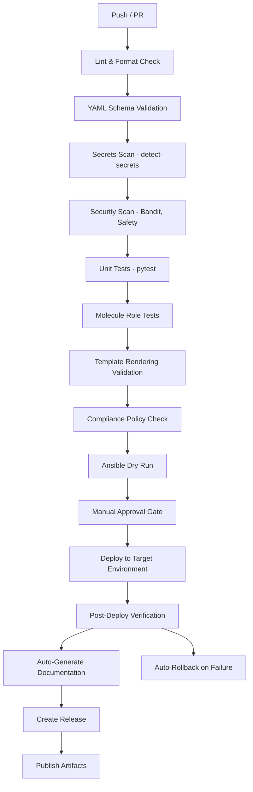

**Diagram sources**
- [README.md:598-616](file://README.md#L598-L616)

**Section sources**
- [README.md:594-630](file://README.md#L594-L630)

## Core Components
- Workflow orchestration: GitHub Actions workflows define triggers and steps for each stage of the pipeline.
- Validation stages: Linting, YAML schema validation, secrets scanning, and security scanning ensure code quality and safety early.
- Testing stages: Unit tests and Molecule role tests validate logic and configuration behavior.
- Compliance and readiness: Template rendering validation, compliance policy checks, and Ansible dry runs confirm correctness without making changes.
- Deployment controls: Manual approval gates protect production; environment-specific workflows deploy to staging and production.
- Post-deploy assurance: Health checks and config validations verify outcomes; failures trigger automatic rollback.
- Documentation and releases: Automated documentation generation and release artifact publishing keep outputs current.

Key workflows:
- ci-validate.yml: PR opened/updated triggers lint, test, scan, and validate.
- cd-deploy-staging.yml: Merge to staging deploys with dry run.
- cd-deploy-production.yml: Merge to main plus approval deploys to production.
- compliance-scan.yml: Scheduled daily full compliance audit.
- firmware-upgrade.yml: Manual dispatch orchestrates firmware upgrades.
- backup-schedule.yml: Scheduled daily at 02:00 UTC for automated configuration backups.
- docs-generate.yml: Merge to main regenerates documentation.

**Section sources**
- [README.md:618-629](file://README.md#L618-L629)

## Architecture Overview
The platform follows a GitOps model where every change is proposed via pull requests, validated by CI, approved as required, and deployed automatically by CD. Branch protection and signed commits enforce integrity. Automated rollback ensures resilience.

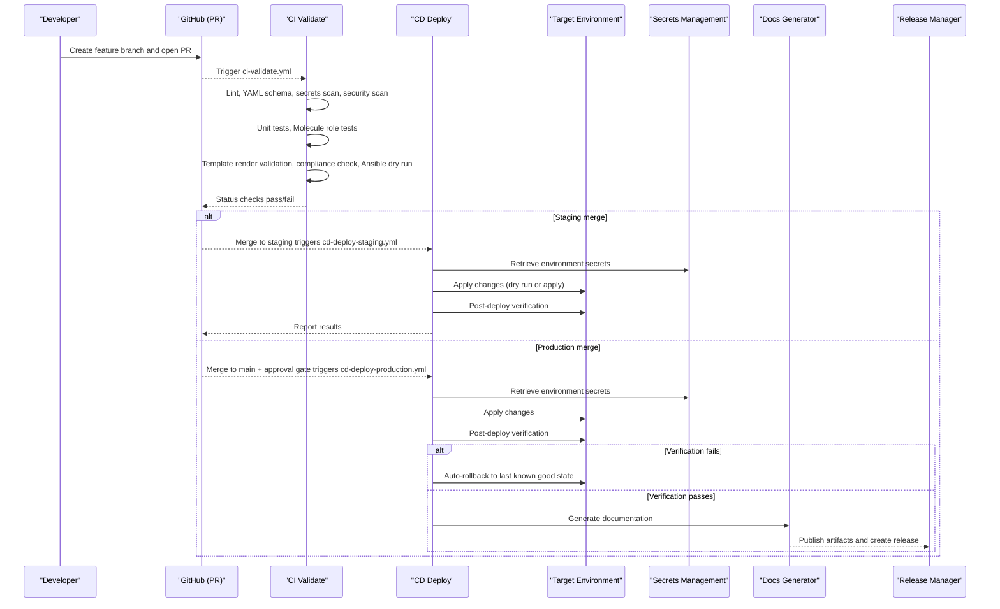

**Diagram sources**
- [README.md:594-630](file://README.md#L594-L630)
- [README.md:738-776](file://README.md#L738-L776)

## Detailed Component Analysis

### PR Validation Workflow (ci-validate.yml)
- Triggers on PR opened or updated.
- Runs linting and format checks across Ansible, Python, and YAML using standardized tools.
- Validates YAML schemas to ensure inventories, variables, and playbooks conform to expected structures.
- Scans for secrets using detect-secrets to prevent accidental exposure.
- Performs security scans with tools like Bandit and Safety.
- Executes unit tests with pytest using configured markers and coverage thresholds.
- Runs Molecule role tests to validate roles against containerized targets.
- Validates Jinja2 template rendering to catch syntax and variable issues.
- Enforces compliance policies and performs an Ansible dry run to confirm idempotency and safety.

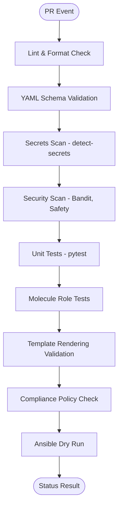

**Diagram sources**
- [README.md:598-616](file://README.md#L598-L616)

**Section sources**
- [README.md:618-629](file://README.md#L618-L629)

### Staging Deployment Workflow (cd-deploy-staging.yml)
- Triggered on merge to the staging branch.
- Retrieves environment-specific secrets from the secrets management system.
- Applies changes with a focus on non-destructive operations (e.g., dry run or staged apply).
- Runs post-deploy verification to ensure health and configuration correctness.
- Reports status back to the repository.

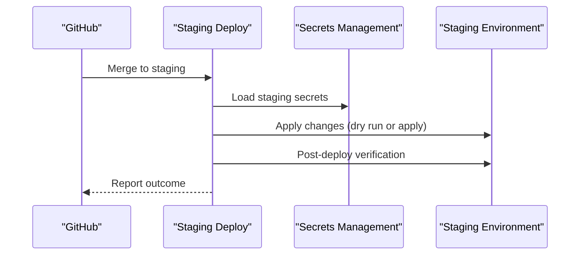

**Diagram sources**
- [README.md:618-629](file://README.md#L618-L629)

**Section sources**
- [README.md:618-629](file://README.md#L618-L629)

### Production Deployment Workflow (cd-deploy-production.yml)
- Triggered on merge to main with manual approval gates enforced.
- Loads production secrets securely.
- Applies changes to the production environment.
- Performs comprehensive post-deploy verification.
- On failure, triggers automatic rollback to the last known good state.
- On success, proceeds to documentation generation and release artifact publishing.

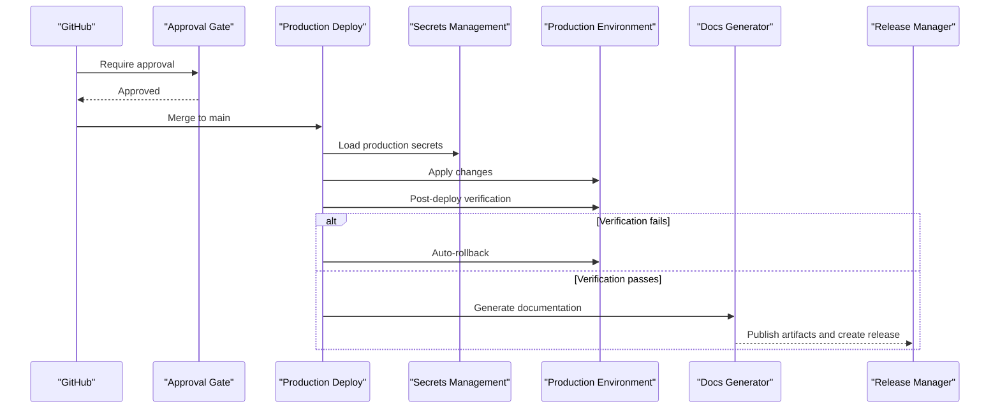

**Diagram sources**
- [README.md:598-616](file://README.md#L598-L616)
- [README.md:618-629](file://README.md#L618-L629)

**Section sources**
- [README.md:618-629](file://README.md#L618-L629)

### Scheduled Compliance Audit (compliance-scan.yml)
- Runs daily to perform a full compliance audit across configurations and templates.
- Ensures ongoing adherence to organizational policies and standards.
- Produces reports and flags deviations for remediation.

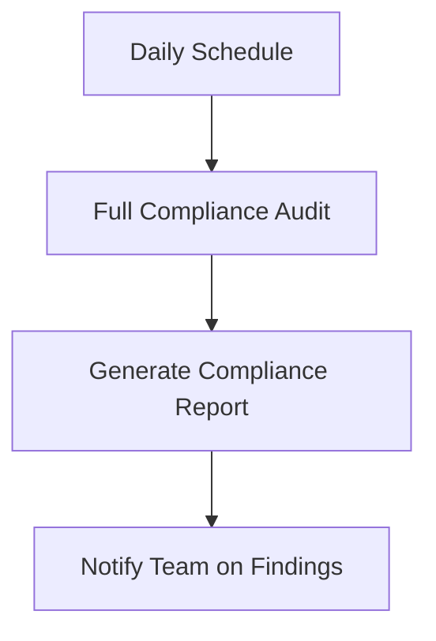

**Diagram sources**
- [README.md:618-629](file://README.md#L618-L629)

**Section sources**
- [README.md:618-629](file://README.md#L618-L629)

### Firmware Upgrade Workflow (firmware-upgrade.yml)
- Triggered manually or by schedule.
- Executes pre-upgrade health checks.
- Backs up running configurations.
- Downloads firmware to devices and verifies checksums.
- Installs firmware and reboots devices.
- Performs post-upgrade validation.
- Automatically rolls back if validation fails.

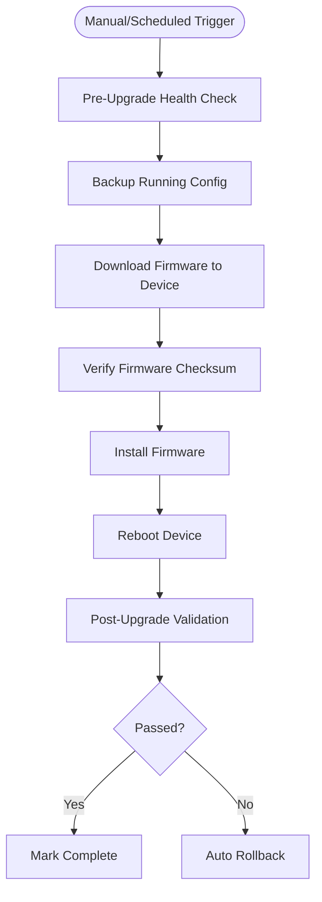

**Diagram sources**
- [README.md:803-815](file://README.md#L803-L815)

**Section sources**
- [README.md:800-815](file://README.md#L800-L815)

### Automated Configuration Backup (backup-schedule.yml)
- Scheduled daily at 02:00 UTC.
- Automates configuration backups to secure storage.
- Supports recovery and rollback scenarios.

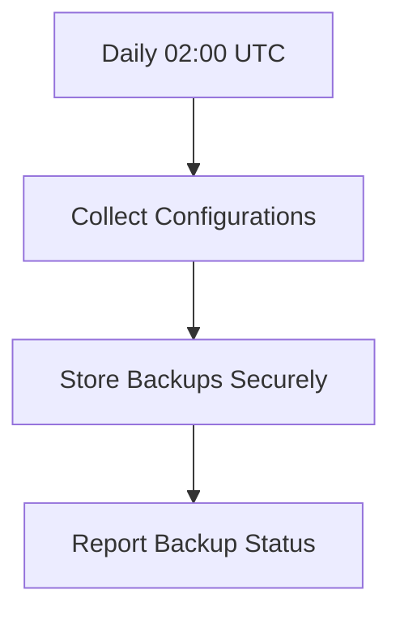

**Diagram sources**
- [README.md:618-629](file://README.md#L618-L629)

**Section sources**
- [README.md:618-629](file://README.md#L618-L629)

### Documentation Generation (docs-generate.yml)
- Triggered on merge to main.
- Regenerates documentation from source artifacts and configuration.
- Publishes updated docs and release artifacts.

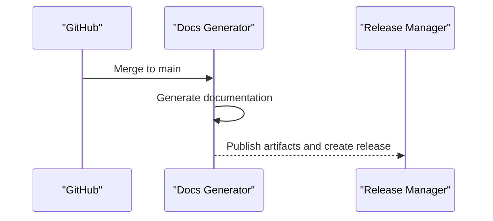

**Diagram sources**
- [README.md:598-616](file://README.md#L598-L616)
- [README.md:618-629](file://README.md#L618-L629)

**Section sources**
- [README.md:618-629](file://README.md#L618-L629)

### GitOps Model
- Developers create feature branches and open pull requests targeting staging or main.
- Automated validation runs lint, tests, schema validation, secrets scan, compliance check, and dry run.
- Peer review and optional CAB approval are required for production.
- Deployment is triggered automatically on merge via GitHub Actions.
- Post-deploy verification ensures health and correctness.
- Automatic rollback occurs if verification fails, reverting to the last known good state.

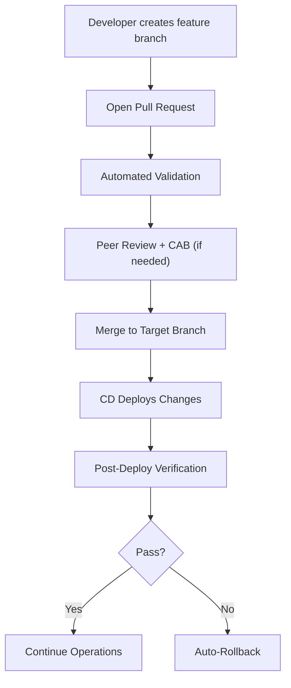

**Diagram sources**
- [README.md:738-776](file://README.md#L738-L776)

**Section sources**
- [README.md:734-796](file://README.md#L734-L796)

## Python Project Configuration

**New Section** The platform implements comprehensive Python project configuration standardization through pyproject.toml, ensuring consistent development practices across the team.

### Python Version and Build System
- **Python Requirement**: Python 3.11+ enforced throughout the platform
- **Build System**: setuptools>=68.0 with wheel support
- **Project Metadata**: Complete package information including authors, license (MIT), and classifiers

### Code Quality Tools Configuration

#### Black Formatting Rules
- Line length: 100 characters
- Target version: Python 3.11
- Includes: All Python files (.py, .pyi)
- Excludes: .eggs, .git, .venv, build, dist directories

#### Flake8 Configuration
- Maximum line length: 100 characters
- Extended ignore rules: E203 (whitespace before ':'), W503 (line break before binary operator)
- Excluded directories: .git, __pycache__, .venv, build, dist

#### MyPy Type Checking
- Python version: 3.11
- Strict mode enabled with comprehensive type checking
- Disallows untyped definitions and incomplete definitions
- Enables strict optional checking and implicit optional detection
- Test modules exempted from strict type checking requirements

### Testing Framework Configuration

#### PyTest Markers and Organization
- **Unit Tests**: Basic functionality testing
- **Integration Tests**: Cross-module interaction testing  
- **Compliance Tests**: Security and policy validation
- **Golden Config Tests**: Configuration baseline validation
- **Performance Tests**: Load and performance benchmarking
- **Slow Tests**: Long-running test identification

#### Coverage Reporting Thresholds
- Minimum coverage: 80%
- Source directory: python/
- HTML and terminal reports generated
- Exclusions for test files, __pycache__, and specific patterns

### Security Scanning Configuration

#### Bandit Security Scanner
- Excluded directories: tests, .venv
- Skipped rule: B101 (assert statements used for testing)
- Integrated with pre-commit hooks for local development

### Integration with Development Workflow

#### Pre-commit Hooks
The pyproject.toml configuration integrates seamlessly with pre-commit hooks:
- Black formatting enforcement
- Flake8 linting with custom rules
- MyPy type checking
- Bandit security scanning
- Detect-secrets scanning
- Isort import organization

#### Requirements Management
All tool versions are synchronized between pyproject.toml and requirements.txt:
- black>=23.9.0
- flake8>=6.1.0  
- mypy>=1.5.0
- bandit>=1.7.5
- pytest>=7.4.0 with pytest-cov>=4.1.0

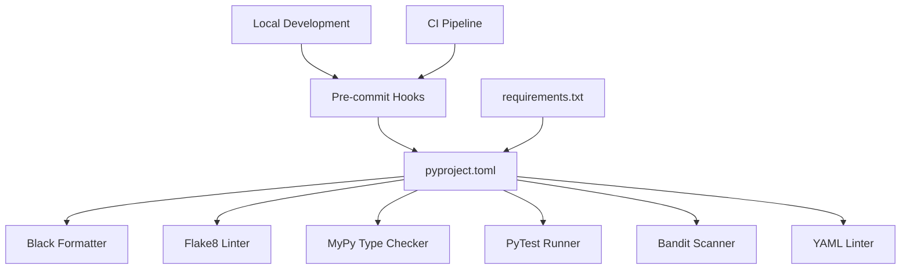

**Diagram sources**
- [pyproject.toml:1-100](file://pyproject.toml#L1-L100)
- [.pre-commit-config.yaml:1-66](file://.pre-commit-config.yaml#L1-L66)
- [requirements.txt:44-54](file://requirements.txt#L44-L54)

**Section sources**
- [pyproject.toml:1-100](file://pyproject.toml#L1-L100)
- [.pre-commit-config.yaml:30-66](file://.pre-commit-config.yaml#L30-L66)
- [requirements.txt:44-54](file://requirements.txt#L44-L54)

## Dependency Analysis
- Workflows depend on GitHub Actions runners and environment secrets managed by a secrets management system.
- CI stages depend on toolchains for linting, schema validation, secrets scanning, security scanning, testing, and compliance checks.
- CD stages depend on connectivity to target environments and access to secrets for authentication and configuration.
- Documentation generation depends on source artifacts produced during deployment.
- **Updated** Python toolchain dependencies are standardized through pyproject.toml ensuring consistent versions across development and CI environments.

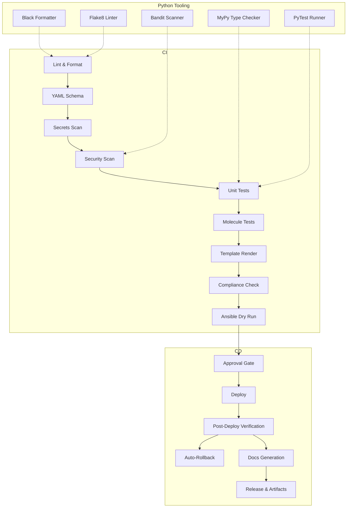

**Diagram sources**
- [README.md:598-616](file://README.md#L598-L616)
- [README.md:618-629](file://README.md#L618-L629)
- [pyproject.toml:23-96](file://pyproject.toml#L23-L96)

**Section sources**
- [README.md:594-630](file://README.md#L594-L630)

## Performance Considerations
- Parallelize independent CI jobs (lint, tests, scans) to reduce overall pipeline duration.
- Cache dependencies for Python, Ansible, and Molecule to speed up subsequent runs.
- Use targeted execution for large repositories by limiting scope to changed files when possible.
- Optimize Molecule tests by leveraging lightweight containers and minimal device emulation.
- Avoid unnecessary retries and timeouts; tune thresholds based on environment characteristics.
- **Updated** Leverage pre-commit hooks for fast local feedback before pushing to CI.
- **Updated** Configure selective test execution using pytest markers to run only relevant tests.

## Troubleshooting Guide
Common issues and resolutions:
- Ansible connection timeout: Verify SSH reachability to target devices.
- Template rendering error: Inspect Jinja2 syntax and variable definitions.
- Compliance check failure: Review compliance policies and diffs against running configurations.
- CI pipeline failure: Examine GitHub Actions logs for actionable error messages.
- Vault authentication failure: Confirm OIDC token or AppRole credentials and Vault policies.
- Molecule test failure: Ensure Docker/Podman is running and inspect molecule configuration.
- Batfish analysis error: Validate snapshots used for network analysis.
- **Updated** Python tooling failures: Check pyproject.toml configuration and ensure compatible Python 3.11+ installation.
- **Updated** Black formatting conflicts: Run `black .` locally to auto-format code before committing.
- **Updated** Flake8 violations: Review extended ignore rules and fix reported issues.
- **Updated** MyPy type errors: Add proper type hints following the strict configuration.
- **Updated** Bandit security warnings: Review flagged code patterns and implement secure alternatives.

**Section sources**
- [README.md:936-947](file://README.md#L936-L947)

## Conclusion
The Enterprise Network Automation Platform implements a robust, enterprise-grade CI/CD pipeline and GitOps workflow. It enforces quality and security early, validates configurations thoroughly, protects production with approval gates, and ensures reliability through post-deploy verification and automatic rollback. The addition of comprehensive Python project configuration standardization through pyproject.toml ensures consistent development practices, improved code quality, and enhanced security scanning. Scheduled audits, orchestrated upgrades, automated backups, and documentation generation complete the lifecycle, providing a resilient and auditable automation framework suitable for large-scale network operations.

**Updated** The standardized Python tooling configuration provides developers with consistent formatting, linting, type checking, and security scanning across all environments, reducing friction in the development process while maintaining high code quality standards.