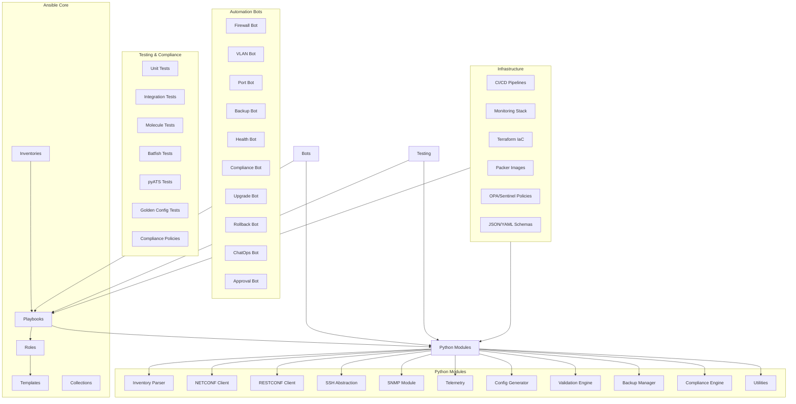
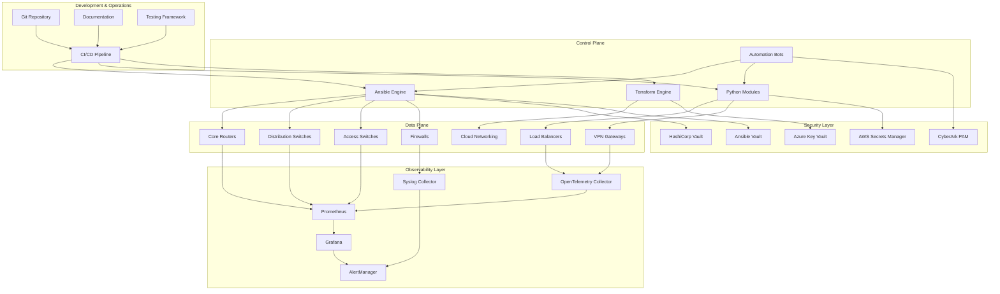
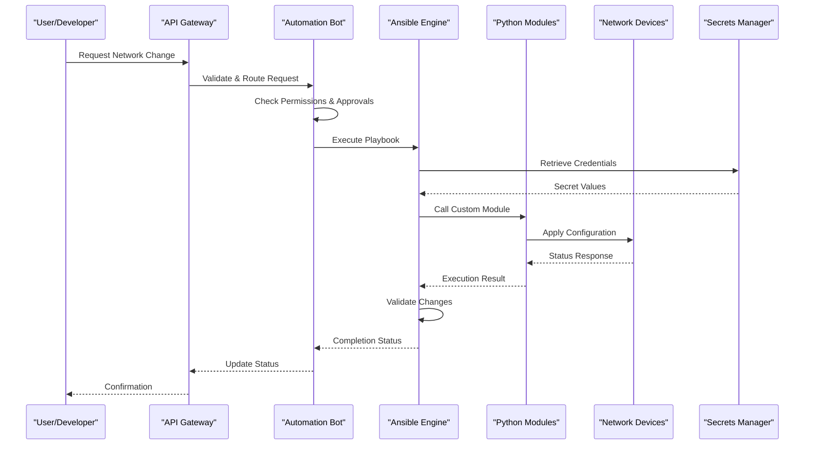
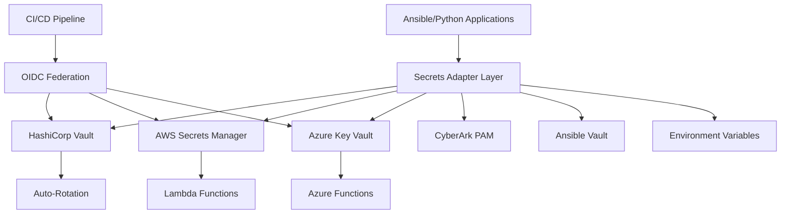
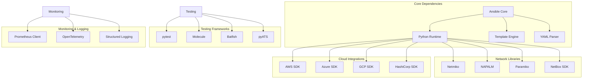

# Ansible Integration

<cite>
**Referenced Files in This Document**
- [README.md](file://README.md)
</cite>

## Table of Contents
1. [Introduction](#introduction)
2. [Project Structure](#project-structure)
3. [Core Components](#core-components)
4. [Architecture Overview](#architecture-overview)
5. [Detailed Component Analysis](#detailed-component-analysis)
6. [Dependency Analysis](#dependency-analysis)
7. [Performance Considerations](#performance-considerations)
8. [Troubleshooting Guide](#troubleshooting-guide)
9. [Conclusion](#conclusion)
10. [Appendices](#appendices)

## Introduction

The Enterprise Network Automation Platform represents a production-grade, vendor-agnostic network automation solution designed to manage thousands of network devices across multi-vendor, multi-region environments. The platform demonstrates how Fortune 100 organizations — banks, telecoms, and cloud-native enterprises — automate the full lifecycle of routers, switches, firewalls, load balancers, VPN gateways, and cloud networking components.

At its core, the platform implements Infrastructure as Code principles where every configuration, policy, template, test, pipeline, dashboard, and bot is stored in Git. Secrets are never committed, ensuring security while maintaining full automation capabilities. The Ansible integration serves as the primary automation engine for device management, working alongside Python modules, Terraform for cloud infrastructure, and various monitoring and compliance tools.

## Project Structure

The platform follows a well-organized directory structure that separates concerns and promotes reusability:



**Diagram sources**
- [README.md:105-180](file://README.md#L105-L180)

**Section sources**
- [README.md:103-180](file://README.md#L103-L180)

## Core Components

### Ansible Engine Architecture

The Ansible engine serves as the central orchestration layer, coordinating between multiple automation technologies and managing device configurations across diverse vendor ecosystems. The architecture emphasizes modularity, reusability, and maintainability through role-based design patterns.

#### Custom Modules and Extensions

The platform extends Ansible's capabilities through custom Python modules that provide specialized functionality for network automation tasks. These modules follow consistent patterns for error handling, logging, and retry logic.

#### Role-Based Automation Patterns

Roles encapsulate reusable automation logic for common network operations. Each role follows Ansible best practices with clear separation of concerns, making them portable across different environments and device types.

#### Workflow Orchestration Capabilities

The platform implements sophisticated workflow orchestration that coordinates complex multi-step processes involving multiple devices, validation checks, and rollback mechanisms.

**Section sources**
- [README.md:52-99](file://README.md#L52-L99)
- [README.md:184-200](file://README.md#L184-L200)

### Technology Stack Integration

The platform leverages a comprehensive technology stack optimized for enterprise-scale network automation:

| Layer | Technologies | Purpose |
|---|---|---|
| **Automation Engine** | Ansible, Python 3.11+, NAPALM, Netmiko, Nornir | Device configuration and state management |
| **Infrastructure as Code** | Terraform, Packer, Ansible | Cloud and infrastructure provisioning |
| **Protocols** | NETCONF, RESTCONF, SSH, SNMPv3, gRPC, Telemetry Streaming | Multi-protocol device communication |
| **Templates** | Jinja2, YAML structured data | Configuration generation and templating |
| **CI/CD** | GitHub Actions, pre-commit hooks | Automated testing and deployment |
| **Testing** | pytest, Molecule, ansible-lint, yamllint, Batfish, pyATS | Comprehensive test coverage |
| **Compliance** | Custom Python checks, OPA, Batfish ACL analysis | Policy enforcement and validation |
| **Monitoring** | Prometheus, Grafana, OpenTelemetry, Alertmanager, Syslog | Observability and alerting |
| **Secrets** | HashiCorp Vault, AWS Secrets Manager, Azure Key Vault, CyberArk, Ansible Vault | Secure credential management |
| **ChatOps** | Slack, Microsoft Teams, GitHub Actions | Team collaboration and notifications |

**Section sources**
- [README.md:184-200](file://README.md#L184-L200)

## Architecture Overview

The platform implements a layered architecture that separates concerns while enabling seamless integration between components:



**Diagram sources**
- [README.md:54-99](file://README.md#L54-L99)

## Detailed Component Analysis

### Ansible Engine Architecture

The Ansible engine serves as the primary automation orchestrator, managing device configurations through a combination of built-in modules, custom Python modules, and specialized roles.

#### Custom Module Development Pattern

Custom modules extend Ansible's functionality by providing specialized network automation capabilities. These modules follow consistent patterns for connection management, error handling, and result reporting.

#### Role-Based Design Implementation

Roles encapsulate reusable automation logic for common network operations. Each role follows Ansible best practices with clear separation of concerns, making them portable across different environments and device types.

#### Workflow Orchestration Engine

The platform implements sophisticated workflow orchestration that coordinates complex multi-step processes involving multiple devices, validation checks, and rollback mechanisms.



**Diagram sources**
- [README.md:460-476](file://README.md#L460-L476)
- [README.md:339-357](file://README.md#L339-L357)

### Playbook Catalogue Implementation

The platform provides comprehensive playbook coverage across all major network automation domains:

#### Device Lifecycle Management

Device lifecycle playbooks handle the complete journey from initial provisioning to decommissioning:

| Category | Playbooks | Purpose |
|---|---|---|
| **Initial Setup** | `initial_provisioning.yml`, `hostname.yml` | Bootstrap new devices with baseline configuration |
| **Authentication** | `aaa.yml`, `ssh_hardening.yml` | Configure AAA servers and SSH security policies |
| **Time Services** | `ntp.yml`, `dns.yml` | Set up time synchronization and DNS resolution |
| **Monitoring** | `snmp.yml`, `syslog.yml`, `certificates.yml` | Configure monitoring protocols and security certificates |
| **Branding** | `banners.yml` | Set login banners and MOTD messages |

#### Network Services Automation

Network services playbooks manage core switching and routing functions:

| Service | Playbooks | Functionality |
|---|---|---|
| **Layer 2** | `vlan.yml`, `trunk.yml`, `lacp.yml` | VLAN creation, trunk configuration, link aggregation |
| **Quality of Service** | `qos.yml` | Traffic prioritization and bandwidth management |
| **Security** | `acl.yml`, `firewall_rules.yml` | Access control lists and firewall policy deployment |
| **NAT & VPN** | `nat.yml`, `vpn.yml` | Network address translation and virtual private networks |

#### Routing Protocol Configuration

Routing protocol playbooks support industry-standard routing implementations:

| Protocol | Playbooks | Features |
|---|---|---|
| **OSPF** | `ospf.yml` | Area configuration, route summarization, authentication |
| **BGP** | `bgp.yml` | Peering establishment, policy application, route filtering |
| **IS-IS** | `isis.yml` | Level configuration, metric adjustment, redistribution |
| **Static Routes** | `static_routes.yml`, `loopbacks.yml` | Static route management and loopback interface configuration |

#### High Availability Implementations

High availability playbooks ensure network resilience through redundancy:

| Technology | Playbooks | Configuration |
|---|---|---|
| **VRRP** | `vrrp.yml` | Virtual Router Redundancy Protocol setup |
| **HSRP** | `hsrp.yml` | Hot Standby Router Protocol configuration |

#### Operational Task Automation

Operational playbooks handle routine maintenance and troubleshooting tasks:

| Operation | Playbooks | Description |
|---|---|---|
| **Backup & Restore** | `backup.yml`, `restore.yml` | Configuration backup and recovery procedures |
| **Firmware Management** | `firmware_upgrade.yml`, `firmware_rollback.yml` | Safe firmware upgrade and rollback processes |
| **Configuration Management** | `config_rollback.yml`, `golden_config.yml` | Configuration rollback and golden baseline application |
| **Compliance & Health** | `drift_detection.yml`, `compliance_scan.yml`, `health_check.yml` | Configuration drift detection, compliance scanning, health assessments |
| **Discovery & Inventory** | `inventory_collection.yml`, `neighbor_discovery.yml` | Device inventory collection and neighbor discovery |
| **License & Monitoring** | `license_validation.yml`, `monitoring_agents.yml` | License compliance and monitoring agent deployment |

**Section sources**
- [README.md:371-435](file://README.md#L371-L435)

### Inventory Design and Organization

The inventory system implements hierarchical organization by environment, role, region, and vendor to support large-scale multi-environment deployments:

```mermaid
graph TB
subgraph "Environment Hierarchy"
Prod[Production]
Staging[Staging]
Lab[Lab]
DR[Disaster Recovery]
end
subgraph "Role Categories"
CoreRouters[Core Routers]
DistSwitches[Distribution Switches]
AccessSwitches[Access Switches]
Firewalls[Firewalls]
WANEdge[WAN Edge]
InternetEdge[Internet Edge]
VPNGateways[VPN Gateways]
LoadBalancers[Load Balancers]
WirelessControllers[Wireless Controllers]
end
subgraph "Regional Organization"
USEast[US-East]
USWest[US-West]
EUWest[EU-West]
APAC[APAC]
end
Prod --> CoreRouters
Prod --> DistSwitches
Prod --> AccessSwitches
Prod --> Firewalls
Prod --> WANEdge
Prod --> InternetEdge
Prod --> VPNGateways
Prod --> LoadBalancers
Prod --> WirelessControllers
Prod --> USEast
Prod --> USWest
Prod --> EUWest
Prod --> APAC
Staging --> CoreRouters
Staging --> DistSwitches
Staging --> AccessSwitches
Lab --> CoreRouters
Lab --> DistSwitches
Lab --> AccessSwitches
DR --> CoreRouters
DR --> Firewalls
DR --> VPNGateways
```



Each inventory entry defines comprehensive device metadata including connectivity information, vendor specifications, platform details, and organizational attributes.

**Section sources**
- [README.md:284-335](file://README.md#L284-L335)

### Python Modules Architecture

The Python module ecosystem provides extensible functionality for complex network automation scenarios:

#### Core Module Categories

| Module Category | Purpose | Key Features |
|---|---|---|
| **Inventory Management** | Device discovery and CMDB integration | Dynamic inventory parsing, device enrichment, relationship mapping |
| **Protocol Clients** | Multi-protocol device communication | NETCONF client with capability negotiation, RESTCONF client with YANG support |
| **Transport Layer** | Connection management and reliability | SSH abstraction over Netmiko/Paramiko with retry logic, SNMPv3 polling |
| **Data Processing** | Configuration generation and validation | Jinja2-based config generation, pre-deployment validation, syntax checking |
| **Operations** | Backup, compliance, and utilities | Versioned backup management, pluggable compliance engine, bulk operations |

#### Module Integration Patterns

All Python modules follow consistent design patterns including type hints, comprehensive docstrings, unit test coverage, and standardized error handling.

**Section sources**
- [README.md:438-456](file://README.md#L438-L456)

### Automation Bots Framework

The bots framework exposes REST APIs and optional ChatOps integrations for self-service network operations:

#### Bot Architecture

```mermaid
classDiagram
class BaseBot {
+string name
+string version
+validate_request(request) bool
+execute_operation(operation) Result
+handle_error(error) ErrorResponse
+log_activity(activity) void
}
class FirewallBot {
+create_rule(rule) Rule
+delete_rule(rule_id) bool
+update_rule(rule_id, rule) Rule
+validate_rules(rules) ValidationResult
}
class VLANBot {
+provision_vlan(vlan_data) VLAN
+modify_vlan(vlan_id, changes) VLAN
+deprovision_vlan(vlan_id) bool
+get_vlan_status(vlan_id) Status
}
class PortBot {
+configure_port(port_data) Port
+enable_port(port_id) bool
+disable_port(port_id) bool
+get_port_status(port_id) Status
}
class BackupBot {
+trigger_backup(device_id) BackupJob
+schedule_backup(schedule) Schedule
+restore_backup(backup_id) bool
+list_backups(device_id) Backup[]
}
class HealthBot {
+check_device_health(device_id) HealthStatus
+run_comprehensive_health() HealthReport
+get_device_metrics(device_id) Metrics
}
class ComplianceBot {
+scan_compliance(target) ComplianceReport
+generate_report(report_type) Report
+enforce_policy(policy) EnforcementResult
}
class UpgradeBot {
+plan_upgrade(upgrade_plan) UpgradePlan
+execute_upgrade(plan) UpgradeResult
+rollback_upgrade(plan) RollbackResult
}
class RollbackBot {
+identify_target_version(version) VersionInfo
+apply_rollback(version) RollbackResult
+verify_rollback() VerificationResult
}
class ChatOpsBot {
+process_command(command) CommandResult
+route_to_bot(bot_name, command) BotResult
+format_response(result) FormattedResponse
}
class ApprovalBot {
+submit_approval_request(request) ApprovalRequest
+approve_request(request_id) bool
+reject_request(request_id, reason) bool
+get_pending_approvals() ApprovalRequest[]
}
BaseBot <|-- FirewallBot
BaseBot <|-- VLANBot
BaseBot <|-- PortBot
BaseBot <|-- BackupBot
BaseBot <|-- HealthBot
BaseBot <|-- ComplianceBot
BaseBot <|-- UpgradeBot
BaseBot <|-- RollbackBot
BaseBot <|-- ChatOpsBot
BaseBot <|-- ApprovalBot
```



**Diagram sources**
- [README.md:460-476](file://README.md#L460-L476)

Each bot provides specialized endpoints for specific network operations while maintaining consistent authentication, authorization, and audit logging patterns.

**Section sources**
- [README.md:460-476](file://README.md#L460-L476)

### Secrets Integration Architecture

The platform implements a comprehensive secrets management strategy with no credentials ever stored in Git:

#### Secrets Backend Support



#### Secret Rotation Policies

| Secret Type | Rotation Interval | Method |
|---|---|---|
| Device passwords | 90 days | Vault auto-rotation + Ansible push |
| API tokens | 30 days | Secrets Manager + Lambda/Function |
| SSH keys | 90 days | Vault SSH CA with short-lived certs |
| TLS certificates | 1 year (auto-renew at 60 days) | ACME / Vault PKI |
| CI/CD tokens | Ephemeral | OIDC federation (no static secrets) |

**Section sources**
- [README.md:339-368](file://README.md#L339-L368)

## Dependency Analysis

The platform implements a modular dependency structure that promotes loose coupling and high cohesion:



**Diagram sources**
- [README.md:184-200](file://README.md#L184-L200)

### Component Coupling Analysis

The architecture minimizes coupling through well-defined interfaces and event-driven communication patterns. Components communicate through standardized APIs and message queues rather than direct dependencies.

### External Integration Points

The platform integrates with external systems through secure, authenticated connections with proper error handling and fallback mechanisms.

**Section sources**
- [README.md:184-200](file://README.md#L184-L200)

## Performance Considerations

The platform implements several performance optimization strategies for large-scale network automation:

### Parallel Execution Strategies

- **Concurrent Device Management**: Ansible parallelism configured per device group to optimize throughput
- **Connection Pooling**: Persistent connections to reduce authentication overhead
- **Batch Operations**: Grouped configuration changes to minimize API calls
- **Asynchronous Processing**: Non-blocking operations for long-running tasks

### Memory and Resource Optimization

- **Lazy Loading**: Deferred loading of large configuration datasets
- **Streaming Processing**: Real-time processing of telemetry and log data
- **Resource Cleanup**: Automatic cleanup of temporary files and connections
- **Memory Pooling**: Reuse of expensive objects like database connections

### Scalability Patterns

- **Horizontal Scaling**: Stateless automation workers that can be scaled independently
- **Queue-Based Processing**: Message queues for decoupled task processing
- **Caching Layers**: Redis-based caching for frequently accessed data
- **Load Balancing**: Distribution of automation workloads across multiple workers

## Troubleshooting Guide

Common issues and their resolutions are documented for efficient problem-solving:

### Connection and Authentication Issues

| Issue | Symptoms | Resolution |
|---|---|---|
| Ansible connection timeout | Connection failures, timeout errors | Verify SSH reachability: `ansible all -m ping -i inventories/lab/hosts.yml` |
| Authentication failures | Permission denied, invalid credentials | Check Vault authentication, verify device credentials rotation |
| SSL/TLS certificate errors | Certificate verification failures | Update CA certificates, verify certificate chain validity |

### Template and Configuration Issues

| Issue | Symptoms | Resolution |
|---|---|---|
| Template rendering errors | Jinja2 syntax errors, undefined variables | Check Jinja2 syntax: `python -m python.config_gen --debug --device <name>` |
| Variable conflicts | Unexpected configuration values | Review variable precedence, check group_vars and host_vars hierarchy |
| Vendor-specific issues | Platform-specific configuration failures | Verify vendor platform detection, check vendor-specific templates |

### Testing and Validation Issues

| Issue | Symptoms | Resolution |
|---|---|---|
| Compliance check failure | Policy violations detected | Review `compliance/` policies and device running config diff |
| CI pipeline failure | Build or test failures | Check GitHub Actions logs; most failures include actionable error messages |
| Molecule test failure | Container or role test failures | Ensure Docker/Podman is running; check `molecule/default/molecule.yml` |
| Batfish analysis error | Network simulation failures | Validate Batfish snapshot in `tests/batfish/snapshots/` |

### Secrets and Security Issues

| Issue | Symptoms | Resolution |
|---|---|---|
| Vault authentication failure | Cannot retrieve secrets | Verify OIDC token or AppRole credentials; check Vault policies |
| Secret rotation problems | Expired credentials, failed rotations | Check rotation schedules, verify backend connectivity |
| Permission denied errors | Insufficient access rights | Review IAM policies, update service account permissions |

**Section sources**
- [README.md:674-685](file://README.md#L674-L685)

## Conclusion

The Enterprise Network Automation Platform demonstrates a comprehensive approach to network automation using Ansible as the central orchestration engine. The platform successfully addresses the complexity of managing thousands of network devices across multi-vendor, multi-region environments through:

- **Modular Architecture**: Clean separation of concerns with reusable components
- **Vendor Agnostic Design**: Consistent automation across diverse network equipment
- **Security-First Approach**: Comprehensive secrets management and compliance enforcement
- **Scalable Operations**: Horizontal scaling and performance optimization for enterprise scale
- **DevSecOps Integration**: Automated testing, compliance, and security throughout the development lifecycle

The platform's success lies in its ability to balance flexibility with standardization, allowing teams to customize automation workflows while maintaining consistency and compliance across the entire network infrastructure.

## Appendices

### Quick Start Commands

For immediate hands-on experience with the platform:

```bash
# Environment validation
python scripts/validate_environment.py

# Run compliance scan against lab devices
ansible-playbook playbooks/compliance_scan.yml \
  -i inventories/lab/hosts.yml \
  --check --diff

# Generate configuration for a device
python -m python.config_gen --device core-rtr-01 --output ./output/

# Execute unit tests
pytest tests/unit/ -v

# Run compliance checks locally
python -m python.compliance --inventory inventories/lab/hosts.yml
```

### Supported Vendor Matrix

The platform supports comprehensive vendor coverage across on-premises and cloud platforms:

| Vendor | Platforms | Protocols | Status |
|---|---|---|---|
| **Cisco** | IOS, IOS-XE, NX-OS | SSH, NETCONF, RESTCONF | ✅ Supported |
| **Juniper** | SRX, MX | SSH, NETCONF | ✅ Supported |
| **Arista** | EOS | SSH, eAPI, NETCONF | ✅ Supported |
| **Palo Alto** | PAN-OS | SSH, API | ✅ Supported |
| **Fortinet** | FortiOS | SSH, API | ✅ Supported |
| **Check Point** | Gaia | SSH, API | ✅ Supported |
| **F5** | BIG-IP | SSH, iControl REST | ✅ Supported |
| **pfSense** | FreeBSD-based | SSH, API | ✅ Supported |
| **OPNsense** | FreeBSD-based | SSH, API | ✅ Supported |

**Section sources**
- [README.md:203-226](file://README.md#L203-L226)