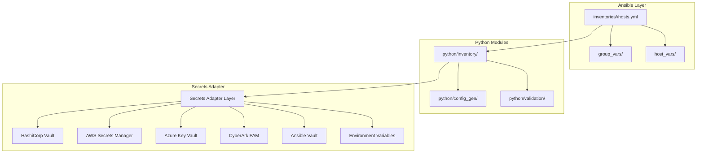
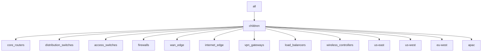
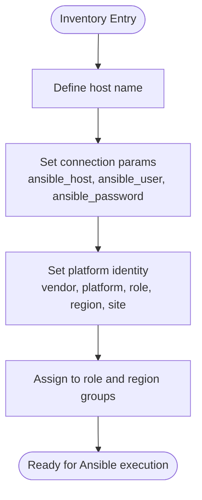
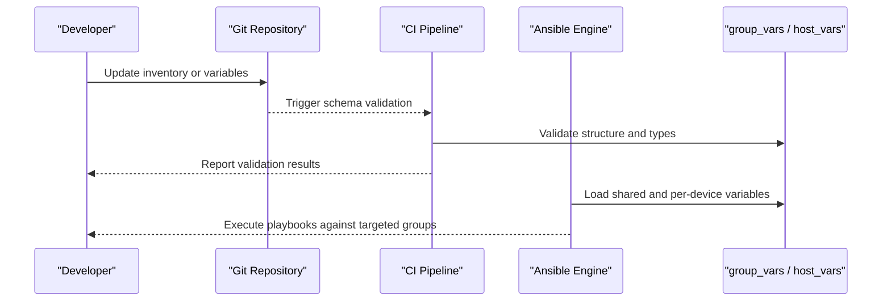
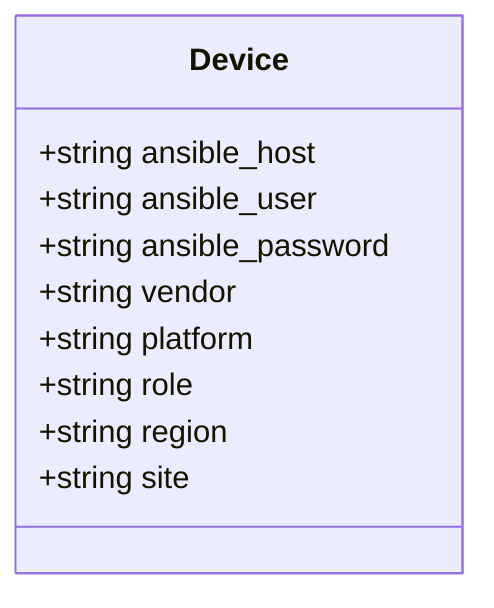
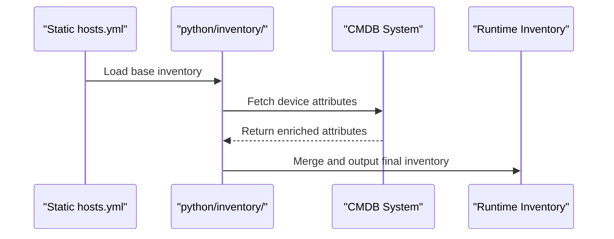
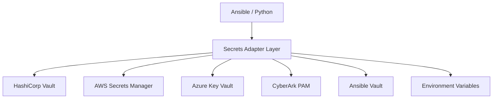
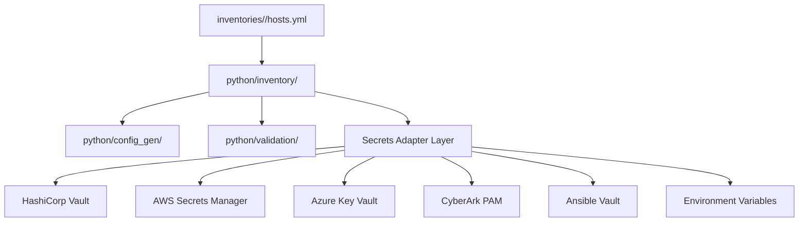

# Inventory Management

<cite>
**Referenced Files in This Document**
- [README.md](file://README.md)
</cite>

## Table of Contents
1. [Introduction](#introduction)
2. [Project Structure](#project-structure)
3. [Core Components](#core-components)
4. [Architecture Overview](#architecture-overview)
5. [Detailed Component Analysis](#detailed-component-analysis)
6. [Dependency Analysis](#dependency-analysis)
7. [Performance Considerations](#performance-considerations)
8. [Troubleshooting Guide](#troubleshooting-guide)
9. [Conclusion](#conclusion)
10. [Appendices](#appendices)

## Introduction
This document explains the Ansible inventory management system within the Enterprise Network Automation Platform. It covers the hierarchical design by environment, role, region, and vendor/platform; the file structure including hosts.yml format, group definitions, host-specific variables, and shared group variables; the device attribute model; enrichment from CMDB systems; dynamic inventory generation; secrets integration for credential handling; and scaling strategies for thousands of devices across multiple environments.

## Project Structure
The repository organizes inventories per environment under a dedicated directory, with shared variables grouped by device groups and per-device variables stored separately. The top-level layout includes inventories, group_vars, host_vars, playbooks, roles, templates, collections, Python modules (including an inventory module), bots, tests, compliance, pipelines, monitoring, terraform, packer, policies, schemas, examples, scripts, docs, images, and GitHub Actions workflows.

```mermaid
graph TB
Root["Repository Root"] --> Inventories["inventories/"]
Root --> GroupVars["group_vars/"]
Root --> HostVars["host_vars/"]
Root --> Playbooks["playbooks/"]
Root --> Roles["roles/"]
Root --> Templates["templates/"]
Root --> Collections["collections/"]
Root --> Python["python/"]
Root --> Bots["bots/"]
Root --> Tests["tests/"]
Root --> Compliance["compliance/"]
Root --> Pipelines["pipelines/"]
Root --> Monitoring["monitoring/"]
Root --> Terraform["terraform/"]
Root --> Packer["packer/"]
Root --> Policies["policies/"]
Root --> Schemas["schemas/"]
Root --> Examples["examples/"]
Root --> Scripts["scripts/"]
Root --> Docs["docs/"]
Root --> Images["images/"]
Root --> GitHubActions[".github/workflows/"]
Inventories --> Prod["production/"]
Inventories --> Staging["staging/"]
Inventories --> Lab["lab/"]
Inventories --> DR["dr/"]
```

**Diagram sources**
- [README.md:103-180](file://README.md#L103-L180)

**Section sources**
- [README.md:103-180](file://README.md#L103-L180)

## Core Components
- Hierarchical organization: Devices are organized by environment (production, staging, lab, dr), role (core routers, distribution switches, access switches, firewalls, WAN edge, internet edge, VPN gateways, load balancers, wireless controllers), region (us-east, us-west, eu-west, apac), and vendor/platform combinations.
- File structure:
  - inventories/<env>/hosts.yml defines the inventory tree and host attributes.
  - group_vars contains shared variables by device group.
  - host_vars contains per-device variables.
- Device attribute model:
  - Connection parameters include ansible_host and related connection settings.
  - Platform identification includes vendor, platform, role, region, site.
- Enrichment and dynamic inventory:
  - Python inventory module supports parsing, device enrichment, and CMDB integration.
- Secrets integration:
  - A secrets adapter layer integrates HashiCorp Vault, AWS Secrets Manager, Azure Key Vault, CyberArk, Ansible Vault, and environment variables.

**Section sources**
- [README.md:284-336](file://README.md#L284-L336)
- [README.md:438-456](file://README.md#L438-L456)
- [README.md:339-368](file://README.md#L339-L368)

## Architecture Overview
The inventory architecture spans static YAML inventories per environment, shared variable directories, and Python-based enrichment and dynamic inventory capabilities. Secrets are resolved via a unified adapter layer to support multiple backends.

**Diagram sources**
- [README.md:103-180](file://README.md#L103-L180)
- [README.md:284-336](file://README.md#L284-L336)
- [README.md:438-456](file://README.md#L438-L456)
- [README.md:339-368](file://README.md#L339-L368)

## Detailed Component Analysis

### Inventory Hierarchy and Groups
- Environment hierarchy: production, staging, lab, dr.
- Role groups: core_routers, distribution_switches, access_switches, firewalls, wan_edge, internet_edge, vpn_gateways, load_balancers, wireless_controllers.
- Region groups: us-east, us-west, eu-west, apac.
- Vendor/platform combinations are expressed through device attributes such as vendor and platform.

**Diagram sources**
- [README.md:284-336](file://README.md#L284-L336)

**Section sources**
- [README.md:284-336](file://README.md#L284-L336)

### hosts.yml Format and Device Attributes
- hosts.yml defines the inventory tree and per-host attributes.
- Example attributes include ansible_host, vendor, platform, role, region, site.
- These attributes drive template rendering and playbook targeting.

**Diagram sources**
- [README.md:311-335](file://README.md#L311-L335)

**Section sources**
- [README.md:311-335](file://README.md#L311-L335)

### Shared Group Variables and Per-Device Variables
- group_vars provides shared variables by device group (e.g., common NTP servers, SNMP communities, AAA settings).
- host_vars provides per-device overrides (e.g., unique IPs, serial numbers, site-specific settings).
- Schema validation is enforced for inventory, group_vars, and host_vars during CI.

**Diagram sources**
- [README.md:103-180](file://README.md#L103-L180)
- [README.md:522-528](file://README.md#L522-L528)

**Section sources**
- [README.md:103-180](file://README.md#L103-L180)
- [README.md:522-528](file://README.md#L522-L528)

### Device Attribute Model
- Connection parameters: ansible_host, ansible_user, ansible_password.
- Platform identification: vendor, platform, role, region, site.
- Operational metadata can be added as needed (e.g., loopback addresses, routing protocol parameters).

**Diagram sources**
- [README.md:311-335](file://README.md#L311-L335)

**Section sources**
- [README.md:311-335](file://README.md#L311-L335)

### Inventory Enrichment and Dynamic Inventory
- Python inventory module supports parsing, device enrichment, and CMDB integration.
- Use cases:
  - Enrich static inventories with additional attributes sourced from CMDB systems.
  - Generate dynamic inventories at runtime based on external data sources.
  - Combine static and dynamic sources for flexible targeting.

**Diagram sources**
- [README.md:438-456](file://README.md#L438-L456)

**Section sources**
- [README.md:438-456](file://README.md#L438-L456)

### Secrets Integration for Credential Handling
- No secrets are stored in Git.
- Secrets adapter layer integrates multiple backends: HashiCorp Vault, AWS Secrets Manager, Azure Key Vault, CyberArk, Ansible Vault, and environment variables.
- Rotation policies define intervals and methods for different secret types.

**Diagram sources**
- [README.md:339-368](file://README.md#L339-L368)

**Section sources**
- [README.md:339-368](file://README.md#L339-L368)

### Scaling Strategies for Thousands of Devices
- Organize by environment, role, region, and vendor/platform to enable precise targeting and parallel execution.
- Use group_vars for shared configuration and host_vars for device-specific overrides to minimize duplication.
- Leverage Python inventory module for enrichment and dynamic generation to avoid manual maintenance overhead.
- Integrate secrets adapter to centralize credential management and rotation.
- Apply schema validation in CI to ensure consistency and correctness at scale.

[No sources needed since this section provides general guidance]

## Dependency Analysis
The inventory system depends on:
- Static YAML files for base topology and attributes.
- Python modules for parsing, enrichment, and dynamic generation.
- Secrets adapter for secure credential resolution.
- CI pipeline for schema validation and compliance checks.

**Diagram sources**
- [README.md:103-180](file://README.md#L103-L180)
- [README.md:284-336](file://README.md#L284-L336)
- [README.md:438-456](file://README.md#L438-L456)
- [README.md:339-368](file://README.md#L339-L368)

**Section sources**
- [README.md:103-180](file://README.md#L103-L180)
- [README.md:284-336](file://README.md#L284-L336)
- [README.md:438-456](file://README.md#L438-L456)
- [README.md:339-368](file://README.md#L339-L368)

## Performance Considerations
- Target specific groups and regions to reduce execution scope.
- Use parallelism in Ansible where supported to speed up large-scale operations.
- Centralize shared variables in group_vars to minimize redundant processing.
- Prefer dynamic inventory generation for frequently changing environments to keep static files lean.
- Validate inventories early in CI to catch errors before deployment.

[No sources needed since this section provides general guidance]

## Troubleshooting Guide
Common issues and resolutions:
- Ansible connection timeout: Verify SSH reachability using ping against the target inventory.
- Template rendering error: Debug Jinja2 rendering with the configuration generator tool.
- Compliance check failure: Review compliance policies and device running config diffs.
- CI pipeline failure: Check GitHub Actions logs for actionable error messages.
- Vault authentication failure: Verify OIDC token or AppRole credentials and Vault policies.
- Molecule test failure: Ensure Docker/Podman is running and review molecule configuration.
- Batfish analysis error: Validate Batfish snapshots in the tests directory.

**Section sources**
- [README.md:674-685](file://README.md#L674-L685)

## Conclusion
The inventory management system combines a clear hierarchical design with robust variable scoping, Python-based enrichment, and secure secrets integration. This approach enables scalable, maintainable automation across thousands of devices in multi-vendor, multi-region environments while enforcing compliance and operational reliability.

[No sources needed since this section summarizes without analyzing specific files]

## Appendices

### Quick Reference: Inventory Usage Examples
- Dry-run compliance scan against lab devices using the lab inventory.
- Run compliance checks locally against a specified inventory path.
- Bootstrap new devices with initial provisioning playbooks.

**Section sources**
- [README.md:266-280](file://README.md#L266-L280)
- [README.md:376-386](file://README.md#L376-L386)