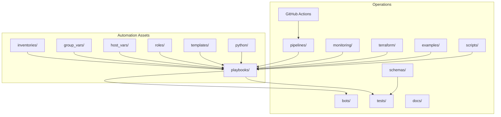
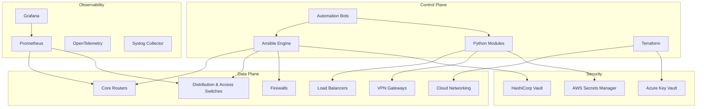
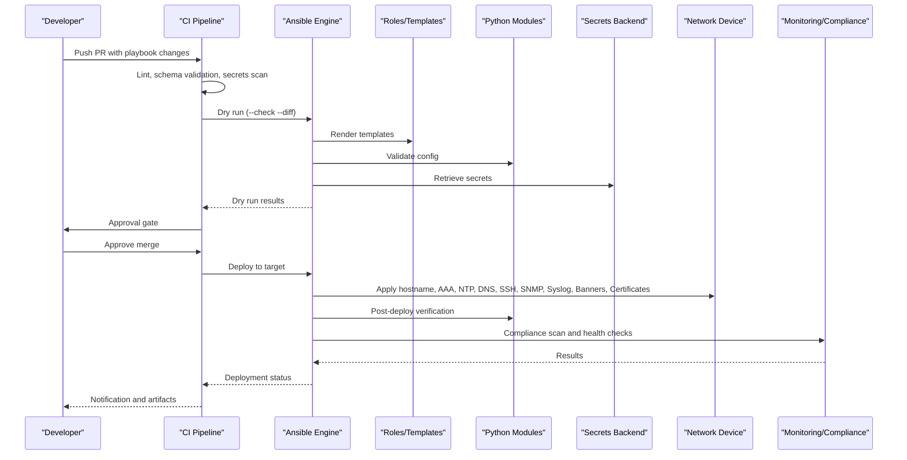
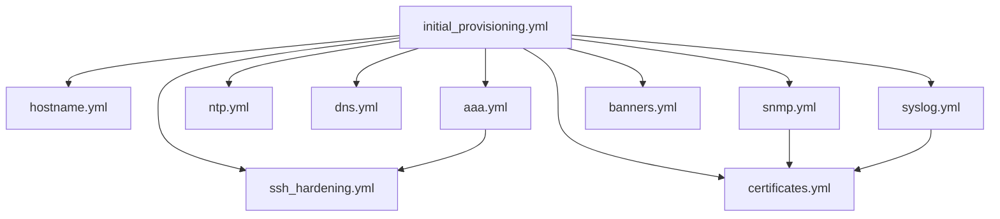

# Device Lifecycle Playbooks

<cite>
**Referenced Files in This Document**
- [README.md](file://README.md)
</cite>

## Table of Contents
1. [Introduction](#introduction)
2. [Project Structure](#project-structure)
3. [Core Components](#core-components)
4. [Architecture Overview](#architecture-overview)
5. [Detailed Component Analysis](#detailed-component-analysis)
6. [Dependency Analysis](#dependency-analysis)
7. [Performance Considerations](#performance-considerations)
8. [Troubleshooting Guide](#troubleshooting-guide)
9. [Conclusion](#conclusion)
10. [Appendices](#appendices)

## Introduction
This document provides comprehensive playbooks for device lifecycle management within the Enterprise Network Automation Platform. It focuses on bootstrap and initial configuration playbooks that establish a secure, compliant baseline across multi-vendor devices. The content covers purpose, required variables from inventories/group_vars/host_vars, execution commands with examples, dependencies, integration points with Python modules and secrets management, error handling strategies, rollback mechanisms, and practical orchestration workflows including validation and verification steps.

The platform follows GitOps principles, enforces compliance at every stage, and integrates with multiple secrets backends. Playbooks are designed to be vendor-agnostic where possible and leverage roles, templates, and Python modules for robust automation.

## Project Structure
The repository organizes automation assets by environment, role, and function:
- inventories: per-environment device inventories (production, staging, lab, dr)
- group_vars and host_vars: shared and per-device variables
- playbooks: Ansible playbooks for operations including device lifecycle
- roles: reusable Ansible roles
- templates: Jinja2 templates per vendor
- python: typed, documented Python modules for inventory, SSH, SNMP, config generation, validation, backup, compliance, and utilities
- bots: automation bots exposing REST APIs and ChatOps integrations
- tests: unit, integration, molecule, batfish, pyATS, golden config
- pipelines: CI/CD workflow definitions
- monitoring: Prometheus, Grafana, OpenTelemetry, Alertmanager
- terraform: cloud networking IaC
- schemas: JSON/YAML schemas for validation
- examples: usage examples and sample workflows
- scripts: utility and bootstrap scripts
- docs: extended documentation
- images: architecture diagrams and screenshots
- .github/workflows: GitHub Actions workflows

**Diagram sources**
- [README.md:103-180](file://README.md#L103-L180)

**Section sources**
- [README.md:103-180](file://README.md#L103-L180)

## Core Components
Device lifecycle playbooks provide foundational configuration and security hardening for new devices. The following playbooks are part of the device lifecycle set:
- initial_provisioning.yml: complete device bootstrapping (hostname, AAA, NTP, DNS, SSH hardening, SNMPv3, syslog, banners)
- hostname.yml: dynamic hostname assignment from inventory
- aaa.yml: TACACS+/RADIUS authentication setup
- ntp.yml: NTP server configuration
- dns.yml: DNS resolver configuration
- snmp.yml: SNMPv3 security configuration
- syslog.yml: log forwarding setup
- ssh_hardening.yml: SSH security hardening
- certificates.yml: TLS certificate deployment
- banners.yml: login/MOTD banner configuration

These playbooks integrate with:
- Inventories/group_vars/host_vars for structured device data
- Roles and Jinja2 templates for vendor-specific configuration generation
- Python modules for validation, config generation, SSH connectivity, SNMP polling, and compliance checks
- Secrets backends (Vault, AWS Secrets Manager, Azure Key Vault, CyberArk, Ansible Vault) for sensitive data
- CI/CD pipelines for validation, dry runs, approvals, and automated deployments
- Monitoring and observability systems for post-deploy verification

Execution examples:
- Run initial provisioning against lab devices: ansible-playbook playbooks/initial_provisioning.yml -i inventories/lab/hosts.yml
- Set hostname for a specific device: ansible-playbook playbooks/hostname.yml -l <device>
- Configure AAA: ansible-playbook playbooks/aaa.yml
- Configure NTP: ansible-playbook playbooks/ntp.yml
- Configure DNS: ansible-playbook playbooks/dns.yml
- Configure SNMPv3: ansible-playbook playbooks/snmp.yml
- Configure Syslog: ansible-playbook playbooks/syslog.yml
- Harden SSH: ansible-playbook playbooks/ssh_hardening.yml
- Deploy TLS certificates: ansible-playbook playbooks/certificates.yml
- Set banners: ansible-playbook playbooks/banners.yml

**Section sources**
- [README.md:371-386](file://README.md#L371-L386)

## Architecture Overview
The automation engine orchestrates device lifecycle operations using Ansible as the primary control plane, supported by Python modules for advanced tasks. Devices are managed via SSH, NETCONF, RESTCONF, or vendor APIs depending on platform capabilities. Secrets are retrieved securely from configured backends. Post-deploy verification uses monitoring and compliance tools to ensure desired state.

**Diagram sources**
- [README.md:54-99](file://README.md#L54-L99)

## Detailed Component Analysis

### initial_provisioning.yml
Purpose:
- Orchestrates complete device bootstrap including hostname, AAA, NTP, DNS, SSH hardening, SNMPv3, syslog, and banners.
- Ensures a secure, compliant baseline before applying service-specific configurations.

Required variables:
- From inventories/group_vars/host_vars: device identifiers, vendor/platform, region/site, network parameters (NTP servers, DNS resolvers), AAA endpoints and credentials, SNMPv3 users and auth/crypto settings, syslog destinations, banner text, SSH hardening options, certificate paths or ACME/Vault references.

Execution command example:
- ansible-playbook playbooks/initial_provisioning.yml -i inventories/lab/hosts.yml

Dependencies:
- hostname.yml, aaa.yml, ntp.yml, dns.yml, ssh_hardening.yml, snmp.yml, syslog.yml, banners.yml, certificates.yml (as included tasks or roles).

Integration points:
- Python modules: config_gen for template rendering, validation for pre/post checks, ssh for connectivity, snmp for verification, compliance for policy enforcement.
- Secrets management: Vault/AWS/Azure/CyberArk/Ansible Vault for passwords, keys, tokens.

Error handling:
- Fail-fast on critical misconfigurations; retry transient failures; capture diffs; emit logs to centralized collectors.

Rollback mechanism:
- Pre-change backup via backup.yml; automatic rollback on failure using config_rollback.yml; verify post-rollback state.

Validation and verification:
- Schema validation of variables; dry-run with --check --diff; post-deploy health checks and compliance scan.

Practical orchestration example:
- Stage 1: Validate variables and render configs (dry run).
- Stage 2: Apply hostname, AAA, NTP, DNS, SSH hardening.
- Stage 3: Apply SNMPv3, syslog, banners, certificates.
- Stage 4: Verify connectivity, authentication, time sync, logging, and compliance.

**Section sources**
- [README.md:371-386](file://README.md#L371-L386)

### hostname.yml
Purpose:
- Assigns device hostname dynamically based on inventory data (site, role, region).

Required variables:
- hostname pattern or explicit hostname; site, role, region tags; vendor/platform for template selection.

Execution command example:
- ansible-playbook playbooks/hostname.yml -l <device>

Dependencies:
- None (standalone); can be invoked by initial_provisioning.yml.

Integration points:
- Python modules: config_gen for template rendering; validation for hostname format checks.

Error handling:
- Validate hostname uniqueness and naming conventions; fail if invalid.

Rollback mechanism:
- Revert to previous hostname via config_rollback.yml if needed.

Validation and verification:
- Check running-config hostname matches expected; update CMDB/inventory if applicable.

**Section sources**
- [README.md:371-386](file://README.md#L371-L386)

### aaa.yml
Purpose:
- Configures TACACS+/RADIUS authentication and authorization for administrative access.

Required variables:
- AAA server addresses, ports, shared secrets, key rotation schedule; local fallback accounts; method lists; privilege escalation settings.

Execution command example:
- ansible-playbook playbooks/aaa.yml

Dependencies:
- ssh_hardening.yml (to enforce SSH-only admin access); certificates.yml (if using TLS for AAA).

Integration points:
- Python modules: ssh for connectivity; validation for syntax and policy checks; compliance for AAA enforcement.
- Secrets management: Vault/AWS/Azure/CyberArk for shared secrets and credentials.

Error handling:
- Ensure no lockout by configuring local fallback; test AAA reachability before enabling; roll back if authentication fails.

Rollback mechanism:
- config_rollback.yml to restore prior AAA settings.

Validation and verification:
- Post-deploy login test using non-privileged account; verify AAA accounting/logging.

**Section sources**
- [README.md:371-386](file://README.md#L371-L386)

### ntp.yml
Purpose:
- Configures NTP servers for accurate time synchronization across devices.

Required variables:
- NTP server list, preferred source interface, timezone, NTP authentication keys (optional).

Execution command example:
- ansible-playbook playbooks/ntp.yml

Dependencies:
- None (standalone); can be invoked by initial_provisioning.yml.

Integration points:
- Python modules: ssh for connectivity; validation for NTP syntax; compliance for NTP presence.

Error handling:
- Validate server reachability; handle partial failures gracefully; log NTP status.

Rollback mechanism:
- config_rollback.yml to revert NTP changes.

Validation and verification:
- Query device time source; confirm peers are synchronized; alert if drift exceeds threshold.

**Section sources**
- [README.md:371-386](file://README.md#L371-L386)

### dns.yml
Purpose:
- Configures DNS resolvers and search domains for name resolution.

Required variables:
- DNS server list, search domains, DNS over TLS/HTTPS options (if supported), timeout/retry settings.

Execution command example:
- ansible-playbook playbooks/dns.yml

Dependencies:
- None (standalone); can be invoked by initial_provisioning.yml.

Integration points:
- Python modules: ssh for connectivity; validation for DNS syntax; compliance for DNS presence.

Error handling:
- Validate resolvability of AAA/NTP/Syslog hosts; fail fast if critical services cannot resolve.

Rollback mechanism:
- config_rollback.yml to revert DNS changes.

Validation and verification:
- Test name resolution for critical endpoints; verify DNS query logs if available.

**Section sources**
- [README.md:371-386](file://README.md#L371-L386)

### snmp.yml
Purpose:
- Configures SNMPv3 with strong security (auth and privacy), read/write communities/users, and trap destinations.

Required variables:
- SNMPv3 users, auth protocol/password, privacy protocol/password, access views, trap receivers, logging level.

Execution command example:
- ansible-playbook playbooks/snmp.yml

Dependencies:
- certificates.yml (if using TLS for SNMP transport); syslog.yml (for trap logging).

Integration points:
- Python modules: snmp for polling/traps; validation for SNMPv3 policy; compliance for SNMPv3 enforcement.
- Secrets management: Vault/AWS/Azure/CyberArk for SNMPv3 credentials.

Error handling:
- Ensure no SNMPv1/v2c enabled; validate user permissions; test trap delivery.

Rollback mechanism:
- config_rollback.yml to revert SNMP settings.

Validation and verification:
- Poll OID metrics via SNMPv3; verify traps received by collector; check compliance report.

**Section sources**
- [README.md:371-386](file://README.md#L371-L386)

### syslog.yml
Purpose:
- Configures log forwarding to centralized syslog collectors with appropriate facilities and severity levels.

Required variables:
- Syslog server addresses, ports, protocols (UDP/TCP/TLS), facility/severity mappings, source interface, formatting options.

Execution command example:
- ansible-playbook playbooks/syslog.yml

Dependencies:
- certificates.yml (if using TLS for syslog transport).

Integration points:
- Python modules: ssh for connectivity; validation for syslog syntax; compliance for logging presence.
- Monitoring: Syslog collector ingestion and indexing.

Error handling:
- Validate server reachability; handle partial failures; log forwarding errors.

Rollback mechanism:
- config_rollback.yml to revert syslog settings.

Validation and verification:
- Confirm logs appear in collector; verify message structure and timestamps.

**Section sources**
- [README.md:371-386](file://README.md#L371-L386)

### ssh_hardening.yml
Purpose:
- Hardens SSH configuration to meet security standards (e.g., disable weak ciphers, enforce key-based auth, limit sessions).

Required variables:
- Allowed ciphers/mac/kex algorithms, SSH port, idle timeout, session limits, banner display, logging verbosity.

Execution command example:
- ansible-playbook playbooks/ssh_hardening.yml

Dependencies:
- aaa.yml (to ensure admin access remains functional after hardening).

Integration points:
- Python modules: ssh for connectivity; validation for cipher policy; compliance for SSH-only enforcement.
- Secrets management: Vault/AWS/Azure/CyberArk for SSH keys and passphrases.

Error handling:
- Prevent lockouts by testing connectivity before applying; maintain local console access; roll back immediately on failure.

Rollback mechanism:
- config_rollback.yml to restore prior SSH settings.

Validation and verification:
- Attempt SSH connection with hardened settings; verify only approved ciphers are used; check logs for denied attempts.

**Section sources**
- [README.md:371-386](file://README.md#L371-L386)

### certificates.yml
Purpose:
- Deploys TLS certificates for HTTPS, API, or encrypted transports (syslog, SNMP, etc.).

Required variables:
- Certificate authority, certificate/key paths, ACME/Vault PKI settings, renewal policies, trust anchors.

Execution command example:
- ansible-playbook playbooks/certificates.yml

Dependencies:
- ssh_hardening.yml (for HTTPS-enabled management planes); syslog.yml/snmp.yml (for TLS transports).

Integration points:
- Python modules: ssh for connectivity; validation for certificate validity; compliance for approved ciphers.
- Secrets management: Vault/AWS/Azure/CyberArk for private keys and CA bundles.

Error handling:
- Validate certificate chain and expiration; handle partial deployments; avoid disrupting existing connections.

Rollback mechanism:
- config_rollback.yml to revert certificate changes; reissue or rotate if necessary.

Validation and verification:
- Test TLS handshake; verify certificate details; monitor expiration alerts.

**Section sources**
- [README.md:371-386](file://README.md#L371-L386)

### banners.yml
Purpose:
- Sets login and MOTD banners for legal notice and operator awareness.

Required variables:
- Banner text, language, versioning metadata, approval references.

Execution command example:
- ansible-playbook playbooks/banners.yml

Dependencies:
- None (standalone); can be invoked by initial_provisioning.yml.

Integration points:
- Python modules: ssh for connectivity; validation for banner length/format; compliance for banner presence.

Error handling:
- Validate banner content; avoid overly long banners; ensure readability.

Rollback mechanism:
- config_rollback.yml to revert banner changes.

Validation and verification:
- Connect to device and confirm banner display.

**Section sources**
- [README.md:371-386](file://README.md#L371-L386)

### Conceptual Overview
The following conceptual sequence illustrates how initial provisioning orchestrates multiple playbooks with validation and verification steps.

[No sources needed since this diagram shows conceptual workflow, not actual code structure]

## Dependency Analysis
Playbook dependencies form a layered structure:
- initial_provisioning.yml depends on hostname.yml, aaa.yml, ntp.yml, dns.yml, ssh_hardening.yml, snmp.yml, syslog.yml, certificates.yml, banners.yml.
- aaa.yml may depend on ssh_hardening.yml to ensure secure admin access.
- snmp.yml and syslog.yml may depend on certificates.yml for TLS transports.
- All playbooks rely on inventories/group_vars/host_vars for structured data and secrets backends for sensitive values.

**Diagram sources**
- [README.md:371-386](file://README.md#L371-L386)

**Section sources**
- [README.md:371-386](file://README.md#L371-L386)

## Performance Considerations
- Use parallelism judiciously: group devices by region/site to minimize cross-region latency.
- Prefer idempotent tasks and minimal diffs to reduce apply time.
- Cache secrets and validated templates where appropriate.
- Validate early in CI to avoid costly retries on production.
- Monitor execution times and optimize slow tasks (e.g., bulk config generation).

[No sources needed since this section provides general guidance]

## Troubleshooting Guide
Common issues and resolutions:
- Ansible connection timeout: Verify SSH reachability and firewall rules; use ping module to test connectivity.
- Template rendering error: Inspect Jinja2 syntax and variable availability; use debug flags in config generation.
- Compliance check failure: Review compliance policies and device running config diff; remediate violations.
- CI pipeline failure: Check GitHub Actions logs; most failures include actionable error messages.
- Vault authentication failure: Verify OIDC token or AppRole credentials; check Vault policies and network access.
- Molecule test failure: Ensure Docker/Podman is running; check molecule configuration.
- Batfish analysis error: Validate snapshots and model coverage.

**Section sources**
- [README.md:674-685](file://README.md#L674-L685)

## Conclusion
The device lifecycle playbooks provide a robust foundation for bootstrapping and securing network devices at scale. By leveraging structured inventories, roles, templates, Python modules, and secrets management, the platform ensures consistent, compliant, and verifiable deployments. Integrated CI/CD pipelines, monitoring, and rollback mechanisms further enhance reliability and operational safety.

[No sources needed since this section summarizes without analyzing specific files]

## Appendices

### Practical Orchestration Example
End-to-end workflow for multi-device provisioning:
- Prepare inventories/group_vars/host_vars with device metadata and network parameters.
- Run schema validation and secrets scan in CI.
- Execute initial_provisioning.yml in dry-run mode to preview changes.
- Obtain approval and deploy to target environment.
- Perform post-deploy verification using Python modules and compliance scans.
- Monitor via Prometheus/Grafana and alert on anomalies.
- If verification fails, trigger automated rollback to last known good configuration.

**Section sources**
- [README.md:371-386](file://README.md#L371-L386)
- [README.md:479-501](file://README.md#L479-L501)
- [README.md:619-638](file://README.md#L619-L638)