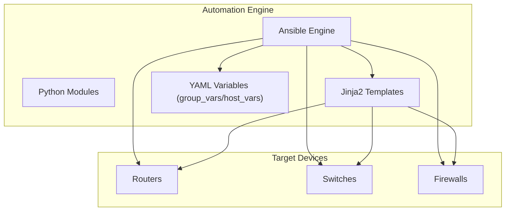
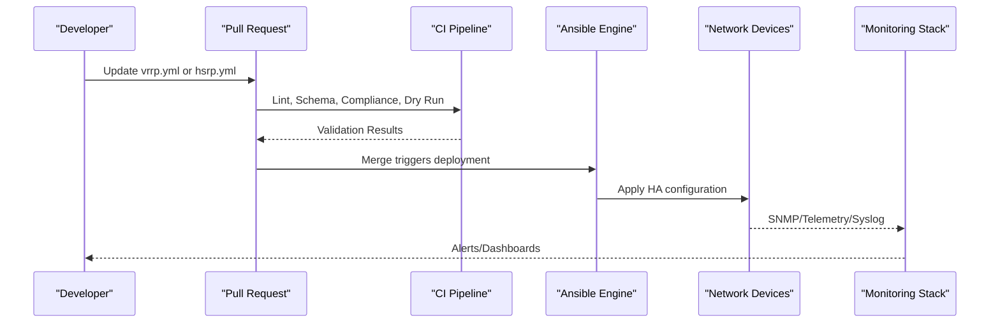
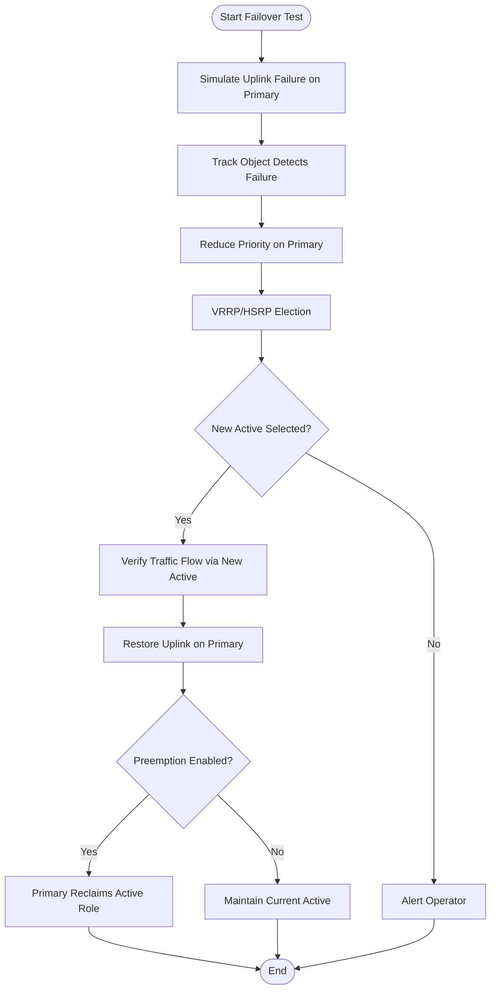
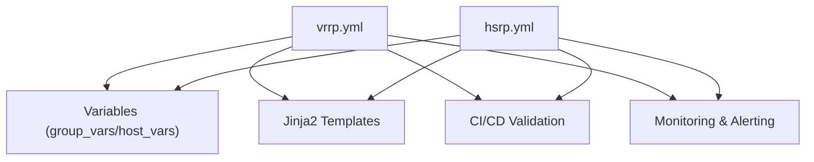

# High Availability Playbooks

<cite>
**Referenced Files in This Document**
- [README.md](file://README.md)
</cite>

## Table of Contents
1. [Introduction](#introduction)
2. [Project Structure](#project-structure)
3. [Core Components](#core-components)
4. [Architecture Overview](#architecture-overview)
5. [Detailed Component Analysis](#detailed-component-analysis)
6. [Dependency Analysis](#dependency-analysis)
7. [Performance Considerations](#performance-considerations)
8. [Troubleshooting Guide](#troubleshooting-guide)
9. [Conclusion](#conclusion)
10. [Appendices](#appendices)

## Introduction
This document provides comprehensive guidance for high availability and redundancy automation using VRRP and HSRP playbooks within the Enterprise Network Automation Platform. It explains HA concepts, failover mechanisms, state synchronization requirements, monitoring considerations, topology variables, timing parameters, tracking object configuration, integration with health checks, dual-homed router examples, failover testing procedures, and post-failover verification. The content is aligned with the platform’s GitOps-driven approach, CI/CD validation, compliance enforcement, and observability stack.

## Project Structure
The repository organizes automation artifacts by environment, roles, templates, and playbooks. The High Availability section documents two playbooks: vrrp.yml and hsrp.yml. These are part of the broader automation engine that uses Ansible to generate device configurations from structured data and Jinja2 templates.

**Diagram sources**
- [README.md:52-99](file://README.md#L52-L99)

**Section sources**
- [README.md:103-180](file://README.md#L103-L180)
- [README.md:371-437](file://README.md#L371-L437)

## Core Components
- vrrp.yml: Configures Virtual Router Redundancy Protocol with priority settings and preemption behavior.
- hsrp.yml: Configures Hot Standby Router Protocol with group numbering and interface tracking.

These playbooks integrate with the platform’s inventory and variable model, enabling consistent, repeatable HA deployments across multi-vendor environments. They leverage structured variables for topology, timing, and tracking objects, and can be validated via schema checks and dry runs before deployment.

**Section sources**
- [README.md:411-416](file://README.md#L411-L416)

## Architecture Overview
The HA playbooks operate within the automation pipeline: changes are validated, rendered into vendor-specific configurations, deployed, and verified. Observability components monitor device states and alert on anomalies.

**Diagram sources**
- [README.md:479-501](file://README.md#L479-L501)
- [README.md:583-604](file://README.md#L583-L604)

## Detailed Component Analysis

### VRRP Playbook (vrrp.yml)
Purpose:
- Configure VRRP groups with master/backup priorities and preemption to ensure deterministic active/standby selection.

Key Concepts:
- Priority determines router preference; higher priority becomes master.
- Preemption allows a higher-priority backup to reclaim master role when it recovers.
- Timers control advertisement intervals and hold times to balance convergence speed vs. stability.

Topology Variables:
- Group identifiers per VLAN/subnet.
- Interface assignments for VRRP instances.
- Priority values per device in each group.
- Optional authentication method and virtual IP addresses.

Timing Parameters:
- Advertisement interval and skew time to avoid flapping.
- Master-down multiplier to detect failures promptly.

Tracking Object Configuration:
- Track upstream interfaces or routes; reduce priority on failure to trigger graceful failover.
- Use decrement values to influence election without immediate preemption.

Integration with Health Checks:
- Combine with health_check.yml to validate neighbor reachability and VRRP state.
- Use monitoring dashboards to observe active/standby transitions and track SLA metrics.

Failover Testing Procedures:
- Simulate link failure by shutting down tracked interfaces.
- Verify priority reduction and master transition.
- Restore link and confirm preemption behavior if configured.

Post-Failover Verification:
- Confirm virtual IP ownership and traffic flow.
- Validate routing table consistency and absence of blackholes.
- Check logs and telemetry for expected state transitions.

Best Practices:
- Avoid split-brain by ensuring only one router has higher priority per group.
- Use conservative timers in production to prevent oscillation.
- Enforce preemption only after stabilization windows.

**Section sources**
- [README.md:411-416](file://README.md#L411-L416)
- [README.md:517-544](file://README.md#L517-L544)
- [README.md:583-616](file://README.md#L583-L616)

### HSRP Playbook (hsrp.yml)
Purpose:
- Configure HSRP groups with explicit group numbers and interface tracking to maintain resilient default gateway services.

Key Concepts:
- Group numbering isolates multiple HSRP domains per subnet.
- Tracking monitors interface or route status; reduces priority upon degradation.
- Active/standby roles determined by priority and preempt settings.

Topology Variables:
- HSRP group IDs per interface/VLAN.
- Device priorities and preempt flags.
- Virtual IP addresses per group.
- Authentication and hello/dead timer tuning.

Timing Parameters:
- Hello and hold timers tuned for desired convergence characteristics.
- Skew time adjustments to minimize simultaneous elections.

Tracking Object Configuration:
- Track physical uplinks or dynamic routes; apply priority decrements.
- Ensure decrement thresholds align with service impact expectations.

Integration with Health Checks:
- Use health_check.yml to verify HSRP state and neighbor adjacency.
- Monitor via Prometheus/Grafana for state changes and latency spikes.

Failover Testing Procedures:
- Disable tracked interfaces to simulate upstream loss.
- Observe standby takeover and virtual IP migration.
- Re-enable links and verify re-election behavior.

Post-Failover Verification:
- Validate traffic paths through new active router.
- Confirm no packet loss beyond acceptable thresholds.
- Review syslog and telemetry for accurate event timelines.

Best Practices:
- Prevent split-brain by ensuring unique priorities and correct preempt configuration.
- Align timers with network stability requirements.
- Implement graceful failover by coordinating tracking and preemption.

**Section sources**
- [README.md:411-416](file://README.md#L411-L416)
- [README.md:517-544](file://README.md#L517-L544)
- [README.md:583-616](file://README.md#L583-L616)

### Dual-Homed Router Configuration Example
Conceptual Workflow:
- Two routers share a common subnet with VRRP/HSRP providing a virtual gateway.
- Each router tracks its own uplink interfaces; on failure, priority drops and the peer takes over.
- Traffic seamlessly shifts to the active router while maintaining connectivity.

[No sources needed since this diagram shows conceptual workflow, not actual code structure]

## Dependency Analysis
The HA playbooks depend on:
- Inventory and variables (group_vars/host_vars) for topology and parameters.
- Jinja2 templates to render vendor-specific configurations.
- CI/CD pipeline for validation and safe deployment.
- Monitoring stack for observability and alerting.

**Diagram sources**
- [README.md:103-180](file://README.md#L103-L180)
- [README.md:479-501](file://README.md#L479-L501)
- [README.md:583-604](file://README.md#L583-L604)

**Section sources**
- [README.md:103-180](file://README.md#L103-L180)
- [README.md:479-501](file://README.md#L479-L501)
- [README.md:583-604](file://README.md#L583-L604)

## Performance Considerations
- Tune timers to balance fast convergence with stability; overly aggressive timers may cause flapping.
- Use tracking objects judiciously to avoid unnecessary priority oscillations.
- Leverage dry runs and schema validation to catch misconfigurations early.
- Monitor CPU/memory utilization during failover events to ensure devices remain responsive.

[No sources needed since this section provides general guidance]

## Troubleshooting Guide
Common issues and resolutions:
- Connection timeouts: Verify SSH reachability and credentials.
- Template rendering errors: Inspect Jinja2 syntax and variable definitions.
- Compliance check failures: Review policy violations and adjust configurations accordingly.
- CI pipeline failures: Examine GitHub Actions logs for actionable messages.
- Vault authentication failures: Validate OIDC tokens or AppRole credentials.
- Molecule test failures: Ensure container runtime is available and configurations are valid.
- Batfish analysis errors: Validate snapshots and network models.

Operational tips:
- Use health_check.yml to validate device readiness before applying HA changes.
- Correlate alerts with Grafana dashboards to pinpoint state transitions.
- Perform rollback using config_rollback.yml if post-deploy verification fails.

**Section sources**
- [README.md:674-685](file://README.md#L674-L685)
- [README.md:418-435](file://README.md#L418-L435)
- [README.md:583-616](file://README.md#L583-L616)

## Conclusion
The vrrp.yml and hsrp.yml playbooks provide robust, automated high availability for enterprise networks. By leveraging structured variables, template rendering, CI/CD validation, and comprehensive monitoring, they enable predictable failover, split-brain prevention, and rapid recovery. Adhering to best practices for timing, tracking, and verification ensures resilient operations and maintains service continuity under failure conditions.

[No sources needed since this section summarizes without analyzing specific files]

## Appendices

### Required Topology Variables
- Group identifiers (VRRP group number, HSRP group ID).
- Interface assignments for HA instances.
- Priority values per device.
- Virtual IP addresses per group.
- Authentication settings (if required).

### Timing Parameters
- Advertisement/hello intervals.
- Hold/dead timers.
- Master-down multiplier or equivalent detection thresholds.
- Skew time to stagger elections.

### Tracking Object Configuration
- Interfaces or routes to monitor.
- Decrement values applied on failure.
- Conditions for preemption and recovery.

### Integration with Health Checks
- Pre-deployment health assessments.
- Post-failover verification steps.
- Continuous monitoring via SNMP/telemetry/syslog.

### Failover Testing Procedures
- Simulate link failures and verify state transitions.
- Validate traffic rerouting and service continuity.
- Confirm preemption behavior upon recovery.

### Post-Failover Verification Procedures
- Check virtual IP ownership and routing tables.
- Measure packet loss and latency during transitions.
- Review logs and telemetry for accurate event timelines.

### Best Practices
- Prevent split-brain with unique priorities and correct preempt settings.
- Use conservative timers in production environments.
- Coordinate tracking and preemption for graceful failover.
- Automate verification and rollback to minimize downtime.

[No sources needed since this section provides general guidance]