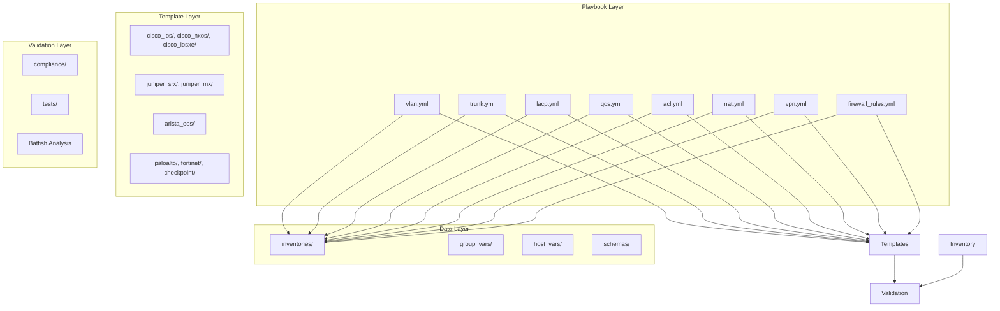
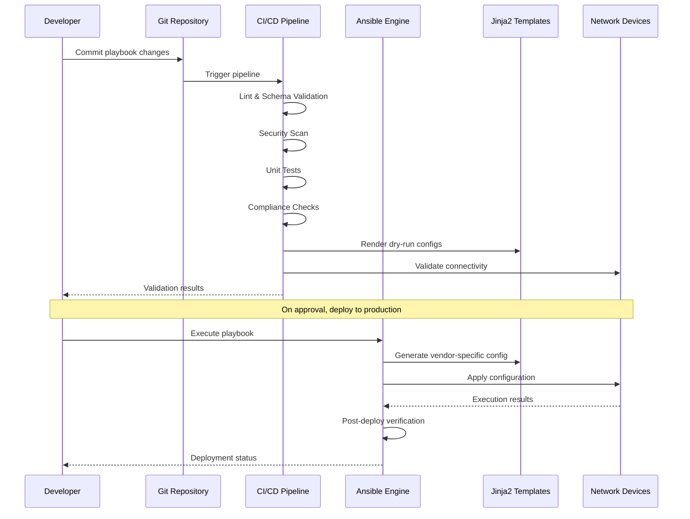
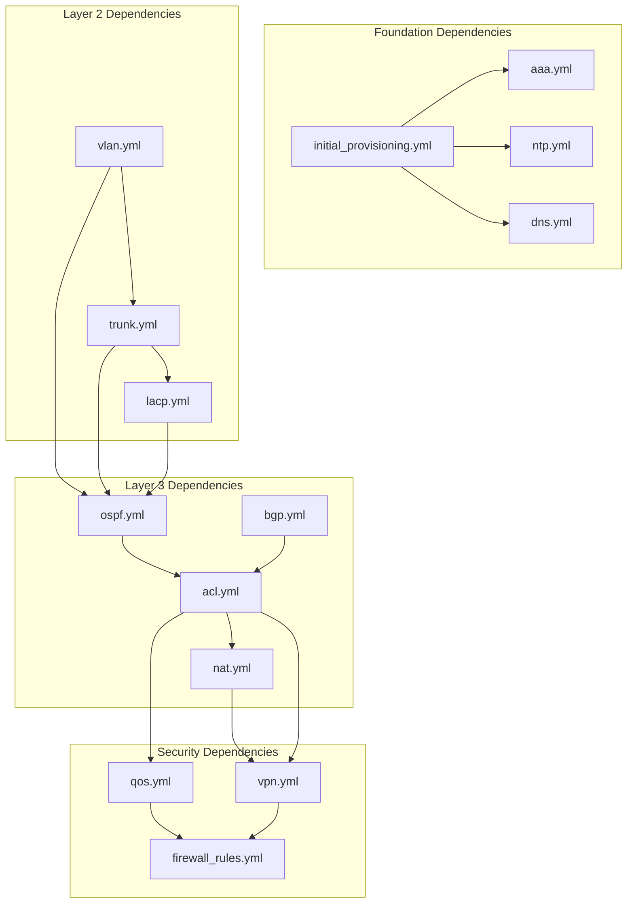

# Network Services Playbooks

<cite>
**Referenced Files in This Document**
- [README.md](file://README.md)
</cite>

## Table of Contents
1. [Introduction](#introduction)
2. [Project Structure](#project-structure)
3. [Core Components](#core-components)
4. [Architecture Overview](#architecture-overview)
5. [Detailed Component Analysis](#detailed-component-analysis)
6. [Dependency Analysis](#dependency-analysis)
7. [Performance Considerations](#performance-considerations)
8. [Troubleshooting Guide](#troubleshooting-guide)
9. [Conclusion](#conclusion)
10. [Appendices](#appendices)

## Introduction

This document provides comprehensive coverage of network services automation playbooks for Layer 2 and Layer 3 networking features within an enterprise-scale network automation platform. The platform is designed to manage thousands of network devices across multi-vendor, multi-region environments using Infrastructure as Code principles, GitOps workflows, and automated compliance enforcement.

The documented playbooks cover essential networking functions including VLAN management, trunk configuration, LACP port-channels, Quality of Service (QoS), Access Control Lists (ACLs), Network Address Translation (NAT), VPN configuration, and firewall rule deployment. Each playbook supports multiple vendor platforms including Cisco IOS/IOS-XE/NX-OS, Juniper SRX/MX, Arista EOS, Palo Alto PAN-OS, Fortinet FortiOS, and others.

## Project Structure

The network automation platform follows a modular architecture with clear separation of concerns:



**Diagram sources**
- [README.md:103-180](file://README.md#L103-L180)

**Section sources**
- [README.md:103-180](file://README.md#L103-L180)

## Core Components

The network services playbooks form the core automation layer responsible for configuring fundamental networking features across diverse vendor platforms. Each playbook implements vendor-agnostic interfaces while generating platform-specific configurations through Jinja2 templates.

### Key Design Principles

- **Vendor Agnostic**: Single playbook interface supporting multiple vendors
- **Idempotent Operations**: Safe repeated execution without side effects  
- **Compliance Enforcement**: Built-in policy checks and validation
- **GitOps Integration**: Full version control and audit trail
- **Automated Testing**: Comprehensive test suites for each feature

### Supported Vendor Platforms

| Vendor | Platform | Protocols | Status |
|--------|----------|-----------|---------|
| Cisco | IOS, IOS-XE, NX-OS | SSH, NETCONF, RESTCONF | Supported |
| Juniper | SRX, MX | SSH, NETCONF | Supported |
| Arista | EOS | SSH, eAPI, NETCONF | Supported |
| Palo Alto | PAN-OS | SSH, API | Supported |
| Fortinet | FortiOS | SSH, API | Supported |
| Check Point | Gaia | SSH, API | Supported |
| F5 | BIG-IP | SSH, iControl REST | Supported |

**Section sources**
- [README.md:203-227](file://README.md#L203-L227)

## Architecture Overview

The network services automation follows a layered architecture with clear separation between data models, template rendering, and device communication:



**Diagram sources**
- [README.md:36-50](file://README.md#L36-L50)
- [README.md:479-501](file://README.md#L479-L501)

## Detailed Component Analysis

### VLAN Management Playbook (vlan.yml)

The VLAN creation and modification playbook manages Layer 2 virtual LAN segmentation across diverse switch platforms. It handles VLAN database synchronization, naming conventions, and VLAN state management.

#### Networking Concepts

VLANs provide logical segmentation at Layer 2, isolating broadcast domains and improving security. The playbook supports both access and trunk port configurations, VLAN spanning-tree parameters, and VLAN database consistency across device clusters.

#### Data Model and Variables

```yaml
# Example VLAN configuration structure
vlans:
  - id: 100
    name: "Corporate Users"
    description: "Primary user VLAN"
    state: present
    spanning_tree:
      priority: 16384
      cost: 19
    voice_vlan: true
    ip_helper:
      - 10.0.1.1
      - 10.0.2.1
```

#### Vendor-Specific Implementation Differences

| Feature | Cisco IOS | Juniper | Arista EOS | Palo Alto |
|---------|-----------|---------|------------|-----------|
| VLAN Creation | `vlan 100 name Corp` | `set vlans vlan-100 vlan-id 100` | `vlan 100 name Corp` | N/A (Layer 3 focus) |
| Trunk Config | `switchport mode trunk` | `set interfaces eth0 unit 0 family ethernet-switching vlan members all` | `switchport mode trunk` | N/A |
| STP Priority | `spanning-tree vlan 100 priority 16384` | `set protocols rstp instance vlan-100 priority 16384` | `spanning-tree vlan 100 priority 16384` | N/A |

#### Dependency Relationships

- Requires initial provisioning playbook for basic device connectivity
- Depends on inventory system for device targeting
- Integrates with compliance checks for VLAN naming standards
- May depend on routing protocols if VLANs carry routed traffic

#### Compliance Integration

- Enforces VLAN naming conventions from organizational standards
- Validates VLAN ID ranges per environment (dev/staging/prod)
- Checks for unused VLANs and cleanup recommendations
- Ensures proper VLAN isolation policies

#### Validation Procedures

- Pre-deployment: Template rendering validation, schema validation
- Post-deployment: VLAN existence verification, spanning-tree state checks
- Continuous: VLAN usage monitoring and optimization recommendations

**Section sources**
- [README.md:388-400](file://README.md#L388-L400)

### Trunk Configuration Playbook (trunk.yml)

The trunk configuration playbook manages Layer 2 trunk interfaces, handling VLAN tagging, native VLAN settings, and trunk negotiation protocols across different switch platforms.

#### Networking Concepts

Trunk ports carry multiple VLANs between switches and routers using IEEE 802.1Q tagging. The playbook manages trunk encapsulation, allowed VLAN lists, native VLAN configuration, and trunk negotiation modes (DTP, 802.1AD).

#### Data Model and Variables

```yaml
# Example trunk configuration
trunks:
  - interface: "GigabitEthernet1/0/1"
    mode: trunk
    native_vlan: 999
    allowed_vlans:
      - 100
      - 200
      - 300
    encapsulation: dot1q
    negotiation: auto
    storm_control:
      broadcast: 10
      multicast: 5
```

#### Vendor-Specific Implementation Differences

| Feature | Cisco IOS | Juniper | Arista EOS |
|---------|-----------|---------|------------|
| Trunk Mode | `switchport mode trunk` | `set interfaces eth0 unit 0 family ethernet-switching mode trunk` | `switchport mode trunk` |
| Allowed VLANs | `switchport trunk allowed vlan 100,200,300` | `set vlans vlan-100 members eth0.0` | `switchport trunk allowed vlan 100,200,300` |
| Native VLAN | `switchport trunk native vlan 999` | `set interfaces eth0 unit 0 native-vlan-id 999` | `switchport trunk native vlan 999` |

#### Complex Scenarios

**Multi-VLAN Trunk Configuration:**
- Dynamic VLAN addition/removal without service interruption
- VLAN pruning for bandwidth optimization
- Trunk security with DTP negotiation controls
- Storm control implementation for broadcast mitigation

#### Dependency Relationships

- Requires VLAN playbook for referenced VLAN definitions
- Depends on physical interface availability
- Integrates with spanning-tree protocol configuration
- May require LACP configuration for link aggregation

#### Validation Procedures

- Interface operational status verification
- VLAN membership validation on trunk ports
- Native VLAN consistency checks across trunks
- Bandwidth utilization monitoring

**Section sources**
- [README.md:388-400](file://README.md#L388-L400)

### LACP Port-Channel Configuration (lacp.yml)

The LACP port-channel playbook manages Link Aggregation Control Protocol configurations for high-availability and load-balanced connections between network devices.

#### Networking Concepts

LACP provides dynamic link aggregation, bundling multiple physical links into a single logical channel for increased bandwidth and redundancy. The playbook handles LACP mode configuration, load-balancing algorithms, and member link management.

#### Data Model and Variables

```yaml
# Example LACP configuration
port_channels:
  - name: "Port-Channel1"
    description: "Uplink to distribution layer"
    members:
      - interface: "GigabitEthernet1/0/24"
        priority: 100
      - interface: "GigabitEthernet1/0/25" 
        priority: 100
    lacp_mode: active
    load_balance: src-dst-ip-port
    minimum_links: 1
    maximum_links: 4
```

#### Vendor-Specific Implementation Differences

| Feature | Cisco IOS | Juniper | Arista EOS |
|---------|-----------|---------|------------|
| Channel Group | `channel-group 1 mode active` | `set interfaces ae0 unit 0 family ethernet-switching` | `channel-group 1 mode active` |
| Load Balancing | `port-channel load-balance src-dst-ip-port` | `set forwarding-options hash-mode src-dst-ip-port` | `port-channel load-balance src-dst-ip-port` |
| Member Priority | `lacp port-priority 100` | `set interfaces ge-0/0/24 ether-options lacp port-priority 100` | `lacp port-priority 100` |

#### Advanced Features

- **Load Balancing Algorithms**: Source/destination IP, MAC address, TCP/UDP port combinations
- **Link Failure Detection**: Fast convergence with BFD integration
- **Member Link Management**: Dynamic addition/removal without service disruption
- **Redundancy Configuration**: Minimum/maximum link thresholds

#### Dependency Relationships

- Requires trunk configuration for member interfaces
- Depends on spanning-tree protocol for loop prevention
- Integrates with routing protocols for optimal path selection
- May require QoS policies for traffic shaping

#### Validation Procedures

- Port-channel operational status verification
- Member link health monitoring
- Load balancing effectiveness analysis
- Convergence time measurement during link failures

**Section sources**
- [README.md:388-400](file://README.md#L388-L400)

### Quality of Service Policy Application (qos.yml)

The QoS playbook implements traffic classification, marking, queuing, and policing policies to ensure optimal network performance and application prioritization.

#### Networking Concepts

Quality of Service provides traffic prioritization, bandwidth management, and congestion avoidance mechanisms. The playbook implements classification based on various criteria, traffic marking for downstream processing, queue management for bandwidth allocation, and policing for traffic rate limiting.

#### Data Model and Variables

```yaml
# Example QoS policy configuration
qos_policies:
  - name: "Corporate-Policy"
    description: "Standard corporate traffic policy"
    classes:
      - name: "VoIP"
        match:
          dscp: ef
          cos: 5
        priority:
          level: strict
          bandwidth: 20
      - name: "Video"
        match:
          dscp: af41
          cos: 4
        bandwidth: 30
      - name: "Critical-Business"
        match:
          dscp: af31
          cos: 3
        bandwidth: 25
      - name: "Best-Effort"
        match:
          dscp: 0
          cos: 0
        bandwidth: 25
    policing:
      - class: "Bulk-Transfer"
        rate: 100mbps
        burst: 12500
```

#### Vendor-Specific Implementation Differences

| Feature | Cisco IOS | Juniper | Arista EOS |
|---------|-----------|---------|------------|
| Classification | `class-map match-all VoIP` | `classify { voip { match dscp ef; } }` | `class-map match-all VoIP` |
| Queuing | `priority queue 20` | `queueing-policy voip priority 20` | `priority 20` |
| Policing | `police cir 100000000` | `rate-limit 100mbps` | `police cir 100000000` |

#### Complex Scenarios

**QoS Policy Inheritance:**
- Hierarchical QoS policies for nested traffic classes
- Policy inheritance from parent interfaces to child interfaces
- Dynamic policy application based on traffic patterns
- Policy optimization based on real-time traffic analysis

#### Dependency Relationships

- Requires traffic classification rules from ACLs
- Depends on interface bandwidth configuration
- Integrates with scheduling policies for bandwidth allocation
- May require monitoring for policy effectiveness

#### Validation Procedures

- Traffic classification accuracy verification
- Queue utilization monitoring
- Latency measurements for priority traffic
- Bandwidth allocation compliance checks

**Section sources**
- [README.md:388-400](file://README.md#L388-L400)

### Access Control List Management (acl.yml)

The ACL playbook manages network access control policies, providing traffic filtering, security enforcement, and traffic optimization through rule-based packet inspection.

#### Networking Concepts

Access Control Lists define permit/deny rules for network traffic based on various criteria including source/destination addresses, protocols, and port numbers. The playbook handles standard and extended ACLs, named ACLs, and advanced filtering scenarios with rule ordering and optimization.

#### Data Model and Variables

```yaml
# Example ACL configuration
access_lists:
  - name: "Corporate-Inbound"
    type: extended
    description: "Inbound traffic policy for corporate network"
    rules:
      - sequence: 10
        action: permit
        protocol: tcp
        source: "10.0.0.0/8"
        destination: "any"
        destination_ports:
          - 80
          - 443
        logging: enabled
      - sequence: 20
        action: deny
        protocol: any
        source: "any"
        destination: "any"
        logging: enabled
    apply_to_interfaces:
      - GigabitEthernet1/0/1
      - GigabitEthernet1/0/2
```

#### Vendor-Specific Implementation Differences

| Feature | Cisco IOS | Juniper | Arista EOS |
|---------|-----------|---------|------------|
| ACL Definition | `access-list Corporate-Inbound extended permit tcp...` | `policy Corporate-Inbound { term inbound { from { source-address 10.0.0.0/8; } then accept; } }` | `ip access-list extended Corporate-Inbound` |
| Rule Ordering | Sequential numbering | Term-based ordering | Sequence numbers |
| Interface Application | `ip access-group Corporate-Inbound in` | `apply-groups Corporate-Inbound` | `ip access-group Corporate-Inbound in` |

#### Advanced Features

**ACL Optimization:**
- Duplicate rule detection and removal
- Rule reordering for optimal performance
- Shadow rule identification
- Unused rule cleanup recommendations

**Complex Scenarios:**
- Time-based ACLs for scheduled access
- Object-group management for reusable address/port sets
- ACL chaining and policy maps
- IPv6 ACL support alongside IPv4

#### Dependency Relationships

- Requires object groups for address/port definitions
- Depends on interface configuration for application points
- Integrates with routing policies for route filtering
- May affect QoS policy application points

#### Validation Procedures

- Rule syntax validation and conflict detection
- Traffic flow simulation using Batfish
- Performance impact assessment
- Security policy compliance verification

**Section sources**
- [README.md:388-400](file://README.md#L388-L400)

### Network Address Translation Rules (nat.yml)

The NAT playbook manages Network Address Translation policies, enabling private network connectivity to public networks and implementing various NAT types for different use cases.

#### Networking Concepts

Network Address Translation translates private IP addresses to public addresses and vice versa. The playbook supports static NAT, dynamic NAT, PAT (Port Address Translation), and NAT overload scenarios with address pool management and translation table maintenance.

#### Data Model and Variables

```yaml
# Example NAT configuration
nat_policies:
  - name: "Outbound-PAT"
    description: "PAT for internal network outbound access"
    type: overload
    source_networks:
      - "10.0.0.0/8"
      - "172.16.0.0/12"
    translated_address:
      type: interface
      interface: "GigabitEthernet0/0"
    translation_pool:
      - start: "203.0.113.1"
        end: "203.0.113.254"
    nat_rules:
      - sequence: 10
        action: translate
        source: "10.0.0.0/8"
        destination: "any"
        protocol: any
        translation_type: dynamic
```

#### Vendor-Specific Implementation Differences

| Feature | Cisco IOS | Juniper | Arista EOS |
|---------|-----------|---------|------------|
| NAT Pool | `ip nat pool OUTBOUND 203.0.113.1 203.0.113.254 netmask 255.255.255.0` | `set security nat source pool OUTBOUND 203.0.113.1-203.0.113.254` | `ip nat pool OUTBOUND 203.0.113.1 203.0.113.254` |
| NAT Rule | `ip nat inside source list INSIDE pool OUTBOUND overload` | `set security nat source rule OUTBOUND from source-address 10.0.0.0/8` | `ip nat inside source list INSIDE pool OUTBOUND overload` |
| Static NAT | `ip nat inside source static 10.0.1.1 203.0.113.1` | `set security nat destination rule STATIC-NAT` | `ip nat inside source static 10.0.1.1 203.0.113.1` |

#### Advanced Features

**NAT Optimization:**
- Translation table size optimization
- Connection tracking limits and timeouts
- NAT performance tuning for high-throughput scenarios
- Address exhaustion prevention and monitoring

**Complex Scenarios:**
- Bidirectional NAT for server publishing
- NAT exemption for specific traffic flows
- NAT with QoS integration for traffic prioritization
- Multi-homed NAT scenarios

#### Dependency Relationships

- Requires routing configuration for NAT traversal
- Depends on interface addressing schemes
- Integrates with ACLs for NAT rule matching
- May affect VPN tunnel establishment

#### Validation Procedures

- NAT translation table verification
- Connection tracking statistics monitoring
- Address pool utilization analysis
- Performance impact assessment

**Section sources**
- [README.md:388-400](file://README.md#L388-L400)

### VPN Configuration (vpn.yml)

The VPN playbook manages site-to-site and remote-access VPN configurations, providing secure encrypted tunnels for inter-site connectivity and remote user access.

#### Networking Concepts

Virtual Private Networks establish secure encrypted tunnels over public networks. The playbook supports IPsec VPN for site-to-site connectivity and SSL/TLS VPN for remote user access, including IKE phase 1/2 configuration, encryption policies, and tunnel termination points.

#### Data Model and Variables

```yaml
# Example VPN configuration
vpn_policies:
  - name: "Site-to-Site-VPN"
    type: ipsec
    description: "Encrypted tunnel between primary and DR sites"
    local_endpoint:
      interface: "GigabitEthernet0/0"
      address: "203.0.113.1"
    remote_endpoint:
      address: "198.51.100.1"
      peer_id: "dr-site-peer"
    ike_policy:
      encryption: aes-256
      authentication: sha256
      dh_group: 14
      lifetime: 86400
    ipsec_policy:
      encryption: aes-256
      authentication: sha256
      pfs: group14
      lifetime: 3600
    traffic_selector:
      local: "10.0.0.0/8"
      remote: "192.168.0.0/16"
    mode: main
    key_lifetime: 28800
```

#### Vendor-Specific Implementation Differences

| Feature | Cisco IOS | Juniper SRX | Palo Alto |
|---------|-----------|-------------|-----------|
| IKE Policy | `crypto isakmp policy 10` | `set security ike policy IKE-POLICY` | `set security ike gateway IKE-GW` |
| IPsec Profile | `crypto ipsec transform-set ESP-AES256-SHA256` | `set security ipsec proposal IPSec-PROPOSAL` | `set security ipsec profile IPSec-PROFILE` |
| Tunnel Interface | `interface Tunnel0` | `set security ipsec vpn TUNNEL` | `set security ipsec ipsec-profile IPSec-PROFILE` |

#### Advanced Features

**High Availability:**
- Active/standby VPN failover
- Dynamic routing over VPN tunnels
- BFD integration for fast failure detection
- Load sharing across multiple VPN tunnels

**Security Enhancements:**
- Certificate-based authentication
- Perfect Forward Secrecy (PFS)
- Anti-replay protection
- Dead Peer Detection (DPD)

#### Complex Scenarios

**Multi-Vendor VPN Interoperability:**
- Cross-platform IKE/IPsec compatibility
- Custom cipher suite negotiation
- Vendor-specific extension handling
- Troubleshooting cross-platform issues

**Enterprise VPN Topologies:**
- Hub-and-spoke VPN architectures
- Mesh VPN topologies with full-mesh connectivity
- Branch office VPN consolidation
- Cloud VPN gateway integration

#### Dependency Relationships

- Requires routing configuration for VPN traffic
- Depends on NAT exemption for VPN traffic
- Integrates with ACLs for traffic selection
- May require certificate infrastructure

#### Validation Procedures

- VPN tunnel establishment verification
- Encryption policy compliance checks
- Throughput and latency measurements
- Failover testing and recovery validation

**Section sources**
- [README.md:388-400](file://README.md#L388-L400)

### Firewall Rule Set Deployment (firewall_rules.yml)

The firewall rule set playbook manages firewall policies, providing stateful packet inspection, application-layer filtering, and comprehensive security enforcement across network boundaries.

#### Networking Concepts

Firewalls enforce security policies by inspecting network traffic and applying permit/deny decisions based on predefined rules. The playbook supports zone-based security, application-aware filtering, threat prevention, and comprehensive logging and reporting capabilities.

#### Data Model and Variables

```yaml
# Example firewall rule configuration
firewall_policies:
  - name: "DMZ-Outbound"
    description: "Outbound traffic policy for DMZ servers"
    source_zone: "DMZ"
    destination_zone: "Untrust"
    applications:
      - name: "web-browsing"
        action: permit
      - name: "dns"
        action: permit
      - name: "https"
        action: permit
    log_setting:
      enable: true
      log_level: informational
    schedule:
      name: "business-hours"
      days: ["monday", "tuesday", "wednesday", "thursday", "friday"]
      times: "08:00-18:00"
    hit_count_limit: 1000000
```

#### Vendor-Specific Implementation Differences

| Feature | Palo Alto | Fortinet | Check Point |
|---------|-----------|----------|-------------|
| Policy Definition | `set security policies from-zone DMZ to-zone Untrust policy DMZ-Outbound` | `config firewall policy` | `fw ctl policy add` |
| Application Control | `set applications web-browsing` | `set firewall policy app-list web-browsing` | `add application web-browsing` |
| Logging | `set security policies from-zone DMZ to-zone Untrust policy DMZ-Outbound log-setting Enable` | `set firewall policy log enable` | `set log enable` |

#### Advanced Features

**Threat Prevention:**
- Intrusion Prevention System (IPS) integration
- Malware detection and blocking
- URL filtering and categorization
- Data Loss Prevention (DLP) policies

**Application Awareness:**
- Deep packet inspection for application identification
- Application-specific security policies
- Bandwidth management per application
- User identity integration

#### Complex Scenarios

**Policy Optimization:**
- Rule shadowing detection and resolution
- Unused rule identification and cleanup
- Policy performance optimization
- Rule reordering for optimal throughput

**Multi-Zone Security:**
- Trust level enforcement between zones
- Inter-zone traffic monitoring
- Zone-based policy inheritance
- Security posture assessment

#### Dependency Relationships

- Requires address objects and service definitions
- Depends on interface zone assignments
- Integrates with NAT policies for traffic translation
- May affect routing decisions based on security policies

#### Validation Procedures

- Policy syntax and logic validation
- Traffic flow simulation and testing
- Performance impact assessment
- Security compliance verification

**Section sources**
- [README.md:388-400](file://README.md#L388-L400)

## Dependency Analysis

The network services playbooks have complex dependency relationships that must be carefully managed to ensure successful deployment and operation:



**Diagram sources**
- [README.md:371-435](file://README.md#L371-L435)

### Critical Dependency Chains

1. **Foundation Chain**: Initial provisioning → AAA/NTP/DNS → All other playbooks
2. **Layer 2 Chain**: VLAN → Trunk → LACP → Routing protocols
3. **Security Chain**: ACL → NAT → QoS → VPN → Firewall rules
4. **Routing Chain**: OSPF/BGP → ACL → NAT → VPN

### Circular Dependency Prevention

The playbook design prevents circular dependencies through careful sequencing and modular architecture. Each playbook focuses on a specific networking domain while maintaining clear input/output contracts.

**Section sources**
- [README.md:371-435](file://README.md#L371-L435)

## Performance Considerations

### Scalability Factors

- **Concurrent Device Management**: Support for parallel playbook execution across device pools
- **Configuration Size Optimization**: Efficient template rendering for large rule sets
- **Memory Usage**: Optimized data structures for handling thousands of devices
- **Network Bandwidth**: Minimized configuration transfer overhead

### Optimization Strategies

- **Incremental Updates**: Only changed configurations applied to devices
- **Batch Processing**: Grouped operations for improved efficiency
- **Caching Mechanisms**: Reuse of common configuration fragments
- **Asynchronous Operations**: Non-blocking device communication

### Monitoring and Metrics

- **Execution Time Tracking**: Per-playbook and per-device performance metrics
- **Resource Utilization**: CPU, memory, and network usage monitoring
- **Error Rate Analysis**: Failure pattern identification and trending
- **Capacity Planning**: Growth projections based on current utilization

## Troubleshooting Guide

### Common Issues and Resolutions

| Issue Category | Symptom | Resolution |
|----------------|---------|------------|
| **Connectivity** | Device unreachable during playbook execution | Verify SSH connectivity, check credentials, validate network reachability |
| **Template Rendering** | Jinja2 template errors during configuration generation | Review template syntax, validate variable definitions, check data model compliance |
| **Compliance Failures** | Policy violations preventing deployment | Review compliance policies, update configuration to meet standards |
| **Vendor Compatibility** | Platform-specific configuration errors | Verify vendor/platform support, check template compatibility matrix |
| **Performance Issues** | Slow playbook execution or device response | Optimize concurrent operations, review device capacity, analyze network latency |

### Debugging Techniques

- **Verbose Logging**: Enable detailed execution logs for troubleshooting
- **Dry Run Mode**: Test configuration changes without applying to devices
- **Incremental Deployment**: Apply changes to small device groups first
- **Rollback Procedures**: Automated rollback on failed deployments

### Validation Best Practices

- **Pre-deployment Testing**: Comprehensive testing in staging environments
- **Post-deployment Verification**: Automated validation of applied configurations
- **Continuous Monitoring**: Real-time monitoring of network health and performance
- **Audit Trail**: Complete change history and compliance reporting

**Section sources**
- [README.md:674-685](file://README.md#L674-L685)

## Conclusion

The network services automation playbooks provide a comprehensive solution for managing Layer 2 and Layer 3 networking features across multi-vendor environments. The platform's modular architecture, vendor-agnostic design, and robust compliance framework enable scalable, reliable, and secure network automation at enterprise scale.

Key benefits include:

- **Consistency**: Standardized configuration management across diverse platforms
- **Reliability**: Automated testing and validation reduce human error
- **Scalability**: Support for thousands of devices with efficient resource utilization
- **Security**: Built-in compliance enforcement and audit capabilities
- **Maintainability**: Clear separation of concerns and modular design principles

The documented playbooks represent a production-ready foundation for network automation that can be extended and customized to meet specific organizational requirements while maintaining the core principles of Infrastructure as Code and GitOps practices.

## Appendices

### Quick Reference Commands

```bash
# Execute VLAN playbook
ansible-playbook playbooks/vlan.yml -i inventories/production/hosts.yml

# Dry run with diff
ansible-playbook playbooks/trunk.yml --check --diff

# Target specific device group
ansible-playbook playbooks/lacp.yml -l "distribution_switches"

# Execute with custom variables
ansible-playbook playbooks/qos.yml -e "environment=production"

# Run compliance scan
ansible-playbook playbooks/compliance_scan.yml -i inventories/production/hosts.yml
```

### Environment Variables

| Variable | Purpose | Default |
|----------|---------|---------|
| `ANSIBLE_CONFIG` | Ansible configuration file path | `./ansible.cfg` |
| `VAULT_ADDR` | HashiCorp Vault server address | `http://localhost:8200` |
| `DEPLOY_ENVIRONMENT` | Target deployment environment | `staging` |
| `CONCURRENT_DEVICES` | Maximum concurrent device connections | `10` |
| `LOG_LEVEL` | Logging verbosity level | `INFO` |