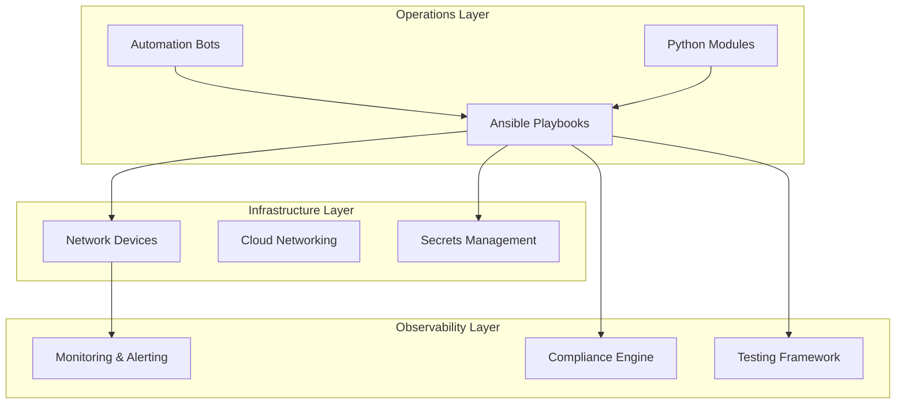
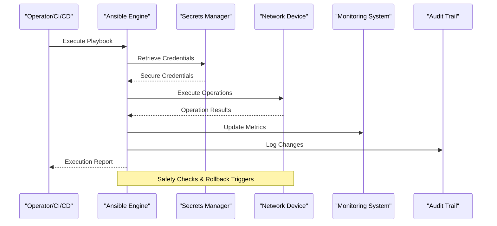
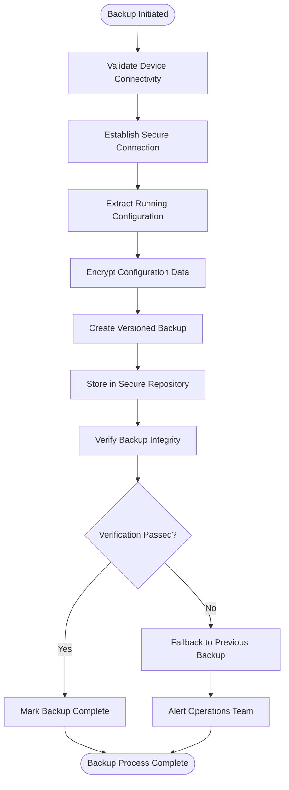
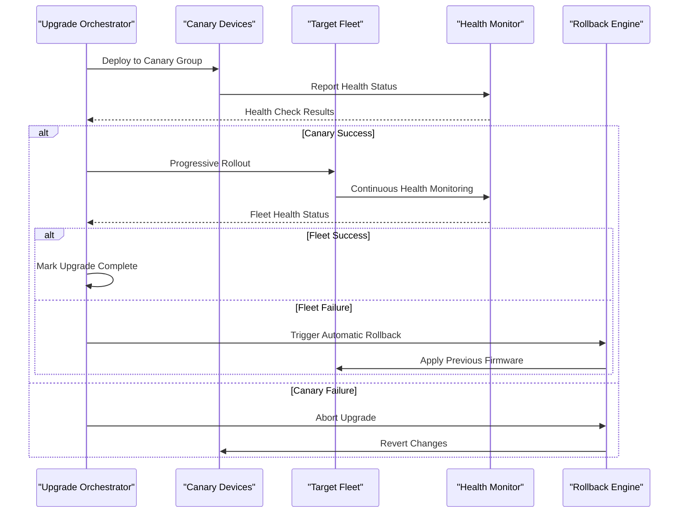
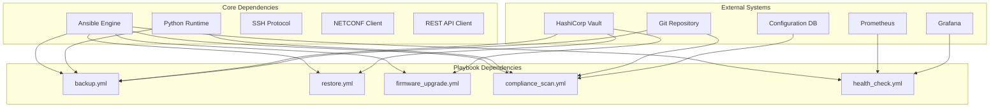

# Operational Playbooks

<cite>
**Referenced Files in This Document**
- [README.md](file://README.md)
</cite>

## Table of Contents
1. [Introduction](#introduction)
2. [Project Structure](#project-structure)
3. [Core Components](#core-components)
4. [Architecture Overview](#architecture-overview)
5. [Detailed Component Analysis](#detailed-component-analysis)
6. [Dependency Analysis](#dependency-analysis)
7. [Performance Considerations](#performance-considerations)
8. [Troubleshooting Guide](#troubleshooting-guide)
9. [Conclusion](#conclusion)

## Introduction

This document provides comprehensive documentation for operational and maintenance automation playbooks supporting day-2 operations in an enterprise network automation platform. The platform implements Infrastructure as Code, GitOps, CI/CD, compliance enforcement, observability, and security practices designed for Fortune 100-scale environments managing thousands of network devices across multi-vendor, multi-region deployments.

The operational playbooks cover critical day-2 operations including configuration backup and restore, firmware lifecycle management, compliance monitoring, health assessment, inventory collection, neighbor discovery, license validation, and monitoring agent deployment. Each playbook incorporates safety mechanisms, rollback procedures, CI/CD integration, and monitoring feedback loops to ensure reliable automated operations.

## Project Structure

The platform follows a modular architecture with clear separation of concerns:

**Diagram sources**
- [README.md:34-99](file://README.md#L34-L99)

**Section sources**
- [README.md:103-180](file://README.md#L103-L180)

## Core Components

The operational playbooks form the backbone of day-2 network operations, providing automated workflows for routine maintenance, emergency recovery, and continuous compliance. These components work together to ensure network reliability, security, and operational efficiency.

### Key Operational Capabilities

| Category | Functionality | Safety Mechanisms |
|----------|---------------|-------------------|
| **Configuration Management** | Backup, restore, versioning, encryption | Pre-change snapshots, atomic operations, rollback triggers |
| **Firmware Lifecycle** | Upgrade, downgrade, rollback, validation | Health checks, checksum verification, automatic rollback |
| **Compliance & Security** | Policy enforcement, drift detection, audit trails | Real-time monitoring, alerting, automated remediation |
| **Health & Monitoring** | Device health assessment, telemetry collection | Threshold-based alerts, trend analysis, predictive maintenance |
| **Inventory & Discovery** | Asset tracking, capability mapping, dependency graphs | Automated discovery, conflict resolution, change tracking |

**Section sources**
- [README.md:418-435](file://README.md#L418-L435)

## Architecture Overview

The operational playbooks integrate with multiple systems to provide comprehensive network automation capabilities:

**Diagram sources**
- [README.md:54-99](file://README.md#L54-L99)
- [README.md:339-357](file://README.md#L339-L357)

## Detailed Component Analysis

### Configuration Backup (backup.yml)

The configuration backup playbook provides automated, secure backup management with versioning and encryption capabilities. It integrates with the secrets management system and maintains comprehensive audit trails.

#### Operational Context
- **Purpose**: Automated daily backups of device configurations with cryptographic protection
- **Frequency**: Scheduled execution via CI/CD pipeline (daily at 02:00 UTC)
- **Scope**: All managed devices across production, staging, and lab environments
- **Retention**: Configurable retention policies based on compliance requirements

#### Safety Mechanisms
- **Pre-backup Validation**: Verifies device connectivity and SSH access before backup
- **Atomic Operations**: Ensures backup integrity through checksum verification
- **Encryption**: AES-256 encryption using keys from HashiCorp Vault
- **Version Control**: Git-integrated versioning with commit messages and metadata
- **Rollback Support**: Automatic fallback to previous backup if corruption detected

#### Integration Points
- **Secrets Management**: Retrieves encryption keys and device credentials securely
- **CI/CD Pipeline**: Triggered by scheduled GitHub Actions workflow
- **Monitoring**: Updates Prometheus metrics for backup success/failure rates
- **Audit Trail**: Logs all backup operations with timestamps and operator information

**Diagram sources**
- [README.md:452](file://README.md#L452)
- [README.md:339-357](file://README.md#L339-L357)

**Section sources**
- [README.md:422](file://README.md#L422)
- [README.md:452](file://README.md#L452)
- [README.md:512](file://README.md#L512)

### Configuration Restore (restore.yml)

The restore playbook enables rapid configuration recovery from verified backups with comprehensive validation and rollback capabilities.

#### Operational Context
- **Purpose**: Emergency configuration restoration following failures or unauthorized changes
- **Trigger**: Manual intervention or automated trigger based on drift detection
- **Validation**: Pre-restore validation ensures backup integrity and compatibility
- **Scope**: Selective or full configuration restoration per device or group

#### Safety Mechanisms
- **Pre-restore Snapshot**: Creates temporary snapshot before applying restored configuration
- **Compatibility Check**: Validates restored configuration against device capabilities
- **Dry-run Mode**: Optional simulation mode to preview changes without application
- **Automatic Rollback**: Reverts to pre-restore state if post-validation fails
- **Change Window Enforcement**: Respects maintenance windows and approval gates

#### Integration Points
- **Drift Detection**: Integrates with drift detection system for automated restoration
- **Change Management**: Requires approval from change advisory board for production
- **Monitoring**: Provides real-time status updates during restoration process
- **Audit Logging**: Comprehensive logging of all restoration activities

**Section sources**
- [README.md:423](file://README.md#L423)

### Firmware Upgrade (firmware_upgrade.yml)

The firmware upgrade playbook orchestrates safe firmware upgrades with comprehensive health checks, validation, and automatic rollback capabilities.

#### Operational Context
- **Purpose**: Automated firmware upgrades across device fleets with minimal disruption
- **Strategy**: Phased rollout with canary deployment and progressive expansion
- **Validation**: Multi-stage validation including pre-upgrade health, post-upgrade verification, and service impact assessment
- **Scope**: Targeted upgrades based on device role, vendor, and criticality

#### Safety Mechanisms
- **Pre-upgrade Health Check**: Comprehensive device health assessment before upgrade initiation
- **Firmware Verification**: Cryptographic checksum validation of firmware images
- **Canary Deployment**: Initial upgrade to small subset of devices for validation
- **Automatic Rollback**: Immediate rollback if post-upgrade health checks fail
- **Service Impact Assessment**: Monitors traffic patterns and service availability during upgrade

#### Upgrade Workflow

**Diagram sources**
- [README.md:646-658](file://README.md#L646-L658)

**Section sources**
- [README.md:424](file://README.md#L424)
- [README.md:646-658](file://README.md#L646-L658)

### Firmware Rollback (firmware_rollback.yml)

The firmware rollback playbook provides emergency recovery capabilities when firmware upgrades fail or cause service disruptions.

#### Operational Context
- **Purpose**: Rapid firmware rollback to restore service stability after failed upgrades
- **Trigger**: Automated trigger based on health check failures or manual operator intervention
- **Priority**: High-priority operation with expedited approval processes
- **Scope**: Targeted rollback to specific devices or groups affected by upgrade failures

#### Safety Mechanisms
- **State Preservation**: Maintains device state consistency during rollback
- **Dependency Validation**: Ensures compatible firmware versions across device relationships
- **Service Restoration**: Prioritizes critical service restoration during rollback
- **Verification**: Post-rollback verification confirms service restoration
- **Notification**: Immediate alerting to operations team upon rollback initiation

**Section sources**
- [README.md:425](file://README.md#L425)

### Configuration Rollback (config_rollback.yml)

The configuration rollback playbook enables rapid recovery to last known good configuration states with comprehensive validation and audit capabilities.

#### Operational Context
- **Purpose**: Emergency configuration recovery following problematic changes or security incidents
- **Trigger**: Automated trigger from drift detection or manual operator request
- **Granularity**: Supports selective rollback of specific configuration sections or full device rollback
- **Approval**: Requires appropriate authorization levels based on change criticality

#### Safety Mechanisms
- **Last Known Good Identification**: Automatically identifies most recent stable configuration
- **Impact Analysis**: Assesses potential impact of rollback on network services
- **Selective Application**: Supports granular rollback of specific configuration elements
- **Post-rollback Validation**: Comprehensive validation of rolled-back configuration
- **Audit Trail**: Complete audit log of rollback activities and decisions

**Section sources**
- [README.md:426](file://README.md#L426)

### Golden Configuration (golden_config.yml)

The golden configuration playbook applies standardized baseline configurations to ensure consistency and compliance across device fleets.

#### Operational Context
- **Purpose**: Enforce standardized baseline configurations across homogeneous device groups
- **Strategy**: Template-driven configuration generation with vendor-specific adaptations
- **Validation**: Pre-application validation against device capabilities and dependencies
- **Scope**: Batch application across device groups with progressive rollout

#### Safety Mechanisms
- **Template Validation**: Syntax and semantic validation of generated configurations
- **Capability Matching**: Ensures configuration compatibility with target device models
- **Dry-run Mode**: Simulation mode to preview changes without application
- **Incremental Application**: Gradual rollout to minimize risk exposure
- **Conflict Resolution**: Automated handling of configuration conflicts and dependencies

**Section sources**
- [README.md:427](file://README.md#L427)

### Drift Detection (drift_detection.yml)

The drift detection playbook continuously monitors configuration drift from approved baselines and triggers automated remediation or alerting.

#### Operational Context
- **Purpose**: Continuous monitoring of configuration compliance and unauthorized changes
- **Frequency**: Scheduled execution every 15 minutes with real-time event processing
- **Scope**: Comprehensive monitoring across all managed devices and configuration elements
- **Response**: Automated alerting, reporting, and optional remediation workflows

#### Safety Mechanisms
- **Baseline Protection**: Immutable baseline configurations stored in version control
- **Change Classification**: Automated classification of changes as authorized or unauthorized
- **False Positive Reduction**: Intelligent filtering to reduce noise from expected variations
- **Trend Analysis**: Historical analysis to identify emerging compliance issues
- **Escalation Procedures**: Automated escalation for critical compliance violations

**Section sources**
- [README.md:428](file://README.md#L428)

### Compliance Scan (compliance_scan.yml)

The compliance scan playbook performs comprehensive policy enforcement and security posture assessment across the entire network infrastructure.

#### Operational Context
- **Purpose**: Automated compliance checking against organizational security policies and regulatory requirements
- **Framework**: Multi-framework support including NIST, CIS, ISO 27001, and custom policies
- **Reporting**: Detailed compliance reports with remediation guidance and trend analysis
- **Integration**: Seamless integration with governance, risk, and compliance (GRC) platforms

#### Safety Mechanisms
- **Non-destructive Scanning**: Read-only operations that don't modify device configurations
- **Policy Versioning**: Version-controlled compliance policies with change tracking
- **Exception Management**: Formal exception process with expiration and renewal
- **Risk Scoring**: Automated risk scoring based on compliance violations severity
- **Audit Trail**: Comprehensive audit logs for compliance assessments and findings

**Section sources**
- [README.md:429](file://README.md#L429)

### Health Check (health_check.yml)

The health check playbook performs comprehensive device health assessment covering hardware, software, performance, and service availability metrics.

#### Operational Context
- **Purpose**: Proactive health monitoring to detect and prevent service degradation
- **Metrics**: Hardware health, CPU/memory utilization, interface errors, routing protocol status, service availability
- **Thresholds**: Dynamic threshold adjustment based on historical baselines and business context
- **Alerting**: Multi-channel alerting with intelligent deduplication and correlation

#### Safety Mechanisms
- **Resource Limits**: Controlled resource usage to avoid impacting device performance
- **Connection Throttling**: Rate limiting to prevent overwhelming device management interfaces
- **Graceful Degradation**: Continues operation even when some devices are unreachable
- **Contextual Alerting**: Alerts include contextual information for faster troubleshooting
- **Self-healing**: Automated remediation for common health issues within defined parameters

**Section sources**
- [README.md:430](file://README.md#L430)

### Inventory Collection (inventory_collection.yml)

The inventory collection playbook automatically discovers and catalogs network assets, capabilities, and relationships to maintain accurate infrastructure visibility.

#### Operational Context
- **Purpose**: Automated asset discovery and capability enumeration for CMDB synchronization
- **Sources**: Multiple data sources including SNMP, NETCONF, REST APIs, and CLI parsing
- **Enrichment**: Automated enrichment with vendor documentation, warranty information, and lifecycle data
- **Synchronization**: Bidirectional sync with configuration management databases (CMDB)

#### Safety Mechanisms
- **Discovery Validation**: Cross-validation of discovered assets from multiple sources
- **Duplicate Resolution**: Intelligent duplicate detection and resolution algorithms
- **Change Tracking**: Comprehensive change history for all inventory modifications
- **Access Control**: Role-based access control for inventory modification operations
- **Data Quality**: Automated data quality checks and anomaly detection

**Section sources**
- [README.md:431](file://README.md#L431)

### Neighbor Discovery (neighbor_discovery.yml)

The neighbor discovery playbook automatically discovers and maps network topology using CDP, LLDP, and other neighbor discovery protocols.

#### Operational Context
- **Purpose**: Automated network topology discovery and relationship mapping for impact analysis and troubleshooting
- **Protocols**: Support for Cisco CDP, LLDP, and vendor-specific neighbor discovery mechanisms
- **Visualization**: Integration with network visualization tools for topology mapping
- **Change Detection**: Automated detection of topology changes and relationship modifications

#### Safety Mechanisms
- **Protocol Limitations**: Respects protocol limitations and device capabilities
- **Rate Limiting**: Controlled polling rates to avoid overwhelming network devices
- **Topology Validation**: Cross-validation of discovered relationships for accuracy
- **Privacy Controls**: Filtering of sensitive neighbor information based on security policies
- **Historical Tracking**: Maintains historical topology data for change analysis

**Section sources**
- [README.md:432](file://README.md#L432)

### License Validation (license_validation.yml)

The license validation playbook ensures license compliance across the network infrastructure and prevents service disruptions due to license expirations.

#### Operational Context
- **Purpose**: Automated license compliance monitoring and renewal coordination
- **Coverage**: Feature licenses, capacity licenses, and subscription-based entitlements
- **Forecasting**: Predictive analytics for license capacity planning and renewal timing
- **Vendor Integration**: Direct integration with vendor license management systems

#### Safety Mechanisms
- **License Parsing**: Robust parsing of various license formats and vendor-specific syntax
- **Expiration Monitoring**: Proactive monitoring of license expiration dates with advance warnings
- **Capacity Planning**: Automated capacity analysis and licensing recommendations
- **Compliance Reporting**: Detailed compliance reports for audit and governance purposes
- **Renewal Automation**: Automated renewal workflows with approval gates

**Section sources**
- [README.md:433](file://README.md#L433)

### Monitoring Agents (monitoring_agents.yml)

The monitoring agents playbook deploys and configures monitoring agents for enhanced observability and telemetry collection from network devices.

#### Operational Context
- **Purpose**: Automated deployment and management of monitoring agents for comprehensive network observability
- **Agents**: Support for multiple monitoring agent types including SNMP collectors, telemetry exporters, and custom probes
- **Configuration**: Centralized agent configuration management with version control
- **Scaling**: Horizontal scaling capabilities for large network deployments

#### Safety Mechanisms
- **Agent Validation**: Pre-deployment validation of agent configurations and compatibility
- **Rollback Support**: Automatic rollback of agent deployments if issues are detected
- **Resource Monitoring**: Monitoring of agent resource usage to prevent performance impact
- **Security Hardening**: Secure agent deployment with least-privilege principles
- **Health Monitoring**: Agent health monitoring with automated restart and replacement capabilities

**Section sources**
- [README.md:434](file://README.md#L434)

## Dependency Analysis

The operational playbooks have well-defined dependencies and integration points:

**Diagram sources**
- [README.md:54-99](file://README.md#L54-L99)
- [README.md:339-357](file://README.md#L339-L357)

**Section sources**
- [README.md:184-199](file://README.md#L184-L199)

## Performance Considerations

The operational playbooks are designed for high-performance execution across large device fleets:

### Optimization Strategies
- **Parallel Execution**: Concurrent device operations with controlled parallelism limits
- **Connection Pooling**: Efficient connection reuse to minimize overhead
- **Caching**: Intelligent caching of frequently accessed data and configurations
- **Batch Processing**: Optimized batch operations for bulk configuration changes
- **Resource Management**: Dynamic resource allocation based on fleet size and complexity

### Scalability Characteristics
- **Horizontal Scaling**: Support for distributed execution across multiple control nodes
- **Federation**: Federated architecture for multi-region deployments
- **Load Balancing**: Intelligent load distribution across available execution resources
- **Queue Management**: Asynchronous job queuing for large-scale operations

## Troubleshooting Guide

Common operational issues and their resolutions:

### Connection Issues
- **Symptom**: Ansible connection timeouts or authentication failures
- **Resolution**: Verify SSH reachability and credential validity using `ansible all -m ping`
- **Prevention**: Implement connection health monitoring and credential rotation

### Configuration Conflicts
- **Symptom**: Configuration conflicts during parallel operations
- **Resolution**: Use atomic operations and proper locking mechanisms
- **Prevention**: Implement change window coordination and dependency analysis

### Performance Degradation
- **Symptom**: Slow playbook execution or resource exhaustion
- **Resolution**: Optimize parallelism settings and implement connection pooling
- **Prevention**: Regular performance profiling and capacity planning

### Compliance Violations
- **Symptom**: Automated compliance failures or drift detection alerts
- **Resolution**: Review compliance reports and apply approved remediation
- **Prevention**: Strengthen change control processes and automated validation

**Section sources**
- [README.md:674-684](file://README.md#L674-L684)

## Conclusion

The operational playbooks provide a comprehensive foundation for automated day-2 network operations, ensuring reliability, security, and compliance across enterprise-scale network infrastructures. Through careful design of safety mechanisms, rollback procedures, and integration points, these playbooks enable confident automation of critical network operations while maintaining operational excellence and regulatory compliance.

The modular architecture supports continuous evolution and adaptation to changing operational requirements, while the comprehensive monitoring and observability framework ensures operational transparency and proactive issue resolution. This approach enables organizations to achieve higher levels of automation maturity while maintaining the operational rigor required for mission-critical network infrastructure.