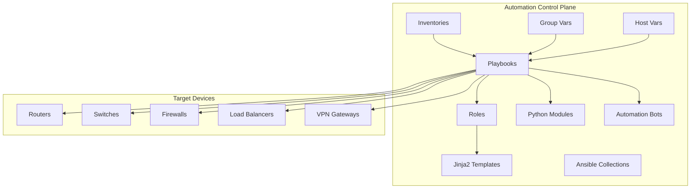
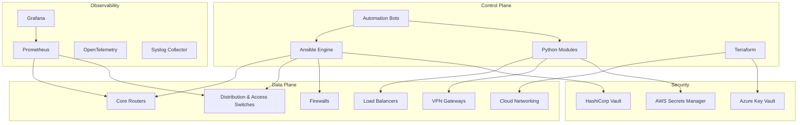
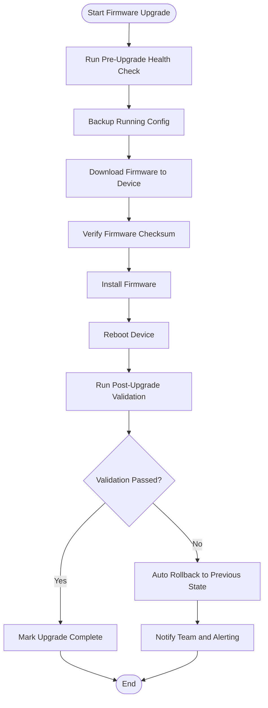
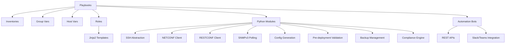

# Playbook Catalog

<cite>
**Referenced Files in This Document**
- [README.md](file://README.md)
</cite>

## Table of Contents
1. [Introduction](#introduction)
2. [Project Structure](#project-structure)
3. [Core Components](#core-components)
4. [Architecture Overview](#architecture-overview)
5. [Detailed Component Analysis](#detailed-component-analysis)
6. [Dependency Analysis](#dependency-analysis)
7. [Performance Considerations](#performance-considerations)
8. [Troubleshooting Guide](#troubleshooting-guide)
9. [Conclusion](#conclusion)
10. [Appendices](#appendices)

## Introduction
This document provides a comprehensive catalog and operational guide for the Ansible playbook component of the Enterprise Network Automation Platform. It covers device lifecycle management, network services automation, routing protocols, high availability configurations, and operational tasks. For each playbook, it documents purpose, execution commands, dependencies, integration points with Python modules and bots, and examples of orchestrating complex multi-device workflows with error handling and rollback mechanisms. The content is derived from the repository’s documented architecture and playbook catalogue.

## Project Structure
The platform organizes automation assets across inventories, variables, playbooks, roles, templates, collections, Python modules, bots, tests, compliance policies, CI/CD pipelines, monitoring, Terraform, Packer, schemas, examples, scripts, and documentation. Playbooks are located under playbooks/ and orchestrate configuration generation via Jinja2 templates and structured data, leveraging Python modules and automation bots for advanced operations.

**Diagram sources**
- [README.md:103-180](file://README.md#L103-L180)

**Section sources**
- [README.md:103-180](file://README.md#L103-L180)

## Core Components
The playbook catalogue is organized into functional areas:

- Device Lifecycle Management
  - initial_provisioning.yml: Bootstrap new devices (hostname, AAA, NTP, DNS, SSH, SNMP, Syslog, banners). Command example: ansible-playbook playbooks/initial_provisioning.yml -i inventories/lab/hosts.yml
  - hostname.yml: Set device hostname from inventory. Command example: ansible-playbook playbooks/hostname.yml -l <device>
  - aaa.yml: Configure AAA (TACACS+/RADIUS). Command example: ansible-playbook playbooks/aaa.yml
  - ntp.yml: Configure NTP servers. Command example: ansible-playbook playbooks/ntp.yml
  - dns.yml: Configure DNS resolvers. Command example: ansible-playbook playbooks/dns.yml
  - snmp.yml: Configure SNMPv3. Command example: ansible-playbook playbooks/snmp.yml
  - syslog.yml: Configure Syslog destinations. Command example: ansible-playbook playbooks/syslog.yml
  - ssh_hardening.yml: Harden SSH configuration. Command example: ansible-playbook playbooks/ssh_hardening.yml
  - certificates.yml: Deploy TLS certificates. Command example: ansible-playbook playbooks/certificates.yml
  - banners.yml: Set login/MOTD banners. Command example: ansible-playbook playbooks/banners.yml

- Network Services Automation
  - vlan.yml: Create/modify VLANs
  - trunk.yml: Configure trunk interfaces
  - lacp.yml: Configure LACP/port channels
  - qos.yml: Apply QoS policies
  - acl.yml: Manage ACLs
  - nat.yml: Configure NAT rules
  - vpn.yml: Site-to-site and remote-access VPN
  - firewall_rules.yml: Deploy firewall rule sets

- Routing Protocols
  - ospf.yml: Configure OSPF routing
  - bgp.yml: Configure BGP peering and policies
  - isis.yml: Configure IS-IS routing
  - static_routes.yml: Manage static routes
  - loopbacks.yml: Configure loopback interfaces

- High Availability
  - vrrp.yml: Configure VRRP
  - hsrp.yml: Configure HSRP

- Operational Tasks
  - backup.yml: Backup running configuration
  - restore.yml: Restore from backup
  - firmware_upgrade.yml: Upgrade device firmware with pre/post checks
  - firmware_rollback.yml: Rollback firmware on failure
  - config_rollback.yml: Rollback configuration to last known good
  - golden_config.yml: Apply golden configuration baseline
  - drift_detection.yml: Detect configuration drift from baseline
  - compliance_scan.yml: Run compliance checks
  - health_check.yml: Full device health assessment
  - inventory_collection.yml: Collect device inventory (serials, versions, modules)
  - neighbor_discovery.yml: Discover CDP/LLDP neighbors
  - license_validation.yml: Validate license compliance
  - monitoring_agents.yml: Deploy and configure monitoring agents

Integration points:
- Python modules: inventory parsing/enrichment, NETCONF/RESTCONF clients, SSH abstraction, SNMPv3 polling, telemetry receiver/parser, Jinja2-based config generation, validation, backup management, compliance engine, utilities (logging, retry, concurrency, diff, bulk ops).
- Automation bots: REST APIs and ChatOps integrations for self-service operations such as firewall rules, VLAN provisioning, port management, backups, health checks, compliance scans, upgrades, rollbacks, unified chatops command router, and approval workflows.

Execution examples:
- Dry-run compliance scan against lab devices: ansible-playbook playbooks/compliance_scan.yml -i inventories/lab/hosts.yml --check --diff
- Generate configuration for a device using Python module: python -m python.config_gen --device core-rtr-01 --output ./output/
- Run unit tests: pytest tests/unit/ -v
- Run compliance checks locally: python -m python.compliance --inventory inventories/lab/hosts.yml

**Section sources**
- [README.md:371-437](file://README.md#L371-L437)
- [README.md:438-459](file://README.md#L438-L459)
- [README.md:460-478](file://README.md#L460-L478)
- [README.md:264-281](file://README.md#L264-L281)

## Architecture Overview
The automation engine orchestrates configuration changes across routers, switches, firewalls, load balancers, VPN gateways, and cloud networking components. Ansible drives device automation; Python modules provide specialized capabilities; automation bots expose APIs and ChatOps; observability and security systems integrate throughout the pipeline.

**Diagram sources**
- [README.md:52-99](file://README.md#L52-L99)

## Detailed Component Analysis

### Device Lifecycle Management
Purpose: Establish secure, compliant baselines on new or existing devices before applying service and routing configurations.

- initial_provisioning.yml
  - Purpose: Bootstrap hostname, AAA, NTP, DNS, SSH hardening, SNMPv3, Syslog, banners.
  - Execution: ansible-playbook playbooks/initial_provisioning.yml -i inventories/lab/hosts.yml
  - Dependencies: inventories, group_vars/host_vars, secrets backend (Vault/AWS/Azure), SSH connectivity.
  - Integrations: Python SSH module for retries; compliance checks post-provisioning.
  - Error handling: Fail fast on authentication failures; continue-on-error per task with explicit handlers.

- hostname.yml
  - Purpose: Set device hostname from inventory.
  - Execution: ansible-playbook playbooks/hostname.yml -l <device>
  - Dependencies: host_vars for device name mapping.
  - Integrations: Validation role ensures unique hostname within site/region.

- aaa.yml
  - Purpose: Configure TACACS+/RADIUS servers and fallback local auth.
  - Execution: ansible-playbook playbooks/aaa.yml
  - Dependencies: Secret-backed credentials; server reachability checks.
  - Integrations: Compliance policy enforcement for AAA presence.

- ntp.yml / dns.yml
  - Purpose: Configure time synchronization and DNS resolvers.
  - Execution: ansible-playbook playbooks/ntp.yml | ansible-playbook playbooks/dns.yml
  - Dependencies: Server IPs, domain search lists.
  - Integrations: Health checks verify time sync and resolution.

- snmp.yml / syslog.yml
  - Purpose: Enable SNMPv3 and Syslog forwarding.
  - Execution: ansible-playbook playbooks/snmp.yml | ansible-playbook playbooks/syslog.yml
  - Dependencies: SNMP community strings, logging server endpoints.
  - Integrations: Telemetry collector and alerting pipelines.

- ssh_hardening.yml
  - Purpose: Enforce strong ciphers, disable legacy protocols, restrict access.
  - Execution: ansible-playbook playbooks/ssh_hardening.yml
  - Dependencies: Approved cipher suites policy.
  - Integrations: Compliance scanning validates settings.

- certificates.yml
  - Purpose: Deploy TLS certificates to devices.
  - Execution: ansible-playbook playbooks/certificates.yml
  - Dependencies: PKI/Vault integration; certificate rotation policy.
  - Integrations: Monitoring agent deployment uses these certs.

- banners.yml
  - Purpose: Set login/MOTD banners for legal notice and change windows.
  - Execution: ansible-playbook playbooks/banners.yml
  - Dependencies: Standardized banner text.

Example workflow:
- Orchestrate initial provisioning across a site with sequential steps and rollback on failure:
  - Pre-check connectivity and secrets retrieval
  - Apply hostname and AAA
  - Configure NTP/DNS
  - Harden SSH and deploy certificates
  - Enable SNMP/Syslog and set banners
  - Post-check compliance and health

**Section sources**
- [README.md:371-386](file://README.md#L371-L386)

### Network Services Automation
Purpose: Provision and manage Layer 2/Layer 3 services and security policies.

- vlan.yml
  - Purpose: Create/modify VLANs.
  - Execution: ansible-playbook playbooks/vlan.yml
  - Dependencies: VLAN database in group_vars; naming standards.
  - Integrations: VLAN bot API for self-service requests and approvals.

- trunk.yml
  - Purpose: Configure trunk interfaces and allowed VLANs.
  - Execution: ansible-playbook playbooks/trunk.yml
  - Dependencies: Interface inventory and VLAN mappings.

- lacp.yml
  - Purpose: Configure LACP/port channels for link aggregation.
  - Execution: ansible-playbook playbooks/lacp.yml
  - Dependencies: Port-channel definitions and member interface lists.

- qos.yml
  - Purpose: Apply QoS policies for traffic prioritization.
  - Execution: ansible-playbook playbooks/qos.yml
  - Dependencies: Policy objects and class maps.

- acl.yml
  - Purpose: Manage ACLs with default deny and explicit allow.
  - Execution: ansible-playbook playbooks/acl.yml
  - Dependencies: ACL standards and object registry.
  - Integrations: Firewall bot and compliance checks validate rules.

- nat.yml
  - Purpose: Configure NAT rules for internal-to-external translation.
  - Execution: ansible-playbook playbooks/nat.yml
  - Dependencies: Address pools and route maps.

- vpn.yml
  - Purpose: Site-to-site and remote-access VPN configurations.
  - Execution: ansible-playbook playbooks/vpn.yml
  - Dependencies: Shared secrets, crypto profiles, peer addresses.
  - Integrations: Upgrade bot may coordinate maintenance windows.

- firewall_rules.yml
  - Purpose: Deploy firewall rule sets.
  - Execution: ansible-playbook playbooks/firewall_rules.yml
  - Dependencies: Rule catalog and dependency ordering.
  - Integrations: Firewall bot endpoint for request/validation/deployment.

Example workflow:
- Multi-device VLAN and trunk rollout:
  - Validate VLAN definitions and schema
  - Apply VLANs on distribution switches first
  - Configure trunks and LACP on access switches
  - Verify connectivity and run compliance checks
  - Roll back if verification fails

**Section sources**
- [README.md:388-399](file://README.md#L388-L399)

### Routing Protocols
Purpose: Implement dynamic routing and essential control-plane interfaces.

- ospf.yml
  - Purpose: Configure OSPF routing areas and networks.
  - Execution: ansible-playbook playbooks/ospf.yml
  - Dependencies: Area definitions, interface masks, authentication.

- bgp.yml
  - Purpose: Configure BGP peering and policies.
  - Execution: ansible-playbook playbooks/bgp.yml
  - Dependencies: AS numbers, peers, route-maps, communities.

- isis.yml
  - Purpose: Configure IS-IS routing.
  - Execution: ansible-playbook playbooks/isis.yml
  - Dependencies: Level assignments, NSAP addresses.

- static_routes.yml
  - Purpose: Manage static routes.
  - Execution: ansible-playbook playbooks/static_routes.yml
  - Dependencies: Next-hop addresses and exit interfaces.

- loopbacks.yml
  - Purpose: Configure loopback interfaces for stability and management.
  - Execution: ansible-playbook playbooks/loopbacks.yml
  - Dependencies: IP addressing plan and naming conventions.

Example workflow:
- BGP peering upgrade with safety gates:
  - Pre-check neighbor status and resource utilization
  - Apply BGP updates incrementally by region
  - Validate adjacency and route exchange
  - Roll back if convergence issues detected

**Section sources**
- [README.md:401-410](file://README.md#L401-L410)

### High Availability
Purpose: Ensure redundancy and failover at the control plane.

- vrrp.yml
  - Purpose: Configure VRRP for gateway redundancy.
  - Execution: ansible-playbook playbooks/vrrp.yml
  - Dependencies: Virtual IP, priority, tracking interfaces.

- hsrp.yml
  - Purpose: Configure HSRP for gateway redundancy.
  - Execution: ansible-playbook playbooks/hsrp.yml
  - Dependencies: Virtual IP, preempt, timers.

Example workflow:
- HA pair reconfiguration:
  - Disable active path temporarily
  - Update priorities and timers
  - Re-enable path and verify failover behavior
  - Monitor logs and metrics for anomalies

**Section sources**
- [README.md:411-417](file://README.md#L411-L417)

### Operational Tasks
Purpose: Maintain device health, compliance, and operational readiness.

- backup.yml
  - Purpose: Backup running configuration with versioning and encryption.
  - Execution: ansible-playbook playbooks/backup.yml
  - Dependencies: Storage backend (Vault/Secrets Manager).
  - Integrations: Backup bot triggers and schedules.

- restore.yml
  - Purpose: Restore from backup.
  - Execution: ansible-playbook playbooks/restore.yml
  - Dependencies: Target version selection and diff analysis.

- firmware_upgrade.yml
  - Purpose: Upgrade device firmware with pre/post checks.
  - Execution: ansible-playbook playbooks/firmware_upgrade.yml
  - Dependencies: Firmware images, checksums, maintenance windows.
  - Integrations: Upgrade bot orchestrates with rollback.

- firmware_rollback.yml
  - Purpose: Rollback firmware on failure.
  - Execution: ansible-playbook playbooks/firmware_rollback.yml
  - Dependencies: Previous image availability.

- config_rollback.yml
  - Purpose: Rollback configuration to last known good.
  - Execution: ansible-playbook playbooks/config_rollback.yml
  - Dependencies: Backup artifacts and diff reports.

- golden_config.yml
  - Purpose: Apply golden configuration baseline.
  - Execution: ansible-playbook playbooks/golden_config.yml
  - Dependencies: Approved baseline templates and variables.

- drift_detection.yml
  - Purpose: Detect configuration drift from baseline.
  - Execution: ansible-playbook playbooks/drift_detection.yml
  - Dependencies: Baseline snapshots and comparison tools.

- compliance_scan.yml
  - Purpose: Run compliance checks.
  - Execution: ansible-playbook playbooks/compliance_scan.yml -i inventories/lab/hosts.yml --check --diff
  - Dependencies: Policy definitions and rule sets.
  - Integrations: Compliance bot and OPA/Batfish analysis.

- health_check.yml
  - Purpose: Full device health assessment.
  - Execution: ansible-playbook playbooks/health_check.yml
  - Dependencies: Metrics collection and thresholds.
  - Integrations: Health bot and alerting.

- inventory_collection.yml
  - Purpose: Collect device inventory (serials, versions, modules).
  - Execution: ansible-playbook playbooks/inventory_collection.yml
  - Dependencies: Inventory enrichment and CMDB integration.

- neighbor_discovery.yml
  - Purpose: Discover CDP/LLDP neighbors.
  - Execution: ansible-playbook playbooks/neighbor_discovery.yml
  - Dependencies: Topology validation and reporting.

- license_validation.yml
  - Purpose: Validate license compliance.
  - Execution: ansible-playbook playbooks/license_validation.yml
  - Dependencies: License catalogs and entitlements.

- monitoring_agents.yml
  - Purpose: Deploy and configure monitoring agents.
  - Execution: ansible-playbook playbooks/monitoring_agents.yml
  - Dependencies: Agent packages, collectors, and dashboards.

Example workflow:
- Firmware upgrade with automated rollback:
  - Pre-check health and collect backups
  - Download and verify firmware
  - Install and reboot device
  - Post-upgrade validation
  - Auto-rollback on failure and notify team

**Diagram sources**
- [README.md:642-671](file://README.md#L642-L671)

**Section sources**
- [README.md:418-435](file://README.md#L418-L435)
- [README.md:642-671](file://README.md#L642-L671)

## Dependency Analysis
Playbooks depend on inventories, variables, templates, roles, and external systems. Python modules provide reusable functionality for configuration generation, validation, and device interaction. Bots offer API-driven orchestration and ChatOps integration.

**Diagram sources**
- [README.md:103-180](file://README.md#L103-L180)
- [README.md:438-459](file://README.md#L438-L459)
- [README.md:460-478](file://README.md#L460-L478)

**Section sources**
- [README.md:103-180](file://README.md#L103-L180)
- [README.md:438-459](file://README.md#L438-L459)
- [README.md:460-478](file://README.md#L460-L478)

## Performance Considerations
- Use parallelism judiciously: limit fan-out for large device groups to avoid overloading targets.
- Prefer incremental changes: apply minimal diffs and leverage dry runs (--check --diff) before committing.
- Cache connections where supported: reuse SSH sessions and reduce overhead.
- Schedule heavy operations during maintenance windows: firmware upgrades and full compliance scans.
- Monitor execution times and errors: use observability dashboards to identify bottlenecks.

[No sources needed since this section provides general guidance]

## Troubleshooting Guide
Common issues and resolutions:
- Ansible connection timeout: Verify SSH reachability using ping against the inventory.
- Template rendering error: Debug Jinja2 syntax using the config generation module with debug flags.
- Compliance check failure: Review compliance policies and device running config diffs.
- CI pipeline failure: Inspect GitHub Actions logs for actionable error messages.
- Vault authentication failure: Verify OIDC token or AppRole credentials and Vault policies.
- Molecule test failure: Ensure Docker/Podman is running and check molecule configuration.
- Batfish analysis error: Validate Batfish snapshot contents and model compatibility.

Operational tips:
- Use --check --diff for safe validation.
- Leverage bots for self-service diagnostics and remediation.
- Keep backups current before any change.

**Section sources**
- [README.md:674-685](file://README.md#L674-L685)

## Conclusion
The playbook catalog provides a comprehensive, vendor-agnostic automation framework for enterprise network operations. By organizing playbooks into clear functional areas and integrating Python modules and automation bots, the platform enables safe, repeatable, and auditable changes across diverse environments. Adhering to GitOps practices, compliance enforcement, and robust rollback mechanisms ensures reliability and resilience at scale.

[No sources needed since this section summarizes without analyzing specific files]

## Appendices

### Example Workflows

- Multi-device VLAN and trunk rollout with error handling and rollback:
  - Validate definitions and schema
  - Apply VLANs on distribution switches
  - Configure trunks and LACP on access switches
  - Verify connectivity and compliance
  - Roll back if verification fails

- BGP peering upgrade with safety gates:
  - Pre-check neighbor status and resources
  - Apply updates incrementally by region
  - Validate adjacency and route exchange
  - Roll back on convergence issues

- Firmware upgrade with automated rollback:
  - Pre-check health and collect backups
  - Download and verify firmware
  - Install and reboot device
  - Post-upgrade validation
  - Auto-rollback on failure and notify team

[No sources needed since this section provides conceptual examples]