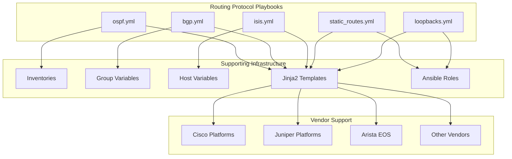
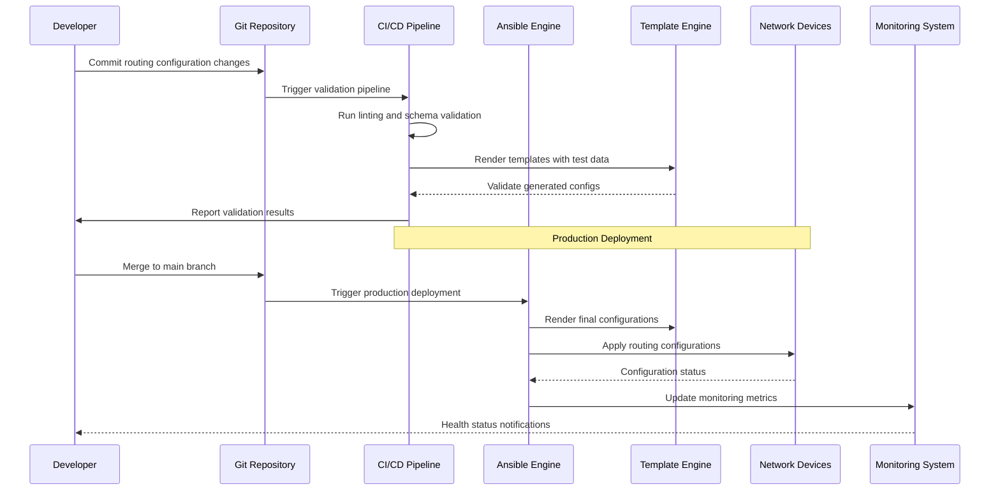
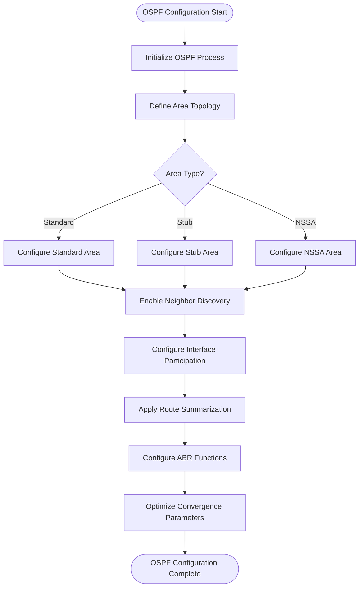
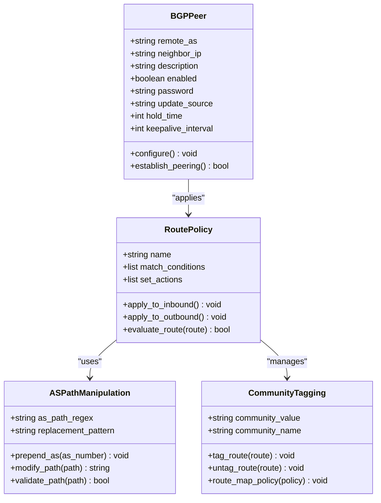
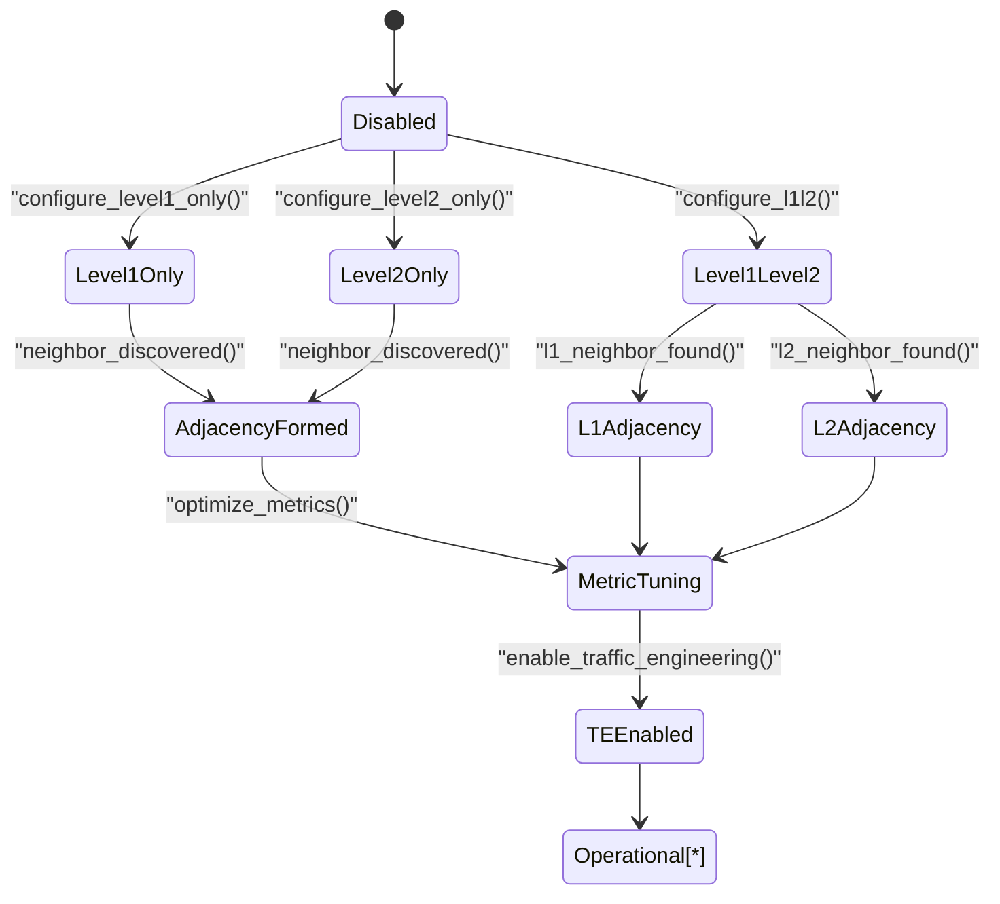
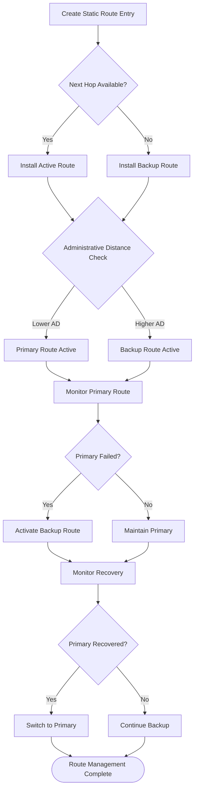
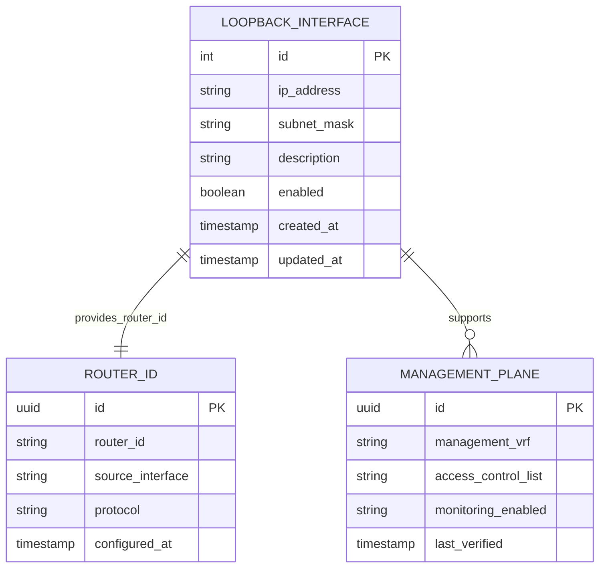
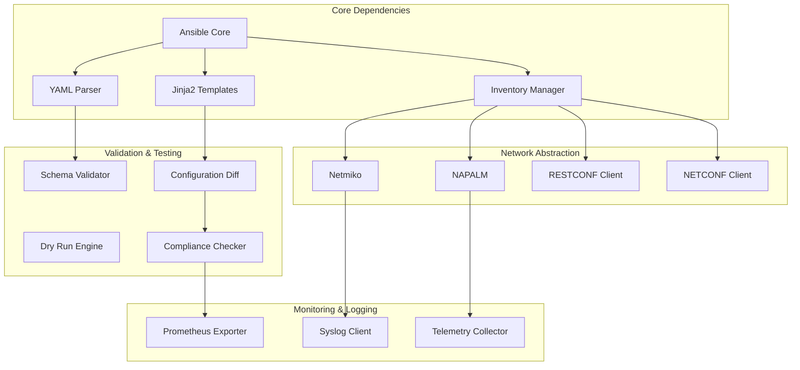

# Routing Protocols Playbooks

<cite>
**Referenced Files in This Document**
- [README.md](file://README.md)
</cite>

## Table of Contents
1. [Introduction](#introduction)
2. [Project Structure](#project-structure)
3. [Core Components](#core-components)
4. [Architecture Overview](#architecture-overview)
5. [Detailed Component Analysis](#detailed-component-analysis)
6. [Dependency Analysis](#dependency-analysis)
7. [Performance Considerations](#performance-considerations)
8. [Troubleshooting Guide](#troubleshooting-guide)
9. [Conclusion](#conclusion)
10. [Appendices](#appendices)

## Introduction

This document provides comprehensive documentation for routing protocol automation playbooks implementing dynamic routing solutions within the Enterprise Network Automation Platform. The platform supports automated configuration management for OSPF, BGP, IS-IS, static routes, and loopback interfaces across multi-vendor environments including Cisco IOS/IOS-XE/NX-OS, Juniper SRX/MX, Arista EOS, and other supported platforms.

The routing protocol automation system follows Infrastructure as Code principles, where all routing configurations are defined declaratively in structured data files and rendered into vendor-specific commands through Jinja2 templates. This approach ensures consistency, compliance, and auditability across thousands of network devices in enterprise-scale deployments.

## Project Structure

The routing protocol automation playbooks are organized within the Ansible playbook structure, following the platform's modular design:

**Diagram sources**
- [README.md:103-180](file://README.md#L103-L180)

The routing protocol playbooks integrate with the broader automation ecosystem, leveraging shared variables, templates, and roles to ensure consistent configuration management across diverse network topologies and vendor environments.

**Section sources**
- [README.md:103-180](file://README.md#L103-L180)

## Core Components

The routing protocol automation system consists of five primary playbooks, each addressing specific routing protocol requirements:

### OSPF Configuration Management
The OSPF playbook handles Open Shortest Path First routing protocol configuration, supporting multi-area designs, neighbor discovery, route summarization, and area-specific optimizations. It manages OSPF process initialization, interface participation, area assignments, and advanced features like stub areas and NSSA configurations.

### BGP Peering and Policy Management
The BGP playbook implements Border Gateway Protocol automation, including peer establishment, route policies, AS path manipulation, community tagging, and policy application. It supports both iBGP and eBGP scenarios with comprehensive route filtering and traffic engineering capabilities.

### IS-IS Traffic Engineering
The IS-IS playbook configures Intermediate System to Intermediate System routing with level-based topology management, metric tuning, and traffic engineering support. It handles L1/L2 adjacency formation, metric optimization, and integration with MPLS traffic engineering extensions.

### Static Route Management
The static_routes playbook provides comprehensive static route management with floating routes, administrative distance controls, and conditional routing based on interface or next-hop availability. It supports complex routing scenarios requiring deterministic path selection.

### Loopback Interface Configuration
The loopbacks playbook automates loopback interface creation and management for router IDs, management plane stability, and service endpoints. It ensures consistent IP address allocation and proper interface state management across the network fabric.

**Section sources**
- [README.md:401-409](file://README.md#L401-L409)

## Architecture Overview

The routing protocol automation architecture follows a layered approach with clear separation between configuration intent, template rendering, and device deployment:

**Diagram sources**
- [README.md:479-501](file://README.md#L479-L501)

The architecture integrates with the platform's GitOps workflow, ensuring all routing changes undergo automated validation, testing, and approval processes before deployment to production environments.

## Detailed Component Analysis

### OSPF Multi-Area Design Implementation

The OSPF automation supports complex multi-area designs with hierarchical topology management:

**Diagram sources**
- [README.md:401-409](file://README.md#L401-L409)

Key OSPF automation features include:
- **Multi-area topology management**: Automatic area assignment and inter-area route propagation
- **Neighbor discovery automation**: Dynamic neighbor relationship establishment with authentication
- **Route summarization**: Automated summary route generation at area boundaries
- **Convergence optimization**: Tunable timers and SPF calculation parameters
- **Area type flexibility**: Support for standard, stub, totally stubby, and NSSA areas

### BGP Route Policies and Traffic Engineering

The BGP automation implements sophisticated route policies and traffic engineering capabilities:

**Diagram sources**
- [README.md:401-409](file://README.md#L401-L409)

Advanced BGP automation capabilities include:
- **Dynamic peering management**: Automated peer establishment with authentication and session parameters
- **Policy-driven routing**: Complex route matching and modification using regular expressions
- **AS path manipulation**: Programmatic AS path prepending and modification for traffic engineering
- **Community-based policies**: Automated community tagging and policy application
- **Route filtering**: Granular prefix filtering with import/export policies

### IS-IS Traffic Engineering Configuration

The IS-IS automation supports Level 1/Level 2 topology management with traffic engineering enhancements:

**Diagram sources**
- [README.md:401-409](file://README.md#L401-L409)

IS-IS automation features encompass:
- **Level-based topology control**: Independent L1 and L2 adjacency management
- **Metric optimization**: Automated metric tuning for optimal path selection
- **Traffic engineering support**: Integration with MPLS-TE and explicit paths
- **Topology discovery**: Automated neighbor discovery and adjacency formation
- **Convergence optimization**: Configurable LSP generation and flooding parameters

### Static Route Management with Floating Routes

The static route automation provides comprehensive route management with high availability features:

**Diagram sources**
- [README.md:401-409](file://README.md#L401-L409)

Static route automation includes:
- **Floating route implementation**: Administrative distance-based failover mechanisms
- **Next hop tracking**: Dynamic route installation based on reachability
- **High availability**: Automatic failover and recovery procedures
- **Conditional routing**: Interface and object tracking for intelligent route selection

### Loopback Interface Management

The loopback automation ensures consistent management plane configuration:

**Diagram sources**
- [README.md:401-409](file://README.md#L401-L409)

Loopback automation features include:
- **Router ID management**: Consistent router ID assignment across routing protocols
- **Management plane isolation**: Dedicated management interfaces with security policies
- **Service endpoint stability**: Reliable addresses for services and monitoring
- **Address allocation automation**: Intelligent IP address assignment and conflict detection

**Section sources**
- [README.md:401-409](file://README.md#L401-L409)

## Dependency Analysis

The routing protocol playbooks have well-defined dependencies within the automation framework:

**Diagram sources**
- [README.md:184-199](file://README.md#L184-L199)

Key dependency relationships:
- **Template Rendering**: Jinja2 templates generate vendor-specific configurations
- **Device Communication**: Multiple transport protocols (SSH, NETCONF, RESTCONF) for device interaction
- **Validation Framework**: Schema validation and compliance checking ensure configuration correctness
- **Monitoring Integration**: Prometheus exporters and telemetry collectors provide operational visibility

**Section sources**
- [README.md:184-199](file://README.md#L184-L199)

## Performance Considerations

The routing protocol automation system is designed for enterprise-scale performance:

### Convergence Optimization
- **Incremental Updates**: Only changed configurations are applied to minimize disruption
- **Parallel Processing**: Concurrent device configuration updates across multiple nodes
- **Batch Operations**: Grouped configuration changes to reduce API call overhead
- **Connection Pooling**: Reusable device connections to minimize authentication overhead

### Memory and Resource Management
- **Lazy Loading**: Configuration data loaded on-demand rather than pre-loading entire inventories
- **Streaming Processing**: Large configuration files processed in chunks to prevent memory exhaustion
- **Caching Layer**: Frequently accessed data cached to reduce repeated lookups
- **Resource Limits**: Configurable limits on concurrent operations and memory usage

### Scalability Patterns
- **Horizontal Scaling**: Distributed execution across multiple Ansible controllers
- **Sharding Strategy**: Device groups processed independently for parallel execution
- **Retry Logic**: Exponential backoff and retry mechanisms for transient failures
- **Graceful Degradation**: Partial success handling when some devices are unreachable

## Troubleshooting Guide

Common issues and resolution strategies for routing protocol automation:

### Connection and Authentication Issues
- **SSH Connectivity**: Verify SSH reachability using `ansible all -m ping`
- **Authentication Failures**: Check credential rotation and vault access permissions
- **Session Timeouts**: Adjust connection timeouts for high-latency networks
- **Certificate Validation**: Ensure SSL/TLS certificates are valid and trusted

### Configuration Generation Problems
- **Template Errors**: Use `python -m python.config_gen --debug` for detailed error reporting
- **Variable Resolution**: Validate variable precedence and scope in group/host variables
- **Syntax Validation**: Run `ansible-playbook --syntax-check` before deployment
- **Dry Run Testing**: Execute with `--check --diff` flags to preview changes

### Routing Protocol Specific Issues
- **OSPF Neighbors**: Check interface participation and area configuration consistency
- **BGP Peers**: Verify AS numbers, authentication, and route policy application
- **IS-IS Adjacencies**: Confirm level settings and metric compatibility
- **Static Routes**: Validate next-hop reachability and administrative distances

### Monitoring and Alerting
- **Health Checks**: Use `health_check.yml` playbook for comprehensive device assessment
- **Drift Detection**: Run `drift_detection.yml` to identify configuration deviations
- **Compliance Scans**: Execute `compliance_scan.yml` for policy violation detection
- **Performance Metrics**: Monitor automation job duration and success rates via Prometheus

**Section sources**
- [README.md:674-685](file://README.md#L674-L685)

## Conclusion

The routing protocol automation playbooks provide a comprehensive solution for managing dynamic routing across enterprise network environments. By leveraging Infrastructure as Code principles, the system ensures consistent, compliant, and auditable routing configurations across multi-vendor deployments.

The modular architecture supports complex routing scenarios including multi-area OSPF designs, sophisticated BGP policies, IS-IS traffic engineering, and high-availability static routing. Integration with monitoring, compliance, and GitOps workflows enables automated validation, testing, and deployment of routing changes with minimal risk.

Best practices implemented include incremental configuration updates, parallel processing for scalability, comprehensive error handling, and robust rollback mechanisms. The system's extensible design allows for easy addition of new routing protocols and vendor-specific optimizations while maintaining consistency across the automation framework.

Future enhancements may include AI-driven anomaly detection, zero-touch provisioning integration, and advanced traffic engineering capabilities to further enhance the automation platform's intelligence and responsiveness.

## Appendices

### Vendor-Specific Command Differences

The automation framework abstracts vendor differences through template specialization:

| Feature | Cisco IOS/IOS-XE | Juniper MX/SRX | Arista EOS |
|---------|------------------|----------------|------------|
| OSPF Process | `router ospf <process-id>` | `set protocols ospf area <area-id>` | `router ospf <process-id>` |
| BGP Peering | `neighbor <ip> remote-as <as>` | `set protocols bgp group <name>` | `router bgp <as-number>` |
| IS-IS Levels | `router isis <tag>` | `set protocols isis level <level>` | `router isis <tag>` |
| Static Routes | `ip route <prefix> <next-hop>` | `set routing-options static route <prefix>` | `ip route <prefix> <next-hop>` |

### High Availability Configuration Examples

**OSPF HSRP Integration**: Configure OSPF to track HSRP state for automatic failover
**BGP Graceful Restart**: Enable BGP graceful restart for non-disruptive software upgrades
**IS-IS Fast Reroute**: Implement MPLS-TE fast reroute for sub-50ms failover
**Static Route Tracking**: Use object tracking for intelligent route selection

### Compliance and Security Best Practices

- **Authentication**: Always configure MD5/sha authentication for routing protocol neighbors
- **Prefix Filtering**: Implement inbound/outbound prefix filters to prevent route leaks
- **Route Maps**: Use route maps for granular control over route advertisement and reception
- **Logging**: Enable routing protocol logging for troubleshooting and audit trails
- **Access Control**: Restrict routing protocol communication to authorized peers only