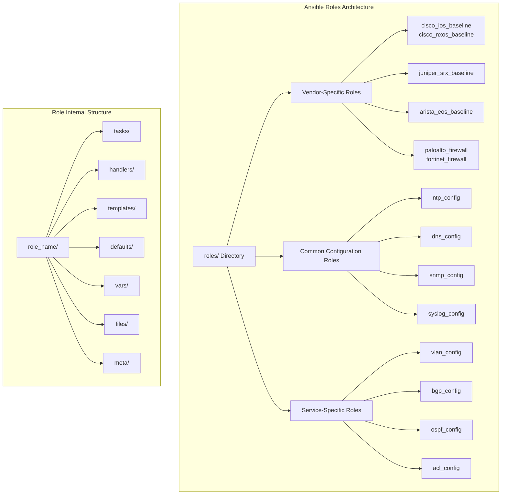
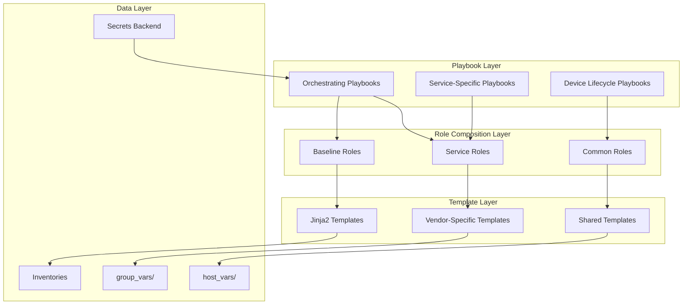
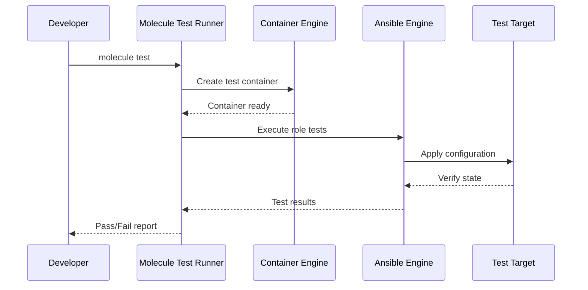
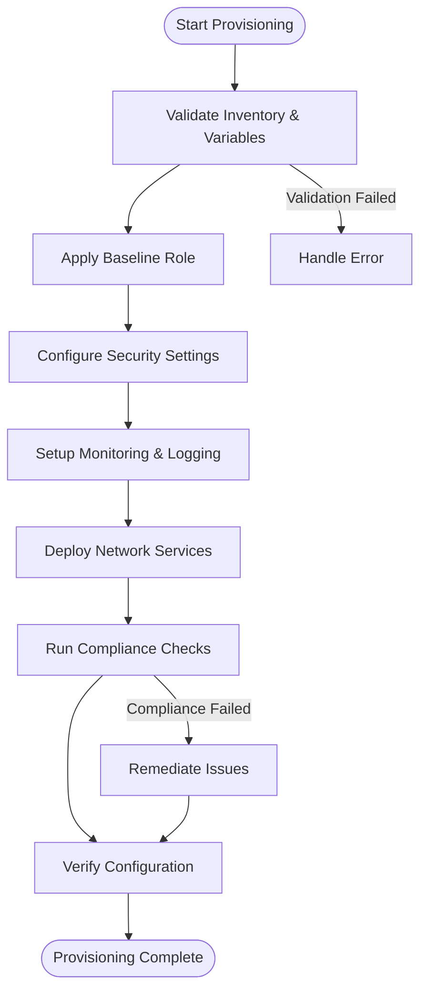
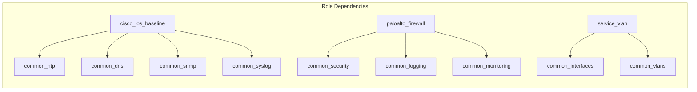

# Roles Structure

<cite>
**Referenced Files in This Document**
- [README.md](file://README.md)
</cite>

## Table of Contents
1. [Introduction](#introduction)
2. [Project Structure](#project-structure)
3. [Core Components](#core-components)
4. [Architecture Overview](#architecture-overview)
5. [Detailed Component Analysis](#detailed-component-analysis)
6. [Dependency Analysis](#dependency-analysis)
7. [Performance Considerations](#performance-considerations)
8. [Troubleshooting Guide](#troubleshooting-guide)
9. [Conclusion](#conclusion)
10. [Appendices](#appendices)

## Introduction

The Enterprise Network Automation Platform implements a sophisticated Ansible roles architecture designed for managing thousands of network devices across multi-vendor, multi-region environments. This role-based automation pattern enables reusable, modular configurations for different device types and functions, following enterprise-grade best practices for scalability, maintainability, and compliance.

The platform supports major networking vendors including Cisco (IOS, IOS-XE, NX-OS), Juniper (SRX, MX), Arista (EOS), Palo Alto, Fortinet, Check Point, F5, pfSense, and OPNsense. Each vendor platform has dedicated baseline roles and specialized configuration roles that ensure consistent, compliant network infrastructure management.

## Project Structure

The Ansible roles architecture follows a well-defined directory structure that promotes reusability and maintainability:



**Diagram sources**
- [README.md:103-180](file://README.md#L103-L180)

Each role contains the standard Ansible role directories:
- **tasks/**: Main task files that define the configuration logic
- **handlers/**: Handler tasks triggered by other tasks (e.g., service restarts)
- **templates/**: Jinja2 templates for generating vendor-specific configurations
- **defaults/**: Default variable values with low precedence
- **vars/**: Role-specific variables with high precedence
- **files/**: Static files to be copied to target devices
- **meta/**: Role metadata and dependency declarations

**Section sources**
- [README.md:103-180](file://README.md#L103-L180)

## Core Components

### Baseline Configuration Roles

The platform implements comprehensive baseline configuration roles for each supported vendor platform:

#### Cisco IOS Baseline (`cisco_ios_baseline`)
Applies foundational security and operational settings for Cisco IOS devices including SSH hardening, AAA configuration, logging, and system parameters.

#### Cisco NX-OS Baseline (`cisco_nxos_baseline`) 
Configures NX-OS specific baselines with data center optimizations, fabric integration, and advanced security features.

#### Juniper SRX Baseline (`juniper_srx_baseline`)
Establishes SRX firewall baselines with zone-based policies, NAT rules, and high availability configurations.

#### Arista EOS Baseline (`arista_eos_baseline`)
Sets up EOS platforms with eAPI enablement, telemetry streaming, and modern network automation features.

### Firewall Management Roles

#### Palo Alto Firewall (`paloalto_firewall`)
Manages PAN-OS firewalls with rule optimization, object management, and policy enforcement.

#### Fortinet Firewall (`fortinet_firewall`)
Configures FortiOS devices with SD-WAN integration, threat protection, and cloud connectivity.

### Common Configuration Roles

#### NTP Configuration (`ntp_config`)
Standardizes time synchronization across all devices with multiple server redundancy and authentication.

#### DNS Configuration (`dns_config`)
Implements centralized DNS resolution with forwarders, conditional forwarding, and security extensions.

#### SNMP Configuration (`snmp_config`)
Deploys SNMPv3 with encryption, access controls, and monitoring integration.

#### Syslog Configuration (`syslog_config`)
Configures centralized logging with structured formats, filtering, and retention policies.

**Section sources**
- [README.md:371-435](file://README.md#L371-L435)

## Architecture Overview

The Ansible roles architecture follows a layered approach with clear separation of concerns:



**Diagram sources**
- [README.md:103-180](file://README.md#L103-L180)
- [README.md:284-336](file://README.md#L284-L336)

The architecture emphasizes:
- **Modularity**: Each role focuses on a single responsibility
- **Reusability**: Roles can be composed across different playbooks
- **Scalability**: Supports thousands of devices through parallel execution
- **Compliance**: Built-in policy enforcement at every layer
- **Security**: Secrets management integrated throughout the stack

## Detailed Component Analysis

### Role Development Standards

The platform adheres to Ansible best practices with standardized development patterns:

#### Variable Scoping Strategy
Variables follow Ansible's precedence hierarchy:
- **Host vars**: Device-specific overrides
- **Group vars**: Environment and role-based defaults  
- **Role defaults**: Safe fallback values
- **Role vars**: Role-specific configuration
- **Extra vars**: Runtime overrides

#### Conditional Logic Patterns
Roles implement robust conditional execution using:
- Device platform detection (`ansible_network_os`)
- Feature flag evaluation
- Dependency validation
- State verification before changes

#### Error Handling Framework
Comprehensive error handling includes:
- Graceful failure with rollback capabilities
- Detailed logging with context information
- Validation checks before configuration changes
- Recovery procedures for partial failures

#### Testing Strategy with Molecule
Each role includes Molecule test scenarios:



**Diagram sources**
- [README.md:517-544](file://README.md#L517-L544)

### Role Composition Examples

#### Initial Device Provisioning Flow


**Diagram sources**
- [README.md:371-386](file://README.md#L371-L386)

### Dependency Management

Roles declare dependencies through meta/main.yml files:



**Diagram sources**
- [README.md:103-180](file://README.md#L103-L180)

### Versioning and Compatibility

The platform maintains backward compatibility through:
- **Semantic versioning** for roles and collections
- **Feature flags** for gradual rollout of new functionality
- **Compatibility matrices** documenting supported versions
- **Migration scripts** for breaking changes
- **Deprecation warnings** with upgrade paths

**Section sources**
- [README.md:517-544](file://README.md#L517-L544)

## Dependency Analysis

The role dependency graph shows complex interrelationships:

```mermaid
graph TB
subgraph "Foundation Roles"
Common[common_* roles]
Security[security_hardening]
Monitoring[monitoring_setup]
end
subgraph "Platform Baselines"
Cisco[cisco_*_baseline]
Juniper[juniper_*_baseline]
Arista[arista_eos_baseline]
Firewalls[paloalto_firewall, fortinet_firewall]
end
subgraph "Service Roles"
VLAN[vlan_config]
Routing[routing_protocols]
SecurityServices[security_services]
end
subgraph "Orchestration"
Lifecycle[lifecycle_playbooks]
Operations[operations_playbooks]
end
Common --> Cisco
Common --> Juniper
Common --> Arista
Common --> Firewalls
Security --> Cisco
Security --> Juniper
Security --> Arista
Security --> Firewalls
Monitoring --> Cisco
Monitoring --> Juniper
Monitoring --> Arista
Monitoring --> Firewalls
VLAN --> Cisco
VLAN --> Juniper
VLAN --> Arista
Routing --> Cisco
Routing --> Juniper
Routing --> Arista
Lifecycle --> Platform Baselines
Operations --> Service Roles
```

**Diagram sources**
- [README.md:103-180](file://README.md#L103-L180)

Key dependency patterns:
- **Foundation-first**: Common roles must be deployed before platform-specific roles
- **Security baseline**: Security hardening applies across all platforms
- **Monitoring integration**: All devices require monitoring setup
- **Service composition**: Network services build upon platform baselines

**Section sources**
- [README.md:103-180](file://README.md#L103-L180)

## Performance Considerations

The roles architecture optimizes performance through:

### Parallel Execution
- **Concurrent role execution** where dependencies allow
- **Batch processing** for similar device types
- **Connection pooling** for API-based operations
- **Lazy loading** of optional components

### Resource Optimization
- **Conditional feature deployment** based on device capabilities
- **Incremental updates** to minimize configuration changes
- **Caching mechanisms** for repeated operations
- **Efficient template rendering** with shared components

### Scalability Patterns
- **Sharding strategies** for large deployments
- **Queue-based processing** for resource-intensive tasks
- **Retry mechanisms** with exponential backoff
- **Graceful degradation** under load

## Troubleshooting Guide

### Common Role Issues

| Issue | Symptoms | Resolution |
|-------|----------|------------|
| Variable conflicts | Unexpected configuration values | Check variable precedence and scope |
| Template errors | Jinja2 rendering failures | Validate template syntax and available variables |
| Connection timeouts | Device communication failures | Verify network reachability and credentials |
| Permission errors | Configuration application failures | Check device privileges and role permissions |
| Dependency failures | Missing required roles or collections | Install missing dependencies via ansible-galaxy |

### Debugging Techniques

```bash
# Enable verbose logging
ansible-playbook playbook.yml -vvv

# Check variable resolution
ansible all -m debug -a "var=variable_name"

# Test role independently
molecule test --scenario-name default

# Validate templates
python -m jinja2.cli -t templates/file.j2

# Check role dependencies
ansible-galaxy info role_name
```

### Performance Profiling

```bash
# Generate execution profile
ansible-playbook playbook.yml --profile --profile-path profile.json

# Analyze slow tasks
ansible-playbook playbook.yml --diff --check

# Monitor resource usage
ansible all -m shell -a "top -bn1"
```

**Section sources**
- [README.md:674-685](file://README.md#L674-L685)

## Conclusion

The Enterprise Network Automation Platform's Ansible roles architecture provides a robust, scalable foundation for managing diverse network infrastructures. The role-based approach ensures consistency, maintainability, and extensibility while supporting enterprise requirements for compliance, security, and operational excellence.

Key strengths include:
- **Vendor-agnostic design** supporting multiple platforms
- **Comprehensive testing** with Molecule and automated validation
- **Enterprise-grade security** with secrets management and compliance enforcement
- **Production-ready operations** with rollback capabilities and monitoring
- **Developer-friendly** with clear documentation and best practices

The architecture successfully balances flexibility with standardization, enabling teams to manage complex network environments while maintaining control over configuration drift and ensuring compliance across all devices.

## Appendices

### Quick Reference: Role Creation Checklist

When creating new roles, ensure:
- [ ] Standard directory structure (tasks, handlers, templates, etc.)
- [ ] Proper variable scoping with defaults and examples
- [ ] Comprehensive error handling and validation
- [ ] Molecule test scenarios for all use cases
- [ ] Documentation with examples and troubleshooting
- [ ] CI/CD pipeline integration
- [ ] Backward compatibility considerations
- [ ] Performance optimization for scale

### Supported Platforms Matrix

| Platform | Baseline Role | Status | Features |
|----------|---------------|--------|----------|
| Cisco IOS | cisco_ios_baseline | ✅ Supported | Full feature set |
| Cisco NX-OS | cisco_nxos_baseline | ✅ Supported | Data center features |
| Juniper SRX | juniper_srx_baseline | ✅ Supported | Firewall features |
| Arista EOS | arista_eos_baseline | ✅ Supported | Modern automation |
| Palo Alto | paloalto_firewall | ✅ Supported | Advanced security |
| Fortinet | fortinet_firewall | ✅ Supported | SD-WAN integration |