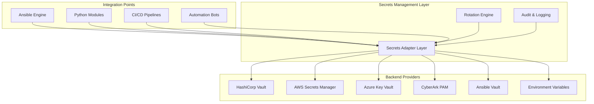
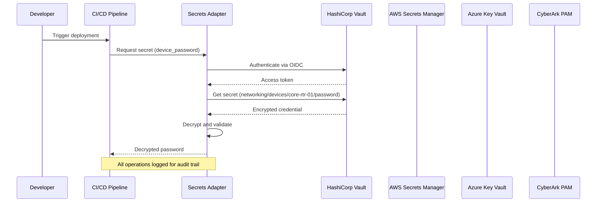
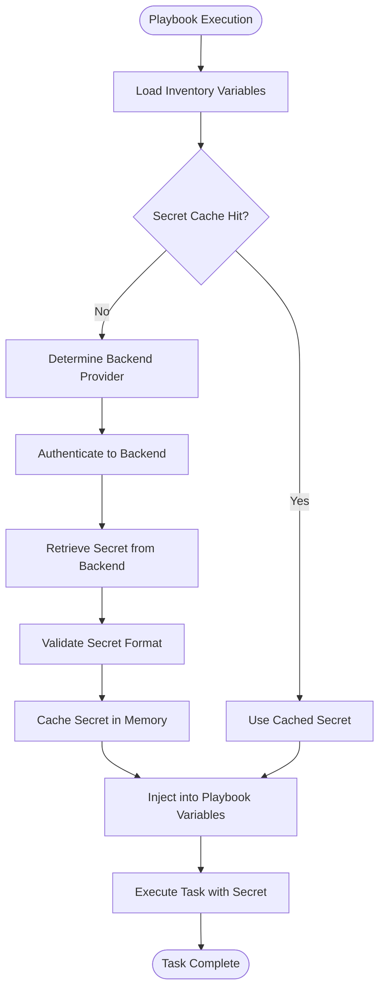
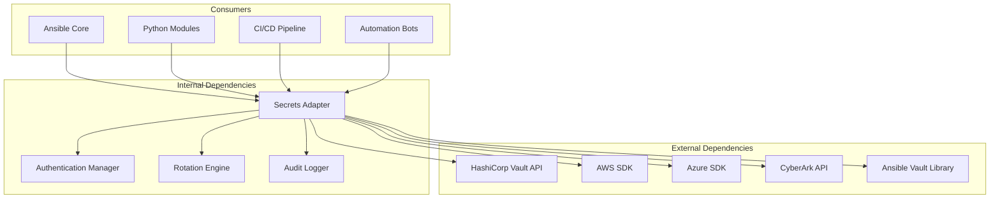

# Secrets Integration

<cite>
**Referenced Files in This Document**
- [README.md](file://README.md)
</cite>

## Table of Contents
1. [Introduction](#introduction)
2. [Project Structure](#project-structure)
3. [Core Components](#core-components)
4. [Architecture Overview](#architecture-overview)
5. [Detailed Component Analysis](#detailed-component-analysis)
6. [Dependency Analysis](#dependency-analysis)
7. [Performance Considerations](#performance-considerations)
8. [Troubleshooting Guide](#troubleshooting-guide)
9. [Conclusion](#conclusion)

## Introduction

The Enterprise Network Automation Platform implements a comprehensive secrets management system designed for production-grade network automation at enterprise scale. This system provides a unified adapter layer supporting multiple secrets backends while maintaining strict security policies and compliance requirements across multi-vendor, multi-region environments.

The platform follows DevSecOps principles where "secrets are never committed" to version control, ensuring that all sensitive credentials, tokens, and certificates are managed through secure, centralized systems with proper rotation policies and audit capabilities.

## Project Structure

The secrets management system is integrated throughout the platform's architecture, with the core components organized as follows:



**Diagram sources**
- [README.md:339-357](file://README.md#L339-L357)

**Section sources**
- [README.md:339-370](file://README.md#L339-L370)

## Core Components

### Unified Secrets Adapter Layer

The platform implements a unified adapter layer that abstracts different secrets backends behind a consistent interface. This design enables seamless switching between providers while maintaining application code consistency.

#### Supported Backends

| Backend | Authentication Methods | Use Cases |
|---------|----------------------|-----------|
| HashiCorp Vault | AppRole, Kubernetes, OIDC, Username/Password | Primary backend for device credentials, API tokens, SSH keys |
| AWS Secrets Manager | IAM Roles, OIDC Federation | Cloud-native applications, AWS service integrations |
| Azure Key Vault | Managed Identity, Service Principal, OIDC | Azure cloud services, hybrid deployments |
| CyberArk PAM | SSO, Certificate-based, API Keys | Privileged access management, human operator credentials |
| Ansible Vault | File-based encryption | Development environments, encrypted variable files |
| Environment Variables | Process-level configuration | Local development, container orchestration |

#### Secret Types and Rotation Policies

| Secret Type | Rotation Interval | Method | Security Level |
|-------------|------------------|--------|---------------|
| Device passwords | 90 days | Vault auto-rotation + Ansible push | High |
| API tokens | 30 days | Secrets Manager + Lambda/Function | Medium-High |
| SSH keys | 90 days | Vault SSH CA with short-lived certs | High |
| TLS certificates | 1 year (auto-renew at 60 days) | ACME / Vault PKI | Critical |
| CI/CD tokens | Ephemeral | OIDC federation (no static secrets) | Medium |

**Section sources**
- [README.md:339-368](file://README.md#L339-L368)

## Architecture Overview

The secrets management architecture follows a layered approach with clear separation of concerns:



**Diagram sources**
- [README.md:339-357](file://README.md#L339-L357)

### Authentication Methods

The platform supports multiple authentication methods tailored to different operational contexts:

#### CI/CD Pipeline Authentication
- **OIDC Federation**: GitHub Actions → HashiCorp Vault/AWS/Azure
- **Short-lived tokens**: Automatic token refresh without persistent credentials
- **Workload identity**: Kubernetes service accounts for containerized workloads

#### Runtime Authentication
- **AppRole**: Machine-to-machine authentication for automated processes
- **Kubernetes Service Accounts**: Pod-level authentication in K8s environments
- **Username/Password**: Legacy support for specific integrations
- **Certificate-based**: Mutual TLS for high-security scenarios

**Section sources**
- [README.md:339-357](file://README.md#L339-L357)

## Detailed Component Analysis

### Secrets Retrieval Patterns

#### Dynamic Secret Injection

The platform implements dynamic secret injection patterns that allow playbooks and roles to access secrets without hardcoding values:



**Diagram sources**
- [README.md:339-357](file://README.md#L339-L357)

#### Variable Masking and Audit Logging

All secret operations include comprehensive masking and logging:

- **Variable Masking**: Secrets are automatically masked in logs and output
- **Audit Trail**: Every secret access is logged with timestamp, user, and context
- **Access Controls**: Role-based access control (RBAC) for secret visibility
- **Compliance Reporting**: Automated compliance checks for secret usage patterns

### Implementation Examples

#### Playbook Secret Access Pattern

Playbooks access secrets through standardized interfaces:

```yaml
# Example playbook structure (conceptual)
- name: Configure device with secrets
  hosts: core_routers
  tasks:
    - name: Retrieve device credentials
      ansible.builtin.include_vars:
        file: "{{ vault_device_credentials }}"
    
    - name: Apply configuration
      cisco.ios.ios_config:
        provider:
          host: "{{ inventory_hostname }}"
          username: "{{ device_username }}"
          password: "{{ device_password }}"
          auth_pass: "{{ enable_password }}"
```

#### Role-Based Secret Management

Roles encapsulate secret dependencies and provide consistent interfaces:

```yaml
# Role structure example (conceptual)
roles/
├── device_configuration/
│   ├── defaults/main.yml
│   ├── vars/secrets.yml
│   ├── tasks/
│   │   ├── main.yml
│   │   └── configure_network.yml
│   └── templates/
```

### Error Handling and Failure Modes

The system implements robust error handling for secret retrieval failures:

- **Graceful Degradation**: Fallback to alternative backends when primary fails
- **Timeout Handling**: Configurable timeouts for backend responses
- **Retry Logic**: Exponential backoff for transient failures
- **Alerting**: Immediate notification on critical secret access failures
- **Audit Triggers**: Compliance alerts for unauthorized access attempts

**Section sources**
- [README.md:339-370](file://README.md#L339-L370)

## Dependency Analysis

The secrets management system has well-defined dependencies and integration points:



**Diagram sources**
- [README.md:339-357](file://README.md#L339-L357)

### Component Coupling and Cohesion

- **High Cohesion**: Each backend adapter focuses on its specific provider
- **Low Coupling**: Clear interfaces between adapter layer and consumers
- **Single Responsibility**: Separate modules for authentication, rotation, and auditing
- **Open/Closed Principle**: Easy to add new backend providers without modifying existing code

**Section sources**
- [README.md:339-370](file://README.md#L339-L370)

## Performance Considerations

### Caching Strategy

The system implements intelligent caching to optimize secret retrieval performance:

- **In-Memory Caching**: Short-term caching within process lifetime
- **TTL-Based Expiration**: Configurable time-to-live for cached secrets
- **Lazy Loading**: Secrets loaded on-demand rather than at startup
- **Batch Operations**: Bulk secret retrieval for efficiency

### Scalability Characteristics

- **Horizontal Scaling**: Stateless adapters support multiple instances
- **Connection Pooling**: Efficient connection management to backend services
- **Async Operations**: Non-blocking secret retrieval for high-throughput scenarios
- **Rate Limiting**: Built-in protection against backend service throttling

### Monitoring and Observability

- **Metrics Collection**: Secret retrieval latency, success rates, cache hit ratios
- **Health Checks**: Backend connectivity and authentication health monitoring
- **Resource Usage**: Memory and CPU utilization tracking for adapter components

## Troubleshooting Guide

### Common Issues and Resolutions

| Issue | Symptoms | Resolution |
|-------|----------|------------|
| Backend Authentication Failure | Timeout errors, 401/403 responses | Verify OIDC configuration, check AppRole credentials, validate service account permissions |
| Secret Not Found | 404 errors, missing variable warnings | Confirm secret path exists, verify backend namespace/path structure |
| Rotation Policy Violations | Compliance warnings, failed deployments | Review rotation schedules, update policy configurations |
| Performance Degradation | Slow playbook execution, timeout errors | Enable caching, optimize backend connections, review rate limits |
| Audit Log Gaps | Missing access records, incomplete trails | Verify logging configuration, check storage availability |

### Debugging Techniques

- **Verbose Logging**: Enable debug-level logging for secret operations
- **Network Tracing**: Capture API calls to backend services
- **Credential Validation**: Test authentication independently of playbook execution
- **Backup Verification**: Ensure backup and recovery procedures work correctly

### Best Practices

- **Least Privilege**: Grant minimum required permissions to each service
- **Regular Audits**: Periodic review of secret access patterns and permissions
- **Testing**: Comprehensive testing of secret retrieval in staging environments
- **Documentation**: Maintain up-to-date documentation for secret ownership and usage

**Section sources**
- [README.md:674-685](file://README.md#L674-L685)

## Conclusion

The Enterprise Network Automation Platform's secrets management system provides a robust, scalable, and secure foundation for managing sensitive credentials across complex network automation workflows. The unified adapter layer abstracts complexity while supporting diverse backend providers, enabling organizations to adopt best practices for secret management without vendor lock-in.

Key strengths include comprehensive rotation policies, multiple authentication methods, thorough audit capabilities, and seamless integration with both Ansible and custom Python modules. The system's design ensures that security remains paramount while maintaining operational flexibility and performance at enterprise scale.

Future enhancements may include additional backend providers, enhanced machine learning-based anomaly detection for secret access patterns, and deeper integration with emerging zero-trust security architectures.