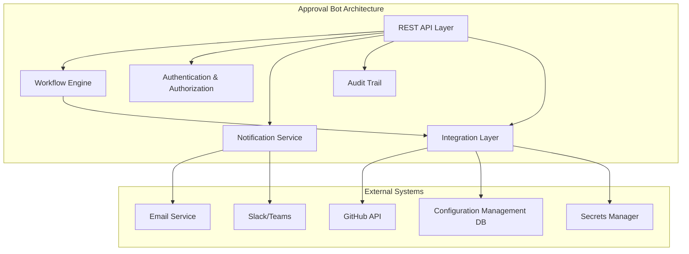
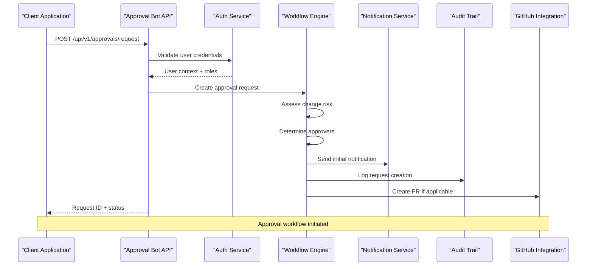
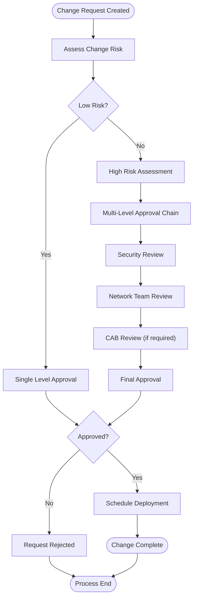

# Approval Bot

<cite>
**Referenced Files in This Document**
- [README.md](file://README.md)
</cite>

## Table of Contents
1. [Introduction](#introduction)
2. [Project Structure](#project-structure)
3. [Core Components](#core-components)
4. [Architecture Overview](#architecture-overview)
5. [Detailed Component Analysis](#detailed-component-analysis)
6. [Dependency Analysis](#dependency-analysis)
7. [Performance Considerations](#performance-considerations)
8. [Troubleshooting Guide](#troubleshooting-guide)
9. [Conclusion](#conclusion)
10. [Appendices](#appendices)

## Introduction

The Approval Bot is a critical component of the Enterprise Network Automation Platform that manages change management workflows through automated approval processes. It serves as the central orchestrator for change requests, providing REST APIs for programmatic access and ChatOps integration for team collaboration. The bot ensures that all network changes follow established governance policies while maintaining operational efficiency through intelligent routing and escalation mechanisms.

This documentation covers the complete Approval Bot functionality including REST API endpoints, workflow management, role-based permissions, escalation policies, SLA tracking, GitHub integration, email notifications, audit trails, and ChatOps commands.

## Project Structure

The Approval Bot is part of the broader automation bots ecosystem within the network automation platform. According to the project architecture, the bot operates at `/api/v1/approvals` and integrates with Slack/Teams for ChatOps capabilities.



**Diagram sources**
- [README.md:460-478](file://README.md#L460-L478)

**Section sources**
- [README.md:460-478](file://README.md#L460-L478)

## Core Components

The Approval Bot consists of several core components that work together to provide comprehensive change management capabilities:

### REST API Endpoints

The bot exposes four primary REST API endpoints for change management operations:

| Endpoint | Method | Purpose | Authentication Required |
|----------|--------|---------|----------------------|
| `/api/v1/approvals/request` | POST | Submit new approval requests | Yes |
| `/api/v1/approvals/{id}/status` | GET | Track approval status | Yes |
| `/api/v1/approvals/{id}/approve` | POST | Approve change request | Yes (Approver Role) |
| `/api/v1/approvals/{id}/reject` | POST | Reject change request | Yes (Approver Role) |

### Workflow Management

The workflow engine handles the lifecycle of approval requests from creation to completion, supporting multi-level approval chains and conditional routing based on change risk assessment.

### Role-Based Access Control

The system implements granular permissions ensuring that only authorized personnel can approve or reject changes based on their roles and the change classification.

### Notification System

Automated notifications are sent via email and ChatOps platforms (Slack/Teams) to keep stakeholders informed about approval status changes and pending actions.

**Section sources**
- [README.md:460-478](file://README.md#L460-L478)

## Architecture Overview

The Approval Bot follows a microservices architecture pattern with clear separation of concerns and event-driven communication between components.



**Diagram sources**
- [README.md:460-478](file://README.md#L460-L478)
- [README.md:619-638](file://README.md#L619-L638)

## Detailed Component Analysis

### REST API Implementation

#### POST /api/v1/approvals/request

This endpoint accepts change requests with the following payload structure:

```json
{
  "title": "Network Configuration Change",
  "description": "Update firewall rules for production environment",
  "change_type": "firewall_rule",
  "risk_level": "high",
  "affected_devices": ["fw-edge-01", "fw-core-02"],
  "implementation_plan": "Apply rule changes during maintenance window",
  "rollback_plan": "Revert to previous rule set",
  "requested_by": "user@company.com",
  "scheduled_time": "2024-01-15T02:00:00Z",
  "github_pr_url": "https://github.com/org/repo/pull/123"
}
```

#### GET /api/v1/approvals/{id}/status

Returns the current status and details of an approval request:

```json
{
  "id": "CHG-456",
  "title": "Network Configuration Change",
  "status": "pending_approval",
  "current_stage": "security_review",
  "approvers": ["security-team@company.com", "network-lead@company.com"],
  "created_at": "2024-01-15T10:00:00Z",
  "updated_at": "2024-01-15T10:30:00Z",
  "sla_deadline": "2024-01-15T18:00:00Z",
  "audit_trail": [...]
}
```

#### POST /api/v1/approvals/{id}/approve

Approves a change request with optional comments:

```json
{
  "comment": "Approved after security review",
  "conditions": ["Verify backup before deployment"]
}
```

#### POST /api/v1/approvals/{id}/reject

Rejects a change request with required justification:

```json
{
  "reason": "Insufficient rollback plan",
  "feedback": "Please provide detailed rollback procedures"
}
```

### Approval Workflows

The system supports multiple approval workflow patterns:

#### Single-Level Approval
Used for low-risk changes requiring one approver's authorization.

#### Multi-Level Approval
Sequential approval process where each level must approve before proceeding to the next.

#### Parallel Approval
Multiple approvers can approve simultaneously, with all approvals required.

#### Conditional Routing
Approvers are automatically selected based on change characteristics such as:
- Risk level assessment
- Affected infrastructure components
- Time of day and maintenance windows
- Geographic region



**Diagram sources**
- [README.md:460-478](file://README.md#L460-L478)

### Role-Based Permissions

The system implements a comprehensive role hierarchy:

| Role | Permissions | Description |
|------|-------------|-------------|
| `change_requester` | Create requests, view own requests | Any authenticated user |
| `approver` | Approve/reject requests | Designated approvers per domain |
| `security_approver` | Approve security-related changes | Security team members |
| `network_approver` | Approve network configuration changes | Network engineering leads |
| `cab_member` | Participate in CAB reviews | Change Advisory Board members |
| `admin` | Manage workflows, users, and system settings | System administrators |

### Escalation Policies

Automatic escalation ensures timely processing of approval requests:

- **First Reminder**: 2 hours before SLA deadline
- **Second Reminder**: 1 hour before SLA deadline  
- **Escalation**: Notify manager if approver doesn't respond within SLA
- **Auto-Approval**: For low-risk changes after extended timeout
- **Auto-Rejection**: For high-risk changes exceeding maximum time limits

### SLA Tracking

Service Level Agreements are enforced across different change types:

| Change Type | Response SLA | Resolution SLA | Priority |
|-------------|--------------|----------------|----------|
| Critical Infrastructure | 15 minutes | 2 hours | P1 |
| High Risk Changes | 1 hour | 4 hours | P2 |
| Medium Risk Changes | 4 hours | 8 hours | P3 |
| Low Risk Changes | 8 hours | 24 hours | P4 |

### GitHub Integration

The Approval Bot seamlessly integrates with GitHub pull requests:

- **PR Creation**: Automatically creates PRs for approved changes
- **Status Updates**: Posts approval status updates to PR comments
- **Branch Protection**: Enforces approval requirements before merge
- **Code Review**: Links approval decisions to code review comments
- **Webhook Integration**: Responds to PR events for workflow triggers

### Email Notifications

Comprehensive email notification system keeps stakeholders informed:

- **New Request**: Immediate notification to assigned approvers
- **Status Changes**: Real-time updates when approval status changes
- **SLA Alerts**: Proactive warnings approaching deadlines
- **Completion Notices**: Confirmation when changes are completed
- **Escalation Alerts**: Notifications when requests are escalated

### Audit Trails

Complete audit logging ensures compliance and traceability:

- **User Actions**: All approval/rejection decisions with timestamps
- **System Events**: Automated escalations and status changes
- **Communication Logs**: Email and ChatOps message history
- **Change History**: Complete lifecycle tracking of each request
- **Compliance Reports**: Exportable audit logs for regulatory requirements

### ChatOps Commands

The bot supports natural language commands through Slack and Microsoft Teams:

#### Command Syntax

```
!approval review PR-123
!approval status CHG-456
!approval list pending
!approval approve CHG-456 -c "Approved after review"
!approval reject CHG-456 -r "Insufficient testing"
!approval help
```

#### Command Examples

**Review a Pull Request:**
```
!approval review PR-123
```
Bot responds with PR details, affected systems, and approval status.

**Check Change Status:**
```
!approval status CHG-456
```
Returns current status, approvers, and remaining SLA time.

**Bulk Operations:**
```
!approval list pending -a @team-channel
```
Lists all pending approvals and posts them to a channel.

**Quick Approve/Reject:**
```
!approval approve CHG-456
!approval reject CHG-456 -r "Needs more testing"
```

## Dependency Analysis

The Approval Bot has several key dependencies within the platform ecosystem:

```mermaid
graph TB
subgraph "Internal Dependencies"
Auth[Authentication Service]
Config[Configuration Management]
Secrets[Secrets Manager]
Monitoring[Monitoring & Alerting]
Logging[Centralized Logging]
end
subgraph "External Dependencies"
GitHub[GitHub API]
EmailSMTP[SMTP Server]
SlackAPI[Slack API]
TeamsAPI[Microsoft Teams API]
CMDB[Configuration Management Database]
end
subgraph "Data Stores"
Redis[Redis Cache]
PostgreSQL[PostgreSQL Database]
Elasticsearch[Elasticsearch]
end
ApprovalBot[Approval Bot] --> Auth
ApprovalBot --> Config
ApprovalBot --> Secrets
ApprovalBot --> Monitoring
ApprovalBot --> Logging
ApprovalBot --> GitHub
ApprovalBot --> EmailSMTP
ApprovalBot --> SlackAPI
ApprovalBot --> TeamsAPI
ApprovalBot --> CMDB
ApprovalBot --> Redis
ApprovalBot --> PostgreSQL
ApprovalBot --> Elasticsearch
```



**Diagram sources**
- [README.md:460-478](file://README.md#L460-L478)

**Section sources**
- [README.md:460-478](file://README.md#L460-L478)

## Performance Considerations

### Scalability Requirements

- **Concurrent Requests**: Support 100+ simultaneous approval requests
- **Response Time**: API responses under 200ms for 95th percentile
- **Throughput**: Handle 1000+ requests per minute during peak periods
- **Database Queries**: Optimized queries with proper indexing
- **Cache Strategy**: Redis caching for frequently accessed data

### Optimization Strategies

- **Asynchronous Processing**: Background job queue for notifications and integrations
- **Connection Pooling**: Efficient database and API connection management
- **Batch Operations**: Bulk processing for multiple approval decisions
- **Pagination**: Efficient handling of large approval lists
- **Rate Limiting**: Protect against abuse and ensure fair usage

### Monitoring Metrics

Key performance indicators to monitor:
- API response times by endpoint
- Approval processing latency
- Queue depth and processing rates
- Error rates and failure patterns
- Resource utilization (CPU, memory, disk)

## Troubleshooting Guide

### Common Issues and Resolutions

| Issue | Symptoms | Resolution |
|-------|----------|------------|
| Authentication Failures | 401 errors on API calls | Verify JWT tokens, check user permissions |
| Permission Denied | 403 errors when approving | Confirm user has approver role for change type |
| Timeout Errors | Slow API responses | Check database connections, external service availability |
| Notification Failures | Missing email/ChatOps messages | Verify SMTP configuration, webhook URLs |
| Workflow Stuck | Requests not progressing | Check for missing approvers, review escalation policies |

### Debugging Tools

- **API Health Checks**: `/api/v1/approvals/health` endpoint
- **Audit Log Viewer**: Searchable interface for approval history
- **Performance Profiler**: Identify slow endpoints and bottlenecks
- **Error Tracking**: Centralized error monitoring and alerting

### Recovery Procedures

- **Queue Recovery**: Restart background workers for stuck jobs
- **State Repair**: Manual intervention for corrupted approval states
- **Data Migration**: Schema updates with backward compatibility
- **Backup Restoration**: Point-in-time recovery from backups

## Conclusion

The Approval Bot provides a comprehensive solution for managing network change requests within the enterprise automation platform. By combining robust API endpoints, intelligent workflow management, role-based permissions, and seamless integrations with GitHub, email, and ChatOps platforms, it ensures that all network changes follow established governance policies while maintaining operational efficiency.

The system's design emphasizes scalability, reliability, and auditability, making it suitable for enterprise environments with strict compliance requirements. The flexible workflow engine supports various approval patterns, from simple single-level approvals to complex multi-stage processes involving multiple teams and stakeholders.

Future enhancements may include AI-powered risk assessment, predictive analytics for approval timing, and advanced reporting capabilities for continuous improvement of the change management process.

## Appendices

### API Reference Summary

All API endpoints require authentication via JWT tokens and support standard HTTP methods with JSON request/response formats. Error responses follow consistent patterns with appropriate HTTP status codes and descriptive error messages.

### Security Considerations

- All API endpoints enforce authentication and authorization
- Sensitive data is encrypted at rest and in transit
- Audit trails capture all user actions and system events
- Rate limiting prevents abuse and ensures fair usage
- Input validation protects against injection attacks

### Integration Examples

The Approval Bot can be integrated with existing CI/CD pipelines, ticketing systems, and monitoring tools through its comprehensive API and webhook support. Documentation for specific integrations is available in the platform's integration guides.