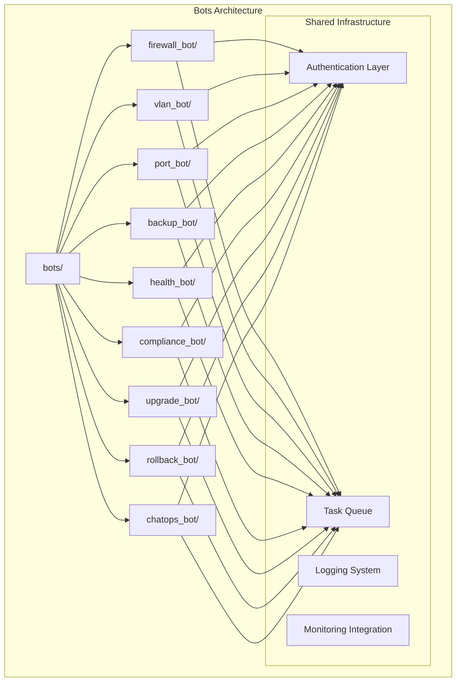
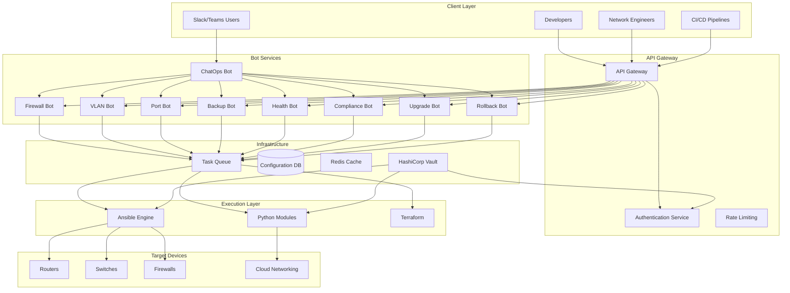
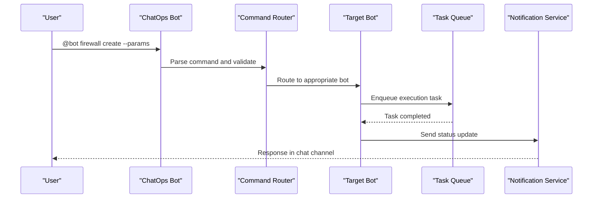

# Automation Bots

<cite>
**Referenced Files in This Document**
- [README.md](file://README.md)
</cite>

## Table of Contents
1. [Introduction](#introduction)
2. [Project Structure](#project-structure)
3. [Core Components](#core-components)
4. [Architecture Overview](#architecture-overview)
5. [Detailed Component Analysis](#detailed-component-analysis)
6. [Dependency Analysis](#dependency-analysis)
7. [Performance Considerations](#performance-considerations)
8. [Troubleshooting Guide](#troubleshooting-guide)
9. [Conclusion](#conclusion)

## Introduction

The Enterprise Network Automation Platform features a comprehensive automation bots architecture designed to provide self-service network operations through REST APIs and ChatOps integrations. This system enables developers and network engineers to automate complex network tasks including firewall rule management, VLAN provisioning, port configuration, backup scheduling, health monitoring, compliance enforcement, firmware upgrades, and configuration rollback operations.

The bot framework is built on a modular architecture where each bot specializes in specific network operations while sharing common infrastructure for authentication, task queuing, error handling, and monitoring integration. This approach ensures consistency, maintainability, and scalability across the entire automation platform.

## Project Structure

The automation bots are organized within a dedicated `bots/` directory structure, with each bot having its own isolated module containing specialized functionality:



**Diagram sources**
- [README.md:141-151](file://README.md#L141-L151)

**Section sources**
- [README.md:103-180](file://README.md#L103-L180)

## Core Components

The automation bots framework consists of several key components that work together to provide unified network automation capabilities:

### Bot Framework Architecture

Each bot follows a consistent architectural pattern with shared infrastructure components:

| Component | Purpose | Implementation |
|-----------|---------|----------------|
| **REST API Layer** | HTTP endpoint exposure | Flask/FastAPI-based REST endpoints |
| **ChatOps Integration** | Slack/Teams command processing | Webhook handlers and message routing |
| **Authentication Layer** | Unified authentication and authorization | JWT tokens with role-based access control |
| **Task Queue** | Asynchronous job processing | Celery/RabbitMQ or Redis-based queue |
| **Validation Engine** | Request schema validation | JSON Schema validation with custom business rules |
| **Execution Engine** | Ansible playbook orchestration | Ansible Tower/AWX integration |
| **Monitoring Integration** | Metrics collection and alerting | Prometheus metrics and Grafana dashboards |

### Shared Authentication Layer

The authentication system provides centralized security across all bots:

- **JWT Token Management**: Stateless authentication with configurable expiration
- **Role-Based Access Control (RBAC)**: Granular permissions per bot and operation
- **Secrets Integration**: HashiCorp Vault integration for credential management
- **Audit Logging**: Complete request/response logging for compliance

**Section sources**
- [README.md:459-476](file://README.md#L459-L476)

## Architecture Overview

The automation bots architecture follows a microservices pattern with shared infrastructure components:



**Diagram sources**
- [README.md:54-99](file://README.md#L54-L99)
- [README.md:459-476](file://README.md#L459-L476)

## Detailed Component Analysis

### Firewall Bot

The Firewall Bot manages firewall rule lifecycle operations across multi-vendor environments.

#### API Endpoints

| Method | Endpoint | Description | Authentication |
|--------|----------|-------------|----------------|
| POST | `/api/v1/firewall/rules` | Create new firewall rule | JWT + RBAC |
| GET | `/api/v1/firewall/rules/{id}` | Get firewall rule details | JWT + RBAC |
| PUT | `/api/v1/firewall/rules/{id}` | Update existing firewall rule | JWT + RBAC |
| DELETE | `/api/v1/firewall/rules/{id}` | Delete firewall rule | JWT + RBAC |
| GET | `/api/v1/firewall/rules` | List all firewall rules | JWT + RBAC |
| POST | `/api/v1/firewall/rules/batch` | Batch rule operations | JWT + RBAC |

#### Request/Response Schemas

**Create Rule Request:**
```json
{
  "name": "allow-web-traffic",
  "description": "Allow HTTP and HTTPS traffic",
  "source": {
    "type": "subnet",
    "value": "10.0.1.0/24"
  },
  "destination": {
    "type": "ip_address",
    "value": "192.168.1.100"
  },
  "protocol": "tcp",
  "ports": [80, 443],
  "action": "allow",
  "priority": 100,
  "vendor": "paloalto",
  "device_group": "edge-firewalls"
}
```

**Success Response:**
```json
{
  "id": "rule_12345",
  "status": "deployed",
  "deployment_id": "dep_67890",
  "message": "Firewall rule deployed successfully",
  "timestamp": "2024-01-15T10:30:00Z"
}
```

#### ChatOps Commands

```
@bot firewall create --name "allow-app-traffic" --source "10.0.1.0/24" --dest "192.168.1.100" --port 8080 --action allow
@bot firewall list --device-group "edge-firewalls"
@bot firewall delete --id "rule_12345"
```

**Section sources**
- [README.md:465](file://README.md#L465)

### VLAN Bot

The VLAN Bot handles VLAN provisioning with approval workflows and change management integration.

#### API Endpoints

| Method | Endpoint | Description | Authentication |
|--------|----------|-------------|----------------|
| POST | `/api/v1/vlan` | Create new VLAN | JWT + RBAC + Approval |
| GET | `/api/v1/vlan/{id}` | Get VLAN details | JWT + RBAC |
| PUT | `/api/v1/vlan/{id}` | Update VLAN configuration | JWT + RBAC + Approval |
| DELETE | `/api/v1/vlan/{id}` | Remove VLAN | JWT + RBAC + Approval |
| GET | `/api/v1/vlan` | List all VLANs | JWT + RBAC |
| POST | `/api/v1/vlan/approval/{id}` | Approve/reject VLAN request | JWT + Admin RBAC |

#### Request/Response Schemas

**Create VLAN Request:**
```json
{
  "vlan_id": 100,
  "name": "engineering",
  "description": "Engineering department VLAN",
  "switches": ["sw-core-01", "sw-dist-01", "sw-access-01"],
  "native_vlan": false,
  "stp_priority": 24576,
  "approval_required": true,
  "change_ticket": "CHG-12345",
  "business_justification": "New engineering team requires dedicated VLAN"
}
```

#### ChatOps Commands

```
@bot vlan create --id 200 --name "guest-wifi" --switches "sw-core-01,sw-dist-01" --approve
@bot vlan list --department "engineering"
@bot vlan status --id 100
```

**Section sources**
- [README.md:466](file://README.md#L466)

### Port Bot

The Port Bot manages switch port configuration including enable/disable operations and interface settings.

#### API Endpoints

| Method | Endpoint | Description | Authentication |
|--------|----------|-------------|----------------|
| POST | `/api/v1/port/configure` | Configure switch port | JWT + RBAC |
| GET | `/api/v1/port/{device}/{interface}` | Get port status | JWT + RBAC |
| PUT | `/api/v1/port/{device}/{interface}/enable` | Enable port | JWT + RBAC |
| PUT | `/api/v1/port/{device}/{interface}/disable` | Disable port | JWT + RBAC |
| GET | `/api/v1/port/status` | Bulk port status check | JWT + RBAC |

#### Request/Response Schemas

**Configure Port Request:**
```json
{
  "device": "sw-access-01",
  "interface": "Gi1/0/1",
  "mode": "access",
  "vlan": 100,
  "description": "Developer workstation port",
  "shutdown": false,
  "speed": "auto",
  "duplex": "auto",
  "storm_control": true,
  "port_security": true,
  "max_mac_addresses": 1
}
```

#### ChatOps Commands

```
@bot port configure --device sw-access-01 --interface Gi1/0/1 --vlan 100 --mode access
@bot port enable --device sw-core-01 --interface Te0/0/1
@bot port disable --device sw-dist-01 --interface Fa0/24
```

**Section sources**
- [README.md:467](file://README.md#L467)

### Backup Bot

The Backup Bot automates device configuration backups with versioning and retention policies.

#### API Endpoints

| Method | Endpoint | Description | Authentication |
|--------|----------|-------------|----------------|
| POST | `/api/v1/backup/trigger` | Trigger immediate backup | JWT + RBAC |
| GET | `/api/v1/backup/{device}` | Get backup history | JWT + RBAC |
| GET | `/api/v1/backup/{device}/{version}` | Download specific backup | JWT + RBAC |
| PUT | `/api/v1/backup/{device}/{version}/restore` | Restore from backup | JWT + RBAC + Approval |
| GET | `/api/v1/backup/schedule` | Get backup schedules | JWT + RBAC |
| POST | `/api/v1/backup/schedule` | Create backup schedule | JWT + RBAC |

#### Request/Response Schemas

**Trigger Backup Request:**
```json
{
  "devices": ["core-rtr-01", "fw-edge-01", "sw-core-01"],
  "backup_type": "full",
  "encryption": true,
  "notification": {
    "slack_channel": "#network-backups",
    "email": "netops@company.com"
  }
}
```

#### ChatOps Commands

```
@bot backup trigger --devices core-rtr-01,fw-edge-01 --channel #network-backups
@bot backup restore --device fw-edge-01 --version v2024.01.15 --reason "Emergency fix"
@bot backup schedule --cron "0 2 * * *" --devices all
```

**Section sources**
- [README.md:468](file://README.md#L468)

### Health Bot

The Health Bot performs comprehensive device health checks and monitoring across the network infrastructure.

#### API Endpoints

| Method | Endpoint | Description | Authentication |
|--------|----------|-------------|----------------|
| POST | `/api/v1/health/check` | Run health check | JWT + RBAC |
| GET | `/api/v1/health/{device}` | Get device health status | JWT + RBAC |
| GET | `/api/v1/health/report` | Generate health report | JWT + RBAC |
| GET | `/api/v1/health/alerts` | Get active alerts | JWT + RBAC |
| POST | `/api/v1/health/schedule` | Schedule recurring checks | JWT + RBAC |

#### Request/Response Schemas

**Health Check Request:**
```json
{
  "scope": "all",
  "checks": ["connectivity", "cpu", "memory", "interfaces", "logs"],
  "thresholds": {
    "cpu_warning": 80,
    "memory_warning": 85,
    "interface_errors": 10
  },
  "notification": {
    "channels": ["#network-alerts", "pagerduty"],
    "severity_filter": "warning,critical"
  }
}
```

#### ChatOps Commands

```
@bot health check --scope all --channels #network-alerts
@bot health status --device core-rtr-01
@bot health alerts --severity critical
```

**Section sources**
- [README.md:469](file://README.md#L469)

### Compliance Bot

The Compliance Bot enforces security policies and compliance standards across network devices.

#### API Endpoints

| Method | Endpoint | Description | Authentication |
|--------|----------|-------------|----------------|
| POST | `/api/v1/compliance/run` | Execute compliance scan | JWT + RBAC |
| GET | `/api/v1/compliance/{device}` | Get compliance status | JWT + RBAC |
| GET | `/api/v1/compliance/report` | Generate compliance report | JWT + RBAC |
| PUT | `/api/v1/compliance/remediate` | Auto-remediate violations | JWT + RBAC + Approval |
| GET | `/api/v1/compliance/policies` | List compliance policies | JWT + RBAC |

#### Request/Response Schemas

**Compliance Scan Request:**
```json
{
  "scope": "production",
  "policies": ["ssh-only", "ntp-configured", "aaa-enabled", "snmpv3-only"],
  "severity_levels": ["critical", "high", "medium"],
  "auto_remediate": false,
  "report_format": "pdf",
  "distribution": {
    "slack_channel": "#compliance-reports",
    "email_recipients": ["security@company.com"]
  }
}
```

#### ChatOps Commands

```
@bot compliance run --scope production --channels #compliance-reports
@bot compliance status --device fw-edge-01
@bot compliance remediate --policy ssh-only --auto-approve
```

**Section sources**
- [README.md:470](file://README.md#L470)

### Upgrade Bot

The Upgrade Bot orchestrates firmware upgrades with pre/post validation and automatic rollback capabilities.

#### API Endpoints

| Method | Endpoint | Description | Authentication |
|--------|----------|-------------|----------------|
| POST | `/api/v1/upgrade/execute` | Start firmware upgrade | JWT + RBAC + Approval |
| GET | `/api/v1/upgrade/{job_id}` | Get upgrade status | JWT + RBAC |
| GET | `/api/v1/upgrade/history` | Get upgrade history | JWT + RBAC |
| PUT | `/api/v1/upgrade/{job_id}/rollback` | Manual rollback | JWT + RBAC + Approval |
| POST | `/api/v1/upgrade/schedule` | Schedule upgrade window | JWT + RBAC |

#### Request/Response Schemas

**Firmware Upgrade Request:**
```json
{
  "target_firmware": "IOS-XE 17.9.3",
  "devices": ["core-rtr-01", "core-rtr-02"],
  "window": {
    "start": "2024-01-20T02:00:00Z",
    "end": "2024-01-20T06:00:00Z",
    "timezone": "UTC"
  },
  "pre_checks": ["health_check", "backup", "capacity_check"],
  "post_checks": ["connectivity", "routing_tables", "service_validation"],
  "rollback_on_failure": true,
  "notification": {
    "channels": ["#firmware-upgrades", "#network-ops"],
    "escalation": "pagerduty"
  }
}
```

#### ChatOps Commands

```
@bot upgrade execute --firmware "IOS-XE 17.9.3" --devices core-rtr-01,core-rtr-02 --window "02:00-06:00 UTC"
@bot upgrade status --job upgrade_12345
@bot upgrade rollback --job upgrade_12345 --reason "Post-check failed"
```

**Section sources**
- [README.md:471](file://README.md#L471)

### Rollback Bot

The Rollback Bot provides one-click configuration recovery to last known good states.

#### API Endpoints

| Method | Endpoint | Description | Authentication |
|--------|----------|-------------|----------------|
| POST | `/api/v1/rollback/execute` | Execute configuration rollback | JWT + RBAC + Approval |
| GET | `/api/v1/rollback/{device}` | Get rollback history | JWT + RBAC |
| GET | `/api/v1/rollback/available/{device}` | List available rollback points | JWT + RBAC |
| PUT | `/api/v1/rollback/{device}/verify` | Verify rollback integrity | JWT + RBAC |

#### Request/Response Schemas

**Rollback Request:**
```json
{
  "device": "fw-edge-01",
  "rollback_point": "v2024.01.15-10:30:00",
  "reason": "Security incident - compromised configuration",
  "verification": {
    "post_rollback_checks": ["connectivity", "rules_loaded", "services_running"],
    "timeout_seconds": 300
  },
  "notification": {
    "channels": ["#incident-response", "#network-ops"],
    "escalation": "immediate"
  }
}
```

#### ChatOps Commands

```
@bot rollback execute --device fw-edge-01 --point v2024.01.15-10:30:00 --reason "Security incident"
@bot rollback verify --device fw-edge-01
@bot rollback history --device fw-edge-01
```

**Section sources**
- [README.md:472](file://README.md#L472)

### ChatOps Bot

The ChatOps Bot serves as a unified command router for all bot operations across Slack and Microsoft Teams.

#### API Endpoints

| Method | Endpoint | Description | Authentication |
|--------|----------|-------------|----------------|
| POST | `/api/v1/chatops/webhook` | ChatOps webhook handler | HMAC Signature |
| GET | `/api/v1/chatops/status` | ChatOps service status | JWT + Admin RBAC |
| GET | `/api/v1/chatops/logs` | ChatOps command logs | JWT + Admin RBAC |

#### Command Syntax

**Slack Commands:**
```
@bot help - Show available commands
@bot firewall create --help - Show firewall command help
@bot vlan list --department engineering
@bot health check --scope all
@bot compliance run --scope production
```

**Microsoft Teams Commands:**
```
@bot help
@bot firewall list --device-group edge-firewalls
@bot backup trigger --devices all --channel #network-backups
@bot upgrade status --job upgrade_12345
```

#### Message Flow



**Diagram sources**
- [README.md:474](file://README.md#L474)

**Section sources**
- [README.md:474](file://README.md#L474)

### Approval Bot

The Approval Bot manages change management workflows and approval processes for sensitive operations.

#### API Endpoints

| Method | Endpoint | Description | Authentication |
|--------|----------|-------------|----------------|
| POST | `/api/v1/approvals/request` | Submit approval request | JWT + RBAC |
| GET | `/api/v1/approvals/{id}` | Get approval request details | JWT + RBAC |
| PUT | `/api/v1/approvals/{id}/approve` | Approve request | JWT + Admin RBAC |
| PUT | `/api/v1/approvals/{id}/reject` | Reject request | JWT + Admin RBAC |
| GET | `/api/v1/approvals/pending` | List pending approvals | JWT + RBAC |

#### Request/Response Schemas

**Approval Request:**
```json
{
  "request_type": "firewall_rule_change",
  "title": "Emergency firewall rule modification",
  "description": "Block malicious IP addresses identified by security team",
  "requested_by": "security-team@company.com",
  "urgency": "high",
  "impact": {
    "affected_devices": ["fw-edge-01", "fw-edge-02"],
    "estimated_downtime": "0 minutes",
    "risk_level": "low"
  },
  "details": {
    "operation": "firewall_rule_create",
    "parameters": {
      "name": "block-malicious-ip",
      "source": "203.0.113.0/24",
      "action": "deny"
    }
  },
  "approvals_required": ["network-lead", "security-lead"],
  "deadline": "2024-01-15T14:00:00Z"
}
```

#### ChatOps Commands

```
@bot approval submit --type firewall_rule_change --title "Emergency block" --urgency high
@bot approval approve --id req_12345 --comment "Approved for immediate deployment"
@bot approval reject --id req_12345 --reason "Insufficient justification"
@bot approval pending --approver john.doe
```

**Section sources**
- [README.md:475](file://README.md#L475)

## Dependency Analysis

The automation bots have well-defined dependencies and relationships:

```mermaid
graph TB
subgraph "External Dependencies"
Ansible[Ansible Engine]
Vault[HashiCorp Vault]
Prometheus[Prometheus]
Slack[Slack API]
Teams[Microsoft Teams API]
GitHub[GitHub API]
end
subgraph "Internal Dependencies"
Auth[Authentication Service]
Queue[Task Queue]
ConfigDB[(Configuration Database)]
Cache[Redis Cache]
Logger[Centralized Logging]
end
subgraph "Bot Dependencies"
FWBot[Firewall Bot]
VLANBot[VLAN Bot]
PortBot[Port Bot]
BackupBot[Backup Bot]
HealthBot[Health Bot]
CompBot[Compliance Bot]
UpgBot[Upgrade Bot]
RollBot[Rollback Bot]
ChatBot[ChatOps Bot]
end
FWBot --> Ansible
VLANBot --> Ansible
PortBot --> Ansible
BackupBot --> Ansible
HealthBot --> Ansible
CompBot --> Ansible
UpgBot --> Ansible
RollBot --> Ansible
FWBot --> Vault
VLANBot --> Vault
PortBot --> Vault
BackupBot --> Vault
HealthBot --> Vault
CompBot --> Vault
UpgBot --> Vault
RollBot --> Vault
ChatBot --> Slack
ChatBot --> Teams
ChatBot --> GitHub
AllBots --> Auth
AllBots --> Queue
AllBots --> ConfigDB
AllBots --> Cache
AllBots --> Logger
AllBots --> Prometheus
```



**Diagram sources**
- [README.md:54-99](file://README.md#L54-L99)
- [README.md:459-476](file://README.md#L459-L476)

**Section sources**
- [README.md:54-99](file://README.md#L54-L99)

## Performance Considerations

The automation bots architecture is designed for high performance and scalability:

### Concurrency and Parallelism
- **Asynchronous Processing**: All bot operations use asynchronous task queues
- **Connection Pooling**: Reusable connections to network devices and external services
- **Caching Strategy**: Redis-based caching for frequently accessed data
- **Batch Operations**: Support for bulk operations to reduce API calls

### Resource Management
- **Rate Limiting**: Configurable rate limits per bot and user
- **Memory Management**: Efficient memory usage for large configuration files
- **Timeout Handling**: Configurable timeouts for network operations
- **Retry Logic**: Exponential backoff for transient failures

### Monitoring and Observability
- **Metrics Collection**: Prometheus metrics for all bot operations
- **Distributed Tracing**: OpenTelemetry integration for request tracing
- **Alerting**: Automated alerts for performance degradation
- **Dashboard Integration**: Real-time performance dashboards

## Troubleshooting Guide

Common issues and their resolutions:

### Authentication Issues
- **JWT Token Expired**: Refresh token using OAuth flow
- **Permission Denied**: Verify RBAC roles and permissions
- **Vault Connection Failed**: Check Vault connectivity and credentials

### Bot Operation Failures
- **Ansible Execution Timeout**: Increase timeout values or optimize playbooks
- **Device Connectivity Issues**: Verify SSH/NETCONF connectivity
- **Configuration Validation Errors**: Review YAML/JSON schema validation errors

### ChatOps Integration Problems
- **Webhook Failures**: Check HMAC signature validation
- **Message Routing Issues**: Verify command parsing and bot registration
- **Channel Permissions**: Ensure bot has proper channel access

### Performance Issues
- **High Memory Usage**: Investigate memory leaks in custom modules
- **Slow Response Times**: Check database query performance and cache hit rates
- **Queue Backlog**: Scale worker instances or optimize task processing

**Section sources**
- [README.md:674-685](file://README.md#L674-L685)

## Conclusion

The Enterprise Network Automation Platform's bot architecture provides a comprehensive, scalable, and secure solution for network automation at enterprise scale. The modular design allows for easy extension and maintenance while ensuring consistency across all automation operations.

Key benefits include:
- **Unified Interface**: Single entry point for all network automation tasks
- **Security First**: Centralized authentication and authorization
- **Operational Excellence**: Comprehensive monitoring, logging, and alerting
- **Scalability**: Microservices architecture supporting horizontal scaling
- **Compliance**: Built-in policy enforcement and audit trails

The platform successfully bridges the gap between traditional network operations and modern DevOps practices, enabling teams to automate complex network tasks while maintaining security, compliance, and operational excellence.