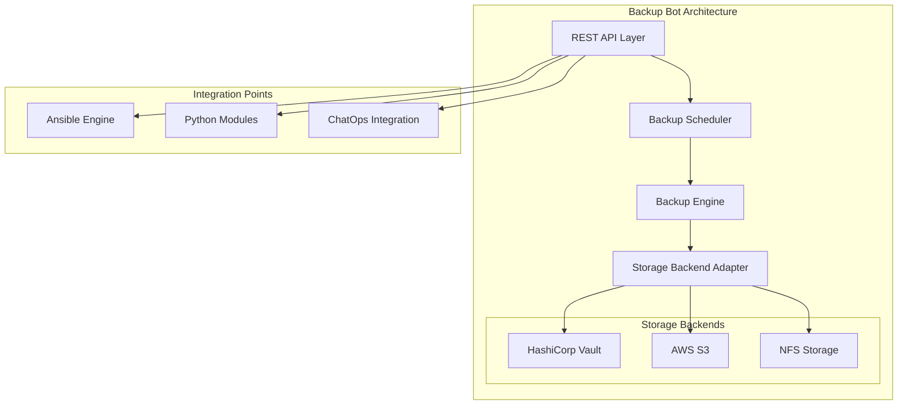
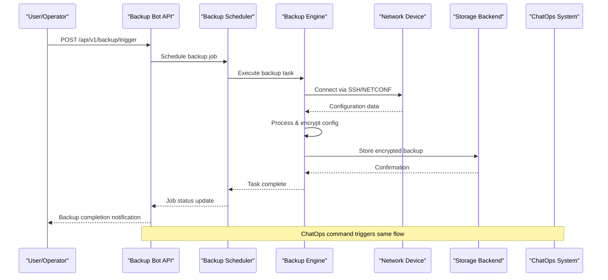
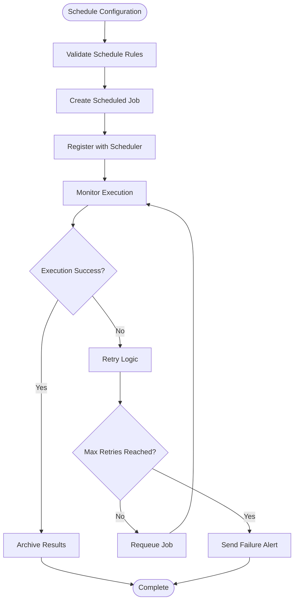
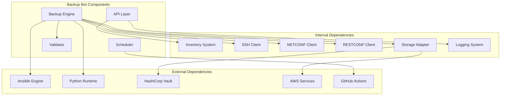

# Backup Bot

<cite>
**Referenced Files in This Document**
- [README.md](file://README.md)
</cite>

## Table of Contents
1. [Introduction](#introduction)
2. [Project Structure](#project-structure)
3. [Core Components](#core-components)
4. [Architecture Overview](#architecture-overview)
5. [Detailed Component Analysis](#detailed-component-analysis)
6. [Dependency Analysis](#dependency-analysis)
7. [Performance Considerations](#performance-considerations)
8. [Troubleshooting Guide](#troubleshooting-guide)
9. [Conclusion](#conclusion)
10. [Appendices](#appendices)

## Introduction

The Backup Bot is a critical component of the Enterprise Network Automation Platform, providing automated configuration backup management for network devices across multi-vendor environments. As part of the broader automation ecosystem, the Backup Bot enables self-service backup operations through REST APIs and ChatOps integrations, ensuring comprehensive disaster recovery capabilities for enterprise networks.

The Backup Bot serves as the central orchestration point for device configuration backups, supporting both manual and scheduled operations while maintaining version control, encryption at rest, and integration with multiple storage backends including HashiCorp Vault, AWS S3, and NFS.

## Project Structure

The Backup Bot functionality is organized within the broader network automation platform structure, following the modular architecture pattern established by the platform:

**Diagram sources**
- [README.md:103-180](file://README.md#L103-L180)
- [README.md:438-456](file://README.md#L438-L456)

The Backup Bot integrates with the platform's core components including the Ansible engine for device communication, Python modules for backup processing, and various storage backends for secure backup retention.

**Section sources**
- [README.md:103-180](file://README.md#L103-L180)
- [README.md:438-456](file://README.md#L438-L456)

## Core Components

The Backup Bot consists of several key components that work together to provide comprehensive backup management:

### REST API Layer
The API layer exposes endpoints for backup operations, supporting both programmatic access and ChatOps integration. The Backup Bot endpoint `/api/v1/backup` serves as the primary interface for all backup-related operations.

### Backup Scheduler
The scheduler manages automated backup jobs, integrating with the CI/CD pipeline through GitHub Actions workflows. It supports cron-based scheduling and can trigger backups based on various events or time intervals.

### Backup Engine
The core backup engine handles device communication, configuration extraction, processing, and storage operations. It leverages the platform's existing SSH, NETCONF, and RESTCONF clients for device connectivity.

### Storage Backend Adapter
A pluggable adapter layer that abstracts different storage backends, allowing seamless switching between Vault, S3, NFS, and other storage solutions without changing the core backup logic.

### ChatOps Integration
GitHub Actions-based ChatOps integration enables team members to trigger backup operations through simple commands, providing an intuitive interface for operational tasks.

**Section sources**
- [README.md:460-476](file://README.md#L460-L476)
- [README.md:438-456](file://README.md#L438-L456)

## Architecture Overview

The Backup Bot follows a microservices-inspired architecture with clear separation of concerns and extensive integration points:

**Diagram sources**
- [README.md:460-476](file://README.md#L460-L476)
- [README.md:339-368](file://README.md#L339-L368)

The architecture emphasizes security through encryption at rest, audit trails through GitOps integration, and scalability through the modular design pattern.

## Detailed Component Analysis

### REST API Endpoints

The Backup Bot exposes a comprehensive set of REST API endpoints for backup management:

#### Manual Backup Trigger
- **Endpoint**: `POST /api/v1/backup/trigger`
- **Purpose**: Initiate immediate backup operations for specified devices
- **Authentication**: Required via platform authentication system
- **Request Body**: Device selection criteria, backup type (full/incremental), compression options
- **Response**: Job ID and execution status

#### Schedule Management
- **Endpoint**: `GET /api/v1/backup/schedule`
- **Purpose**: Retrieve and manage backup schedules
- **Capabilities**: View existing schedules, modify timing, enable/disable schedules
- **Integration**: Syncs with CI/CD pipeline scheduling system

#### History Retrieval
- **Endpoint**: `GET /api/v1/backup/{device}/history`
- **Purpose**: Access backup history for specific devices
- **Features**: Version listing, metadata retrieval, diff capabilities
- **Filtering**: Date range, backup type, status filtering

#### Restoration Operations
- **Endpoint**: `POST /api/v1/backup/{device}/restore`
- **Purpose**: Restore device configurations from backups
- **Safety**: Pre-restore validation, rollback capability, change approval workflow
- **Verification**: Post-restore health checks and compliance validation

### Backup Scheduling System

The scheduling system integrates with the platform's CI/CD infrastructure:

**Diagram sources**
- [README.md:505-514](file://README.md#L505-L514)

The scheduler supports daily automated backups at 02:00 UTC through the `backup-schedule.yml` workflow, ensuring consistent backup coverage across all managed devices.

### Encryption and Security

Security is paramount in the backup system, implementing multiple layers of protection:

#### Encryption at Rest
All backup data is encrypted using industry-standard algorithms before storage. The encryption keys are managed through the platform's secrets architecture, supporting multiple backends:

- **HashiCorp Vault**: Primary key management with automatic rotation
- **AWS Secrets Manager**: Cloud-native secret management
- **Azure Key Vault**: Microsoft Azure integration
- **CyberArk PAM**: Privileged access management integration

#### Secret Rotation Policy
The system enforces strict rotation policies for all cryptographic materials:

| Secret Type | Rotation Interval | Method |
|---|---|---|
| Device passwords | 90 days | Vault auto-rotation + Ansible push |
| API tokens | 30 days | Secrets Manager + Lambda/Function |
| SSH keys | 90 days | Vault SSH CA with short-lived certs |
| TLS certificates | 1 year (auto-renew at 60 days) | ACME / Vault PKI |
| CI/CD tokens | Ephemeral | OIDC federation (no static secrets) |

### Storage Backend Integration

The Backup Bot supports multiple storage backends through a unified adapter interface:

#### HashiCorp Vault Integration
- **Primary Use Case**: Secure backup storage with fine-grained access control
- **Features**: Versioning, audit logging, dynamic secrets
- **Encryption**: Server-side encryption with customer-managed keys

#### AWS S3 Integration
- **Primary Use Case**: Scalable cloud storage with lifecycle management
- **Features**: Object versioning, cross-region replication, lifecycle policies
- **Security**: Server-side encryption, bucket policies, IAM integration

#### NFS Integration
- **Primary Use Case**: On-premises storage for air-gapped environments
- **Features**: POSIX compatibility, snapshot support, deduplication
- **Security**: Kerberos authentication, SELinux policies, network segmentation

### Incremental vs Full Backups

The backup system supports both incremental and full backup strategies:

#### Full Backups
- **Scope**: Complete device configuration capture
- **Frequency**: Daily scheduled operation
- **Retention**: Configurable retention periods per device class
- **Use Case**: Baseline backups, disaster recovery scenarios

#### Incremental Backups
- **Scope**: Changes since last successful backup
- **Frequency**: Hourly or event-triggered
- **Efficiency**: Reduced storage footprint and faster operations
- **Use Case**: High-frequency change tracking, rapid recovery

### Compression Options

Multiple compression algorithms are supported to optimize storage efficiency:

| Algorithm | Compression Ratio | CPU Usage | Best For |
|---|---|---|---|
| gzip | Moderate | Low | General purpose backups |
| zstd | High | Medium | Performance-critical environments |
| lz4 | Very High | Very Low | Real-time backup scenarios |
| bzip2 | Highest | High | Long-term archival storage |

### Verification Processes

Comprehensive verification ensures backup integrity and restore readiness:

#### Pre-Backup Validation
- Device connectivity verification
- Permission validation
- Storage space availability check
- Configuration format validation

#### Post-Backup Verification
- Checksum validation
- Decryption testing
- Configuration parsing verification
- Compliance rule validation

#### Restore Testing
- Automated restore drills
- Configuration diff analysis
- Service impact assessment
- Rollback procedure validation

**Section sources**
- [README.md:339-368](file://README.md#L339-L368)
- [README.md:505-514](file://README.md#L505-L514)

## Dependency Analysis

The Backup Bot has well-defined dependencies on core platform components:

**Diagram sources**
- [README.md:184-200](file://README.md#L184-L200)
- [README.md:438-456](file://README.md#L438-L456)

The dependency structure ensures loose coupling between components while maintaining strong integration with essential platform services.

**Section sources**
- [README.md:184-200](file://README.md#L184-L200)
- [README.md:438-456](file://README.md#L438-L456)

## Performance Considerations

The Backup Bot is designed for high-performance operations across large-scale network environments:

### Concurrency and Parallelism
- **Parallel Device Processing**: Multiple devices backed up simultaneously
- **Connection Pooling**: Efficient reuse of device connections
- **Batch Operations**: Grouped API calls to minimize overhead
- **Asynchronous Processing**: Non-blocking operations for improved throughput

### Resource Optimization
- **Memory Management**: Streaming processing for large configurations
- **CPU Efficiency**: Adaptive compression based on available resources
- **Network Bandwidth**: Throttling and retry mechanisms for reliable transfers
- **Storage I/O**: Optimized write patterns and caching strategies

### Scalability Patterns
- **Horizontal Scaling**: Stateless API layer for load distribution
- **Queue-Based Processing**: Distributed job processing with Redis/RabbitMQ
- **Database Sharding**: Partitioned backup metadata storage
- **CDN Integration**: Global access to frequently accessed backups

## Troubleshooting Guide

Common issues and their resolutions for the Backup Bot:

### Connection Issues
- **Symptom**: Device connection timeouts during backup
- **Resolution**: Verify SSH reachability and credentials; check firewall rules and ACLs
- **Prevention**: Implement connection pooling and retry logic

### Storage Failures
- **Symptom**: Backup storage failures or permission errors
- **Resolution**: Validate storage backend connectivity and permissions; check disk space
- **Prevention**: Implement health checks and alerting for storage backends

### Performance Degradation
- **Symptom**: Slow backup operations or high resource usage
- **Resolution**: Adjust concurrency settings; optimize compression algorithms; review device count
- **Prevention**: Capacity planning and performance monitoring

### Encryption Problems
- **Symptom**: Decryption failures or key rotation issues
- **Resolution**: Verify key management system connectivity; check key rotation status
- **Prevention**: Regular key rotation testing and backup of encryption keys

### ChatOps Integration Issues
- **Symptom**: Commands not executing or delayed responses
- **Resolution**: Check GitHub Actions runner availability; verify webhook configurations
- **Prevention**: Redundant runners and health monitoring

**Section sources**
- [README.md:674-685](file://README.md#L674-L685)

## Conclusion

The Backup Bot represents a comprehensive solution for network configuration backup and disaster recovery in enterprise environments. Its modular architecture, extensive integration capabilities, and robust security features make it suitable for managing thousands of devices across diverse vendor ecosystems.

Key strengths include:
- **Multi-Vendor Support**: Comprehensive device compatibility through standardized protocols
- **Enterprise Security**: Multi-layered encryption and access control
- **Operational Flexibility**: Both programmatic and ChatOps interfaces
- **Scalability**: Designed for large-scale deployments with horizontal scaling
- **Disaster Recovery**: Comprehensive backup and restore capabilities with verification

The Backup Bot seamlessly integrates with the broader network automation platform, leveraging existing infrastructure for inventory management, secrets handling, monitoring, and CI/CD processes. This approach ensures consistency, reduces operational complexity, and provides a foundation for advanced automation scenarios.

## Appendices

### Practical Examples

#### Manual Backup Operations
- **Single Device Backup**: Trigger immediate backup for specific firewall
- **Bulk Operations**: Backup entire device groups by role or region
- **Incremental Updates**: Capture changes since last backup
- **Custom Schedules**: Ad-hoc backup jobs for maintenance windows

#### Disaster Recovery Scenarios
- **Site Failure**: Rapid restoration from off-site backups
- **Configuration Drift**: Rollback to known good configuration
- **Firmware Upgrade**: Pre-upgrade backup with automatic rollback
- **Compliance Remediation**: Restore compliant configurations after violations

#### ChatOps Commands
- **Backup Triggers**: `!backup run all` for full fleet backup
- **Restore Operations**: `!backup restore fw-edge-01 latest` for specific device restore
- **Status Checks**: `!backup status` for current backup operations
- **History Queries**: `!backup history fw-core-01 --last 5` for recent backup history

### Integration Patterns

#### CI/CD Pipeline Integration
- **Pre-deployment Backups**: Automatic backup before configuration changes
- **Post-deployment Verification**: Validate backup integrity after changes
- **Rollback Automation**: Automated rollback procedures on deployment failure
- **Audit Trail**: Complete backup history linked to change requests

#### Monitoring and Alerting
- **Backup Health Metrics**: Success rates, duration, storage utilization
- **Anomaly Detection**: Unusual backup patterns or failures
- **Capacity Planning**: Storage growth trends and capacity forecasting
- **Compliance Reporting**: Audit-ready backup documentation