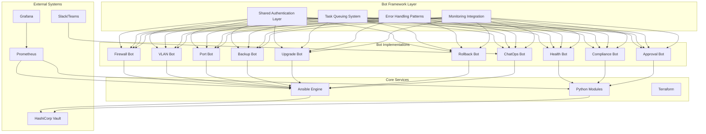
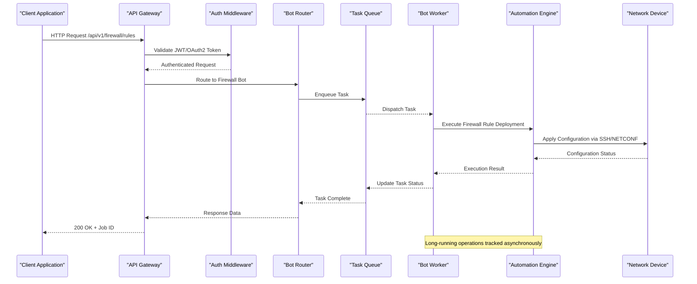
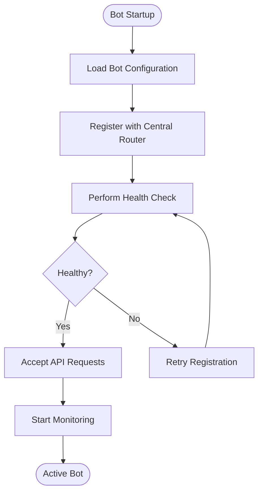
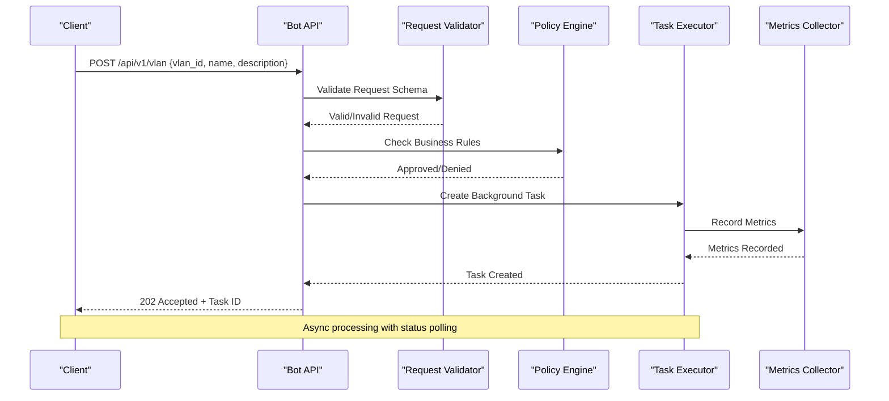
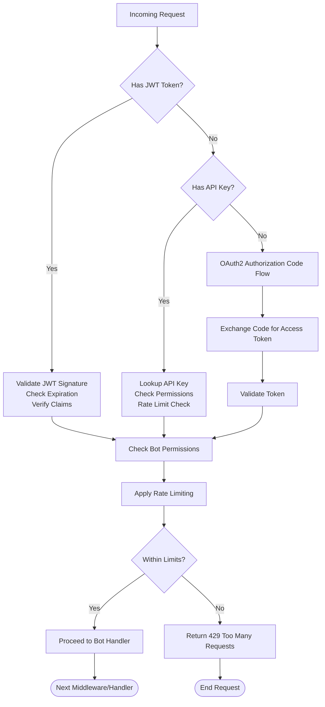
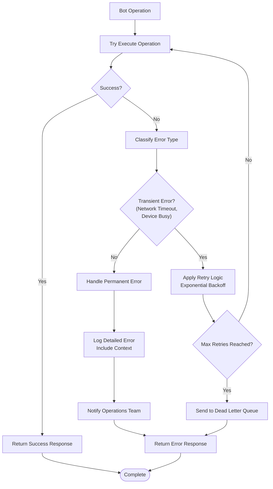
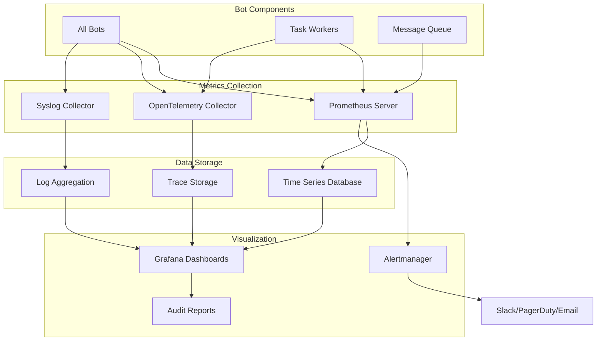

# Bot Architecture & Framework

<cite>
**Referenced Files in This Document**
- [README.md](file://README.md)
</cite>

## Table of Contents
1. [Introduction](#introduction)
2. [Project Structure](#project-structure)
3. [Core Components](#core-components)
4. [Architecture Overview](#architecture-overview)
5. [Detailed Component Analysis](#detailed-component-analysis)
6. [Dependency Analysis](#dependency-analysis)
7. [Performance Considerations](#performance-considerations)
8. [Troubleshooting Guide](#troubleshooting-guide)
9. [Conclusion](#conclusion)
10. [Appendices](#appendices)

## Introduction

The Enterprise Network Automation Platform provides a comprehensive bot architecture designed to manage thousands of network devices across multi-vendor, multi-region environments. The platform implements production-grade automation capabilities with GitOps principles, ensuring every configuration, policy, template, test, pipeline, dashboard, and bot is stored in version control while maintaining strict security practices where secrets are never committed.

This document focuses specifically on the bot framework architecture, covering shared authentication layers, task queuing systems, error handling patterns, monitoring integration, REST API design patterns, and scalability considerations that all bots utilize within the platform.

## Project Structure

The bot architecture follows a modular design pattern with clear separation of concerns:

**Diagram sources**
- [README.md:52-99](file://README.md#L52-L99)
- [README.md:460-476](file://README.md#L460-L476)

**Section sources**
- [README.md:103-180](file://README.md#L103-L180)

## Core Components

### Shared Authentication Layer

The platform implements a unified authentication system supporting multiple providers:

- **JWT (JSON Web Tokens)**: Stateless authentication for API requests
- **OAuth2**: Authorization code flow for third-party integrations
- **API Keys**: Service-to-service authentication
- **OIDC Federation**: CI/CD pipeline authentication

Authentication middleware validates tokens, checks permissions, and enforces rate limiting before requests reach bot handlers.

### Task Queuing System

The bot framework uses an asynchronous task queue for long-running operations:

- **Message Broker**: RabbitMQ or Redis for task distribution
- **Worker Pools**: Scalable worker processes for parallel execution
- **Retry Logic**: Automatic retry with exponential backoff
- **Dead Letter Queue**: Failed task isolation and inspection
- **Priority Queues**: Critical tasks (security, compliance) prioritized over routine operations

### Error Handling Patterns

Consistent error handling across all bots includes:

- **Structured Logging**: JSON-formatted logs with correlation IDs
- **Graceful Degradation**: Partial failures don't block entire operations
- **Circuit Breaker Pattern**: Prevent cascading failures to external systems
- **Timeout Management**: Configurable timeouts per operation type
- **Context Preservation**: Full context available for debugging failed operations

### Monitoring Integration

Comprehensive observability through multiple metrics collection points:

- **Prometheus Metrics**: Request latency, success rates, queue depths
- **OpenTelemetry Tracing**: End-to-end request tracing across services
- **Custom Dashboards**: Grafana dashboards for bot-specific metrics
- **Alerting Rules**: Automated alerts for performance degradation
- **Audit Logs**: Complete audit trail for compliance requirements

**Section sources**
- [README.md:438-456](file://README.md#L438-L456)
- [README.md:583-617](file://README.md#L583-L617)

## Architecture Overview

The bot architecture follows a microservices pattern with shared infrastructure components:

**Diagram sources**
- [README.md:460-476](file://README.md#L460-L476)
- [README.md:52-99](file://README.md#L52-L99)

## Detailed Component Analysis

### Bot Registration and Discovery

Bots register themselves with the central router upon startup:

**Diagram sources**
- [README.md:460-476](file://README.md#L460-L476)

### Request Processing Pipeline

Each bot follows a standardized request processing pipeline:

**Diagram sources**
- [README.md:460-476](file://README.md#L460-L476)

### Authentication Flow

The shared authentication layer supports multiple mechanisms:

**Diagram sources**
- [README.md:339-368](file://README.md#L339-L368)

### Error Handling Strategy

Consistent error handling ensures reliable bot operations:

**Diagram sources**
- [README.md:674-685](file://README.md#L674-L685)

### Monitoring and Observability

Comprehensive monitoring covers all aspects of bot operations:

**Diagram sources**
- [README.md:583-617](file://README.md#L583-L617)

## Dependency Analysis

The bot framework has well-defined dependencies between components:

```mermaid
graph TB
subgraph "Framework Dependencies"
FastAPI[FastAPI/Flask]
Pydantic[Pydantic Models]
Celery[Celery Task Queue]
SQLAlchemy[Database ORM]
Redis[Redis Cache]
RabbitMQ[RabbitMQ Broker]
end
subgraph "Security Dependencies"
PyJWT[PyJWT Library]
OAuthLib[OAuth2 Library]
Cryptography[Cryptography Package]
HashiCorp[HashiCorp Vault SDK]
end
subgraph "Monitoring Dependencies"
Prometheus[Prometheus Client]
OpenTelemetry[OpenTelemetry SDK]
StructuredLogging[Structured Logging]
end
subgraph "Network Dependencies"
Netmiko[Netmiko SSH]
NAPALM[NAPALM Abstraction]
Paramiko[Paramiko SSH]
RESTCONF[RESTCONF Client]
NETCONF[NETCONF Client]
end
subgraph "Bot Implementation"
BaseBot[Base Bot Class]
AuthMiddleware[Authentication Middleware]
TaskManager[Task Manager]
ErrorHandler[Error Handler]
MetricsCollector[Metrics Collector]
end
BaseBot --> FastAPI
BaseBot --> Pydantic
BaseBot --> Celery
BaseBot --> SQLAlchemy
AuthMiddleware --> PyJWT
AuthMiddleware --> OAuthLib
AuthMiddleware --> Cryptography
AuthMiddleware --> HashiCorp
TaskManager --> Redis
TaskManager --> RabbitMQ
ErrorHandler --> StructuredLogging
MetricsCollector --> Prometheus
MetricsCollector --> OpenTelemetry
BaseBot --> Netmiko
BaseBot --> NAPALM
BaseBot --> Paramiko
BaseBot --> RESTCONF
BaseBot --> NETCONF
```

**Diagram sources**
- [README.md:438-456](file://README.md#L438-L456)

**Section sources**
- [README.md:438-456](file://README.md#L438-L456)

## Performance Considerations

### Scalability Patterns

The bot framework supports horizontal scaling through several patterns:

- **Stateless Bot Instances**: Multiple bot instances behind load balancer
- **Horizontal Task Scaling**: Auto-scaling worker pools based on queue depth
- **Connection Pooling**: Efficient connection management for device access
- **Caching Layer**: Redis-based caching for frequently accessed data
- **Database Sharding**: Shard database by environment or region

### Load Balancing Strategies

- **Round Robin**: Even distribution across bot instances
- **Least Connections**: Route to instance with fewest active connections
- **Geographic Routing**: Route requests to nearest regional bot instance
- **Weighted Distribution**: Weight instances based on capacity and health

### High Availability Deployment

- **Multi-Region Deployment**: Deploy bots across multiple geographic regions
- **Database Replication**: Synchronous replication for critical data
- **Cache Clustering**: Redis cluster for high availability caching
- **Message Queue Clustering**: RabbitMQ clustering for fault tolerance
- **Health Checks**: Continuous health monitoring with automatic failover

## Troubleshooting Guide

### Common Issues and Resolutions

| Issue | Symptoms | Resolution |
|-------|----------|------------|
| Authentication Failures | 401 Unauthorized errors | Verify JWT token validity, check expiration times, validate API key permissions |
| Task Queue Backups | Increasing queue depth, delayed responses | Scale worker pool size, investigate slow tasks, optimize task processing |
| Device Connection Timeouts | Connection timeout errors, partial configurations | Check network connectivity, verify device credentials, implement retry logic |
| Memory Leaks | Increasing memory usage over time | Profile bot processes, identify resource leaks, implement proper cleanup |
| Database Performance | Slow query responses, connection pool exhaustion | Optimize queries, increase connection pool size, add database indexes |
| Monitoring Gaps | Missing metrics, incomplete traces | Verify metric collection setup, check OpenTelemetry instrumentation, validate log aggregation |

### Debugging Tools

- **Structured Logging**: Enable debug logging with correlation IDs for request tracing
- **Prometheus Metrics**: Inspect bot-specific metrics for performance bottlenecks
- **OpenTelemetry Traces**: Follow request flows across distributed components
- **Health Check Endpoints**: Monitor bot instance health and readiness
- **Audit Logs**: Review complete audit trails for compliance and debugging

**Section sources**
- [README.md:674-685](file://README.md#L674-L685)

## Conclusion

The Enterprise Network Automation Platform's bot architecture provides a robust, scalable foundation for network automation at enterprise scale. The shared authentication layer, task queuing system, error handling patterns, and monitoring integration ensure consistent behavior across all bot implementations while maintaining high availability and security standards.

The modular design allows for easy extension with new bot types while leveraging common infrastructure components. The comprehensive monitoring and observability features provide deep insights into bot performance and operational health, enabling proactive maintenance and rapid issue resolution.

Future enhancements should focus on AI-driven anomaly detection, zero-touch provisioning integration, and advanced self-healing capabilities to further automate network operations and reduce manual intervention.

## Appendices

### Bot Endpoint Reference

| Bot | Endpoint | Method | Purpose |
|-----|----------|--------|---------|
| Firewall Bot | `/api/v1/firewall/rules` | GET/POST/PUT/DELETE | Manage firewall rules |
| VLAN Bot | `/api/v1/vlan` | GET/POST/PUT/DELETE | Provision and manage VLANs |
| Port Bot | `/api/v1/port` | GET/POST/PUT/DELETE | Configure switch ports |
| Backup Bot | `/api/v1/backup` | GET/POST | Trigger and schedule backups |
| Health Bot | `/api/v1/health` | GET | On-demand health checks |
| Compliance Bot | `/api/v1/compliance` | GET/POST | Run compliance scans |
| Upgrade Bot | `/api/v1/upgrade` | GET/POST | Orchestrate firmware upgrades |
| Rollback Bot | `/api/v1/rollback` | GET/POST | Rollback configurations |
| ChatOps Bot | `/api/v1/chatops` | POST | Unified command interface |
| Approval Bot | `/api/v1/approvals` | GET/POST/PUT | Manage approval workflows |

### Security Best Practices

- **Secret Management**: Use HashiCorp Vault or cloud-native secret managers
- **Network Segmentation**: Isolate bot infrastructure from production networks
- **Least Privilege**: Grant minimum required permissions to bot accounts
- **Audit Trail**: Maintain complete audit logs for all bot operations
- **Regular Security Scans**: Automated security scanning in CI/CD pipelines
- **Certificate Management**: Automated certificate rotation and renewal