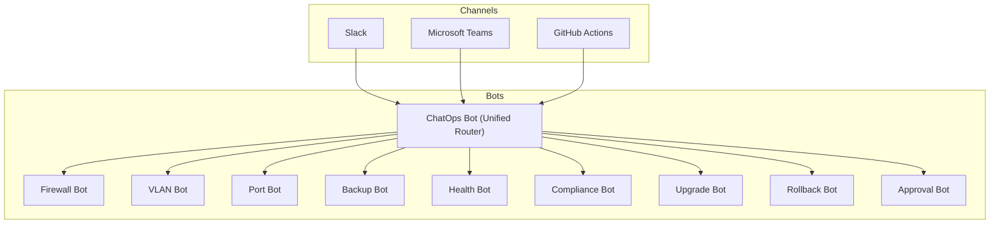
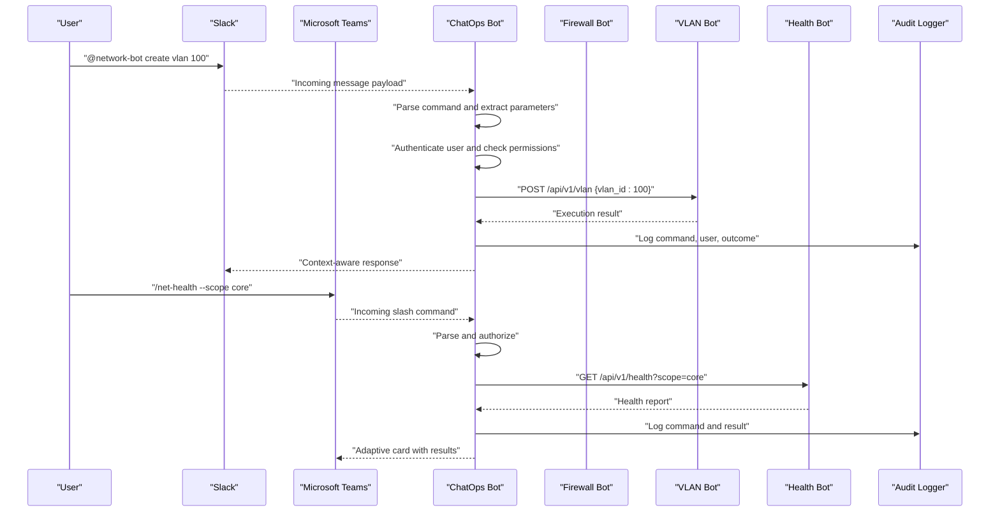
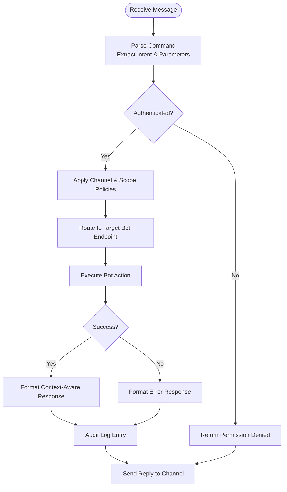
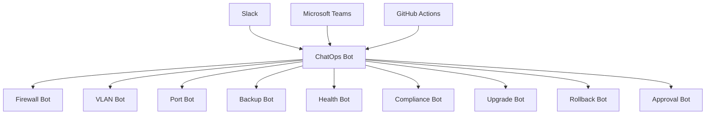

# ChatOps Bot

<cite>
**Referenced Files in This Document**
- [README.md](file://README.md)
</cite>

## Table of Contents
1. [Introduction](#introduction)
2. [Project Structure](#project-structure)
3. [Core Components](#core-components)
4. [Architecture Overview](#architecture-overview)
5. [Detailed Component Analysis](#detailed-component-analysis)
6. [Dependency Analysis](#dependency-analysis)
7. [Performance Considerations](#performance-considerations)
8. [Troubleshooting Guide](#troubleshooting-guide)
9. [Conclusion](#conclusion)
10. [Appendices](#appendices)

## Introduction
This document describes the ChatOps Bot functionality within the Enterprise Network Automation Platform. It explains how a unified command routing system integrates Slack and Microsoft Teams with all other automation bots, enabling self-service network operations through natural language commands, slash commands, and interactive cards. The documentation covers command parsing, permission-based access control, context-aware responses, interactive workflows, channel-specific configurations, user authentication, command history, audit logging, supported command syntax, practical integration examples, custom command development, and notification routing by severity and team assignments.

## Project Structure
The repository organizes automation bots under a dedicated directory and exposes REST APIs for each bot. A unified ChatOps Bot provides a single entry point to route commands across all bots.

**Diagram sources**
- [README.md:460-476](file://README.md#L460-L476)

**Section sources**
- [README.md:103-180](file://README.md#L103-L180)
- [README.md:460-476](file://README.md#L460-L476)

## Core Components
- Unified Command Router (ChatOps Bot): Provides a single API endpoint that receives commands from Slack and Teams and routes them to the appropriate specialized bot.
- Specialized Bots: Each bot owns its domain (firewall rules, VLAN provisioning, port configuration, backups, health checks, compliance scans, upgrades, rollbacks, approvals).
- Channel Integrations: Slack and Microsoft Teams are supported as primary ChatOps channels; GitHub Actions is used for certain automated flows.
- REST Endpoints: Each bot exposes REST endpoints for programmatic access and can be invoked via ChatOps commands routed through the ChatOps Bot.

Key responsibilities:
- Parse incoming messages into structured commands.
- Authenticate users and enforce permissions.
- Resolve target devices or scopes based on context.
- Execute bot actions via their REST endpoints.
- Return context-aware responses back to the originating channel.
- Log events for auditability and observability.

**Section sources**
- [README.md:460-476](file://README.md#L460-L476)

## Architecture Overview
The ChatOps Bot acts as an orchestrator between messaging platforms and backend automation bots. It normalizes inputs from different channels, applies authorization and policy checks, and delegates execution to the relevant bot services.

**Diagram sources**
- [README.md:460-476](file://README.md#L460-L476)

## Detailed Component Analysis

### Unified Command Routing System
- Entry Point: A single ChatOps endpoint accepts commands from Slack and Teams.
- Parsing: Converts free-form text and slash commands into structured requests with normalized parameters.
- Authorization: Validates user identity and role-based permissions before delegating to specific bots.
- Routing: Maps parsed commands to the corresponding bot’s REST endpoint.
- Response Formatting: Adapts output to the originating channel (e.g., Slack blocks, Teams adaptive cards).

**Diagram sources**
- [README.md:460-476](file://README.md#L460-L476)

**Section sources**
- [README.md:460-476](file://README.md#L460-L476)

### Supported Command Syntax
- Natural Language: @network-bot create vlan 100
- Slack Slash Commands: /net-vlan
- Teams Adaptive Cards: Interactive forms submitted via Teams cards

These formats are normalized into a common internal representation before being routed to the appropriate bot.

**Section sources**
- [README.md:460-476](file://README.md#L460-L476)

### Permission-Based Access Control
- Authentication: Users must be authenticated against the platform’s identity provider before commands are processed.
- Authorization: Role-based policies determine which commands and scopes a user can execute.
- Channel Scoping: Certain commands may be restricted to specific channels or teams.
- Audit Trail: All attempts (success or failure) are logged for compliance and troubleshooting.

**Section sources**
- [README.md:460-476](file://README.md#L460-L476)

### Context-Aware Responses
- Channel Adaptation: Responses are formatted appropriately for Slack or Teams.
- Scope Awareness: Responses include device scope, environment, and status details.
- Interactive Elements: Adaptive cards enable follow-up actions (approve, escalate, view details).

**Section sources**
- [README.md:460-476](file://README.md#L460-L476)

### Interactive Workflows
- Multi-step Processes: Some operations require confirmation or additional input.
- Approvals: Change requests can be routed through an approval workflow managed by the Approval Bot.
- Feedback Loops: Status updates and progress notifications are sent back to the originating channel.

**Section sources**
- [README.md:460-476](file://README.md#L460-L476)

### Channel-Specific Configurations
- Slack: Slash commands and direct messages are supported.
- Teams: Adaptive cards and slash commands are supported.
- GitHub Actions: Used for automated triggers and scheduled tasks.

**Section sources**
- [README.md:460-476](file://README.md#L460-L476)

### User Authentication
- Identity Integration: Users authenticate via the platform’s identity provider.
- Token Handling: Tokens are validated per request and scoped to allowed operations.
- Session Management: Short-lived sessions reduce risk exposure.

**Section sources**
- [README.md:460-476](file://README.md#L460-L476)

### Command History and Audit Logging
- Command History: Each user’s commands and outcomes are recorded for traceability.
- Audit Logs: Events include user identity, timestamp, command, target scope, and result.
- Compliance: Logs support audits and post-incident analysis.

**Section sources**
- [README.md:460-476](file://README.md#L460-L476)

### Notification Routing by Severity and Team Assignments
- Severity Levels: Critical, High, Medium, Low.
- Routing Rules: Notifications are directed to appropriate channels based on severity and team ownership.
- Escalation Paths: Critical alerts can trigger immediate escalation workflows.

**Section sources**
- [README.md:460-476](file://README.md#L460-L476)

### Practical Examples
- Create VLAN: @network-bot create vlan 100
- Health Check: /net-health --scope core
- Firewall Rule Request: Submit via Teams adaptive card form
- Backup Trigger: Use GitHub Actions workflow dispatch

**Section sources**
- [README.md:460-476](file://README.md#L460-L476)

### Custom Command Development
- Define Intent: Map new command patterns to existing bot endpoints or create new bot modules.
- Implement Handler: Add parsing logic and authorization checks.
- Test Locally: Validate with unit tests and integration tests.
- Deploy: Update ChatOps routing table and publish to channels.

**Section sources**
- [README.md:460-476](file://README.md#L460-L476)

## Dependency Analysis
The ChatOps Bot depends on multiple specialized bots and channel integrations. It centralizes command processing while delegating execution to domain-specific services.

**Diagram sources**
- [README.md:460-476](file://README.md#L460-L476)

**Section sources**
- [README.md:460-476](file://README.md#L460-L476)

## Performance Considerations
- Concurrency: Handle high volumes of concurrent commands using asynchronous processing.
- Caching: Cache frequently accessed device metadata and policy decisions.
- Rate Limiting: Protect backend bots from overload by enforcing rate limits at the ChatOps layer.
- Batch Operations: Support batched commands where applicable to reduce round trips.

[No sources needed since this section provides general guidance]

## Troubleshooting Guide
Common issues and resolutions:
- Authentication failures: Verify identity provider connectivity and token validity.
- Permission denied: Confirm user roles and channel scoping policies.
- Command parsing errors: Ensure command syntax matches supported patterns.
- Backend bot timeouts: Check target bot health and network reachability.
- Audit log gaps: Inspect logging pipeline and storage availability.

**Section sources**
- [README.md:674-685](file://README.md#L674-L685)

## Conclusion
The ChatOps Bot provides a unified, secure, and extensible interface for network automation across Slack and Microsoft Teams. By centralizing command routing, enforcing permissions, and delivering context-aware responses, it enables efficient self-service operations while maintaining strong auditability and compliance.

[No sources needed since this section summarizes without analyzing specific files]

## Appendices

### Appendix A: Supported Bots and Endpoints
- Firewall Bot: /api/v1/firewall/rules
- VLAN Bot: /api/v1/vlan
- Port Bot: /api/v1/port
- Backup Bot: /api/v1/backup
- Health Bot: /api/v1/health
- Compliance Bot: /api/v1/compliance
- Upgrade Bot: /api/v1/upgrade
- Rollback Bot: /api/v1/rollback
- ChatOps Bot: /api/v1/chatops
- Approval Bot: /api/v1/approvals

**Section sources**
- [README.md:460-476](file://README.md#L460-L476)