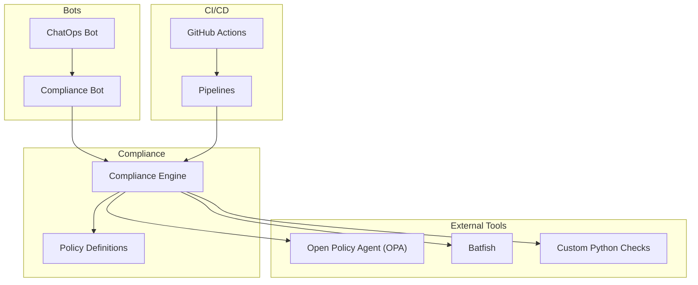
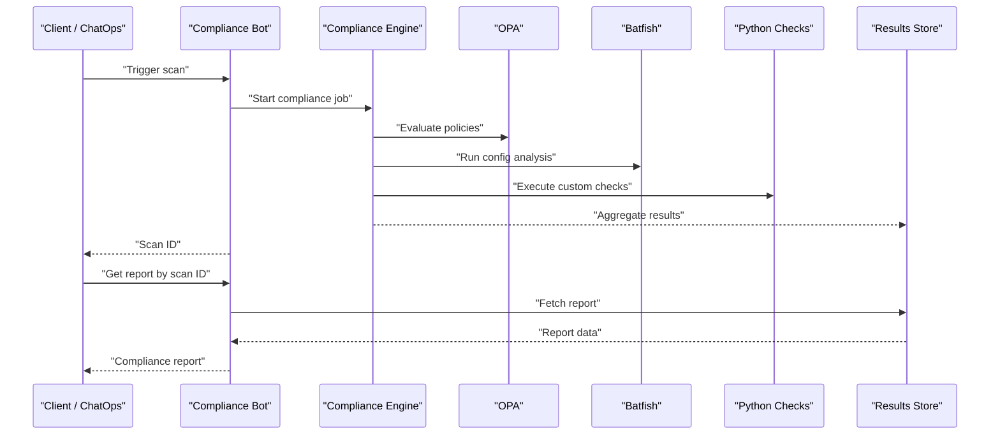
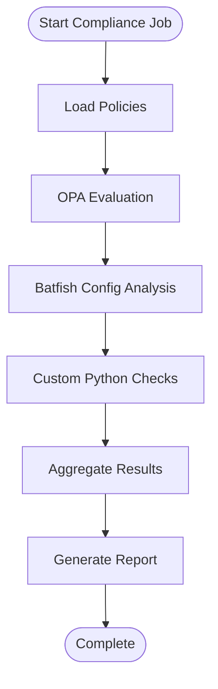
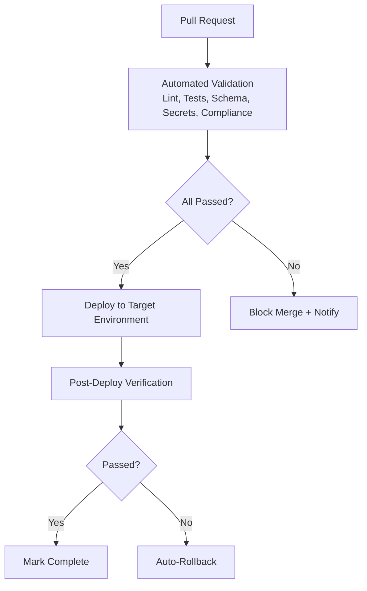
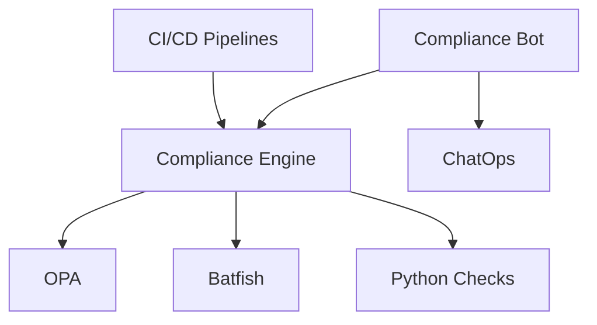

# Compliance Bot

<cite>
**Referenced Files in This Document**
- [README.md](file://README.md)
</cite>

## Table of Contents
1. [Introduction](#introduction)
2. [Project Structure](#project-structure)
3. [Core Components](#core-components)
4. [Architecture Overview](#architecture-overview)
5. [Detailed Component Analysis](#detailed-component-analysis)
6. [Dependency Analysis](#dependency-analysis)
7. [Performance Considerations](#performance-considerations)
8. [Troubleshooting Guide](#troubleshooting-guide)
9. [Conclusion](#conclusion)
10. [Appendices](#appendices)

## Introduction
This document describes the Compliance Bot functionality within the Enterprise Network Automation Platform. It explains how compliance scans are triggered and reported, how policies are defined and updated, and how the system integrates with Open Policy Agent (OPA), Batfish analysis, and custom Python compliance checks. It also covers ChatOps usage patterns, practical automation scenarios, and drift detection workflows.

The repository provides a high-level overview of bots, compliance strategy, and CI/CD integration. The Compliance Bot is listed as an API-driven bot that runs compliance scans and reports violations, and it participates in the broader GitOps and DevSecOps pipeline.

**Section sources**
- [README.md:460-478](file://README.md#L460-L478)
- [README.md:548-582](file://README.md#L548-L582)

## Project Structure
At a high level, the platform organizes automation assets across inventories, playbooks, roles, templates, Python modules, bots, tests, compliance definitions, pipelines, monitoring, and Terraform. The Compliance Bot sits under the bots layer and interacts with the compliance engine and policy definitions.

[No sources needed since this diagram shows conceptual workflow, not actual code structure]

**Section sources**
- [README.md:103-180](file://README.md#L103-L180)

## Core Components
- Compliance Bot: Exposes REST endpoints for triggering scans and retrieving results; integrates with GitHub-based ChatOps to run scans and report violations.
- Compliance Engine: Executes policy checks using OPA, Batfish configuration analysis, and custom Python checks; aggregates results into reports.
- Policy Definitions: Centralized rules describing required configurations and security baselines; severity levels guide enforcement and reporting.
- Integrations:
  - OPA: Declarative policy evaluation for infrastructure-as-code artifacts.
  - Batfish: Static analysis of network configurations for reachability, ACLs, and routing correctness.
  - Custom Python Checks: Pluggable rule sets for vendor-specific or business-specific requirements.

Key responsibilities:
- Scan orchestration and scheduling
- Policy loading and versioning
- Result aggregation and persistence
- Reporting and notifications via ChatOps and dashboards

**Section sources**
- [README.md:460-478](file://README.md#L460-L478)
- [README.md:548-582](file://README.md#L548-L582)

## Architecture Overview
The Compliance Bot participates in both on-demand operations and scheduled audits. It coordinates with the compliance engine to execute OPA policies, Batfish analyses, and custom Python checks, then publishes results for retrieval and visualization.

[No sources needed since this diagram shows conceptual workflow, not actual code structure]

## Detailed Component Analysis

### REST API Endpoints
The Compliance Bot exposes a base path for compliance operations. The repository documents the base endpoint and purpose.

- Base Endpoint
  - Path: /api/v1/compliance
  - Purpose: Run compliance scans and report violations
  - Integration: GitHub-based ChatOps

Note: The repository does not enumerate specific subpaths such as POST /api/v1/compliance/run, GET /api/v1/compliance/report/{scan-id}, GET /api/v1/compliance/policies, or PUT /api/v1/compliance/policies/{id}. These can be implemented beneath the documented base endpoint to support the described workflows.

Operational guidance:
- Triggering scans: Use a POST-style operation under the base path to start a scan job and receive a scan identifier.
- Retrieving results: Use a GET-style operation with the scan identifier to fetch the generated report.
- Managing policies: Provide listing and update operations under the policies subpath to manage policy versions and metadata.

**Section sources**
- [README.md:460-478](file://README.md#L460-L478)

### Compliance Rule Engine
The compliance flow combines multiple layers of validation:
- OPA policy checks for declarative governance over IaC and configuration artifacts
- Batfish static analysis for network behavior and ACL/routing correctness
- Custom Python checks for vendor-specific or organizational requirements

[No sources needed since this diagram shows conceptual workflow, not actual code structure]

**Section sources**
- [README.md:548-582](file://README.md#L548-L582)

### Policy Definitions and Severity Levels
Policies define required configurations and security baselines. The repository enumerates representative policies and their severities, which inform enforcement and reporting.

Representative policies and severities:
- SSH Only — Critical
- NTP Configured — High
- AAA Enabled — Critical
- SNMPv3 — High
- Logging Enabled — Medium
- Approved Ciphers — High
- Approved Firmware — High
- Password Policy — Critical
- ACL Standards — High
- Firewall Rules — Critical
- Unused Objects — Low

These severities guide gating decisions in CI/CD and prioritization in remediation workflows.

**Section sources**
- [README.md:552-567](file://README.md#L552-L567)

### Remediation Workflows
Remediation aligns with the GitOps model:
- Changes are proposed via pull requests
- Automated validation includes compliance checks
- Approval gates enforce policy adherence
- Deployment triggers automated application of desired state
- Post-deploy verification ensures compliance remains satisfied

[No sources needed since this diagram shows conceptual workflow, not actual code structure]

**Section sources**
- [README.md:619-638](file://README.md#L619-L638)
- [README.md:479-514](file://README.md#L479-L514)

### ChatOps Commands
The repository indicates GitHub-based ChatOps integration for the Compliance Bot. Typical commands include:
- "!compliance scan production" — trigger a scan against the production environment
- "!compliance report violations" — retrieve recent violation summaries

These commands route through the unified ChatOps router to the Compliance Bot, which orchestrates scans and returns results.

**Section sources**
- [README.md:460-478](file://README.md#L460-L478)

### Practical Examples and Scenarios
- Compliance Automation
  - Schedule daily full compliance audits via CI/CD
  - Enforce policy checks on every pull request before merge
  - Integrate results into dashboards and alerting channels
- Drift Detection
  - Compare running device configurations against approved baselines
  - Detect unauthorized changes and generate remediation tickets
  - Auto-rollback when post-deploy verification fails

**Section sources**
- [README.md:548-582](file://README.md#L548-L582)
- [README.md:619-638](file://README.md#L619-L638)

## Dependency Analysis
The Compliance Bot depends on:
- Compliance Engine for orchestration
- OPA for policy evaluation
- Batfish for static network analysis
- Custom Python checks for specialized validations
- CI/CD pipelines for scheduled and gated execution
- ChatOps integrations for user interaction

[No sources needed since this diagram shows conceptual workflow, not actual code structure]

**Section sources**
- [README.md:460-478](file://README.md#L460-L478)
- [README.md:548-582](file://README.md#L548-L582)

## Performance Considerations
- Parallelize independent checks (OPA, Batfish, Python) to reduce total scan time
- Cache policy definitions and device snapshots where appropriate
- Stream partial results to enable early feedback in ChatOps
- Limit scope per scan (by environment or device group) to control resource usage
- Monitor API latency and error rates for the Compliance Bot endpoints

[No sources needed since this section provides general guidance]

## Troubleshooting Guide
Common issues and resolutions:
- Ansible connection timeout: Verify SSH reachability and credentials
- Template rendering errors: Check Jinja2 syntax and variables
- Compliance check failures: Review policy definitions and device running config diffs
- CI pipeline failures: Inspect GitHub Actions logs for actionable messages
- Vault authentication failure: Verify OIDC token or AppRole credentials and Vault policies
- Molecule test failure: Ensure Docker/Podman is running and molecule configuration is valid
- Batfish analysis error: Validate snapshot contents and configuration format

**Section sources**
- [README.md:674-685](file://README.md#L674-L685)

## Conclusion
The Compliance Bot integrates policy-driven governance, static network analysis, and custom checks into a cohesive compliance workflow. It supports on-demand and scheduled scans, provides clear reporting, and enforces standards through GitOps and CI/CD gates. By combining OPA, Batfish, and pluggable Python checks, the platform achieves comprehensive coverage across multi-vendor environments while enabling efficient remediation and drift detection.

[No sources needed since this section summarizes without analyzing specific files]

## Appendices

### API Reference Summary
- Base Endpoint
  - /api/v1/compliance
  - Purpose: Run compliance scans and report violations
  - ChatOps: GitHub

Note: Specific subpaths (e.g., run, report, policies) are not enumerated in the repository documentation. They can be implemented under the base endpoint to support the described workflows.

**Section sources**
- [README.md:460-478](file://README.md#L460-L478)