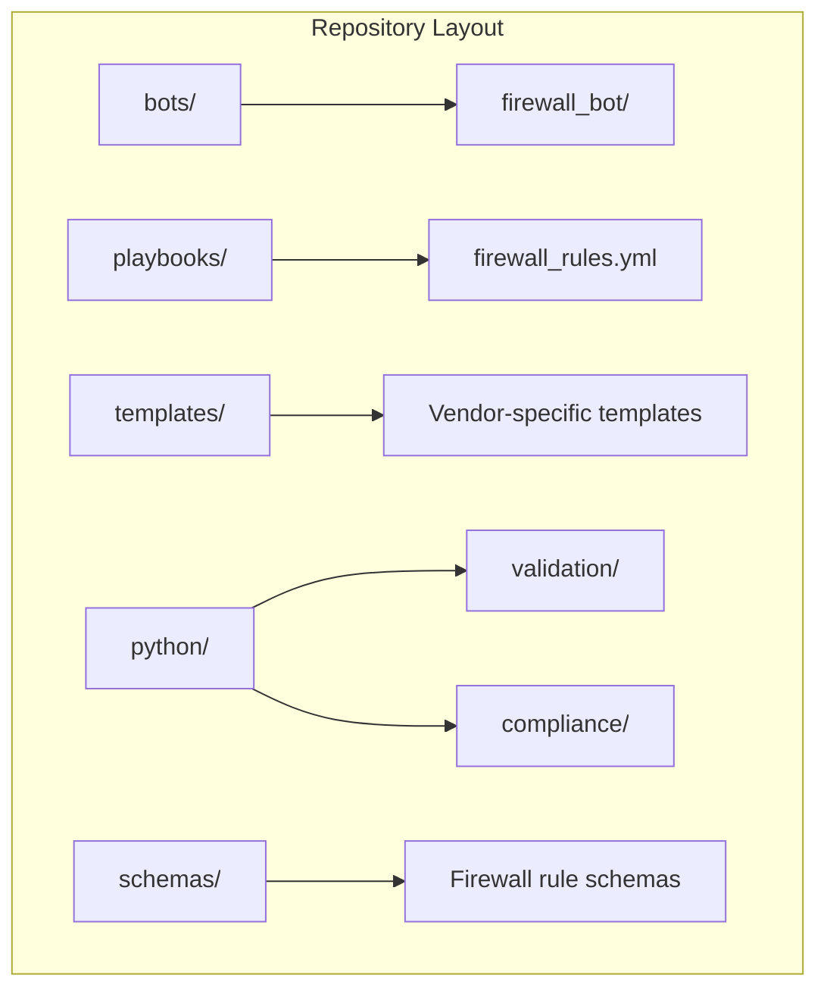
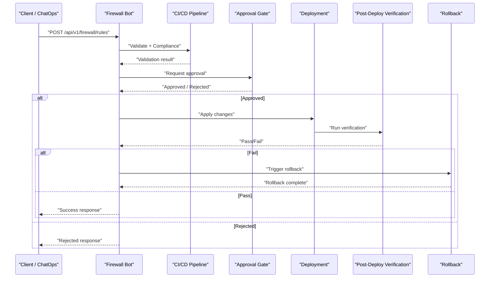
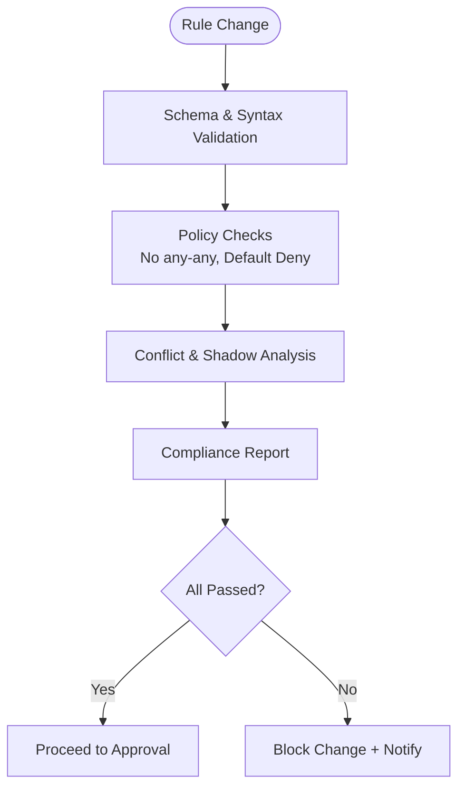
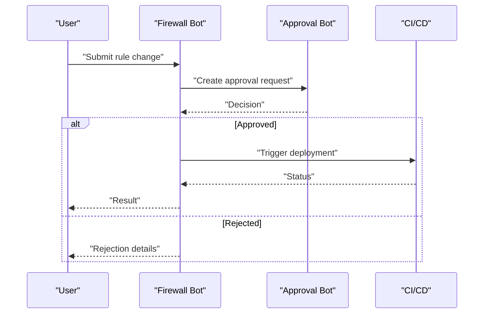
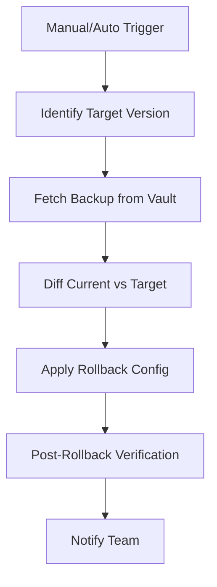
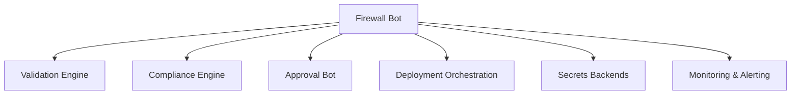

# Firewall Bot

<cite>
**Referenced Files in This Document**
- [README.md](file://README.md)
</cite>

## Table of Contents
1. [Introduction](#introduction)
2. [Project Structure](#project-structure)
3. [Core Components](#core-components)
4. [Architecture Overview](#architecture-overview)
5. [Detailed Component Analysis](#detailed-component-analysis)
6. [Dependency Analysis](#dependency-analysis)
7. [Performance Considerations](#performance-considerations)
8. [Troubleshooting Guide](#troubleshooting-guide)
9. [Conclusion](#conclusion)
10. [Appendices](#appendices)

## Introduction
This document describes the Firewall Bot functionality within the Enterprise Network Automation Platform. It focuses on:
- REST API endpoints for firewall rule management (create, read, update, delete)
- Rule validation engine capabilities including conflict detection and shadow rule analysis
- Compliance checking aligned with platform policies
- ChatOps commands for self-service operations
- Integration with approval workflows, audit logging, and rollback mechanisms
- Practical automation scenarios

The content is derived from the repository’s documented architecture, bot catalog, compliance checks, and GitOps/CI-CD flows.

## Project Structure
The repository organizes automation bots under a dedicated directory and exposes REST APIs for self-service operations. The Firewall Bot is listed among the automation bots and provides endpoints for firewall rule lifecycle management.

**Diagram sources**
- [README.md:105-180](file://README.md#L105-L180)

**Section sources**
- [README.md:105-180](file://README.md#L105-L180)

## Core Components
- Firewall Bot: Exposes REST endpoints to request, validate, and deploy firewall rules. It integrates with the broader automation pipeline and supports ChatOps.
- Validation Engine: Pre-deployment validation using schema checks and policy enforcement.
- Compliance Engine: Enforces policies such as “no any-any” and shadow/duplicate detection.
- Approval Workflow: Integrates with the approval gate before deployment.
- Audit Logging: Records changes and decisions across the lifecycle.
- Rollback: Automated rollback on verification failure or manual trigger.

Key references:
- Bot endpoints and purpose are defined in the Automation Bots section.
- Compliance checks include firewall-specific policies.
- CI/CD includes approval gates and automated rollback.

**Section sources**
- [README.md:460-478](file://REST.md#L460-L478)
- [README.md:552-582](file://README.md#L552-L582)
- [README.md:479-514](file://README.md#L479-L514)

## Architecture Overview
The Firewall Bot participates in the GitOps-driven automation pipeline. Requests flow through validation, compliance checks, approval, deployment, and post-deploy verification with automatic rollback if needed.

**Diagram sources**
- [README.md:460-478](file://README.md#L460-L478)
- [README.md:479-514](file://README.md#L479-L514)
- [README.md:619-638](file://README.md#L619-L638)

## Detailed Component Analysis

### REST API Endpoints
The Firewall Bot exposes CRUD endpoints for firewall rules. The base path is `/api/v1/firewall/rules`.

- POST /api/v1/firewall/rules
  - Purpose: Create a new firewall rule
  - Request body: Structured rule definition validated against schemas
  - Response: Rule metadata and status; may require approval before deployment
- GET /api/v1/firewall/rules/{id}
  - Purpose: Retrieve a specific rule by ID
  - Response: Rule details and current state
- PUT /api/v1/firewall/rules/{id}
  - Purpose: Update an existing rule
  - Behavior: Triggers validation and compliance checks; requires approval if policy dictates
- DELETE /api/v1/firewall/rules/{id}
  - Purpose: Remove a rule
  - Behavior: Triggers validation and compliance checks; requires approval if policy dictates

Notes:
- All mutating operations integrate with the approval workflow and audit logging.
- Responses include identifiers and status reflecting the GitOps lifecycle stage.

**Section sources**
- [README.md:460-478](file://README.md#L460-L478)

### Rule Validation Engine
The validation engine ensures that proposed firewall rules meet structural and semantic requirements before deployment.

- Schema validation: Ensures required fields and types conform to defined schemas.
- Policy checks: Enforces platform policies such as default deny and explicit allow only.
- Conflict detection: Identifies overlapping or contradictory rules.
- Shadow rule analysis: Detects rules that are masked by higher-priority rules.
- Duplicate detection: Flags redundant rules that do not change behavior.

Compliance integration:
- The platform enforces “No any-any” and “shadow/duplicate detection” as critical policies.

**Section sources**
- [README.md:552-582](file://README.md#L552-L582)

### Compliance Checking
Compliance is enforced at multiple stages: PR validation, template rendering, and pre-deployment checks. For firewall rules:
- No any-any rules allowed
- Shadow and duplicate rule detection
- Alignment with ACL standards (default deny, explicit allow only)

**Diagram sources**
- [README.md:552-582](file://README.md#L552-L582)

### ChatOps Commands
ChatOps enables self-service operations via Slack or Teams. Example commands:
- !fw add rule <payload>
  - Adds a new firewall rule after validation and approval
- !fw show rules [filter]
  - Lists current rules with optional filtering

Behavior:
- Commands route to the Firewall Bot, which performs validation and compliance checks.
- Results are posted back to the chat channel, including approval status and audit links.

**Section sources**
- [README.md:460-478](file://README.md#L460-L478)

### Approval Workflow Integration
All mutating operations integrate with the approval gate:
- Changes are staged and validated
- Approval is required before deployment
- On rejection, the client receives a clear reason and next steps

**Diagram sources**
- [README.md:460-478](file://README.md#L460-L478)
- [README.md:479-514](file://README.md#L479-L514)

### Audit Logging
Audit logs capture:
- Who requested the change
- What changed (rule diff)
- When it was approved/deployed
- Any rollback events

These logs support compliance audits and incident investigations.

**Section sources**
- [README.md:479-514](file://README.md#L479-L514)

### Rollback Capabilities
Automated rollback occurs when post-deploy verification fails. Manual rollback can be triggered via the Rollback Bot or ChatOps.

**Diagram sources**
- [README.md:660-671](file://README.md#L660-L671)

### Practical Automation Scenarios
- Add a new allow rule for a service:
  - Use POST /api/v1/firewall/rules or !fw add rule
  - System validates, runs compliance checks, requests approval, deploys, verifies, and logs
- Update an existing rule:
  - Use PUT /api/v1/firewall/rules/{id}
  - Same validation/approval/verification flow applies
- Remove a rule:
  - Use DELETE /api/v1/firewall/rules/{id}
  - Triggers compliance checks and approval if required
- List and filter rules:
  - Use GET /api/v1/firewall/rules/{id} for specifics or ChatOps !fw show rules for overview

[No sources needed since this section aggregates previously sourced concepts without analyzing specific files]

## Dependency Analysis
The Firewall Bot depends on:
- Validation and compliance modules
- Approval workflow services
- Deployment orchestration (Ansible/Terraform)
- Secrets backends for credentials
- Monitoring and alerting systems

**Diagram sources**
- [README.md:460-478](file://README.md#L460-L478)
- [README.md:552-582](file://README.md#L552-L582)
- [README.md:479-514](file://README.md#L479-L514)

**Section sources**
- [README.md:460-478](file://README.md#L460-L478)
- [README.md:552-582](file://README.md#L552-L582)
- [README.md:479-514](file://README.md#L479-L514)

## Performance Considerations
- Batch operations: Prefer bulk updates where supported to reduce API calls and pipeline runs.
- Caching: Cache rule listings and compliance reports to minimize repeated analysis.
- Concurrency: Parallelize independent validations while preserving ordering for conflicting rules.
- Idempotency: Ensure all endpoints are idempotent to safely retry failed operations.
- Rate limiting: Implement rate limits to protect backend systems during high-volume requests.

[No sources needed since this section provides general guidance]

## Troubleshooting Guide
Common issues and resolutions:
- Validation failures: Review schema errors and policy violations reported by the validation engine.
- Compliance blocks: Address “any-any” or shadow/duplicate rule findings before resubmitting.
- Approval delays: Follow up with approvers; ensure change descriptions and diffs are clear.
- Deployment failures: Check post-deploy verification logs; use rollback if necessary.
- ChatOps command errors: Confirm permissions and payload format; check bot logs for detailed errors.

**Section sources**
- [README.md:674-685](file://README.md#L674-L685)

## Conclusion
The Firewall Bot provides a secure, compliant, and auditable pathway for managing firewall rules across multi-vendor environments. By integrating validation, compliance, approval, deployment, and rollback into a GitOps-driven pipeline, it ensures reliability and governance at scale.

[No sources needed since this section summarizes without analyzing specific files]

## Appendices

### Request/Response Schemas (Conceptual)
Note: These are conceptual structures based on the platform’s schema-driven approach. Actual field definitions reside in the repository’s schema files.

- Create Rule (POST /api/v1/firewall/rules)
  - Request fields:
    - name: string
    - description: string
    - action: enum (allow|deny)
    - source: object (address/network)
    - destination: object (address/network)
    - service: object (protocol/port)
    - priority: integer
    - tags: array of strings
    - environment: enum (lab|staging|production)
  - Response fields:
    - id: string
    - status: enum (pending_approval|approved|deployed|failed|rolled_back)
    - message: string
    - links: object (approval_url, audit_log_url)

- Get Rule (GET /api/v1/firewall/rules/{id})
  - Response fields:
    - id: string
    - rule: object (as above)
    - history: array of events (created, updated, approved, deployed, rolled_back)

- Update Rule (PUT /api/v1/firewall/rules/{id})
  - Request fields: same as create, excluding immutable fields
  - Response fields: same as create

- Delete Rule (DELETE /api/v1/firewall/rules/{id})
  - Response fields:
    - id: string
    - status: enum (deleted|failed)
    - message: string

[No sources needed since this section provides conceptual schema definitions]