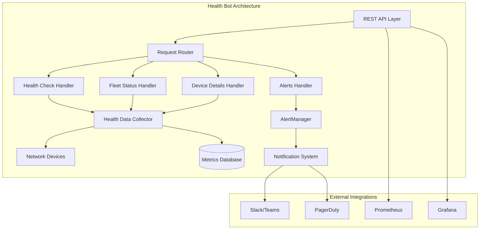
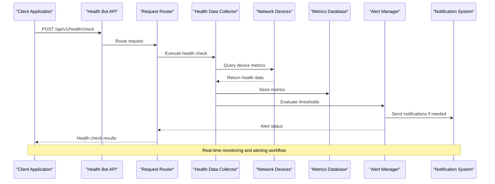
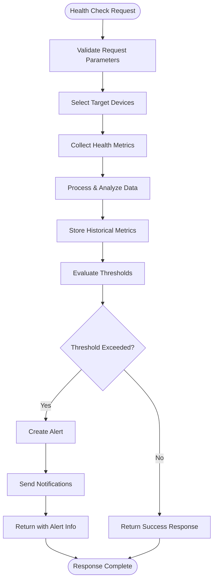
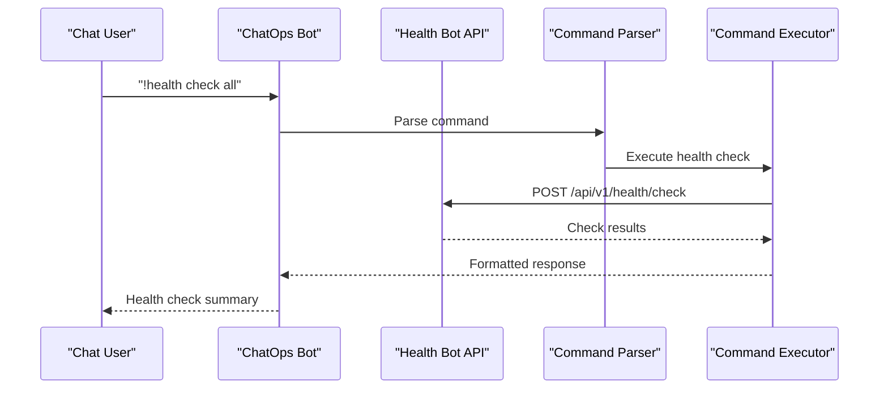
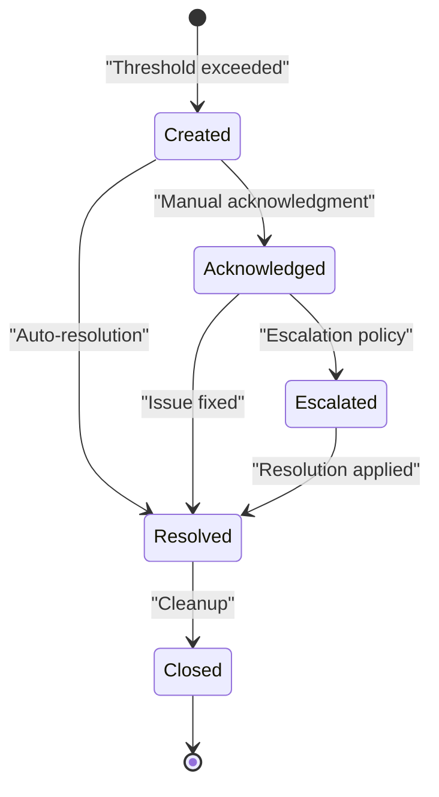
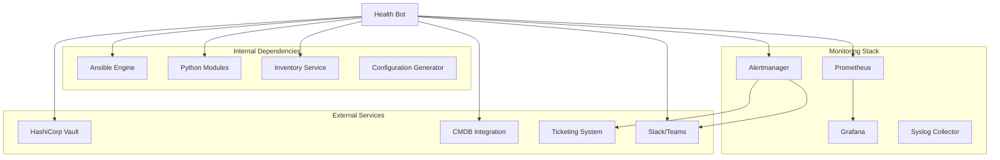

# Health Bot

<cite>
**Referenced Files in This Document**
- [README.md](file://README.md)
</cite>

## Table of Contents
1. [Introduction](#introduction)
2. [Project Structure](#project-structure)
3. [Core Components](#core-components)
4. [Architecture Overview](#architecture-overview)
5. [Detailed Component Analysis](#detailed-component-analysis)
6. [Dependency Analysis](#dependency-analysis)
7. [Performance Considerations](#performance-considerations)
8. [Troubleshooting Guide](#troubleshooting-guide)
9. [Conclusion](#conclusion)
10. [Appendices](#appendices)

## Introduction

The Health Bot is a critical component of the Enterprise Network Automation Platform that provides comprehensive health monitoring capabilities across network devices. As part of the broader automation bot ecosystem, the Health Bot exposes REST APIs and ChatOps integrations to enable on-demand health checks, fleet-wide status monitoring, device-specific metrics collection, and active alert management.

The Health Bot serves as a centralized interface for network operators to monitor the health and performance of thousands of network devices across multi-vendor, multi-region environments. It integrates with the platform's monitoring stack including Prometheus, Grafana, and Alertmanager to provide real-time visibility into network infrastructure health.

## Project Structure

The Health Bot is implemented as part of the bots directory structure within the Enterprise Network Automation Platform. The platform follows a modular architecture where each bot is responsible for specific operational domains.



**Diagram sources**
- [README.md:460-476](file://README.md#L460-L476)
- [README.md:583-604](file://README.md#L583-L604)

**Section sources**
- [README.md:142-151](file://README.md#L142-L151)
- [README.md:460-476](file://README.md#L460-L476)

## Core Components

The Health Bot consists of several core components that work together to provide comprehensive health monitoring capabilities:

### REST API Endpoints

The Health Bot exposes four primary REST API endpoints for health monitoring operations:

| Endpoint | Method | Purpose | Description |
|----------|--------|---------|-------------|
| `/api/v1/health/check` | POST | On-demand Health Check | Triggers immediate health assessment across specified or all devices |
| `/api/v1/health/status` | GET | Fleet Status Overview | Returns aggregated health status for the entire device fleet |
| `/api/v1/health/{device}/details` | GET | Device-Specific Metrics | Provides detailed health metrics for individual devices |
| `/api/v1/health/alerts` | GET | Active Alerts | Lists currently active health alerts and their severity levels |

### Health Check Categories

The Health Bot performs comprehensive health assessments across multiple categories:

#### Connectivity Checks
- **Device Reachability**: ICMP ping and SSH connectivity validation
- **Protocol Availability**: NETCONF, RESTCONF, SNMP, and API endpoint availability
- **Authentication Status**: AAA/TACACS+/RADIUS server connectivity
- **Certificate Validity**: TLS certificate expiration and configuration

#### Resource Utilization Monitoring
- **CPU Usage**: Processor utilization trends and peak detection
- **Memory Consumption**: RAM usage patterns and memory leak detection
- **Storage Capacity**: Flash memory and disk space utilization
- **Process Health**: Critical system process monitoring

#### Interface Performance Analysis
- **Interface Errors**: CRC errors, input/output drops, and collision counts
- **Bandwidth Utilization**: Traffic throughput and capacity planning metrics
- **Link State Monitoring**: Interface up/down events and flapping detection
- **Quality Metrics**: Packet loss rates and latency measurements

#### Protocol Status Validation
- **Routing Protocol Health**: OSPF, BGP, IS-IS neighbor status and adjacency states
- **High Availability Status**: HSRP/VRRP/GLBP failover readiness
- **Security Protocol Status**: IPsec tunnel health and VPN gateway status
- **Management Protocol Status**: LLDP/CDP neighbor discovery and topology validation

**Section sources**
- [README.md:460-476](file://README.md#L460-L476)
- [README.md:583-616](file://README.md#L583-L616)

## Architecture Overview

The Health Bot architecture follows a microservices pattern with clear separation of concerns between API handling, data collection, processing, and notification systems.



**Diagram sources**
- [README.md:460-476](file://README.md#L460-L476)
- [README.md:583-604](file://README.md#L583-L604)

### Data Flow Architecture

The Health Bot implements a comprehensive data flow pipeline for health monitoring:



**Diagram sources**
- [README.md:460-476](file://README.md#L460-L476)
- [README.md:583-616](file://README.md#L583-L616)

## Detailed Component Analysis

### REST API Implementation

The Health Bot's REST API layer provides a clean interface for health monitoring operations. Each endpoint is designed with specific responsibilities and follows consistent response patterns.

#### POST /api/v1/health/check - On-Demand Health Check

This endpoint triggers immediate health assessments across specified devices or the entire fleet. The request supports filtering by device groups, regions, or specific device identifiers.

**Request Parameters:**
- `devices`: Array of device identifiers (optional, defaults to all devices)
- `categories`: Array of health check categories to execute
- `timeout`: Maximum execution time in seconds
- `async`: Boolean flag for asynchronous execution

**Response Format:**
- `check_id`: Unique identifier for tracking the health check
- `status`: Overall health status (healthy, degraded, critical)
- `devices_checked`: Number of devices processed
- `execution_time`: Total execution duration
- `results`: Detailed per-device health results

#### GET /api/v1/health/status - Fleet Status Overview

Provides aggregated health status across the entire device fleet with summary statistics and trend indicators.

**Query Parameters:**
- `group`: Filter by device group (core_routers, distribution_switches, etc.)
- `region`: Filter by geographic region
- `vendor`: Filter by vendor type
- `time_range`: Time window for historical comparison

**Response Format:**
- `fleet_health`: Overall fleet health score
- `total_devices`: Count of monitored devices
- `healthy_count`: Number of healthy devices
- `degraded_count`: Number of degraded devices  
- `critical_count`: Number of critical devices
- `trends`: 24-hour trend analysis

#### GET /api/v1/health/{device}/details - Device-Specific Metrics

Returns comprehensive health metrics for individual devices including real-time values and historical trends.

**Path Parameters:**
- `device`: Unique device identifier

**Query Parameters:**
- `metrics`: Specific metric categories to include
- `time_window`: Historical data time range
- `granularity`: Data point frequency (1m, 5m, 1h)

**Response Format:**
- `device_info`: Basic device metadata
- `connectivity_status`: Connection health metrics
- `resource_utilization`: CPU, memory, storage metrics
- `interface_metrics`: Port-level performance data
- `protocol_status`: Routing and management protocol health
- `alerts`: Active alerts for this device

#### GET /api/v1/health/alerts - Active Alerts

Lists currently active health alerts with severity levels and recommended actions.

**Query Parameters:**
- `severity`: Filter by alert severity (info, warning, critical)
- `device_group`: Filter by device group
- `status`: Filter by alert status (active, acknowledged, resolved)
- `time_range`: Time window for alert history

**Response Format:**
- `alert_count`: Total number of active alerts
- `alerts`: Array of alert objects with details
- `summary`: Aggregated alert statistics

**Section sources**
- [README.md:460-476](file://README.md#L460-L476)

### ChatOps Integration

The Health Bot integrates with popular chat platforms (Slack and Microsoft Teams) to provide natural language command interfaces for health monitoring operations.

#### Supported ChatOps Commands

| Command | Description | Example |
|---------|-------------|---------|
| `!health check all` | Trigger health check across all devices | `!health check all --verbose` |
| `!health status core-rtr-01` | Get detailed status for specific device | `!health status core-rtr-01 --metrics cpu,memory` |
| `!health alerts critical` | List critical alerts only | `!health alerts critical --recent` |
| `!health check group core_routers` | Check specific device group | `!health check group core_routers --category connectivity` |
| `!health compare today vs yesterday` | Compare health metrics across time periods | `!health compare today vs yesterday --trend` |

#### ChatOps Workflow



**Diagram sources**
- [README.md:460-476](file://README.md#L460-L476)

### Threshold Configuration

The Health Bot supports configurable threshold policies for different device types and health categories. Thresholds are defined in YAML configuration files and support environment-specific overrides.

#### Threshold Configuration Structure

| Category | Metric | Warning Threshold | Critical Threshold | Evaluation Period |
|----------|--------|-------------------|-------------------|-------------------|
| CPU | Usage Percentage | 75% | 90% | 5 minutes |
| Memory | Usage Percentage | 80% | 95% | 10 minutes |
| Storage | Disk Usage | 85% | 95% | 1 hour |
| Interfaces | Error Rate | 1 error/min | 10 errors/min | 5 minutes |
| BGP | Neighbor Down | 1 neighbor | 3 neighbors | 15 minutes |
| OSPF | Adjacency Lost | 1 adjacency | 3 adjacencies | 10 minutes |

#### Environment-Specific Thresholds

The system supports different threshold configurations for various environments:

- **Production**: Strict thresholds for critical infrastructure
- **Staging**: Moderate thresholds for testing scenarios  
- **Lab**: Relaxed thresholds for development environments

**Section sources**
- [README.md:460-476](file://README.md#L460-L476)

### Alerting Integration

The Health Bot integrates with multiple notification channels and alerting systems to ensure timely incident response.

#### Notification Channels

| Channel | Configuration | Use Case |
|---------|---------------|----------|
| Slack | Webhook integration | Team notifications and ChatOps commands |
| Microsoft Teams | Incoming webhook | Enterprise communication integration |
| PagerDuty | API integration | Critical alert escalation and on-call management |
| Email | SMTP configuration | Audit trails and compliance reporting |
| Webhook | Custom HTTP endpoints | Integration with external ticketing systems |

#### Alert Lifecycle Management



**Diagram sources**
- [README.md:583-604](file://README.md#L583-L604)

## Dependency Analysis

The Health Bot has well-defined dependencies on other platform components and external services.



**Diagram sources**
- [README.md:52-99](file://README.md#L52-L99)
- [README.md:583-604](file://README.md#L583-L604)

### Component Coupling Analysis

The Health Bot maintains loose coupling with other components through well-defined interfaces:

- **Ansible Integration**: Uses Ansible playbooks for device health checks via standardized interfaces
- **Python Modules**: Leverages reusable Python modules for common networking operations
- **Monitoring Stack**: Integrates with Prometheus and Alertmanager through standard APIs
- **Secrets Management**: Accesses credentials through HashiCorp Vault abstraction layer

**Section sources**
- [README.md:52-99](file://README.md#L52-L99)
- [README.md:583-604](file://README.md#L583-L604)

## Performance Considerations

The Health Bot is designed for high-performance operation across large device fleets with the following optimization strategies:

### Concurrency and Parallelism
- **Parallel Device Queries**: Concurrent health checks across device pools using async/await patterns
- **Connection Pooling**: Reusable connections to network devices and API endpoints
- **Batch Processing**: Grouped metric collection to reduce API overhead

### Caching Strategies
- **Device Metadata Cache**: Local caching of device inventory and configuration data
- **Metric Time-Series Cache**: Short-term caching of frequently accessed metrics
- **Result Caching**: Cached responses for identical health check requests within time windows

### Resource Management
- **Rate Limiting**: Configurable rate limits for device queries to prevent overload
- **Timeout Handling**: Graceful timeout management for unresponsive devices
- **Memory Optimization**: Streaming data processing for large result sets

### Scalability Patterns
- **Horizontal Scaling**: Stateless API design enables multiple Health Bot instances
- **Load Distribution**: Round-robin load balancing across device pools
- **Graceful Degradation**: Partial health checks when some devices are unreachable

## Troubleshooting Guide

Common issues and resolution strategies for Health Bot operations:

### API Endpoint Issues

| Issue | Symptoms | Resolution |
|-------|----------|------------|
| Connection Timeout | API requests hang or timeout | Verify device reachability and increase timeout settings |
| Authentication Failure | 401/403 responses | Check credential rotation and Vault access policies |
| Rate Limiting | 429 Too Many Requests | Implement client-side retry logic with exponential backoff |
| Invalid Device ID | 404 Not Found | Verify device exists in inventory and is properly configured |

### Health Check Failures

| Issue | Symptoms | Resolution |
|-------|----------|------------|
| Device Unreachable | All connectivity checks fail | Verify network connectivity and device authentication |
| High Latency | Slow health check responses | Check network congestion and device performance |
| Inconsistent Results | Flapping health status | Investigate device stability and network conditions |
| Missing Metrics | Incomplete health data | Verify monitoring agent installation and configuration |

### Alerting Problems

| Issue | Symptoms | Resolution |
|-------|----------|------------|
| Missed Alerts | No notifications received | Check notification channel configuration and connectivity |
| Alert Storm | Excessive duplicate alerts | Review alert deduplication and suppression rules |
| False Positives | Non-critical issues triggering alerts | Adjust threshold values and evaluation periods |
| Delayed Notifications | Late alert delivery | Monitor notification queue and processing latency |

**Section sources**
- [README.md:674-685](file://README.md#L674-L685)

## Conclusion

The Health Bot represents a comprehensive health monitoring solution for enterprise network automation platforms. Its modular architecture, extensive API surface, and multi-channel alerting capabilities make it suitable for managing thousands of network devices across diverse environments.

Key strengths of the Health Bot include:

- **Comprehensive Coverage**: Multi-category health assessment including connectivity, resources, interfaces, and protocols
- **Flexible Integration**: Support for multiple notification channels and ChatOps platforms
- **Scalable Design**: Horizontal scaling and parallel processing for large device fleets
- **Configurable Thresholds**: Environment-specific threshold policies and alerting rules
- **Real-time Monitoring**: Immediate health assessment with historical trend analysis

The Health Bot effectively bridges the gap between automated network operations and human oversight, providing both machine-readable APIs for integration and natural language interfaces for operational teams.

## Appendices

### A. API Reference Examples

#### Health Check Request Example
```bash
curl -X POST https://health-bot.example.com/api/v1/health/check \
  -H "Authorization: Bearer $TOKEN" \
  -H "Content-Type: application/json" \
  -d '{
    "devices": ["core-rtr-01", "dist-sw-01"],
    "categories": ["connectivity", "cpu", "memory"],
    "timeout": 30,
    "async": false
  }'
```

#### Fleet Status Query Example
```bash
curl -X GET "https://health-bot.example.com/api/v1/health/status?group=core_routers&region=us-east" \
  -H "Authorization: Bearer $TOKEN"
```

### B. ChatOps Command Reference

#### Basic Health Operations
- `!health check all` - Check all devices
- `!health status <device>` - Get device status
- `!health alerts` - Show active alerts
- `!health check group <group_name>` - Check device group

#### Advanced Operations
- `!health compare today vs yesterday` - Compare health metrics
- `!health check --verbose` - Detailed health check output
- `!health alerts --severity critical` - Filter by severity
- `!health export <format>` - Export health data

### C. Dashboard Integration

The Health Bot integrates with Grafana dashboards through Prometheus metrics:

| Dashboard Panel | Metric Source | Visualization |
|----------------|---------------|---------------|
| Fleet Health Score | `health_fleet_score` | Gauge with thresholds |
| Device Status Map | `health_device_status` | Geographic map visualization |
| Resource Utilization Trends | `health_cpu_usage`, `health_memory_usage` | Time series charts |
| Alert Summary | `health_alert_count` | Bar chart by severity |
| Performance Metrics | `health_check_duration` | Latency histograms |