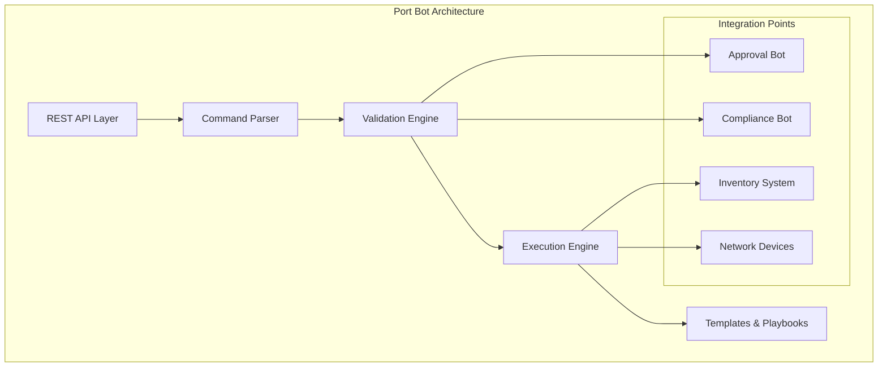
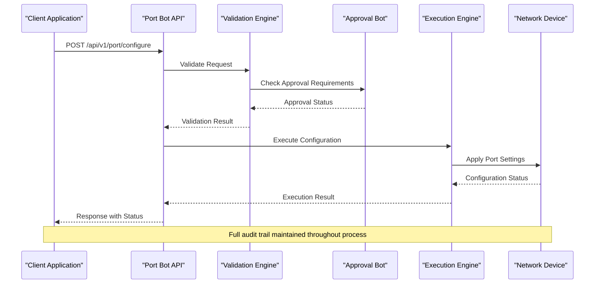
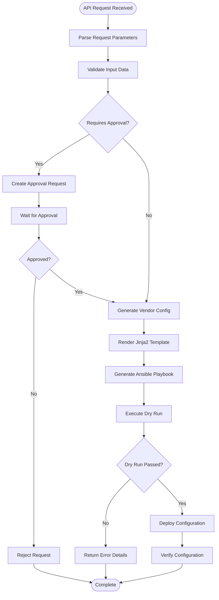
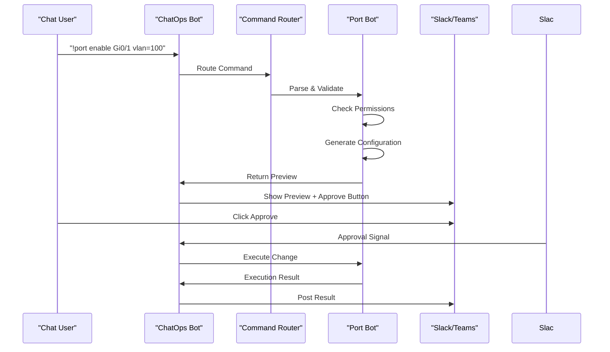
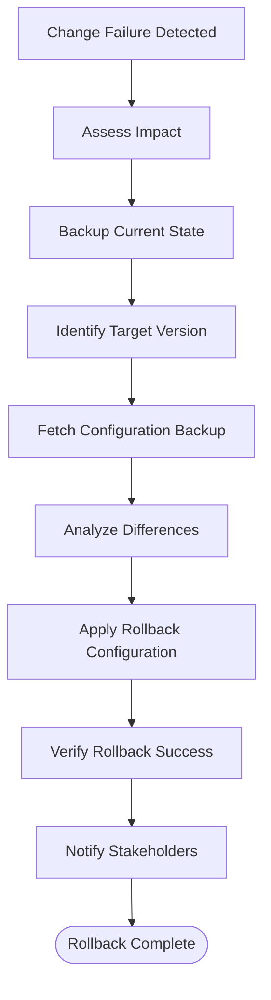
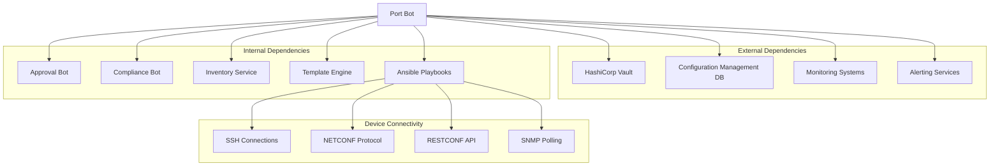

# Port Bot

<cite>
**Referenced Files in This Document**
- [README.md](file://README.md)
</cite>

## Table of Contents
1. [Introduction](#introduction)
2. [Project Structure](#project-structure)
3. [Core Components](#core-components)
4. [Architecture Overview](#architecture-overview)
5. [Detailed Component Analysis](#detailed-component-analysis)
6. [Dependency Analysis](#dependency-analysis)
7. [Performance Considerations](#performance-considerations)
8. [Troubleshooting Guide](#troubleshooting-guide)
9. [Conclusion](#conclusion)
10. [Appendices](#appendices)

## Introduction

The Port Bot is a specialized automation component within the Enterprise Network Automation Platform designed to manage switch port configuration through REST APIs and ChatOps commands. It provides self-service capabilities for network engineers to enable, disable, and configure switch ports across multi-vendor environments including Cisco IOS, NX-OS, Arista EOS, and other supported platforms.

The Port Bot integrates seamlessly with the platform's GitOps workflow, approval processes, and compliance enforcement mechanisms while providing both programmatic API access and conversational command interfaces for operational flexibility.

## Project Structure

The Port Bot follows the modular architecture pattern established by the platform, residing within the `bots/port_bot/` directory structure. The overall project organization supports vendor-agnostic operations through standardized interfaces and templates.

**Diagram sources**
- [README.md:142-151](file://README.md#L142-L151)
- [README.md:460-478](file://README.md#L460-L478)

**Section sources**
- [README.md:103-180](file://README.md#L103-L180)
- [README.md:142-151](file://README.md#L142-L151)

## Core Components

The Port Bot consists of several interconnected components that work together to provide comprehensive port management capabilities:

### REST API Endpoints

The Port Bot exposes a comprehensive set of REST API endpoints for programmatic port management:

| Endpoint | Method | Purpose | Description |
|----------|--------|---------|-------------|
| `/api/v1/port/configure` | POST | Port Configuration | Create new port configurations with full parameter support |
| `/api/v1/port/{device}/{port}` | GET | Status Check | Retrieve current port status and configuration details |
| `/api/v1/port/{device}/{port}/config` | PUT | Update Configuration | Modify existing port settings |
| `/api/v1/port/{device}/{port}/config` | DELETE | Remove Configuration | Delete port configuration and revert to defaults |

### Command Processing Engine

The bot processes both REST API requests and ChatOps commands through a unified parsing engine that normalizes input formats and applies consistent validation rules.

### Vendor Abstraction Layer

A critical component that translates generic port operations into vendor-specific configurations for Cisco IOS, NX-OS, Arista EOS, and other supported platforms using Jinja2 templates and Ansible playbooks.

**Section sources**
- [README.md:460-478](file://README.md#L460-L478)
- [README.md:130-141](file://README.md#L130-L141)

## Architecture Overview

The Port Bot operates within the broader automation platform architecture, leveraging shared services for authentication, authorization, compliance checking, and deployment orchestration.

**Diagram sources**
- [README.md:460-478](file://README.md#L460-L478)
- [README.md:479-501](file://README.md#L479-L501)

The architecture ensures that all port modifications follow the established GitOps workflow, including automated validation, compliance checks, and approval gates before any changes reach production devices.

## Detailed Component Analysis

### REST API Implementation

The Port Bot's REST API layer provides comprehensive port management capabilities through well-defined endpoints with robust error handling and response formatting.

#### Port Configuration Workflow

**Diagram sources**
- [README.md:479-501](file://README.md#L479-L501)
- [README.md:619-638](file://README.md#L619-L638)

### Port Type Detection and Configuration

The Port Bot supports automatic detection and configuration of various port types:

#### Access Ports
- Single VLAN assignment
- DHCP client/server configuration
- Port security policies
- Storm control settings

#### Trunk Ports
- Multiple VLAN tagging (802.1Q)
- Native VLAN configuration
- VLAN pruning and filtering
- Dynamic trunk negotiation (DTP)

#### LACP Port Channels
- Link aggregation group membership
- Load balancing algorithms
- Member port health monitoring
- Graceful failover configuration

#### Security Features
- **Port Security**: MAC address limiting, sticky MAC addresses
- **DHCP Snooping**: Rogue DHCP server protection
- **Dynamic ARP Inspection**: ARP spoofing prevention
- **IP Source Guard**: IP-MAC binding enforcement

**Section sources**
- [README.md:388-399](file://README.md#L388-L399)
- [README.md:460-478](file://README.md#L460-L478)

### ChatOps Integration

The Port Bot provides natural language command processing through Slack and Microsoft Teams integrations:

#### Supported Commands

| Command | Syntax | Description | Example |
|---------|--------|-------------|---------|
| Enable Port | `!port enable {interface} vlan={vlan_id}` | Configure port as access with VLAN | `!port enable Gi0/1 vlan=100` |
| Disable Port | `!port disable {interface}` | Shutdown port interface | `!port disable Fa0/1` |
| Check Status | `!port status {interface}` | Display current port configuration | `!port status Fa0/1` |
| Configure Trunk | `!port trunk {interface} vlans={vlan_list}` | Set port as trunk with VLANs | `!port trunk Gi0/24 vlans=100,200,300` |
| Configure LACP | `!port lacp {interface} channel={channel_group}` | Add port to LACP bundle | `!port lacp Gi0/1 channel=10` |
| Show Impact | `!port impact {interface}` | Analyze change impact before execution | `!port impact Gi0/1` |

#### Command Processing Flow

**Diagram sources**
- [README.md:460-478](file://README.md#L460-L478)

### Approval Workflow Integration

The Port Bot integrates with the centralized Approval Bot to enforce change management policies:

#### Approval Tiers

| Change Type | Approval Required | Auto-Approve Conditions |
|-------------|-------------------|------------------------|
| Simple VLAN Assignment | No | Standard VLAN IDs only |
| Trunk Configuration | Team Lead | Non-production environment |
| LACP Changes | Network Manager | Lab/Staging environments |
| Security Policy Changes | CAB Review | All environments |
| Production Changes | CAB + Security | Critical infrastructure |

#### Change Impact Analysis

The system performs comprehensive impact analysis before executing changes:

- **Connectivity Impact**: Analyze potential service disruptions
- **Security Implications**: Evaluate policy violations and risks
- **Compliance Checks**: Ensure adherence to organizational standards
- **Rollback Planning**: Prepare rollback procedures automatically

**Section sources**
- [README.md:460-478](file://README.md#L460-L478)
- [README.md:548-580](file://README.md#L548-L580)

### Rollback Procedures

The Port Bot implements automated rollback capabilities integrated with the platform's backup and recovery systems:

#### Automatic Rollback Triggers

- Configuration verification failures
- Device connectivity loss during changes
- Compliance check violations post-deployment
- Manual rollback requests via API or ChatOps

#### Rollback Process

**Diagram sources**
- [README.md:642-671](file://README.md#L642-L671)

## Dependency Analysis

The Port Bot maintains clear dependency relationships with other platform components while minimizing coupling through well-defined interfaces.

**Diagram sources**
- [README.md:339-357](file://README.md#L339-L357)
- [README.md:438-456](file://README.md#L438-L456)

### Key Dependency Characteristics

- **Loose Coupling**: Clear API boundaries between components
- **Resilient Design**: Retry logic and circuit breakers for external dependencies
- **Vendor Agnostic**: Abstracted device communication layer
- **Audit Trail**: Comprehensive logging and event tracking

**Section sources**
- [README.md:339-357](file://README.md#L339-L357)
- [README.md:438-456](file://README.md#L438-L456)

## Performance Considerations

The Port Bot is designed for high-throughput operations with careful attention to performance optimization:

### Concurrency and Scaling

- **Parallel Execution**: Support for bulk port operations across multiple devices
- **Connection Pooling**: Efficient reuse of device connections
- **Rate Limiting**: Protection against API abuse and device overload
- **Asynchronous Processing**: Background job queue for long-running operations

### Resource Optimization

- **Template Caching**: Pre-compiled Jinja2 templates for faster rendering
- **Configuration Diffing**: Minimal configuration changes through intelligent diffing
- **Batch Operations**: Group related changes to reduce device interactions
- **Memory Management**: Streaming responses for large configuration sets

### Monitoring and Metrics

Key performance indicators tracked include:
- API response times by endpoint
- Device connection success rates
- Configuration generation latency
- Approval workflow duration
- Error rates and failure patterns

## Troubleshooting Guide

Common issues and their resolutions when working with the Port Bot:

### API Issues

| Issue | Symptoms | Resolution |
|-------|----------|------------|
| Authentication Failure | 401 Unauthorized errors | Verify API token permissions and expiration |
| Permission Denied | 403 Forbidden responses | Check user role assignments and device access controls |
| Rate Limit Exceeded | 429 Too Many Requests | Implement exponential backoff in client applications |
| Device Unreachable | Connection timeout errors | Verify network connectivity and device credentials |

### Configuration Problems

| Issue | Symptoms | Resolution |
|-------|----------|------------|
| Template Rendering Errors | Jinja2 syntax errors in logs | Validate template syntax and variable definitions |
| Vendor Compatibility | Inconsistent behavior across platforms | Check vendor-specific template versions |
| Approval Workflow Stalls | Pending approvals indefinitely | Review approval queue and notify approvers |
| Rollback Failures | Rollback operation errors | Verify backup integrity and device accessibility |

### ChatOps Issues

| Issue | Symptoms | Resolution |
|-------|----------|------------|
| Command Not Recognized | "Unknown command" responses | Verify command syntax and bot permissions |
| Delayed Responses | Slow command processing | Check bot workload and queue depth |
| Missing Context | Incorrect device targeting | Verify device naming conventions and inventory accuracy |

**Section sources**
- [README.md:674-685](file://README.md#L674-L685)

## Conclusion

The Port Bot represents a comprehensive solution for automated switch port management within enterprise network environments. By combining REST APIs, ChatOps commands, and robust approval workflows, it enables efficient and secure port configuration operations across multi-vendor deployments.

The bot's integration with the broader automation platform ensures consistency, compliance, and reliability while providing the flexibility needed for diverse operational requirements. Its design emphasizes safety through comprehensive validation, impact analysis, and automated rollback capabilities, making it suitable for production environments where network stability is paramount.

Future enhancements may include advanced analytics for port utilization trends, AI-driven capacity planning, and expanded vendor support for emerging networking technologies.

## Appendices

### A. API Reference Summary

The complete Port Bot API reference includes detailed request/response schemas, error codes, and usage examples for all supported endpoints and operations.

### B. ChatOps Command Reference

Comprehensive documentation of all supported ChatOps commands with syntax variations, parameter options, and example usage scenarios.

### C. Vendor-Specific Considerations

Platform-specific implementation details and limitations for each supported network operating system and vendor platform.