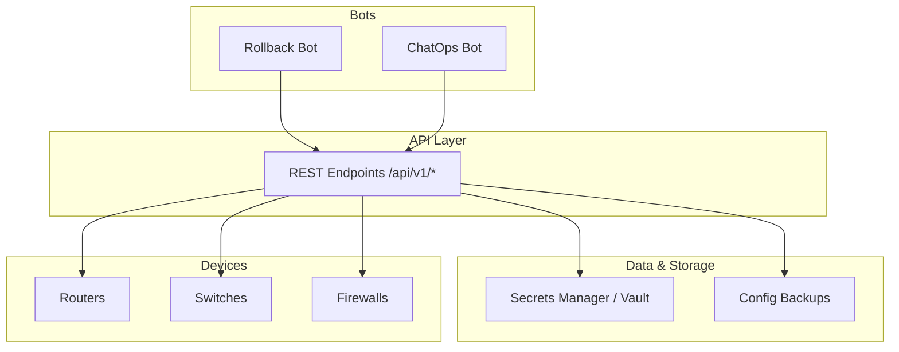
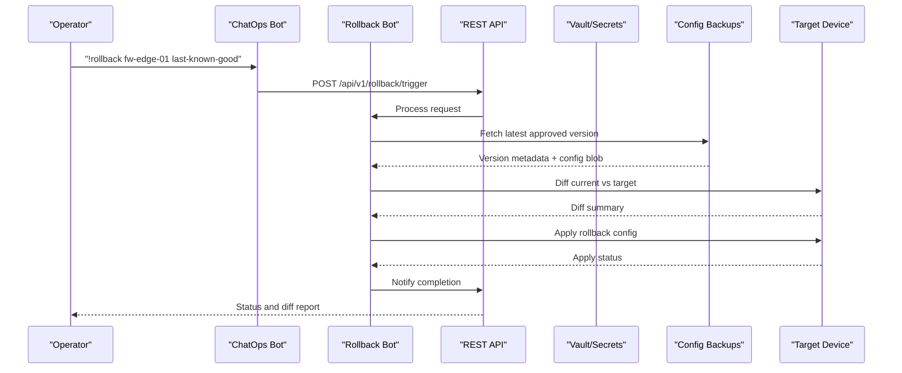
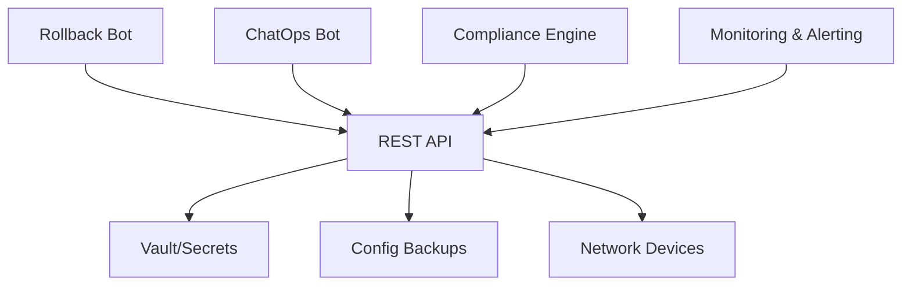

# Rollback Bot

<cite>
**Referenced Files in This Document**
- [README.md](file://README.md)
</cite>

## Table of Contents
1. [Introduction](#introduction)
2. [Project Structure](#project-structure)
3. [Core Components](#core-components)
4. [Architecture Overview](#architecture-overview)
5. [Detailed Component Analysis](#detailed-component-analysis)
6. [Dependency Analysis](#dependency-analysis)
7. [Performance Considerations](#performance-considerations)
8. [Troubleshooting Guide](#troubleshooting-guide)
9. [Conclusion](#conclusion)
10. [Appendices](#appendices)

## Introduction
This document describes the Rollback Bot functionality within the Enterprise Network Automation Platform. It focuses on configuration recovery via REST APIs, rollback strategies, version selection criteria, impact assessment, automated triggers based on health checks and compliance violations, and ChatOps commands for operational use. The content synthesizes platform capabilities documented in the repository to provide a practical guide for emergency rollbacks and automated recovery workflows.

## Project Structure
The platform organizes automation bots under a dedicated directory and exposes REST endpoints for self-service operations. The Rollback Bot is listed among the automation bots and integrates with Slack/Teams for ChatOps.

**Diagram sources**
- [README.md:141-151](file://README.md#L141-L151)
- [README.md:460-476](file://README.md#L460-L476)

**Section sources**
- [README.md:141-151](file://README.md#L141-L151)
- [README.md:460-476](file://README.md#L460-L476)

## Core Components
- Rollback Bot: Provides one-click rollback to last known good configuration and supports ChatOps integrations.
- ChatOps Bot: Unified command router for bot operations across Slack/Teams.
- Secrets Management: Integrates with HashiCorp Vault or other secrets backends; no secrets are committed to Git.
- Backup System: Manages device configuration backups with versioning and encryption.
- Compliance Engine: Enforces policies and can trigger automated remediation including rollback.

Key responsibilities:
- Expose REST endpoints for manual rollback operations.
- Integrate with backup storage to fetch target versions.
- Perform diffs between current and target configurations.
- Apply rollback configurations safely with verification.
- Support ChatOps commands for quick operational actions.

**Section sources**
- [README.md:460-476](file://README.md#L460-L476)
- [README.md:339-368](file://README.md#L339-L368)
- [README.md:438-456](file://README.md#L438-L456)

## Architecture Overview
The Rollback Bot participates in the broader automation pipeline and interacts with devices, backups, and observability systems.

**Diagram sources**
- [README.md:460-476](file://README.md#L460-L476)
- [README.md:339-368](file://README.md#L339-L368)
- [README.md:642-670](file://README.md#L642-L670)

## Detailed Component Analysis

### REST API Endpoints
The Rollback Bot exposes endpoints for configuration recovery. Based on the platform’s API design and bot catalog, the following endpoints are defined:

- POST /api/v1/rollback/trigger
  - Purpose: Manual rollback trigger for a specified device and target version.
  - Typical request body fields: device identifier, target version (e.g., “last-known-good” or explicit version), strategy (full config, partial changes, golden baseline).
  - Response: Job ID, status, and initial diff summary.

- GET /api/v1/rollback/{device}/versions
  - Purpose: List available configuration versions for a device.
  - Query parameters: environment filter, date range, tags.
  - Response: Array of versions with metadata (timestamp, author, change type, compliance status).

- GET /api/v1/rollback/{device}/diff
  - Purpose: Show differences between current running configuration and a selected target version.
  - Query parameters: target_version.
  - Response: Structured diff summary highlighting added, removed, and modified sections.

- POST /api/v1/rollback/{device}/apply
  - Purpose: Apply the selected rollback configuration to the device.
  - Request body fields: target_version, strategy, pre/post checks flags.
  - Response: Execution status, post-check results, and notification details.

Notes:
- All endpoints integrate with secrets management for secure access to device credentials and backup artifacts.
- Responses include audit information for compliance and traceability.

**Section sources**
- [README.md:460-476](file://README.md#L460-L476)
- [README.md:339-368](file://README.md#L339-L368)

### Rollback Strategies
- Full Config Rollback
  - Replaces the entire running configuration with the target version.
  - Use cases: Emergency restoration after widespread misconfiguration or failed deployment.
  - Impact: High; may disrupt services during application; requires careful scheduling and verification.

- Partial Changes Rollback
  - Applies only the differences between current and target configurations.
  - Use cases: Narrow scope fixes where only specific sections changed.
  - Impact: Moderate; reduces risk by limiting changes; still requires validation.

- Golden Baseline Rollback
  - Restores a standardized baseline configuration stored in Git and validated by compliance checks.
  - Use cases: Drift remediation and standardization enforcement.
  - Impact: Controlled; ensures compliance and consistency across devices.

Selection criteria:
- Severity of incident and scope of deviation.
- Availability of a verified target version.
- Compliance requirements and policy constraints.
- Operational window and maintenance schedule.

**Section sources**
- [README.md:438-456](file://README.md#L438-L456)
- [README.md:548-579](file://README.md#L548-L579)

### Version Selection Criteria
- Last Known Good
  - Automatically selects the most recent version that passed all validations and compliance checks.
- Explicit Version
  - Operator specifies a particular version from the available list.
- Date-Based
  - Selects the latest version before a given timestamp.
- Tag-Based
  - Filters versions by labels such as “approved”, “emergency”, or “baseline”.

Metadata considerations:
- Timestamp and authorship for traceability.
- Change type (feature, fix, emergency).
- Compliance status and test results.

**Section sources**
- [README.md:438-456](file://README.md#L438-L456)
- [README.md:548-579](file://README.md#L548-L579)

### Impact Assessment
- Service Disruption Risk
  - Evaluate potential downtime during configuration application.
- Dependency Mapping
  - Identify downstream dependencies (routing protocols, ACLs, NAT rules).
- Rollback Window
  - Schedule during low-traffic periods when possible.
- Verification Steps
  - Post-apply health checks, connectivity tests, and compliance re-validation.

Operational guidance:
- Always perform a dry-run or diff review before applying.
- Use partial changes when feasible to minimize impact.
- Maintain clear communication channels and escalation paths.

[No sources needed since this section provides general guidance]

### Automated Rollback Triggers
Automated triggers can initiate rollbacks based on:
- Health Checks
  - Device metrics (CPU, memory, interface errors) exceeding thresholds.
  - Connectivity failures or protocol session drops.
- Compliance Violations
  - Policy deviations detected by the compliance engine (e.g., unauthorized changes, missing NTP/AAA).
- CI/CD Pipeline Failures
  - Post-deploy verification failures automatically revert to the last known good state.

Workflow integration:
- Observability systems (Prometheus, Alertmanager) alert the Rollback Bot.
- Compliance scans flag violations and trigger remediation.
- Pipelines enforce automatic rollback upon failure.

**Section sources**
- [README.md:583-604](file://README.md#L583-L604)
- [README.md:619-638](file://README.md#L619-L638)
- [README.md:642-670](file://README.md#L642-L670)

### ChatOps Commands
Unified commands enable rapid operational actions through Slack/Teams:

- !rollback fw-edge-01 last-known-good
  - Initiates a full rollback for firewall fw-edge-01 using the last known good configuration.
- !rollback diff core-rtr-01 v1.2 v1.3
  - Shows a diff between versions v1.2 and v1.3 for router core-rtr-01.

Additional examples:
- !rollback apply fw-edge-01 v1.4 strategy=partial
- !rollback versions switch-dc1-02
- !rollback trigger rtr-core-01 target=golden-baseline

Integration notes:
- Commands route through the ChatOps Bot to the Rollback Bot.
- Responses include job status, diff summaries, and next steps.

**Section sources**
- [README.md:460-476](file://README.md#L460-L476)

### Practical Examples

#### Emergency Rollback Scenario
- Incident: A critical ACL misconfiguration causes service outages.
- Actions:
  - Operator uses ChatOps: !rollback fw-edge-01 last-known-good
  - Rollback Bot fetches the last approved version, performs diff, applies partial changes, verifies connectivity, and notifies the team.

#### Automated Recovery Workflow
- Trigger: Compliance scan detects unauthorized SNMPv1 usage.
- Actions:
  - Compliance engine flags violation and requests remediation.
  - Rollback Bot applies golden baseline to restore compliant settings.
  - Post-apply verification confirms compliance and updates dashboards.

[No sources needed since this section provides general guidance]

## Dependency Analysis
The Rollback Bot depends on several subsystems:

**Diagram sources**
- [README.md:460-476](file://README.md#L460-L476)
- [README.md:339-368](file://README.md#L339-L368)
- [README.md:583-604](file://README.md#L583-L604)

**Section sources**
- [README.md:460-476](file://README.md#L460-L476)
- [README.md:339-368](file://README.md#L339-L368)
- [README.md:583-604](file://README.md#L583-L604)

## Performance Considerations
- Concurrency
  - Parallelize diff calculations and apply operations across device groups when safe.
- Caching
  - Cache version metadata and diff results to reduce latency for repeated queries.
- Rate Limiting
  - Implement throttling to avoid overwhelming device management interfaces.
- Batch Operations
  - Group rollbacks by region or role to optimize resource usage and minimize blast radius.
- Observability
  - Track endpoint latency, error rates, and throughput for capacity planning.

[No sources needed since this section provides general guidance]

## Troubleshooting Guide
Common issues and resolutions:
- Connection timeouts to devices
  - Verify SSH reachability and credentials; check network policies.
- Template rendering errors
  - Validate Jinja2 syntax and structured data inputs.
- Compliance check failures
  - Review compliance policies and device running config diffs.
- CI pipeline failures
  - Inspect GitHub Actions logs; address actionable error messages.
- Vault authentication failures
  - Confirm OIDC token or AppRole credentials; verify Vault policies.
- Molecule test failures
  - Ensure Docker/Podman is running; validate molecule configuration.
- Batfish analysis errors
  - Validate snapshots and model definitions.

**Section sources**
- [README.md:674-685](file://README.md#L674-L685)

## Conclusion
The Rollback Bot provides a robust mechanism for configuration recovery through REST APIs and ChatOps, integrating seamlessly with backups, secrets management, compliance, and observability. By supporting multiple rollback strategies, version selection criteria, and automated triggers, it enables both emergency interventions and routine drift remediation while maintaining security and compliance standards.

[No sources needed since this section summarizes without analyzing specific files]

## Appendices

### API Reference Summary
- POST /api/v1/rollback/trigger
  - Manual rollback initiation with strategy and target version.
- GET /api/v1/rollback/{device}/versions
  - Retrieve available versions with metadata.
- GET /api/v1/rollback/{device}/diff
  - Compare current and target configurations.
- POST /api/v1/rollback/{device}/apply
  - Apply rollback configuration and verify outcomes.

**Section sources**
- [README.md:460-476](file://README.md#L460-L476)