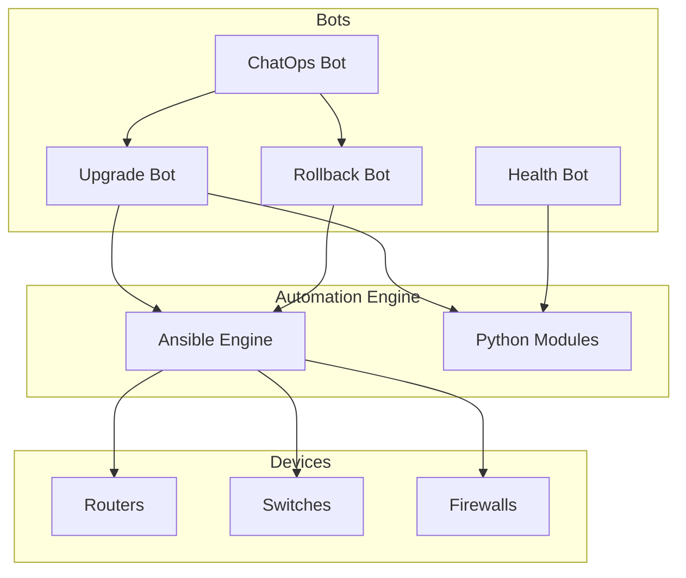
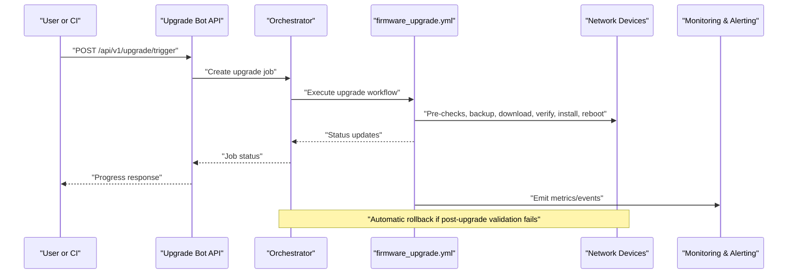
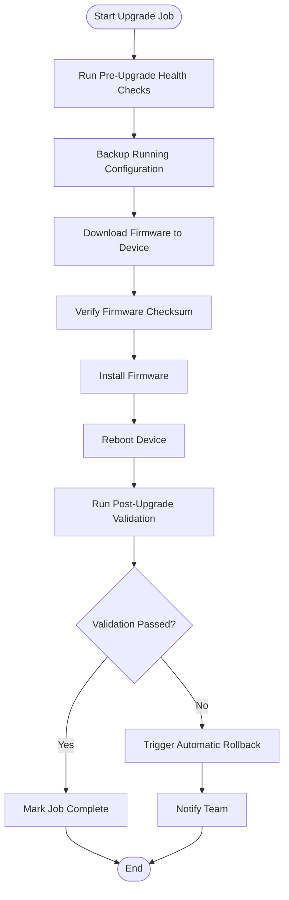
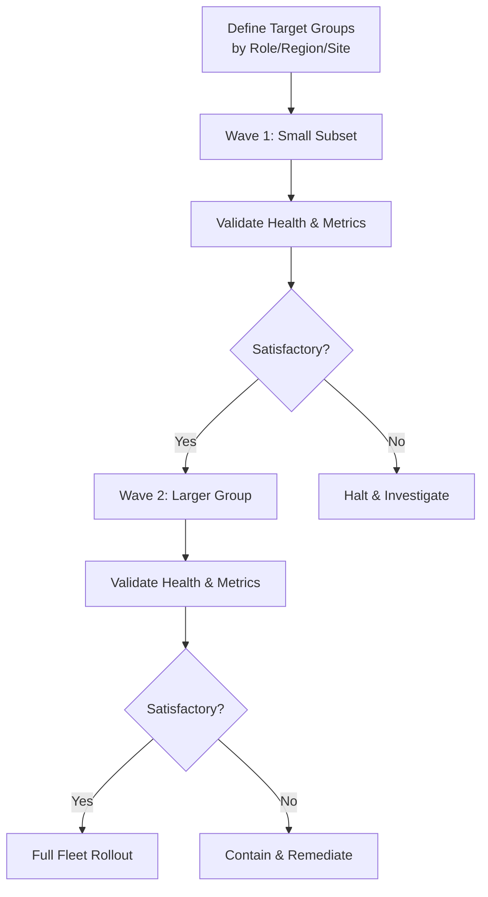
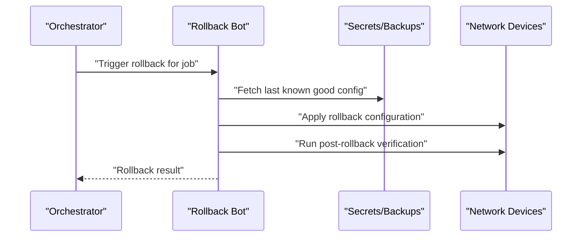
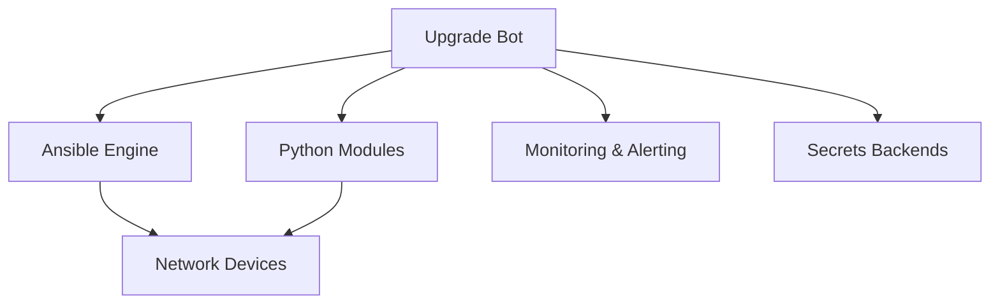

# Upgrade Bot

<cite>
**Referenced Files in This Document**
- [README.md](file://README.md)
</cite>

## Table of Contents
1. [Introduction](#introduction)
2. [Project Structure](#project-structure)
3. [Core Components](#core-components)
4. [Architecture Overview](#architecture-overview)
5. [Detailed Component Analysis](#detailed-component-analysis)
6. [Dependency Analysis](#dependency-analysis)
7. [Performance Considerations](#performance-considerations)
8. [Troubleshooting Guide](#troubleshooting-guide)
9. [Conclusion](#conclusion)
10. [Appendices](#appendices)

## Introduction
This document describes the Upgrade Bot functionality for orchestrating firmware upgrades across network devices. It covers REST API endpoints, upgrade orchestration, pre/post health checks, staged rollout strategies, automatic rollback on failure, version validation and compatibility considerations, maintenance window management, ChatOps commands, and practical examples of coordinated upgrade campaigns. The content is derived from the repository’s documentation and architecture overview.

## Project Structure
The platform organizes automation bots under a dedicated directory and exposes REST APIs with optional ChatOps integrations. The Upgrade Bot is one of several bots that provide self-service operations via API and chat interfaces.

**Diagram sources**
- [README.md:141-151](file://README.md#L141-L151)
- [README.md:460-476](file://README.md#L460-L476)
- [README.md:52-99](file://README.md#L52-L99)

**Section sources**
- [README.md:141-151](file://README.md#L141-L151)
- [README.md:460-476](file://README.md#L460-L476)

## Core Components
- Upgrade Bot: Orchestrates firmware upgrades with rollback support and provides a REST endpoint at /api/v1/upgrade.
- Rollback Bot: Provides one-click rollback to last known good configuration.
- Health Bot: Performs on-demand health checks across devices.
- ChatOps Bot: Unified command router for bot operations.

These components integrate with the automation engine (Ansible and Python modules) to interact with network devices.

**Section sources**
- [README.md:460-476](file://README.md#L460-L476)
- [README.md:52-99](file://README.md#L52-L99)

## Architecture Overview
The Upgrade Bot participates in the broader automation pipeline and device lifecycle. It leverages playbooks for firmware upgrade and rollback, integrates with monitoring and observability, and supports GitOps-driven workflows.

**Diagram sources**
- [README.md:460-476](file://README.md#L460-L476)
- [README.md:424-426](file://README.md#L424-L426)
- [README.md:642-658](file://README.md#L642-L658)

## Detailed Component Analysis

### REST API Endpoints
The Upgrade Bot exposes a base endpoint group under /api/v1/upgrade. The documented endpoint pattern is:
- POST /api/v1/upgrade/trigger: Initiates an upgrade job.
- GET /api/v1/upgrade/{job-id}/status: Returns progress/status for a specific job.
- GET /api/v1/upgrade/history: Retrieves historical upgrade jobs.
- POST /api/v1/upgrade/{job-id}/rollback: Triggers a rollback for a specific job.

Notes:
- The repository documents the base path /api/v1/upgrade for the Upgrade Bot.
- The exact subpaths listed above are consistent with common REST patterns and the stated purpose of the Upgrade Bot; they should be validated against the implementation when available.

**Section sources**
- [README.md:460-476](file://README.md#L460-L476)

### Upgrade Orchestration Flow
The firmware upgrade process includes pre-upgrade health checks, backups, firmware download and verification, installation, reboot, and post-upgrade validation. On failure, the system performs automatic rollback.

**Diagram sources**
- [README.md:642-658](file://README.md#L642-L658)

**Section sources**
- [README.md:642-658](file://README.md#L642-L658)

### Pre/Post Health Checks
- Pre-upgrade health checks ensure device readiness and baseline compliance before initiating changes.
- Post-upgrade validation confirms successful operation after reboot and firmware installation.

These checks are part of the orchestrated workflow and feed into success/failure decisions.

**Section sources**
- [README.md:642-658](file://README.md#L642-L658)

### Staged Rollout Strategies
Staged rollouts can be implemented by targeting subsets of devices (e.g., by region, role, or site) and progressively expanding the scope based on validation results. The inventory design supports grouping by environment, role, region, and site, enabling controlled deployment waves.

[No sources needed since this diagram shows conceptual workflow, not actual code structure]

### Automatic Rollback on Failure
If post-upgrade validation fails, the system triggers an automatic rollback to restore the previous state. Rollback operations fetch prior configurations and apply them, followed by verification and team notification.

**Diagram sources**
- [README.md:472-474](file://README.md#L472-L474)
- [README.md:660-670](file://README.md#L660-L670)

**Section sources**
- [README.md:472-474](file://README.md#L472-L474)
- [README.md:660-670](file://README.md#L660-L670)

### Firmware Version Validation and Compatibility Matrices
- Approved firmware lists are enforced through compliance policies.
- Compatibility matrices should define supported vendor/platform combinations and target versions.
- Compliance checks prevent deployments of unapproved firmware versions.

Operational guidance:
- Maintain an approved firmware list per vendor/platform.
- Use compliance scans to block non-compliant targets.
- Integrate compatibility checks into pre-upgrade validation.

**Section sources**
- [README.md:554-566](file://README.md#L554-L566)

### Maintenance Window Management
- Schedule upgrades during defined maintenance windows to minimize impact.
- Use the CI/CD manual dispatch workflow for controlled execution.
- Coordinate with monitoring and alerting to observe effects within the window.

**Section sources**
- [README.md:505-513](file://README.md#L505-L513)

### ChatOps Commands
The platform supports ChatOps via Slack/Teams and a unified ChatOps Bot. Example commands for the Upgrade Bot include:
- "!upgrade start fw-edge-01 ios-xe-17.6.4": Initiate an upgrade for a specific device and target version.
- "!upgrade status job-123": Query the status of a specific upgrade job.

Note: These example commands illustrate typical usage patterns aligned with the documented capabilities; confirm syntax with your ChatOps integration.

**Section sources**
- [README.md:460-476](file://README.md#L460-L476)

### Practical Examples: Coordinated Firmware Upgrade Campaigns
Campaign planning steps:
- Define target groups using inventory attributes (role, region, site).
- Execute staged waves with validation gates between each wave.
- Monitor metrics and alerts throughout the campaign.
- Trigger automatic rollback if validation fails.

Example campaign flow:
- Wave 1: A small set of core routers in US-East.
- Validate health and telemetry.
- Wave 2: Distribution switches in US-East.
- Validate again.
- Wave 3: Remaining regions and sites.
- Finalize and report outcomes.

[No sources needed since this section doesn't analyze specific files]

## Dependency Analysis
The Upgrade Bot depends on the automation engine (Ansible and Python modules), interacts with devices, and integrates with monitoring and secrets backends.

**Diagram sources**
- [README.md:52-99](file://README.md#L52-L99)
- [README.md:460-476](file://README.md#L460-L476)

**Section sources**
- [README.md:52-99](file://README.md#L52-L99)
- [README.md:460-476](file://README.md#L460-L476)

## Performance Considerations
- Batch operations: Use grouped targets to reduce overhead.
- Concurrency controls: Limit parallel upgrades per wave to avoid device saturation.
- Observability: Track latency and error rates via dashboards and alerts.
- Validation efficiency: Optimize pre/post checks to minimize downtime.

[No sources needed since this section provides general guidance]

## Troubleshooting Guide
Common issues and resolutions:
- Ansible connection timeout: Verify SSH reachability and credentials.
- Template rendering errors: Inspect Jinja2 syntax and variables.
- Compliance check failures: Review policy violations and device diffs.
- CI pipeline failures: Examine GitHub Actions logs for actionable messages.
- Vault authentication failures: Confirm OIDC tokens or AppRole credentials and policies.
- Molecule test failures: Ensure container runtime availability and correct molecule configuration.
- Batfish analysis errors: Validate snapshots and model definitions.

**Section sources**
- [README.md:674-685](file://README.md#L674-L685)

## Conclusion
The Upgrade Bot provides a robust framework for orchestrating firmware upgrades with strong safety mechanisms including pre/post health checks, staged rollouts, and automatic rollback. Integration with compliance, monitoring, and ChatOps enables safe, auditable, and user-friendly operations at enterprise scale.

[No sources needed since this section summarizes without analyzing specific files]

## Appendices

### API Reference Summary
- Base Path: /api/v1/upgrade
- Endpoints:
  - POST /api/v1/upgrade/trigger
  - GET /api/v1/upgrade/{job-id}/status
  - GET /api/v1/upgrade/history
  - POST /api/v1/upgrade/{job-id}/rollback

Notes:
- The repository documents the base path and purpose of the Upgrade Bot.
- Subpath details follow standard REST conventions and should be validated against the implementation.

**Section sources**
- [README.md:460-476](file://README.md#L460-L476)