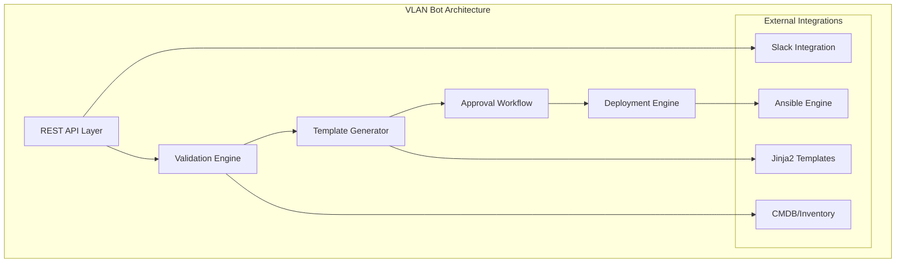
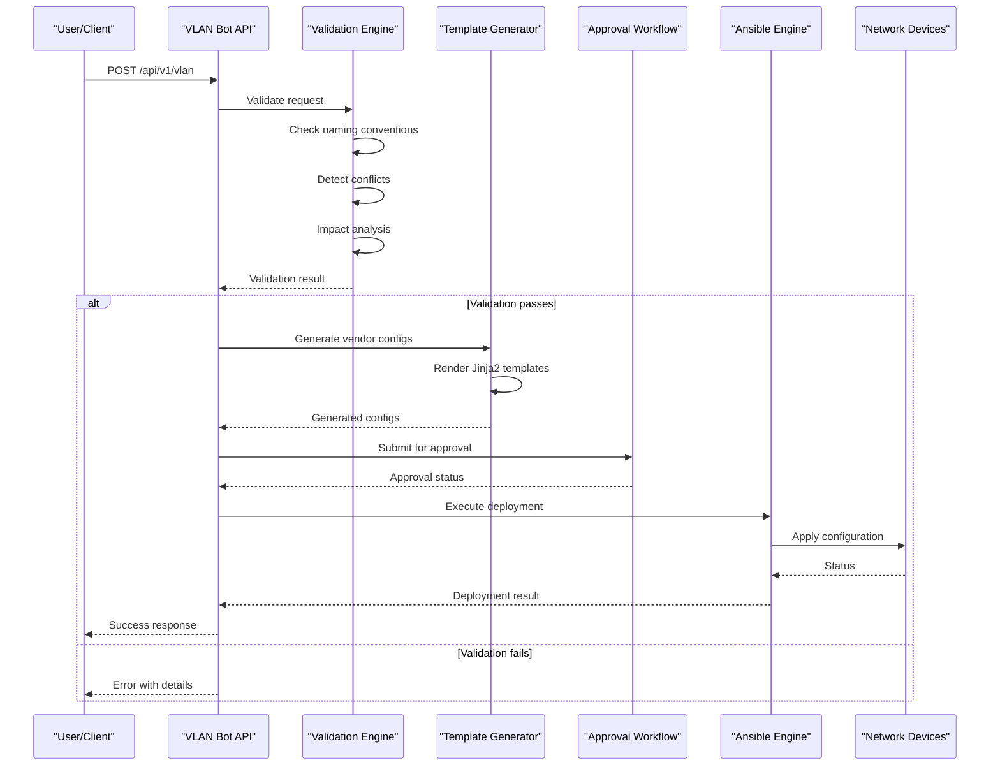
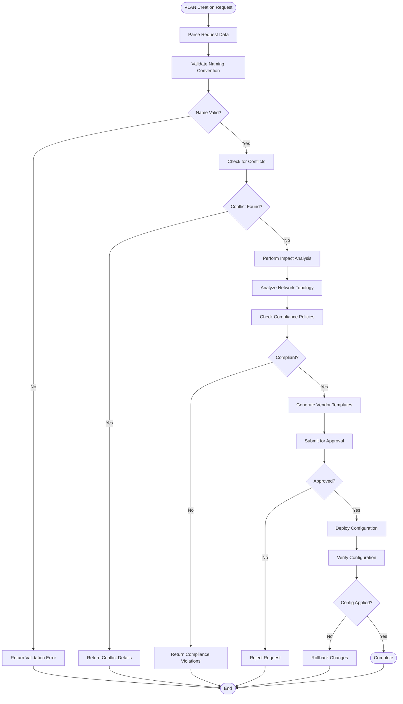
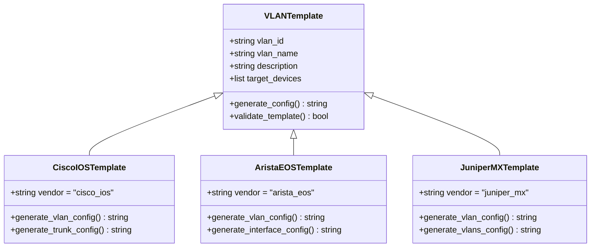
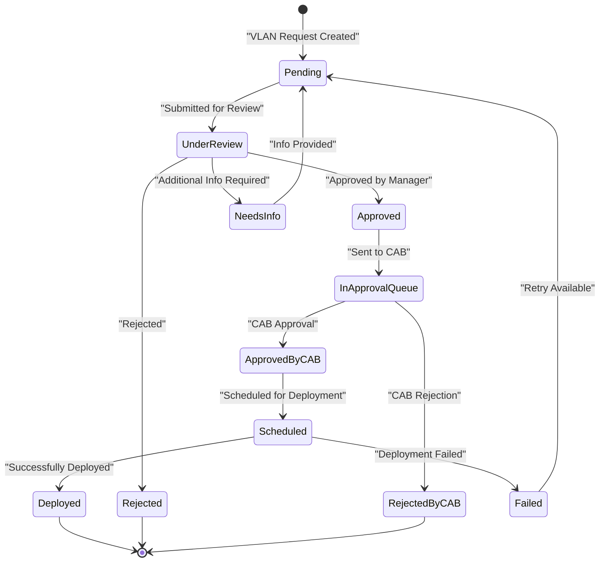
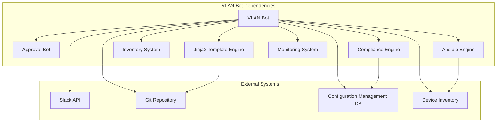

# VLAN Bot

<cite>
**Referenced Files in This Document**
- [README.md](file://README.md)
</cite>

## Table of Contents
1. [Introduction](#introduction)
2. [Project Structure](#project-structure)
3. [Core Components](#core-components)
4. [Architecture Overview](#architecture-overview)
5. [Detailed Component Analysis](#detailed-component-analysis)
6. [Dependency Analysis](#dependency-analysis)
7. [Performance Considerations](#performance-considerations)
8. [Troubleshooting Guide](#troubleshooting-guide)
9. [Conclusion](#conclusion)

## Introduction

The VLAN Bot is a core component of the Enterprise Network Automation Platform, providing automated VLAN provisioning capabilities through REST APIs and ChatOps integration. It enables self-service network operations for VLAN management across multi-vendor environments while maintaining compliance and governance through an integrated approval workflow.

The VLAN Bot serves as the primary interface for requesting, validating, and deploying VLAN configurations across the enterprise network infrastructure. It integrates with the broader GitOps pipeline to ensure all changes follow established processes and security policies.

## Project Structure

The VLAN Bot is part of the broader automation bots architecture within the network automation platform. The system follows a modular design where each bot handles specific network automation tasks.

**Diagram sources**
- [README.md:142-151](file://README.md#L142-L151)
- [README.md:460-476](file://README.md#L460-L476)

**Section sources**
- [README.md:142-151](file://README.md#L142-L151)
- [README.md:460-476](file://README.md#L460-L476)

## Core Components

The VLAN Bot consists of several key components that work together to provide comprehensive VLAN management capabilities:

### REST API Endpoints

The VLAN Bot exposes a comprehensive REST API for programmatic VLAN management:

| Endpoint | Method | Purpose | Description |
|----------|--------|---------|-------------|
| `/api/v1/vlan` | POST | Create VLAN | Provision new VLAN with validation and approval workflow |
| `/api/v1/vlan/{id}` | GET | Retrieve VLAN | Get details of existing VLAN by ID |
| `/api/v1/vlan/{id}` | PUT | Update VLAN | Modify existing VLAN configuration |
| `/api/v1/vlan/{id}` | DELETE | Remove VLAN | Delete VLAN with impact analysis |

### ChatOps Commands

The VLAN Bot supports natural language commands through Slack integration:

| Command | Description | Example |
|---------|-------------|---------|
| `!vlan create` | Create new VLAN | `!vlan create 100 name=Engineering` |
| `!vlan list` | List all VLANs | `!vlan list` |
| `!vlan get` | Get VLAN details | `!vlan get 100` |
| `!vlan delete` | Delete VLAN | `!vlan delete 100` |
| `!vlan update` | Update VLAN | `!vlan update 100 name=Finance` |

### Multi-Vendor Template Generation

The system generates vendor-specific configurations using Jinja2 templates for supported vendors including Cisco IOS, NX-OS, Arista EOS, Juniper MX/SRX, Palo Alto, Fortinet, and others.

**Section sources**
- [README.md:460-476](file://README.md#L460-L476)
- [README.md:116-128](file://README.md#L116-L128)

## Architecture Overview

The VLAN Bot architecture follows a layered approach with clear separation of concerns and robust error handling.

**Diagram sources**
- [README.md:460-476](file://README.md#L460-L476)
- [README.md:371-435](file://README.md#L371-L435)

## Detailed Component Analysis

### VLAN Creation Workflow

The VLAN creation process involves multiple validation steps and approval gates to ensure network integrity and compliance.

**Diagram sources**
- [README.md:460-476](file://README.md#L460-L476)
- [README.md:548-579](file://README.md#L548-L579)

### VLAN Naming Conventions and Numbering Schemes

The VLAN Bot enforces standardized naming conventions and numbering schemes to maintain consistency across the enterprise network:

#### Naming Convention Rules
- **Format**: `{department}-{purpose}-{location}`
- **Examples**: `engineering-dev-dc1`, `finance-prod-dc2`, `hr-staging-eu-west`
- **Length**: Maximum 64 characters
- **Characters**: Alphanumeric, hyphens, and underscores only
- **Case**: Lowercase preferred

#### VLAN Numbering Scheme
- **Development**: 100-199
- **Staging**: 200-299  
- **Production**: 300-399
- **Management**: 400-499
- **Guest**: 500-599
- **Voice**: 600-699
- **IoT**: 700-799
- **DMZ**: 800-899
- **Reserved**: 900-999

#### Multi-Vendor Template Generation

The system generates vendor-specific configurations using Jinja2 templates located in the `templates/` directory structure:

**Diagram sources**
- [README.md:116-128](file://README.md#L116-L128)
- [README.md:450-456](file://README.md#L450-L456)

### Approval Workflow Integration

The VLAN Bot integrates with the centralized approval system to enforce change management policies:

**Diagram sources**
- [README.md:475-476](file://README.md#L475-L476)
- [README.md:619-638](file://README.md#L619-L638)

### Conflict Detection and Impact Analysis

The VLAN Bot performs comprehensive conflict detection and impact analysis before approving any VLAN changes:

#### Conflict Detection
- **VLAN ID Conflicts**: Checks for duplicate VLAN IDs across environments
- **Naming Conflicts**: Validates against existing VLAN names
- **Resource Conflicts**: Ensures sufficient VLAN resources available
- **Policy Conflicts**: Verifies compliance with organizational policies

#### Impact Analysis
- **Device Affected**: Identifies all devices requiring configuration updates
- **Service Impact**: Analyzes potential service disruptions
- **Network Segmentation**: Evaluates impact on network segmentation
- **Security Implications**: Assesses security policy impacts

**Section sources**
- [README.md:460-476](file://README.md#L460-L476)
- [README.md:548-579](file://README.md#L548-L579)

## Dependency Analysis

The VLAN Bot has well-defined dependencies on other system components:

**Diagram sources**
- [README.md:460-476](file://README.md#L460-L476)
- [README.md:103-179](file://README.md#L103-L179)

**Section sources**
- [README.md:460-476](file://README.md#L460-L476)
- [README.md:103-179](file://README.md#L103-L179)

## Performance Considerations

The VLAN Bot is designed for high availability and performance in enterprise environments:

### Scalability Features
- **Horizontal Scaling**: Multiple bot instances behind load balancer
- **Asynchronous Processing**: Queue-based job processing for large deployments
- **Connection Pooling**: Efficient device connectivity management
- **Caching**: Frequently accessed data cached to reduce latency

### Optimization Strategies
- **Batch Operations**: Group related VLAN changes for efficient deployment
- **Parallel Processing**: Concurrent template generation and validation
- **Incremental Updates**: Only affected devices receive configuration changes
- **Timeout Handling**: Configurable timeouts for long-running operations

### Monitoring and Observability
- **Metrics Collection**: Request/response times, success rates, error counts
- **Health Checks**: Endpoint health monitoring and circuit breakers
- **Audit Logging**: Complete audit trail for all VLAN operations
- **Alerting**: Real-time alerts for failed operations or policy violations

## Troubleshooting Guide

Common issues and their resolutions when working with the VLAN Bot:

### API Issues
- **Authentication Failures**: Verify API token permissions and expiration
- **Rate Limiting**: Check rate limit headers and implement backoff strategies
- **Timeout Errors**: Increase timeout values for large VLAN deployments
- **Schema Validation**: Ensure request payload matches expected schema

### Deployment Issues
- **Device Connectivity**: Verify SSH/NETCONF connectivity to target devices
- **Template Rendering**: Check Jinja2 template syntax and variable definitions
- **Permission Errors**: Confirm Ansible user has sufficient privileges
- **Configuration Conflicts**: Review device running configuration for conflicts

### Approval Workflow Issues
- **Approval Delays**: Monitor approval queue and escalate if necessary
- **Policy Violations**: Review compliance check results and remediate issues
- **Notification Failures**: Verify Slack/Teams integration configuration
- **Workflow State**: Check approval workflow state and history

### ChatOps Issues
- **Command Parsing**: Verify command syntax and parameter format
- **Channel Permissions**: Ensure bot has proper channel access
- **Response Formatting**: Check message formatting and truncation limits
- **Integration Health**: Monitor Slack/Teams API connectivity

**Section sources**
- [README.md:674-685](file://README.md#L674-L685)

## Conclusion

The VLAN Bot provides a comprehensive solution for automated VLAN management in enterprise network environments. By combining REST APIs, ChatOps integration, multi-vendor template generation, and robust approval workflows, it enables efficient and compliant VLAN provisioning across diverse network infrastructures.

The system's modular architecture ensures scalability and maintainability, while its integration with the broader GitOps pipeline guarantees consistent processes and security policies. The comprehensive validation, conflict detection, and impact analysis features help maintain network stability and prevent configuration errors.

For optimal results, organizations should establish clear VLAN naming conventions, implement appropriate approval workflows, and regularly monitor bot performance and usage patterns. The extensive troubleshooting guide and monitoring capabilities ensure operational reliability and quick resolution of any issues that may arise.