# Automation Engine

<cite>
**Referenced Files in This Document**
- [README.md](file://README.md)
</cite>

## Table of Contents
1. [Introduction](#introduction)
2. [Project Structure](#project-structure)
3. [Core Components](#core-components)
4. [Architecture Overview](#architecture-overview)
5. [Detailed Component Analysis](#detailed-component-analysis)
6. [Dependency Analysis](#dependency-analysis)
7. [Performance Considerations](#performance-considerations)
8. [Troubleshooting Guide](#troubleshooting-guide)
9. [Conclusion](#conclusion)
10. [Appendices](#appendices)

## Introduction
This document describes the automation engine component of the Enterprise Network Automation Platform. It focuses on:
- Ansible integration architecture with custom modules and role-based patterns
- Python module architecture under python/ including inventory parsing, NETCONF/RESTCONF clients, SSH abstraction layer, and protocol handlers
- Bot architecture providing REST APIs and ChatOps integrations for self-service operations
- Playbook catalog covering device lifecycle management, network services automation, routing protocols, and operational tasks
- Implementation details for connection pooling, retry logic, error handling, and parallel execution strategies
- Concrete examples showing how playbooks interact with Python modules and bots to automate complex workflows

The content is derived from the repository’s documentation and structure definitions.

**Section sources**
- [README.md:1-31](file://README.md#L1-L31)

## Project Structure
The repository organizes automation assets into clear layers: inventories, variables, playbooks, roles, templates, collections, Python modules, bots, tests, compliance, CI/CD pipelines, monitoring, Terraform, policies, schemas, examples, scripts, docs, images, and GitHub Actions workflows. The automation engine spans the Control Plane (Ansible, Python, Bots, Terraform), Data Plane (network devices and cloud networking), Observability, and Security backends.

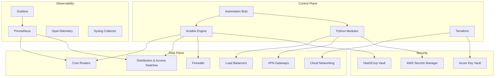

**Diagram sources**
- [README.md:52-99](file://README.md#L52-L99)

**Section sources**
- [README.md:103-180](file://README.md#L103-L180)
- [README.md:52-99](file://README.md#L52-L99)

## Core Components
- Ansible Engine: Orchestrates device configuration and operational tasks using playbooks and roles; integrates with secrets backends.
- Python Modules: Provide reusable capabilities for inventory parsing, protocol clients (NETCONF, RESTCONF, SSH, SNMP), telemetry, config generation, validation, backup, compliance, and utilities.
- Automation Bots: Expose REST endpoints and optional ChatOps interfaces to enable self-service operations such as firewall rule requests, VLAN provisioning, port management, backups, health checks, compliance scans, upgrades, rollbacks, approvals, and a unified ChatOps router.
- Terraform: Manages cloud networking resources across AWS, Azure, and GCP.

These components collaborate to deliver a Git-driven, compliant, and observable automation platform.

**Section sources**
- [README.md:52-99](file://README.md#L52-L99)
- [README.md:438-459](file://README.md#L438-L459)
- [README.md:460-477](file://README.md#L460-L477)

## Architecture Overview
The automation engine follows a layered architecture:
- Control Plane: Ansible executes playbooks and roles; Python modules implement protocol-specific logic; Bots provide API/ChatOps entry points; Terraform provisions cloud networking.
- Data Plane: Multi-vendor devices and cloud networking endpoints are managed via supported protocols.
- Observability: Metrics and logs flow into Prometheus/Grafana/OpenTelemetry/Syslog for dashboards and alerting.
- Security: Centralized secrets management via HashiCorp Vault, AWS Secrets Manager, Azure Key Vault, and environment variables.

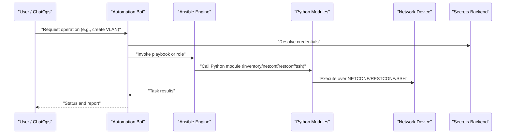

**Diagram sources**
- [README.md:52-99](file://README.md#L52-L99)
- [README.md:438-459](file://README.md#L438-L459)
- [README.md:460-477](file://README.md#L460-L477)

## Detailed Component Analysis

### Ansible Integration Architecture
- Role-Based Patterns: Roles encapsulate reusable logic for vendor/platform-specific configurations and operational tasks.
- Custom Modules: Python modules under python/ are invoked by Ansible to perform protocol-specific operations and advanced processing.
- Inventory Design: Devices are organized by environment, role, region, and vendor, enabling targeted execution and variable scoping.
- Secrets Integration: Ansible integrates with centralized secrets backends for secure credential resolution.

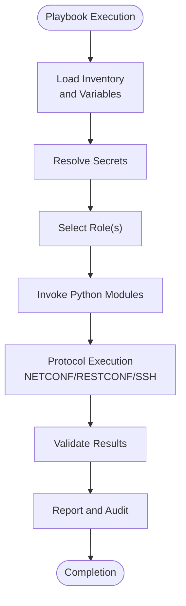

**Diagram sources**
- [README.md:103-180](file://README.md#L103-L180)
- [README.md:438-459](file://README.md#L438-L459)

**Section sources**
- [README.md:103-180](file://README.md#L103-L180)
- [README.md:438-459](file://README.md#L438-L459)

### Python Module Architecture (python/)
The Python modules provide typed, documented, and tested building blocks for automation:
- inventory/: Parsing, enrichment, and CMDB integration
- netconf/: NETCONF client with capability negotiation
- restconf/: RESTCONF client with YANG model support
- ssh/: SSH abstraction over Netmiko/Paramiko with retry
- snmp/: SNMPv3 polling and trap handling
- telemetry/: Model-driven telemetry receiver and parser
- config_gen/: Jinja2-based configuration generation from structured data
- validation/: Pre-deployment config validation (syntax + semantics)
- backup/: Backup management with versioning and encryption
- compliance/: Compliance engine with pluggable rule sets
- utils/: Logging, retry, concurrency, diff, bulk operations

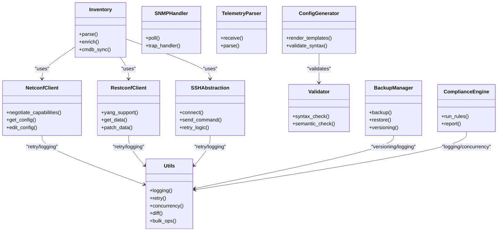

**Diagram sources**
- [README.md:438-459](file://README.md#L438-L459)

**Section sources**
- [README.md:438-459](file://README.md#L438-L459)

### Bot Architecture (REST APIs and ChatOps)
Bots expose REST endpoints and optional ChatOps integrations for self-service operations:
- Firewall Bot: Request, validate, and deploy firewall rules
- VLAN Bot: Provision VLANs with approval workflow
- Port Bot: Enable/disable/configure switch ports
- Backup Bot: Trigger and schedule device backups
- Health Bot: On-demand health checks across all devices
- Compliance Bot: Run compliance scans and report violations
- Upgrade Bot: Orchestrate firmware upgrades with rollback
- Rollback Bot: One-click rollback to last known good config
- ChatOps Bot: Unified command router for all bot operations
- Approval Bot: Manage approval workflows for change requests

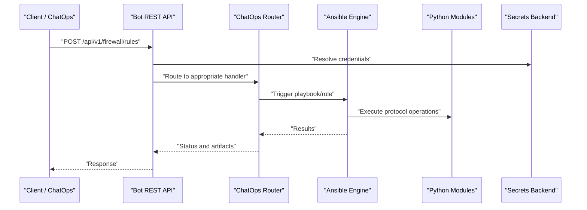

**Diagram sources**
- [README.md:460-477](file://README.md#L460-L477)
- [README.md:438-459](file://README.md#L438-L459)

**Section sources**
- [README.md:460-477](file://README.md#L460-L477)

### Playbook Catalogue
The platform provides a comprehensive set of playbooks categorized by domain:
- Device Lifecycle: initial_provisioning.yml, hostname.yml, aaa.yml, ntp.yml, dns.yml, snmp.yml, syslog.yml, ssh_hardening.yml, certificates.yml, banners.yml
- Network Services: vlan.yml, trunk.yml, lacp.yml, qos.yml, acl.yml, nat.yml, vpn.yml, firewall_rules.yml
- Routing Protocols: ospf.yml, bgp.yml, isis.yml, static_routes.yml, loopbacks.yml
- High Availability: vrrp.yml, hsrp.yml
- Operations: backup.yml, restore.yml, firmware_upgrade.yml, firmware_rollback.yml, config_rollback.yml, golden_config.yml, drift_detection.yml, compliance_scan.yml, health_check.yml, inventory_collection.yml, neighbor_discovery.yml, license_validation.yml, monitoring_agents.yml

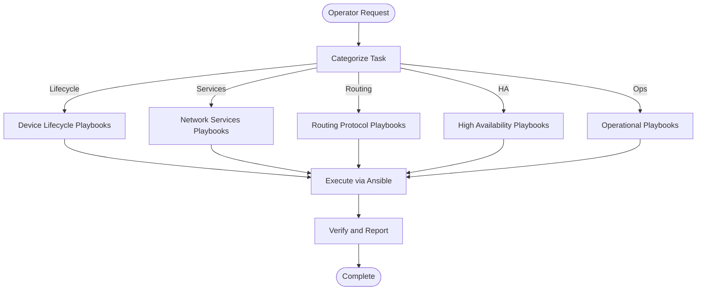

**Diagram sources**
- [README.md:371-437](file://README.md#L371-L437)

**Section sources**
- [README.md:371-437](file://README.md#L371-L437)

### Example Workflows: Playbooks, Python Modules, and Bots
- Firewall Rule Deployment: A user submits a request through the Firewall Bot API; the bot resolves secrets, triggers an Ansible playbook that invokes Python modules to apply rules via NETCONF/RESTCONF/SSH, then reports status.
- VLAN Provisioning: The VLAN Bot orchestrates an approval workflow, runs a VLAN playbook, uses Python modules to generate and validate configs, and applies changes across switches.
- Firmware Upgrade: The Upgrade Bot coordinates pre-checks, backups, download, verification, installation, reboot, and post-validation, leveraging Ansible roles and Python utilities for retries and concurrency.

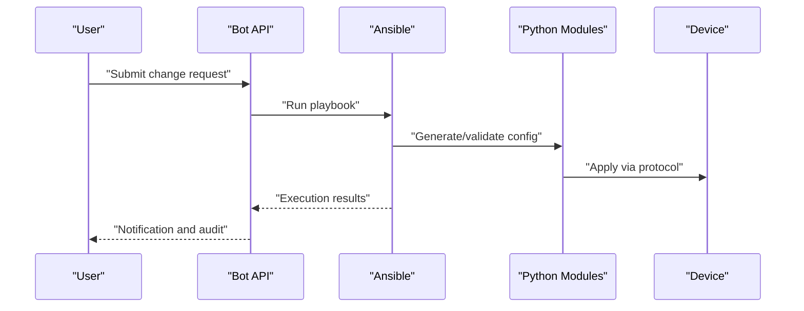

**Diagram sources**
- [README.md:460-477](file://README.md#L460-L477)
- [README.md:438-459](file://README.md#L438-L459)
- [README.md:371-437](file://README.md#L371-L437)

## Dependency Analysis
The automation engine exhibits clear separation of concerns:
- Ansible depends on Python modules for protocol-specific operations and advanced processing.
- Bots depend on Ansible and Python modules to execute operations and integrate with secrets backends.
- Python modules rely on shared utilities for logging, retry, concurrency, and diffing.
- Observability and security systems integrate at multiple layers for metrics, alerts, and secret management.

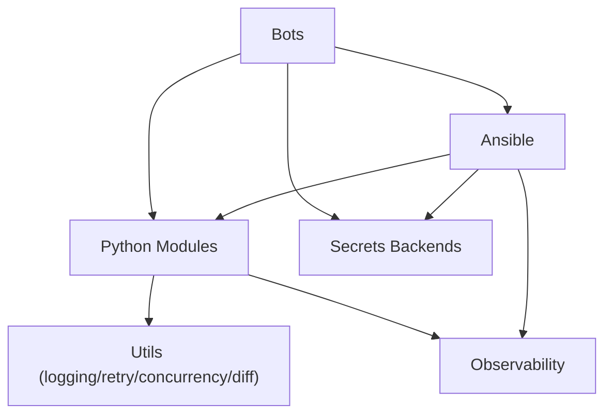

**Diagram sources**
- [README.md:52-99](file://README.md#L52-L99)
- [README.md:438-459](file://README.md#L438-L459)

**Section sources**
- [README.md:52-99](file://README.md#L52-L99)
- [README.md:438-459](file://README.md#L438-L459)

## Performance Considerations
- Connection Pooling: Utilize connection pooling within Python modules for NETCONF/RESTCONF/SSH to reduce overhead during bulk operations.
- Retry Logic: Implement exponential backoff and jitter in SSH and protocol clients to handle transient failures gracefully.
- Error Handling: Standardize error responses and detailed logging across modules to facilitate troubleshooting and observability.
- Parallel Execution: Leverage concurrency utilities in Python modules and Ansible parallelism to scale operations across large fleets while respecting rate limits and device constraints.

[No sources needed since this section provides general guidance]

## Troubleshooting Guide
Common issues and resolutions include:
- Ansible connection timeout: Verify SSH reachability using ping against the inventory.
- Template rendering errors: Use debug flags in the configuration generator to inspect Jinja2 rendering.
- Compliance check failures: Review compliance policies and diffs between running config and baseline.
- CI pipeline failures: Inspect GitHub Actions logs for actionable error messages.
- Vault authentication failures: Validate OIDC tokens or AppRole credentials and Vault policies.
- Molecule test failures: Ensure Docker/Podman is running and review molecule configuration.
- Batfish analysis errors: Validate snapshots and configuration inputs.

**Section sources**
- [README.md:674-685](file://README.md#L674-L685)

## Conclusion
The automation engine integrates Ansible, Python modules, and bots to deliver a robust, scalable, and compliant network automation platform. Its modular design enables role-based patterns, protocol-agnostic clients, and self-service operations via REST and ChatOps. With strong observability and security integrations, it supports enterprise-scale deployments across multi-vendor environments.

[No sources needed since this section summarizes without analyzing specific files]

## Appendices

### Secrets Architecture
Secrets are never stored in Git. The platform supports multiple backends with a unified adapter layer:
- HashiCorp Vault
- AWS Secrets Manager
- Azure Key Vault
- CyberArk PAM
- Ansible Vault
- Environment Variables

CI/CD pipelines use OIDC federation for ephemeral access to secrets backends.

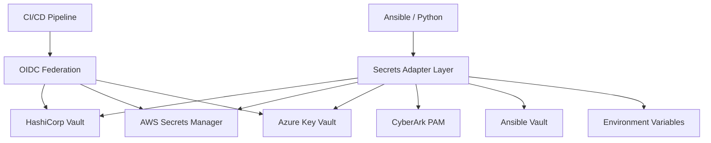

**Diagram sources**
- [README.md:339-357](file://README.md#L339-L357)

**Section sources**
- [README.md:339-357](file://README.md#L339-L357)

### Inventory Design
Devices are organized by environment, role, region, and vendor. Each inventory entry defines connectivity and metadata used by playbooks and roles.

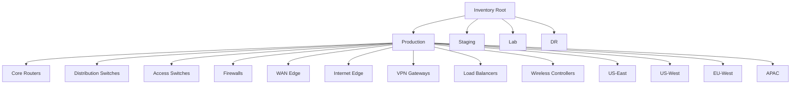

**Diagram sources**
- [README.md:288-309](file://README.md#L288-L309)

**Section sources**
- [README.md:284-335](file://README.md#L284-L335)

### CI/CD Pipeline
All pipelines are defined in GitHub Actions and follow a strict validation and deployment flow:
- Lint and format checks
- YAML schema validation
- Secrets scanning
- Security scanning
- Unit and integration tests
- Molecule role tests
- Template rendering validation
- Compliance policy checks
- Ansible dry run
- Manual approval gate
- Automated deployment
- Post-deploy verification
- Auto-rollback on failure

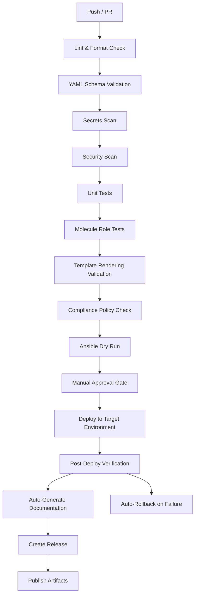

**Diagram sources**
- [README.md:483-501](file://README.md#L483-L501)

**Section sources**
- [README.md:479-514](file://README.md#L479-L514)